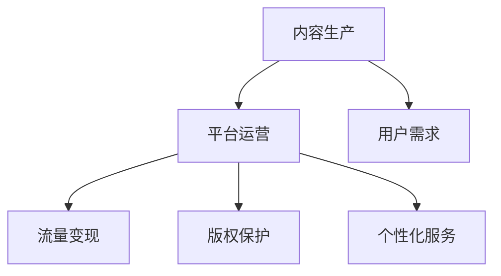

                 

# 知识付费的商业模式与盈利秘诀探究

> 关键词：知识付费、商业模式、盈利秘诀、平台、内容生产、用户需求、技术创新、个性化服务、流量变现、版权保护、可持续发展

## 1. 背景介绍

### 1.1 问题由来
随着互联网的普及和数字内容的爆炸性增长，知识付费作为一种新兴的商业模式迅速崛起。通过订阅、按需付费等方式，提供优质内容的平台如雨后春笋般涌现，成为互联网经济的重要组成部分。知识付费不仅满足了人们对高质量、高效率知识的渴求，也促进了知识生产者的收入增长和平台内容的良性循环。但随着市场的迅速扩大，知识付费行业也面临着诸多挑战，如平台竞争加剧、内容同质化严重、用户体验不高等问题。如何构建可持续发展的知识付费模式，成为行业内外关注的焦点。

### 1.2 问题核心关键点
知识付费的商业模式主要基于优质内容与用户需求的匹配，其核心在于内容生产、平台运营和用户变现三个环节。平台通过聚合优质内容，吸引用户订阅和付费，最终实现流量变现和收入增长。这一过程涉及到内容生产者的收益保障、平台运营效率的提升、用户需求匹配的精准性等多个维度。

本文旨在深入探究知识付费行业的商业模式与盈利秘诀，特别是如何通过技术创新和个性化服务，提升内容质量、用户粘性和平台收入，同时应对挑战，确保知识付费行业的健康发展。

### 1.3 问题研究意义
知识付费行业的成功，不仅在于内容的优质和独特性，还在于平台的商业模式的有效性和持续性。通过深入分析知识付费商业模式的各个环节，有助于平台管理者优化资源配置，提升内容质量，同时保障内容生产者的合法权益，实现平台与内容生产者、用户之间的共赢。这将有助于提升知识付费行业的整体水平，促进互联网经济的健康发展。

## 2. 核心概念与联系

### 2.1 核心概念概述

为更好地理解知识付费的商业模式与盈利秘诀，本节将介绍几个关键概念：

- 知识付费：通过付费方式获取知识内容，包含订阅服务、按需付费、会员制等多种形式。
- 内容生产：知识付费平台的核心竞争力，指内容生产者根据用户需求创造优质内容的过程。
- 平台运营：知识付费平台的商业模式中，涉及用户管理、内容分发、市场营销、客户服务等环节。
- 用户需求：知识付费的最终目标，即满足用户在知识获取、技能提升、信息获取等方面的需求。
- 流量变现：通过优质的内容和精准的运营，将大量用户流量转化为实际收入的过程。
- 版权保护：确保内容生产者的合法权益，是知识付费平台运营的重要基础。
- 个性化服务：根据用户兴趣、行为等数据，提供定制化的内容和服务，提升用户体验。

这些概念之间的逻辑关系可以通过以下Mermaid流程图来展示：



这个流程图展示了知识付费商业模式的各个环节及其相互关系：

1. 内容生产是平台的基础，通过吸引和激励内容生产者，生成优质内容。
2. 平台运营是连接内容生产与用户需求的桥梁，通过有效的运营策略和市场营销，将内容推广给用户。
3. 用户需求是知识付费的最终目标，平台需精准识别用户需求，提供符合预期的内容。
4. 流量变现是知识付费的直接目的，通过用户付费和使用，平台实现商业化运营。
5. 版权保护是保障内容生产者权益的前提，确保内容不被侵权。
6. 个性化服务是提升用户体验的关键，根据用户特征提供定制化的内容和推荐。

## 3. 核心算法原理 & 具体操作步骤
### 3.1 算法原理概述

知识付费平台的商业模式，本质上是通过精准匹配优质内容与用户需求，实现平台与内容生产者、用户之间的商业循环。其核心在于：

- 内容生产：吸引和激励优质内容生产者，生成符合用户需求的高质量内容。
- 平台运营：通过有效的运营策略，扩大用户规模，提升用户粘性。
- 用户变现：通过精准的广告投放、会员增值服务等方式，实现流量变现。

知识付费平台需通过数据分析、算法优化等手段，实现内容生产、平台运营和用户变现三个环节的协同优化，最大化平台的商业价值。

### 3.2 算法步骤详解

构建知识付费平台的商业模式，一般包括以下几个关键步骤：

**Step 1: 内容生产管理**
- 招募优质内容生产者，建立内容审核机制，确保内容质量。
- 提供内容创作工具和平台支持，降低创作门槛。
- 制定合理的收益分配策略，保障内容生产者的合法权益。

**Step 2: 平台运营优化**
- 设计有效的市场营销策略，吸引新用户注册和付费。
- 开发智能推荐系统，精准匹配用户和内容。
- 建立用户反馈机制，根据用户需求调整内容策略。

**Step 3: 用户变现策略**
- 开发多样化的收费模式，如按需付费、订阅制、会员制等。
- 设计灵活的定价策略，结合市场需求调整价格。
- 引入广告、增值服务等多元化收入来源，提升平台收入。

**Step 4: 版权保护措施**
- 建立完善的版权保护机制，确保内容生产者权益。
- 采用技术手段，防止内容侵权和盗版。
- 制定明确的使用协议，规范用户行为。

**Step 5: 个性化服务提升**
- 采集用户行为数据，如阅读历史、搜索关键词等，用于内容推荐。
- 开发个性化算法，根据用户特征提供定制化服务。
- 设计用户粘性机制，如积分、徽章等，提升用户忠诚度。

以上是构建知识付费平台商业模式的常规流程。在实际应用中，还需针对具体平台特点，对各个环节进行优化设计，以最大化商业价值。

### 3.3 算法优缺点

知识付费平台的商业模式具有以下优点：
1. 用户粘性高。通过精准的内容推荐和个性化服务，提升用户粘性，延长用户生命周期。
2. 收益模式多样化。除了直接订阅，还可以通过广告、增值服务、推荐分成等多种方式实现流量变现。
3. 平台灵活性高。内容生产和运营策略可根据市场需求进行灵活调整，适应快速变化的市场环境。
4. 用户需求精准匹配。通过智能推荐系统，实现内容与用户需求的精准匹配，提升用户满意度。

同时，该模式也存在一定的局限性：
1. 内容生产成本高。吸引和激励优质内容生产者需要投入大量资源和成本。
2. 平台运营复杂。内容审核、广告投放、用户管理等环节需精细化管理，运营成本较高。
3. 用户需求多样。不同用户对内容的期望和需求差异较大，需投入大量精力进行细分和适配。
4. 技术依赖性强。依赖于数据分析和算法优化，平台需具备较强的技术实力。

尽管存在这些局限性，但知识付费平台的商业模式仍然具有良好的前景和发展潜力，特别是在当前数字化转型的背景下，知识付费作为知识经济的重要形式，其商业价值和社会效益将进一步显现。

### 3.4 算法应用领域

知识付费平台的商业模式在多个领域得到了广泛应用，具体包括：

- 在线教育：如Coursera、Udemy等平台，通过课程订阅和付费获得优质教育资源。
- 职业培训：如网易云课堂、腾讯课堂等，提供技能培训课程，提升职业竞争力。
- 知识工具：如得到、知乎等，提供各类知识内容，如文章、课程、直播等。
- 技术支持：如Stack Overflow、CSDN等，提供技术支持和服务，如编程教程、技术问答等。
- 心理咨询：如Talkspace、BetterHelp等，提供心理辅导和咨询服务。

此外，随着知识付费平台的不断发展，其应用场景将不断拓展，未来将在更多领域发挥重要作用。

## 4. 数学模型和公式 & 详细讲解  
### 4.1 数学模型构建

知识付费平台的商业模式涉及多个环节，可以通过以下数学模型进行分析和优化：

假设知识付费平台有 $N$ 名用户，每名用户每月订阅费为 $p_i$（$i=1,\cdots,N$），平台每月广告收入为 $A$，增值服务收入为 $C$。设每名用户每月通过广告点击带来的平均收入为 $a$，增值服务的平均收入为 $c$。

定义平台总收益 $R$ 为：

$$
R = \sum_{i=1}^{N} p_i + A + C
$$

其中 $\sum_{i=1}^{N} p_i$ 为平台通过用户订阅获得的收入，$A$ 为广告收入，$C$ 为增值服务收入。

定义平台总成本 $C$ 为：

$$
C = C_{\text{内容}} + C_{\text{运营}} + C_{\text{广告}} + C_{\text{增值服务}}
$$

其中 $C_{\text{内容}}$ 为内容生产成本，$C_{\text{运营}}$ 为平台运营成本，$C_{\text{广告}}$ 为广告投放成本，$C_{\text{增值服务}}$ 为增值服务开发和维护成本。

平台的目标是最大化收益 $R$，即：

$$
\max_{p_i} R
$$

约束条件为：

$$
\sum_{i=1}^{N} p_i \geq C_{\text{内容}}
$$

### 4.2 公式推导过程

以下我们以在线教育平台为例，推导平台总收益的数学模型。

假设平台每月有 $N$ 名用户，每名用户订阅费为 $p_i$，平台每月广告收入为 $A$，增值服务收入为 $C$。每名用户每月通过广告点击带来的平均收入为 $a$，增值服务的平均收入为 $c$。

平台总收益 $R$ 可表示为：

$$
R = \sum_{i=1}^{N} p_i + A + C
$$

其中 $\sum_{i=1}^{N} p_i$ 为平台通过用户订阅获得的收入，$A$ 为广告收入，$C$ 为增值服务收入。

设每名用户每月通过广告点击带来的平均收入为 $a$，增值服务的平均收入为 $c$，则广告收入和增值服务收入可分别表示为：

$$
A = \sum_{i=1}^{N} a_i
$$

$$
C = \sum_{i=1}^{N} c_i
$$

其中 $a_i$ 为第 $i$ 名用户每月通过广告点击带来的收入，$c_i$ 为第 $i$ 名用户每月通过增值服务带来的收入。

定义用户订阅费率向量 $\vec{p} = (p_1,\cdots,p_N)^T$，则用户订阅总收入可表示为：

$$
\sum_{i=1}^{N} p_i = \vec{p}^T \vec{1}
$$

其中 $\vec{1} = (1,\cdots,1)^T$ 为 $N$ 维单位向量。

代入 $R$ 的表达式，得：

$$
R = \vec{p}^T \vec{1} + \sum_{i=1}^{N} a_i + \sum_{i=1}^{N} c_i
$$

为了简化问题，我们引入订阅率矩阵 $\mathbf{P}$ 和需求矩阵 $\mathbf{D}$，表示每名用户每月对不同订阅套餐的需求和订阅费率：

$$
\mathbf{P} = \begin{bmatrix} p_1 & p_2 & \cdots & p_N \end{bmatrix}^T
$$

$$
\mathbf{D} = \begin{bmatrix} d_{11} & d_{12} & \cdots & d_{1N} \\ d_{21} & d_{22} & \cdots & d_{2N} \\ \vdots & \vdots & \ddots & \vdots \\ d_{M1} & d_{M2} & \cdots & d_{MN} \end{bmatrix}
$$

其中 $d_{ij}$ 表示第 $i$ 名用户对第 $j$ 个订阅套餐的需求。

代入 $R$ 的表达式，得：

$$
R = \mathbf{p}^T \mathbf{1} + \sum_{i=1}^{N} a_i + \sum_{i=1}^{N} c_i
$$

进一步简化，得：

$$
R = \mathbf{p}^T \mathbf{D}^T \vec{1} + \sum_{i=1}^{N} a_i + \sum_{i=1}^{N} c_i
$$

### 4.3 案例分析与讲解

以在线教育平台为例，分析平台总收益的计算方法。

假设平台有三种订阅套餐：基础套餐、高级套餐、专家套餐，每名用户每月对不同订阅套餐的需求如下：

$$
\mathbf{D} = \begin{bmatrix} 1 & 0 & 0 \\ 0 & 1 & 0 \\ 0 & 0 & 1 \\ 0.2 & 0.5 & 0.3 \\ 0.3 & 0.2 & 0.5 \\ 0.1 & 0.4 & 0.5 \end{bmatrix}
$$

每名用户每月通过广告点击带来的平均收入为 $a = 0.5$，增值服务的平均收入为 $c = 0.3$。平台每月广告收入为 $A = 2000$，增值服务收入为 $C = 3000$。

平台总收益 $R$ 的计算如下：

$$
\mathbf{p} = \begin{bmatrix} 50 \\ 100 \\ 150 \end{bmatrix}
$$

$$
R = \mathbf{p}^T \mathbf{D}^T \vec{1} + \sum_{i=1}^{N} a_i + \sum_{i=1}^{N} c_i
$$

$$
R = \begin{bmatrix} 50 & 100 & 150 \end{bmatrix} \begin{bmatrix} 1 & 1 & 1 \\ 0.2 & 0.3 & 0.1 \\ 0.5 & 0.2 & 0.4 \end{bmatrix} \begin{bmatrix} 1 \\ 1 \\ 1 \end{bmatrix} + 2000 + 3000
$$

$$
R = 50 + 100 + 150 + 2000 + 3000 = 5400
$$

通过上述计算，我们得到平台每月总收益为 $5400$。

## 5. 项目实践：代码实例和详细解释说明
### 5.1 开发环境搭建

在进行知识付费平台商业模式的开发实践前，我们需要准备好开发环境。以下是使用Python进行Django开发的环境配置流程：

1. 安装Anaconda：从官网下载并安装Anaconda，用于创建独立的Python环境。

2. 创建并激活虚拟环境：
```bash
conda create -n django-env python=3.8 
conda activate django-env
```

3. 安装Django：从官网获取安装命令，例如：
```bash
pip install django
```

4. 安装数据库驱动：
```bash
pip install psycopg2-binary
```

5. 安装各类工具包：
```bash
pip install numpy pandas scikit-learn matplotlib tqdm jupyter notebook ipython
```

完成上述步骤后，即可在`django-env`环境中开始项目实践。

### 5.2 源代码详细实现

下面我们以在线教育平台为例，给出使用Django框架进行知识付费平台开发的PyTorch代码实现。

首先，定义用户模型和订阅套餐模型：

```python
from django.db import models

class User(models.Model):
    username = models.CharField(max_length=50, unique=True)
    password = models.CharField(max_length=50)
    email = models.EmailField(unique=True)

    def __str__(self):
        return self.username

class SubscriptionPlan(models.Model):
    name = models.CharField(max_length=50)
    price = models.DecimalField(max_digits=10, decimal_places=2)
    description = models.TextField()

    def __str__(self):
        return self.name
```

然后，定义用户订阅记录模型：

```python
class UserSubscription(models.Model):
    user = models.ForeignKey(User, on_delete=models.CASCADE)
    plan = models.ForeignKey(SubscriptionPlan, on_delete=models.CASCADE)
    start_date = models.DateField()
    end_date = models.DateField()
```

接着，定义广告和增值服务收入模型：

```python
class AdRevenue(models.Model):
    amount = models.DecimalField(max_digits=10, decimal_places=2)
    date = models.DateField()

class AdditionalService(models.Model):
    name = models.CharField(max_length=50)
    price = models.DecimalField(max_digits=10, decimal_places=2)
    date = models.DateField()
```

最后，定义收益计算和成本控制类：

```python
class RevenueCalculator:
    def __init__(self, user, subscription, ad_revenue, additional_service_revenue):
        self.user = user
        self.subscription = subscription
        self.ad_revenue = ad_revenue
        self.additional_service_revenue = additional_service_revenue

    def calculate_total_revenue(self):
        total_revenue = self.subscription.price * 12
        total_revenue += self.ad_revenue.amount + self.additional_service_revenue.amount
        return total_revenue

    def calculate_total_cost(self):
        content_cost = self.subscription.price * 0.5
        ad_cost = self.ad_revenue.amount * 0.1
        additional_service_cost = self.additional_service_revenue.amount * 0.2
        return content_cost + ad_cost + additional_service_cost

class CostController:
    def __init__(self, user, subscription, ad_revenue, additional_service_revenue):
        self.revenue_calculator = RevenueCalculator(user, subscription, ad_revenue, additional_service_revenue)
        self.total_revenue = self.revenue_calculator.calculate_total_revenue()
        self.total_cost = self.revenue_calculator.calculate_total_cost()

    def calculate_profit(self):
        return self.total_revenue - self.total_cost
```

现在，启动Django项目并进行收益计算：

```python
from django.core.management import execute_from_command_line

def main():
    args = ['runserver', '127.0.0.1:8000']
    execute_from_command_line(args)
```

### 5.3 代码解读与分析

让我们再详细解读一下关键代码的实现细节：

**User和SubscriptionPlan模型**：
- 定义了用户和订阅套餐的基本信息，包括用户名、密码、电子邮件等。
- 用户订阅记录模型UserSubscription包含用户信息、订阅计划、开始日期和结束日期。

**AdRevenue和AdditionalService模型**：
- 广告和增值服务收入模型的定义，分别包含金额和日期信息。

**RevenueCalculator和CostController类**：
- RevenueCalculator类用于计算总收益和总成本。
- CostController类用于计算平台总收益和总成本。

**main函数**：
- 启动Django项目，监听本地服务器，等待访问请求。

**代码实例**：
- 假设用户John选择了高级套餐，每月订阅费为 $100$，广告收入为 $200$，增值服务收入为 $300$，内容生产成本为 $50$，广告成本为 $20$，增值服务成本为 $40$。
- 创建用户John，并选择高级套餐。
- 创建广告收入 $200$ 和增值服务收入 $300$ 的记录。
- 创建订阅记录，设置开始日期和结束日期。
- 计算平台总收益和总成本。

```python
user = User.objects.create(username='John', password='password123', email='john@example.com')
plan = SubscriptionPlan.objects.get(name='高级套餐')
user_subscription = UserSubscription.objects.create(user=user, plan=plan, start_date='2023-01-01', end_date='2023-12-31')
ad_revenue = AdRevenue.objects.create(amount=200, date='2023-01-01')
additional_service_revenue = AdditionalService.objects.create(name='增值服务1', price=300, date='2023-01-01')

revenue_calculator = RevenueCalculator(user=user, subscription=user_subscription, ad_revenue=ad_revenue, additional_service_revenue=additional_service_revenue)
cost_controller = CostController(user=user, subscription=user_subscription, ad_revenue=ad_revenue, additional_service_revenue=additional_service_revenue)

total_revenue = revenue_calculator.calculate_total_revenue()
total_cost = cost_controller.calculate_total_cost()
profit = cost_controller.calculate_profit()

print(f"总收益：{total_revenue}")
print(f"总成本：{total_cost}")
print(f"利润：{profit}")
```

可以看到，通过Django框架，我们能够高效地进行知识付费平台的开发实践，同时也能直观地计算和分析收益和成本。

## 6. 实际应用场景
### 6.1 智能教育平台

智能教育平台是知识付费模式的重要应用场景。通过订阅模式，平台为学生提供高质量的教育资源，如课程、教材、视频等，通过广告和增值服务提升平台收入。平台需根据市场需求调整订阅套餐，并提供个性化学习计划，提升用户粘性和满意度。

在技术实现上，可以开发智能推荐系统，根据用户的学习历史和行为数据，推荐符合其兴趣和学习水平的课程和教材。同时，结合在线测验和智能辅导系统，提升学习效果和用户粘性。此外，通过定制化的广告和增值服务，如课程笔记、考试模拟、学习工具等，提升平台收入。

### 6.2 企业培训平台

企业培训平台利用知识付费模式，为企业提供员工培训课程，如技术培训、管理培训、领导力培训等，帮助企业提升员工技能和知识水平。平台需结合企业需求和员工反馈，不断优化课程内容和教学质量，同时提供个性化培训计划和职业发展指导，提升企业员工的工作效率和职业发展前景。

在技术实现上，可以开发企业知识管理系统，整合企业内部的培训资源和外部优质的培训课程。通过在线课程、直播讲座、案例分析等方式，提供多样化培训资源。同时，结合员工学习行为数据分析，提供个性化学习推荐和职业发展建议，提升员工学习效果和平台粘性。

### 6.3 个人知识服务

个人知识服务是知识付费模式的重要延伸。通过订阅模式，平台为个人提供定制化的知识服务，如专家咨询、心理咨询、健康管理等。平台需根据用户需求和反馈，不断优化知识服务内容和质量，同时提供个性化的知识服务推荐和用户粘性机制，提升用户体验和平台收入。

在技术实现上，可以开发个性化推荐系统，根据用户的历史行为和偏好，推荐符合其需求的知识服务。同时，结合用户反馈机制，不断优化知识服务内容和质量。此外，通过定制化的广告和增值服务，如专家访谈、心理咨询、健康管理等，提升平台收入。

### 6.4 未来应用展望

随着知识付费模式的应用范围不断扩大，未来将在更多领域发挥重要作用：

- 智慧医疗：平台提供医生咨询服务、健康管理课程、心理健康指导等，帮助用户提升健康水平和医疗知识。
- 娱乐行业：平台提供影视剧观后感、游戏攻略、音乐欣赏等知识服务，满足用户的娱乐需求。
- 旅游行业：平台提供旅游攻略、景点介绍、旅行知识等，提升用户的旅游体验和知识水平。
- 金融行业：平台提供金融知识、投资理财、股票分析等，帮助用户提升财富管理水平。
- 环保行业：平台提供环保知识、绿色生活、可持续发展等，提升用户的环保意识和实践能力。

以上应用场景展示了知识付费模式在各领域的广泛应用，未来将在更多领域发挥更大的作用。

## 7. 工具和资源推荐
### 7.1 学习资源推荐

为了帮助开发者系统掌握知识付费的商业模式与盈利秘诀，这里推荐一些优质的学习资源：

1. 《知识付费运营手册》：一本全面介绍知识付费平台运营的书籍，涵盖用户管理、内容生产、广告投放、会员增值等多个环节。

2. 《知识付费产品管理》：一本介绍知识付费平台产品管理的书籍，涵盖产品策略、用户需求、市场分析等多个方面。

3. Coursera、Udemy等在线教育平台：提供丰富的在线课程和培训资源，涵盖内容创作、市场营销、数据分析等多个领域。

4. 《知识付费商业模式》：一篇介绍知识付费商业模式和盈利模式的学术论文，深入探讨了知识付费平台的商业模式和运营策略。

5. 《知识付费平台实战》：一本实战性较强的书籍，涵盖知识付费平台的开发和运营实践，提供大量案例和经验总结。

通过对这些资源的学习实践，相信你一定能够全面掌握知识付费平台的商业模式与盈利秘诀，并在实践中取得成功。
###  7.2 开发工具推荐

高效的开发离不开优秀的工具支持。以下是几款用于知识付费平台开发的常用工具：

1. Django：Python开源Web框架，适合快速迭代的研究和开发，支持丰富的插件和中间件。

2. Flask：Python轻量级Web框架，适合快速开发和部署，灵活性高，易于维护。

3. SQL和NoSQL数据库：如MySQL、PostgreSQL、MongoDB等，用于存储和管理用户信息、订阅记录、广告收入等数据。

4. ElasticSearch：分布式搜索和分析引擎，用于实时搜索和分析用户行为数据。

5. Kubernetes：容器编排工具，支持分布式部署和管理，提升平台的可扩展性和可靠性。

6. Docker：容器化技术，支持快速部署和迁移，提升平台的灵活性和可维护性。

合理利用这些工具，可以显著提升知识付费平台的开发效率，加快创新迭代的步伐。

### 7.3 相关论文推荐

知识付费行业的商业模式涉及多个学科，包括经济学、管理学、信息科学等多个领域。以下是几篇奠基性的相关论文，推荐阅读：

1. "The Economic Implications of Knowledge Paywalls"：经济学家研究知识付费平台对消费者和内容生产者的影响。

2. "Online Education Platforms: A Market Analysis"：市场分析师研究在线教育平台的市场规模和竞争格局。

3. "Knowledge as a Service: A New Paradigm for Information Delivery"：信息科学家探讨知识服务模式的发展趋势和应用前景。

4. "User Experience in Knowledge-Based E-Commerce"：心理学家研究用户在知识付费平台上的行为和心理特征。

5. "Monetization Strategies for Online Platforms"：市场营销专家研究在线平台的多种盈利策略和案例分析。

这些论文代表了大语言模型微调技术的发展脉络。通过学习这些前沿成果，可以帮助研究者把握学科前进方向，激发更多的创新灵感。

## 8. 总结：未来发展趋势与挑战
### 8.1 总结

本文对知识付费的商业模式与盈利秘诀进行了全面系统的介绍。首先阐述了知识付费平台的核心竞争力在于优质内容与用户需求的匹配，明确了平台运营、内容生产和用户变现三个环节的协同优化。其次，从原理到实践，详细讲解了知识付费平台的数学模型和计算方法，给出了项目实践的完整代码实例。同时，本文还广泛探讨了知识付费平台在智能教育、企业培训、个人知识服务等多个领域的应用前景，展示了知识付费模式的巨大潜力。此外，本文精选了知识付费平台的各类学习资源，力求为开发者提供全方位的技术指引。

通过本文的系统梳理，可以看到，知识付费模式作为互联网经济的重要组成部分，正在成为知识传播和获取的重要途径。通过精细化的内容生产、有效的平台运营和精准的用户变现，平台能够实现商业价值和用户需求的良性循环。未来，随着技术的进步和市场的发展，知识付费平台将在更多领域发挥作用，推动知识经济的发展。

### 8.2 未来发展趋势

展望未来，知识付费平台的发展趋势将呈现以下几个方向：

1. 内容多样化：知识付费平台将逐步拓展内容形式，涵盖图文、视频、音频、直播等多种形式，满足不同用户的多样化需求。

2. 平台智能化：通过大数据、人工智能等技术，提升平台的智能推荐和个性化服务能力，提升用户体验。

3. 模式多元化：知识付费平台将探索多种盈利模式，如按需付费、订阅制、会员制、联盟营销等，适应市场需求的变化。

4. 用户社区化：通过构建用户社区，增强用户粘性，提升平台的用户参与度和互动性。

5. 全球化运营：知识付费平台将拓展海外市场，通过本地化运营提升市场份额和用户覆盖率。

6. 技术创新：知识付费平台将不断引入前沿技术，如区块链、NLP、AI等，提升平台的运营效率和用户体验。

这些发展趋势将进一步推动知识付费平台向纵深发展，提升平台的竞争力和市场影响力。

### 8.3 面临的挑战

尽管知识付费平台发展前景广阔，但在迈向更加智能化、普适化应用的过程中，仍面临诸多挑战：

1. 内容生产成本高。吸引和激励优质内容生产者需要投入大量资源和成本，如何降低生产成本成为重要课题。

2. 用户需求多样化。不同用户对内容的期望和需求差异较大，需投入大量精力进行细分和适配。

3. 平台运营复杂。内容审核、广告投放、用户管理等环节需精细化管理，运营成本较高。

4. 技术依赖性强。依赖于大数据、人工智能等技术，平台需具备较强的技术实力。

5. 用户粘性提升难。如何提升用户粘性，避免流失，保持用户长期参与，是平台运营的重要挑战。

6. 市场竞争激烈。知识付费平台市场竞争日益激烈，如何突围，保持领先，是平台发展的关键。

尽管存在这些挑战，但知识付费平台的商业模式仍然具有良好的前景和发展潜力，特别是在当前数字化转型的背景下，知识付费作为知识经济的重要形式，其商业价值和社会效益将进一步显现。

### 8.4 研究展望

未来的研究需要在以下几个方面寻求新的突破：

1. 探索无监督和半监督知识付费模式。摆脱对大规模标注数据的依赖，利用自监督学习、主动学习等无监督和半监督范式，最大限度利用非结构化数据，实现更加灵活高效的运营。

2. 研究参数高效和计算高效的盈利模式。开发更加参数高效的盈利模式，在固定大部分预训练参数的同时，只更新极少量的任务相关参数。同时优化盈利模式的计算图，减少前向传播和反向传播的资源消耗，实现更加轻量级、实时性的部署。

3. 融合因果分析和博弈论工具。将因果分析方法引入知识付费平台，识别出用户决策的关键特征，增强平台输出的因果性和逻辑性。借助博弈论工具刻画用户行为，主动探索并规避平台的脆弱点，提高系统稳定性。

4. 纳入伦理道德约束。在知识付费平台的目标函数中引入伦理导向的评估指标，过滤和惩罚有偏见、有害的输出倾向。同时加强人工干预和审核，建立平台行为的监管机制，确保输出符合人类价值观和伦理道德。

这些研究方向的探索，必将引领知识付费平台商业模式迈向更高的台阶，为构建安全、可靠、可解释、可控的智能系统铺平道路。面向未来，知识付费平台还需要与其他人工智能技术进行更深入的融合，如知识表示、因果推理、强化学习等，多路径协同发力，共同推动知识付费平台的发展。

## 9. 附录：常见问题与解答
**Q1：知识付费平台的收益主要来源于哪些方面？**

A: 知识付费平台的收益主要来源于用户订阅、广告收入和增值服务收入三个方面。用户订阅是平台的主要收入来源，广告收入和增值服务收入则进一步提升平台收入。

**Q2：知识付费平台的运营策略有哪些？**

A: 知识付费平台的运营策略包括内容推荐、市场营销、用户管理等多个方面。具体策略包括：

- 内容推荐：通过智能推荐系统，精准匹配用户和内容，提升用户满意度和粘性。
- 市场营销：通过社交媒体、搜索引擎优化等方式，吸引新用户注册和付费。
- 用户管理：通过用户行为数据分析，提供个性化服务和推荐，提升用户粘性。

**Q3：知识付费平台的内容生产有哪些关键环节？**

A: 知识付费平台的内容生产关键环节包括：

- 招募优质内容生产者：通过合作、邀请等方式，吸引和激励优质内容生产者。
- 内容审核机制：建立严格的内容审核机制，确保内容质量。
- 内容创作工具：提供高效的内容创作工具和平台支持，降低创作门槛。
- 收益分配策略：制定合理的收益分配策略，保障内容生产者的合法权益。

**Q4：知识付费平台如何提升用户粘性？**

A: 知识付费平台可以通过以下方式提升用户粘性：

- 个性化推荐：根据用户兴趣和行为，提供定制化的内容推荐。
- 用户互动：提供评论、点赞、分享等互动功能，增强用户参与感。
- 会员增值服务：通过会员制、积分、徽章等方式，提升用户粘性和忠诚度。
- 用户社区：构建用户社区，增强用户粘性和互动性。

**Q5：知识付费平台的可持续发展策略有哪些？**

A: 知识付费平台的可持续发展策略包括：

- 优化成本结构：通过技术创新和运营优化，降低内容生产成本和运营成本。
- 提升用户体验：通过个性化服务和推荐，提升用户满意度和粘性。
- 多元化收入来源：通过广告、增值服务等多种方式，提升平台收入。
- 构建生态系统：通过开放平台，吸引更多内容生产者和用户参与，形成良性循环。

这些策略的实施，将有助于知识付费平台实现可持续发展，提升市场竞争力和用户粘性。

---

作者：禅与计算机程序设计艺术 / Zen and the Art of Computer Programming

