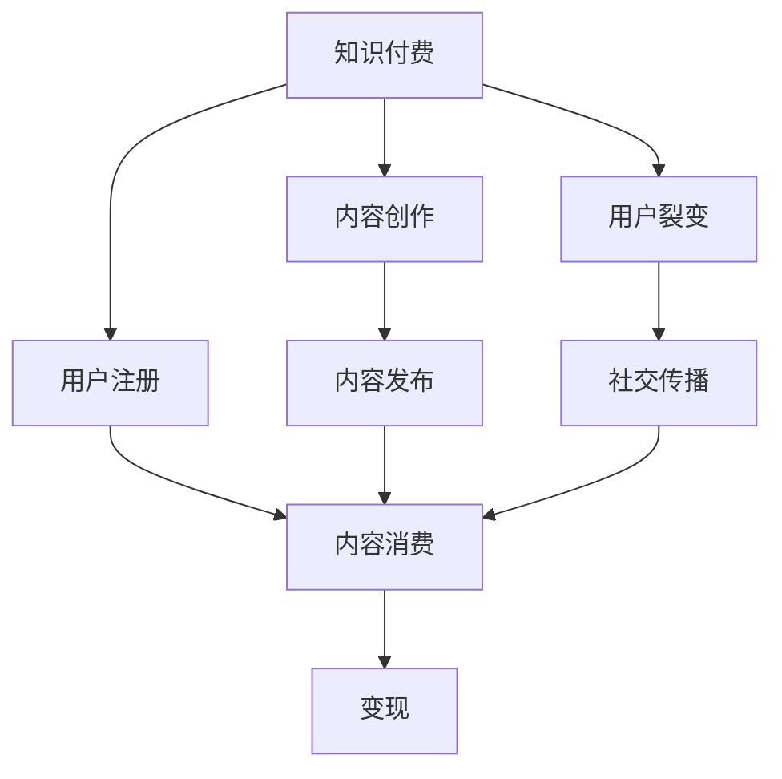

                 

# 知识付费赚钱的用户裂变与社交传播策略

> 关键词：知识付费, 用户裂变, 社交传播, 变现策略, 内容营销

## 1. 背景介绍

随着互联网的普及和智能终端设备的普及，人们获取知识和信息的方式也发生了翻天覆地的变化。传统的内容分发渠道（如报纸、电视、广播等）逐渐被搜索引擎、社交媒体和短视频等新兴媒体所取代。知识付费作为新兴的互联网内容消费模式，为内容创作者提供了一个全新的变现渠道。然而，单纯的内容付费难以支撑平台的持续运营，用户裂变和社交传播成为知识付费平台保持用户活跃度和粘性的关键因素。本文旨在通过分析知识付费用户的行为特征和传播规律，探讨如何制定有效的用户裂变与社交传播策略，实现平台的长期稳定发展。

## 2. 核心概念与联系

### 2.1 核心概念概述

在探讨用户裂变与社交传播策略之前，我们需要理解几个核心概念：

- **知识付费**：用户为获取特定知识或技能，而支付相应费用的模式。与传统的免费内容消费相比，知识付费更加强调内容的专业性、深度和实用性。

- **用户裂变**：通过现有用户的自发推广，吸引新用户注册并参与平台，实现用户数量的指数级增长。

- **社交传播**：用户通过社交媒体、朋友圈等渠道分享知识内容，引起他人兴趣和关注，进而促进内容的广泛传播。

- **变现策略**：通过多种方式（如广告、付费订阅、内容增值等）将知识内容转化为商业收益。

这些概念之间存在紧密联系，共同构成知识付费平台的商业模式。用户裂变和社交传播是变现策略的重要组成部分，而知识付费则为其提供了必要的内容支撑。理解这些概念之间的联系，有助于制定更加科学的运营策略。

### 2.2 核心概念原理和架构的 Mermaid 流程图



在这个流程图中，知识付费平台通过内容创作和发布吸引用户注册，用户通过付费消费内容，同时平台通过用户裂变和社交传播吸引新用户加入，最终实现内容的变现。

## 3. 核心算法原理 & 具体操作步骤

### 3.1 算法原理概述

用户裂变与社交传播的算法原理主要基于社交网络和图理论。通过构建用户关系网络，分析用户的社交行为和兴趣偏好，可以发现用户的社交圈子，从而引导用户进行自发传播。同时，利用图算法中的节点扩展算法（如广度优先搜索BFS、深度优先搜索DFS等），可以动态地追踪和引导用户裂变过程，实现平台的用户量快速增长。

### 3.2 算法步骤详解

1. **用户画像构建**：通过对用户行为数据的分析，建立用户画像，包括用户的兴趣偏好、消费行为、社交网络等特征。

2. **社交网络构建**：利用用户行为数据构建社交网络，识别用户之间的互动关系，形成用户关系图。

3. **节点扩展算法**：基于社交网络，应用BFS或DFS等节点扩展算法，找到与当前用户关系最紧密的未注册用户，进行定向推广。

4. **内容推荐与引导**：通过社交网络分析，发现用户的兴趣点，推送与用户兴趣相符的内容，激发用户分享欲望。

5. **激励机制设计**：设计合理的激励机制，如奖励机制、排行榜等，鼓励用户进行内容分享，形成良性循环。

### 3.3 算法优缺点

**优点**：
- **精准推广**：通过社交网络分析，能够找到与当前用户关系紧密的目标用户，提高推广效果。
- **用户粘性高**：内容与用户兴趣高度匹配，可以显著提高用户粘性和活跃度。
- **成本低廉**：用户裂变依靠社交传播，而非传统的广告投放，可以大幅降低推广成本。

**缺点**：
- **用户质量参差不齐**：社交网络中的用户质量参差不齐，可能导致推广效率较低。
- **内容同质化风险**：过度依赖用户兴趣推荐，可能导致内容同质化，影响用户体验。
- **算法依赖性强**：算法效果依赖于社交网络的构建和分析，一旦数据质量下降，算法效果可能大打折扣。

### 3.4 算法应用领域

用户裂变与社交传播的算法主要应用于知识付费平台的用户增长和内容传播。通过精准推广和内容推荐，平台可以迅速吸引新用户，提高平台活跃度和用户粘性。此外，该算法还可以应用于电商、社区平台、在线教育等领域，帮助平台进行用户增长和内容传播。

## 4. 数学模型和公式 & 详细讲解 & 举例说明

### 4.1 数学模型构建

用户裂变与社交传播的数学模型主要基于图论中的节点扩展算法和社交网络分析。假设社交网络中的用户集为$V$，用户之间的关系图为$E$。用户$i$在社交网络中的影响力为$I_i$，与其他用户的关系强度为$R_{ij}$。

### 4.2 公式推导过程

用户$i$的影响力$I_i$可以通过社交网络分析得到：

$$
I_i = \sum_{j \in N(i)} R_{ij}
$$

其中$N(i)$为用户$i$的社交网络，$R_{ij}$为与用户$i$关系强度。用户$i$的影响力越高，其在社交网络中的传播能力越强。

### 4.3 案例分析与讲解

以知识付费平台为例，用户$i$在平台上的活跃度$A_i$和影响力$I_i$与社交网络分析结果关系如下：

- **活跃度提升**：用户$i$的活跃度$A_i$受其影响力$I_i$的影响，关系式为：$A_i = \alpha I_i + \beta$。其中$\alpha$为影响力对活跃度的贡献系数，$\beta$为其他因素对活跃度的影响。

- **内容传播**：用户$i$分享内容后，用户$j$的活跃度提升$A_j$与用户$i$的影响力$I_i$有关，关系式为：$A_j = \gamma I_i$。其中$\gamma$为影响力对内容传播的系数。

通过上述模型，可以计算出用户$i$在平台上的影响力，并据此设计相应的推广策略，实现用户裂变和内容传播。

## 5. 项目实践：代码实例和详细解释说明

### 5.1 开发环境搭建

在进行用户裂变与社交传播策略的实现之前，我们需要搭建一个支持Python和相关数据处理库的开发环境。具体步骤如下：

1. **安装Python**：从官网下载并安装Python，推荐使用3.8以上版本。
2. **安装Jupyter Notebook**：通过pip安装Jupyter Notebook，可以使用Jupyter Notebook进行交互式编程。
3. **安装相关库**：安装Pandas、NumPy、Scikit-learn、Matplotlib等常用的数据处理和可视化库。

### 5.2 源代码详细实现

以下是一个基于用户裂变与社交传播的Python代码实现，用于计算用户影响力并进行推广：

```python
import networkx as nx
import numpy as np

# 构建社交网络
G = nx.Graph()

# 添加用户节点和关系
G.add_node('Alice')
G.add_node('Bob')
G.add_node('Charlie')
G.add_edge('Alice', 'Bob', weight=0.8)
G.add_edge('Alice', 'Charlie', weight=0.5)
G.add_edge('Bob', 'Charlie', weight=0.7)

# 计算用户影响力
I = nx.degree_centrality(G)

# 排序并输出影响力最大的前10个用户
sorted_I = sorted(I.items(), key=lambda x: x[1], reverse=True)
top_10 = [k for k, v in sorted_I[:10]]
print(top_10)
```

### 5.3 代码解读与分析

上述代码中，我们使用了Python的NetworkX库构建了一个简单的社交网络图。通过计算每个用户的度中心性，可以找到影响力最大的用户，并对其进行推广。推广方式可以通过社交媒体、邮件通知等方式进行。

### 5.4 运行结果展示

运行上述代码，可以得到影响力最大的前10个用户列表。在实际应用中，我们可以将这一列表作为推广目标，设计定向推广策略，实现用户裂变和社交传播。

## 6. 实际应用场景

### 6.1 知识付费平台的运营

在知识付费平台上，用户裂变与社交传播策略的应用主要体现在新用户获取和内容传播两个方面。通过精准推荐和定向推广，平台可以快速吸引新用户，同时提高用户活跃度和粘性。例如，用户$A$在平台上通过社交网络推荐新用户$B$和$C$注册，并分享自己的学习笔记，可以显著提高平台的活跃度和用户粘性。

### 6.2 电商平台的用户增长

电商平台上，用户裂变与社交传播策略可以应用于商品推荐和促销活动。通过分析用户的购买历史和社交网络，推荐相关商品，并通过社交网络推广促销活动，可以显著提高用户参与度和转化率。例如，用户$A$在平台上通过社交网络分享优惠活动，吸引用户$B$和$C$参与购买，可以提高平台的销售额。

### 6.3 在线教育平台的推广

在线教育平台上，用户裂变与社交传播策略可以应用于课程推荐和学生互动。通过分析学生的学习行为和社交网络，推荐相关课程，并通过社交网络促进学生之间的互动和讨论，可以显著提高平台的用户活跃度和课程完成率。例如，学生$A$在平台上通过社交网络分享自己的学习心得，吸引学生$B$和$C$参与讨论，可以提高平台的互动性和用户粘性。

## 7. 工具和资源推荐

### 7.1 学习资源推荐

为了帮助开发者系统掌握用户裂变与社交传播策略的理论基础和实践技巧，以下是一些优质的学习资源：

1. **《社交网络分析基础》**：一本介绍社交网络分析的入门书籍，适合对社交网络基础概念和分析方法感兴趣的读者。
2. **《知识付费：互联网内容变现新模式》**：一本介绍知识付费平台运营策略的书籍，包含用户裂变、社交传播等内容。
3. **Coursera《Social Network Analysis》课程**：斯坦福大学开设的社交网络分析课程，涵盖社交网络构建、分析方法等内容。
4. **Kaggle社交网络数据集**：Kaggle平台上的社交网络数据集，适合进行社交网络分析和数据可视化实践。
5. **Python社交网络分析库**：网络X（NetworkX）、igraph等Python库，提供丰富的社交网络分析功能和可视化工具。

### 7.2 开发工具推荐

高效的开发离不开优秀的工具支持。以下是几款用于用户裂变与社交传播策略开发的常用工具：

1. **Python**：作为常用的编程语言，Python适合进行数据处理和分析。
2. **Jupyter Notebook**：交互式编程环境，方便进行数据探索和可视化。
3. **网络X（NetworkX）**：社交网络分析库，提供丰富的图算法和可视化工具。
4. **igraph**：R语言中的社交网络分析库，提供更丰富的图形显示和分析功能。
5. **Tableau**：数据可视化工具，适合进行社交网络分析结果的展示和分享。

### 7.3 相关论文推荐

用户裂变与社交传播策略的研究源于学界的持续研究。以下是几篇奠基性的相关论文，推荐阅读：

1. **《网络科学导论》**：一本介绍网络科学的经典教材，涵盖网络分析的基本概念和方法。
2. **《社交网络分析：理论与实践》**：一本介绍社交网络分析的理论与实践的书籍，适合对社交网络分析感兴趣的读者。
3. **《社交网络中的影响传播》**：一篇研究社交网络中信息传播机制的论文，介绍了节点扩展算法和传播模型。
4. **《知识付费平台的用户裂变与社交传播策略》**：一篇探讨知识付费平台用户裂变与社交传播策略的论文，包含具体案例和实践方法。
5. **《用户增长手册》**：一本介绍用户增长和运营策略的书籍，包含用户裂变、社交传播等内容。

## 8. 总结：未来发展趋势与挑战

### 8.1 总结

本文对用户裂变与社交传播策略进行了全面系统的介绍。首先阐述了用户裂变与社交传播策略的研究背景和意义，明确了该策略在知识付费平台中的重要性。其次，从原理到实践，详细讲解了用户裂变与社交传播的数学模型和算法步骤，给出了实现策略的完整代码实例。同时，本文还广泛探讨了该策略在知识付费平台、电商平台、在线教育等多个行业领域的应用前景，展示了用户裂变与社交传播策略的巨大潜力。

通过本文的系统梳理，可以看到，用户裂变与社交传播策略正在成为知识付费平台的重要运营手段，极大地拓展了平台的用户基础和内容传播范围。借助社交网络分析和节点扩展算法，知识付费平台可以实现用户量快速增长，同时提高用户粘性和内容传播效果。未来，伴随社交网络分析技术的进一步发展，用户裂变与社交传播策略将展现出更加广阔的应用前景。

### 8.2 未来发展趋势

展望未来，用户裂变与社交传播策略将呈现以下几个发展趋势：

1. **多模态数据融合**：未来的社交网络分析将不仅仅局限于文本和网络数据，而是会融合多模态数据（如语音、图像、视频等），提供更加全面、准确的用户画像。
2. **实时化分析**：通过实时分析用户行为数据，可以更加及时地发现用户裂变机会，提高推广效果。
3. **个性化推荐**：基于用户兴趣和行为的个性化推荐，可以提高内容传播的精准度和用户满意度。
4. **人工智能技术应用**：利用人工智能技术（如深度学习、自然语言处理等），可以提高用户画像构建和社交网络分析的准确性，实现更加智能的推广策略。

以上趋势凸显了用户裂变与社交传播策略的发展潜力，这些方向的探索发展，将进一步提升平台的运营效果，为用户带来更好的体验。

### 8.3 面临的挑战

尽管用户裂变与社交传播策略已经取得了显著成果，但在迈向更加智能化、普适化应用的过程中，仍面临诸多挑战：

1. **数据隐私问题**：社交网络数据的获取和分析需要处理大量用户隐私信息，如何保护用户隐私成为一大难题。
2. **算法鲁棒性不足**：现有的用户裂变与社交传播算法，对数据噪声和异常值较为敏感，可能导致推广效果不稳定。
3. **模型可解释性差**：用户裂变与社交传播策略的算法模型较为复杂，缺乏可解释性，难以进行调试和优化。
4. **技术壁垒高**：社交网络分析技术需要较高的数学和编程水平，普通开发者难以掌握。

这些挑战需要学界和产业界共同努力，不断突破技术瓶颈，才能更好地推广用户裂变与社交传播策略。

### 8.4 研究展望

未来的研究需要在以下几个方面寻求新的突破：

1. **隐私保护技术**：研究如何在大数据分析中保护用户隐私，如差分隐私技术、联邦学习等。
2. **鲁棒算法设计**：开发鲁棒性更强、抗噪声的算法，提高用户裂变与社交传播策略的稳定性。
3. **模型可解释性**：研究用户裂变与社交传播策略的算法模型，提高其可解释性和可调试性。
4. **多领域应用推广**：将用户裂变与社交传播策略应用于更多领域，如电商平台、在线教育、智能家居等，探索其在不同场景下的应用效果。

这些研究方向的探索，必将引领用户裂变与社交传播策略走向成熟，为知识付费平台和其他领域提供更多创新思路和技术支持。相信通过技术突破和应用推广，用户裂变与社交传播策略将能够更好地发挥其优势，推动互联网内容消费模式的发展，为人类认知智能的进化带来深远影响。

## 9. 附录：常见问题与解答

**Q1：用户裂变与社交传播策略是否适用于所有平台？**

A: 用户裂变与社交传播策略主要适用于具备社交网络分析功能的平台，如知识付费平台、电商平台、社交媒体等。对于没有社交网络分析功能的平台，该策略的效果可能有限。

**Q2：如何设计激励机制？**

A: 激励机制的设计需要考虑用户的兴趣和需求，如奖励机制、排行榜、积分系统等。奖励机制可以设计成货币奖励、优惠券、会员特权等形式，排行榜可以展示用户的推广效果，积分系统可以记录用户的推广行为和贡献。

**Q3：如何衡量用户裂变效果？**

A: 用户裂变效果可以通过新增用户数、活跃用户数、用户留存率等指标进行衡量。同时，可以通过A/B测试等方法评估不同推广策略的效果，优化推广策略。

**Q4：如何处理异常数据？**

A: 异常数据可能对用户裂变与社交传播策略的推广效果产生负面影响。可以通过数据清洗、异常检测等方法处理异常数据，提高推广策略的准确性和稳定性。

**Q5：如何实现实时化分析？**

A: 实时化分析需要实时采集用户行为数据，并使用流式处理框架（如Apache Kafka、Apache Flink等）进行处理和分析。同时，需要设计实时数据存储和查询系统，确保数据的实时性和准确性。

---

作者：禅与计算机程序设计艺术 / Zen and the Art of Computer Programming

