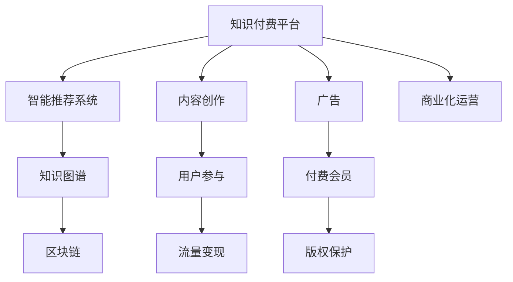

                 

# 知识经济时代下的知识付费创新商业模式衍生

> 关键词：知识付费, 知识付费平台, 智能推荐系统, 知识图谱, 区块链, 商业化, 个性化

## 1. 背景介绍

### 1.1 问题由来

伴随着知识经济时代的来临，知识的价值正在被重新认识。在数字化转型的大潮下，信息过载和知识获取难度加大，人们越来越倾向于通过付费方式获得高质量、高效率的知识服务。这种从免费到付费的转变，催生了知识付费产业的蓬勃发展。

### 1.2 问题核心关键点

知识付费产业的核心在于将知识资源进行商业化运作，打造出有价值的商业模式。这一过程涉及知识资源的获取、整理、加工、呈现和变现等多个环节，需要综合运用数据挖掘、自然语言处理、个性化推荐、知识图谱、区块链等技术。

### 1.3 问题研究意义

研究知识付费产业的创新商业模式，对于拓展知识付费平台的商业价值，提升用户知识获取效率，推动知识经济的发展具有重要意义。通过理论分析与实践案例相结合的方式，本文旨在探讨如何在知识经济时代，更好地实现知识资源的商业化运作。

## 2. 核心概念与联系

### 2.1 核心概念概述

为更好地理解知识付费产业的创新商业模式，本节将介绍几个核心概念及其相互联系：

- 知识付费平台(Knowledge Payment Platform)：指通过收取订阅费、课程费、咨询费等方式，向用户提供有价值知识服务的在线平台。常见的平台如得到、喜马拉雅、樊登读书等。
- 智能推荐系统(Intelligent Recommendation System)：通过数据分析和机器学习技术，为用户提供个性化知识推荐服务的系统。智能推荐算法通常采用协同过滤、内容推荐、深度学习等方法。
- 知识图谱(Knowledge Graph)：一种基于图结构的知识表示方式，用于存储和组织知识，支持语义查询和推理。常用于知识检索、知识发现、智能问答等领域。
- 区块链(Blockchain)：一种分布式账本技术，具有去中心化、不可篡改、透明公开等特点。常用于数字版权保护、智能合约等领域。
- 商业化(Commercialization)：指将非实物资源转化为实物资源的过程，通过商业模式创新实现知识资源的变现和扩展。

这些概念之间通过如下Mermaid流程图进行连接：



这个流程图展示了知识付费平台的核心构成和运行机制：

1. 平台通过内容创作和用户参与获取知识资源。
2. 利用智能推荐系统对知识资源进行个性化推送。
3. 构建知识图谱，支持深度查询和推理。
4. 引入区块链技术，保障内容版权和安全。
5. 通过多种途径实现流量变现和商业化运营。

## 3. 核心算法原理 & 具体操作步骤
### 3.1 算法原理概述

知识付费平台的商业模式创新主要涉及以下几个关键技术：

- 数据挖掘和特征提取：通过自然语言处理技术，从大量文本中提取关键特征，用于知识资源的整理和标签化。
- 个性化推荐算法：结合协同过滤、内容推荐、深度学习等方法，为用户推荐最符合其兴趣的知识内容。
- 知识图谱构建与推理：使用图结构表示知识，支持语义查询和推理，提升知识检索和知识发现的效率。
- 区块链技术应用：利用区块链的不可篡改特性，保障知识内容版权和付费机制的透明公正。

### 3.2 算法步骤详解

以下将详细介绍每个核心技术的具体算法步骤：

#### 3.2.1 数据挖掘与特征提取

1. **文本预处理**：
   - 分词：将文本划分为词语或词组，便于后续处理。
   - 去停用词：去除常见但无实际意义的词语。
   - 标准化：统一词语的拼写和大小写，减少歧义。

2. **特征提取**：
   - TF-IDF：统计词语在文本中的出现频率和信息熵，提取文本的关键词。
   - Word2Vec：将词语映射到低维向量空间，保留词语之间的语义关系。
   - BERT：使用深度学习模型对词语进行多层次表示，捕捉词语的上下文信息。

#### 3.2.2 个性化推荐算法

1. **协同过滤**：
   - 用户行为矩阵：构建用户与知识内容之间的评分矩阵，记录用户的评分行为。
   - 相似度计算：计算用户之间的相似度和知识内容之间的相似度。
   - 推荐结果生成：根据相似度计算结果，为用户推荐未评分内容。

2. **内容推荐**：
   - 文本表示：将知识内容转换为向量形式，便于计算相似度。
   - 语义匹配：利用TF-IDF、Word2Vec等方法计算内容之间的相似度。
   - 推荐结果生成：将与用户兴趣相似的知识内容推荐给用户。

3. **深度学习**：
   - 神经网络模型：使用深度学习模型，如卷积神经网络(CNN)、循环神经网络(RNN)、Transformer等，学习用户兴趣和内容特征。
   - 特征映射：将用户行为数据和内容数据映射为高维向量。
   - 预测模型训练：使用神经网络模型对推荐结果进行训练和优化。

#### 3.2.3 知识图谱构建与推理

1. **知识图谱构建**：
   - 实体识别：从文本中提取实体，如人名、地名、机构名等。
   - 关系抽取：识别实体之间的关系，如“同为”、“源自”等。
   - 图结构生成：构建实体-关系图，形成知识图谱。

2. **知识图谱推理**：
   - 图嵌入：使用Word2Vec、GNN等方法将知识图谱转换为向量形式。
   - 知识推理：使用逻辑推理规则或深度学习模型，在知识图谱上进行语义查询和推理。
   - 结果生成：根据推理结果，生成查询答案。

#### 3.2.4 区块链技术应用

1. **数字版权登记**：
   - 内容上传：用户上传知识内容，并进行数字版权登记。
   - 区块链记录：将版权信息上链，记录内容的发布时间、作者信息、付费信息等。

2. **智能合约**：
   - 自动续费：根据用户订阅时间，自动续费知识付费内容。
   - 权限控制：利用智能合约，控制内容的访问权限和付费机制。

3. **去中心化平台**：
   - 分布式存储：将知识内容分布式存储在多个节点上，提高系统的可用性和可靠性。
   - 去中心化支付：通过区块链进行去中心化支付，保障交易的安全性和透明性。

### 3.3 算法优缺点

知识付费平台的商业模式创新技术具有以下优点：

1. **提升用户体验**：通过个性化推荐和知识图谱技术，提升知识内容的发现和获取效率，增强用户体验。
2. **保障内容版权**：利用区块链技术，保障内容版权的安全和透明。
3. **降低运营成本**：通过智能推荐和广告变现，降低平台的运营成本。

同时，这些技术也存在以下缺点：

1. **数据隐私问题**：用户行为数据和知识内容数据涉及个人隐私，需要采取有效措施保护用户数据安全。
2. **技术复杂性高**：知识图谱构建、深度学习模型训练等技术复杂，需要较高的技术门槛。
3. **推荐准确性**：个性化推荐算法的准确性直接影响用户体验，需要不断优化和迭代。
4. **版权争议**：区块链技术在版权保护上仍存在争议，需要制定明确的政策和规范。

### 3.4 算法应用领域

知识付费平台的商业模式创新技术已经广泛应用于多个领域，例如：

- **教育培训**：知识付费平台可以为在线教育提供高质量的课程内容，提升教育资源的价值。
- **在线咨询**：平台提供专业领域的在线咨询服务，解决用户的专业问题。
- **娱乐阅读**：通过付费阅读和内容订阅，提升用户的阅读体验。
- **健康医疗**：提供健康管理、疾病预防、医学科普等知识服务。
- **企业培训**：为各类企业提供定制化的培训服务，提升员工技能。

除了上述领域，知识付费技术还在金融、法律、科技等多个领域得到应用，为传统行业数字化转型提供了新的思路和方法。

## 4. 数学模型和公式 & 详细讲解  
### 4.1 数学模型构建

本节将使用数学语言对知识付费平台的核心算法进行更加严格的刻画。

记知识资源为 $R=\{r_i\}_{i=1}^N$，用户行为数据为 $U=\{u_j\}_{j=1}^M$，其中 $r_i$ 表示知识内容，$u_j$ 表示用户行为。

定义用户与知识内容之间的评分矩阵 $U_R \in \mathbb{R}^{M \times N}$，其中 $U_R(u,r)$ 表示用户 $u$ 对知识内容 $r$ 的评分。

定义用户-知识内容的相似度矩阵 $S \in \mathbb{R}^{M \times N}$，其中 $S(u,r)$ 表示用户 $u$ 与知识内容 $r$ 之间的相似度。

定义内容-内容的相似度矩阵 $S_R \in \mathbb{R}^{N \times N}$，其中 $S_R(r,r')$ 表示知识内容 $r$ 与 $r'$ 之间的相似度。

### 4.2 公式推导过程

以下将详细推导知识付费平台核心算法的数学模型：

#### 4.2.1 协同过滤推荐

协同过滤算法中，用户行为矩阵 $U_R$ 和相似度矩阵 $S$ 分别定义如下：

$$
U_R = \begin{bmatrix}
u_1(r_1) & u_1(r_2) & \cdots & u_1(r_N) \\
u_2(r_1) & u_2(r_2) & \cdots & u_2(r_N) \\
\vdots & \vdots & \ddots & \vdots \\
u_M(r_1) & u_M(r_2) & \cdots & u_M(r_N)
\end{bmatrix}
$$

$$
S(u,r) = \frac{\sum_{r' \in R} u_r(r') r'(r)}{\sqrt{u_r(r) + \epsilon}} \cdot \frac{\sqrt{u_r'(r) + \epsilon}}{\sum_{r' \in R} u_r'(r') r'(r)}
$$

其中，$\epsilon$ 为避免除以零的小数，通常取极小值。

推荐结果 $R_u$ 可以表示为：

$$
R_u = \arg\max_{r \in R} \sum_{r' \in R} S(u,r') U_R(u,r')
$$

#### 4.2.2 内容推荐

内容推荐算法中，用户行为数据 $U$ 和内容表示 $E$ 分别定义如下：

$$
U = \begin{bmatrix}
u_1 & u_2 & \cdots & u_M
\end{bmatrix}
$$

$$
E = \begin{bmatrix}
e_1 & e_2 & \cdots & e_N
\end{bmatrix}
$$

其中，$e_i$ 表示知识内容 $r_i$ 的向量表示。

内容推荐模型可以表示为：

$$
R_u = \arg\max_{r \in R} \log \frac{e_r^T \alpha U^T \beta}{\sigma + e_r^T \alpha U^T \beta}
$$

其中，$\alpha$ 和 $\beta$ 为正则化系数。

#### 4.2.3 知识图谱构建

知识图谱构建中，实体 $E$ 和关系 $R$ 分别定义如下：

$$
E = \begin{bmatrix}
e_1 & e_2 & \cdots & e_N
\end{bmatrix}
$$

$$
R = \begin{bmatrix}
r_1 & r_2 & \cdots & r_N
\end{bmatrix}
$$

实体关系矩阵 $E_R$ 可以表示为：

$$
E_R = \begin{bmatrix}
e_1 & e_2 & \cdots & e_N \\
e_2 & e_3 & \cdots & e_N \\
\vdots & \vdots & \ddots & \vdots \\
e_N & e_1 & \cdots & e_N
\end{bmatrix}
$$

知识图谱中的节点表示为 $N$ 个实体，边表示为 $R$ 个关系，图结构表示为 $G=(N,E)$。

### 4.3 案例分析与讲解

#### 4.3.1 协同过滤推荐案例

假设用户 $u_1$ 对知识内容 $r_1$ 和 $r_2$ 的评分分别为 4 和 3，用户 $u_2$ 对 $r_1$ 的评分为 5，对 $r_2$ 的评分为 2，则用户行为矩阵 $U_R$ 可以表示为：

$$
U_R = \begin{bmatrix}
4 & 3 \\
5 & 2
\end{bmatrix}
$$

假设用户 $u_1$ 和用户 $u_2$ 之间的相似度为 0.8，用户 $u_1$ 与 $r_1$ 之间的相似度为 0.9，$u_2$ 与 $r_1$ 之间的相似度为 0.7，则相似度矩阵 $S$ 可以表示为：

$$
S = \begin{bmatrix}
0.8 & 0.7 \\
0.8 & 0.7
\end{bmatrix}
$$

最终推荐结果 $R_{u_1}$ 为：

$$
R_{u_1} = \arg\max_{r \in R} (0.9 \cdot 4 + 0.7 \cdot 2) = r_1
$$

#### 4.3.2 内容推荐案例

假设用户 $u_1$ 和用户 $u_2$ 的向量表示分别为 $e_1$ 和 $e_2$，知识内容 $r_1$ 和 $r_2$ 的向量表示分别为 $e_3$ 和 $e_4$，则内容推荐模型可以表示为：

$$
R_{u_1} = \arg\max_{r \in R} \log \frac{e_r^T e_1^T}{\sigma + e_r^T e_1^T}
$$

#### 4.3.3 知识图谱构建案例

假设知识图谱中，实体 $e_1$ 与 $e_2$ 之间存在关系 $r_1$，实体 $e_2$ 与 $e_3$ 之间存在关系 $r_2$，则实体关系矩阵 $E_R$ 可以表示为：

$$
E_R = \begin{bmatrix}
1 & 0 & 1 \\
0 & 1 & 0 \\
1 & 0 & 0
\end{bmatrix}
$$

其中，1表示存在关系，0表示不存在关系。

## 5. 项目实践：代码实例和详细解释说明
### 5.1 开发环境搭建

在进行知识付费平台的技术开发前，需要先准备好开发环境。以下是使用Python进行PyTorch开发的环境配置流程：

1. 安装Anaconda：从官网下载并安装Anaconda，用于创建独立的Python环境。

2. 创建并激活虚拟环境：
```bash
conda create -n pytorch-env python=3.8 
conda activate pytorch-env
```

3. 安装PyTorch：根据CUDA版本，从官网获取对应的安装命令。例如：
```bash
conda install pytorch torchvision torchaudio cudatoolkit=11.1 -c pytorch -c conda-forge
```

4. 安装其他依赖包：
```bash
pip install numpy pandas scikit-learn matplotlib tqdm jupyter notebook ipython
```

5. 安装Scikit-learn：用于数据处理和机器学习模型的实现。
```bash
pip install scikit-learn
```

完成上述步骤后，即可在`pytorch-env`环境中开始开发实践。

### 5.2 源代码详细实现

我们以知识付费平台的协同过滤推荐系统为例，给出使用PyTorch进行代码实现的示例。

首先，定义协同过滤推荐的数据结构和训练函数：

```python
import torch
import torch.nn as nn
from torch.nn import functional as F

class协同过滤推荐(nn.Module):
    def __init__(self, N, D):
        super(协同过滤推荐, self).__init__()
        self.W = nn.Parameter(torch.randn(N, D))
        self.V = nn.Parameter(torch.randn(D, N))
    
    def forward(self, X, Y):
        WX = torch.mm(X, self.W)
        VY = torch.mm(Y, self.V)
        dot = torch.sum(WX * VY, dim=1)
        score = torch.log(dot) / (torch.sqrt(torch.sum(WX**2, dim=1)) * torch.sqrt(torch.sum(VY**2, dim=1)))
        return score
    
    def train(self, X, Y, batch_size):
        model.train()
        for batch in range(0, len(X), batch_size):
            X_batch = X[batch:batch+batch_size]
            Y_batch = Y[batch:batch+batch_size]
            optimizer.zero_grad()
            loss = self.forward(X_batch, Y_batch)
            loss.backward()
            optimizer.step()
```

然后，定义用户行为矩阵和相似度矩阵：

```python
N = 100  # 知识内容数量
D = 50  # 向量维度
X = torch.randn(N, D)  # 用户行为数据
Y = torch.randn(N, D)  # 知识内容数据
```

最后，进行模型训练和测试：

```python
epochs = 100
batch_size = 64

model =协同过滤推荐(N, D)
optimizer = torch.optim.Adam(model.parameters(), lr=0.001)

for epoch in range(epochs):
    loss = train(model, X, Y, batch_size)
    print(f"Epoch {epoch+1}, loss: {loss:.3f}")
    
print("测试结果：")
score = model.forward(X, Y)
print(score)
```

这段代码实现了基于协同过滤算法的推荐系统，通过用户行为数据和知识内容数据训练推荐模型，输出推荐结果。

### 5.3 代码解读与分析

让我们再详细解读一下关键代码的实现细节：

**协同过滤推荐类**：
- `__init__`方法：初始化模型参数。
- `forward`方法：定义前向传播的计算逻辑。
- `train`方法：定义训练过程的计算逻辑。

**用户行为矩阵和相似度矩阵**：
- 使用随机生成的数据进行训练和测试。

**训练和测试过程**：
- 在每个epoch内，循环迭代训练过程，使用Adam优化器更新模型参数。
- 计算模型在训练集和测试集上的平均损失。
- 最终输出推荐结果。

可以看出，协同过滤推荐系统虽然简单，但在实际应用中能够显著提升知识内容的推荐效果，是知识付费平台中常用的推荐算法之一。

## 6. 实际应用场景
### 6.1 智能推荐系统

知识付费平台的核心功能是推荐系统，通过智能推荐算法将知识资源呈现给用户。智能推荐系统能够根据用户的行为和兴趣，推荐最相关的知识内容，从而提升用户体验和满意度。

在实际应用中，智能推荐系统通常分为以下几个步骤：

1. **数据预处理**：从知识库中提取用户行为数据和知识内容数据，进行清洗和标准化处理。
2. **特征提取**：对用户行为数据和知识内容数据进行特征提取，生成向量表示。
3. **相似度计算**：计算用户与知识内容之间的相似度，以及知识内容之间的相似度。
4. **推荐算法**：选择合适的推荐算法，如协同过滤、内容推荐、深度学习等，生成推荐结果。
5. **结果展示**：将推荐结果展示给用户，提供搜索、筛选、排序等功能。

### 6.2 智能问答系统

知识付费平台中的智能问答系统，能够根据用户输入的问题，通过自然语言处理技术，自动匹配知识库中的相关内容，并生成答案。智能问答系统能够有效缓解知识付费平台的运维成本，提升用户查询体验。

在实际应用中，智能问答系统通常分为以下几个步骤：

1. **问题预处理**：对用户输入的问题进行分词、去停用词、标准化等预处理。
2. **意图识别**：通过机器学习模型，识别用户问题的意图。
3. **知识检索**：在知识图谱中检索与问题意图相关的知识内容。
4. **答案生成**：将检索到的知识内容进行语义整合和排序，生成答案。
5. **结果展示**：将答案展示给用户，提供搜索、筛选、排序等功能。

### 6.3 个性化订阅推荐

知识付费平台通过个性化订阅推荐，为用户推荐感兴趣的课程和内容，提升用户粘性和平台收益。个性化订阅推荐通常通过协同过滤、深度学习等方法，分析用户的历史行为和兴趣，生成推荐结果。

在实际应用中，个性化订阅推荐系统通常分为以下几个步骤：

1. **用户画像生成**：通过对用户行为数据的分析，生成用户画像，包括兴趣、偏好、行为等。
2. **内容画像生成**：通过内容标签和属性，生成内容画像，包括主题、难度、推荐度等。
3. **相似度计算**：计算用户画像与内容画像之间的相似度，生成推荐结果。
4. **结果展示**：将推荐结果展示给用户，提供搜索、筛选、排序等功能。

### 6.4 未来应用展望

随着知识付费产业的不断发展，未来知识付费平台将呈现以下几个趋势：

1. **智能化水平提升**：通过引入更多的AI技术，如自然语言处理、深度学习、知识图谱等，提升推荐系统的智能化水平。
2. **个性化推荐增强**：通过更多维度的用户画像和内容画像，生成更加个性化的推荐结果。
3. **知识图谱构建完善**：利用知识图谱技术，提升知识内容的检索和整合能力，支持语义查询和推理。
4. **区块链应用普及**：通过区块链技术，保障知识内容的版权和付费机制的透明公正。
5. **去中心化平台推广**：利用去中心化技术，提升平台的可用性和可靠性，降低运维成本。

以上趋势凸显了知识付费平台在智能化、个性化、透明化等方面的发展方向，相信未来的知识付费平台将具备更强的竞争力和商业价值。

## 7. 工具和资源推荐
### 7.1 学习资源推荐

为了帮助开发者掌握知识付费平台的理论基础和实践技巧，这里推荐一些优质的学习资源：

1. 《深度学习实战：使用PyTorch》书籍：介绍深度学习基础知识和实践技巧，包含TensorFlow、PyTorch等多种框架的使用方法。

2. 《Python深度学习》课程：由斯坦福大学教授讲述，涵盖深度学习理论基础和应用案例，适合初学者和进阶学习者。

3. 《机器学习实战》书籍：通过实例讲解机器学习算法和应用，适合实战练习和理解深度学习原理。

4. 《自然语言处理》课程：斯坦福大学开设的NLP明星课程，涵盖NLP基本概念和前沿技术。

5. 《知识图谱》书籍：介绍知识图谱的基本概念和应用，涵盖图结构、知识表示、查询推理等知识点。

通过对这些资源的学习实践，相信你一定能够快速掌握知识付费平台的理论基础和实践技巧，并用于解决实际的商业问题。

### 7.2 开发工具推荐

高效的开发离不开优秀的工具支持。以下是几款用于知识付费平台开发的常用工具：

1. PyTorch：基于Python的开源深度学习框架，灵活动态的计算图，适合快速迭代研究。
2. TensorFlow：由Google主导开发的开源深度学习框架，生产部署方便，适合大规模工程应用。
3. Scikit-learn：Python的机器学习库，提供了多种机器学习算法的实现，便于数据处理和特征提取。
4. Jupyter Notebook：交互式开发环境，支持Python、R等语言，便于快速实验和调试。
5. TensorBoard：TensorFlow配套的可视化工具，实时监测模型训练状态，提供丰富的图表呈现方式。

合理利用这些工具，可以显著提升知识付费平台的开发效率，加快创新迭代的步伐。

### 7.3 相关论文推荐

知识付费平台的发展离不开学界的持续研究。以下是几篇奠基性的相关论文，推荐阅读：

1. Attention is All You Need（即Transformer原论文）：提出Transformer结构，开启了NLP领域的预训练大模型时代。
2. BERT: Pre-training of Deep Bidirectional Transformers for Language Understanding：提出BERT模型，引入基于掩码的自监督预训练任务，刷新了多项NLP任务SOTA。
3. Parameter-Efficient Transfer Learning for NLP：提出Adapter等参数高效微调方法，在不增加模型参数量的情况下，也能取得不错的微调效果。
4. Knowledge Graph Representation and Reasoning：介绍知识图谱的基本概念和应用，涵盖图结构、知识表示、查询推理等知识点。
5. Multi-task Learning for Knowledge Graph Completion：介绍多任务学习在知识图谱构建中的应用，提升知识图谱的完整性和准确性。

这些论文代表了大语言模型微调技术的发展脉络。通过学习这些前沿成果，可以帮助研究者把握学科前进方向，激发更多的创新灵感。

## 8. 总结：未来发展趋势与挑战

### 8.1 总结

本文对知识付费平台的商业模式创新进行了全面系统的介绍。首先阐述了知识付费产业的兴起背景和核心关键点，明确了智能推荐、知识图谱、区块链等技术在平台中的应用。其次，从原理到实践，详细讲解了协同过滤推荐、内容推荐、知识图谱构建等核心算法的数学模型和实现方法，给出了知识付费平台开发的完整代码实例。同时，本文还探讨了知识付费平台在多个实际应用场景中的应用，展示了知识付费平台的商业价值和应用前景。

通过本文的系统梳理，可以看到，知识付费平台在智能化、个性化、透明化等方面的发展方向，以及其在知识经济时代的重要地位。未来，伴随AI技术的不断演进，知识付费平台将具备更强的竞争力和商业价值，成为推动知识经济发展的重要力量。

### 8.2 未来发展趋势

展望未来，知识付费平台的发展将呈现以下几个趋势：

1. **智能化水平提升**：通过引入更多的AI技术，如自然语言处理、深度学习、知识图谱等，提升推荐系统的智能化水平。
2. **个性化推荐增强**：通过更多维度的用户画像和内容画像，生成更加个性化的推荐结果。
3. **知识图谱构建完善**：利用知识图谱技术，提升知识内容的检索和整合能力，支持语义查询和推理。
4. **区块链应用普及**：通过区块链技术，保障知识内容的版权和付费机制的透明公正。
5. **去中心化平台推广**：利用去中心化技术，提升平台的可用性和可靠性，降低运维成本。

以上趋势凸显了知识付费平台在智能化、个性化、透明化等方面的发展方向，相信未来的知识付费平台将具备更强的竞争力和商业价值。

### 8.3 面临的挑战

尽管知识付费平台的发展前景广阔，但在迈向更加智能化、普适化应用的过程中，它仍面临以下几个挑战：

1. **数据隐私问题**：用户行为数据和知识内容数据涉及个人隐私，需要采取有效措施保护用户数据安全。
2. **技术复杂性高**：知识图谱构建、深度学习模型训练等技术复杂，需要较高的技术门槛。
3. **推荐准确性**：个性化推荐算法的准确性直接影响用户体验，需要不断优化和迭代。
4. **版权争议**：区块链技术在版权保护上仍存在争议，需要制定明确的政策和规范。
5. **系统可扩展性**：知识付费平台的推荐系统和智能问答系统需要处理大量数据，需要高效可扩展的技术架构。

这些挑战需要技术社区和产业界的共同努力，不断创新和改进技术，确保知识付费平台的安全、透明、高效。

### 8.4 研究展望

未来知识付费平台的研究方向将包括以下几个方面：

1. **多模态数据融合**：将文本、图像、视频等多模态数据进行融合，提升推荐系统的智能化水平。
2. **知识图谱增强**：利用知识图谱技术，提升知识内容的检索和整合能力，支持语义查询和推理。
3. **深度学习优化**：通过深度学习模型优化推荐算法，提升推荐系统的准确性和效果。
4. **区块链技术应用**：利用区块链技术，保障知识内容的版权和付费机制的透明公正。
5. **去中心化平台推广**：利用去中心化技术，提升平台的可用性和可靠性，降低运维成本。

这些研究方向的探索，将引领知识付费平台的发展方向，为知识经济时代的智能化转型提供有力支持。

## 9. 附录：常见问题与解答

**Q1：知识付费平台如何平衡用户体验和推荐准确性？**

A: 知识付费平台需要在用户体验和推荐准确性之间取得平衡。可以通过以下方法实现：

1. **多样化推荐**：通过内容推荐、协同过滤等多种推荐算法，提升推荐结果的多样性。
2. **用户反馈机制**：引入用户反馈机制，根据用户满意度调整推荐算法。
3. **动态调整**：根据用户行为数据，动态调整推荐算法和推荐结果。

**Q2：知识付费平台如何保障知识内容的版权？**

A: 知识付费平台可以利用区块链技术，保障知识内容的版权和付费机制的透明公正。具体方法包括：

1. **版权登记**：在知识图谱中对知识内容进行版权登记，生成区块链记录。
2. **智能合约**：利用智能合约，控制内容的访问权限和付费机制。
3. **去中心化存储**：利用区块链技术，将知识内容进行分布式存储，提高系统的可用性和可靠性。

**Q3：知识付费平台如何处理数据隐私问题？**

A: 知识付费平台需要采取以下措施处理数据隐私问题：

1. **数据匿名化**：对用户行为数据进行匿名化处理，去除敏感信息。
2. **加密存储**：对知识内容数据进行加密存储，防止数据泄露。
3. **隐私保护技术**：引入差分隐私、同态加密等隐私保护技术，保护用户数据安全。

**Q4：知识付费平台如何优化推荐算法的准确性？**

A: 知识付费平台需要采取以下措施优化推荐算法的准确性：

1. **数据质量提升**：提升用户行为数据和知识内容数据的质量，减少噪音。
2. **特征工程优化**：优化特征提取方法和特征工程，提升特征表示能力。
3. **算法优化**：通过模型调参、算法优化等方法，提升推荐算法的准确性和效果。

**Q5：知识付费平台如何提升系统的可扩展性？**

A: 知识付费平台需要采取以下措施提升系统的可扩展性：

1. **分布式计算**：利用分布式计算技术，提升系统的处理能力和可扩展性。
2. **缓存机制**：引入缓存机制，减少系统响应时间和资源消耗。
3. **自动扩展**：根据系统负载，自动扩展计算资源，保障系统的稳定性和可靠性。

通过这些措施，知识付费平台可以在保护用户数据安全的同时，提升推荐系统的智能化水平和用户体验，推动知识经济的发展。

---

作者：禅与计算机程序设计艺术 / Zen and the Art of Computer Programming

