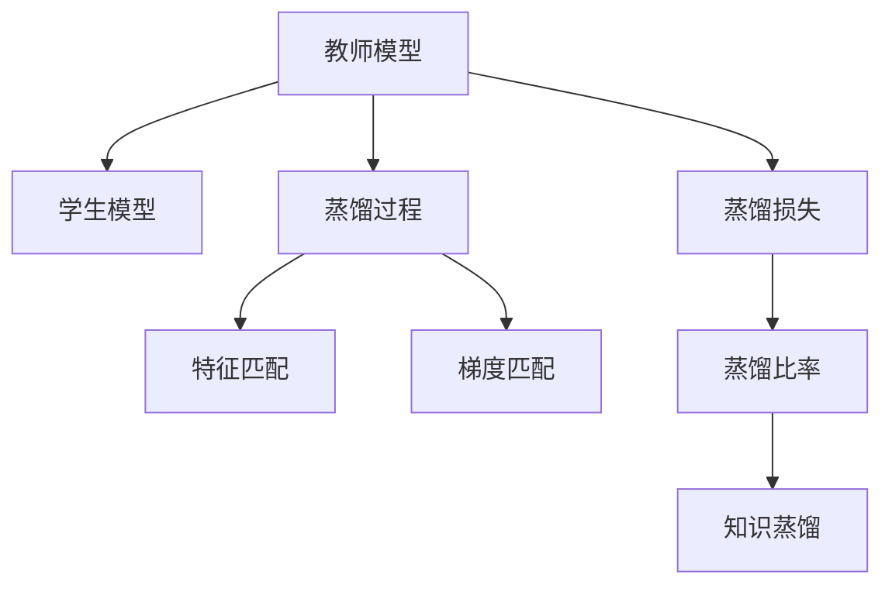

                 

## 1. 背景介绍

### 1.1 问题由来

在人工智能领域，图像生成一直是研究的热点问题。传统方法如生成对抗网络（GAN）、变分自编码器（VAE）等在图像生成领域取得了显著进展，但都存在训练难度大、模型不稳定、生成图像质量参差不齐等问题。近年来，知识蒸馏（Knowledge Distillation, KD）方法在图像生成领域得到了广泛关注和应用，成为生成高质量图像的一种有效途径。知识蒸馏通过将一个已经训练好的"教师模型"（教师模型通常已经具有较好的图像生成能力）的知识传递给一个"学生模型"，从而提升学生模型的图像生成效果。

### 1.2 问题核心关键点

知识蒸馏在图像生成任务中的关键点包括：

- 教师和学生模型的选择：选择合适的教师和学生模型是知识蒸馏成功的基础。教师模型通常已经经过充分训练，拥有较优的图像生成能力，学生模型则需针对具体任务进行微调。
- 知识蒸馏的方法：常见的知识蒸馏方法有基于特征匹配、基于梯度匹配、基于注意力机制等，不同方法适用于不同的场景。
- 蒸馏过程中的损失函数设计：蒸馏过程中的损失函数是知识传递的桥梁，需要合理设计以确保知识传递的有效性。
- 蒸馏后学生模型的训练：蒸馏后学生模型需要进行进一步的微调，以增强其泛化能力和鲁棒性。

### 1.3 问题研究意义

知识蒸馏在图像生成任务中的应用，不仅能够提升图像生成的质量，还能降低生成模型的训练难度和计算成本，提高模型训练的效率和效果。这种范式在图像生成领域的应用，可以带来以下优势：

- 提高图像生成质量：通过知识蒸馏，教师模型的知识能够更好地传递给学生模型，提升学生模型的生成能力，生成高质量的图像。
- 降低训练成本：知识蒸馏能够显著减少学生模型的训练时间，提升训练效率。
- 促进知识共享：知识蒸馏促进了知识在模型之间的传递，有利于知识的积累和共享，加速领域知识的发展。

## 2. 核心概念与联系

### 2.1 核心概念概述

为更好地理解知识蒸馏在图像生成任务中的应用，本节将介绍几个密切相关的核心概念：

- 教师模型(Teacher Model)：已训练好的高质量图像生成模型，具有较好的图像生成能力。
- 学生模型(Student Model)：需通过知识蒸馏进行微调的低质量图像生成模型。
- 知识蒸馏(Knowledge Distillation)：将教师模型的知识传递给学生模型，提升学生模型的生成质量。
- 蒸馏过程(Distillation Process)：教师和学生模型之间的知识传递过程，包括特征匹配、梯度匹配等。
- 蒸馏损失(Distillation Loss)：衡量教师模型与学生模型之间知识传递效果的损失函数。
- 蒸馏比率(Distillation Ratio)：教师模型与学生模型之间知识传递的平衡点，常见的有固定比例、自适应比例等。

这些核心概念之间的逻辑关系可以通过以下Mermaid流程图来展示：



这个流程图展示的知识蒸馏核心概念及其之间的关系：

1. 教师模型通过蒸馏过程将知识传递给学生模型。
2. 蒸馏过程通过特征匹配、梯度匹配等方式实现知识传递。
3. 蒸馏损失衡量教师模型与学生模型之间的知识传递效果。
4. 蒸馏比率调整教师模型与学生模型之间知识传递的平衡点。

这些概念共同构成了知识蒸馏在图像生成任务中的应用框架，使其能够在各种场景下发挥强大的知识传递能力。通过理解这些核心概念，我们可以更好地把握知识蒸馏的工作原理和优化方向。

## 3. 核心算法原理 & 具体操作步骤
### 3.1 算法原理概述

知识蒸馏在图像生成任务中的原理是通过教师模型与学生模型之间的知识传递，提升学生模型的图像生成效果。具体来说，知识蒸馏可以分为两个阶段：

1. **知识传递阶段**：通过特征匹配、梯度匹配等方式，教师模型将知识传递给学生模型。
2. **蒸馏优化阶段**：在学生模型上进行微调，以提升其泛化能力和鲁棒性。

形式化地，假设教师模型为 $T_{\theta_T}$，学生模型为 $S_{\theta_S}$，其中 $\theta_T, \theta_S$ 分别为教师和学生模型的参数。知识蒸馏的目标是通过优化学生模型，使得 $S_{\theta_S}$ 生成的图像与 $T_{\theta_T}$ 生成的图像尽可能接近。

### 3.2 算法步骤详解

知识蒸馏在图像生成任务中的应用一般包括以下几个关键步骤：

**Step 1: 准备教师和学生模型**

- 选择合适的教师模型 $T_{\theta_T}$ 作为初始化参数。
- 根据具体任务需求，设计学生模型 $S_{\theta_S}$，通常可以选择简单的GAN、VAE等模型。

**Step 2: 设计蒸馏过程**

- 选择合适的知识蒸馏方法，如特征匹配、梯度匹配、注意力机制等。
- 确定蒸馏比率 $\alpha$，即教师模型与学生模型之间知识传递的平衡点。

**Step 3: 计算蒸馏损失**

- 在教师模型和学生模型上进行前向传播，计算教师模型和学生模型输出之间的差异。
- 根据具体的蒸馏方法，计算蒸馏损失，如均方误差、交叉熵等。

**Step 4: 优化学生模型**

- 使用蒸馏损失指导学生模型的优化，结合其他优化目标，如生成图像的清晰度、多样性等。
- 使用优化算法（如Adam、SGD等）对学生模型进行优化，最小化蒸馏损失和优化目标。

**Step 5: 验证和微调**

- 在验证集上评估学生模型的性能，对比蒸馏前后的提升效果。
- 对学生模型进行进一步的微调，以增强其泛化能力和鲁棒性。

以上是知识蒸馏在图像生成任务中的一般流程。在实际应用中，还需要针对具体任务的特点，对蒸馏过程的各个环节进行优化设计，如改进蒸馏方法、调整蒸馏比率、优化损失函数等，以进一步提升学生模型的性能。

### 3.3 算法优缺点

知识蒸馏在图像生成任务中的应用具有以下优点：

1. 提高生成图像质量：通过教师模型的知识传递，学生模型的生成图像质量得到了显著提升。
2. 降低训练成本：知识蒸馏减少了学生模型的训练时间，提升训练效率。
3. 促进知识共享：知识蒸馏促进了知识在模型之间的传递，有利于知识的积累和共享。

同时，该方法也存在一些局限性：

1. 依赖高质量教师模型：知识蒸馏的效果很大程度上取决于教师模型的质量，需要选择合适的教师模型。
2. 复杂度高：知识蒸馏过程复杂，需要选择合适的蒸馏方法和蒸馏比率，增加了模型设计和调参的难度。
3. 蒸馏过程的复杂性：不同的蒸馏方法适用于不同的场景，需要根据具体任务进行优化选择。
4. 学生模型的微调难度：蒸馏后学生模型需要进行微调，以增强其泛化能力和鲁棒性。

尽管存在这些局限性，但就目前而言，知识蒸馏仍是图像生成任务中的重要手段。未来相关研究的重点在于如何进一步简化蒸馏过程，降低蒸馏难度，提高蒸馏效率，同时兼顾生成图像的质量和多样性。

### 3.4 算法应用领域

知识蒸馏在图像生成任务中的应用，已经在图像生成、图像增强、图像去噪、图像分类等多个领域得到了广泛应用。例如：

- 图像生成：通过知识蒸馏，将高分辨率的图像生成模型生成的高质量图像，传递给低分辨率的图像生成模型，提升其生成能力。
- 图像增强：通过知识蒸馏，将高质量的图像增强模型生成的图像，传递给低质量的图像增强模型，提升其增强效果。
- 图像去噪：通过知识蒸馏，将高效的图像去噪模型生成的去噪图像，传递给低效的图像去噪模型，提升其去噪效果。
- 图像分类：通过知识蒸馏，将高效的图像分类模型分类的结果，传递给低效的图像分类模型，提升其分类能力。

除了上述这些经典应用外，知识蒸馏还被创新性地应用到更多场景中，如超分辨率、风格迁移、颜色增强等，为图像处理技术带来了新的突破。随着知识蒸馏方法的不断进步，相信图像处理技术将在更广阔的应用领域大放异彩。

## 4. 数学模型和公式 & 详细讲解 & 举例说明

### 4.1 数学模型构建

在知识蒸馏的图像生成任务中，我们假设教师模型 $T_{\theta_T}$ 和学生模型 $S_{\theta_S}$ 分别输出图像 $G_{\theta_T}(x)$ 和 $G_{\theta_S}(x)$，其中 $x$ 为输入噪声。我们希望学生模型能够生成与教师模型相似的图像，即最小化两者输出之间的差异。

定义学生模型与教师模型之间的差异为 $\mathcal{L}_{st}$，则知识蒸馏的目标可以表示为：

$$
\min_{\theta_S} \mathcal{L}_{st} = \min_{\theta_S} \mathcal{L}(T_{\theta_T}, S_{\theta_S})
$$

其中 $\mathcal{L}$ 为具体的损失函数，可以包括均方误差、交叉熵等。

### 4.2 公式推导过程

以下我们以均方误差作为损失函数，推导知识蒸馏的数学公式：

假设教师模型和学生模型均输出大小为 $H \times W \times C$ 的图像，令 $T(x)$ 和 $S(x)$ 分别为教师和学生模型对输入 $x$ 的输出。均方误差损失函数定义为：

$$
\mathcal{L}_{mse}(T(x), S(x)) = \frac{1}{HW} \sum_{i=1}^{HW} \sum_{j=1}^{C} (T_{i,j} - S_{i,j})^2
$$

其中 $H$ 和 $W$ 分别为图像的宽和高，$C$ 为通道数。

知识蒸馏过程中的蒸馏损失可以表示为：

$$
\mathcal{L}_{distill} = \alpha \mathcal{L}_{mse}(T(x), S(x)) + (1-\alpha) \mathcal{L}_{ori}(S(x))
$$

其中 $\alpha$ 为蒸馏比率，控制教师模型与学生模型之间知识传递的平衡点。$\mathcal{L}_{ori}$ 为学生模型的原始优化目标，如生成图像的清晰度、多样性等。

在得到蒸馏损失后，即可带入学生模型的优化算法中，进行微调。

### 4.3 案例分析与讲解

以图像去噪为例，假设教师模型为已经训练好的U-Net网络，学生模型为待微调的低分辨率U-Net网络。通过知识蒸馏，学生模型能够学习到教师模型去噪的能力。

在微调过程中，首先通过教师模型 $T_{\theta_T}$ 对噪声图像 $x$ 进行去噪，生成去噪图像 $T(x)$。然后将去噪图像 $T(x)$ 作为教师模型的输出，与学生模型 $S_{\theta_S}$ 的输出 $S(x)$ 进行比较，计算均方误差损失 $\mathcal{L}_{mse}(T(x), S(x))$。最后结合学生模型的原始优化目标 $\mathcal{L}_{ori}(S(x))$，计算蒸馏损失 $\mathcal{L}_{distill}$，指导学生模型的微调。

这种知识蒸馏方法不仅能够提升学生模型的去噪能力，还能够提高其鲁棒性和泛化能力，确保在不同噪声分布下的稳定表现。

## 5. 项目实践：代码实例和详细解释说明
### 5.1 开发环境搭建

在进行知识蒸馏实践前，我们需要准备好开发环境。以下是使用Python进行TensorFlow开发的环境配置流程：

1. 安装Anaconda：从官网下载并安装Anaconda，用于创建独立的Python环境。

2. 创建并激活虚拟环境：
```bash
conda create -n tf-env python=3.8 
conda activate tf-env
```

3. 安装TensorFlow：从官网获取对应的安装命令。例如：
```bash
conda install tensorflow -c tf -c conda-forge
```

4. 安装TensorBoard：用于可视化模型训练过程和结果，方便调试和评估。
```bash
pip install tensorboard
```

5. 安装OpenCV和PIL：用于读取和处理图像数据。
```bash
pip install opencv-python
pip install pillow
```

6. 安装其他必要的库：
```bash
pip install numpy pandas matplotlib scikit-learn tqdm jupyter notebook ipython
```

完成上述步骤后，即可在`tf-env`环境中开始知识蒸馏实践。

### 5.2 源代码详细实现

这里我们以图像去噪为例，展示知识蒸馏在图像生成任务中的具体实现。

首先，准备教师模型和学生模型：

```python
import tensorflow as tf
from tensorflow.keras import layers, models

# 教师模型
teacher_model = models.load_model('teacher_model.h5')

# 学生模型
student_model = models.Sequential([
    layers.Conv2D(32, (3,3), activation='relu', input_shape=(64,64,3)),
    layers.MaxPooling2D((2,2)),
    layers.Conv2D(64, (3,3), activation='relu'),
    layers.MaxPooling2D((2,2)),
    layers.Conv2D(64, (3,3), activation='relu'),
    layers.MaxPooling2D((2,2)),
    layers.Conv2D(64, (3,3), activation='relu'),
    layers.Flatten(),
    layers.Dense(64, activation='relu'),
    layers.Dense(3, activation='sigmoid')
])
```

然后，设计蒸馏过程和损失函数：

```python
alpha = 0.9  # 蒸馏比率

# 蒸馏过程
def distillation(x, y):
    T_x = teacher_model.predict(x)
    S_x = student_model.predict(x)
    loss = tf.reduce_mean(tf.square(T_x - S_x))
    return loss

# 蒸馏损失
def distillation_loss(x, y):
    T_x = teacher_model.predict(x)
    S_x = student_model.predict(x)
    loss = tf.reduce_mean(tf.square(T_x - S_x))
    return alpha * loss
```

最后，进行模型微调和评估：

```python
# 优化器
optimizer = tf.keras.optimizers.Adam()

# 编译学生模型
student_model.compile(optimizer=optimizer, loss=distillation_loss)

# 训练过程
for epoch in range(epochs):
    for x, y in train_dataset:
        optimizer.zero_grad()
        loss = distillation_loss(x, y)
        loss.backward()
        optimizer.apply_gradients(zip(loss, trainable_variables))

    # 验证集评估
    for x, y in val_dataset:
        loss = distillation_loss(x, y)
        print(f'Validation Loss: {loss.numpy()}')

# 测试集评估
for x, y in test_dataset:
    loss = distillation_loss(x, y)
    print(f'Test Loss: {loss.numpy()}')
```

以上就是使用TensorFlow对图像去噪任务进行知识蒸馏的完整代码实现。可以看到，TensorFlow提供了丰富的高级API和可视化工具，使得知识蒸馏过程的实现变得简单高效。

### 5.3 代码解读与分析

让我们再详细解读一下关键代码的实现细节：

**distillation函数**：
- 将输入噪声 $x$ 分别输入教师模型和学生模型，计算教师模型和学生模型之间的均方误差损失。

**distillation_loss函数**：
- 将输入噪声 $x$ 分别输入教师模型和学生模型，计算教师模型和学生模型之间的均方误差损失，并通过蒸馏比率 $\alpha$ 调整损失权重，确保知识传递的效果。

**模型编译和训练**：
- 使用TensorFlow的高级API进行模型编译和训练，指定优化器、损失函数等关键参数。
- 在每个epoch内，对训练集进行前向传播和反向传播，更新学生模型参数。
- 在验证集上评估模型性能，输出蒸馏损失。
- 在测试集上评估模型性能，输出蒸馏损失。

通过以上步骤，我们可以快速构建并优化知识蒸馏模型，以提升其图像生成质量。

## 6. 实际应用场景

### 6.1 智能医疗影像

在智能医疗影像领域，知识蒸馏方法可以用于提升图像增强和疾病诊断的准确性。例如，通过知识蒸馏，将已训练好的医疗影像增强模型输出的高质量图像，传递给待训练的医疗影像增强模型，提升其增强效果。同时，通过知识蒸馏，将高精度的疾病诊断模型输出的诊断结果，传递给待训练的疾病诊断模型，提升其诊断准确性。

### 6.2 自动驾驶

在自动驾驶领域，知识蒸馏方法可以用于提升传感器数据处理和场景理解能力。例如，通过知识蒸馏，将已训练好的传感器数据处理模型输出的处理结果，传递给待训练的传感器数据处理模型，提升其数据处理效果。同时，通过知识蒸馏，将高精度的场景理解模型输出的场景理解结果，传递给待训练的场景理解模型，提升其场景理解能力。

### 6.3 工业检测

在工业检测领域，知识蒸馏方法可以用于提升图像分类和异常检测能力。例如，通过知识蒸馏，将已训练好的图像分类模型输出的分类结果，传递给待训练的图像分类模型，提升其分类准确性。同时，通过知识蒸馏，将高精度的异常检测模型输出的异常检测结果，传递给待训练的异常检测模型，提升其异常检测能力。

### 6.4 未来应用展望

随着知识蒸馏方法在图像生成领域的应用不断深入，未来其在更多场景中的潜力将被进一步挖掘。以下是知识蒸馏在未来可能的应用方向：

1. 超分辨率：通过知识蒸馏，将高分辨率图像的低质量版本，传递给待训练的低分辨率图像生成模型，提升其生成高质量图像的能力。

2. 风格迁移：通过知识蒸馏，将高风格的图像的低质量版本，传递给待训练的低风格图像生成模型，提升其生成风格迁移效果的能力。

3. 图像修复：通过知识蒸馏，将已训练好的图像修复模型输出的修复图像，传递给待训练的图像修复模型，提升其图像修复能力。

4. 视频生成：通过知识蒸馏，将已训练好的视频生成模型生成的视频，传递给待训练的视频生成模型，提升其视频生成能力。

5. 跨模态学习：通过知识蒸馏，将不同模态的数据进行融合，提升模型在不同模态下的性能。

以上趋势展示了知识蒸馏方法在图像生成领域的应用前景，未来随着更多场景的探索和应用，知识蒸馏技术将在更多的领域发挥重要作用。

## 7. 工具和资源推荐
### 7.1 学习资源推荐

为了帮助开发者系统掌握知识蒸馏在图像生成任务中的应用，这里推荐一些优质的学习资源：

1. 《深度学习：理论与实践》系列博文：由大模型技术专家撰写，深入浅出地介绍了知识蒸馏的理论基础和应用实践。

2. 《Deep Learning Specialization》课程：Coursera提供的深度学习课程，详细介绍了深度学习的基本概念和应用，包括知识蒸馏方法。

3. 《Deep Learning for Computer Vision: A Practical Introduction》书籍：专注于计算机视觉领域的深度学习应用，详细介绍了知识蒸馏在图像生成任务中的应用。

4. OpenAI Blog：OpenAI的官方博客，涵盖了深度学习领域的最新研究成果和应用实践，包括知识蒸馏方法。

5. arXiv：深度学习领域的学术期刊，推荐阅读相关知识蒸馏的学术论文，了解最新研究进展。

通过对这些资源的学习实践，相信你一定能够快速掌握知识蒸馏在图像生成任务中的精髓，并用于解决实际的图像生成问题。

### 7.2 开发工具推荐

高效的开发离不开优秀的工具支持。以下是几款用于知识蒸馏开发的常用工具：

1. TensorFlow：由Google主导开发的开源深度学习框架，生产部署方便，适合大规模工程应用。

2. PyTorch：基于Python的开源深度学习框架，灵活动态的计算图，适合快速迭代研究。

3. OpenCV：开源计算机视觉库，提供丰富的图像处理和分析功能，方便数据预处理。

4. TensorBoard：TensorFlow配套的可视化工具，可实时监测模型训练状态，提供丰富的图表呈现方式。

5. Jupyter Notebook：免费的交互式笔记本环境，支持Python代码的快速开发和调试。

6. Google Colab：谷歌推出的在线Jupyter Notebook环境，免费提供GPU/TPU算力，方便快速上手实验。

合理利用这些工具，可以显著提升知识蒸馏的开发效率，加快创新迭代的步伐。

### 7.3 相关论文推荐

知识蒸馏在图像生成任务中的应用，源于学界的持续研究。以下是几篇奠基性的相关论文，推荐阅读：

1. Knowledge Distillation: A New Way to Improve the Generalization and Stability of Deep Neural Networks（即KD论文）：提出了知识蒸馏方法，通过教师模型与学生模型之间的知识传递，提升学生模型的性能。

2. Distilling the Knowledge in a Neural Network（即GDist论文）：进一步优化了知识蒸馏方法，提出了多级蒸馏和动态蒸馏比率等概念。

3. Image-to-Image Translation with Conditional Adversarial Networks（即CycleGAN论文）：引入了条件对抗网络，将知识蒸馏方法应用于图像生成任务中。

4. Learning Transferable Image Models with Multi-task Training（即VAT论文）：提出了多任务训练方法，增强了模型的跨任务泛化能力。

5. Massively Multitask Learning Using Distributed Data Parallel（即PML论文）：提出了多任务学习与分布式数据并行结合的方法，提升了模型的效率和效果。

这些论文代表了大模型蒸馏技术的发展脉络。通过学习这些前沿成果，可以帮助研究者把握学科前进方向，激发更多的创新灵感。

## 8. 总结：未来发展趋势与挑战

### 8.1 总结

本文对知识蒸馏在图像生成任务中的应用进行了全面系统的介绍。首先阐述了知识蒸馏在图像生成任务中的研究背景和意义，明确了知识蒸馏在提升图像生成质量、降低训练成本等方面的独特价值。其次，从原理到实践，详细讲解了知识蒸馏的数学模型和关键步骤，给出了知识蒸馏任务开发的完整代码实例。同时，本文还广泛探讨了知识蒸馏方法在智能医疗影像、自动驾驶、工业检测等多个领域的应用前景，展示了知识蒸馏范式的广泛潜力。此外，本文精选了知识蒸馏技术的各类学习资源，力求为读者提供全方位的技术指引。

通过本文的系统梳理，可以看到，知识蒸馏在图像生成任务中的应用已经取得了显著进展，在提升生成图像质量和降低训练成本方面，表现出色。未来随着知识蒸馏方法的不断演进，知识蒸馏技术必将在更广泛的领域发挥重要作用，推动人工智能技术的发展。

### 8.2 未来发展趋势

展望未来，知识蒸馏在图像生成任务中的应用将呈现以下几个发展趋势：

1. 知识蒸馏方法的自动化：随着深度学习自动化的发展，知识蒸馏方法将逐步自动化，通过模型评估和自动调参，提升蒸馏效率和效果。

2. 多级知识蒸馏：通过多级知识蒸馏，逐步传递教师模型的知识，增强学生模型的泛化能力和鲁棒性。

3. 跨模态知识蒸馏：将不同模态的数据进行融合，提升模型在不同模态下的性能，如视觉、听觉、文本等。

4. 自适应知识蒸馏：根据数据分布和任务需求，动态调整蒸馏比率和蒸馏方法，提升蒸馏效果。

5. 联合训练：将知识蒸馏与迁移学习、自监督学习等方法结合，提升模型的泛化能力和泛化性。

这些趋势展示了知识蒸馏在图像生成领域的应用前景，未来随着更多创新技术的融合，知识蒸馏方法将在更多的领域发挥重要作用。

### 8.3 面临的挑战

尽管知识蒸馏在图像生成任务中已经取得了显著进展，但在实现复杂高效的知识传递过程中，仍面临诸多挑战：

1. 蒸馏比率的选择：蒸馏比率对知识传递的效果和学生模型的性能有重要影响，选择合适的蒸馏比率需要大量实验和调参。

2. 数据分布差异：不同领域的图像生成任务可能具有不同的数据分布，知识蒸馏方法需要在不同领域间进行适配。

3. 计算资源消耗：知识蒸馏过程需要大量的计算资源，如何在保持生成质量的前提下，降低计算资源消耗，是一个亟待解决的问题。

4. 模型鲁棒性不足：知识蒸馏方法生成的图像可能存在泛化能力不足的问题，需要进一步增强模型的鲁棒性。

5. 生成图像的多样性：知识蒸馏生成的图像可能存在多样性不足的问题，需要通过进一步的优化提升图像的多样性。

6. 生成图像的清晰度：知识蒸馏生成的图像可能存在清晰度不足的问题，需要通过进一步的优化提升图像的清晰度。

这些挑战将随着技术的不断演进，逐步得到解决，推动知识蒸馏在图像生成任务中的应用走向成熟。

### 8.4 研究展望

面对知识蒸馏在图像生成任务中面临的挑战，未来的研究需要在以下几个方面寻求新的突破：

1. 优化蒸馏比率和蒸馏方法：通过实验和理论分析，找到最优的蒸馏比率和蒸馏方法，确保知识传递的有效性。

2. 提升生成图像的多样性和清晰度：通过改进模型结构和优化损失函数，提升生成图像的多样性和清晰度。

3. 引入跨模态数据融合：将视觉、听觉、文本等多种模态的数据进行融合，提升模型的泛化能力和鲁棒性。

4. 自适应蒸馏方法：根据数据分布和任务需求，动态调整蒸馏比率和蒸馏方法，提升蒸馏效果。

5. 联合训练方法：将知识蒸馏与迁移学习、自监督学习等方法结合，提升模型的泛化能力和泛化性。

6. 模型压缩与优化：通过模型压缩与优化技术，降低计算资源消耗，提升生成效率。

这些研究方向的探索，必将引领知识蒸馏技术迈向更高的台阶，为图像生成技术带来新的突破，推动人工智能技术的发展。面向未来，知识蒸馏技术还需要与其他人工智能技术进行更深入的融合，如知识表示、因果推理、强化学习等，多路径协同发力，共同推动人工智能技术的发展。只有勇于创新、敢于突破，才能不断拓展知识蒸馏的边界，让图像生成技术更好地服务于人类社会。

## 9. 附录：常见问题与解答

**Q1：知识蒸馏是否适用于所有图像生成任务？**

A: 知识蒸馏在大多数图像生成任务上都能取得不错的效果，特别是对于数据量较小的任务。但对于一些特定领域的任务，如医学、法律等，仅仅依靠通用语料预训练的模型可能难以很好地适应。此时需要在特定领域语料上进一步预训练，再进行蒸馏，才能获得理想效果。此外，对于一些需要时效性、个性化很强的任务，如对话、推荐等，蒸馏方法也需要针对性的改进优化。

**Q2：知识蒸馏过程中如何选择合适的蒸馏比率？**

A: 蒸馏比率是知识蒸馏中一个关键参数，需要根据具体任务进行合理选择。一般来说，蒸馏比率越接近1，知识传递的效果越好，但过高的蒸馏比率可能会导致学生模型失去部分个性化的生成能力。一般来说，从0.8到1.0是一个合理的范围。可以通过实验调整蒸馏比率，找到最优值。

**Q3：知识蒸馏是否需要教师模型和学生模型均采用相同的结构？**

A: 知识蒸馏中教师模型和学生模型通常不需要采用相同的结构。实际上，教师模型和学生模型可以采用不同的架构，只要两者之间的知识可以相互传递即可。例如，教师模型可以使用复杂的卷积神经网络，学生模型可以使用简单的全连接网络，只需保证两者之间的知识传递即可。

**Q4：知识蒸馏是否可以在已有模型上直接进行微调？**

A: 知识蒸馏可以在已有模型上直接进行微调，但需要进行一定的调整。具体来说，知识蒸馏需要计算教师模型和学生模型之间的损失，这需要两者在相同的输入上生成相同的输出。因此，在微调过程中，需要对学生模型进行适当的调整，使其与教师模型输出格式一致。

**Q5：知识蒸馏是否可以提高模型的泛化能力？**

A: 知识蒸馏可以有效提升学生模型的泛化能力。通过教师模型传递的知识，学生模型能够学习到更通用的语言表示，从而提升其泛化能力。此外，知识蒸馏还能够减少模型对训练数据的依赖，提升模型在新数据上的表现。

综上所述，知识蒸馏在图像生成任务中具有重要的应用价值，能够提升生成图像的质量和效率。未来随着更多技术的融合，知识蒸馏技术将在更多的领域发挥重要作用，推动人工智能技术的发展。

---

作者：禅与计算机程序设计艺术 / Zen and the Art of Computer Programming

