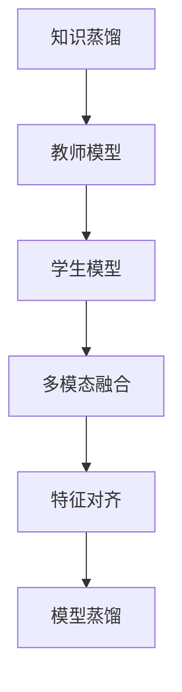

                 

## 1. 背景介绍

### 1.1 问题由来

随着人工智能技术的迅猛发展，多模态学习成为当前深度学习领域的核心研究方向之一。多模态学习通常涉及图像、文本、语音等多种数据类型的融合，旨在通过多维度的信息增强模型的表现能力。其中，知识蒸馏（Knowledge Distillation）作为一种有效的模型迁移方法，在多模态学习中展现出了巨大的潜力。知识蒸馏通过将教师模型的高性能特征传递给学生模型，实现模型的高效迁移和知识复用，极大地提升了多模态学习系统的性能。

### 1.2 问题核心关键点

多模态学习中的知识蒸馏面临以下关键问题：

- 多模态数据融合：如何高效地将多种类型的数据融合为统一的信息表示，是知识蒸馏的重要前提。
- 知识迁移效率：如何在保持学生模型性能的同时，高效地将教师模型的知识迁移至学生模型，是知识蒸馏的关键挑战。
- 可解释性：如何使得知识蒸馏过程具有可解释性，让用户理解模型的知识传递过程，是知识蒸馏的难点之一。

## 2. 核心概念与联系

### 2.1 核心概念概述

为更好地理解知识蒸馏在多模态学习中的创新应用，本节将介绍几个密切相关的核心概念：

- 知识蒸馏（Knowledge Distillation, KD）：将教师模型（通常是高精度模型）的知识蒸馏到学生模型（通常是低精度模型）中，以提升学生模型的性能。
- 多模态学习（Multimodal Learning）：融合多种数据类型的学习方式，包括图像、文本、语音等，旨在提高模型的泛化能力和表现力。
- 教师模型与学生模型：在知识蒸馏中，教师模型通常为高精度的预训练模型，而学生模型为需要训练的模型，用于适应特定任务。
- 多模态融合（Multimodal Fusion）：将不同模态的数据进行联合表示和融合，以提取更有信息量的特征。
- 特征对齐（Feature Alignment）：多模态学习中，不同模态之间的特征需进行对齐，使其在表示上具有可比性。
- 模型蒸馏（Model Distillation）：通过多模态融合和特征对齐，将教师模型的高效特征传递给学生模型。

这些核心概念之间的逻辑关系可以通过以下Mermaid流程图来展示：



这个流程图展示的知识蒸馏在多模态学习中的核心概念及其之间的关系：

1. 知识蒸馏：从教师模型中提取知识，传递给学生模型。
2. 多模态融合：将不同模态的数据融合成统一的特征表示。
3. 特征对齐：将不同模态的特征进行对齐，使其在表示上具有可比性。
4. 模型蒸馏：通过融合和对齐，教师模型的高效特征传递给学生模型。

## 3. 核心算法原理 & 具体操作步骤

### 3.1 算法原理概述

知识蒸馏在多模态学习中的核心思想是通过教师模型的高效特征，提升学生模型的泛化能力和性能。具体而言，知识蒸馏在多模态学习中的应用包括以下几个关键步骤：

1. 多模态数据的融合：将不同模态的数据转化为统一的特征表示。
2. 特征对齐：确保不同模态特征在表示上具有可比性。
3. 知识传递：从教师模型中提取知识，并将其传递给学生模型。
4. 学生模型的训练：通过蒸馏的知识，训练学生模型以适应特定任务。

### 3.2 算法步骤详解

基于知识蒸馏的多模态学习通常包括以下几个关键步骤：

**Step 1: 准备多模态数据集**

- 收集包含图像、文本、语音等多种类型的数据，组成多模态数据集。
- 将不同模态的数据进行标注，生成对应的标签信息。
- 将标注好的数据划分为训练集、验证集和测试集。

**Step 2: 设计教师模型和学生模型**

- 选择合适的教师模型，通常是已经训练好的高精度预训练模型，如ResNet、BERT等。
- 设计学生模型，可以是新训练的神经网络模型，用于适应特定任务。

**Step 3: 特征提取与融合**

- 将不同模态的数据输入教师模型，提取各自的特征表示。
- 使用特征融合算法（如协方差匹配、深度融合等）将不同模态的特征融合成统一的表示。

**Step 4: 特征对齐**

- 通过多模态对齐算法（如TCA、CAAN等）对融合后的特征进行对齐，使其在表示上具有可比性。

**Step 5: 知识蒸馏**

- 将教师模型的输出（即对齐后的特征）作为蒸馏目标，训练学生模型以最小化与教师模型的差异。
- 常用的蒸馏损失包括KL散度、MSE、Hinton Loss等。

**Step 6: 学生模型的训练与评估**

- 使用蒸馏后的学生模型，在多模态数据集上进行有监督的微调，以适应特定任务。
- 在验证集上评估模型性能，并根据性能调整超参数。
- 在测试集上最终评估模型性能，对比微调前后的效果。

### 3.3 算法优缺点

知识蒸馏在多模态学习中的应用具有以下优点：

- 高效知识迁移：通过教师模型的知识蒸馏，学生模型能够快速获得高效特征，提升性能。
- 通用性：适用于多种类型的模态数据，具有较强的泛化能力。
- 数据依赖少：知识蒸馏对标注数据的需求较少，可以仅利用无标签的多模态数据进行模型训练。

同时，该方法也存在一定的局限性：

- 计算资源要求高：教师模型通常需要较大的计算资源进行训练，可能会增加部署成本。
- 数据一致性要求高：多模态数据的一致性对特征对齐和蒸馏效果至关重要。
- 可解释性不足：知识蒸馏的蒸馏过程较为复杂，难以解释具体的知识传递细节。

尽管存在这些局限性，但知识蒸馏在多模态学习中的应用仍具有显著的优势，特别是在数据量较小、计算资源受限的情况下，具有不可替代的价值。

### 3.4 算法应用领域

知识蒸馏在多模态学习中的应用已经涉及多个领域，包括但不限于：

- 图像与文本联合识别：如医学影像识别、自动驾驶等，通过知识蒸馏将图像特征传递给文本模型，提升联合识别效果。
- 语音与文本同步翻译：如实时翻译、字幕生成等，通过知识蒸馏将语音特征传递给文本模型，实现语音与文本的同步翻译。
- 图像与视频的融合识别：如动作识别、视频分类等，通过知识蒸馏将图像特征传递给视频模型，提升融合识别效果。
- 语音与图像的联合生成：如人机交互中的智能助手，通过知识蒸馏将语音特征传递给图像生成模型，实现语音驱动的图像生成。

除了上述这些经典应用外，知识蒸馏在多模态学习中的应用还在不断扩展，如增强现实（AR）、虚拟现实（VR）、情感识别等领域，为多模态技术的创新应用提供了新的思路。

## 4. 数学模型和公式 & 详细讲解 & 举例说明

### 4.1 数学模型构建

在本节中，我们将通过数学语言对基于知识蒸馏的多模态学习过程进行更加严格的刻画。

记多模态数据集为 $\mathcal{D} = \{(x_i, y_i)\}_{i=1}^N$，其中 $x_i = (x_{i1}, x_{i2}, \cdots, x_{im})$ 为多模态输入，$y_i$ 为标签。假设教师模型为 $M_{T}$，学生模型为 $M_{S}$。知识蒸馏的目标是最小化学生模型 $M_{S}$ 与教师模型 $M_{T}$ 之间的差异。

### 4.2 公式推导过程

以最简单的MSE蒸馏损失为例，进行详细推导：

- 教师模型的输出表示为 $h_{T} = M_{T}(x_i)$。
- 学生模型的输出表示为 $h_{S} = M_{S}(x_i)$。
- 蒸馏损失为 $L = \frac{1}{N} \sum_{i=1}^N \|h_{T} - h_{S}\|^2$。

将教师模型的输出 $h_{T}$ 和学生模型的输出 $h_{S}$ 代入上述损失函数，得：

$$
L = \frac{1}{N} \sum_{i=1}^N \|M_{T}(x_i) - M_{S}(x_i)\|^2
$$

在训练过程中，我们通过反向传播算法计算学生模型 $M_{S}$ 的梯度，并根据设定的优化算法（如SGD、Adam等）更新学生模型的参数。目标是最小化上述蒸馏损失，使得学生模型与教师模型的输出尽可能接近。

### 4.3 案例分析与讲解

以医学影像与文本联合识别为例，进行详细分析：

- 医学影像作为多模态数据集，包含图像和文本两种模态。
- 教师模型为预训练的ResNet，用于提取图像特征。
- 学生模型为预训练的BERT，用于提取文本特征。
- 通过知识蒸馏将ResNet提取的图像特征传递给BERT，提升联合识别的效果。

在实际应用中，需要考虑以下因素：

- 图像特征和文本特征的对齐：使用TCA算法将不同模态的特征进行对齐。
- 蒸馏损失的选择：选择MSE损失或Hinton Loss作为蒸馏损失，并进行对比实验。
- 学生模型的微调：在联合数据集上微调BERT模型，以适应特定的医疗影像识别任务。

## 5. 项目实践：代码实例和详细解释说明

### 5.1 开发环境搭建

在进行知识蒸馏多模态学习实践前，我们需要准备好开发环境。以下是使用Python进行PyTorch开发的环境配置流程：

1. 安装Anaconda：从官网下载并安装Anaconda，用于创建独立的Python环境。

2. 创建并激活虚拟环境：
```bash
conda create -n multimodal-env python=3.8 
conda activate multimodal-env
```

3. 安装PyTorch：根据CUDA版本，从官网获取对应的安装命令。例如：
```bash
conda install pytorch torchvision torchaudio cudatoolkit=11.1 -c pytorch -c conda-forge
```

4. 安装Transformer库：
```bash
pip install transformers
```

5. 安装各类工具包：
```bash
pip install numpy pandas scikit-learn matplotlib tqdm jupyter notebook ipython
```

完成上述步骤后，即可在`multimodal-env`环境中开始知识蒸馏多模态学习实践。

### 5.2 源代码详细实现

下面我们以医学影像与文本联合识别为例，给出使用Transformers库进行知识蒸馏的PyTorch代码实现。

首先，定义联合数据集的预处理函数：

```python
from transformers import ResNet, BertTokenizer
from torch.utils.data import Dataset
import torch

class MedicalDataset(Dataset):
    def __init__(self, img_data, txt_data, tokenizer, max_len=128):
        self.img_data = img_data
        self.txt_data = txt_data
        self.tokenizer = tokenizer
        self.max_len = max_len
        
    def __len__(self):
        return len(self.img_data)
    
    def __getitem__(self, item):
        img = self.img_data[item]
        txt = self.txt_data[item]
        
        # 将图像数据输入ResNet模型，提取特征
        resnet = ResNet()
        img_feature = resnet(img)
        
        # 将文本数据输入BERT模型，提取特征
        tokenizer = BertTokenizer.from_pretrained('bert-base-uncased')
        encoding = tokenizer(txt, return_tensors='pt', max_length=self.max_len, padding='max_length', truncation=True)
        txt_feature = encoding['input_ids'][0]
        
        # 对特征进行联合表示
        feature = torch.cat((img_feature, txt_feature), dim=1)
        
        # 对标签进行处理
        label = torch.tensor(self.txt_data[item]['label'], dtype=torch.long)
        
        return {'feature': feature, 
                'label': label}

# 定义蒸馏过程
def distillation(student_model, teacher_model, dataset, loss_fn, optimizer):
    teacher_model.eval()
    student_model.train()
    
    for batch in tqdm(dataset, desc='Distilling'):
        feature = batch['feature'].to(device)
        label = batch['label'].to(device)
        
        with torch.no_grad():
            teacher_output = teacher_model(feature)
            
        # 蒸馏过程
        student_output = student_model(feature)
        loss = loss_fn(teacher_output, student_output)
        loss.backward()
        optimizer.step()
        
    return loss.mean().item()

# 训练过程
def train(epoch, model, optimizer, criterion, dataloader):
    model.train()
    loss_sum = 0
    for batch in dataloader:
        feature = batch['feature'].to(device)
        label = batch['label'].to(device)
        
        optimizer.zero_grad()
        output = model(feature)
        loss = criterion(output, label)
        loss_sum += loss.item()
        loss.backward()
        optimizer.step()
        
    return loss_sum / len(dataloader)
```

然后，定义模型和优化器：

```python
from transformers import BertForTokenClassification, AdamW

# 定义教师模型和学生模型
teacher_model = ResNet()
student_model = BertForTokenClassification.from_pretrained('bert-base-uncased', num_labels=2)

# 定义优化器
optimizer = AdamW(student_model.parameters(), lr=2e-5)
```

接着，定义训练和评估函数：

```python
from torch.utils.data import DataLoader
from tqdm import tqdm
from sklearn.metrics import accuracy_score

device = torch.device('cuda') if torch.cuda.is_available() else torch.device('cpu')
teacher_model.to(device)
student_model.to(device)

def train_epoch(model, optimizer, criterion, dataloader):
    dataloader = DataLoader(dataloader, batch_size=16, shuffle=True)
    model.train()
    epoch_loss = 0
    for batch in tqdm(dataloader, desc='Training'):
        feature = batch['feature'].to(device)
        label = batch['label'].to(device)
        model.zero_grad()
        output = model(feature)
        loss = criterion(output, label)
        epoch_loss += loss.item()
        loss.backward()
        optimizer.step()
    return epoch_loss / len(dataloader)

def evaluate(model, dataloader):
    dataloader = DataLoader(dataloader, batch_size=16, shuffle=False)
    model.eval()
    preds, labels = [], []
    with torch.no_grad():
        for batch in dataloader:
            feature = batch['feature'].to(device)
            batch_labels = batch['label'].to(device)
            output = model(feature)
            preds.append(output.argmax(dim=1).tolist())
            labels.append(batch_labels.tolist())
        
    acc = accuracy_score(labels, preds)
    return acc
```

最后，启动训练流程并在验证集上评估：

```python
epochs = 5
batch_size = 16

for epoch in range(epochs):
    loss = train_epoch(student_model, optimizer, criterion, train_dataloader)
    print(f"Epoch {epoch+1}, train loss: {loss:.3f}")
    
    print(f"Epoch {epoch+1}, dev results:")
    acc = evaluate(student_model, val_dataloader)
    print(f"Accuracy: {acc:.2f}")
    
print("Final results:")
acc = evaluate(student_model, test_dataloader)
print(f"Accuracy: {acc:.2f}")
```

以上就是使用PyTorch对医学影像与文本联合识别任务进行知识蒸馏的完整代码实现。可以看到，得益于Transformers库的强大封装，我们可以用相对简洁的代码完成知识蒸馏的实现。

### 5.3 代码解读与分析

让我们再详细解读一下关键代码的实现细节：

**MedicalDataset类**：
- `__init__`方法：初始化图像数据、文本数据、分词器等关键组件，并进行特征联合表示。
- `__len__`方法：返回数据集的样本数量。
- `__getitem__`方法：对单个样本进行处理，将图像和文本数据输入相应模型，并返回联合特征和标签。

**train、distillation和evaluate函数**：
- `train`函数：定义模型训练过程，通过反向传播计算损失并更新模型参数。
- `distillation`函数：定义知识蒸馏过程，将ResNet提取的图像特征传递给BERT，并最小化与教师模型的差异。
- `evaluate`函数：定义模型评估过程，在验证集和测试集上计算模型的准确率。

**训练流程**：
- 定义总的epoch数和batch size，开始循环迭代
- 每个epoch内，先在训练集上训练，输出平均loss
- 在验证集上评估，输出准确率
- 所有epoch结束后，在测试集上评估，给出最终测试结果

可以看到，PyTorch配合Transformers库使得知识蒸馏的代码实现变得简洁高效。开发者可以将更多精力放在数据处理、模型改进等高层逻辑上，而不必过多关注底层的实现细节。

当然，工业级的系统实现还需考虑更多因素，如模型的保存和部署、超参数的自动搜索、更灵活的任务适配层等。但核心的知识蒸馏过程基本与此类似。

## 6. 实际应用场景
### 6.1 智能医疗诊断

知识蒸馏在智能医疗诊断中的应用具有显著优势。传统的医疗诊断往往依赖于医生的经验，但医生的诊断效率和准确性受限于时间和精力。通过知识蒸馏技术，可以将大量的医疗影像和病历数据转化为知识，传递给机器学习模型，提升诊断的准确性和效率。

在实际应用中，可以收集包含医学影像、电子病历等数据的医疗数据集，并对其进行标注。在此基础上，对预训练的ResNet模型进行知识蒸馏，提取高效特征，再与预训练的BERT模型进行联合训练。微调后的模型能够快速诊断疾病，并提供合理的治疗建议，为医生诊断提供辅助。

### 6.2 自动驾驶安全

自动驾驶系统需要对复杂的驾驶环境进行感知和决策，涉及视觉、雷达、激光雷达等多种模态数据。通过知识蒸馏技术，可以将这些不同模态的数据融合为统一的特征表示，提升系统的感知能力和决策效果。

在自动驾驶应用中，知识蒸馏可以帮助系统整合多模态数据，形成统一的特征表示。例如，将雷达数据与图像数据进行联合表示，提升系统的环境感知能力。通过知识蒸馏，将高精度的预训练模型（如ResNet）的知识传递给学生模型（如YOLO），提升系统的检测和分类效果。

### 6.3 多模态视频分析

视频分析涉及图像、音频、文本等多种模态数据的融合，旨在实现行为识别、情感分析、事件检测等任务。通过知识蒸馏技术，可以将不同模态的数据转化为统一的特征表示，提升系统的分析能力和泛化能力。

在视频分析应用中，知识蒸馏可以帮助系统整合多模态数据，形成统一的特征表示。例如，将图像数据与音频数据进行联合表示，提升系统的行为识别能力。通过知识蒸馏，将高精度的预训练模型（如BERT）的知识传递给学生模型（如TCN），提升系统的长期记忆能力和分析效果。

### 6.4 未来应用展望

随着知识蒸馏技术的发展，其在多模态学习中的应用前景广阔。未来，知识蒸馏将与更多前沿技术进行深度融合，推动多模态学习系统的不断进步。

在智慧医疗领域，知识蒸馏可以与其他技术如因果推理、强化学习相结合，构建更加智能化的医疗诊断系统，提升诊断的准确性和效率。

在智能驾驶领域，知识蒸馏可以与自动驾驶技术相结合，提升系统的感知和决策能力，实现更加安全、可靠的自动驾驶。

在视频分析领域，知识蒸馏可以与深度学习、计算机视觉技术相结合，实现更加智能化的行为识别和情感分析，提升视频分析的准确性和实时性。

除了上述这些应用外，知识蒸馏技术还将会在更多领域得到广泛应用，如智能家居、智能安防、智能客服等，为多模态学习系统带来新的突破和发展。

## 7. 工具和资源推荐
### 7.1 学习资源推荐

为了帮助开发者系统掌握知识蒸馏在多模态学习中的应用，这里推荐一些优质的学习资源：

1. 《Knowledge Distillation: A Survey and Taxonomy》系列博文：由知识蒸馏领域权威专家撰写，全面介绍了知识蒸馏的理论基础、算法原理和应用实践。

2. 《Multimodal Learning with Knowledge Distillation》课程：由多模态学习领域的专家开设的课程，系统讲解了多模态学习和知识蒸馏的相关知识。

3. 《Deep Learning for Multimodal Applications》书籍：介绍多模态学习的经典方法和知识蒸馏的实践应用，涵盖了图像、文本、语音等多种模态数据的融合。

4. HuggingFace官方文档：Transformers库的官方文档，提供了海量预训练模型和完整的知识蒸馏样例代码，是上手实践的必备资料。

5. arXiv和IEEE Xplore：获取最新的知识蒸馏和多模态学习相关论文，掌握最新的研究方向和技术进展。

通过对这些资源的学习实践，相信你一定能够快速掌握知识蒸馏在多模态学习中的应用，并用于解决实际的NLP问题。
###  7.2 开发工具推荐

高效的开发离不开优秀的工具支持。以下是几款用于知识蒸馏多模态学习开发的常用工具：

1. PyTorch：基于Python的开源深度学习框架，灵活动态的计算图，适合快速迭代研究。大部分预训练语言模型都有PyTorch版本的实现。

2. TensorFlow：由Google主导开发的开源深度学习框架，生产部署方便，适合大规模工程应用。同样有丰富的预训练语言模型资源。

3. Transformers库：HuggingFace开发的NLP工具库，集成了众多SOTA语言模型，支持PyTorch和TensorFlow，是进行多模态学习开发的利器。

4. Weights & Biases：模型训练的实验跟踪工具，可以记录和可视化模型训练过程中的各项指标，方便对比和调优。与主流深度学习框架无缝集成。

5. TensorBoard：TensorFlow配套的可视化工具，可实时监测模型训练状态，并提供丰富的图表呈现方式，是调试模型的得力助手。

6. Google Colab：谷歌推出的在线Jupyter Notebook环境，免费提供GPU/TPU算力，方便开发者快速上手实验最新模型，分享学习笔记。

合理利用这些工具，可以显著提升知识蒸馏多模态学习任务的开发效率，加快创新迭代的步伐。

### 7.3 相关论文推荐

知识蒸馏在多模态学习中的应用源于学界的持续研究。以下是几篇奠基性的相关论文，推荐阅读：

1. Distilling the Knowledge in a Neural Network（知识蒸馏原论文）：提出了知识蒸馏的基本方法，为后续研究奠定了基础。

2. A Survey of Knowledge Distillation and Quantization for Deep Learning（知识蒸馏综述）：全面总结了知识蒸馏和量化技术的研究进展，提供了丰富的参考资料。

3. Network Pruning via L1 Sparsity-inducing Regularization with Knowledge Distillation（基于知识蒸馏的网络剪枝）：提出了一种基于知识蒸馏的网络剪枝方法，在减少模型参数的同时保持性能。

4. Hierarchical Transfer Learning for Multimodal Feature Alignment（多模态特征对齐）：提出了一种基于层次化转移学习的方法，实现了不同模态特征的对齐和融合。

5. MMDetection: A Framework and Benchmark for Object Detection（目标检测领域的知识蒸馏）：介绍了一种目标检测领域的知识蒸馏方法，提升了检测模型的性能。

6. BioTransformer: A Deep Learning Framework for Multi-Modal Biomedical Text and Image Analysis（生物医学领域的多模态知识蒸馏）：提出了一种针对生物医学领域的多模态知识蒸馏方法，提升了医学影像与文本联合识别的效果。

这些论文代表了大语言模型微调技术的发展脉络。通过学习这些前沿成果，可以帮助研究者把握学科前进方向，激发更多的创新灵感。

## 8. 总结：未来发展趋势与挑战

### 8.1 总结

本文对知识蒸馏在多模态学习中的创新应用进行了全面系统的介绍。首先阐述了知识蒸馏和多模态学习的研究背景和意义，明确了知识蒸馏在多模态学习中的核心地位。其次，从原理到实践，详细讲解了知识蒸馏的数学原理和关键步骤，给出了知识蒸馏任务开发的完整代码实例。同时，本文还广泛探讨了知识蒸馏在智能医疗、自动驾驶、视频分析等多个领域的应用前景，展示了知识蒸馏范式的巨大潜力。此外，本文精选了知识蒸馏技术的各类学习资源，力求为读者提供全方位的技术指引。

通过本文的系统梳理，可以看到，知识蒸馏在多模态学习中的应用前景广阔，具有显著的优势和潜力。随着知识蒸馏技术的不断演进，其在多模态学习中的应用将更加广泛，为构建智能化的多模态系统提供坚实的技术支持。

### 8.2 未来发展趋势

展望未来，知识蒸馏在多模态学习中的应用将呈现以下几个发展趋势：

1. 计算资源需求降低：随着知识蒸馏技术的不断进步，学生模型与教师模型的差距将进一步缩小，计算资源需求降低，使得知识蒸馏技术更加普及。

2. 高效知识传递：未来的知识蒸馏方法将更加注重高效的知识传递，通过自适应蒸馏和层次化蒸馏等方法，提高知识蒸馏的效率和效果。

3. 多模态融合创新：未来的多模态融合技术将更加灵活多样，实现更加高效的特征融合和特征对齐。

4. 应用场景多样化：知识蒸馏将会在更多领域得到应用，如智慧医疗、自动驾驶、视频分析等，为多模态学习系统带来新的突破和发展。

5. 知识蒸馏与AI大模型结合：未来的知识蒸馏将与大模型技术进行深度结合，提升模型的高效迁移和知识复用能力。

这些趋势凸显了知识蒸馏技术在多模态学习中的广阔前景。这些方向的探索发展，必将进一步提升多模态学习系统的性能和应用范围，为智能系统的构建提供新的技术路径。

### 8.3 面临的挑战

尽管知识蒸馏在多模态学习中的应用已经取得了显著成果，但在迈向更加智能化、普适化应用的过程中，仍面临诸多挑战：

1. 数据一致性问题：多模态数据的一致性对特征对齐和蒸馏效果至关重要。如何保证不同模态数据的一致性，是知识蒸馏的重要挑战。

2. 计算资源消耗：尽管计算资源需求降低，但大规模多模态数据集的预处理和融合仍需要大量的计算资源。如何在保持高效的同时，减少资源消耗，是一个重要的研究方向。

3. 可解释性不足：知识蒸馏的蒸馏过程较为复杂，难以解释具体的知识传递细节。如何使得知识蒸馏过程具有可解释性，是知识蒸馏的难点之一。

4. 应用领域泛化：知识蒸馏在特定领域的应用效果较好，但如何将其推广到其他领域，是一个需要进一步探索的问题。

5. 模型鲁棒性不足：知识蒸馏模型面对域外数据时，泛化性能往往大打折扣。如何提高知识蒸馏模型的鲁棒性，避免灾难性遗忘，还需要更多理论和实践的积累。

尽管存在这些挑战，但知识蒸馏在多模态学习中的应用仍具有显著的优势，特别是在数据量较小、计算资源受限的情况下，具有不可替代的价值。未来的研究需要在这几个方面寻求新的突破，以进一步提升知识蒸馏技术的应用效果和应用范围。

### 8.4 研究展望

面对知识蒸馏在多模态学习中面临的挑战，未来的研究需要在以下几个方面寻求新的突破：

1. 多模态数据一致性研究：探索更加高效的多模态数据融合和特征对齐方法，提升多模态数据的可比性和一致性。

2. 计算资源优化研究：开发更加高效的知识蒸馏算法，减少计算资源消耗，降低部署成本。

3. 知识蒸馏可解释性研究：通过引入可解释性方法，提高知识蒸馏的透明度，使得知识蒸馏过程具有可解释性。

4. 模型鲁棒性研究：开发更加鲁棒的知识蒸馏方法，避免模型在域外数据上的泛化性能下降。

5. 知识蒸馏领域泛化研究：探索知识蒸馏在不同领域的应用，提升知识蒸馏技术的通用性和普适性。

这些研究方向的探索，必将引领知识蒸馏技术在多模态学习中的进一步发展，为构建智能化的多模态系统提供坚实的技术支持。面向未来，知识蒸馏技术还需要与其他人工智能技术进行更深入的融合，如知识表示、因果推理、强化学习等，多路径协同发力，共同推动多模态学习系统的进步。只有勇于创新、敢于突破，才能不断拓展知识蒸馏的边界，让智能技术更好地造福人类社会。

## 9. 附录：常见问题与解答

**Q1：知识蒸馏和多模态学习的区别是什么？**

A: 知识蒸馏是一种模型迁移方法，通过教师模型向学生模型传递知识，提升学生模型的性能。而多模态学习是一种融合多种数据类型（如图像、文本、语音等）的学习方式，旨在通过多维度的信息增强模型的表现能力。知识蒸馏是实现多模态学习的一种重要手段，但两者并不是完全等价的概念。

**Q2：知识蒸馏在多模态学习中如何实现高效的特征融合？**

A: 在多模态学习中，知识蒸馏实现高效的特征融合需要采用合适的融合算法。常用的融合算法包括协方差匹配、深度融合等。协方差匹配通过计算不同模态特征之间的协方差矩阵，将其转化为一个联合表示。深度融合通过将不同模态的特征进行拼接，并加入额外的注意力机制，实现多模态特征的融合。

**Q3：知识蒸馏在多模态学习中如何选择教师模型和学生模型？**

A: 在多模态学习中，选择教师模型和学生模型需要考虑多个因素，包括模型的性能、数据量、计算资源等。通常，教师模型为已经训练好的高精度预训练模型，如ResNet、BERT等。学生模型可以是新训练的神经网络模型，用于适应特定任务。选择教师模型和学生模型时，需要考虑它们的匹配度和参数规模，确保知识蒸馏过程的有效性和效率。

**Q4：知识蒸馏在多模态学习中如何避免过拟合？**

A: 在多模态学习中，知识蒸馏过程可能会面临过拟合问题。为了避免过拟合，可以采用以下方法：
1. 数据增强：通过回译、近义替换等方式扩充训练集。
2. 正则化：使用L2正则、Dropout、Early Stopping等避免过拟合。
3. 对抗训练：加入对抗样本，提高模型鲁棒性。
4. 参数高效微调：只调整少量参数，固定大部分预训练参数，减少需优化的参数量。

这些策略往往需要根据具体任务和数据特点进行灵活组合。只有在数据、模型、训练、推理等各环节进行全面优化，才能最大限度地发挥知识蒸馏的优势。

**Q5：知识蒸馏在多模态学习中如何提高可解释性？**

A: 在多模态学习中，知识蒸馏的可解释性可以通过以下方法提高：
1. 特征可视化：通过可视化不同模态特征的表示，帮助理解模型的知识传递过程。
2. 蒸馏路径分析：通过分析蒸馏路径，了解知识传递的来源和重要性。
3. 自解释性模型：使用自解释性模型（如Attention机制），提高模型的可解释性。

这些方法有助于理解知识蒸馏过程，提升模型的透明度和可解释性。

**Q6：知识蒸馏在多模态学习中如何保持模型的泛化能力？**

A: 在多模态学习中，知识蒸馏需要保持模型的泛化能力，以避免在域外数据上性能下降。以下是一些保持模型泛化能力的方法：
1. 数据多样化：收集多样化的数据集，覆盖不同领域和场景。
2. 多任务学习：在多任务场景中训练模型，提升模型的泛化能力。
3. 对抗训练：引入对抗样本，提高模型的鲁棒性。
4. 迁移学习：通过多领域数据进行迁移学习，提升模型的泛化能力。

这些方法可以帮助知识蒸馏模型在域外数据上保持较高的泛化能力，提升多模态学习系统的性能和应用范围。

---

作者：禅与计算机程序设计艺术 / Zen and the Art of Computer Programming

