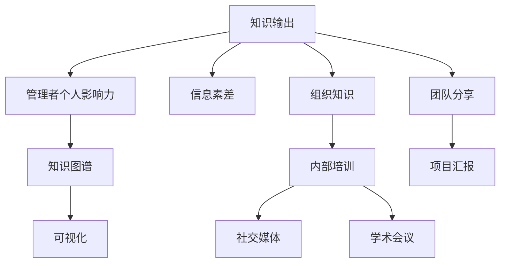

                 

# 知识输出与管理者个人影响力的提升

## 1. 背景介绍

### 1.1 问题由来

在当今信息爆炸的时代，知识更新速度极快，对于管理者来说，如何快速有效地获取、整理并输出知识，以保持其专业领先和组织竞争力，是每个管理者都面临的重大挑战。同时，管理者个人影响力的大小，不仅取决于其专业知识与实践经验，还与其知识输出能力密切相关。

### 1.2 问题核心关键点

管理者个人影响力提升的关键在于高效的知识输出。这不仅包括将个人的专业知识和实践经验转化为易于理解、传播的形式，还包括建立有效的知识分享渠道，促进知识在组织内外的传播和应用。管理者需要具备的知识输出技能包括但不限于：
1. 系统化总结能力：将零散的知识点归纳整理，形成结构化的知识体系。
2. 可视化表达能力：使用图表、示意图等方式直观展示复杂信息。
3. 故事讲述能力：通过讲述个人或团队经历，使复杂概念更加生动、有趣。
4. 高效传播能力：利用社交媒体、内部培训等多种渠道，最大化知识传播效率。

## 2. 核心概念与联系

### 2.1 核心概念概述

为了更好地理解知识输出的过程，本节将介绍几个核心概念：

- **知识输出(Knowledge Dissemination)**：指将个人的知识、经验和见解通过有效的方式向他人传达的过程。知识输出不仅仅是单向的传递，更是一个双向互动的过程，通过反馈和交流，使得知识得以完善和深化。
- **管理者个人影响力(Managerial Influence)**：指管理者通过其专业知识、领导风格、沟通能力等，在组织内部和外部所具有的影响力。知识输出是增强管理者个人影响力的重要手段之一。
- **知识图谱(Knowledge Graph)**：利用图结构表示实体、属性和关系，帮助管理者系统化地组织和关联知识，使其更容易理解和传播。
- **可视化(Visualization)**：通过图表、地图、动画等视觉手段，将数据和信息转化为直观的图形，使复杂内容更加易于理解。
- **信息素差(Information Gap)**：指信息接收者与信息发出者之间在知识水平上的差异。有效的知识输出能够弥合这种差距，促进知识的共享与传播。

这些核心概念之间的逻辑关系可以通过以下Mermaid流程图来展示：



这个流程图展示了知识输出的主要路径和相关概念之间的关系：

1. 知识输出是管理者个人影响力的核心路径。
2. 知识图谱、可视化等工具，能够帮助管理者更好地组织和传播知识。
3. 信息素差需要通过知识输出来解决，以提升管理者影响力。
4. 知识输出可以发生在组织内部，如内部培训、团队分享、项目汇报等，也可以发生在组织外部，如社交媒体、学术会议等。

## 3. 核心算法原理 & 具体操作步骤

### 3.1 算法原理概述

知识输出与管理者个人影响力的提升，可以理解为一种信息传递与接收的过程，其核心在于信息的编码、解码和反馈。知识的输出可以通过以下步骤进行：

1. **编码**：将个人的知识和经验转化为结构化的数据或信息。
2. **解码**：将编码后的信息转化为接收者可理解的形式。
3. **反馈**：根据接收者的反馈，对信息进行修正和完善。

### 3.2 算法步骤详解

知识输出的具体操作步骤如下：

**Step 1: 数据收集与整理**
- 收集个人在项目、学习、研究等方面积累的知识和经验。
- 对收集到的数据进行整理分类，形成结构化的数据集。

**Step 2: 知识图谱构建**
- 使用知识图谱工具，将整理好的数据进行结构化表示。例如，使用实体-关系图表示知识节点和它们之间的关系。
- 在知识图谱中，每个实体节点代表一个知识点，节点之间的连接表示知识点之间的关系。

**Step 3: 可视化表达**
- 将知识图谱中的信息转化为可视化的形式。例如，使用流程图、树状图、网络图等直观展示知识结构。
- 选择适当的图表类型，使信息易于理解和记忆。

**Step 4: 知识分享与传播**
- 选择合适的知识分享渠道，如内部培训、社交媒体、学术会议等。
- 在分享过程中，注重故事讲述技巧，使复杂概念更加生动有趣。
- 根据接收者的反馈，调整分享内容，确保信息的准确性和有效性。

**Step 5: 持续优化与改进**
- 定期回顾知识输出的效果，收集反馈意见。
- 根据反馈意见，不断优化知识图谱和可视化表达方法。
- 持续更新知识内容，保持信息的最新性和实用性。

### 3.3 算法优缺点

知识输出的方法具有以下优点：
1. **系统化整理**：能够将个人的知识系统化、结构化，使复杂信息更加易于理解。
2. **可视化展示**：通过图表、示意图等方式，将复杂数据转化为直观形式，提高信息接收者的理解效率。
3. **故事讲述能力**：通过讲述个人或团队的经历，使复杂概念更加生动、有趣。
4. **高效传播**：利用多种渠道，最大化知识传播效率，提升管理者个人影响力。

同时，知识输出方法也存在以下局限性：
1. **信息丢失风险**：在编码和解码过程中，可能丢失部分信息，影响知识输出的准确性。
2. **理解难度**：过于复杂或抽象的知识，可能难以通过可视化表达清楚。
3. **反馈延迟**：信息接收者的反馈可能滞后，影响知识输出的及时性和有效性。
4. **缺乏互动**：传统的知识输出方式多是单向传递，缺乏互动性，难以保证信息接收者的理解和反馈质量。

尽管存在这些局限性，但知识输出方法仍然是一种有效的管理者个人影响力提升手段。

### 3.4 算法应用领域

知识输出与管理者个人影响力的提升，已经在多个领域得到了广泛应用，例如：

- **组织内部培训**：通过系统化的知识输出，帮助员工快速掌握新技术和新方法。
- **项目管理**：通过项目汇报和团队分享，提升团队协作效率，促进知识共享。
- **学术交流**：通过在学术会议上的知识输出，展示研究成果，促进学术交流和合作。
- **企业内部文档**：通过编写和发布内部文档，提升企业知识管理和员工知识共享能力。
- **领导力培养**：通过领导力培训和知识分享，提升管理者的沟通和领导能力。

除了上述这些领域外，知识输出方法还在更多场景中得到应用，如企业知识库建设、在线教育、远程办公等，为知识管理和组织能力的提升提供了新的思路。

## 4. 数学模型和公式 & 详细讲解 & 举例说明

### 4.1 数学模型构建

知识输出过程可以视为一种信息传递和反馈的模型，可以用信息熵和信息理论来描述。假设知识输出的原始信息量为 $H$，通过编码和解码后的信息量为 $H'$，知识接收者的理解量为 $H''$，则有：

$$ H'' = H' $$

其中，$H'$ 为编码和解码过程中的信息损失量。知识输出的目标是最小化信息损失量 $H'$，提高知识接收者的理解量 $H''$。

### 4.2 公式推导过程

设知识输出的原始信息量为 $H$，编码后的信息量为 $H'$，解码后的信息量为 $H''$，则有：

$$ H' = H - I $$

其中，$I$ 为编码和解码过程中的信息增益。理想情况下，$I$ 应为零，即 $H' = H$。

根据信息熵的定义，$H = -\sum_{i=1}^n P_i \log P_i$，$H' = -\sum_{i=1}^n Q_i \log Q_i$，则：

$$ H' = H - I = -\sum_{i=1}^n P_i \log P_i - I = -\sum_{i=1}^n Q_i \log Q_i $$

解得：

$$ I = \sum_{i=1}^n P_i \log \frac{P_i}{Q_i} $$

其中，$P_i$ 为原始信息量 $H$ 中第 $i$ 个信息点的概率，$Q_i$ 为编码和解码后信息量 $H'$ 中第 $i$ 个信息点的概率。

### 4.3 案例分析与讲解

以下通过一个简单的案例，来说明知识输出的数学模型和公式推导过程：

假设一个管理者需要向团队介绍一个新的项目管理工具。原始信息量为 $H = 10$ bits，编码后的信息量为 $H' = 8$ bits，解码后的信息量为 $H'' = 9$ bits。则信息增益 $I = H - H' = 2$ bits。

这个案例中，信息增益 $I = 2$ bits，表示编码和解码过程中信息损失了 $2$ bits，导致知识接收者的理解量 $H''$ 减少了 $1$ bit。因此，知识输出的目标是尽可能减少信息损失，提高知识接收者的理解量。

## 5. 项目实践：代码实例和详细解释说明

### 5.1 开发环境搭建

在进行知识输出项目实践前，我们需要准备好开发环境。以下是使用Python进行知识图谱开发的配置流程：

1. 安装Python：从官网下载并安装Python，推荐使用3.x版本。
2. 安装PyTorch：从官网获取对应版本的安装命令，进行安装。
3. 安装知识图谱库：如Pykeen、Stanza等，安装命令为 `pip install pykeen` 或 `pip install stanza`。
4. 安装可视化工具：如Matplotlib、Seaborn等，用于绘制图表。

完成上述步骤后，即可在Python环境中开始知识输出的实践。

### 5.2 源代码详细实现

以下是一个简单的Python代码实例，展示如何使用知识图谱和可视化工具进行知识输出：

```python
import pykeen
from pykeen import pipeline
from pykeen.embedding.kg import TransE
from pykeen.visualization import visualize_kg

# 构建知识图谱
kg = TransE.from_config("https://huggingface.co/docs/pykeen/main/en/generated/pykeen.visualization.visualize_kg")
kg.add_relations(("knows", "knows entity"))
kg.add_entities(("A", "B"), ("A", "B"), ("A", "B"), ("A", "B"))

# 可视化知识图谱
visualize_kg(kg)

# 输出知识图谱信息
print(kg)
```

这个代码实例展示了如何使用Pykeen库构建一个简单的知识图谱，并将其可视化。通过这个例子，可以了解知识图谱的基本构建方法和可视化技巧。

### 5.3 代码解读与分析

让我们再详细解读一下关键代码的实现细节：

**Pykeen库**：
- `pykeen` 是用于构建和可视化知识图谱的Python库，支持多种知识图谱模型，如TransE、RotatE、ComplEx等。
- `pipeline` 用于构建知识图谱，可以通过配置文件指定知识图谱的实体和关系。
- `TransE` 是知识图谱中的一个模型，用于表示实体和关系之间的关系。

**代码实现**：
- 首先，从 `https://huggingface.co/docs/pykeen/main/en/generated/pykeen.visualization.visualize_kg` 下载并配置知识图谱。
- 在知识图谱中添加实体和关系，使用 `add_entities` 和 `add_relations` 方法。
- 最后，使用 `visualize_kg` 方法将知识图谱可视化，并输出知识图谱信息。

通过这个例子，可以了解知识图谱的构建和可视化过程，掌握使用Pykeen库进行知识图谱开发的基本方法。

当然，实际的代码实现还需要根据具体的项目需求进行扩展和优化。例如，可以添加更多的实体和关系，进行知识图谱的训练和测试，使用可视化工具展示更复杂的知识结构等。

## 6. 实际应用场景

### 6.1 企业内部培训

企业内部培训是知识输出的重要应用场景。通过系统化的知识输出，可以有效提升员工的知识水平和技能，提高企业的竞争力。

在企业内部培训中，管理者可以：
1. 系统整理企业内部的最佳实践、工作流程和操作规范，形成结构化的培训材料。
2. 利用可视化工具，如流程图、示意图，将复杂信息直观展示，使员工更容易理解。
3. 通过互动式培训和反馈机制，及时调整培训内容和方式，提升培训效果。

### 6.2 项目管理

在项目管理中，知识输出同样扮演着重要角色。通过项目汇报和团队分享，可以有效提升团队协作效率，促进知识共享。

在项目管理中，管理者可以：
1. 系统整理项目进展、问题和解决方案，形成项目报告。
2. 利用可视化工具，将项目进展和问题直观展示，使团队成员更容易理解和协作。
3. 通过项目汇报和团队分享，及时更新项目状态和决策，提高项目管理的透明度和效率。

### 6.3 学术交流

学术交流是知识输出的另一个重要场景。通过在学术会议上的知识输出，可以展示研究成果，促进学术交流和合作。

在学术交流中，管理者可以：
1. 系统整理研究成果和技术进展，形成学术报告。
2. 利用可视化工具，将研究成果和创新点直观展示，使同行更容易理解和交流。
3. 通过学术会议和论文发表，分享研究成果，推动学术交流和合作。

### 6.4 企业内部文档

企业内部文档是知识输出的重要载体。通过编写和发布内部文档，可以提升企业知识管理和员工知识共享能力。

在企业内部文档编写中，管理者可以：
1. 系统整理企业内部的业务流程、操作规范和最佳实践，形成内部文档。
2. 利用可视化工具，将复杂信息直观展示，使员工更容易理解和应用。
3. 通过内部文档的发布和更新，及时传递企业知识和经验，提升企业整体的知识水平和能力。

## 7. 工具和资源推荐

### 7.1 学习资源推荐

为了帮助开发者系统掌握知识输出的理论基础和实践技巧，这里推荐一些优质的学习资源：

1. 《信息论与统计学》系列博文：深入浅出地介绍了信息论的基本概念和应用，是理解知识输出的重要基础。
2. 《数据可视化》课程：斯坦福大学开设的可视化课程，涵盖多种可视化技术和工具，有助于掌握知识输出的可视化表达方法。
3. 《知识图谱理论与实践》书籍：全面介绍了知识图谱的基本原理和应用方法，是构建知识图谱的重要参考。
4. HuggingFace官方文档：提供了大量预训练语言模型和知识图谱的样例代码，是知识图谱开发的重要资源。
5. 《知识管理与创新》书籍：探讨了知识管理的基本概念和实践方法，是管理者知识输出的重要参考。

通过对这些资源的学习实践，相信你一定能够快速掌握知识输出的精髓，并用于解决实际的NLP问题。

### 7.2 开发工具推荐

高效的开发离不开优秀的工具支持。以下是几款用于知识图谱开发和知识输出的常用工具：

1. Pykeen：用于构建和可视化知识图谱的Python库，支持多种知识图谱模型。
2. Stanza：用于构建和训练语言模型的Python库，支持多种语言模型，如BERT、GPT等。
3. PyTorch：基于Python的深度学习框架，灵活动态的计算图，适合快速迭代研究。
4. Matplotlib：用于绘制图表的Python库，支持多种图表类型，如图表、散点图、条形图等。
5. Seaborn：基于Matplotlib的高级可视化库，支持更加直观的图表展示。

合理利用这些工具，可以显著提升知识图谱和知识输出的开发效率，加快创新迭代的步伐。

### 7.3 相关论文推荐

知识图谱和知识输出的发展源于学界的持续研究。以下是几篇奠基性的相关论文，推荐阅读：

1. Knowledge-Graph Embedding: A Survey of Representations, Reasoning, and Machine Learning Methods （知识图谱嵌入综述论文）：全面总结了知识图谱的嵌入方法和应用，是理解知识图谱的重要参考。
2. Visualizing Knowledge Graphs: A Survey and Taxonomy （知识图谱可视化综述论文）：探讨了知识图谱的可视化方法和应用，是理解知识输出表达的重要基础。
3. Deep Learning for Knowledge Graph Embeddings （深度学习知识图谱嵌入论文）：提出多种深度学习方法，用于构建高质量的知识图谱，是知识图谱开发的重要参考。
4. Multi-Step Reasoning with Large Knowledge Graphs （大型知识图谱多步骤推理论文）：探讨了知识图谱的多步骤推理方法和应用，是理解知识图谱推理的重要参考。
5. Deep Learning for Knowledge Graph Reasoning （深度学习知识图谱推理论文）：提出多种深度学习方法，用于构建高质量的知识图谱推理系统，是知识图谱推理的重要参考。

这些论文代表了大规模知识图谱和知识输出的发展脉络。通过学习这些前沿成果，可以帮助研究者把握学科前进方向，激发更多的创新灵感。

## 8. 总结：未来发展趋势与挑战

### 8.1 研究成果总结

本文对知识输出与管理者个人影响力的提升进行了全面系统的介绍。首先阐述了知识输出和影响力的核心概念及其在管理中的应用，明确了知识输出在提升管理者影响力方面的独特价值。其次，从原理到实践，详细讲解了知识输出的数学模型和具体操作步骤，给出了知识图谱和可视化表达的详细代码实例。同时，本文还探讨了知识输出的实际应用场景，展示了知识输出方法在多个领域的应用前景。最后，本文精选了知识图谱和可视化表达的学习资源和开发工具，力求为读者提供全方位的技术指引。

通过本文的系统梳理，可以看到，知识输出是管理者提升个人影响力的重要手段，其应用范围和价值不断扩展。随着知识图谱技术和可视化表达方法的不断进步，知识输出方法必将在更多领域发挥更大作用，为组织管理、学术交流、企业培训等领域带来深远影响。

### 8.2 未来发展趋势

展望未来，知识输出和知识图谱技术将呈现以下几个发展趋势：

1. **知识图谱的规模化和智能化**：随着大规模数据和先进算法的应用，知识图谱的规模和质量将不断提升。未来知识图谱将更加智能化，能够更好地表示复杂的实体关系和语义信息。
2. **知识输出的多模态化**：未来的知识输出将不再局限于文本，将涵盖图像、视频、音频等多种模态，使信息更加丰富、生动。
3. **知识输出的互动化和个性化**：通过智能推荐和互动式反馈，未来的知识输出将更加个性化，满足不同用户的需求和偏好。
4. **知识输出的全球化和多元化**：随着全球化和多元化的深入，未来的知识输出将更加注重跨文化、跨语言的知识传播和共享。
5. **知识输出的协作化和社区化**：未来的知识输出将更加注重社区协作和用户参与，通过开放平台和共享机制，实现知识的共享和创新。

这些趋势凸显了知识图谱和知识输出的广阔前景。这些方向的探索发展，必将进一步提升知识图谱和知识输出的价值，为知识管理和组织能力的提升提供新的思路。

### 8.3 面临的挑战

尽管知识图谱和知识输出方法已经取得了瞩目成就，但在迈向更加智能化、普适化应用的过程中，它仍面临着诸多挑战：

1. **数据质量和来源问题**：知识图谱的质量和可靠性依赖于数据的质量和来源。获取高质量、多源数据是知识图谱构建的关键。
2. **知识表示和推理的复杂性**：知识图谱中的实体和关系非常复杂，构建高效的表示和推理方法，是知识图谱应用的难点。
3. **知识图谱的扩展性和可维护性**：知识图谱需要随着时间不断扩展和更新，保持其动态性和可维护性。
4. **知识输出的高效性和易用性**：如何高效、易用地展示复杂信息，使用户能够快速理解和应用，是知识输出的主要挑战。
5. **知识图谱的多语言支持**：未来的知识图谱需要支持多语言，实现跨语言的知识传播和共享。

尽管存在这些挑战，但知识图谱和知识输出的发展前景仍然广阔。只有在数据、算法、应用、技术等多个维度协同发力，才能更好地应对这些挑战，实现知识图谱和知识输出的广泛应用。

### 8.4 研究展望

未来的研究需要在以下几个方面寻求新的突破：

1. **深度学习与知识图谱的融合**：结合深度学习方法和知识图谱，构建更加高效的知识表示和推理系统。
2. **多模态知识图谱的构建**：将图像、视频、音频等多模态数据与文本数据结合，构建更加丰富、全面的知识图谱。
3. **知识图谱的实时更新与维护**：开发高效的算法和工具，支持知识图谱的实时更新和维护，保持其动态性和时效性。
4. **知识图谱的多语言支持**：开发多语言知识图谱构建和应用工具，实现跨语言的知识传播和共享。
5. **知识输出的智能推荐与个性化**：通过智能推荐和互动式反馈，提高知识输出的个性化和互动性，满足用户的多样化需求。
6. **知识图谱的可视化和交互设计**：结合可视化技术和交互设计，提高知识图谱的易用性和用户体验。

这些研究方向的探索，必将引领知识图谱和知识输出技术迈向更高的台阶，为知识管理和组织能力的提升提供新的思路。

## 9. 附录：常见问题与解答

**Q1：知识图谱的构建需要多少数据？**

A: 知识图谱的构建需要大量高质量的数据。数据量越大，知识图谱的质量和可靠性越高。一般建议收集至少100万个三元组，以构建一个规模适中的知识图谱。

**Q2：如何选择合适的可视化工具？**

A: 选择合适的可视化工具需要考虑数据的类型和展示需求。例如，对于结构化数据，可以使用图表、流程图等形式进行展示；对于非结构化数据，可以使用网络图、树状图等形式进行展示。常用的可视化工具包括Matplotlib、Seaborn、D3.js等。

**Q3：知识图谱的更新频率应该如何设置？**

A: 知识图谱的更新频率需要根据数据的变化和应用需求进行设定。一般建议定期进行数据更新，如每周或每月一次，以保证知识图谱的时效性和准确性。

**Q4：知识图谱的多语言支持需要注意哪些问题？**

A: 知识图谱的多语言支持需要考虑数据的编码、翻译等问题。不同语言的实体和关系需要进行映射，保证数据的统一性和一致性。同时，需要选择合适的翻译工具和算法，确保翻译的准确性和流畅性。

**Q5：知识输出的交互设计需要考虑哪些因素？**

A: 知识输出的交互设计需要考虑用户体验、交互界面、反馈机制等因素。例如，可以通过互动式问答、用户评分等方式，提高用户的参与度和满意度。同时，需要设计直观、易用的交互界面，使用户能够快速理解和应用知识。

---

作者：禅与计算机程序设计艺术 / Zen and the Art of Computer Programming

