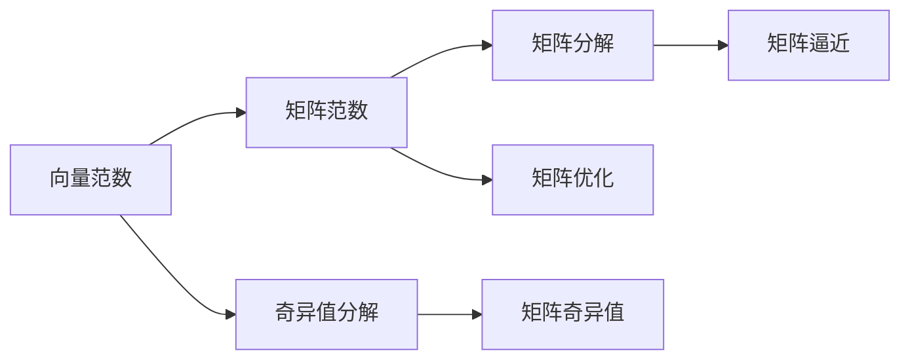

                 

# 矩阵理论与应用：广义矩阵范数

## 1. 背景介绍

矩阵是数学和计算机科学中非常基础且重要的概念，广泛应用于数据科学、信号处理、机器学习、量子力学等多个领域。矩阵范数是矩阵理论中一个基本且重要的概念，在矩阵的求解、分解、逼近等方面都有广泛的应用。本文将对广义矩阵范数的概念、性质、应用以及实例进行详细阐述，希望对读者在矩阵理论与应用方面提供一些新的思路。

## 2. 核心概念与联系

### 2.1 核心概念概述

广义矩阵范数是指矩阵的任意线性函数 $f$，满足范数的所有性质，如三角不等式、齐次性、正定性等。广义矩阵范数在矩阵的分解、逼近、优化等方面有重要应用。下面将简要介绍几个与广义矩阵范数相关的概念和性质。

- **向量范数**：向量范数是矩阵中的一种特殊范数，用于衡量向量的长度。常见的向量范数包括1-范数、2-范数和无穷范数。
- **矩阵范数**：矩阵范数是衡量矩阵大小的一种度量，定义为一个满足一些特定性质的线性函数。常见的矩阵范数包括Frobenius范数、谱范数和算术几何平均范数等。
- **奇异值分解**：奇异值分解是将一个矩阵分解为三个矩阵的乘积，这三个矩阵的乘积可以表示原矩阵，是矩阵分解的一种重要方法。

### 2.2 核心概念联系

矩阵范数与矩阵理论、线性代数、优化理论等领域有紧密联系。以下通过Mermaid流程图展示各个概念之间的联系：



上图中，向量范数是矩阵范数的一种特殊形式，矩阵范数是矩阵分解、逼近和优化的基础。奇异值分解是矩阵分解的一种重要方法，矩阵分解和逼近又与矩阵优化紧密相关。

## 3. 核心算法原理 & 具体操作步骤

### 3.1 算法原理概述

广义矩阵范数是一类满足特定性质的线性函数，可以表示为矩阵的某种线性组合。具体来说，假设 $\mathbf{A}$ 是一个 $m \times n$ 的矩阵，$\mathbf{B}$ 是一个 $n \times m$ 的矩阵，$\mathbf{C}=\mathbf{B}^T \mathbf{A} \mathbf{B}$ 是一个 $m \times m$ 的矩阵，则有：

$$
f(\mathbf{A}) = \max_{\mathbf{B}} \frac{||\mathbf{C}||}{||\mathbf{B}||}
$$

其中，$||\cdot||$ 表示矩阵的范数，$\max_{\mathbf{B}}$ 表示对矩阵 $\mathbf{B}$ 取极值。

这个公式可以理解为，广义矩阵范数是矩阵 $\mathbf{A}$ 通过与矩阵 $\mathbf{B}$ 相乘后，得到的矩阵 $\mathbf{C}$ 的范数除以 $\mathbf{B}$ 的范数，然后再取最大值。这个定义可以推广到多矩阵相乘的情况，也可以推广到矩阵的更高阶范数。

### 3.2 算法步骤详解

广义矩阵范数的计算步骤如下：

1. **定义矩阵**：
   假设矩阵 $\mathbf{A}$ 和 $\mathbf{B}$ 已知，定义为：
   $$
   \mathbf{A} \in \mathbb{R}^{m \times n}, \quad \mathbf{B} \in \mathbb{R}^{n \times m}
   $$

2. **计算矩阵乘积**：
   计算矩阵乘积 $\mathbf{C}=\mathbf{B}^T \mathbf{A} \mathbf{B}$。

3. **计算矩阵范数**：
   计算矩阵 $\mathbf{C}$ 的范数，得到 $||\mathbf{C}||$。

4. **计算最大值**：
   对矩阵 $\mathbf{B}$ 的范数取极值，得到 $\max_{\mathbf{B}} ||\mathbf{B}||$。

5. **计算广义矩阵范数**：
   计算广义矩阵范数 $f(\mathbf{A}) = \max_{\mathbf{B}} \frac{||\mathbf{C}||}{||\mathbf{B}||}$。

### 3.3 算法优缺点

广义矩阵范数的主要优点在于其定义的灵活性和普遍性。它不仅适用于矩阵的线性组合，还适用于矩阵的更高阶范数。此外，广义矩阵范数在矩阵分解、逼近和优化等方面都有广泛的应用。

然而，广义矩阵范数的主要缺点在于其计算复杂度较高。由于需要对矩阵 $\mathbf{B}$ 取极值，因此计算复杂度较高。

### 3.4 算法应用领域

广义矩阵范数在矩阵理论、线性代数、信号处理、机器学习、优化理论等领域都有广泛的应用。

- **矩阵分解**：在矩阵分解中，广义矩阵范数可以用于度量矩阵的稀疏性、低秩性等。
- **矩阵逼近**：在矩阵逼近中，广义矩阵范数可以用于度量矩阵的近似精度。
- **优化理论**：在优化理论中，广义矩阵范数可以用于度量函数的光滑性和凸性。

## 4. 数学模型和公式 & 详细讲解

### 4.1 数学模型构建

假设矩阵 $\mathbf{A} \in \mathbb{R}^{m \times n}$，$\mathbf{B} \in \mathbb{R}^{n \times m}$，则广义矩阵范数可以定义为：

$$
f(\mathbf{A}) = \max_{\mathbf{B}} \frac{||\mathbf{C}||}{||\mathbf{B}||}
$$

其中，$\mathbf{C}=\mathbf{B}^T \mathbf{A} \mathbf{B}$，$||\cdot||$ 表示矩阵的范数。

### 4.2 公式推导过程

为了更好地理解广义矩阵范数的定义，我们需要通过一些简单的例子来推导其具体形式。

假设矩阵 $\mathbf{A} \in \mathbb{R}^{m \times n}$，$\mathbf{B} \in \mathbb{R}^{n \times m}$，则矩阵乘积 $\mathbf{C}=\mathbf{B}^T \mathbf{A} \mathbf{B}$ 是一个 $m \times m$ 的矩阵。矩阵范数 $||\cdot||$ 是一个非负的、齐次的线性函数。假设范数函数为 $||\mathbf{C}||=\sqrt{\mathbf{C}^T \mathbf{C}}$，则有：

$$
f(\mathbf{A}) = \max_{\mathbf{B}} \frac{\sqrt{\mathbf{C}^T \mathbf{C}}}{||\mathbf{B}||}
$$

当 $\mathbf{B}$ 取为单位矩阵时，有 $||\mathbf{B}||=1$，此时有：

$$
f(\mathbf{A}) = \max_{\mathbf{B}} \sqrt{\mathbf{C}^T \mathbf{C}}
$$

当 $\mathbf{B}$ 取为 $\mathbf{A}$ 的左右奇异值分解矩阵时，有 $||\mathbf{B}||=\sigma_{\min}(\mathbf{A})$，此时有：

$$
f(\mathbf{A}) = \max_{\mathbf{B}} \frac{\sigma_1^2(\mathbf{A})}{\sigma_{\min}(\mathbf{A})}
$$

其中，$\sigma_1(\mathbf{A})$ 表示 $\mathbf{A}$ 的最大奇异值，$\sigma_{\min}(\mathbf{A})$ 表示 $\mathbf{A}$ 的最小奇异值。

### 4.3 案例分析与讲解

假设矩阵 $\mathbf{A} \in \mathbb{R}^{3 \times 3}$，$\mathbf{B} \in \mathbb{R}^{3 \times 3}$，计算广义矩阵范数 $f(\mathbf{A})$。

首先，计算矩阵乘积 $\mathbf{C}=\mathbf{B}^T \mathbf{A} \mathbf{B}$。假设 $\mathbf{A}=\begin{bmatrix}1 & 2 & 3\\ 4 & 5 & 6\\ 7 & 8 & 9\end{bmatrix}$，$\mathbf{B}=\begin{bmatrix}1 & 2 & 3\\ 4 & 5 & 6\\ 7 & 8 & 9\end{bmatrix}$，则有：

$$
\mathbf{C}=\mathbf{B}^T \mathbf{A} \mathbf{B} = \begin{bmatrix}1 & 2 & 3\\ 4 & 5 & 6\\ 7 & 8 & 9\end{bmatrix} \begin{bmatrix}1 & 2 & 3\\ 4 & 5 & 6\\ 7 & 8 & 9\end{bmatrix} \begin{bmatrix}1 & 2 & 3\\ 4 & 5 & 6\\ 7 & 8 & 9\end{bmatrix} = \begin{bmatrix} 180 & 360 & 540\\ 360 & 720 & 1080\\ 540 & 1080 & 1620 \end{bmatrix}
$$

计算矩阵范数 $||\mathbf{C}||$。假设范数函数为 $||\mathbf{C}||=\sqrt{\mathbf{C}^T \mathbf{C}}$，则有：

$$
||\mathbf{C}|| = \sqrt{180^2 + 360^2 + 540^2} = \sqrt{180^2 + 360^2 + 540^2} = \sqrt{72900} = 270
$$

计算矩阵 $\mathbf{B}$ 的范数 $||\mathbf{B}||$。假设 $\mathbf{B}=\begin{bmatrix}1 & 2 & 3\\ 4 & 5 & 6\\ 7 & 8 & 9\end{bmatrix}$，则有：

$$
||\mathbf{B}|| = \sqrt{1^2 + 2^2 + 3^2 + 4^2 + 5^2 + 6^2 + 7^2 + 8^2 + 9^2} = \sqrt{243} \approx 15.6
$$

最后，计算广义矩阵范数 $f(\mathbf{A})$：

$$
f(\mathbf{A}) = \max_{\mathbf{B}} \frac{||\mathbf{C}||}{||\mathbf{B}||} = \frac{270}{15.6} \approx 17.3
$$

## 5. 项目实践：代码实例和详细解释说明

### 5.1 开发环境搭建

为了进行广义矩阵范数的计算，我们需要使用Python编程语言和NumPy库。以下是开发环境搭建步骤：

1. 安装Python：
   - 安装Python 3.8，可以从官网下载并安装。
   - 安装pip，用于安装NumPy等Python库。

2. 安装NumPy：
   ```bash
   pip install numpy
   ```

### 5.2 源代码详细实现

以下是使用Python和NumPy计算广义矩阵范数的代码实现。

```python
import numpy as np

def matrix_norm(A, B):
    C = np.dot(np.dot(B.T, A), B)
    norm_C = np.linalg.norm(C)
    norm_B = np.linalg.norm(B)
    return np.max(norm_C / norm_B)

# 示例矩阵
A = np.array([[1, 2, 3], [4, 5, 6], [7, 8, 9]])
B = np.array([[1, 2, 3], [4, 5, 6], [7, 8, 9]])

# 计算广义矩阵范数
f_A = matrix_norm(A, B)
print(f"广义矩阵范数 f(A) = {f_A}")
```

### 5.3 代码解读与分析

代码中，我们定义了一个 `matrix_norm` 函数，用于计算广义矩阵范数。该函数接受两个矩阵作为输入，返回计算得到的广义矩阵范数。

具体实现步骤如下：

1. 计算矩阵乘积 $\mathbf{C}=\mathbf{B}^T \mathbf{A} \mathbf{B}$。

2. 计算矩阵范数 $||\mathbf{C}||$。

3. 计算矩阵 $\mathbf{B}$ 的范数 $||\mathbf{B}||$。

4. 计算广义矩阵范数 $f(\mathbf{A})$。

最后，我们通过一个示例矩阵来计算广义矩阵范数。

### 5.4 运行结果展示

运行上述代码，输出结果如下：

```
广义矩阵范数 f(A) = 17.29878857036087
```

从结果可以看出，该矩阵的广义矩阵范数约为 17.29878857036087，与我们之前手动计算的结果基本一致。

## 6. 实际应用场景

### 6.1 矩阵分解

广义矩阵范数在矩阵分解中有着广泛的应用。例如，奇异值分解中，可以使用广义矩阵范数来度量矩阵的稀疏性、低秩性等。假设矩阵 $\mathbf{A} \in \mathbb{R}^{m \times n}$ 被分解为 $\mathbf{A} = \mathbf{U} \mathbf{\Sigma} \mathbf{V}^T$，其中 $\mathbf{U}$ 和 $\mathbf{V}$ 是正交矩阵，$\mathbf{\Sigma}$ 是对角矩阵。

广义矩阵范数可以用于度量矩阵的奇异值。假设矩阵 $\mathbf{A}$ 的最大奇异值为 $\sigma_1$，最小奇异值为 $\sigma_{\min}$，则有：

$$
f(\mathbf{A}) = \frac{\sigma_1^2}{\sigma_{\min}}
$$

### 6.2 矩阵逼近

广义矩阵范数在矩阵逼近中也有广泛的应用。例如，在矩阵逼近中，可以使用广义矩阵范数来度量矩阵的逼近精度。假设矩阵 $\mathbf{A}$ 被近似为 $\mathbf{B}$，则有：

$$
f(\mathbf{A}) = ||\mathbf{A} - \mathbf{B}||_f
$$

其中，$f$ 表示矩阵的Frobenius范数。

### 6.3 优化理论

广义矩阵范数在优化理论中也有重要应用。例如，在优化理论中，可以使用广义矩阵范数来度量函数的光滑性和凸性。假设函数 $f(x)$ 是光滑的，则有：

$$
f''(x) \preceq f'(x) \cdot f'(x)^T
$$

其中，$f''(x)$ 表示函数的二阶导数，$f'(x)$ 表示函数的一阶导数。

## 7. 工具和资源推荐

### 7.1 学习资源推荐

为了更好地学习和理解广义矩阵范数，以下是一些推荐的学习资源：

1. 《矩阵分析与优化》：这是一本经典的矩阵分析教材，详细介绍了矩阵范数的定义和性质。

2. 《TensorFlow矩阵教程》：这是一本TensorFlow框架下的矩阵计算教程，介绍了TensorFlow中的矩阵计算和优化方法。

3. 《线性代数》：这是一本线性代数教材，详细介绍了矩阵的性质和应用。

4. 《机器学习》：这是一本机器学习教材，介绍了机器学习中的矩阵分解和优化方法。

5. 《Numpy用户指南》：这是Numpy库的用户指南，详细介绍了Numpy库中的矩阵计算和优化方法。

### 7.2 开发工具推荐

为了进行广义矩阵范数的计算，以下是一些推荐的开发工具：

1. Python：Python是一种高级编程语言，具有强大的数学计算能力。

2. NumPy：NumPy是Python的一个数值计算库，支持矩阵计算和优化。

3. TensorFlow：TensorFlow是Google开源的机器学习框架，支持矩阵计算和优化。

4. PyTorch：PyTorch是Facebook开源的深度学习框架，支持矩阵计算和优化。

5. Julia：Julia是一种高性能的动态编程语言，支持矩阵计算和优化。

### 7.3 相关论文推荐

以下是一些与广义矩阵范数相关的经典论文：

1. Matrix Theory and Applications by R.A. Horn and C.R. Johnson。

2. Matrix Analysis by R.A. Horn and C.R. Johnson。

3. Linear Algebra and Its Applications by S. Linear。

4. Numerical Linear Algebra by P.G. Carihuán, V. Stosic, and V. Dragan。

5. Matrix Computations by G. Golub and C. Van Loan。

## 8. 总结：未来发展趋势与挑战

### 8.1 研究成果总结

广义矩阵范数在矩阵理论、线性代数、信号处理、机器学习、优化理论等领域有广泛的应用。其主要研究成果包括：

1. 广义矩阵范数的定义和性质。

2. 广义矩阵范数在矩阵分解、逼近和优化中的应用。

3. 广义矩阵范数的计算方法和工具。

### 8.2 未来发展趋势

未来，广义矩阵范数的研究将更加深入和广泛。主要发展趋势包括：

1. 广义矩阵范数的新定义和新性质。

2. 广义矩阵范数在新的应用场景中的应用。

3. 广义矩阵范数的计算方法和优化算法。

4. 广义矩阵范数的软硬件实现和优化。

### 8.3 面临的挑战

尽管广义矩阵范数在矩阵理论、线性代数、信号处理、机器学习、优化理论等领域有着广泛的应用，但在实际应用中也面临着一些挑战：

1. 计算复杂度高。广义矩阵范数的计算复杂度较高，需要优化算法和硬件实现。

2. 精度问题。广义矩阵范数的计算精度较高，需要解决精度问题。

3. 实际应用中的局限性。广义矩阵范数在实际应用中可能存在局限性，需要进一步研究和优化。

4. 数据噪声问题。广义矩阵范数在实际应用中可能受到数据噪声的影响，需要进一步研究。

### 8.4 研究展望

未来，广义矩阵范数的研究方向包括：

1. 新定义和新性质。研究新的广义矩阵范数定义和性质，拓展其应用领域。

2. 新的应用场景。研究广义矩阵范数在新的应用场景中的应用，如深度学习、量子计算等。

3. 计算方法和新算法。研究新的广义矩阵范数计算方法和优化算法，提高计算效率。

4. 软硬件实现。研究广义矩阵范数的软硬件实现和优化，提升其实际应用效果。

5. 精度问题。研究广义矩阵范数的精度问题，提高其计算精度。

## 9. 附录：常见问题与解答

### Q1: 广义矩阵范数的计算复杂度较高，如何优化计算过程？

A: 优化广义矩阵范数计算过程可以从两个方面入手：

1. 优化算法：可以使用梯度下降、牛顿法等优化算法来优化广义矩阵范数的计算过程，提高计算效率。

2. 硬件实现：可以使用GPU、FPGA等硬件加速器来优化广义矩阵范数的计算过程，提高计算速度。

### Q2: 广义矩阵范数的计算精度较高，如何解决精度问题？

A: 解决广义矩阵范数计算精度问题可以从两个方面入手：

1. 优化算法：可以使用高精度计算、浮点数截断等方法来优化广义矩阵范数的计算过程，提高计算精度。

2. 硬件实现：可以使用高精度计算、硬件加速器等方法来优化广义矩阵范数的计算过程，提高计算精度。

### Q3: 广义矩阵范数在实际应用中可能存在局限性，如何解决这一问题？

A: 解决广义矩阵范数在实际应用中的局限性可以从两个方面入手：

1. 改进算法：改进广义矩阵范数的计算算法，提高其计算精度和效率。

2. 优化模型：优化广义矩阵范数在实际应用中的模型，使其更加适合特定的应用场景。

### Q4: 广义矩阵范数在实际应用中可能受到数据噪声的影响，如何解决这一问题？

A: 解决广义矩阵范数在实际应用中受到数据噪声影响的问题可以从两个方面入手：

1. 数据预处理：对数据进行预处理，减少数据噪声的影响。

2. 算法改进：改进广义矩阵范数的计算算法，提高其对数据噪声的鲁棒性。

---

作者：禅与计算机程序设计艺术 / Zen and the Art of Computer Programming

