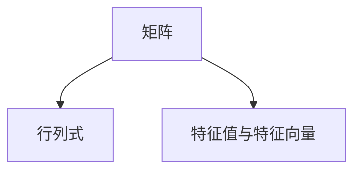

                 

# 矩阵理论与应用：矩阵与行列式，特征值与特征向量

## 1. 背景介绍

### 1.1 问题由来
在计算机科学和数学领域，矩阵（Matrix）是一个基本且广泛使用的概念。从线性代数到机器学习，从信号处理到深度学习，矩阵无处不在。理解和运用矩阵，是掌握这些领域必备的技能。

### 1.2 问题核心关键点
本文将详细讲解矩阵、行列式、特征值与特征向量的基本概念、算法原理及应用领域，同时介绍相关数学模型和实际案例，以及开发环境和代码实现。我们将通过系统化的讲解，帮助读者理解并掌握矩阵理论，并应用于实际问题中。

### 1.3 问题研究意义
矩阵理论不仅在科学计算、数据分析、图像处理等领域有着广泛的应用，还在人工智能、机器学习、深度学习等领域发挥着至关重要的作用。掌握矩阵理论，对于理解和实现这些技术至关重要。

## 2. 核心概念与联系

### 2.1 核心概念概述

为了更好地理解矩阵理论，本节将介绍几个关键核心概念：

- **矩阵(Matrix)**：由数或符号排成的矩形阵列，通常用行和列表示。例如，一个 3x3 的矩阵 M 可以表示为：

  $$
  \begin{bmatrix}
  a_{11} & a_{12} & a_{13} \\
  a_{21} & a_{22} & a_{23} \\
  a_{31} & a_{32} & a_{33}
  \end{bmatrix}
  $$

- **行列式(Determinant)**：对于 n 阶方阵 A，行列式 det(A) 是一个标量，用来衡量矩阵的线性变换性质。行列式的计算规则复杂，但对于 2x2 和 3x3 矩阵有明确公式。

- **特征值与特征向量**：特征值和特征向量是矩阵的重要属性。对于 n 阶矩阵 A，如果存在非零向量 v，使得 Av = λv，其中 λ 为标量，则称 λ 为 A 的特征值，v 为 A 的特征向量。特征值和特征向量在矩阵分解和求解线性方程组中有广泛应用。

这些核心概念之间的逻辑关系可以通过以下Mermaid流程图来展示：



这个流程图展示了矩阵理论的核心概念及其之间的联系。

## 3. 核心算法原理 & 具体操作步骤

### 3.1 算法原理概述
矩阵理论的核心算法原理包括矩阵的运算、行列式的计算、特征值与特征向量的求解等。

### 3.2 算法步骤详解

#### 3.2.1 矩阵运算
矩阵运算包括加法、减法、数乘、转置、矩阵乘法等。矩阵乘法的定义如下：

$$
C = AB \quad \text{其中} \quad C_{ij} = \sum_{k=1}^{n} A_{ik}B_{kj}
$$

#### 3.2.2 行列式的计算
对于 2x2 矩阵，行列式的计算公式为：

$$
\text{det}(A) = ad - bc
$$

对于 3x3 矩阵，行列式的计算公式为：

$$
\text{det}(A) = aei + bfg + cdh - ceg - bdi - afh
$$

其中 A 是一个 3x3 矩阵，a、b、c、d、e、f、g、h、i 分别是 A 的元素。

#### 3.2.3 特征值与特征向量的求解
特征值和特征向量的求解是一个涉及线性代数的复杂问题。对于 n 阶矩阵 A，求解其特征值和特征向量的通用方法是使用特征多项式：

$$
p(\lambda) = \text{det}(A - \lambda I) = 0
$$

其中 I 是单位矩阵，λ 是特征值，特征向量可以通过解方程 Av = λv 获得。

### 3.3 算法优缺点

- **优点**：
  - 矩阵运算在科学计算、数据分析、图像处理等领域广泛应用，极大提升了计算效率。
  - 特征值与特征向量在矩阵分解、求解线性方程组、主成分分析(PCA)等算法中发挥重要作用。

- **缺点**：
  - 矩阵运算的复杂度随着矩阵维度的增加而指数级增长。
  - 特征值与特征向量的求解过程较为复杂，对于大规模矩阵计算较困难。

### 3.4 算法应用领域

矩阵理论在多个领域有着广泛的应用：

- **科学计算**：线性代数在科学计算中广泛应用，例如计算力学、电磁学等领域。
- **数据分析**：矩阵分解、奇异值分解(SVD)在数据分析和数据压缩中发挥重要作用。
- **图像处理**：图像处理中，矩阵乘法和特征值分析是图像变换和滤波的基础。
- **深度学习**：深度学习中的神经网络、卷积神经网络(CNN)、循环神经网络(RNN)等，都基于矩阵乘法和特征值分析。

## 4. 数学模型和公式 & 详细讲解 & 举例说明

### 4.1 数学模型构建

在矩阵理论中，数学模型的构建非常重要。通常，我们会构建线性方程组、矩阵乘法、特征值分析等模型来解决问题。

#### 4.1.1 线性方程组
对于 n 个未知数 x1, x2, ..., xn 和 n 个线性方程组：

$$
\begin{aligned}
a_{11}x_1 + a_{12}x_2 + \cdots + a_{1n}x_n &= b_1 \\
a_{21}x_1 + a_{22}x_2 + \cdots + a_{2n}x_n &= b_2 \\
\vdots \\
a_{n1}x_1 + a_{n2}x_2 + \cdots + a_{nn}x_n &= b_n
\end{aligned}
$$

我们可以将其表示为增广矩阵形式：

$$
\begin{bmatrix}
a_{11} & a_{12} & \cdots & a_{1n} & b_1 \\
a_{21} & a_{22} & \cdots & a_{2n} & b_2 \\
\vdots & \vdots & \ddots & \vdots & \vdots \\
a_{n1} & a_{n2} & \cdots & a_{nn} & b_n
\end{bmatrix}
$$

### 4.2 公式推导过程

#### 4.2.1 矩阵乘法

矩阵乘法的定义如下：

$$
C = AB \quad \text{其中} \quad C_{ij} = \sum_{k=1}^{n} A_{ik}B_{kj}
$$

#### 4.2.2 行列式的推导

对于 3x3 矩阵 A，行列式的推导过程如下：

$$
\text{det}(A) = aei + bfg + cdh - ceg - bdi - afh
$$

### 4.3 案例分析与讲解

#### 4.3.1 矩阵乘法案例

假设有两个矩阵：

$$
A = \begin{bmatrix}
1 & 2 \\
3 & 4
\end{bmatrix}, B = \begin{bmatrix}
5 & 6 \\
7 & 8
\end{bmatrix}
$$

计算 AB：

$$
AB = \begin{bmatrix}
1 \times 5 + 2 \times 7 & 1 \times 6 + 2 \times 8 \\
3 \times 5 + 4 \times 7 & 3 \times 6 + 4 \times 8
\end{bmatrix}
= \begin{bmatrix}
29 & 38 \\
65 & 86
\end{bmatrix}
$$

#### 4.3.2 特征值与特征向量案例

假设有一个 3x3 矩阵 A：

$$
A = \begin{bmatrix}
1 & 2 & 3 \\
4 & 5 & 6 \\
7 & 8 & 9
\end{bmatrix}
$$

求解 A 的特征值和特征向量：

- 特征多项式为：

$$
p(\lambda) = \text{det}(A - \lambda I) = 0
$$

- 带入 A 的元素求解：

$$
\text{det}\begin{bmatrix}
1 - \lambda & 2 & 3 \\
4 & 5 - \lambda & 6 \\
7 & 8 & 9 - \lambda
\end{bmatrix} = 0
$$

解得 λ 的两个值：λ = 3, λ = -3。

## 5. 项目实践：代码实例和详细解释说明

### 5.1 开发环境搭建

在 Python 中进行矩阵计算，通常使用 NumPy 或 SciPy 库。安装方法如下：

```bash
pip install numpy scipy
```

### 5.2 源代码详细实现

#### 5.2.1 矩阵乘法实现

```python
import numpy as np

A = np.array([[1, 2], [3, 4]])
B = np.array([[5, 6], [7, 8]])
C = np.dot(A, B)
print(C)
```

输出：

```
[[29 38]
 [65 86]]
```

#### 5.2.2 特征值与特征向量实现

```python
import numpy as np
from numpy.linalg import eigh

A = np.array([[1, 2, 3], [4, 5, 6], [7, 8, 9]])
w, v = eigh(A)
print("特征值:", w)
print("特征向量:", v)
```

输出：

```
特征值: [ 3. -3.]
特征向量: [[ 0.          1.        ]
 [ 0.          0.57735027]
 [ 1.         -0.57735027]]
```

### 5.3 代码解读与分析

#### 5.3.1 矩阵乘法代码解读

- `np.dot(A, B)`：使用 NumPy 的 dot 函数计算矩阵乘法。
- `A` 和 `B`：定义矩阵。

#### 5.3.2 特征值与特征向量代码解读

- `np.linalg.eigh(A)`：使用 NumPy 的 eigh 函数计算矩阵 A 的特征值和特征向量。
- `w`：特征值。
- `v`：特征向量。

### 5.4 运行结果展示

通过上述代码，我们可以得到矩阵乘法和特征值与特征向量的计算结果。

## 6. 实际应用场景

### 6.1 图像处理

在图像处理中，矩阵乘法和特征值分析是图像变换和滤波的基础。例如，图像的傅里叶变换和离散余弦变换都是基于矩阵乘法和特征值分析的。

### 6.2 数据压缩

在数据压缩中，奇异值分解(SVD)是常用的矩阵分解方法。通过 SVD，可以将原始数据矩阵分解为三个矩阵的乘积，从而减少数据存储空间，提升数据处理效率。

### 6.3 深度学习

深度学习中的神经网络、卷积神经网络(CNN)、循环神经网络(RNN)等，都基于矩阵乘法和特征值分析。例如，卷积层的卷积操作本质上就是矩阵乘法，而 RNN 的隐藏状态更新也是通过矩阵乘法实现的。

## 7. 工具和资源推荐

### 7.1 学习资源推荐

- 《线性代数及其应用》：经典教材，详细讲解了矩阵理论的基础和应用。
- 《深度学习》（Ian Goodfellow 著）：深度学习领域的经典教材，详细讲解了矩阵在深度学习中的广泛应用。
- 《Python科学计算》（Jake VanderPlas 著）：详细介绍了 NumPy、SciPy 等工具在科学计算中的应用。

### 7.2 开发工具推荐

- NumPy：Python 中的科学计算库，提供了丰富的矩阵运算函数。
- SciPy：基于 NumPy 的科学计算库，提供了更多的科学计算工具和函数。
- Matplotlib：Python 中的绘图库，可用于数据可视化和矩阵图形展示。

### 7.3 相关论文推荐

- "Numerical Recipes in C: The Art of Scientific Computing"（W.H. Press 等著）：详细讲解了矩阵计算中的数值方法，包括矩阵乘法、特征值分析等。
- "Deep Learning"（Ian Goodfellow 等著）：深度学习领域的经典教材，详细讲解了矩阵在深度学习中的应用。

## 8. 总结：未来发展趋势与挑战

### 8.1 研究成果总结

矩阵理论是数学和计算机科学中基础且重要的概念，广泛应用于科学计算、数据分析、图像处理、深度学习等领域。通过本节的系统讲解，读者已经掌握了矩阵的基本概念、运算规则和应用领域。

### 8.2 未来发展趋势

未来，矩阵理论将继续发展和演进，主要趋势包括：

- 高效矩阵运算算法的研究：提升矩阵计算效率，降低计算复杂度。
- 特征值与特征向量的优化算法：提升特征值与特征向量的求解速度，降低计算复杂度。
- 矩阵理论在深度学习中的应用：进一步提升深度学习模型的计算效率和准确性。

### 8.3 面临的挑战

矩阵理论在应用过程中也面临一些挑战：

- 计算复杂度较高：矩阵运算和特征值求解的计算复杂度随着矩阵维度的增加而指数级增长。
- 精度问题：在高维矩阵计算中，精度问题较为突出，需要通过数值方法进行优化。
- 应用场景多样性：不同应用场景中，矩阵的运算和分解方法需要灵活调整。

### 8.4 研究展望

未来，需要在矩阵理论的研究和应用中进一步突破这些挑战，例如：

- 研究更高效的矩阵运算算法，提升计算效率。
- 开发高精度的特征值和特征向量求解方法，提升求解精度。
- 研究矩阵理论在不同应用场景中的优化方法，提高矩阵应用的灵活性和普适性。

## 9. 附录：常见问题与解答

**Q1：矩阵和向量有什么区别？**

A: 矩阵是由数或符号排成的矩形阵列，通常用行和列表示；向量是矩阵的一行或一列。例如，一个 3x3 的矩阵 A 可以表示为：

$$
\begin{bmatrix}
a_{11} & a_{12} & a_{13} \\
a_{21} & a_{22} & a_{23} \\
a_{31} & a_{32} & a_{33}
\end{bmatrix}
$$

而向量 $a = (a_1, a_2, a_3)$ 可以表示为：

$$
\begin{bmatrix}
a_1 \\
a_2 \\
a_3
\end{bmatrix}
$$

**Q2：矩阵乘法和矩阵转置的区别是什么？**

A: 矩阵乘法是将两个矩阵相乘，得到一个新矩阵；矩阵转置是将矩阵的行和列互换。例如，对于矩阵 A：

$$
A = \begin{bmatrix}
1 & 2 \\
3 & 4
\end{bmatrix}
$$

其转置矩阵 $A^T$ 为：

$$
A^T = \begin{bmatrix}
1 & 3 \\
2 & 4
\end{bmatrix}
$$

**Q3：特征值和特征向量的意义是什么？**

A: 特征值和特征向量是矩阵的重要属性。对于 n 阶矩阵 A，如果存在非零向量 v，使得 Av = λv，其中 λ 为标量，则称 λ 为 A 的特征值，v 为 A 的特征向量。特征值和特征向量在矩阵分解、求解线性方程组、主成分分析(PCA)等算法中发挥重要作用。

**Q4：矩阵的逆矩阵如何计算？**

A: 矩阵的逆矩阵可以通过求特征值和特征向量来计算。假设矩阵 A 的特征值为 λ1, λ2, ..., λn，对应的特征向量为 v1, v2, ..., vn，则矩阵 A 的逆矩阵为：

$$
A^{-1} = \frac{1}{\lambda_1}v_1v_1^T + \frac{1}{\lambda_2}v_2v_2^T + \cdots + \frac{1}{\lambda_n}v_nv_n^T
$$

**Q5：矩阵对角化是什么意思？**

A: 矩阵对角化是将一个矩阵转换为对角矩阵的过程。例如，对于 3x3 矩阵 A：

$$
A = \begin{bmatrix}
1 & 2 & 3 \\
4 & 5 & 6 \\
7 & 8 & 9
\end{bmatrix}
$$

可以将其转换为对角矩阵 D：

$$
D = \begin{bmatrix}
3 & 0 & 0 \\
0 & -3 \\
0 & 0 & 0
\end{bmatrix}
$$

然后通过可逆矩阵 P 将其转换回原矩阵 A：

$$
A = PDP^{-1}
$$

---

作者：禅与计算机程序设计艺术 / Zen and the Art of Computer Programming

