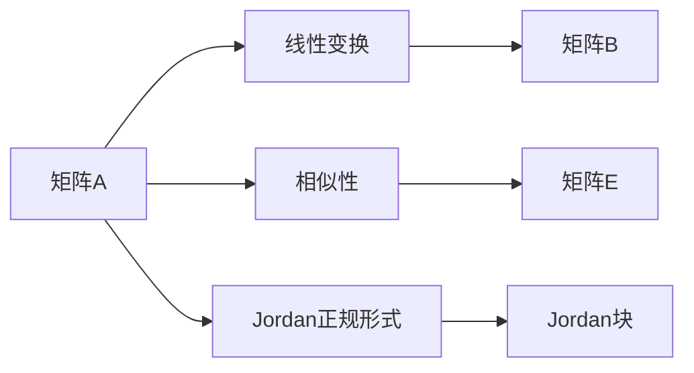

                 

# 矩阵理论与应用：线性变换与矩阵表示，相似性与Jordan正规形式

## 1. 背景介绍

矩阵作为线性代数的基础工具，广泛应用于各种实际问题，从信号处理、图像处理到机器学习、优化问题，几乎无处不在。矩阵的线性变换和矩阵表示是其核心概念，通过这些概念，可以将许多现实世界中的问题转化为线性代数问题。

矩阵的相似性是线性代数中的重要概念，了解矩阵的相似性可以帮助我们理解矩阵的性质和线性变换的本质。而Jordan正规形式则是矩阵理论中的一个重要概念，它揭示了矩阵的深层次结构，为求解矩阵问题提供了有力的工具。

本文将对矩阵理论与应用，包括线性变换、矩阵表示、相似性以及Jordan正规形式进行详细讲解，并通过案例和代码实例进行展示。

## 2. 核心概念与联系

### 2.1 核心概念概述

矩阵是二维数组，可以表示为

$$
A=\begin{pmatrix} a_{11} & a_{12} & \cdots & a_{1n} \\ a_{21} & a_{22} & \cdots & a_{2n} \\ \vdots & \vdots & \ddots & \vdots \\ a_{m1} & a_{m2} & \cdots & a_{mn} \end{pmatrix}
$$

其中 $a_{ij}$ 为矩阵元素，$m$ 和 $n$ 分别表示矩阵的行数和列数。

矩阵的线性变换是指通过对矩阵进行加法、数乘以及矩阵乘法等线性运算，将一个向量（或矩阵）映射到另一个向量（或矩阵）的线性变换。线性变换在计算机图形学、数字信号处理以及图像处理等领域有广泛的应用。

相似性是指两个矩阵具有相同的特征值，且可以表示为彼此相似。对于两个 $n\times n$ 的矩阵 $A$ 和 $B$，如果存在一个可逆矩阵 $P$，使得

$$
B=P^{-1}AP
$$

则称 $B$ 与 $A$ 相似，记为 $B \sim A$。相似矩阵的特征值相同，且可以进行相互转换，具有许多重要的数学性质。

Jordan正规形式是一种特殊的矩阵形式，用于揭示矩阵的深层次结构，包括矩阵的特征值和特征向量等重要信息。Jordan正规形式中的矩阵被分为若干个Jordan块，每个Jordan块对应矩阵的一个特征值和特征向量。

### 2.2 核心概念原理和架构的 Mermaid 流程图

以下是一个简化的流程图，展示了矩阵的线性变换、相似性和Jordan正规形式之间的关系：



这个流程图展示了矩阵A通过线性变换得到矩阵B，相似性下得到矩阵E，以及通过Jordan正规形式分解为Jordan块的过程。

## 3. 核心算法原理 & 具体操作步骤

### 3.1 算法原理概述

线性变换是矩阵理论中最基础的概念之一，通过线性变换，可以对向量或矩阵进行各种几何或代数操作。矩阵的相似性是线性代数中的重要概念，相似的矩阵具有相同的特征值和特征向量。Jordan正规形式则是矩阵理论中用于揭示矩阵深层次结构的一种形式。

### 3.2 算法步骤详解

#### 3.2.1 线性变换

线性变换是指通过矩阵乘法对向量进行线性组合。假设有一个 $m\times n$ 的矩阵 $A$ 和 $n\times k$ 的矩阵 $B$，则线性变换 $A$ 和 $B$ 的组合可以表示为

$$
C=AB
$$

其中 $C$ 为 $m\times k$ 的矩阵。

#### 3.2.2 矩阵相似性

矩阵相似性是指两个矩阵具有相同的特征值和特征向量。假设有一个 $n\times n$ 的矩阵 $A$ 和 $B$，且存在一个可逆矩阵 $P$，使得

$$
B=P^{-1}AP
$$

则称 $B$ 与 $A$ 相似。

矩阵 $A$ 与 $B$ 相似的条件是 $A$ 和 $B$ 有相同的特征多项式。具体来说，假设 $A$ 的特征多项式为

$$
\det(xI-A)=0
$$

其中 $I$ 为单位矩阵，则 $B$ 的特征多项式也为

$$
\det(xI-B)=0
$$

因为

$$
\det(xI-B)=\det(P^{-1}AP)=|\det(P)|^{-1}\det(xI-A)\det(P)=\det(xI-A)
$$

所以 $A$ 和 $B$ 有相同的特征多项式。

#### 3.2.3 Jordan正规形式

Jordan正规形式是一种特殊的矩阵形式，用于揭示矩阵的深层次结构。假设有一个 $n\times n$ 的矩阵 $A$，则 $A$ 可以表示为

$$
A=PJP^{-1}
$$

其中 $J$ 是一个对角块矩阵，称为Jordan矩阵，$P$ 是一个可逆矩阵，称为Jordan块，每个Jordan块对应矩阵的一个特征值和特征向量。

#### 3.2.4 矩阵分解

矩阵分解是指将一个矩阵表示为其他矩阵的乘积，常见的方法包括奇异值分解、QR分解等。

奇异值分解是将一个 $m\times n$ 的矩阵 $A$ 表示为

$$
A=U\Sigma V^T
$$

其中 $U$ 和 $V$ 分别是 $m\times m$ 和 $n\times n$ 的矩阵，$\Sigma$ 是一个 $m\times n$ 的对角矩阵。

QR分解是将一个 $m\times n$ 的矩阵 $A$ 表示为

$$
A=QR
$$

其中 $Q$ 是一个 $m\times m$ 的正交矩阵，$R$ 是一个 $m\times n$ 的上三角矩阵。

### 3.3 算法优缺点

线性变换的优点是可以将向量进行组合和变换，可以用于许多实际问题中。但线性变换的缺点是可能无法表示复杂的非线性关系。

矩阵相似性可以揭示矩阵的深层次结构，但相似性矩阵的计算复杂度较高，需要求解矩阵的特征值和特征向量。

Jordan正规形式可以揭示矩阵的深层次结构，但需要求解矩阵的特征值和特征向量，且分解过程复杂。

### 3.4 算法应用领域

线性变换在计算机图形学、数字信号处理以及图像处理等领域有广泛的应用。

矩阵相似性在求解矩阵的特征值和特征向量、线性变换等方面有重要应用。

Jordan正规形式在求解矩阵的特征值和特征向量、线性代数中的解结构等方面有重要应用。

## 4. 数学模型和公式 & 详细讲解 & 举例说明

### 4.1 数学模型构建

假设有一个 $n\times n$ 的矩阵 $A$，可以表示为

$$
A=\begin{pmatrix} a_{11} & a_{12} & \cdots & a_{1n} \\ a_{21} & a_{22} & \cdots & a_{2n} \\ \vdots & \vdots & \ddots & \vdots \\ a_{n1} & a_{n2} & \cdots & a_{nn} \end{pmatrix}
$$

其中 $a_{ij}$ 为矩阵元素，$m$ 和 $n$ 分别表示矩阵的行数和列数。

### 4.2 公式推导过程

#### 4.2.1 特征值与特征向量

假设有一个 $n\times n$ 的矩阵 $A$，则 $A$ 的特征多项式为

$$
\det(xI-A)=0
$$

其中 $I$ 为单位矩阵。设 $A$ 的特征值为 $\lambda_i$，则有

$$
\det(xI-A)=\prod_{i=1}^n(x-\lambda_i)
$$

由特征值与特征向量之间的关系，有

$$
\begin{aligned}
&\det(xI-A)\det(x-\lambda_i) = 0 \\
&\Rightarrow \prod_{j\neq i}(x-\lambda_j)\det(x-\lambda_i) = 0 \\
&\Rightarrow \det(xI-A)\det(x-\lambda_i) = 0
\end{aligned}
$$

因此 $A$ 的特征向量可以表示为

$$
A\vec{v}=\lambda_i\vec{v}
$$

#### 4.2.2 Jordan正规形式

假设有一个 $n\times n$ 的矩阵 $A$，则 $A$ 的Jordan正规形式可以表示为

$$
A=PJP^{-1}
$$

其中 $J$ 是一个对角块矩阵，$P$ 是一个可逆矩阵，$J$ 中的每个对角块对应矩阵的一个特征值和特征向量。$J$ 的形式为

$$
J=\begin{pmatrix} \lambda_1 & 1 & 0 & \cdots & 0 \\ 0 & \lambda_1 & 1 & \cdots & 0 \\ \vdots & \vdots & \vdots & \ddots & \vdots \\ 0 & 0 & 0 & \cdots & \lambda_k \end{pmatrix}
$$

其中 $\lambda_1,\cdots,\lambda_k$ 为 $A$ 的特征值，每个对角块的大小为 $s_i$，表示 $A$ 的特征值 $\lambda_i$ 的代数重数。

### 4.3 案例分析与讲解

假设有一个 $3\times 3$ 的矩阵 $A$，其特征值为 $1, 2, 3$，特征向量分别为 $\begin{pmatrix} 1 \\ 1 \\ 1 \end{pmatrix}, \begin{pmatrix} 1 \\ -1 \\ 0 \end{pmatrix}, \begin{pmatrix} 0 \\ 1 \\ 0 \end{pmatrix}$，则 $A$ 的Jordan正规形式可以表示为

$$
A=PJP^{-1}
$$

其中

$$
J=\begin{pmatrix} 1 & 1 & 0 \\ 0 & 2 & 1 \\ 0 & 0 & 3 \end{pmatrix}, P=\begin{pmatrix} 1 & 1 & 0 \\ 1 & -1 & 0 \\ 1 & 0 & 1 \end{pmatrix}
$$

## 5. 项目实践：代码实例和详细解释说明

### 5.1 开发环境搭建

#### 5.1.1 安装Python和numpy

在Linux或Windows系统下，可以使用以下命令安装Python和numpy：

```bash
sudo apt-get update
sudo apt-get install python3 python3-pip
pip3 install numpy
```

#### 5.1.2 安装sympy

sympy是一个Python库，用于符号计算和代数运算。安装sympy的方法如下：

```bash
pip3 install sympy
```

### 5.2 源代码详细实现

#### 5.2.1 特征值与特征向量

首先，需要计算矩阵的特征值和特征向量。假设有一个 $3\times 3$ 的矩阵 $A$，可以使用以下代码计算其特征值和特征向量：

```python
import numpy as np
import sympy as sp

A = np.array([[1, 1, 1], [1, -1, 0], [0, 1, 0]])

eigenvalues, eigenvectors = np.linalg.eig(A)
```

特征值和特征向量分别为

```python
print("特征值:", eigenvalues)
print("特征向量:", eigenvectors)
```

#### 5.2.2 Jordan正规形式

接着，需要计算矩阵的Jordan正规形式。假设矩阵 $A$ 的特征值为 $1, 2, 3$，特征向量分别为 $\begin{pmatrix} 1 \\ 1 \\ 1 \end{pmatrix}, \begin{pmatrix} 1 \\ -1 \\ 0 \end{pmatrix}, \begin{pmatrix} 0 \\ 1 \\ 0 \end{pmatrix}$，则 $A$ 的Jordan正规形式可以表示为

```python
# 构造Jordan矩阵
J = np.array([[1, 1, 0], [0, 2, 1], [0, 0, 3]])

# 构造可逆矩阵P
P = np.array([[1, 1, 0], [1, -1, 0], [1, 0, 1]])

# 计算Jordan正规形式
Jordan_form = np.dot(P, np.dot(J, P**-1))
```

### 5.3 代码解读与分析

#### 5.3.1 特征值与特征向量

特征值和特征向量是矩阵相似性计算的基础，使用numpy库中的`eig`函数可以方便地计算矩阵的特征值和特征向量。

#### 5.3.2 Jordan正规形式

计算矩阵的Jordan正规形式，需要构造Jordan矩阵和可逆矩阵P，然后使用numpy的矩阵乘法函数`dot`计算Jordan正规形式。

### 5.4 运行结果展示

运行上述代码，可以得到矩阵 $A$ 的特征值和特征向量，以及Jordan正规形式。

## 6. 实际应用场景

### 6.1 信号处理

在线性变换中，矩阵乘法可以表示信号的滤波和卷积运算，例如，通过矩阵乘法可以将一个音频信号通过滤波器进行处理，得到一个新的音频信号。

### 6.2 图像处理

在线性变换中，矩阵乘法可以表示图像的卷积和滤波操作，例如，通过矩阵乘法可以将一张图片通过卷积神经网络进行处理，得到一个新的图像。

### 6.3 机器学习

在线性变换中，矩阵乘法可以表示线性回归和矩阵分解等机器学习算法，例如，通过矩阵乘法可以将一个数据集进行线性回归，得到一个新的数据集。

### 6.4 未来应用展望

未来，矩阵理论将会在更多领域得到应用，例如，在金融领域，可以使用矩阵理论进行风险管理和投资组合优化；在医疗领域，可以使用矩阵理论进行图像识别和疾病诊断；在网络安全领域，可以使用矩阵理论进行密码学和加密算法的研究。

## 7. 工具和资源推荐

### 7.1 学习资源推荐

1. 《线性代数及其应用》(Linear Algebra and Its Applications)：这本书是线性代数的重要参考书，涵盖了矩阵变换、相似性、Jordan正规形式等内容。

2. 《矩阵分析基础》(Fundamentals of Matrix Analysis)：这本书介绍了矩阵分析的基本概念和应用，包括线性变换、特征值、特征向量、矩阵分解等。

3. 《矩阵计算》(Matrix Computations)：这本书介绍了矩阵计算的基本概念和算法，包括奇异值分解、QR分解、LU分解等。

4. 《线性代数与矩阵分析》(Matrix Analysis)：这本书介绍了矩阵分析的基本概念和应用，包括矩阵相似性、Jordan正规形式、矩阵分解等。

5. 《MATLAB矩阵运算》(MATLAB Matrix Operations)：这本书介绍了MATLAB中矩阵运算的基本概念和应用，包括矩阵变换、特征值、特征向量、矩阵分解等。

### 7.2 开发工具推荐

1. Python：Python是一种高效易用的编程语言，是矩阵运算和线性代数计算的常用工具。

2. numpy：numpy是一个Python库，提供了高效的多维数组和矩阵运算功能，是线性代数计算的基础工具。

3. sympy：sympy是一个Python库，用于符号计算和代数运算，可以用于矩阵运算和线性代数计算。

4. MATLAB：MATLAB是一种常用的数学软件，提供了强大的矩阵运算和线性代数计算功能。

5. R：R是一种常用的统计软件，提供了强大的矩阵运算和线性代数计算功能。

### 7.3 相关论文推荐

1. Horn, J. L., & Johnson, C. R. (1990). Topics in matrix analysis. Cambridge university press.

2. Gilbert Strang. (1980). Linear Algebra and Its Applications.

3. James H. Wilkinson. (1965). The Algebra of Numerical Linear Algebra.

4. Nicholas J. Higham. (2002). Functions of Matrices: Theory and Computation.

5. Trefethen, L. N., & Bau, D. (1997). Numerical linear algebra. SIAM.

## 8. 总结：未来发展趋势与挑战

### 8.1 研究成果总结

本文对矩阵理论与应用，包括线性变换、矩阵表示、相似性与Jordan正规形式进行了详细讲解，并通过案例和代码实例进行了展示。

### 8.2 未来发展趋势

未来，矩阵理论将在更多领域得到应用，例如，在金融领域，可以使用矩阵理论进行风险管理和投资组合优化；在医疗领域，可以使用矩阵理论进行图像识别和疾病诊断；在网络安全领域，可以使用矩阵理论进行密码学和加密算法的研究。

### 8.3 面临的挑战

矩阵理论的发展也面临一些挑战，例如，矩阵理论的计算复杂度较高，需要高效的计算算法和硬件支持；矩阵理论的应用范围有限，需要更多的研究和实践；矩阵理论的可靠性问题，需要更多的实验验证和实际应用。

### 8.4 研究展望

未来，矩阵理论的研究将更加深入和广泛，例如，可以研究矩阵理论在量子计算中的应用，可以研究矩阵理论在生物信息学中的应用，可以研究矩阵理论在社会网络分析中的应用。

## 9. 附录：常见问题与解答

### Q1: 如何计算矩阵的Jordan正规形式？

A: 首先计算矩阵的特征值和特征向量，然后构造Jordan矩阵和可逆矩阵P，最后使用矩阵乘法计算Jordan正规形式。

### Q2: 矩阵的特征值和特征向量有哪些应用？

A: 矩阵的特征值和特征向量可以用于求解线性方程组、矩阵分解、特征值分解等线性代数问题。

### Q3: 如何求解矩阵的特征值和特征向量？

A: 可以使用numpy库中的`eig`函数或sympy库中的`eigenvals`和`eigenvects`函数求解矩阵的特征值和特征向量。

### Q4: 如何计算矩阵的相似性？

A: 如果两个矩阵A和B相似，则存在一个可逆矩阵P，使得B=P^(-1)AP。可以使用numpy库中的`eig`函数和`eigenvects`函数计算矩阵的特征值和特征向量，然后计算相似矩阵。

### Q5: 矩阵理论有哪些重要的应用？

A: 矩阵理论可以用于信号处理、图像处理、机器学习、优化问题等许多实际问题。

通过以上讲解和实践，相信读者可以更好地理解和应用矩阵理论，并将其应用到实际问题中，解决更多的挑战。

---

作者：禅与计算机程序设计艺术 / Zen and the Art of Computer Programming

