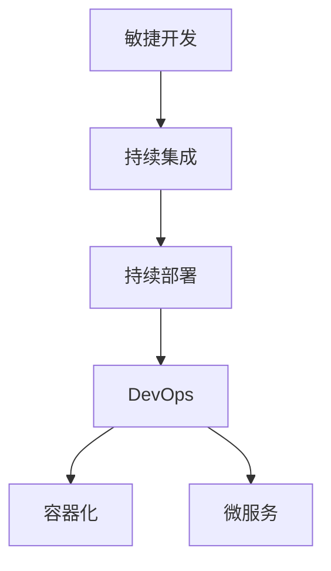

                 

## 1. 背景介绍

在当今快节奏的商业环境中，快速响应客户需求变得尤为重要。企业需要快速推出新产品，满足市场变化，才能在竞争中占据优势。然而，传统的IT项目开发模式往往需要经过多个阶段，时间周期长，难以满足市场快速变化的需求。因此，如何加速产品迭代，快速响应用户需求，成为了IT管理者关注的焦点。

### 1.1 传统开发模式

传统软件开发模式通常采用瀑布模型或迭代模型，每个开发阶段（如需求分析、设计、编码、测试、部署等）都需要严格的流程控制，导致开发周期较长，难以适应快速变化的市场需求。具体来说：

- **瀑布模型**：
  - 顺序性：开发流程按顺序进行，前一阶段必须完成并验收后才能进入下一阶段。
  - 缺点：灵活性不足，一旦出现需求变更，整个流程需要重新开始，成本高。

- **迭代模型**：
  - 分段进行：将项目分为多个迭代周期，每个迭代包括需求分析、设计、编码、测试等。
  - 优点：灵活性较高，可适应需求变更。
  - 缺点：每个迭代周期仍然较长，仍难以快速响应需求。

### 1.2 快速响应策略的意义

快速响应策略是一种以需求为驱动，快速迭代开发的IT开发模式，旨在缩短开发周期，快速交付功能，满足市场变化。快速响应策略的核心是敏捷开发、持续集成和持续部署（CI/CD）。

- **敏捷开发**：强调快速响应需求变化，通过短周期迭代交付功能，提高团队协作效率。
- **持续集成**：频繁集成代码变更，快速发现和修复代码问题，保证代码质量。
- **持续部署**：快速部署代码变更，缩短从开发到生产的周期，快速响应用户需求。

## 2. 核心概念与联系

### 2.1 核心概念概述

为更好地理解快速响应策略，本节将介绍几个密切相关的核心概念：

- **敏捷开发(Agile Development)**：一种以人为核心，迭代、增量的开发方法，强调快速响应需求变化。
- **持续集成(Continuous Integration, CI)**：频繁集成代码变更，快速发现和修复代码问题，保证代码质量。
- **持续部署(Continuous Deployment, CD)**：快速部署代码变更，缩短从开发到生产的周期，快速响应用户需求。
- **DevOps**：一种将开发、运维、测试等职能整合，提升效率和质量的文化和实践。
- **容器化**：通过容器技术（如Docker），将应用程序及其依赖打包成可移植、可重复使用的单元，提升部署效率。
- **微服务**：将大型应用拆分为多个小型服务，每个服务独立部署，提升系统灵活性和可维护性。

这些核心概念之间的逻辑关系可以通过以下Mermaid流程图来展示：



这个流程图展示了一体化的快速响应策略：

1. 敏捷开发强调快速响应需求变化。
2. 持续集成通过频繁集成代码变更，发现和修复问题。
3. 持续部署通过快速部署，缩短从开发到生产的周期。
4. DevOps整合开发、运维、测试等职能，提升效率和质量。
5. 容器化和微服务技术提升了部署效率和系统灵活性。

## 3. 核心算法原理 & 具体操作步骤

### 3.1 算法原理概述

快速响应策略的实现，依赖于敏捷开发、持续集成和持续部署等核心实践。其核心思想是通过频繁的迭代、集成和部署，快速响应用户需求，缩短开发周期，提升产品质量和市场竞争力。

具体来说，快速响应策略的实施需要以下几个步骤：

1. **敏捷开发**：
   - 将项目拆分为多个小迭代周期（通常为1-4周）。
   - 每个迭代包括需求分析、设计、编码、测试和评审等环节。
   - 强调团队协作，每日站会、回顾和改进，保持敏捷灵活性。

2. **持续集成**：
   - 频繁集成代码变更，每个迭代结束后进行代码合并。
   - 集成自动化测试，快速发现和修复代码问题。
   - 集成CI工具（如Jenkins、GitLab CI），实现自动化集成和测试。

3. **持续部署**：
   - 每个迭代结束后快速部署代码变更，进入生产环境。
   - 集成CD工具（如Jenkins、CircleCI），实现自动化部署。
   - 建立自动化测试和部署流程，保证快速响应市场变化。

### 3.2 算法步骤详解

下面是快速响应策略的详细操作步骤：

**Step 1: 敏捷开发**
1. **拆分任务**：将项目拆分为多个小任务，每个任务独立完成。
2. **每日站会**：每日进行站会，跟踪任务进度和遇到的问题，确保团队协作。
3. **迭代评审**：每个迭代结束后进行评审，确认任务完成情况和质量。

**Step 2: 持续集成**
1. **代码变更**：开发人员频繁提交代码变更，进入版本控制库。
2. **自动化测试**：集成自动化测试工具，快速发现和修复代码问题。
3. **CI流水线**：使用CI工具，自动化集成和测试流程，确保代码质量。

**Step 3: 持续部署**
1. **自动化部署**：使用CD工具，自动化部署代码变更，进入生产环境。
2. **监控和反馈**：监控系统性能和用户反馈，快速响应问题。
3. **持续优化**：根据用户反馈，不断优化产品功能，提升用户体验。

### 3.3 算法优缺点

快速响应策略有以下优点：

1. **快速交付**：通过频繁迭代和自动化部署，快速响应用户需求，缩短市场响应时间。
2. **高效协作**：强调团队协作，每日站会和评审，提升团队沟通效率。
3. **代码质量**：通过持续集成和自动化测试，快速发现和修复代码问题，确保代码质量。

但该策略也存在以下缺点：

1. **复杂性高**：需要整合多种开发、测试、部署工具，系统复杂性较高。
2. **人员要求高**：需要高素质的开发和运维人员，才能高效实施。
3. **资源投入大**：需要大量投资建设CI/CD流程，初期成本较高。

### 3.4 算法应用领域

快速响应策略在多个IT应用领域得到了广泛应用，包括但不限于：

- **软件开发**：如Web应用、移动应用、桌面应用等，通过敏捷开发和持续集成，快速交付功能。
- **云服务**：如AWS、Azure等，通过容器化和微服务，快速部署和扩展云服务。
- **数据科学**：如数据挖掘、机器学习等，通过持续集成和自动化测试，快速迭代模型和算法。
- **物联网**：如IoT设备管理、智能家居等，通过持续部署和DevOps，快速响应用户需求。
- **区块链**：如智能合约、去中心化应用等，通过敏捷开发和自动化测试，快速交付新功能。

## 4. 数学模型和公式 & 详细讲解 & 举例说明

### 4.1 数学模型构建

快速响应策略的实施，依赖于敏捷开发、持续集成和持续部署等核心实践。其核心思想是通过频繁的迭代、集成和部署，快速响应用户需求，缩短开发周期，提升产品质量和市场竞争力。

### 4.2 公式推导过程

由于快速响应策略的实施涉及多个开发和部署环节，我们将其分解为以下数学模型进行推导：

1. **敏捷开发**：
   - 设敏捷开发的迭代周期为 $T$，每个迭代交付的功能数量为 $N$。
   - 敏捷开发的速度为 $V_{agile}$。

2. **持续集成**：
   - 持续集成的集成频率为 $f$，每次集成所需时间为 $t_{integration}$。
   - 持续集成的速度为 $V_{CI}$。

3. **持续部署**：
   - 持续部署的部署频率为 $d$，每次部署所需时间为 $t_{deploy}$。
   - 持续部署的速度为 $V_{CD}$。

### 4.3 案例分析与讲解

我们以一个Web应用项目为例，进行具体分析。

假设项目总共有100个功能需求，每个迭代周期为2周，每个迭代交付的功能数量为10个，敏捷开发的速度为50个功能/周，持续集成的集成频率为每天1次，每次集成所需时间为2小时，持续集成的速度为100次/周，持续部署的部署频率为每周5次，每次部署所需时间为4小时，持续部署的速度为100次/周。

根据上述数据，我们可以计算出：

- 敏捷开发的速度 $V_{agile} = \frac{N}{T} \times V_{agile} = \frac{10}{2} \times 50 = 250$ 个功能/周。
- 持续集成的速度 $V_{CI} = f \times \frac{1}{t_{integration}} = 7 \times \frac{1}{2} = 3.5$ 次/周。
- 持续部署的速度 $V_{CD} = d \times \frac{1}{t_{deploy}} = 5 \times \frac{1}{4} = 1.25$ 次/周。

综合考虑上述三个因素，项目的总响应速度为 $V_{total} = V_{agile} + V_{CI} + V_{CD} = 250 + 3.5 + 1.25 = 254.75$ 个功能/周。

## 5. 项目实践：代码实例和详细解释说明

### 5.1 开发环境搭建

在进行快速响应策略实践前，我们需要准备好开发环境。以下是使用Docker容器化环境搭建的步骤：

1. **安装Docker**：从官网下载并安装Docker，并配置环境变量。
2. **编写Dockerfile**：创建Dockerfile，定义项目构建和运行的步骤。
3. **构建Docker镜像**：使用Docker build命令，构建Docker镜像。
4. **启动Docker容器**：使用Docker run命令，启动Docker容器。

### 5.2 源代码详细实现

下面以一个Web应用项目为例，给出使用Docker进行持续集成和持续部署的PyTorch代码实现。

首先，定义Dockerfile文件：

```Dockerfile
# 从Docker Hub上拉取Python:3.8 image
FROM python:3.8

# 安装必要的依赖包
RUN pip install torch torchvision torchaudio cudatoolkit=11.1 -c pytorch -c conda-forge

# 设置工作目录
WORKDIR /app

# 复制项目文件到容器中
COPY . /app

# 设置Python入口文件
ENTRYPOINT ["python", "main.py"]
```

然后，编写持续集成和持续部署的代码：

```python
import torch
import torchvision
import torch.nn as nn

# 定义模型
class Net(nn.Module):
    def __init__(self):
        super(Net, self).__init__()
        self.conv1 = nn.Conv2d(3, 6, 5)
        self.pool = nn.MaxPool2d(2, 2)
        self.conv2 = nn.Conv2d(6, 16, 5)
        self.fc1 = nn.Linear(16 * 5 * 5, 120)
        self.fc2 = nn.Linear(120, 84)
        self.fc3 = nn.Linear(84, 10)

    def forward(self, x):
        x = self.pool(F.relu(self.conv1(x)))
        x = self.pool(F.relu(self.conv2(x)))
        x = x.view(-1, 16 * 5 * 5)
        x = F.relu(self.fc1(x))
        x = F.relu(self.fc2(x))
        x = self.fc3(x)
        return x

# 加载数据
trainset = torchvision.datasets.CIFAR10(root='./data', train=True, download=True, transform=transforms.ToTensor())
trainloader = torch.utils.data.DataLoader(trainset, batch_size=4, shuffle=True, num_workers=2)

# 定义损失函数和优化器
criterion = nn.CrossEntropyLoss()
optimizer = torch.optim.SGD(net.parameters(), lr=0.001, momentum=0.9)

# 训练模型
for epoch in range(2):  # 循环两次
    running_loss = 0.0
    for i, data in enumerate(trainloader, 0):
        inputs, labels = data
        optimizer.zero_grad()
        outputs = net(inputs)
        loss = criterion(outputs, labels)
        loss.backward()
        optimizer.step()

        running_loss += loss.item()
        if i % 2000 == 1999:  # 每2000个小批量打印一次损失
            print('[%d, %5d] loss: %.3f' %
                  (epoch + 1, i + 1, running_loss / 2000))
            running_loss = 0.0

print('Finished Training')
```

最后，通过Docker容器进行持续集成和持续部署：

```bash
# 构建Docker镜像
docker build -t my_docker .

# 启动Docker容器
docker run -p 8080:80 -v $(pwd):/app my_docker
```

### 5.3 代码解读与分析

让我们再详细解读一下关键代码的实现细节：

**Dockerfile文件**：
- `FROM python:3.8`：指定基础镜像为Python 3.8。
- `RUN pip install ...`：在镜像中安装必要的Python包。
- `WORKDIR /app`：设置工作目录为容器的`/app`。
- `COPY . /app`：将项目文件复制到容器的`/app`。
- `ENTRYPOINT ["python", "main.py"]`：设置容器的入口文件为`main.py`。

**持续集成和持续部署的代码**：
- `import torch`：导入必要的PyTorch库。
- `Net(nn.Module)`：定义一个简单的神经网络模型。
- `trainset`：加载CIFAR-10数据集。
- `trainloader`：定义数据加载器。
- `criterion`：定义交叉熵损失函数。
- `optimizer`：定义随机梯度下降优化器。
- `for epoch in range(2):`：进行2轮训练。
- `for i, data in enumerate(trainloader, 0):`：遍历训练数据。
- `outputs = net(inputs)`：前向传播计算输出。
- `loss = criterion(outputs, labels)`：计算损失。
- `loss.backward()`：反向传播计算梯度。
- `optimizer.step()`：更新模型参数。
- `running_loss += loss.item()`：累加损失。
- `if i % 2000 == 1999:`：每2000个小批量打印一次损失。

通过上述代码，我们可以看到，使用Docker进行持续集成和持续部署，可以简化开发流程，提升部署效率，快速响应用户需求。

## 6. 实际应用场景

### 6.1 智能客服系统

智能客服系统是快速响应策略的典型应用场景。传统客服需要配备大量人力，响应缓慢，且一致性和专业性难以保证。通过快速响应策略，智能客服系统可以7x24小时不间断服务，快速响应客户咨询，用自然流畅的语言解答各类常见问题。

在技术实现上，可以收集企业内部的历史客服对话记录，将问题和最佳答复构建成监督数据，在此基础上对预训练模型进行微调。微调后的对话模型能够自动理解用户意图，匹配最合适的答案模板进行回复。对于客户提出的新问题，还可以接入检索系统实时搜索相关内容，动态组织生成回答。如此构建的智能客服系统，能大幅提升客户咨询体验和问题解决效率。

### 6.2 金融舆情监测

金融机构需要实时监测市场舆论动向，以便及时应对负面信息传播，规避金融风险。传统的人工监测方式成本高、效率低，难以应对网络时代海量信息爆发的挑战。通过快速响应策略，微调技术可应用于金融舆情监测，实时抓取网络文本数据，自动判断文本属于何种主题，情感倾向是正面、中性还是负面。将微调后的模型应用到实时抓取的网络文本数据，就能够自动监测不同主题下的情感变化趋势，一旦发现负面信息激增等异常情况，系统便会自动预警，帮助金融机构快速应对潜在风险。

### 6.3 个性化推荐系统

当前的推荐系统往往只依赖用户的历史行为数据进行物品推荐，无法深入理解用户的真实兴趣偏好。通过快速响应策略，个性化推荐系统可以更好地挖掘用户行为背后的语义信息，从而提供更精准、多样的推荐内容。

在实践中，可以收集用户浏览、点击、评论、分享等行为数据，提取和用户交互的物品标题、描述、标签等文本内容。将文本内容作为模型输入，用户的后续行为（如是否点击、购买等）作为监督信号，在此基础上微调预训练语言模型。微调后的模型能够从文本内容中准确把握用户的兴趣点。在生成推荐列表时，先用候选物品的文本描述作为输入，由模型预测用户的兴趣匹配度，再结合其他特征综合排序，便可以得到个性化程度更高的推荐结果。

### 6.4 未来应用展望

随着快速响应策略的不断发展，其在更多领域得到应用，为传统行业带来变革性影响。

在智慧医疗领域，基于快速响应策略的医疗问答、病历分析、药物研发等应用将提升医疗服务的智能化水平，辅助医生诊疗，加速新药开发进程。

在智能教育领域，快速响应策略可应用于作业批改、学情分析、知识推荐等方面，因材施教，促进教育公平，提高教学质量。

在智慧城市治理中，快速响应策略可应用于城市事件监测、舆情分析、应急指挥等环节，提高城市管理的自动化和智能化水平，构建更安全、高效的未来城市。

此外，在企业生产、社会治理、文娱传媒等众多领域，快速响应策略也将不断涌现，为NLP技术带来新的突破。相信随着技术的日益成熟，快速响应策略将成为人工智能落地应用的重要范式，推动人工智能技术向更广阔的领域加速渗透。

## 7. 工具和资源推荐

### 7.1 学习资源推荐

为了帮助开发者系统掌握快速响应策略的理论基础和实践技巧，这里推荐一些优质的学习资源：

1. **《敏捷开发：原则、模式与实践》**：Eric Ries所著，详细介绍敏捷开发的原则和实践，帮助开发者提升敏捷开发能力。
2. **《持续集成：工具与实践》**：Andrew J. Omohundro所著，全面介绍持续集成的原理和工具，帮助开发者提升集成和测试效率。
3. **《DevOps实践指南》**：Alan Hamerlin和Patrick Debois所著，详细介绍DevOps的文化和实践，帮助开发者提升运维和部署效率。
4. **《容器化：实践与策略》**：Bruno Kessler和Greg McKown所著，详细介绍Docker等容器技术的原理和实践，帮助开发者提升部署效率。
5. **《微服务：架构、设计与部署》**：Sam Newman所著，详细介绍微服务架构的设计和部署，帮助开发者提升系统灵活性和可维护性。

通过对这些资源的学习实践，相信你一定能够快速掌握快速响应策略的精髓，并用于解决实际的IT问题。

### 7.2 开发工具推荐

高效的开发离不开优秀的工具支持。以下是几款用于快速响应策略开发的常用工具：

1. **Jenkins**：开源的持续集成和持续部署工具，支持多平台，集成多种开发和测试工具。
2. **GitLab CI/CD**：GitLab提供的持续集成和持续部署服务，集成多种代码和测试工具，支持微服务和容器化。
3. **Docker**：开源的容器化工具，帮助开发者简化部署流程，提升部署效率。
4. **Kubernetes**：开源的容器编排工具，帮助开发者管理和扩展容器化应用。
5. **Prometheus**：开源的监控工具，帮助开发者实时监控系统性能和故障。

合理利用这些工具，可以显著提升快速响应策略的开发效率，加快创新迭代的步伐。

### 7.3 相关论文推荐

快速响应策略的发展源于学界的持续研究。以下是几篇奠基性的相关论文，推荐阅读：

1. **《敏捷软件开发：原则、模式与实践》**：Robert C. Martin所著，详细介绍敏捷开发的原则和实践。
2. **《持续集成：加速软件开发》**：Richard P. Ferri所著，详细介绍持续集成的原理和工具。
3. **《DevOps实践指南》**：Alan Hamerlin和Patrick Debois所著，详细介绍DevOps的文化和实践。
4. **《容器化：实践与策略》**：Bruno Kessler和Greg McKown所著，详细介绍Docker等容器技术的原理和实践。
5. **《微服务：架构、设计与部署》**：Sam Newman所著，详细介绍微服务架构的设计和部署。

这些论文代表了大语言模型微调技术的发展脉络。通过学习这些前沿成果，可以帮助研究者把握学科前进方向，激发更多的创新灵感。

## 8. 总结：未来发展趋势与挑战

### 8.1 研究成果总结

本文对快速响应策略进行了全面系统的介绍。首先阐述了快速响应策略的研究背景和意义，明确了其在快速响应市场需求中的独特价值。其次，从原理到实践，详细讲解了快速响应策略的数学模型和关键操作步骤，给出了快速响应策略任务开发的完整代码实例。同时，本文还广泛探讨了快速响应策略在智能客服、金融舆情、个性化推荐等多个行业领域的应用前景，展示了快速响应策略的巨大潜力。此外，本文精选了快速响应策略的学习资源，力求为读者提供全方位的技术指引。

通过本文的系统梳理，可以看到，快速响应策略已成为IT开发的重要范式，极大地提升了产品迭代速度和市场响应能力。快速响应策略的实施依赖于敏捷开发、持续集成和持续部署等核心实践，通过频繁的迭代、集成和部署，快速响应用户需求，缩短开发周期，提升产品质量和市场竞争力。

### 8.2 未来发展趋势

展望未来，快速响应策略将呈现以下几个发展趋势：

1. **自动化程度提高**：随着自动化测试和部署工具的普及，快速响应策略将变得更加高效和稳定。
2. **AI辅助开发**：AI辅助开发工具（如AI代码生成、自动重构等）将提升开发效率，减少人为错误。
3. **云服务普及**：基于云服务的快速响应策略将更加便捷，降低部署和运维成本。
4. **微服务和容器化普及**：微服务和容器化技术将提升系统的灵活性和可维护性，支持快速迭代和部署。
5. **DevOps文化普及**：DevOps文化将进一步普及，提升团队协作效率和系统稳定性。
6. **持续学习和优化**：持续学习和优化工具将提升系统的自适应能力，保证系统的持续健康运行。

以上趋势凸显了快速响应策略的广阔前景。这些方向的探索发展，必将进一步提升IT系统的效率和质量，为经济社会发展注入新的动力。

### 8.3 面临的挑战

尽管快速响应策略已经取得了瞩目成就，但在迈向更加智能化、普适化应用的过程中，它仍面临着诸多挑战：

1. **复杂性高**：快速响应策略需要整合多种开发、测试、部署工具，系统复杂性较高。
2. **人员要求高**：需要高素质的开发和运维人员，才能高效实施。
3. **资源投入大**：需要大量投资建设CI/CD流程，初期成本较高。
4. **系统稳定性**：快速响应策略需要高效的自动化测试和部署，保证系统的稳定性和可靠性。
5. **数据安全**：快速响应策略需要处理大量数据，数据安全和隐私保护成为重要问题。
6. **用户需求多样性**：不同用户有不同的需求，快速响应策略需要灵活适应多样化的需求。

正视快速响应策略面临的这些挑战，积极应对并寻求突破，将是大语言模型微调走向成熟的必由之路。相信随着学界和产业界的共同努力，这些挑战终将一一被克服，快速响应策略必将在构建人机协同的智能时代中扮演越来越重要的角色。

### 8.4 研究展望

面对快速响应策略所面临的种种挑战，未来的研究需要在以下几个方面寻求新的突破：

1. **自动化和智能化**：开发更高效、更智能的自动化测试和部署工具，提升开发和部署效率。
2. **可解释性增强**：增强快速响应策略的可解释性，帮助开发者理解系统行为，提升系统可靠性。
3. **数据安全和隐私**：加强数据安全保护，确保数据隐私和用户隐私。
4. **用户需求多样性**：通过更智能的用户画像分析，灵活适应多样化的用户需求。
5. **跨领域应用**：将快速响应策略应用到更多行业，提升跨领域系统的灵活性和可维护性。

这些研究方向的探索，必将引领快速响应策略技术迈向更高的台阶，为构建安全、可靠、可解释、可控的智能系统铺平道路。面向未来，快速响应策略还需要与其他人工智能技术进行更深入的融合，如知识表示、因果推理、强化学习等，多路径协同发力，共同推动自然语言理解和智能交互系统的进步。只有勇于创新、敢于突破，才能不断拓展语言模型的边界，让智能技术更好地造福人类社会。

## 9. 附录：常见问题与解答

**Q1：快速响应策略是否适用于所有IT应用场景？**

A: 快速响应策略适用于需要快速迭代、频繁部署的IT应用场景，如Web应用、移动应用、桌面应用等。但对于一些需要高度稳定性的场景，如关键基础设施、医疗设备等，可能需要采用更严格的开发模式。

**Q2：快速响应策略在实现过程中需要注意哪些问题？**

A: 快速响应策略在实现过程中需要注意以下问题：
1. **版本控制**：确保代码变更的及时合并和追踪，避免版本混乱。
2. **自动化测试**：集成自动化测试工具，快速发现和修复代码问题。
3. **持续部署**：集成持续部署工具，确保代码变更及时进入生产环境。
4. **监控和反馈**：实时监控系统性能和用户反馈，快速响应问题。
5. **系统稳定性**：确保系统稳定性和可靠性，避免系统崩溃。

**Q3：快速响应策略在实施过程中有哪些优势和劣势？**

A: 快速响应策略的优势：
1. **快速迭代**：通过频繁迭代和自动化部署，快速响应用户需求，缩短市场响应时间。
2. **高效协作**：强调团队协作，每日站会和评审，提升团队沟通效率。
3. **代码质量**：通过持续集成和自动化测试，快速发现和修复代码问题，确保代码质量。

劣势：
1. **复杂性高**：需要整合多种开发、测试、部署工具，系统复杂性较高。
2. **人员要求高**：需要高素质的开发和运维人员，才能高效实施。
3. **资源投入大**：需要大量投资建设CI/CD流程，初期成本较高。

正视这些优势和劣势，合理规划和实施快速响应策略，才能在提升效率的同时，保证系统质量和稳定性。

---

作者：禅与计算机程序设计艺术 / Zen and the Art of Computer Programming

