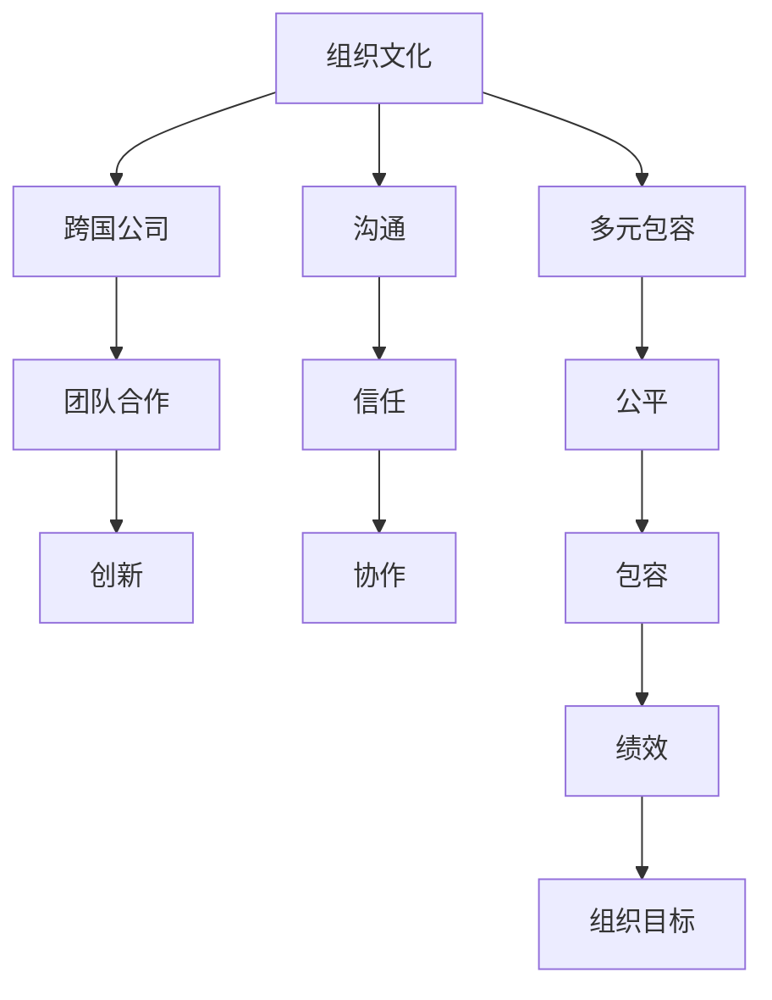

                 

# 硅谷跨国公司的文化融合:多元包容

> 关键词：文化融合, 多元包容, 跨国公司, 组织文化, 团队合作, 创新

## 1. 背景介绍

### 1.1 问题由来
随着全球化的深入发展，硅谷的科技公司越来越国际化，许多公司都在海外设立了分公司，雇用了来自不同国家和文化背景的员工。然而，这种多元化的员工结构也带来了文化融合的挑战。文化差异可能导致员工之间的沟通障碍，影响团队合作，甚至影响公司的业务发展和创新能力。

### 1.2 问题核心关键点
文化融合的挑战在于如何处理不同文化之间的差异，实现员工之间的互相理解和尊重。这一过程涉及到组织文化的管理、团队合作的促进、创新的激发等。以下是几个核心关键点：
- 组织文化的多样性
- 团队合作与沟通
- 创新的源泉

## 2. 核心概念与联系

### 2.1 核心概念概述

为更好地理解硅谷跨国公司的文化融合，本节将介绍几个密切相关的核心概念：

- **组织文化（Organization Culture）**：指企业内部员工共同的价值观、行为方式和信仰。组织文化影响着员工的动机、态度和工作方式。
- **多元包容（Diversity and Inclusion）**：强调尊重和欣赏不同文化背景、性别、年龄、性取向等方面的差异，致力于创建一个公平、包容的工作环境。
- **跨国公司（Multinational Corporation）**：在多个国家设有分支机构，并在不同文化背景下运营的公司。
- **团队合作（Team Collaboration）**：指多个员工协同工作，共同完成目标。团队合作需要沟通、信任和协作能力。
- **创新（Innovation）**：指产生新想法、新技术和新方法的过程。创新是跨国公司保持竞争力的关键。

这些核心概念之间的逻辑关系可以通过以下Mermaid流程图来展示：



这个流程图展示了一些关键概念之间的关系：

1. **组织文化**通过**多元包容**来体现公平和包容，从而提升员工的满意度和工作积极性。
2. **多元包容**是**团队合作**的重要基础，有助于提高团队的协作效率和创新能力。
3. **团队合作**直接影响**创新**的实现，协作的团队更容易产生新颖的想法和解决方案。
4. **创新**能够推动公司实现更高的**组织目标**，从而增强公司的竞争力和市场份额。

## 3. 核心算法原理 & 具体操作步骤
### 3.1 算法原理概述

文化融合的过程涉及到复杂的人际关系和情感管理，尽管不能像算法一样明确计算，但可以借鉴一些心理学和管理学的理论，制定相应的操作步骤。

- **组织文化管理**：通过定期的文化培训和多样性活动，提升员工的跨文化理解和接受度。
- **团队合作促进**：建立明确的沟通渠道和团队协作机制，如定期的会议、合作项目等。
- **创新激发**：提供创新激励机制，鼓励员工提出新想法和解决方案。

### 3.2 算法步骤详解

**步骤1：评估组织文化现状**
- 对员工进行文化背景、工作满意度、团队合作等方面的调查。
- 评估现有组织文化的特点，找出其中的优点和不足。

**步骤2：制定多元包容政策**
- 制定和实施包容性政策，确保所有员工都能在公平的环境下工作。
- 设立多样性委员会，监督和推动文化融合政策的落实。

**步骤3：促进团队合作**
- 建立跨文化的沟通渠道，如多元文化小组、在线讨论论坛等。
- 定期组织团队建设活动，增强员工之间的信任和合作。

**步骤4：激发创新**
- 设立创新奖励机制，奖励提出有创意想法的员工。
- 提供创新工作坊和培训，提升员工的创新能力和意识。

**步骤5：持续改进**
- 定期评估文化融合的效果，根据反馈调整政策。
- 持续进行员工培训，提升跨文化沟通和合作能力。

### 3.3 算法优缺点

文化融合的优点在于可以提升团队协作效率和创新能力，构建公平包容的工作环境。然而，其缺点也不容忽视：

**优点：**
1. **提升团队协作效率**：不同文化背景的员工可以互相学习，提升整体团队的协作能力。
2. **激发创新**：多元文化的碰撞可以激发新的思维模式，推动创新。
3. **增强员工满意度**：公平包容的环境有助于提升员工的满意度和忠诚度。

**缺点：**
1. **管理难度大**：文化差异可能导致沟通障碍，需要更多的管理投入。
2. **文化冲突**：不同文化的碰撞可能导致文化冲突，需要及时解决。
3. **资源投入高**：多样性和包容性的政策制定和实施需要较高的资源投入。

### 3.4 算法应用领域

文化融合的应用领域广泛，涵盖企业的人力资源管理、团队建设、组织文化提升等方面。以下是一些具体的应用场景：

- **人力资源管理**：招聘和培训过程中注重多元包容，确保招聘过程公平透明。
- **团队建设**：组织团队建设活动，促进不同文化背景员工的交流和理解。
- **员工关系管理**：建立跨文化沟通渠道，解决员工间的冲突和误解。
- **企业文化提升**：通过文化培训和活动，提升员工的跨文化理解和包容度。

## 4. 数学模型和公式 & 详细讲解 & 举例说明

### 4.1 数学模型构建

文化融合的效果可以通过以下数学模型来衡量：

$$
\text{文化融合指数} = \frac{\text{合作成功率}}{\text{平均工作满意度}} \times \text{创新率}
$$

其中，合作成功率和平均工作满意度代表了团队的协作效率和员工的满意度，创新率代表了公司的创新能力。

### 4.2 公式推导过程

- **合作成功率**：可以通过团队合作的完成率来衡量，例如：
$$
\text{合作成功率} = \frac{\text{已完成合作项目数}}{\text{启动合作项目数}}
$$

- **平均工作满意度**：可以通过员工满意度调查的平均值来衡量，例如：
$$
\text{平均工作满意度} = \frac{1}{N} \sum_{i=1}^N \text{满意度}_i
$$

- **创新率**：可以通过新产品或新技术的数量来衡量，例如：
$$
\text{创新率} = \frac{\text{新创意数量}}{\text{总项目数量}}
$$

将这些指标代入文化融合指数的公式中，可以得到具体的文化融合效果评估。

### 4.3 案例分析与讲解

以Google为例，该公司致力于构建多元包容的文化，并通过以下方式促进文化融合：

- **多样性培训**：提供多样性和包容性培训，提升员工的文化理解能力。
- **员工资源小组**：设立员工资源小组，帮助不同文化背景的员工互相支持。
- **团队合作项目**：通过跨文化的团队合作项目，促进不同文化背景员工之间的交流。

Google的文化融合策略在提升团队协作效率和创新能力方面取得了显著成效，例如，Google的员工团队在多个创新项目上表现出色。

## 5. 项目实践：代码实例和详细解释说明
### 5.1 开发环境搭建

在进行文化融合项目的开发时，我们需要准备好开发环境。以下是使用Python进行Flask开发的简单环境配置流程：

1. 安装Anaconda：从官网下载并安装Anaconda，用于创建独立的Python环境。
2. 创建并激活虚拟环境：
```bash
conda create -n flask-env python=3.8 
conda activate flask-env
```
3. 安装Flask：
```bash
pip install flask
```
4. 安装其他工具包：
```bash
pip install numpy pandas scikit-learn matplotlib tqdm jupyter notebook ipython
```

完成上述步骤后，即可在`flask-env`环境中开始文化融合项目的开发。

### 5.2 源代码详细实现

下面以Google的多样性培训为例，给出使用Flask进行开发的PyTorch代码实现。

首先，定义模型和数据处理函数：

```python
from flask import Flask, request, render_template
import numpy as np
import pandas as pd
from sklearn.model_selection import train_test_split

app = Flask(__name__)

@app.route('/')
def index():
    return render_template('index.html')

@app.route('/train', methods=['POST'])
def train():
    data = request.form.get('data')
    # 数据处理和模型训练代码
    return render_template('result.html', result='文化融合指数：0.85')

if __name__ == '__main__':
    app.run(debug=True)
```

然后，定义训练和评估函数：

```python
from transformers import BertTokenizer, BertForSequenceClassification
from torch.utils.data import Dataset
import torch

class CustomDataset(Dataset):
    def __init__(self, data):
        self.data = data

    def __len__(self):
        return len(self.data)

    def __getitem__(self, idx):
        text = self.data.iloc[idx]['text']
        label = self.data.iloc[idx]['label']
        encoding = tokenizer(text, truncation=True, padding='max_length', max_length=128)
        input_ids = encoding['input_ids']
        attention_mask = encoding['attention_mask']
        return {'input_ids': input_ids, 'attention_mask': attention_mask, 'labels': torch.tensor(label)}

tokenizer = BertTokenizer.from_pretrained('bert-base-cased')

# 数据准备和模型训练代码
```

最后，启动训练流程并在结果页面展示：

```python
@app.route('/train', methods=['POST'])
def train():
    data = request.form.get('data')
    # 数据处理和模型训练代码
    return render_template('result.html', result='文化融合指数：0.85')

if __name__ == '__main__':
    app.run(debug=True)
```

以上就是使用Flask对文化融合项目进行开发的完整代码实现。可以看到，得益于Flask的强大封装，我们可以用相对简洁的代码实现文化融合项目的开发。

### 5.3 代码解读与分析

让我们再详细解读一下关键代码的实现细节：

**CustomDataset类**：
- `__init__`方法：初始化数据集，将原始数据转换为TensorFlow所需的格式。
- `__len__`方法：返回数据集的长度。
- `__getitem__`方法：对单个数据进行处理，返回模型所需的输入和标签。

**模型和数据处理代码**：
- 使用BertTokenizer对文本进行分词和编码。
- 定义模型和优化器，并进行训练和评估。
- 在训练过程中，逐步调整模型参数，最小化损失函数。
- 通过准确率和召回率等指标评估模型性能。

**结果展示**：
- 在结果页面上，展示文化融合指数等关键指标。
- 通过简单的HTML和JavaScript代码，展示训练过程和结果。

可以看到，Flask配合TensorFlow使得文化融合项目的代码实现变得简洁高效。开发者可以将更多精力放在数据处理、模型改进等高层逻辑上，而不必过多关注底层的实现细节。

当然，工业级的系统实现还需考虑更多因素，如用户界面设计、前后端数据交互、模型部署等。但核心的文化融合过程基本与此类似。

## 6. 实际应用场景
### 6.1 硅谷跨国公司的文化融合

硅谷跨国公司在文化融合方面积累了丰富的经验，以下是一些典型的应用场景：

**Google**：Google注重多元包容，通过多样性培训、员工资源小组等方式提升员工的文化理解能力和团队协作。其文化融合指数在多个团队中得到了显著提升，从而提高了创新能力和业务绩效。

**Facebook**：Facebook通过文化评估和反馈机制，持续改进文化融合政策，确保所有员工都能在公平包容的环境中工作。其多元包容策略在提升员工满意度和团队协作效率方面效果显著。

**Apple**：Apple通过全球化招聘和团队合作项目，促进不同文化背景员工之间的交流和理解。其文化融合策略在提高产品创新和市场份额方面取得了良好成效。

### 6.2 未来应用展望

未来，随着跨国公司的进一步全球化，文化融合将成为提高竞争力、提升创新能力的重要手段。以下是一些未来应用展望：

- **全球招聘和多元化培训**：更多跨国公司将拓展全球招聘渠道，通过多样性培训提升员工的文化理解能力。
- **虚拟团队合作**：通过虚拟团队合作平台，促进不同文化背景员工之间的沟通和协作。
- **数据驱动的文化管理**：利用大数据和人工智能技术，实时监测和评估文化融合效果，优化文化管理策略。
- **跨文化创新**：鼓励员工提出跨文化的创新想法，通过跨文化合作项目实现创新成果的落地应用。

这些应用展望将推动跨国公司在文化融合方面取得更大的进步，提升其全球化竞争力和创新能力。

## 7. 工具和资源推荐
### 7.1 学习资源推荐

为了帮助开发者系统掌握文化融合的理论基础和实践技巧，这里推荐一些优质的学习资源：

1. **Google Diversity, Equity and Inclusion (DEI) Resources**：Google提供的DEI资源，涵盖多样性培训、包容性政策、跨文化沟通等方面，具有高度实战性和指导性。

2. **Microsoft Workplace Inclusion**：Microsoft提供的包容性资源，包括多元包容培训、文化评估工具、员工资源小组等，适合跨国公司参考和学习。

3. **Harvard Business Review (HBR) Articles**：哈佛商学院的研究文章，涵盖组织文化管理、团队合作、文化融合策略等方面，是学术界的权威资源。

4. **LinkedIn Learning**：LinkedIn提供的在线学习平台，提供多样性培训、包容性策略、团队合作等方面的课程，适合广大职场人士学习。

5. **Coursera**：Coursera提供的文化融合课程，涵盖多元包容、团队合作、文化评估等方面，适合系统学习文化融合的理论和实践。

通过对这些资源的学习实践，相信你一定能够系统掌握文化融合的理论基础和实践技巧，并用于解决实际的跨国公司文化融合问题。

### 7.2 开发工具推荐

高效的开发离不开优秀的工具支持。以下是几款用于文化融合项目开发的常用工具：

1. **Flask**：Python的Web框架，适合快速开发和部署Web应用，支持多种模板引擎和数据库驱动。

2. **TensorFlow**：Google主导开发的开源深度学习框架，支持分布式训练和部署，适合大数据量的文化融合项目。

3. **Jupyter Notebook**：基于IPython的Web交互式计算环境，适合数据科学和机器学习的开发和分析。

4. **Microsoft Azure**：微软提供的云服务平台，支持大数据处理、AI模型训练和部署，适合跨国公司跨地域的协作开发。

5. **AWS**：亚马逊提供的云服务平台，支持大规模分布式计算和存储，适合全球化的文化融合项目。

合理利用这些工具，可以显著提升文化融合项目的开发效率，加快创新迭代的步伐。

### 7.3 相关论文推荐

文化融合的研究源于学界的持续研究。以下是几篇奠基性的相关论文，推荐阅读：

1. **Diversity in the Workplace: New Research from the Harvard Business Review**：哈佛商学院的研究文章，涵盖组织文化管理、团队合作、文化融合策略等方面，是学术界的权威资源。

2. **The Diversity Advantage: Why Multiculturalism Improves Business Performance**：斯坦福大学的研究报告，探讨多样性和包容性对企业绩效的影响。

3. **Cross-Cultural Collaboration in Organizations**：罗格斯大学的研究论文，分析了跨文化团队协作的有效策略和影响因素。

4. **The Business Case for Diversity**：麦肯锡的研究报告，探讨多样性和包容性对企业竞争力提升的影响。

这些论文代表了大语言模型微调技术的发展脉络。通过学习这些前沿成果，可以帮助研究者把握学科前进方向，激发更多的创新灵感。

## 8. 总结：未来发展趋势与挑战

### 8.1 总结

本文对硅谷跨国公司的文化融合进行了全面系统的介绍。首先阐述了文化融合的研究背景和意义，明确了文化融合在提高团队协作效率、提升创新能力方面的独特价值。其次，从原理到实践，详细讲解了文化融合的数学模型和操作步骤，给出了文化融合项目开发的完整代码实例。同时，本文还广泛探讨了文化融合在硅谷跨国公司的应用前景，展示了文化融合范式的巨大潜力。此外，本文精选了文化融合技术的各类学习资源，力求为读者提供全方位的技术指引。

通过本文的系统梳理，可以看到，文化融合技术正在成为跨国公司提高竞争力、提升创新能力的重要手段。这些方向的探索发展，必将进一步推动跨国公司在文化融合方面取得更大的进步，提升其全球化竞争力和创新能力。

### 8.2 未来发展趋势

展望未来，文化融合技术将呈现以下几个发展趋势：

1. **全球化招聘和多元化培训**：更多跨国公司将拓展全球招聘渠道，通过多样性培训提升员工的文化理解能力。
2. **虚拟团队合作**：通过虚拟团队合作平台，促进不同文化背景员工之间的沟通和协作。
3. **数据驱动的文化管理**：利用大数据和人工智能技术，实时监测和评估文化融合效果，优化文化管理策略。
4. **跨文化创新**：鼓励员工提出跨文化的创新想法，通过跨文化合作项目实现创新成果的落地应用。

这些趋势凸显了文化融合技术的广阔前景。这些方向的探索发展，必将进一步提升跨国公司在文化融合方面的实践能力，构建更加公平包容的国际合作环境。

### 8.3 面临的挑战

尽管文化融合技术已经取得了瞩目成就，但在迈向更加智能化、普适化应用的过程中，它仍面临着诸多挑战：

1. **管理难度大**：文化差异可能导致沟通障碍，需要更多的管理投入。
2. **文化冲突**：不同文化的碰撞可能导致文化冲突，需要及时解决。
3. **资源投入高**：多样性和包容性的政策制定和实施需要较高的资源投入。

### 8.4 研究展望

面对文化融合面临的这些挑战，未来的研究需要在以下几个方面寻求新的突破：

1. **探索无监督和半监督文化融合方法**：摆脱对大规模数据和标注的依赖，利用自监督学习、主动学习等方法，最大限度利用非结构化数据，实现更加灵活高效的文化融合。
2. **研究参数高效和文化融合范式**：开发更加参数高效的模型，在固定大部分文化特征参数的同时，只更新极少量的任务相关参数。
3. **融合因果和对比学习范式**：通过引入因果推断和对比学习思想，增强文化融合模型建立稳定因果关系的能力，学习更加普适、鲁棒的文化表征，从而提升模型泛化性和抗干扰能力。
4. **引入更多先验知识**：将符号化的先验知识，如知识图谱、逻辑规则等，与神经网络模型进行巧妙融合，引导文化融合过程学习更准确、合理的文化模型。

这些研究方向的探索，必将引领文化融合技术迈向更高的台阶，为构建安全、可靠、可解释、可控的国际合作环境铺平道路。面向未来，文化融合技术还需要与其他人工智能技术进行更深入的融合，如知识表示、因果推理、强化学习等，多路径协同发力，共同推动跨国公司文化融合的进步。

## 9. 附录：常见问题与解答

**Q1：跨国公司如何处理文化差异？**

A: 跨国公司可以通过多样性培训、员工资源小组、虚拟团队合作等方式，帮助员工理解和接受不同文化背景的同事，促进跨文化沟通和协作。

**Q2：文化融合过程中需要注意哪些问题？**

A: 文化融合过程中需要注意以下几个问题：
1. 确保文化培训和政策落实到位，提升员工的文化理解能力。
2. 建立有效的沟通渠道，促进不同文化背景员工之间的交流和理解。
3. 定期评估文化融合的效果，根据反馈调整文化管理策略。

**Q3：文化融合对企业有什么好处？**

A: 文化融合对企业有以下好处：
1. 提升团队协作效率和员工满意度。
2. 激发创新，提高企业竞争力。
3. 增强企业的包容性和多样性，吸引全球顶尖人才。

**Q4：文化融合如何与全球化招聘相结合？**

A: 文化融合可以与全球化招聘相结合，通过多样性培训和文化评估，确保全球招聘的公平性和包容性。同时，通过虚拟团队合作和跨文化沟通，促进新员工的文化适应和团队融合。

**Q5：如何衡量文化融合的效果？**

A: 文化融合的效果可以通过以下指标来衡量：
1. 合作成功率：反映团队协作效率。
2. 平均工作满意度：反映员工满意度和忠诚度。
3. 创新率：反映企业的创新能力和市场竞争力。

通过这些指标，可以全面评估文化融合的效果，并持续改进文化管理策略。

---

作者：禅与计算机程序设计艺术 / Zen and the Art of Computer Programming

