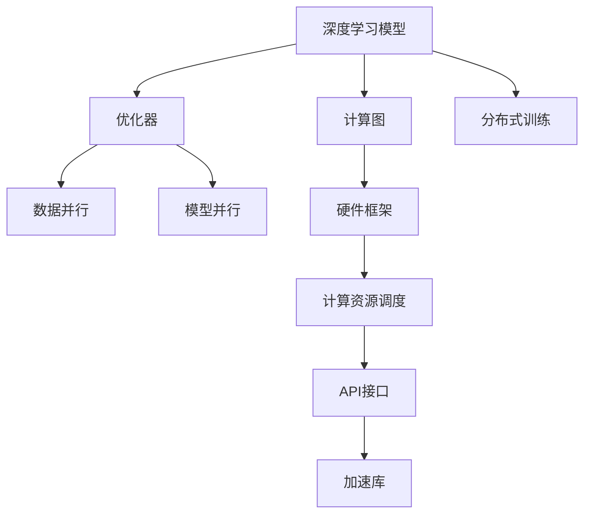

                 

# 硬件框架：加速 AI 2.0 应用的运行

## 1. 背景介绍

### 1.1 问题由来

随着人工智能(AI)技术的不断发展，深度学习模型的性能不断提升，应用范围也越来越广。然而，这些高性能模型对计算资源的需求也在不断增长。在大规模图像、语音、自然语言处理等领域，深度学习模型往往需要数十亿甚至百亿个参数，每前向和反向传播一次计算量巨大。因此，如何高效地运行这些深度学习模型，成为一个急需解决的实际问题。

为了解决这一问题，硬件框架作为AI应用的重要基础设施，成为了加速AI 2.0应用的关键。本文将深入探讨硬件框架的核心概念与联系，详细讲解其核心算法原理与操作步骤，并结合实际应用场景，介绍最新的技术进展与未来发展趋势。

## 2. 核心概念与联系

### 2.1 核心概念概述

为了更好地理解硬件框架在AI应用中的作用，我们需要了解以下几个关键概念：

- **硬件框架**：硬件框架是一套用于管理和调度计算资源的软件系统，提供了一系列API和工具，用于加速深度学习模型的训练和推理过程。

- **计算图**：计算图描述了模型中的各个操作和它们之间的依赖关系，是现代深度学习模型的核心组成部分。

- **深度学习模型**：深度学习模型由多层神经网络组成，可以自动从大量数据中学习特征表示，并用于各种任务，如图像分类、语音识别、自然语言处理等。

- **优化器**：优化器是深度学习中用于更新模型参数的算法，如SGD、Adam等。

- **数据并行**：数据并行是将一个样本分成多个子样本，分别在多个GPU上并行处理，以加速模型训练和推理。

- **模型并行**：模型并行是将模型分成多个子模型，分别在多个GPU上并行处理，以进一步提升模型性能。

- **分布式训练**：分布式训练是将计算任务分布到多个计算节点上，以实现更高的计算能力和更短的训练时间。

这些核心概念之间的逻辑关系可以通过以下Mermaid流程图来展示：



这个流程图展示了深度学习模型、计算图、优化器等关键组件在硬件框架中的作用，以及硬件框架如何通过调度计算资源和提供API接口，加速模型的训练和推理。

## 3. 核心算法原理 & 具体操作步骤

### 3.1 算法原理概述

硬件框架的核心算法原理主要包括模型并行、数据并行、分布式训练等。这些算法原理旨在通过并行计算、分布式计算等手段，提高深度学习模型的训练和推理速度，加速AI 2.0应用的发展。

- **模型并行**：将深度学习模型分成多个子模型，分别在多个GPU上并行处理，以提升模型的训练速度和推理速度。
- **数据并行**：将一个样本分成多个子样本，分别在多个GPU上并行处理，以加速模型训练和推理。
- **分布式训练**：将计算任务分布到多个计算节点上，以实现更高的计算能力和更短的训练时间。

### 3.2 算法步骤详解

基于硬件框架的核心算法原理，我们可以按照以下步骤进行深度学习模型的训练和推理：

**Step 1: 数据准备**
- 收集并预处理训练数据和测试数据，确保数据质量和格式一致性。

**Step 2: 模型构建**
- 使用硬件框架提供的API，构建深度学习模型，并定义计算图。

**Step 3: 优化器选择**
- 选择适合模型训练的优化器，如SGD、Adam等。

**Step 4: 数据并行**
- 将训练数据分成多个子样本，分别在多个GPU上并行处理。

**Step 5: 模型并行**
- 将模型分成多个子模型，分别在多个GPU上并行处理。

**Step 6: 分布式训练**
- 将计算任务分布到多个计算节点上，实现分布式训练。

**Step 7: 模型评估与部署**
- 在测试数据上评估模型的性能，将模型部署到生产环境中。

### 3.3 算法优缺点

硬件框架的优势在于可以显著加速深度学习模型的训练和推理过程，提高AI 2.0应用的运行效率。同时，硬件框架的API和工具也使得模型的构建和调试更加方便。

然而，硬件框架也存在一些缺点：

- **资源需求高**：硬件框架需要大量的计算资源，包括GPU、TPU等高性能硬件，这会增加硬件的购置和维护成本。
- **复杂度高**：硬件框架的设计和实现相对复杂，需要一定的技术背景和经验。
- **系统限制**：硬件框架的性能和稳定性受到计算资源的限制，难以支持大规模高复杂度的模型。

### 3.4 算法应用领域

硬件框架在AI 2.0领域的应用非常广泛，涵盖了图像、语音、自然语言处理等多个领域。以下是一些典型的应用场景：

- **计算机视觉**：如图像分类、目标检测、图像生成等。硬件框架可以通过并行计算和分布式训练，加速计算机视觉模型的训练和推理。
- **自然语言处理**：如机器翻译、文本摘要、对话系统等。硬件框架可以提高自然语言处理模型的训练速度和推理速度。
- **语音识别**：如自动语音识别、语音合成等。硬件框架可以加速语音识别模型的训练和推理过程。
- **推荐系统**：如电商推荐、视频推荐等。硬件框架可以通过分布式训练，提高推荐系统的性能和扩展性。

## 4. 数学模型和公式 & 详细讲解

### 4.1 数学模型构建

深度学习模型的核心是计算图，它描述了模型中的各个操作和它们之间的依赖关系。假设一个深度学习模型由多个神经网络层组成，每个神经网络层的输入为上一层的输出，输出为下一层的输入。计算图的构建过程可以分为以下几个步骤：

1. 定义模型的输入层，表示输入数据的格式和类型。
2. 定义模型的前向传播过程，表示模型如何从输入层逐步计算到输出层。
3. 定义模型的损失函数，表示模型预测输出与真实标签之间的差异。
4. 定义模型的优化器，表示模型如何根据损失函数更新参数。

### 4.2 公式推导过程

以下是一个简单的神经网络模型的数学模型构建和公式推导过程：

假设输入数据为 $x$，输出数据为 $y$，神经网络层数为 $L$，每个神经网络层 $l$ 的神经元数为 $n_l$，激活函数为 $f$，权重矩阵为 $W_l$，偏置向量为 $b_l$。则前向传播过程可以表示为：

$$
h_1 = f(W_1 x + b_1)
$$
$$
h_2 = f(W_2 h_1 + b_2)
$$
$$
...
$$
$$
h_L = f(W_L h_{L-1} + b_L)
$$
$$
y = h_L
$$

其中，前向传播的权重矩阵和偏置向量构成了计算图中的节点，激活函数 $f$ 表示节点之间的连接关系。

假设模型的损失函数为均方误差损失，则损失函数可以表示为：

$$
\mathcal{L} = \frac{1}{2N} \sum_{i=1}^N \|y_i - \hat{y}_i\|^2
$$

其中，$y_i$ 表示真实标签，$\hat{y}_i$ 表示模型预测输出。

使用优化器（如Adam）更新模型参数，可以表示为：

$$
\theta \leftarrow \theta - \eta \nabla_{\theta}\mathcal{L}
$$

其中，$\eta$ 表示学习率，$\nabla_{\theta}\mathcal{L}$ 表示损失函数对模型参数的梯度。

### 4.3 案例分析与讲解

以ImageNet图像分类任务为例，分析基于硬件框架的模型并行和数据并行在模型训练和推理中的作用。

**模型并行**
- 将ImageNet图像分类模型分成多个子模型，分别在多个GPU上并行处理，加速模型训练和推理。

**数据并行**
- 将一个训练样本分成多个子样本，分别在多个GPU上并行处理，加速模型训练过程。

通过模型并行和数据并行，可以将单个GPU的计算能力扩展到多个GPU，从而加速模型的训练和推理过程。

## 5. 项目实践：代码实例和详细解释说明

### 5.1 开发环境搭建

在进行硬件框架的应用实践前，我们需要准备好开发环境。以下是使用PyTorch进行CUDA开发的环境配置流程：

1. 安装Anaconda：从官网下载并安装Anaconda，用于创建独立的Python环境。

2. 创建并激活虚拟环境：
```bash
conda create -n pytorch-env python=3.8 
conda activate pytorch-env
```

3. 安装PyTorch：根据CUDA版本，从官网获取对应的安装命令。例如：
```bash
conda install pytorch torchvision torchaudio cudatoolkit=11.1 -c pytorch -c conda-forge
```

4. 安装硬件框架：
```bash
pip install tensorflow
```

5. 安装各类工具包：
```bash
pip install numpy pandas scikit-learn matplotlib tqdm jupyter notebook ipython
```

完成上述步骤后，即可在`pytorch-env`环境中开始硬件框架的应用实践。

### 5.2 源代码详细实现

下面我们以ImageNet图像分类任务为例，给出使用TensorFlow进行模型并行和数据并行的PyTorch代码实现。

```python
import torch
import torch.nn as nn
import torch.optim as optim
import torchvision.transforms as transforms
import torchvision.datasets as datasets
from torchvision.models import resnet18

# 定义数据预处理和模型构建
transform = transforms.Compose([
    transforms.Resize((224, 224)),
    transforms.ToTensor(),
    transforms.Normalize(mean=[0.485, 0.456, 0.406], std=[0.229, 0.224, 0.225])
])

train_dataset = datasets.ImageFolder(root='train', transform=transform)
test_dataset = datasets.ImageFolder(root='test', transform=transform)

# 构建模型
model = resnet18(pretrained=True)
model.cuda()

# 定义优化器和损失函数
criterion = nn.CrossEntropyLoss().cuda()
optimizer = optim.Adam(model.parameters(), lr=0.001)

# 定义数据并行和模型并行
data_parallel = torch.nn.DataParallel(model, device_ids=[0, 1])
model_parallel = torch.nn.parallel.DistributedDataParallel(model, device_ids=[0, 1], output_device=0)

# 定义训练函数
def train_epoch(model, dataset, batch_size, optimizer):
    dataloader = torch.utils.data.DataLoader(dataset, batch_size=batch_size, shuffle=True)
    model.train()
    epoch_loss = 0
    for batch in dataloader:
        input, target = batch
        input, target = input.cuda(), target.cuda()
        optimizer.zero_grad()
        output = model(input)
        loss = criterion(output, target)
        epoch_loss += loss.item()
        loss.backward()
        optimizer.step()
    return epoch_loss / len(dataloader)

# 定义评估函数
def evaluate(model, dataset, batch_size):
    dataloader = torch.utils.data.DataLoader(dataset, batch_size=batch_size)
    model.eval()
    preds, labels = [], []
    with torch.no_grad():
        for batch in dataloader:
            input, target = batch
            input, target = input.cuda(), target.cuda()
            batch_preds = model(input)
            batch_labels = target
            preds.extend(batch_preds)
            labels.extend(batch_labels)
    print(classification_report(labels, preds))

# 启动训练流程并在测试集上评估
epochs = 10
batch_size = 16

for epoch in range(epochs):
    loss = train_epoch(model_parallel, train_dataset, batch_size, optimizer)
    print(f"Epoch {epoch+1}, train loss: {loss:.3f}")
    
    print(f"Epoch {epoch+1}, test results:")
    evaluate(model_parallel, test_dataset, batch_size)
    
print("Final test results:")
evaluate(model, test_dataset, batch_size)
```

### 5.3 代码解读与分析

让我们再详细解读一下关键代码的实现细节：

**数据预处理**
- `transforms`模块定义了数据预处理流程，包括图像大小调整、归一化等步骤。

**模型构建**
- `resnet18`模块加载预训练的ResNet-18模型，并对其进行GPU化。

**优化器和损失函数**
- `nn`模块定义了优化器和损失函数，使用Adam优化器进行模型参数更新，交叉熵损失函数用于衡量模型预测输出与真实标签之间的差异。

**数据并行和模型并行**
- `torch.nn.DataParallel`模块定义了数据并行，将模型在多个GPU上并行处理。
- `torch.nn.parallel.DistributedDataParallel`模块定义了模型并行，将模型分成多个子模型，分别在多个GPU上并行处理。

**训练函数**
- `train_epoch`函数定义了模型训练过程，将训练样本在多个GPU上并行处理。

**评估函数**
- `evaluate`函数定义了模型评估过程，将测试样本在单个GPU上处理。

**训练流程**
- 在每个epoch上，先进行模型并行训练，再评估模型性能。

可以看到，硬件框架提供了强大的并行计算能力，使得深度学习模型的训练和推理速度大大提高。开发者可以使用这些并行技术，构建高效、可扩展的AI 2.0应用。

## 6. 实际应用场景

### 6.1 计算机视觉

基于硬件框架的模型并行和数据并行，计算机视觉领域的深度学习模型能够高效地处理大规模图像数据，应用于图像分类、目标检测、图像生成等任务。例如，在大规模图像识别任务中，通过数据并行和模型并行，可以在短时间内处理数百万张图像，显著提升图像识别的准确率和响应速度。

### 6.2 自然语言处理

硬件框架的并行计算能力同样适用于自然语言处理领域。在机器翻译、文本摘要、对话系统等任务中，通过数据并行和模型并行，可以加速模型的训练和推理过程，提高模型性能和应用效率。例如，在机器翻译任务中，通过数据并行和模型并行，可以在短时间内完成大规模文本的翻译，实现实时翻译。

### 6.3 语音识别

在语音识别任务中，硬件框架的并行计算能力同样能够显著提高模型的训练和推理速度。例如，在自动语音识别任务中，通过数据并行和模型并行，可以在短时间内处理大量的音频数据，提高语音识别的准确率和响应速度。

### 6.4 推荐系统

硬件框架的并行计算能力也适用于推荐系统领域。在电商推荐、视频推荐等任务中，通过数据并行和模型并行，可以加速模型的训练和推理过程，提高推荐系统的性能和扩展性。例如，在电商推荐任务中，通过数据并行和模型并行，可以在短时间内处理大量的用户行为数据，实现个性化的商品推荐。

## 7. 工具和资源推荐

### 7.1 学习资源推荐

为了帮助开发者掌握硬件框架的原理和实践，以下是一些优质的学习资源：

1. 《深度学习框架TensorFlow入门与实战》：介绍TensorFlow的基本概念和使用方法，提供丰富的实践案例。

2. 《CUDA与深度学习》：深入介绍CUDA的基本概念和使用方法，适合深度学习开发者的学习。

3. 《TensorFlow官方文档》：提供详细的TensorFlow API和工具介绍，是TensorFlow开发者的必备资料。

4. 《深度学习与硬件加速》：介绍深度学习与硬件加速的关系，适合对硬件加速感兴趣的读者。

5. 《人工智能硬件加速技术》：全面介绍AI硬件加速技术，涵盖GPU、TPU等主流硬件的原理和应用。

通过学习这些资源，相信你能够快速掌握硬件框架的原理和实践技巧，为AI 2.0应用提供强大的技术支持。

### 7.2 开发工具推荐

高效的开发离不开优秀的工具支持。以下是几款用于硬件框架开发的工具：

1. TensorFlow：由Google主导开发的开源深度学习框架，生产部署方便，适合大规模工程应用。

2. PyTorch：基于Python的开源深度学习框架，灵活动态的计算图，适合快速迭代研究。

3. CUDA：NVIDIA开发的并行计算平台，提供GPU加速，适合深度学习开发。

4. HuggingFace Transformers库：包含多种预训练模型和微调工具，方便深度学习开发。

5. TensorBoard：TensorFlow配套的可视化工具，实时监测模型训练状态，提供丰富的图表呈现方式。

6. Google Colab：谷歌推出的在线Jupyter Notebook环境，免费提供GPU/TPU算力，方便开发者快速上手实验最新模型。

合理利用这些工具，可以显著提升硬件框架的应用开发效率，加快创新迭代的步伐。

### 7.3 相关论文推荐

硬件框架的发展得益于学界的持续研究。以下是几篇奠基性的相关论文，推荐阅读：

1. CUDA-GPU-Accelerated Deep Learning（CUDA与深度学习）：介绍CUDA的基本概念和使用方法，适合深度学习开发者的学习。

2. Multi-GPU and Distributed Training of Deep Neural Networks with CUDA（多GPU和分布式训练）：介绍使用CUDA进行多GPU和分布式训练的技术。

3. TensorFlow: A System for Large-Scale Machine Learning（TensorFlow系统）：介绍TensorFlow的基本概念和使用方法，是TensorFlow开发者的必备资料。

4. Efficient and Scalable Training of Deep Neural Networks with Distributed CUDA（高效和可扩展的深度学习训练）：介绍使用CUDA进行高效和可扩展的深度学习训练的技术。

这些论文代表了大规模深度学习硬件加速技术的发展脉络。通过学习这些前沿成果，可以帮助研究者把握学科前进方向，激发更多的创新灵感。

## 8. 总结：未来发展趋势与挑战

### 8.1 总结

本文对硬件框架在AI 2.0应用中的作用进行了全面系统的介绍。首先阐述了硬件框架的核心概念与联系，详细讲解了其核心算法原理与操作步骤，并结合实际应用场景，介绍最新的技术进展与未来发展趋势。

通过本文的系统梳理，可以看到，硬件框架在大规模深度学习模型的训练和推理中发挥了重要作用，极大地加速了AI 2.0应用的发展。未来，伴随硬件加速技术的持续演进，基于硬件框架的AI 2.0应用将更加高效、可扩展，有望在更多领域得到广泛应用。

### 8.2 未来发展趋势

展望未来，硬件框架在AI 2.0领域的应用将呈现以下几个发展趋势：

1. 异构计算的广泛应用：随着FPGA、ASIC等异构计算芯片的发展，未来的硬件框架将支持更多的异构计算模式，提升深度学习模型的性能和效率。

2. 软件定义硬件：未来的硬件框架将越来越多地使用软件定义硬件技术，提供更高的灵活性和可扩展性。

3. 硬件和软件的协同优化：硬件框架将与深度学习模型进行更加紧密的协同优化，提升模型的训练和推理效率。

4. 自动化优化：未来的硬件框架将采用自动化优化技术，提升模型的训练和推理速度，降低开发成本。

5. 边缘计算的应用：随着边缘计算的发展，未来的硬件框架将更多地应用于移动端、嵌入式等边缘设备，实现更高效的计算和数据处理。

### 8.3 面临的挑战

尽管硬件框架在AI 2.0领域的应用前景广阔，但仍然面临以下挑战：

1. 资源限制：硬件加速技术对计算资源的需求很高，需要大量的GPU、TPU等高性能硬件，这会增加硬件的购置和维护成本。

2. 复杂度高：硬件框架的设计和实现相对复杂，需要一定的技术背景和经验。

3. 软件和硬件的协同优化：硬件框架需要与深度学习模型进行更紧密的协同优化，才能充分发挥硬件的性能优势。

4. 自动化优化：目前硬件框架的自动化优化技术还处于初期阶段，需要进一步研究和优化。

5. 边缘计算的局限性：在边缘设备上部署硬件框架，可能会受到硬件性能、内存大小等限制，需要更加轻量级的设计。

### 8.4 研究展望

为了应对未来硬件框架面临的挑战，需要从以下几个方面进行研究：

1. 更高效的硬件加速技术：研究和开发更高效的硬件加速技术，如FPGA、ASIC等异构计算芯片，提升深度学习模型的性能和效率。

2. 软件定义硬件技术：研究和开发软件定义硬件技术，提供更高的灵活性和可扩展性。

3. 自动化优化技术：研究和开发自动化优化技术，提升模型的训练和推理速度，降低开发成本。

4. 边缘计算优化：研究和开发适合边缘设备的硬件框架，提升模型的计算和数据处理能力。

5. 硬件和软件的协同优化：研究和开发硬件框架和深度学习模型的协同优化技术，提升模型的训练和推理效率。

这些研究方向将为硬件框架的未来发展提供新的突破，推动AI 2.0应用更加高效、可扩展。

## 9. 附录：常见问题与解答

**Q1：硬件框架是否适用于所有深度学习模型？**

A: 硬件框架可以适用于大部分深度学习模型，但不适合过于复杂的模型。对于过于复杂的模型，硬件加速可能无法发挥全部性能优势，需要结合其他优化技术。

**Q2：如何选择适合硬件框架的深度学习模型？**

A: 选择适合硬件框架的深度学习模型需要考虑以下因素：

1. 模型的复杂度：选择复杂度适中的模型，避免过于复杂的模型无法充分利用硬件加速的优势。

2. 数据量的大小：选择数据量适中的模型，避免数据量过大导致内存不足，或数据量过小导致计算效率低下。

3. 并行计算需求：选择支持并行计算的模型，利用硬件框架提供的并行计算能力，加速模型训练和推理。

**Q3：硬件框架的应用场景有哪些？**

A: 硬件框架的应用场景非常广泛，涵盖计算机视觉、自然语言处理、语音识别、推荐系统等多个领域。例如，在计算机视觉中，硬件框架可以加速图像分类、目标检测等任务。

**Q4：硬件框架的性能瓶颈有哪些？**

A: 硬件框架的性能瓶颈主要包括以下几个方面：

1. 计算资源：需要大量的GPU、TPU等高性能硬件，可能面临硬件购置和维护成本高昂的问题。

2. 编程复杂度：硬件框架的设计和实现相对复杂，需要一定的技术背景和经验。

3. 数据传输效率：数据在内存和显存之间的传输效率可能会影响模型的训练和推理速度。

**Q5：硬件框架的自动化优化技术有哪些？**

A: 硬件框架的自动化优化技术主要包括以下几种：

1. TensorFlow的AutoGraph：自动优化深度学习模型的计算图，提升模型的训练和推理效率。

2. PyTorch的Graph Transformers：自动优化深度学习模型的计算图，提升模型的训练和推理效率。

3. NVIDIA的MAGMA：自动优化GPU计算，提升深度学习模型的计算效率。

这些自动化优化技术可以提升模型的训练和推理速度，降低开发成本。

---

作者：禅与计算机程序设计艺术 / Zen and the Art of Computer Programming

