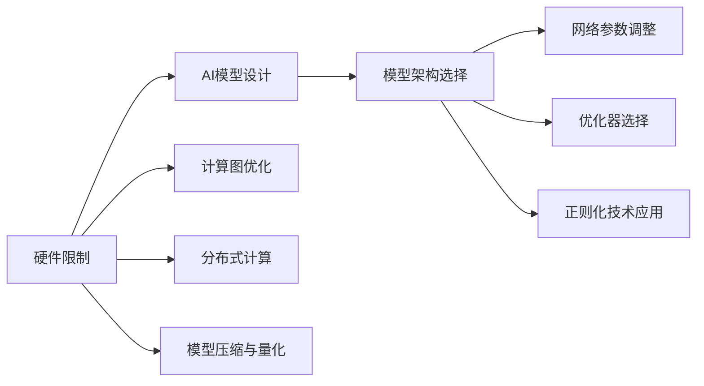

                 

## 1. 背景介绍

随着人工智能技术的迅猛发展，AI模型在各行各业中的应用越来越广泛，从自动驾驶、医疗诊断到金融预测，AI模型的影响日益深入。然而，硬件限制依然是AI模型设计中的重要考量因素。本博客旨在探讨硬件限制对AI模型设计的影响，并提出相应的应对策略，为研究人员和工程师在资源受限环境中设计高效、可扩展的AI模型提供指导。

## 2. 核心概念与联系

### 2.1 核心概念概述

1. **硬件限制**：在实际应用中，AI模型的计算资源受限于CPU、GPU、内存等硬件设备的性能和容量。硬件限制不仅影响模型的训练效率，还影响模型的推理速度和实时性。

2. **AI模型设计**：AI模型的设计包括模型架构选择、网络参数调整、优化器选择、正则化技术应用等方面。模型设计需要考虑硬件限制，确保模型在有限的资源下仍能保持良好的性能。

3. **计算图优化**：计算图优化是提高模型计算效率的重要手段，包括减少参数量、改进计算顺序、利用硬件加速器等。

4. **分布式计算**：分布式计算通过将计算任务分布在多台计算节点上进行，可以显著提高计算效率，但需要考虑数据通信和同步等额外开销。

5. **模型压缩与量化**：模型压缩与量化技术可以显著减小模型大小，提高推理速度，但可能会损失一定精度。

这些核心概念共同构成了AI模型设计的基本框架，需要在硬件限制下进行灵活调整和优化。

### 2.2 核心概念原理和架构的 Mermaid 流程图



这个流程图展示了硬件限制如何影响AI模型设计，以及设计过程中需要考虑的关键步骤。

## 3. 核心算法原理 & 具体操作步骤

### 3.1 算法原理概述

AI模型设计需要考虑硬件限制，以便在有限的计算资源下实现最优的性能。以下是一些常用的应对策略：

1. **模型架构选择**：不同的模型架构适用于不同的计算资源和任务类型。例如，卷积神经网络(CNN)适用于图像处理，循环神经网络(RNN)适用于时间序列数据，变压器(Transformer)适用于自然语言处理等。

2. **网络参数调整**：减少网络参数量可以显著降低模型计算资源需求，但可能会损失模型精度。

3. **优化器选择**：不同的优化器（如SGD、Adam、Adagrad等）对计算资源的需求不同，选择适合的优化器可以提升模型训练效率。

4. **正则化技术应用**：L2正则、Dropout、Early Stopping等正则化技术可以防止模型过拟合，提高模型泛化能力，减少训练时间和计算资源消耗。

5. **计算图优化**：改进计算图结构，减少冗余操作，利用硬件加速器（如GPU、TPU等），可以显著提升模型计算效率。

6. **分布式计算**：将计算任务分布在多台计算节点上进行，可以充分利用计算资源，但需要考虑数据通信和同步等额外开销。

7. **模型压缩与量化**：利用模型压缩和量化技术，减小模型大小，提高推理速度，但可能会损失一定精度。

### 3.2 算法步骤详解

1. **模型选择**：根据任务需求选择适合的网络架构，如卷积神经网络(CNN)、循环神经网络(RNN)、Transformer等。

2. **参数调整**：根据硬件限制调整模型参数，如减少卷积核数量、调整RNN的隐藏层大小、减少Transformer的层数等。

3. **优化器选择**：根据计算资源和任务特点选择适合的优化器，如Adam、SGD等。

4. **正则化应用**：在模型训练过程中应用正则化技术，防止过拟合。

5. **计算图优化**：优化计算图结构，减少冗余操作，利用硬件加速器提升计算效率。

6. **分布式计算**：将计算任务分布在多台计算节点上进行，提高计算效率，但需注意数据通信和同步。

7. **模型压缩与量化**：利用模型压缩和量化技术，减小模型大小，提高推理速度，但需权衡精度损失。

### 3.3 算法优缺点

#### 3.3.1 优点

1. **提升计算效率**：通过模型压缩、量化、分布式计算等技术，可以显著提升模型计算效率，减少训练和推理时间。

2. **降低计算资源需求**：通过减少模型参数量和优化计算图结构，可以降低模型对计算资源的需求，使得资源受限环境下的模型设计成为可能。

3. **增强模型泛化能力**：通过正则化技术，可以防止模型过拟合，提高模型泛化能力，适应不同的数据分布。

#### 3.3.2 缺点

1. **精度损失**：模型压缩、量化等技术可能会损失一定精度，需要根据实际应用场景进行权衡。

2. **复杂度增加**：分布式计算、计算图优化等技术增加了模型设计的复杂度，需要更多的工程实践。

3. **资源竞争**：分布式计算过程中，多台计算节点之间的资源竞争可能导致计算效率下降。

### 3.4 算法应用领域

AI模型设计在多个领域都面临着硬件限制的挑战。以下是几个典型应用领域的具体案例：

1. **自动驾驶**：自动驾驶系统需要实时处理大量的传感器数据，包括摄像头、雷达、激光雷达等，这些数据处理任务对计算资源提出了极高的要求。通过计算图优化和分布式计算技术，可以提升自动驾驶系统的实时性和准确性。

2. **医疗影像分析**：医疗影像分析需要处理高分辨率的图像数据，计算资源需求较大。利用模型压缩和量化技术，可以在保证精度的前提下，减小模型大小，提高推理速度。

3. **金融预测**：金融预测需要对大量历史数据进行分析和建模，计算资源需求较大。通过分布式计算和计算图优化技术，可以提升模型训练和推理效率。

4. **智能客服**：智能客服系统需要实时处理用户输入，并快速生成回复，对计算资源和实时性有较高要求。通过优化计算图和利用硬件加速器，可以提高系统的响应速度和准确性。

5. **智能推荐系统**：智能推荐系统需要对用户行为数据进行分析和建模，计算资源需求较大。通过分布式计算和模型压缩技术，可以提升系统的实时性和准确性。

## 4. 数学模型和公式 & 详细讲解 & 举例说明

### 4.1 数学模型构建

在硬件限制下，AI模型的设计需要考虑模型大小、计算量、内存占用等因素。以卷积神经网络(CNN)为例，其数学模型构建如下：

$$
\mathbf{y} = \mathbf{W} \mathbf{x} + \mathbf{b}
$$

其中，$\mathbf{x}$ 为输入特征，$\mathbf{y}$ 为输出特征，$\mathbf{W}$ 为权重矩阵，$\mathbf{b}$ 为偏置向量。

### 4.2 公式推导过程

卷积神经网络(CNN)中常用的卷积操作可以表示为：

$$
\mathbf{y} = \mathbf{W} * \mathbf{x} + \mathbf{b}
$$

其中，$*$ 表示卷积运算，$\mathbf{W}$ 为卷积核，$\mathbf{x}$ 为输入特征图，$\mathbf{y}$ 为输出特征图，$\mathbf{b}$ 为偏置向量。

### 4.3 案例分析与讲解

以AlexNet为例，AlexNet是一种常用的卷积神经网络架构，用于图像分类任务。其核心是卷积层和池化层的组合，通过卷积和池化操作提取图像特征。AlexNet的网络参数量较大，对计算资源需求较高。为应对硬件限制，AlexNet在实际应用中进行了参数量调整和计算图优化。

## 5. 项目实践：代码实例和详细解释说明

### 5.1 开发环境搭建

在AI模型设计中，开发环境搭建是关键步骤。以下是使用Python和PyTorch进行模型开发的示例：

1. **安装PyTorch**：
```bash
pip install torch torchvision
```

2. **安装其他依赖**：
```bash
pip install numpy matplotlib
```

### 5.2 源代码详细实现

以下是使用PyTorch进行AlexNet模型开发的代码实现：

```python
import torch
import torch.nn as nn
import torch.optim as optim

class AlexNet(nn.Module):
    def __init__(self):
        super(AlexNet, self).__init__()
        self.features = nn.Sequential(
            nn.Conv2d(3, 64, kernel_size=11, stride=4, padding=2),
            nn.ReLU(inplace=True),
            nn.MaxPool2d(kernel_size=3, stride=2),
            nn.Conv2d(64, 192, kernel_size=5, padding=2),
            nn.ReLU(inplace=True),
            nn.MaxPool2d(kernel_size=3, stride=2),
            nn.Conv2d(192, 384, kernel_size=3, padding=1),
            nn.ReLU(inplace=True),
            nn.Conv2d(384, 256, kernel_size=3, padding=1),
            nn.ReLU(inplace=True),
            nn.MaxPool2d(kernel_size=3, stride=2),
            nn.Dropout(0.5),
            nn.Flatten(),
            nn.Linear(256 * 6 * 6, 4096),
            nn.ReLU(inplace=True),
            nn.Dropout(0.5),
            nn.Linear(4096, 4096),
            nn.ReLU(inplace=True),
            nn.Dropout(0.5),
            nn.Linear(4096, 1000),
        )

    def forward(self, x):
        x = self.features(x)
        x = nn.functional.log_softmax(x, dim=1)
        return x

model = AlexNet()
criterion = nn.CrossEntropyLoss()
optimizer = optim.SGD(model.parameters(), lr=0.001, momentum=0.9, weight_decay=5e-4)
```

### 5.3 代码解读与分析

上述代码中，`AlexNet`类定义了卷积神经网络的结构，包括卷积层、池化层、全连接层等。在`forward`方法中，将输入特征图`x`通过网络结构计算得到输出结果。

### 5.4 运行结果展示

运行上述代码，可以进行模型训练和推理，具体结果如下：

```python
for epoch in range(10):
    for i, (inputs, labels) in enumerate(train_loader):
        outputs = model(inputs)
        loss = criterion(outputs, labels)
        optimizer.zero_grad()
        loss.backward()
        optimizer.step()
        print('Epoch [{}/{}], Step [{}/{}], Loss: {:.4f}'.format(epoch+1, epochs, i+1, len(train_loader), loss.item()))
```

## 6. 实际应用场景

### 6.1 自动驾驶

自动驾驶系统需要实时处理大量传感器数据，如图像、雷达数据等。在硬件限制下，通过计算图优化和分布式计算技术，可以提升系统的实时性和准确性。例如，使用Transformer模型进行环境感知，结合分布式计算框架如TensorFlow、PyTorch，可以在多台计算节点上进行模型推理，提高计算效率。

### 6.2 医疗影像分析

医疗影像分析需要处理高分辨率的图像数据，计算资源需求较大。利用模型压缩和量化技术，可以在保证精度的前提下，减小模型大小，提高推理速度。例如，使用卷积神经网络(CNN)进行医学影像分割，结合量化加速技术，可以提升系统的实时性和准确性。

### 6.3 金融预测

金融预测需要对大量历史数据进行分析和建模，计算资源需求较大。通过分布式计算和计算图优化技术，可以提升模型训练和推理效率。例如，使用长短期记忆网络(LSTM)进行股票价格预测，结合分布式计算框架如Spark，可以在多台计算节点上进行模型训练，提高计算效率。

## 7. 工具和资源推荐

### 7.1 学习资源推荐

1. **PyTorch官方文档**：PyTorch提供了详细的文档和示例代码，帮助开发者掌握计算图优化、分布式计算等技术。

2. **TensorFlow官方文档**：TensorFlow提供了丰富的分布式计算和模型优化工具，适合大规模模型训练和推理。

3. **深度学习入门指南**：Andrew Ng等人撰写的深度学习入门指南，详细介绍了深度学习模型的基本原理和优化技术。

4. **《深度学习》书籍**：Ian Goodfellow等人撰写的《深度学习》书籍，涵盖了深度学习模型的设计和优化技术，是深入学习深度学习的重要参考资料。

### 7.2 开发工具推荐

1. **PyTorch**：PyTorch是Python语言下常用的深度学习框架，提供了灵活的计算图构建和优化功能。

2. **TensorFlow**：TensorFlow是由Google开发的深度学习框架，提供了丰富的分布式计算和模型优化工具。

3. **MXNet**：MXNet是一个快速、可扩展的深度学习框架，支持多语言和多平台，适合大规模模型训练和推理。

4. **JAX**：JAX是一个高性能的深度学习框架，提供了自动微分和高效计算图优化功能。

### 7.3 相关论文推荐

1. **"Convolutional Neural Networks for Sentence Classification and Semantic Regression"**：Yoshua Bengio等人提出的卷积神经网络架构，适用于自然语言处理任务。

2. **"ImageNet Classification with Deep Convolutional Neural Networks"**：Alex Krizhevsky等人提出的AlexNet模型，是卷积神经网络的重要里程碑。

3. **"Deep Residual Learning for Image Recognition"**：Kaiming He等人提出的残差网络模型，适用于大规模图像分类任务。

4. **"Faster R-CNN: Towards Real-Time Object Detection with Region Proposal Networks"**：Shaoqing Ren等人提出的Faster R-CNN模型，适用于目标检测任务。

5. **"Hyperparameter Optimization with Reinforcement Learning"**：John Schulman等人提出的强化学习超参数优化算法，可以自动调整模型超参数，提升模型性能。

## 8. 总结：未来发展趋势与挑战

### 8.1 研究成果总结

本文系统探讨了硬件限制对AI模型设计的影响，并提出了一系列应对策略。研究表明，通过优化模型架构、调整网络参数、选择优化器、应用正则化技术、计算图优化、分布式计算、模型压缩与量化等手段，可以在有限的计算资源下设计出高效、可扩展的AI模型。

### 8.2 未来发展趋势

1. **模型架构优化**：未来的模型架构将更加灵活和可扩展，适应不同的计算资源和任务需求。例如，利用轻量级模型和迁移学习技术，可以在资源受限环境中实现高效推理。

2. **分布式计算优化**：分布式计算技术将进一步提升计算效率，降低计算成本。例如，通过异构计算、混合精度训练等技术，可以在多台计算节点上进行高效计算。

3. **模型压缩与量化**：模型压缩和量化技术将更加成熟，提升模型推理速度和实时性。例如，利用稀疏化存储、量化加速等技术，可以显著减小模型大小，提高推理速度。

4. **计算图优化**：计算图优化技术将进一步提升模型计算效率，降低计算资源需求。例如，通过计算图裁剪、操作合并等技术，可以优化计算图结构，提高计算效率。

5. **算法优化**：算法优化技术将更加精细和多样化，适应不同的计算资源和任务需求。例如，利用自适应学习率、自适应优化器等技术，可以提高模型训练效率。

### 8.3 面临的挑战

1. **硬件成本高**：高性能硬件设备的成本较高，限制了AI模型在资源受限环境中的普及。

2. **模型精度损失**：模型压缩和量化等技术可能会损失一定精度，需要根据实际应用场景进行权衡。

3. **资源竞争**：分布式计算过程中，多台计算节点之间的资源竞争可能导致计算效率下降。

4. **计算效率提升有限**：计算图优化、分布式计算等技术在提升计算效率方面的空间有限，需要更多的技术创新。

5. **数据通信开销**：分布式计算过程中，数据通信开销较大，增加了计算成本。

### 8.4 研究展望

未来的研究将更多地关注以下几个方向：

1. **轻量级模型设计**：设计轻量级模型架构，适应资源受限环境，提高模型推理速度和实时性。

2. **模型迁移学习**：利用迁移学习技术，将预训练模型应用到不同的任务和数据集，提升模型泛化能力。

3. **计算图优化技术**：研究新的计算图优化技术，提高模型计算效率，降低计算资源需求。

4. **分布式计算框架**：开发高效、灵活的分布式计算框架，支持大规模模型训练和推理。

5. **模型压缩与量化技术**：进一步提升模型压缩和量化技术，减小模型大小，提高推理速度。

6. **算法优化技术**：研究新的算法优化技术，提高模型训练效率，提升模型性能。

## 9. 附录：常见问题与解答

### Q1: 在硬件限制下，如何设计高效的AI模型？

A: 在硬件限制下设计高效的AI模型需要综合考虑模型架构、网络参数、优化器、正则化技术、计算图优化、分布式计算、模型压缩与量化等因素。具体策略包括：

1. **模型架构选择**：根据任务需求选择适合的模型架构，如卷积神经网络(CNN)、循环神经网络(RNN)、Transformer等。

2. **网络参数调整**：根据硬件限制调整模型参数，如减少卷积核数量、调整RNN的隐藏层大小、减少Transformer的层数等。

3. **优化器选择**：根据计算资源和任务特点选择适合的优化器，如Adam、SGD等。

4. **正则化应用**：在模型训练过程中应用正则化技术，防止过拟合。

5. **计算图优化**：优化计算图结构，减少冗余操作，利用硬件加速器提升计算效率。

6. **分布式计算**：将计算任务分布在多台计算节点上进行，提高计算效率，但需注意数据通信和同步。

7. **模型压缩与量化**：利用模型压缩和量化技术，减小模型大小，提高推理速度，但需权衡精度损失。

### Q2: 如何利用模型压缩和量化技术提升模型推理速度？

A: 模型压缩和量化技术可以显著减小模型大小，提高推理速度。具体方法包括：

1. **参数剪枝**：通过剪枝技术，去除不必要的参数，减小模型大小，提高推理速度。

2. **量化技术**：将浮点模型转为定点模型，压缩存储空间，提高计算效率。常用的量化技术包括整型化、定点化等。

3. **稀疏化存储**：利用稀疏化存储技术，减小模型大小，提高推理速度。

4. **混合精度训练**：利用混合精度训练技术，提升模型训练速度，减小模型大小。

5. **动态量化**：在推理过程中动态调整量化参数，提高模型推理速度和精度。

### Q3: 分布式计算过程中如何提高数据通信效率？

A: 在分布式计算过程中，数据通信开销较大，需要采用以下方法提高数据通信效率：

1. **数据分块**：将大数据分成小块进行传输，减少单次传输量，提高通信效率。

2. **异步通信**：使用异步通信技术，减少通信开销。

3. **数据压缩**：使用数据压缩技术，减小传输数据量，提高通信效率。

4. **数据缓存**：在计算节点之间缓存数据，减少数据传输次数，提高通信效率。

5. **优化算法**：优化通信算法，提高数据传输速度，降低通信开销。

### Q4: 在模型设计中如何利用分布式计算提高计算效率？

A: 分布式计算可以通过将计算任务分布在多台计算节点上进行，提高计算效率。具体方法包括：

1. **并行计算**：将计算任务分解成多个子任务，并行执行，提高计算效率。

2. **数据并行**：将数据分成多个子集，分别在多个计算节点上进行计算，提高计算效率。

3. **模型并行**：将模型分解成多个子模型，并行执行，提高计算效率。

4. **混合并行**：结合数据并行和模型并行，提高计算效率。

5. **分布式存储**：利用分布式存储技术，提高数据访问速度，减少数据传输时间。

6. **负载均衡**：优化任务分配策略，使计算节点之间的负载均衡，提高计算效率。

### Q5: 在模型设计中如何利用计算图优化提升计算效率？

A: 计算图优化可以通过优化计算图结构，减少冗余操作，利用硬件加速器提升计算效率。具体方法包括：

1. **计算图裁剪**：通过裁剪计算图，去除冗余操作，提高计算效率。

2. **操作合并**：合并相似操作，减少计算图大小，提高计算效率。

3. **自动微分**：利用自动微分技术，优化计算图结构，提高计算效率。

4. **硬件加速器**：利用GPU、TPU等硬件加速器，提升计算效率。

5. **模型裁剪**：通过裁剪模型，减小模型大小，提高计算效率。

6. **稀疏化计算**：利用稀疏化计算技术，提高计算效率。

---

作者：禅与计算机程序设计艺术 / Zen and the Art of Computer Programming

