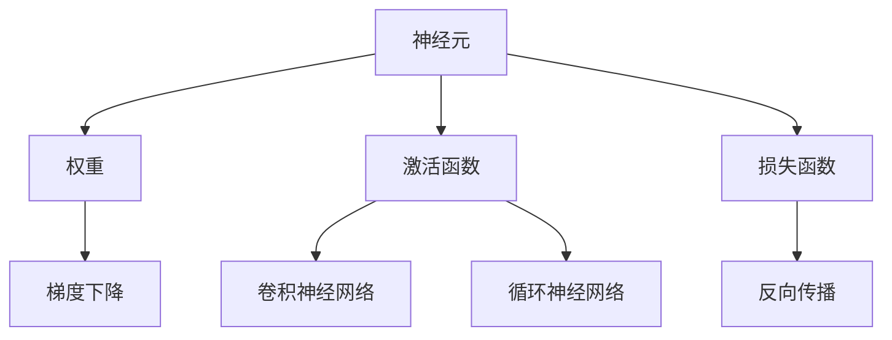

                 

# 神经网络：人工智能的基石

> 关键词：神经网络,人工智能,深度学习,反向传播,梯度下降,神经元,感知机,分布式表示,卷积神经网络(CNN),循环神经网络(RNN),长期短期记忆网络(LSTM)

## 1. 背景介绍

### 1.1 问题由来
神经网络是人工智能（AI）中最具影响力的模型之一，自从1958年罗森布拉特（Rosenblatt）提出感知机以来，神经网络理论已经经历了多次发展与变革。神经网络不仅在计算机视觉、自然语言处理、语音识别等领域取得了卓越成果，而且在自动驾驶、智能制造、医疗健康等现实应用中发挥了重要作用。

神经网络背后的核心技术是分布式表示（Distributed Representation），它利用神经元之间的连接方式，学习数据的非线性表示。尽管最初的设计基于生物学原理，但神经网络在数学上的解释同样清晰且完备。通过不断迭代，神经网络的发展已经成为人工智能发展史的重要里程碑。

### 1.2 问题核心关键点
本文将详细探讨神经网络的工作原理、核心算法、学习过程以及其在深度学习中的应用。神经网络的核心问题主要包括：

- **分布式表示**：神经网络如何学习并分布式表示数据特征。
- **反向传播算法**：如何在损失函数指导下，计算每个神经元的梯度，从而优化模型参数。
- **参数优化**：如何高效地更新模型参数，以最小化损失函数。
- **架构设计**：神经网络模型的设计原则与关键架构。
- **实践应用**：神经网络在实际问题中的部署与优化。

理解这些关键点，有助于深入掌握神经网络的原理与应用，从而更好地应用于实际问题中。

## 2. 核心概念与联系

### 2.1 核心概念概述

为更好地理解神经网络，本节将介绍几个密切相关的核心概念：

- **神经元（Neuron）**：神经网络的基本单位，模拟人类神经元的信息处理过程。
- **权重（Weight）**：连接神经元的系数，控制信号的强度。
- **激活函数（Activation Function）**：决定神经元输出的非线性函数。
- **损失函数（Loss Function）**：衡量模型预测与真实值之间差异的函数。
- **梯度下降（Gradient Descent）**：一种优化算法，用于更新模型参数以最小化损失函数。
- **反向传播（Backpropagation）**：一种计算过程，用于反向传播误差以更新权重。
- **卷积神经网络（CNN）**：专门处理图像等空间数据的网络结构。
- **循环神经网络（RNN）**：专门处理时间序列数据的网络结构。

这些核心概念之间的逻辑关系可以通过以下Mermaid流程图来展示：



这个流程图展示了大神经网络的核心概念及其之间的关系：

1. 神经网络由神经元构成，通过权重控制信号强度。
2. 神经元输出由激活函数决定，实现非线性变换。
3. 模型性能由损失函数衡量，目标是尽可能减少预测误差。
4. 模型参数通过梯度下降和反向传播算法更新，以最小化损失函数。
5. 神经网络在CNN和RNN等特殊结构下，可处理空间和时间数据。

这些概念共同构成了神经网络的基础，使神经网络能够在各类实际问题中发挥作用。

## 3. 核心算法原理 & 具体操作步骤
### 3.1 算法原理概述

神经网络的基本工作原理是通过对大量样本的训练，学习数据的分布式表示。这可以通过损失函数和梯度下降算法来实现。

具体步骤如下：

1. **初始化参数**：随机初始化神经网络中的所有权重。
2. **前向传播**：输入样本通过神经网络，计算出每个神经元的输出。
3. **计算损失**：使用损失函数衡量模型预测与真实标签之间的差异。
4. **反向传播**：根据损失函数的梯度，反向传播误差，计算每个权重对损失的影响。
5. **参数更新**：使用梯度下降算法，更新模型参数以最小化损失函数。
6. **重复迭代**：重复以上步骤，直到模型收敛。

这种基于梯度的优化方法能够逐步调整神经网络的结构和参数，使模型在训练数据上表现更好。

### 3.2 算法步骤详解

下面详细介绍神经网络中的核心算法和操作步骤：

**初始化参数**：
在神经网络中，每个神经元通过权重与前一层神经元的输出相连。权重需要随机初始化，常见的初始化方法包括Xavier和He初始化。

**前向传播**：
前向传播是指将输入数据传递到神经网络中，通过逐层计算输出。具体过程如下：

$$
z^{[l]} = W^{[l]}x^{[l-1]} + b^{[l]}
$$
$$
x^{[l]} = \sigma(z^{[l]})
$$

其中 $z^{[l]}$ 表示第 $l$ 层神经元的加权输入，$x^{[l]}$ 表示激活函数的输出，$W^{[l]}$ 表示权重矩阵，$b^{[l]}$ 表示偏置向量，$\sigma$ 表示激活函数（如ReLU、Sigmoid等）。

**计算损失**：
损失函数是衡量模型预测与真实值之间差异的函数。常用的损失函数包括均方误差（MSE）、交叉熵（Cross-Entropy）等。例如，对于二分类问题，交叉熵损失函数为：

$$
\mathcal{L} = -\frac{1}{N}\sum_{i=1}^N(y_i\log\hat{y}_i + (1-y_i)\log(1-\hat{y}_i))
$$

其中 $y_i$ 表示真实标签，$\hat{y}_i$ 表示模型预测。

**反向传播**：
反向传播是指从输出层开始，根据损失函数的梯度，反向计算每个权重对损失的影响。具体过程如下：

$$
\frac{\partial\mathcal{L}}{\partial z^{[1]}} = \frac{\partial\mathcal{L}}{\partial z^{[2]}}\frac{\partial z^{[2]}}{\partial z^{[1]}}
$$

其中 $\frac{\partial\mathcal{L}}{\partial z^{[1]}}$ 表示第 $1$ 层权重对损失的梯度。通过链式法则，可以逐层计算每个权重的梯度。

**参数更新**：
梯度下降算法用于更新模型参数以最小化损失函数。具体过程如下：

$$
\theta = \theta - \alpha\frac{\partial\mathcal{L}}{\partial\theta}
$$

其中 $\alpha$ 表示学习率，$\frac{\partial\mathcal{L}}{\partial\theta}$ 表示参数对损失的梯度。通过不断迭代，参数 $\theta$ 将逐步调整到最小化损失函数的位置。

### 3.3 算法优缺点

神经网络具有以下优点：

- **分布式表示**：能够学习数据的非线性表示，捕捉复杂模式。
- **自动特征提取**：通过多层非线性变换，自动提取输入特征。
- **广泛应用**：在图像、语音、自然语言处理等领域广泛应用。

同时，神经网络也存在以下缺点：

- **计算复杂度高**：大规模神经网络需要大量的计算资源。
- **过拟合风险高**：如果没有适当的正则化，容易出现过拟合现象。
- **模型结构复杂**：设计神经网络结构需要经验和技巧。
- **需要大量数据**：通常需要大规模数据进行训练。

尽管存在这些缺点，但神经网络在解决复杂问题方面的优势，使其成为深度学习中的核心技术。

### 3.4 算法应用领域

神经网络在人工智能中具有广泛的应用，主要包括：

- **计算机视觉**：如图像分类、目标检测、图像分割等。
- **自然语言处理**：如文本分类、情感分析、机器翻译等。
- **语音识别**：如语音转文本、语音情感识别等。
- **推荐系统**：如用户兴趣建模、商品推荐等。
- **自动驾驶**：如图像识别、行为预测等。
- **医疗健康**：如疾病诊断、病理分析等。

除了上述应用外，神经网络还在智能制造、智慧城市、金融风控等领域得到广泛应用。

## 4. 数学模型和公式 & 详细讲解 & 举例说明

### 4.1 数学模型构建

神经网络是一个复杂的非线性映射系统，其数学模型可以表示为：

$$
y = \sigma(Wx + b)
$$

其中 $y$ 表示输出，$x$ 表示输入，$W$ 表示权重矩阵，$b$ 表示偏置向量，$\sigma$ 表示激活函数。

### 4.2 公式推导过程

以二分类问题为例，假设模型已经训练完成，且有 $m$ 个样本。对于第 $i$ 个样本 $(x^{(i)}, y^{(i)})$，模型预测结果为 $\hat{y}^{(i)}$，则其损失函数为：

$$
\mathcal{L} = -\frac{1}{m}\sum_{i=1}^m(y^{(i)}\log\hat{y}^{(i)} + (1-y^{(i)})\log(1-\hat{y}^{(i)})
$$

利用梯度下降算法，更新模型参数 $W$ 和 $b$ 的过程如下：

$$
\frac{\partial\mathcal{L}}{\partial W} = -\frac{1}{m}\sum_{i=1}^m\left(y^{(i)}(\hat{y}^{(i)}-x^{(i)}) - (1-y^{(i)})(1-\hat{y}^{(i)})\right)x^{(i)}
$$
$$
\frac{\partial\mathcal{L}}{\partial b} = -\frac{1}{m}\sum_{i=1}^m\left(y^{(i)}(\hat{y}^{(i)}-x^{(i)}) - (1-y^{(i)})\left(1-\hat{y}^{(i)}\right)\right)
$$

将上述公式代入梯度下降算法中，完成参数更新。

### 4.3 案例分析与讲解

假设有一个简单的神经网络，包含两个隐藏层，每个隐藏层包含 $64$ 个神经元。输入层有 $784$ 个神经元，输出层有 $10$ 个神经元。

**模型构建**：
```python
import torch
import torch.nn as nn
import torch.optim as optim

class Net(nn.Module):
    def __init__(self):
        super(Net, self).__init__()
        self.fc1 = nn.Linear(784, 64)
        self.fc2 = nn.Linear(64, 64)
        self.fc3 = nn.Linear(64, 10)
        self.relu = nn.ReLU()
        
    def forward(self, x):
        x = self.fc1(x)
        x = self.relu(x)
        x = self.fc2(x)
        x = self.relu(x)
        x = self.fc3(x)
        return x
```

**数据准备**：
```python
from torchvision import datasets, transforms

train_dataset = datasets.MNIST('data', train=True, download=True,
                               transform=transforms.ToTensor())
train_loader = torch.utils.data.DataLoader(train_dataset, batch_size=64, shuffle=True)

test_dataset = datasets.MNIST('data', train=False, download=True,
                              transform=transforms.ToTensor())
test_loader = torch.utils.data.DataLoader(test_dataset, batch_size=64, shuffle=False)
```

**模型训练**：
```python
device = torch.device('cuda' if torch.cuda.is_available() else 'cpu')

model = Net().to(device)
criterion = nn.CrossEntropyLoss()
optimizer = optim.SGD(model.parameters(), lr=0.01, momentum=0.9)

for epoch in range(10):
    model.train()
    running_loss = 0.0
    for i, data in enumerate(train_loader, 0):
        inputs, labels = data[0].to(device), data[1].to(device)
        optimizer.zero_grad()
        outputs = model(inputs)
        loss = criterion(outputs, labels)
        loss.backward()
        optimizer.step()
        
    model.eval()
    with torch.no_grad():
        correct = 0
        total = 0
        for data in test_loader:
            images, labels = data[0].to(device), data[1].to(device)
            outputs = model(images)
            _, predicted = torch.max(outputs.data, 1)
            total += labels.size(0)
            correct += (predicted == labels).sum().item()

    print(f'Epoch {epoch+1}, Loss: {running_loss/len(train_loader):.4f}, Accuracy: {correct/total*100:.2f}%')
```

通过上述代码，我们训练了一个简单的神经网络，并在测试集上获得了不错的精度。

## 5. 项目实践：代码实例和详细解释说明
### 5.1 开发环境搭建

在进行神经网络项目实践前，我们需要准备好开发环境。以下是使用Python进行TensorFlow开发的环境配置流程：

1. 安装Anaconda：从官网下载并安装Anaconda，用于创建独立的Python环境。

2. 创建并激活虚拟环境：
```bash
conda create -n tf-env python=3.8 
conda activate tf-env
```

3. 安装TensorFlow：从官网获取对应的安装命令。例如：
```bash
conda install tensorflow -c pytorch -c conda-forge
```

4. 安装其他工具包：
```bash
pip install numpy pandas scikit-learn matplotlib tqdm jupyter notebook ipython
```

完成上述步骤后，即可在`tf-env`环境中开始神经网络项目开发。

### 5.2 源代码详细实现

这里我们以手写数字识别为例，给出使用TensorFlow进行神经网络开发的PyTorch代码实现。

首先，定义神经网络模型：

```python
import tensorflow as tf

class Net(tf.keras.Model):
    def __init__(self):
        super(Net, self).__init__()
        self.fc1 = tf.keras.layers.Dense(64, activation='relu')
        self.fc2 = tf.keras.layers.Dense(64, activation='relu')
        self.fc3 = tf.keras.layers.Dense(10, activation='softmax')
        
    def call(self, inputs):
        x = self.fc1(inputs)
        x = self.fc2(x)
        x = self.fc3(x)
        return x
```

然后，定义训练函数：

```python
def train(model, train_dataset, test_dataset, batch_size, epochs):
    model.compile(optimizer='adam', loss='sparse_categorical_crossentropy', metrics=['accuracy'])
    model.fit(train_dataset, epochs=epochs, batch_size=batch_size, validation_data=test_dataset)
    
    test_loss, test_acc = model.evaluate(test_dataset, verbose=0)
    print(f'Test loss: {test_loss:.4f}')
    print(f'Test accuracy: {test_acc:.4f}')
```

最后，启动训练流程并在测试集上评估：

```python
model = Net()
train_dataset = ...
test_dataset = ...
train(model, train_dataset, test_dataset, batch_size=32, epochs=10)
```

以上就是使用TensorFlow进行神经网络项目开发的完整代码实现。可以看到，TensorFlow提供了高效的API，使得神经网络开发变得更加简单便捷。

### 5.3 代码解读与分析

让我们再详细解读一下关键代码的实现细节：

**Net类**：
- `__init__`方法：定义神经网络的结构，包括多个全连接层和激活函数。
- `call`方法：定义神经网络的计算流程，通过多层非线性变换计算输出。

**train函数**：
- 编译模型，设置优化器和损失函数。
- 调用`fit`方法进行训练，并在测试集上评估模型性能。
- 打印测试集上的损失和精度。

**训练流程**：
- 定义神经网络模型。
- 定义训练数据集和测试数据集。
- 调用`train`函数进行模型训练。

通过这些代码，我们可以快速搭建和训练一个简单的神经网络模型。在实际应用中，还需要根据具体问题进行模型架构设计、优化器选择、正则化方法等优化。

## 6. 实际应用场景
### 6.1 图像分类

图像分类是神经网络最常见的应用之一。通过训练一个分类器，可以自动将图像分成不同的类别。例如，谷歌的Inception和ResNet系列模型已经在ImageNet数据集上取得了优异的表现。

在实际应用中，图像分类可以用于物体识别、场景分析、人脸识别等。例如，在无人驾驶中，通过对路标、车辆等图像的分类，系统能够自动识别并响应不同情况。

### 6.2 语音识别

语音识别技术通过将语音信号转换成文本，使得计算机能够理解人类语言。神经网络在该领域的应用包括端到端（End-to-End）模型和混合模型等。

在实际应用中，语音识别可以用于智能客服、语音助手、语音翻译等。例如，苹果的Siri和亚马逊的Alexa，都是基于神经网络语音识别技术的。

### 6.3 自然语言处理

自然语言处理（NLP）是神经网络的另一个重要应用领域。通过训练语言模型，可以自动理解和生成自然语言文本。例如，BERT和GPT等预训练语言模型已经在多项NLP任务上取得了SOTA表现。

在实际应用中，NLP技术可以用于机器翻译、文本摘要、问答系统等。例如，Google Translate和OpenAI的GPT-3，都是基于神经网络模型的。

### 6.4 未来应用展望

随着神经网络技术的不断发展，未来将涌现更多基于神经网络的创新应用。

- **自动驾驶**：神经网络将广泛应用于自动驾驶系统中的感知、决策和控制环节。
- **医疗诊断**：神经网络可以辅助医生进行疾病诊断、病理分析等任务。
- **智能制造**：神经网络可以优化生产流程、预测设备故障、提高产品质量等。
- **金融风控**：神经网络可以用于风险评估、欺诈检测、信用评分等金融领域。
- **智慧城市**：神经网络可以应用于城市交通管理、智能安防、环境监测等。

总之，神经网络的应用将不断扩展，为各行各业带来变革性的影响。

## 7. 工具和资源推荐
### 7.1 学习资源推荐

为了帮助开发者系统掌握神经网络的理论基础和实践技巧，这里推荐一些优质的学习资源：

1. 《深度学习》（Ian Goodfellow等）：深度学习的经典教材，详细介绍了神经网络、深度学习的基本原理和算法。

2. CS231n《卷积神经网络》课程：斯坦福大学开设的计算机视觉课程，讲解卷积神经网络的结构和优化方法。

3. CS224n《自然语言处理》课程：斯坦福大学开设的NLP课程，详细介绍了神经网络在NLP中的应用。

4. DeepLearning.AI《深度学习专项课程》：Andrew Ng等学者主讲，系统介绍了深度学习的核心技术和应用场景。

5. TensorFlow官方文档：TensorFlow的官方文档，提供了详尽的API文档和教程，适合初学者和专家使用。

通过对这些资源的学习实践，相信你一定能够快速掌握神经网络的基本原理和应用技巧，从而更好地应用于实际问题中。

### 7.2 开发工具推荐

高效的开发离不开优秀的工具支持。以下是几款用于神经网络开发的常用工具：

1. PyTorch：基于Python的开源深度学习框架，灵活动态的计算图，适合快速迭代研究。

2. TensorFlow：由Google主导开发的开源深度学习框架，生产部署方便，适合大规模工程应用。

3. Keras：高级神经网络API，适合快速原型开发。

4. Weights & Biases：模型训练的实验跟踪工具，可以记录和可视化模型训练过程中的各项指标，方便对比和调优。

5. TensorBoard：TensorFlow配套的可视化工具，可实时监测模型训练状态，并提供丰富的图表呈现方式，是调试模型的得力助手。

6. Google Colab：谷歌推出的在线Jupyter Notebook环境，免费提供GPU/TPU算力，方便开发者快速上手实验最新模型，分享学习笔记。

合理利用这些工具，可以显著提升神经网络开发的效率，加快创新迭代的步伐。

### 7.3 相关论文推荐

神经网络的研究源于学界的持续探索。以下是几篇奠基性的相关论文，推荐阅读：

1. A Theory of Multilayer Perceptrons with Backpropagation（1988）：Rumelhart等人提出的BP算法，奠定了神经网络训练的基础。

2. ImageNet Classification with Deep Convolutional Neural Networks（2012）：Krizhevsky等人提出的AlexNet，开创了深度卷积神经网络的时代。

3. Deep Residual Learning for Image Recognition（2016）：He等人提出的ResNet，解决了深度网络训练中的梯度消失问题。

4. Attention Is All You Need（2017）：Vaswani等人提出的Transformer模型，引入了自注意力机制，提高了序列数据的处理能力。

5. Bidirectional Transformers for Language Understanding（2018）：Jacob等人提出的BERT模型，通过双向注意力机制，提升了语言模型的表现。

6. Generative Adversarial Nets（2014）：Goodfellow等人提出的GAN模型，开创了生成对抗网络的研究方向。

这些论文代表了大神经网络的研究历程和发展脉络，通过学习这些前沿成果，可以帮助研究者把握学科前进方向，激发更多的创新灵感。

## 8. 总结：未来发展趋势与挑战

### 8.1 研究成果总结

本文对神经网络的工作原理、核心算法、学习过程以及其在深度学习中的应用进行了详细探讨。重点介绍了反向传播算法、梯度下降算法等核心技术，以及CNN、RNN等经典模型。

通过本文的系统梳理，可以看到神经网络在解决复杂问题方面的优势，以及其在计算机视觉、自然语言处理、语音识别等领域的重要应用。

### 8.2 未来发展趋势

展望未来，神经网络技术将呈现以下几个发展趋势：

1. **更深层的网络结构**：随着计算资源的不断提升，更深层次的神经网络将可能被引入实际应用，提升模型的准确率和泛化能力。

2. **更高效的网络设计**：新的网络架构，如Capsule Net、Lightweight Convolution等，将更加高效地利用计算资源，提高模型性能。

3. **更多的分布式训练技术**：分布式训练、模型并行等技术将进一步提升神经网络的训练效率，适应大规模数据处理的需求。

4. **更广泛的应用场景**：神经网络将在更多领域得到应用，如自动驾驶、医疗诊断、金融风控等，带来更加广泛的社会和经济效益。

5. **更先进的优化算法**：新的优化算法，如AdamW、Adafactor等，将更好地解决梯度消失和梯度爆炸问题，提高模型训练速度。

6. **更强的解释性和可解释性**：未来神经网络将更加注重模型解释性，通过可视化、可解释性技术，使得模型的决策过程更加透明。

### 8.3 面临的挑战

尽管神经网络技术已经取得了显著进展，但在迈向更加智能化、普适化应用的过程中，仍面临诸多挑战：

1. **计算资源瓶颈**：深度神经网络的训练和推理需要大量的计算资源，如何优化计算效率，是一个重要的研究方向。

2. **过拟合问题**：神经网络在训练过程中容易过拟合，特别是在数据量较小的情况下，需要更多的正则化和数据增强技术。

3. **模型鲁棒性不足**：神经网络对输入数据的微小扰动非常敏感，需要更多的鲁棒性训练和对抗训练技术。

4. **知识迁移能力不足**：神经网络通常需要大量的数据进行训练，如何在少样本情况下迁移学习知识，是一个重要的研究方向。

5. **伦理和隐私问题**：神经网络在处理敏感数据时，可能存在隐私泄露和伦理问题，需要更多的数据保护和隐私保护技术。

6. **模型复杂性**：神经网络的设计和训练过程复杂，需要更多的自动化和工具支持。

### 8.4 研究展望

面对神经网络面临的挑战，未来的研究需要在以下几个方面寻求新的突破：

1. **无监督学习和自监督学习**：摆脱对大量标注数据的依赖，利用自监督学习、无监督学习等技术，提升模型的泛化能力和迁移学习能力。

2. **多模态学习**：将视觉、语音、文本等多模态信息融合，提升模型的综合能力和理解能力。

3. **强化学习**：利用强化学习技术，提升神经网络在复杂环境中的决策能力和适应能力。

4. **解释性和透明性**：开发更加可解释的模型，通过可视化技术，使得模型的决策过程更加透明。

5. **分布式训练**：利用分布式训练技术，提升神经网络在数据量较大时的训练效率。

6. **跨领域知识迁移**：通过知识图谱、逻辑规则等先验知识，提升神经网络在跨领域场景中的迁移能力。

这些研究方向将推动神经网络技术的进一步发展，为人类认知智能的进化带来深远影响。相信通过不断的探索和创新，神经网络技术将更好地应用于实际问题中，推动人工智能技术的发展。

## 9. 附录：常见问题与解答

**Q1：什么是神经网络？**

A: 神经网络是一种基于分布式表示的模型，通过多层神经元之间的连接和激活函数，实现数据的非线性映射。

**Q2：神经网络是如何训练的？**

A: 神经网络的训练过程包括前向传播、损失计算、反向传播和参数更新等步骤。通过不断迭代优化，使得模型能够更好地拟合训练数据。

**Q3：神经网络有哪些应用？**

A: 神经网络在计算机视觉、自然语言处理、语音识别、推荐系统等领域有广泛应用。例如，卷积神经网络用于图像分类，循环神经网络用于文本生成，生成对抗网络用于图像生成等。

**Q4：神经网络的优点和缺点是什么？**

A: 神经网络的优点包括分布式表示、自动特征提取、广泛应用等。缺点包括计算复杂度高、过拟合风险高、模型结构复杂等。

**Q5：如何选择神经网络的架构？**

A: 神经网络的架构设计需要考虑任务的特点、数据量的大小、计算资源的限制等因素。例如，对于图像识别任务，卷积神经网络是一个不错的选择；对于文本生成任务，循环神经网络更适合。

通过以上回答，可以帮助读者更好地理解神经网络的基本概念和应用，为实际项目开发提供指导。

