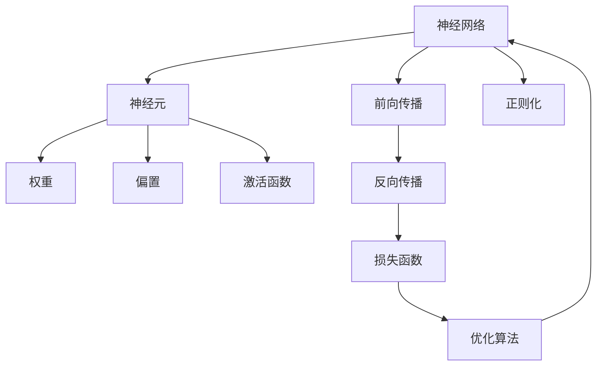

                 

## 1. 背景介绍

### 1.1 问题由来
人工智能（AI）的迅猛发展离不开数学和计算机科学的深刻融合。其中，神经网络作为AI技术的基石，以其强大的拟合能力和可解释性，广泛应用于图像识别、语音识别、自然语言处理等诸多领域。神经网络通过对大量数据的学习，构建出高效的模型，能够自动提取输入数据中的特征，进行精准的分类和预测。

近年来，随着深度学习技术的发展，神经网络在图像处理、自然语言处理等方向取得了显著的突破。深度学习中使用的多层次神经网络（尤其是卷积神经网络CNN和循环神经网络RNN等），已经广泛应用于计算机视觉、自然语言处理和语音识别等领域，成为推动AI技术发展的重要力量。

### 1.2 问题核心关键点
神经网络的核心在于如何构建一个包含多个层次的非线性变换的模型，以便有效地捕捉输入数据的特征。其核心算法包括前向传播、反向传播和梯度下降等，这些算法通过不断迭代优化，使得神经网络能够逐步提升其预测准确度。

神经网络分为多个层次，每个层次包含多个神经元，通过权重矩阵和偏置向量进行连接和计算。前向传播过程中，输入数据经过各层神经元的逐层处理，最终输出结果；反向传播过程中，根据输出结果与真实标签之间的误差，反向计算梯度，更新权重和偏置，使得模型更加精确。

### 1.3 问题研究意义
神经网络技术的研究不仅推动了人工智能的快速发展，也在计算机视觉、自然语言处理、医疗诊断等诸多领域取得了显著应用，提升了人类生活的便捷性和智能水平。神经网络不仅在学术界具有重要地位，更成为工业界解决实际问题的有力工具。

神经网络的研究还促进了诸多技术的发展，如计算机视觉中的物体识别、人脸识别等，自然语言处理中的机器翻译、情感分析、文本生成等，都离不开神经网络技术的支撑。因此，深入理解神经网络原理、构建和训练方法，对于推动AI技术的进步具有重要意义。

## 2. 核心概念与联系

### 2.1 核心概念概述

神经网络作为AI技术的重要组成部分，涉及到多个关键概念，包括：

- **神经元（Neuron）**：神经网络的基本单位，接收输入信号，进行加权求和，并经过激活函数输出。
- **权重（Weight）**：连接神经元的系数，影响神经元的输出。
- **偏置（Bias）**：神经元的截距，影响神经元的基本输出。
- **激活函数（Activation Function）**：引入非线性变换，使神经网络具备较强的表达能力。
- **前向传播（Forward Propagation）**：输入数据通过网络逐层传递，计算最终输出。
- **反向传播（Backpropagation）**：根据输出误差，反向计算梯度，更新权重和偏置，优化网络参数。
- **损失函数（Loss Function）**：衡量模型预测输出与真实标签之间的误差，常见有均方误差、交叉熵等。
- **优化算法（Optimization Algorithm）**：如梯度下降、Adam等，用于更新模型参数，最小化损失函数。
- **正则化（Regularization）**：如L1、L2正则化，防止过拟合，提升模型泛化能力。

这些概念相互关联，共同构成神经网络的核心结构。理解这些概念及其相互关系，有助于深入掌握神经网络的构建和训练方法。

### 2.2 核心概念原理和架构的 Mermaid 流程图



该流程图展示了神经网络的架构和关键流程：

1. **神经元**：接收输入信号，进行加权求和，并经过激活函数输出。
2. **权重**：连接神经元的系数，影响神经元的输出。
3. **偏置**：神经元的截距，影响神经元的基本输出。
4. **激活函数**：引入非线性变换，使神经网络具备较强的表达能力。
5. **前向传播**：输入数据通过网络逐层传递，计算最终输出。
6. **反向传播**：根据输出误差，反向计算梯度，更新权重和偏置，优化网络参数。
7. **损失函数**：衡量模型预测输出与真实标签之间的误差。
8. **优化算法**：如梯度下降、Adam等，用于更新模型参数，最小化损失函数。
9. **正则化**：如L1、L2正则化，防止过拟合，提升模型泛化能力。

这些核心概念相互联系，共同构成神经网络的运行机制。

## 3. 核心算法原理 & 具体操作步骤

### 3.1 算法原理概述

神经网络的核心算法包括前向传播、反向传播和梯度下降等。其基本流程如下：

1. **前向传播**：将输入数据传递通过网络，计算最终输出。
2. **反向传播**：根据输出误差，反向计算梯度，更新权重和偏置，优化网络参数。
3. **梯度下降**：通过计算梯度，更新权重和偏置，最小化损失函数。

这些算法通过不断迭代优化，使得神经网络能够逐步提升其预测准确度。

### 3.2 算法步骤详解

神经网络的训练过程包括以下几个关键步骤：

**Step 1: 数据准备**
- 准备训练数据集和测试数据集，进行数据预处理和划分。
- 将输入数据标准化或归一化，以便更好地训练模型。

**Step 2: 模型初始化**
- 随机初始化权重和偏置。
- 选择合适的激活函数，如ReLU、Sigmoid等。

**Step 3: 前向传播**
- 将输入数据传递通过网络，计算各层的加权和。
- 通过激活函数计算各层的输出。

**Step 4: 计算损失**
- 将输出结果与真实标签计算误差，如均方误差、交叉熵等。
- 计算平均损失函数值。

**Step 5: 反向传播**
- 根据输出误差，反向计算梯度。
- 更新权重和偏置，使得误差函数下降。

**Step 6: 优化更新**
- 选择合适的优化算法，如梯度下降、Adam等。
- 根据梯度更新权重和偏置，最小化损失函数。

**Step 7: 正则化**
- 应用正则化技术，如L1、L2正则化，防止过拟合。
- 根据损失函数和正则化项，计算新的权重和偏置。

**Step 8: 测试评估**
- 在测试集上评估模型性能，计算准确率、召回率等指标。
- 根据评估结果调整模型参数，继续优化训练过程。

重复以上步骤，直到模型收敛或达到预设的训练轮数，最终得到训练好的神经网络模型。

### 3.3 算法优缺点

神经网络算法具有以下优点：
- **强拟合能力**：多层次的非线性变换，能够捕捉复杂输入数据的特征。
- **高效表达**：激活函数的引入，使神经网络具备较强的表达能力，适用于多种任务。
- **自动化优化**：通过梯度下降等优化算法，自动调整模型参数，无需手动调参。

但同时，神经网络算法也存在以下缺点：
- **过拟合风险**：模型参数过多，容易过拟合训练数据，泛化能力不足。
- **计算资源需求高**：大规模神经网络需要大量的计算资源和存储空间，训练成本较高。
- **可解释性差**：神经网络作为黑盒模型，难以解释其内部工作机制和决策逻辑。

### 3.4 算法应用领域

神经网络算法广泛应用于多个领域，包括：

- **计算机视觉**：如图像分类、目标检测、人脸识别等。
- **自然语言处理**：如文本分类、机器翻译、情感分析等。
- **语音识别**：如语音识别、语音合成、说话人识别等。
- **推荐系统**：如商品推荐、新闻推荐、广告推荐等。
- **游戏AI**：如围棋、象棋、星际争霸等游戏中的AI玩家。

## 4. 数学模型和公式 & 详细讲解 & 举例说明

### 4.1 数学模型构建

神经网络可以形式化地表示为：

$$
y = f(\theta_0(f(\theta_1(f(\theta_2(\cdots f(\theta_n(x))\cdots)))))
$$

其中 $x$ 为输入数据，$y$ 为输出结果，$f(\cdot)$ 为神经元激活函数，$\theta_i$ 为权重和偏置向量。

神经网络的训练目标是最小化损失函数：

$$
\min_{\theta_0,\theta_1,\cdots,\theta_n} \mathcal{L}(y,\hat{y})
$$

其中 $\hat{y}$ 为模型预测输出。

### 4.2 公式推导过程

以一个简单的两层神经网络为例，其前向传播过程如下：

设 $x$ 为输入数据，$w$ 为权重矩阵，$b$ 为偏置向量，$a$ 为激活函数，则有：

$$
z_1 = w_1x + b_1
$$

$$
a_1 = f(z_1)
$$

$$
z_2 = w_2a_1 + b_2
$$

$$
y = f(z_2)
$$

其中 $f(z)$ 为激活函数，如ReLU、Sigmoid等。

反向传播过程中，根据输出误差 $E$，计算梯度：

$$
\frac{\partial \mathcal{L}}{\partial w} = \frac{\partial \mathcal{L}}{\partial z} \frac{\partial z}{\partial w}
$$

$$
\frac{\partial \mathcal{L}}{\partial b} = \frac{\partial \mathcal{L}}{\partial z} \frac{\partial z}{\partial b}
$$

$$
\frac{\partial \mathcal{L}}{\partial a} = \frac{\partial \mathcal{L}}{\partial z} \frac{\partial z}{\partial a}
$$

通过链式法则计算每个权重和偏置的梯度，并更新模型参数，最小化损失函数。

### 4.3 案例分析与讲解

以手写数字识别为例，分析神经网络在图像分类任务中的应用。

**数据准备**：
- 收集大量手写数字图像，进行标注。
- 将图像进行预处理，归一化像素值。

**模型构建**：
- 设计两层神经网络，第一层为卷积层，第二层为全连接层。
- 选择合适的激活函数，如ReLU、Sigmoid等。
- 设置合适的权重和偏置初始化。

**训练过程**：
- 前向传播计算输出结果。
- 计算输出误差，如交叉熵。
- 反向传播计算梯度。
- 使用梯度下降等优化算法，更新权重和偏置。
- 正则化防止过拟合。
- 在验证集上评估模型性能，调整超参数。
- 最终在测试集上评估模型效果。

**结果分析**：
- 输出准确率、召回率等指标，评估模型性能。
- 可视化模型学习过程，观察误差变化。
- 分析模型在复杂背景下的鲁棒性。

通过手写数字识别的案例，可以深入理解神经网络的工作原理和训练过程，进一步掌握其应用技巧。

## 5. 项目实践：代码实例和详细解释说明

### 5.1 开发环境搭建

进行神经网络项目实践，需要准备以下开发环境：

1. 安装Python：从官网下载并安装Python 3.x版本。
2. 安装NumPy、Pandas、Scikit-Learn等科学计算库。
3. 安装深度学习框架，如TensorFlow、PyTorch等。
4. 安装图形界面库，如Matplotlib、Seaborn等。
5. 配置GPU环境，以便进行高性能计算。

### 5.2 源代码详细实现

以TensorFlow为例，以下是一个简单的手写数字识别神经网络模型的代码实现：

```python
import tensorflow as tf
from tensorflow.keras import layers

# 定义模型结构
model = tf.keras.Sequential([
    layers.Conv2D(32, kernel_size=(3,3), activation='relu', input_shape=(28,28,1)),
    layers.MaxPooling2D(pool_size=(2,2)),
    layers.Flatten(),
    layers.Dense(128, activation='relu'),
    layers.Dense(10, activation='softmax')
])

# 编译模型
model.compile(optimizer='adam', loss='sparse_categorical_crossentropy', metrics=['accuracy'])

# 训练模型
model.fit(train_images, train_labels, epochs=10, validation_data=(test_images, test_labels))

# 评估模型
test_loss, test_acc = model.evaluate(test_images, test_labels)
print('Test accuracy:', test_acc)
```

**代码解释**：
- `tf.keras.Sequential`：构建序列模型，依次添加各层。
- `Conv2D`：卷积层，提取图像特征。
- `MaxPooling2D`：池化层，降低特征维度。
- `Flatten`：将多维特征展平，便于全连接层处理。
- `Dense`：全连接层，进行分类。
- `compile`：编译模型，设置优化器和损失函数。
- `fit`：训练模型，指定训练数据和轮数。
- `evaluate`：评估模型，返回测试准确率。

### 5.3 代码解读与分析

上述代码实现了一个包含卷积层和全连接层的基本神经网络模型，用于手写数字识别任务。关键步骤如下：

1. **模型结构设计**：使用`tf.keras.Sequential`构建序列模型，依次添加卷积层、池化层、全连接层等。
2. **数据预处理**：将输入图像标准化为28x28x1的张量，以适配卷积层。
3. **模型编译**：使用`compile`函数设置优化器、损失函数和评估指标。
4. **模型训练**：使用`fit`函数进行模型训练，指定训练数据和轮数。
5. **模型评估**：使用`evaluate`函数评估模型性能，返回测试准确率。

通过分析代码实现，可以深入理解神经网络的构建和训练过程，进一步掌握其应用技巧。

## 6. 实际应用场景

### 6.1 智能推荐系统

神经网络在智能推荐系统中的应用非常广泛，通过分析用户行为和物品特征，构建推荐模型，实现个性化的推荐服务。

在智能推荐系统中，神经网络模型可以接收用户的历史浏览记录、评分信息、物品的描述、标签等输入数据，输出用户对每个物品的兴趣度。通过优化损失函数，不断调整模型参数，使得推荐结果更加准确和个性化。

### 6.2 医学影像诊断

神经网络在医学影像诊断中的应用，如CT、MRI、X光等图像的自动分析，具有重要意义。通过训练神经网络模型，可以对医学影像进行快速准确的诊断，辅助医生进行疾病判断和治疗决策。

在医学影像诊断中，神经网络模型可以接收医学影像数据作为输入，输出疾病类型或病变区域。通过优化损失函数和正则化技术，提升模型准确性和鲁棒性，避免过拟合，提高诊断效率。

### 6.3 自动驾驶

神经网络在自动驾驶中的应用，主要体现在图像识别和决策规划两个方面。通过训练神经网络模型，实现对道路环境、交通信号、行人和车辆的自动感知和决策，提高自动驾驶的安全性和稳定性。

在自动驾驶中，神经网络模型可以接收摄像头拍摄的图像数据，输出道路环境、交通信号、行人车辆等识别结果。通过优化损失函数和正则化技术，提升模型准确性和鲁棒性，增强自动驾驶的智能水平。

### 6.4 未来应用展望

未来，神经网络在更多领域的应用将进一步拓展，带来更多创新和突破。

1. **医疗影像分析**：神经网络在医学影像分析中的应用将更加深入，提高诊断准确性和自动化水平，辅助医生进行疾病诊断和治疗。
2. **智能交通系统**：神经网络在交通系统的应用将更加广泛，提升交通管理的智能化和自动化水平，实现更高效、安全的交通管理。
3. **智能制造**：神经网络在制造业中的应用将进一步提升，提高生产效率和质量，实现智能化的制造和物流管理。
4. **智能客服**：神经网络在智能客服中的应用将更加普及，提升客户服务质量和效率，改善客户体验。

## 7. 工具和资源推荐

### 7.1 学习资源推荐

为了深入理解神经网络技术，以下推荐一些优质的学习资源：

1. **《深度学习》教材**：由Ian Goodfellow等撰写的经典教材，全面介绍了深度学习的基本概念和算法。
2. **《神经网络与深度学习》博客**：由Andrew Ng等人维护的博客，涵盖深度学习的各个方面，包括神经网络、卷积神经网络、循环神经网络等。
3. **Coursera深度学习课程**：由Andrew Ng等人讲授的在线课程，介绍了深度学习的基本原理和应用。
4. **DeepLearning.AI训练营**：由DeepLearning.AI组织的人工智能训练营，涵盖深度学习、计算机视觉、自然语言处理等多个方面。
5. **Kaggle深度学习竞赛**：Kaggle平台上的深度学习竞赛，提供丰富的数据集和挑战，促进深度学习的实践应用。

通过这些学习资源，可以系统掌握神经网络技术的基本概念和应用方法，进一步推动AI技术的发展。

### 7.2 开发工具推荐

神经网络模型的开发和训练，需要借助一些高效的工具和框架。以下是推荐的一些常用工具：

1. **TensorFlow**：由Google主导开发的深度学习框架，功能强大，支持分布式训练和推理。
2. **PyTorch**：由Facebook主导开发的深度学习框架，易于使用，支持动态图和静态图模式。
3. **Keras**：由François Chollet开发的深度学习框架，提供了高层次的API，适合快速原型开发。
4. **MXNet**：由Apache主导开发的深度学习框架，支持多种编程语言，具有高效计算和分布式训练能力。
5. **TensorBoard**：TensorFlow配套的可视化工具，可以实时监测模型训练状态，提供丰富的图表展示。

合理利用这些工具，可以显著提升神经网络模型的开发和训练效率，加速AI技术的落地应用。

### 7.3 相关论文推荐

神经网络技术的研究发展迅速，以下是一些具有代表性的相关论文，推荐阅读：

1. **AlexNet：ImageNet Large Scale Visual Recognition Challenge**：ImageNet大规模视觉识别挑战赛中的获胜算法，标志着深度学习在计算机视觉领域的突破。
2. **ResNet：Deep Residual Learning for Image Recognition**：提出了残差网络（ResNet），通过跨层连接解决深度神经网络训练中的梯度消失问题。
3. **InceptionNet：Going Deeper with Convolutions**：提出了Inception模块，通过并行卷积和池化操作，提高了神经网络模型的效率和精度。
4. **LSTM：Long Short-Term Memory**：提出了长短时记忆网络（LSTM），解决了传统RNN在处理长序列数据时的梯度消失问题。
5. **BERT：Bidirectional Encoder Representations from Transformers**：提出了BERT模型，基于Transformer结构，提升了自然语言处理任务的性能。

这些论文代表了神经网络技术的发展脉络，通过学习这些前沿成果，可以帮助研究者把握学科前进方向，激发更多的创新灵感。

## 8. 总结：未来发展趋势与挑战

### 8.1 研究成果总结

神经网络技术作为AI领域的重要组成部分，已经取得了显著的进展和广泛的应用。在图像识别、自然语言处理、语音识别等领域，神经网络展示了强大的建模能力和泛化能力，提升了人类生活的智能水平。

### 8.2 未来发展趋势

未来，神经网络技术将继续向着更加高效、智能、安全的方向发展，推动AI技术的全面应用：

1. **深度学习范式的演进**：未来的深度学习技术将更加注重模型架构、优化算法和正则化技术的创新，提升神经网络模型的性能和效率。
2. **跨领域融合应用**：神经网络将与更多的领域进行融合，如生物医学、金融、交通等，提升各个领域的智能化水平。
3. **模型可解释性提升**：未来的神经网络模型将更加注重可解释性和可解释能力，便于理解和调试。
4. **多模态融合**：神经网络将与视觉、语音、文本等多种模态的数据进行融合，实现多模态的智能交互和推理。
5. **联邦学习**：未来的神经网络模型将更加注重联邦学习技术，提升数据安全和隐私保护。

### 8.3 面临的挑战

尽管神经网络技术取得了显著的进展，但仍然面临一些挑战：

1. **模型过拟合**：神经网络模型参数众多，容易过拟合训练数据，泛化能力不足。
2. **计算资源需求高**：大规模神经网络需要大量的计算资源和存储空间，训练成本较高。
3. **可解释性差**：神经网络作为黑盒模型，难以解释其内部工作机制和决策逻辑。
4. **数据隐私和安全**：神经网络在应用过程中，面临数据隐私和安全的挑战，需要加强隐私保护和数据安全。
5. **跨领域应用困难**：神经网络在特定领域的泛化能力不足，难以直接应用于其他领域。

### 8.4 研究展望

面对这些挑战，未来的神经网络研究需要从以下几个方向进行突破：

1. **模型压缩和优化**：开发更加高效、轻量级的神经网络模型，降低计算资源需求。
2. **联邦学习技术**：研究分布式训练和联邦学习技术，提升数据安全和隐私保护。
3. **模型可解释性提升**：研究可解释性方法和技术，提升模型的可解释性和可信度。
4. **跨领域应用技术**：研究跨领域迁移学习技术，提升神经网络在多个领域的应用能力。
5. **多模态融合技术**：研究多模态数据融合技术，提升神经网络在多模态数据处理中的性能。

通过这些研究方向的不断探索，神经网络技术必将在未来更加高效、智能、安全地服务于社会，推动AI技术的全面应用和发展。

## 9. 附录：常见问题与解答

**Q1: 神经网络模型有哪些常见的激活函数？**

A: 常见的激活函数包括ReLU、Sigmoid、Tanh等。ReLU函数具有较好的收敛性和计算效率，Sigmoid和Tanh函数在输出结果为0-1或-1到1之间时表现较好。

**Q2: 神经网络模型的正则化方法有哪些？**

A: 常见的正则化方法包括L1正则化、L2正则化、Dropout等。L1正则化通过L1范数约束，避免参数过大，L2正则化通过L2范数约束，避免过拟合，Dropout通过随机丢弃神经元，防止过拟合。

**Q3: 神经网络模型的训练过程有哪些常见的优化算法？**

A: 常见的优化算法包括梯度下降、Adam、Adagrad、RMSprop等。梯度下降是最基本的优化算法，Adam算法结合了动量法和自适应学习率，Adagrad算法自适应调整每个参数的学习率，RMSprop算法使用移动平均梯度平方的根号作为学习率，适用于非平稳目标函数。

**Q4: 神经网络模型在训练过程中容易出现哪些问题？**

A: 神经网络模型在训练过程中容易出现过拟合、梯度消失、梯度爆炸等问题。过拟合可以通过正则化、Dropout等方法缓解，梯度消失和梯度爆炸可以通过激活函数、网络结构优化等方法解决。

**Q5: 神经网络模型在实际应用中需要注意哪些问题？**

A: 神经网络模型在实际应用中需要注意模型可解释性、数据隐私保护、模型泛化能力等。可解释性可以通过可视化、模型压缩等方法提升，数据隐私保护可以通过数据脱敏、联邦学习等方法实现，模型泛化能力可以通过跨领域迁移学习等方法提升。

通过以上常见问题的解答，可以进一步理解神经网络技术的基本原理和应用技巧，促进AI技术的不断发展和应用。

---

作者：禅与计算机程序设计艺术 / Zen and the Art of Computer Programming

