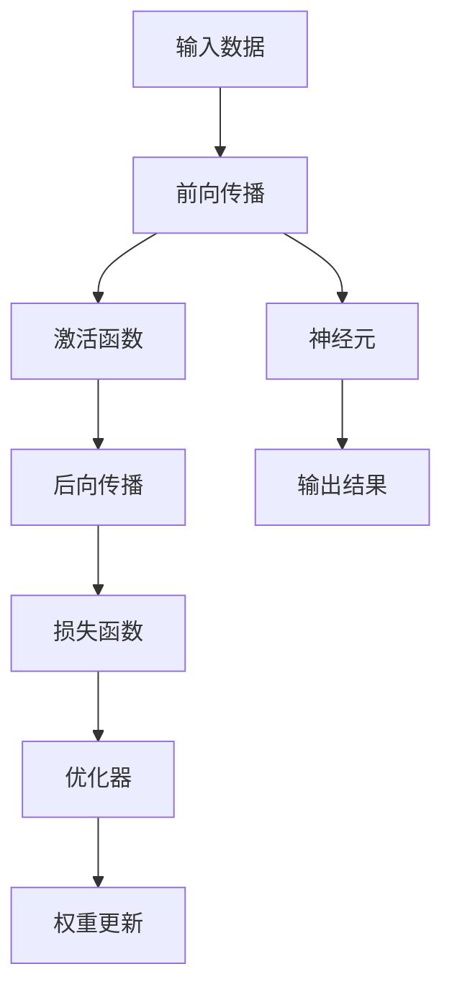
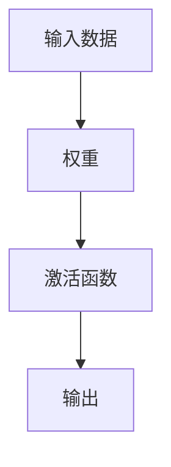

                 

# 神经网络：人类与机器的共存

在人工智能(AI)的征程中，神经网络(Neural Networks)无疑是一个关键里程碑。它不仅推动了机器学习、计算机视觉、自然语言处理等领域的突破，更深刻地影响了人类社会的方方面面。本文章旨在探讨神经网络的起源、核心原理、实际应用，以及其在人类与机器共存中的未来展望。

## 1. 背景介绍

### 1.1 神经网络的起源

神经网络的灵感来自于人类大脑的神经元网络。1943年，物理学家麦卡洛克和皮茨提出了神经元的生物模型，为后来的神经网络理论奠定了基础。1950年，阿兰·图灵在《计算机器与智能》一文中提出了著名的“图灵测试”，预见到了机器智能的可能性。1962年，罗森布拉特推出了“感知机”，这是第一台真正的神经网络模型，为后续的深度学习发展奠定了基石。

20世纪80年代，BP神经网络被提出，它通过反向传播算法训练模型，使神经网络在模式识别、图像处理等任务上取得了突破。到了21世纪，随着GPU计算能力的提升和大量标注数据的积累，深度学习时代的到来推动了神经网络的大规模应用。

### 1.2 神经网络的现状

当下，神经网络在图像分类、目标检测、语音识别、自然语言处理等领域已广泛应用。以深度学习为核心的技术突破，使得神经网络在诸多任务上取得了超越人类专家的表现。同时，神经网络技术的快速发展也引起了社会对AI伦理、安全、就业等问题的新一轮讨论。

### 1.3 神经网络的发展趋势

未来，神经网络将在自监督学习、联邦学习、增量学习、多模态学习等方面持续演进，进一步提升模型的泛化能力和智能化水平。

## 2. 核心概念与联系

### 2.1 核心概念概述

为更好地理解神经网络的原理和应用，本节将介绍几个关键概念：

- 神经元(Neuron)：神经网络的基本单元，接收输入、进行加权计算，并通过激活函数输出结果。
- 激活函数(Activation Function)：将神经元的加权输出映射到一定范围内，常用的包括ReLU、Sigmoid等。
- 前向传播(Forward Propagation)：从输入到输出的数据流动过程。每个神经元将前一层的输出作为输入，计算并传递到下一层。
- 反向传播(Backpropagation)：根据输出误差调整网络权重，实现对模型参数的训练。
- 损失函数(Loss Function)：度量模型预测与真实标签之间的差异，常用的包括均方误差、交叉熵等。
- 优化器(Optimizer)：根据损失函数的梯度更新模型参数，常用的包括SGD、Adam等。
- 卷积神经网络(CNN)：用于处理图像和视频等二维结构数据，通过卷积和池化操作提取局部特征。
- 循环神经网络(RNN)：用于处理序列数据，通过记忆单元捕获时间依赖关系。
- 长短期记忆网络(LSTM)：RNN的改进版，通过门控机制避免梯度消失问题，更适用于长序列数据。
- 自注意力机制(Self-Attention)：通过计算输入序列中不同位置的相互依赖，实现高效的信息编码和解码。

这些概念共同构成了神经网络的核心框架，使其能够通过复杂的非线性变换学习抽象的特征表示，进而实现高维数据的建模与预测。

### 2.2 核心概念联系的Mermaid流程图



这个流程图展示了神经网络数据流的基本流程：输入数据经过前向传播、激活函数、神经元等操作，最终输出结果。通过反向传播、损失函数和优化器，模型参数得以调整，实现对新数据的适应。

## 3. 核心算法原理 & 具体操作步骤

### 3.1 算法原理概述

神经网络通过构建多层次的计算单元，实现从输入到输出的映射。每个计算单元接收来自前一层的输入，进行加权计算并引入非线性变换，最终传递给下一层。这一过程中，通过反向传播算法不断调整权重，使得模型在训练数据上的预测误差最小化，从而学习到高质量的特征表示。

### 3.2 算法步骤详解

神经网络的训练过程主要包括以下几个步骤：

**Step 1: 数据准备**
- 收集训练数据集和测试数据集，并进行预处理，如归一化、数据增强等。
- 将数据集划分为训练集、验证集和测试集，通常训练集用于模型训练，验证集用于调整超参数，测试集用于评估模型性能。

**Step 2: 模型搭建**
- 选择合适的神经网络结构，如卷积神经网络、循环神经网络等。
- 定义网络的层数、每层节点数、激活函数、损失函数和优化器等。
- 搭建数据流图，连接各层节点，定义数据流动关系。

**Step 3: 模型训练**
- 使用训练集对模型进行前向传播和反向传播，计算损失函数。
- 根据损失函数的梯度，使用优化器调整模型参数。
- 周期性在验证集上评估模型性能，根据验证集的表现调整学习率、批次大小等超参数。
- 重复上述步骤直至模型收敛或达到预设的迭代轮数。

**Step 4: 模型评估与部署**
- 在测试集上评估模型性能，如准确率、召回率、F1-score等指标。
- 使用评估后的模型进行推理预测，将模型部署到实际应用系统中。
- 持续收集新数据，定期重新训练模型以保持性能。

### 3.3 算法优缺点

神经网络具有以下优点：

- 强大的特征提取能力：通过多层非线性变换，能够学习复杂的特征表示，提升模型性能。
- 自动化的参数学习：通过反向传播算法，模型能够自动调整权重，学习最优的参数设置。
- 良好的泛化能力：经过充分的训练，神经网络能够适应新数据，泛化能力强。
- 广泛的适用性：神经网络不仅适用于图像、语音、文本等传统领域，还适用于自然语言生成、决策制定等新兴任务。

同时，神经网络也存在一些缺点：

- 参数量大：神经网络的参数规模通常以百万计，训练和推理需要较高的计算资源。
- 过拟合风险：在大规模数据集上训练时，存在过拟合的风险，模型性能可能受到数据分布的影响。
- 黑盒特性：神经网络的学习过程不透明，难以解释其内部决策逻辑。
- 依赖大量标注数据：训练神经网络需要大量的标注数据，数据获取成本较高。

### 3.4 算法应用领域

神经网络在多个领域得到了广泛应用：

- 计算机视觉：用于图像分类、目标检测、图像生成等任务，取得了超越人类专家的表现。
- 自然语言处理：用于文本分类、机器翻译、语言生成等任务，推动了机器理解自然语言的能力。
- 语音识别：用于语音转写、语音合成、情感识别等任务，提升了人类与机器交互的自然性。
- 游戏AI：用于游戏策略、路径规划、角色控制等任务，提升了电子游戏的智能化水平。
- 医疗诊断：用于疾病诊断、影像分析、药物研发等任务，辅助医疗专家提升诊断效率。
- 金融预测：用于股票预测、信用评估、风险控制等任务，增强了金融机构的决策能力。

此外，神经网络还在自动驾驶、智能制造、智能家居等领域得到了广泛应用，推动了各行各业的数字化转型。

## 4. 数学模型和公式 & 详细讲解 & 举例说明

### 4.1 数学模型构建

神经网络可以被视为一个非线性变换的计算图，其输入为 $x$，输出为 $y$。一般表示为 $y = f_\theta(x)$，其中 $f_\theta$ 为神经网络的参数化函数，$\theta$ 为模型参数。

神经网络的训练目标是最小化模型在训练数据上的预测误差，即最小化损失函数：

$$
\min_\theta \mathcal{L}(\theta) = \frac{1}{N} \sum_{i=1}^N \ell(y_i, \hat{y}_i)
$$

其中 $N$ 为训练样本数，$\ell$ 为损失函数，$y_i$ 为真实标签，$\hat{y}_i$ 为模型预测值。

### 4.2 公式推导过程

以单层神经网络为例，假设输入为 $x$，节点数为 $n$，激活函数为 $f$。网络结构如图：



模型的前向传播过程为：

$$
z_i = \sum_{j=1}^n w_{ij}x_j + b_i, \quad i=1,\cdots,n
$$

其中 $z_i$ 为第 $i$ 个神经元的加权输入，$w_{ij}$ 为权重，$b_i$ 为偏置，$x_j$ 为输入数据的第 $j$ 个特征。

激活函数引入非线性变换，将加权输入映射到输出 $y_i$：

$$
y_i = f(z_i)
$$

模型的输出为所有神经元的线性组合：

$$
y = [y_1,\cdots,y_n]^T
$$

假设模型的真实标签为 $y$，则损失函数通常选择均方误差：

$$
\ell(y, \hat{y}) = \frac{1}{2}(y-\hat{y})^T(y-\hat{y})
$$

通过反向传播算法，计算每个参数的梯度，更新模型参数：

$$
\frac{\partial \mathcal{L}}{\partial w_{ij}} = \frac{\partial \mathcal{L}}{\partial z_i} \cdot \frac{\partial z_i}{\partial w_{ij}} = \frac{\partial \mathcal{L}}{\partial z_i} \cdot x_j
$$

其中 $\frac{\partial \mathcal{L}}{\partial z_i}$ 为输出误差的偏导数，可以通过链式法则逐层递归计算。

### 4.3 案例分析与讲解

以MNIST手写数字识别为例，使用单层神经网络进行训练。假设训练数据集大小为 $N$，网络包含 $n$ 个神经元。

- 数据预处理：将训练数据归一化到 $[0,1]$ 范围内。
- 模型搭建：定义单层神经网络结构，节点数为 $n$，激活函数为ReLU。
- 训练过程：随机初始化模型参数，使用交叉熵损失函数，进行反向传播算法优化。

```python
import numpy as np
import tensorflow as tf

# 数据预处理
x_train, y_train = np.loadtxt('train.csv', delimiter=',', usecols=(0, 1), unpack=True)
x_train = x_train / 255.0
y_train = tf.keras.utils.to_categorical(y_train, num_classes=10)

# 模型搭建
model = tf.keras.Sequential([
    tf.keras.layers.Dense(32, activation='relu', input_shape=(784,)),
    tf.keras.layers.Dense(10, activation='softmax')
])

# 编译模型
model.compile(optimizer='adam', loss='categorical_crossentropy', metrics=['accuracy'])

# 训练模型
model.fit(x_train, y_train, epochs=10, batch_size=64)
```

通过上述代码，可以训练出一个简单的单层神经网络，用于识别手写数字。在训练过程中，使用交叉熵损失函数和Adam优化器，调整模型参数以最小化损失函数。

## 5. 项目实践：代码实例和详细解释说明

### 5.1 开发环境搭建

进行神经网络项目实践，首先需要搭建开发环境。以下是使用Python进行TensorFlow开发的典型流程：

1. 安装Anaconda：从官网下载并安装Anaconda，用于创建独立的Python环境。

2. 创建并激活虚拟环境：
```bash
conda create -n tf-env python=3.8 
conda activate tf-env
```

3. 安装TensorFlow：根据CUDA版本，从官网获取对应的安装命令。例如：
```bash
conda install tensorflow -c pytorch -c conda-forge
```

4. 安装各类工具包：
```bash
pip install numpy pandas scikit-learn matplotlib tqdm jupyter notebook ipython
```

完成上述步骤后，即可在`tf-env`环境中开始项目实践。

### 5.2 源代码详细实现

下面我们以手写数字识别为例，给出使用TensorFlow实现神经网络的代码实现。

```python
import tensorflow as tf
from tensorflow.keras import layers, models

# 定义模型结构
model = models.Sequential([
    layers.Dense(64, activation='relu', input_shape=(784,)),
    layers.Dense(64, activation='relu'),
    layers.Dense(10, activation='softmax')
])

# 编译模型
model.compile(optimizer='adam', loss='categorical_crossentropy', metrics=['accuracy'])

# 训练模型
model.fit(x_train, y_train, epochs=10, batch_size=32, validation_split=0.2)
```

### 5.3 代码解读与分析

让我们再详细解读一下关键代码的实现细节：

- `Sequential`：使用`Sequential`定义一个线性堆叠的神经网络模型。
- `Dense`：定义全连接层，其中`input_shape`指定输入数据的维度，`activation`指定激活函数。
- `compile`：编译模型，指定优化器、损失函数和评估指标。
- `fit`：训练模型，指定训练数据集、批次大小、训练轮数和验证集比例。

在实际应用中，还需要对模型进行更多的优化和调试，如超参数调优、模型评估、模型集成等。但核心的训练流程基本与此类似。

## 6. 实际应用场景

### 6.1 计算机视觉

神经网络在计算机视觉领域的应用非常广泛，主要用于图像分类、目标检测、图像生成等任务。例如，使用卷积神经网络（CNN）对图像进行分类，识别出图像中的人、车、动物等物体。在目标检测任务中，使用区域卷积神经网络（R-CNN）等模型，能够在图像中定位出物体的具体位置。此外，生成对抗网络（GAN）可以用于图像生成、风格转换等任务。

### 6.2 自然语言处理

自然语言处理（NLP）是神经网络应用的另一大领域，主要用于文本分类、情感分析、机器翻译等任务。例如，使用循环神经网络（RNN）对文本进行情感分类，判断文本是正面、负面还是中性。在机器翻译任务中，使用编码器-解码器框架，将一种语言的文本翻译成另一种语言的文本。此外，基于自注意力机制的Transformer模型，在翻译、文本生成、问答等任务中取得了优异的性能。

### 6.3 语音识别

语音识别是神经网络在语音处理领域的应用，主要用于语音转写、语音合成等任务。例如，使用卷积神经网络（CNN）对语音信号进行特征提取，再使用循环神经网络（RNN）进行语音识别。在语音合成任务中，使用生成对抗网络（GAN）或变分自编码器（VAE）等模型，将文本转换为语音信号。

### 6.4 未来应用展望

未来，神经网络将在自监督学习、联邦学习、增量学习、多模态学习等方面持续演进，进一步提升模型的泛化能力和智能化水平。同时，神经网络还将与其他AI技术进行更深入的融合，如知识表示、因果推理、强化学习等，共同推动AI技术的进步。

## 7. 工具和资源推荐

### 7.1 学习资源推荐

为了帮助开发者系统掌握神经网络的原理和应用，这里推荐一些优质的学习资源：

1. 《深度学习》系列书籍：由Ian Goodfellow、Yoshua Bengio、Aaron Courville等大牛合著，全面介绍了深度学习的基本概念和前沿技术。
2. 《神经网络与深度学习》课程：由Andrew Ng讲授的深度学习入门课程，涵盖神经网络的基础理论和经典模型。
3. TensorFlow官方文档：TensorFlow的官方文档，提供了详细的API说明和丰富的样例代码，是深度学习实践的必备资料。
4. PyTorch官方文档：PyTorch的官方文档，提供了易用的API和高效的计算图，是深度学习开发者的首选框架。
5. Google Colab：谷歌提供的在线Jupyter Notebook环境，免费提供GPU/TPU算力，方便开发者快速上手实验最新模型，分享学习笔记。

通过对这些资源的学习实践，相信你一定能够快速掌握神经网络的精髓，并用于解决实际的AI问题。

### 7.2 开发工具推荐

高效的开发离不开优秀的工具支持。以下是几款用于神经网络开发的常用工具：

1. TensorFlow：由Google主导开发的开源深度学习框架，生产部署方便，适合大规模工程应用。
2. PyTorch：由Facebook主导开发的开源深度学习框架，灵活动态的计算图，适合快速迭代研究。
3. Keras：基于TensorFlow和Theano的高级API，易于上手，适合快速原型开发。
4. Weights & Biases：模型训练的实验跟踪工具，可以记录和可视化模型训练过程中的各项指标，方便对比和调优。
5. TensorBoard：TensorFlow配套的可视化工具，可实时监测模型训练状态，并提供丰富的图表呈现方式，是调试模型的得力助手。

合理利用这些工具，可以显著提升神经网络开发的效率，加快创新迭代的步伐。

### 7.3 相关论文推荐

神经网络领域的发展源于学界的持续研究。以下是几篇奠基性的相关论文，推荐阅读：

1. 《深度学习》论文：Hinton等人于2012年在NIPS会议上提出的深度学习框架，奠定了现代深度学习的基础。
2. 《ImageNet classification with deep convolutional neural networks》论文：Krizhevsky等人于2012年在ICML会议上提出的AlexNet模型，开创了卷积神经网络的先河。
3. 《Long Short-Term Memory》论文：Hochreiter等人于1997年在Neural Computation杂志上发表的LSTM模型，解决了传统RNN的梯度消失问题。
4. 《Attention is All You Need》论文：Vaswani等人于2017年在NIPS会议上提出的Transformer模型，突破了RNN的序列长度限制，提升了模型的效率和性能。

这些论文代表了大规模神经网络的研究脉络。通过学习这些前沿成果，可以帮助研究者把握学科前进方向，激发更多的创新灵感。

## 8. 总结：未来发展趋势与挑战

### 8.1 总结

本文对神经网络的核心原理和实际应用进行了全面系统的介绍。首先阐述了神经网络的发展历程和现状，明确了其在模式识别、图像处理、语言生成等方面的重要贡献。其次，从原理到实践，详细讲解了神经网络的训练过程和优化方法，给出了具体实现的代码实例。同时，本文还探讨了神经网络在各个领域的应用场景，展望了未来的发展方向。

通过本文的系统梳理，可以看到，神经网络作为人工智能的重要分支，不仅在技术上取得了巨大突破，还在实际应用中产生了深远影响。未来，神经网络将在自监督学习、联邦学习、增量学习、多模态学习等方面持续演进，进一步提升模型的泛化能力和智能化水平。

### 8.2 未来发展趋势

展望未来，神经网络将在自监督学习、联邦学习、增量学习、多模态学习等方面持续演进，进一步提升模型的泛化能力和智能化水平。

1. 自监督学习：利用无标签数据进行预训练，提升模型对新数据的适应能力。
2. 联邦学习：通过分布式计算，在不共享数据的前提下，提升模型性能。
3. 增量学习：不断更新模型参数，适应新数据的变化，保持模型性能。
4. 多模态学习：结合视觉、语音、文本等多模态数据，提升模型的理解能力和应用范围。

这些趋势凸显了神经网络技术的发展潜力，将在诸多领域带来革命性变化。

### 8.3 面临的挑战

尽管神经网络技术已经取得了显著成就，但在迈向更加智能化、普适化应用的过程中，仍面临诸多挑战：

1. 过拟合风险：在大规模数据集上训练时，存在过拟合的风险，模型性能可能受到数据分布的影响。
2. 黑盒特性：神经网络的学习过程不透明，难以解释其内部决策逻辑。
3. 标注成本：训练神经网络需要大量的标注数据，数据获取成本较高。
4. 计算资源：神经网络的训练和推理需要大量的计算资源，难以在普通设备上实现。

### 8.4 研究展望

未来，神经网络的研究需要在以下几个方面寻求新的突破：

1. 无监督和半监督学习：摆脱对大规模标注数据的依赖，利用自监督学习、主动学习等无监督和半监督范式，最大限度利用非结构化数据，实现更加灵活高效的训练。
2. 参数高效和计算高效的模型：开发更加参数高效的模型，在固定大部分预训练参数的情况下，只更新极少量的任务相关参数。同时优化模型的计算图，减少前向传播和反向传播的资源消耗，实现更加轻量级、实时性的部署。
3. 多模态融合与因果推理：将符号化的先验知识，如知识图谱、逻辑规则等，与神经网络模型进行巧妙融合，引导神经网络学习更准确、合理的语言模型。同时加强不同模态数据的整合，实现视觉、语音等多模态信息与文本信息的协同建模。
4. 模型可解释性和安全性：赋予神经网络更强的可解释性，如通过可视化技术展示模型的决策过程，通过因果分析方法识别模型决策的关键特征，避免模型的脆弱点，提高系统稳定性。同时确保输出的安全性，避免恶意用途，确保系统的公正性。

这些研究方向的探索，必将引领神经网络技术迈向更高的台阶，为构建安全、可靠、可解释、可控的智能系统铺平道路。

## 9. 附录：常见问题与解答

**Q1：神经网络是否只能用于图像和语音处理？**

A: 神经网络不仅可以用于图像和语音处理，还可以用于自然语言处理、信号处理、金融预测、医疗诊断等领域。不同领域的应用需求不同，选择合适的模型结构和训练方法，可以充分发挥神经网络的优势。

**Q2：神经网络是否需要大规模的标注数据？**

A: 神经网络通常需要大量的标注数据进行训练，但也可以通过预训练和微调等方式，在大规模无标签数据上学习通用知识，在少量标注数据上快速适应新任务。此外，一些自监督学习、半监督学习的方法，可以在少量标注数据下提升模型性能。

**Q3：神经网络是否容易过拟合？**

A: 神经网络在训练过程中存在过拟合的风险，尤其是在训练数据较少的情况下。可以通过数据增强、正则化、早停等方法缓解过拟合问题。同时，使用参数高效的模型，减少过拟合风险。

**Q4：神经网络是否容易解释？**

A: 神经网络的内部决策过程难以解释，被称为"黑盒"模型。但可以通过可视化技术、简化模型结构等方式，提高神经网络的透明性和可解释性。同时，一些解释模型的方法，如LIME、SHAP等，也可以帮助理解神经网络的决策过程。

**Q5：神经网络是否容易部署？**

A: 神经网络在部署时通常需要较大的计算资源，但通过参数剪枝、量化、模型压缩等技术，可以在不牺牲性能的前提下，减小模型大小，提升部署效率。同时，使用高效的计算框架，如TensorFlow、PyTorch等，可以加快模型的推理速度，优化资源使用。

---

作者：禅与计算机程序设计艺术 / Zen and the Art of Computer Programming

