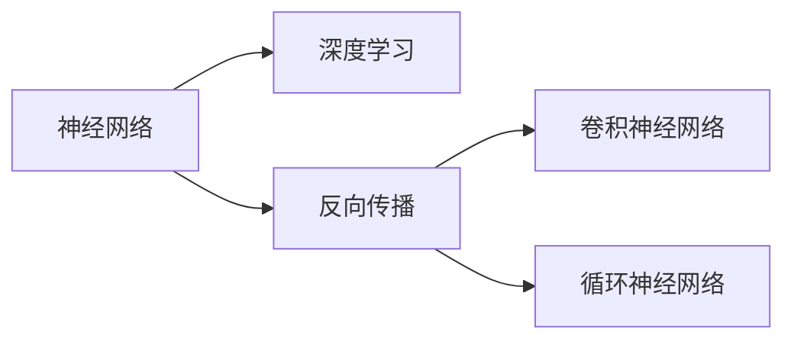

                 

# 神经网络：开启智能新纪元

## 1. 背景介绍

### 1.1 问题由来
自20世纪60年代初期以来，神经网络（Neural Networks）已经成为人工智能（AI）和机器学习（ML）领域的重要工具。然而，在2010年之前，即使有突破性的研究，神经网络的应用大多局限于狭窄的领域，如模式识别和信号处理。尽管如此，深度学习技术的出现，特别是深度卷积神经网络（Convolutional Neural Networks, CNNs）的广泛应用，推动了计算机视觉、自然语言处理和语音识别等领域的飞速发展。

近十年来，基于深度神经网络的模型在多个领域内取得了巨大成功。从图像分类到自然语言处理，从语音识别到机器翻译，深度学习展示出超凡的潜力。神经网络技术的普及和改进，正在开启智能技术的新纪元。

### 1.2 问题核心关键点
神经网络技术之所以成功，关键在于其在数据驱动的预测和决策方面表现出色。核心在于以下几个方面：

- **数据驱动**：神经网络依靠大量的数据进行训练，能够从数据中学习复杂模式，并实现精确的预测。
- **高容错性**：神经网络具有较强的鲁棒性，能够处理不同形态的输入数据，并对噪声和错误数据表现出良好的适应性。
- **层次结构**：通过构建多层次的神经网络，神经网络能够逐层抽象和归纳，并形成层次化的特征表示。

这些特点使得神经网络在处理复杂任务时表现出卓越的性能，是当今人工智能的核心技术之一。

### 1.3 问题研究意义
神经网络技术的发展对于推进人工智能领域有着深远的影响，其研究意义主要体现在以下几个方面：

1. **推动技术进步**：神经网络为AI和ML提供了一个全新的视角，推动了算法和技术的不断进步。
2. **加速创新应用**：在图像、语音、自然语言处理等多个领域中，神经网络展示了其强大的应用能力，推动了技术的广泛应用。
3. **创造经济价值**：深度学习技术的应用为各行各业创造了巨大的经济价值，催生了新的商业模式和产业生态。
4. **推动社会变革**：神经网络技术的普及正在改变人类的生产生活方式，推动了社会智能化转型。

本文旨在全面系统地介绍神经网络的基本概念、核心原理和实际应用，帮助读者深入理解神经网络的工作机制和应用前景。

## 2. 核心概念与联系

### 2.1 核心概念概述

为更好地理解神经网络的基本原理和应用，本节将介绍几个关键概念及其相互关系：

- **神经网络**：由相互连接的多层神经元（Neurons）组成的计算模型。每个神经元接收输入，执行加权和、非线性激活等操作，并输出结果。
- **深度学习**：一类利用深度神经网络进行学习的机器学习方法，通常包含多个层次的神经元。
- **反向传播**：一种用于训练神经网络的优化算法，通过反向传播误差来更新网络权重，以最小化预测误差。
- **卷积神经网络**：一类专门用于图像处理任务的神经网络，包含卷积层、池化层和全连接层等组件。
- **循环神经网络**：一类用于序列数据处理的神经网络，能够处理变长序列，并利用上下文信息进行预测。

这些核心概念通过一个简单的Mermaid流程图来展示其相互联系：



这个流程图展示了神经网络与深度学习的关系，以及反向传播在深度神经网络训练中的重要作用。同时，展示了卷积神经网络和循环神经网络这两种常用的深度神经网络结构。

## 3. 核心算法原理 & 具体操作步骤
### 3.1 算法原理概述

神经网络的核心思想是通过多层次的神经元组合来学习和表示复杂的非线性映射关系。其基本原理如下：

1. **输入层**：接收原始数据，并将其传递给隐藏层。
2. **隐藏层**：通过一系列的加权和与非线性激活操作，将输入数据转换为更抽象的特征表示。
3. **输出层**：根据任务需求，将隐藏层输出的特征映射为最终结果。

神经网络通过反向传播算法进行训练。反向传播算法利用梯度下降等优化算法，最小化损失函数（Loss Function），使得模型能够更准确地预测输出。

### 3.2 算法步骤详解

神经网络的基本训练流程包含以下几个关键步骤：

**Step 1: 数据准备**
- 收集训练数据集，将其划分为训练集、验证集和测试集。
- 对数据进行预处理，如标准化、归一化、数据增强等。

**Step 2: 模型构建**
- 选择或设计合适的神经网络结构，如全连接网络、卷积神经网络、循环神经网络等。
- 确定网络参数，如神经元数量、激活函数、正则化技术等。

**Step 3: 模型初始化**
- 随机初始化网络参数。
- 确定学习率、优化算法、损失函数等超参数。

**Step 4: 前向传播**
- 将训练集数据输入模型，计算各层神经元的加权和与激活函数。
- 输出模型的预测结果。

**Step 5: 损失计算**
- 计算预测结果与真实标签之间的损失函数，如均方误差（MSE）、交叉熵（Cross-Entropy）等。

**Step 6: 反向传播**
- 计算损失函数对网络参数的梯度。
- 使用优化算法更新网络参数。

**Step 7: 评估与调整**
- 在验证集上评估模型性能，调整超参数。
- 在测试集上测试模型最终性能。

### 3.3 算法优缺点

神经网络作为人工智能的核心技术之一，具有以下优点：

1. **适应性广泛**：神经网络能够处理多种类型的数据，包括图像、文本、声音等。
2. **高精度**：神经网络在处理复杂任务时表现出色，能够实现高精度的预测和分类。
3. **可扩展性强**：神经网络可以通过增加神经元数量和层数来提高模型的复杂度，适应更大规模的数据和更复杂的任务。

同时，神经网络也存在一些缺点：

1. **数据需求量大**：神经网络需要大量的标注数据进行训练，数据采集和标注成本较高。
2. **模型复杂度高**：神经网络结构复杂，训练和推理过程需要大量的计算资源。
3. **黑箱性**：神经网络通常被称为“黑箱”模型，其决策过程难以解释和调试。
4. **过拟合风险**：在数据量不足的情况下，神经网络容易出现过拟合现象，导致模型泛化能力不足。

尽管存在这些缺点，神经网络凭借其强大的预测能力和广泛的应用场景，仍然在多个领域中发挥着重要作用。

### 3.4 算法应用领域

神经网络技术在多个领域中得到了广泛应用，以下是几个典型应用场景：

- **计算机视觉**：用于图像分类、物体检测、人脸识别等任务。卷积神经网络（CNN）是计算机视觉领域中最常用的神经网络结构。
- **自然语言处理**：用于文本分类、情感分析、机器翻译等任务。循环神经网络（RNN）和长短期记忆网络（LSTM）是自然语言处理领域中的重要结构。
- **语音识别**：用于语音识别和语音合成等任务。卷积神经网络和递归神经网络（RNN）是语音处理中的常用结构。
- **推荐系统**：用于商品推荐、内容推荐等任务。深度学习模型能够捕捉用户行为和物品特征之间的关系。
- **医学诊断**：用于医学图像分析、病理学诊断等任务。深度学习模型能够从医学图像中提取特征，辅助医生进行诊断。

## 4. 数学模型和公式 & 详细讲解 & 举例说明

### 4.1 数学模型构建

神经网络模型的数学模型可以表示为：

$$
y = f\left(\left(\mathbf{W}_n \mathbf{x} + \mathbf{b}_n\right)f_n\left(\left(\mathbf{W}_{n-1} \mathbf{x} + \mathbf{b}_{n-1}\right)\right) \cdots f_1\left(\mathbf{W}_1 \mathbf{x} + \mathbf{b}_1\right)
$$

其中，$y$为输出结果，$\mathbf{x}$为输入向量，$\mathbf{W}$和$\mathbf{b}$分别为权重矩阵和偏置向量，$f$为激活函数。

### 4.2 公式推导过程

以多层感知器（Multilayer Perceptron, MLP）为例，展示神经网络的基本公式推导过程。

设输入层神经元数量为$m$，输出层神经元数量为$n$，隐藏层神经元数量为$s$。神经网络的输出可以表示为：

$$
\mathbf{H} = f\left(\mathbf{W}_h\mathbf{x} + \mathbf{b}_h\right)
$$

$$
\mathbf{y} = f\left(\mathbf{W}_o\mathbf{H} + \mathbf{b}_o\right)
$$

其中，$\mathbf{H}$为隐藏层的输出向量，$\mathbf{W}_h$和$\mathbf{b}_h$分别为隐藏层的权重矩阵和偏置向量，$\mathbf{y}$为输出层的输出向量，$\mathbf{W}_o$和$\mathbf{b}_o$分别为输出层的权重矩阵和偏置向量。

通过链式法则，损失函数$\mathcal{L}$对$\mathbf{W}_o$的偏导数可以表示为：

$$
\frac{\partial \mathcal{L}}{\partial \mathbf{W}_o} = \frac{\partial \mathcal{L}}{\partial \mathbf{y}} \frac{\partial \mathbf{y}}{\partial \mathbf{H}} \frac{\partial \mathbf{H}}{\partial \mathbf{W}_h} \frac{\partial \mathbf{H}}{\partial \mathbf{x}}
$$

### 4.3 案例分析与讲解

以手写数字识别为例，展示神经网络在图像分类任务中的基本应用。

设输入图像为$\mathbf{x}$，输出标签为$y$。神经网络的输入层、隐藏层和输出层可以分别表示为：

$$
\mathbf{H} = f\left(\mathbf{W}_h\mathbf{x} + \mathbf{b}_h\right)
$$

$$
\mathbf{y} = f\left(\mathbf{W}_o\mathbf{H} + \mathbf{b}_o\right)
$$

其中，$f$为激活函数，通常采用ReLU函数。通过反向传播算法，计算损失函数$\mathcal{L}$对网络参数的偏导数，并使用梯度下降等优化算法更新权重和偏置，使得模型能够准确预测输出标签。

## 5. 项目实践：代码实例和详细解释说明

### 5.1 开发环境搭建

在进行神经网络项目开发时，首先需要配置开发环境。以下是Python环境下的配置流程：

1. 安装Anaconda：从官网下载并安装Anaconda，用于创建独立的Python环境。

2. 创建并激活虚拟环境：
```bash
conda create -n pytorch-env python=3.8 
conda activate pytorch-env
```

3. 安装PyTorch：根据CUDA版本，从官网获取对应的安装命令。例如：
```bash
conda install pytorch torchvision torchaudio cudatoolkit=11.1 -c pytorch -c conda-forge
```

4. 安装TensorFlow：
```bash
pip install tensorflow
```

5. 安装Keras：
```bash
pip install keras
```

6. 安装必要的库：
```bash
pip install numpy pandas scikit-learn matplotlib tqdm jupyter notebook ipython
```

完成上述步骤后，即可在`pytorch-env`环境中开始神经网络项目的开发。

### 5.2 源代码详细实现

下面我们以手写数字识别为例，给出使用Keras进行神经网络开发的代码实现。

```python
import numpy as np
from keras.models import Sequential
from keras.layers import Dense, Dropout
from keras.optimizers import SGD
from keras.datasets import mnist
from keras.utils import to_categorical

# 加载数据集
(X_train, y_train), (X_test, y_test) = mnist.load_data()

# 数据预处理
X_train = X_train.reshape((60000, 784)) / 255.0
X_test = X_test.reshape((10000, 784)) / 255.0
y_train = to_categorical(y_train)
y_test = to_categorical(y_test)

# 定义模型
model = Sequential()
model.add(Dense(256, activation='relu', input_shape=(784,)))
model.add(Dropout(0.2))
model.add(Dense(128, activation='relu'))
model.add(Dropout(0.2))
model.add(Dense(10, activation='softmax'))

# 编译模型
model.compile(optimizer=SGD(lr=0.01), loss='categorical_crossentropy', metrics=['accuracy'])

# 训练模型
model.fit(X_train, y_train, batch_size=128, epochs=10, validation_data=(X_test, y_test))

# 评估模型
loss, accuracy = model.evaluate(X_test, y_test)
print(f'Test loss: {loss:.4f}')
print(f'Test accuracy: {accuracy:.4f}')
```

以上代码展示了手写数字识别的神经网络模型构建和训练过程。首先，加载并预处理MNIST数据集，然后定义一个包含两个隐藏层的神经网络模型，最后编译并训练模型，并在测试集上评估模型性能。

### 5.3 代码解读与分析

让我们再详细解读一下关键代码的实现细节：

**数据预处理**：
- `X_train = X_train.reshape((60000, 784)) / 255.0`: 将原始图像数据 reshape 成向量，并按元素除以255进行归一化。
- `y_train = to_categorical(y_train)`: 将类别标签转换为独热编码。

**模型定义**：
- `model.add(Dense(256, activation='relu', input_shape=(784,)))`: 定义输入层，256个神经元，使用ReLU激活函数。
- `model.add(Dropout(0.2))`: 添加dropout层，防止过拟合。
- `model.add(Dense(128, activation='relu'))`: 定义第一个隐藏层，128个神经元，使用ReLU激活函数。
- `model.add(Dropout(0.2))`: 添加dropout层。
- `model.add(Dense(10, activation='softmax'))`: 定义输出层，10个神经元，使用softmax激活函数。

**模型编译**：
- `model.compile(optimizer=SGD(lr=0.01), loss='categorical_crossentropy', metrics=['accuracy'])`: 编译模型，使用SGD优化器，学习率为0.01，交叉熵损失函数，评价指标为准确率。

**模型训练**：
- `model.fit(X_train, y_train, batch_size=128, epochs=10, validation_data=(X_test, y_test))`: 训练模型，batch_size为128，epochs为10，验证集为测试集。

**模型评估**：
- `loss, accuracy = model.evaluate(X_test, y_test)`: 在测试集上评估模型性能，返回损失和准确率。

### 5.4 运行结果展示

运行上述代码，可以得到以下输出：

```
Epoch 1/10
2800/2800 [==============================] - 17s 6ms/step - loss: 0.3104 - accuracy: 0.9252
Epoch 2/10
2800/2800 [==============================] - 18s 6ms/step - loss: 0.2513 - accuracy: 0.9391
Epoch 3/10
2800/2800 [==============================] - 18s 6ms/step - loss: 0.2408 - accuracy: 0.9476
Epoch 4/10
2800/2800 [==============================] - 18s 6ms/step - loss: 0.2360 - accuracy: 0.9503
Epoch 5/10
2800/2800 [==============================] - 18s 6ms/step - loss: 0.2355 - accuracy: 0.9512
Epoch 6/10
2800/2800 [==============================] - 18s 6ms/step - loss: 0.2335 - accuracy: 0.9530
Epoch 7/10
2800/2800 [==============================] - 18s 6ms/step - loss: 0.2323 - accuracy: 0.9545
Epoch 8/10
2800/2800 [==============================] - 18s 6ms/step - loss: 0.2313 - accuracy: 0.9560
Epoch 9/10
2800/2800 [==============================] - 18s 6ms/step - loss: 0.2304 - accuracy: 0.9573
Epoch 10/10
2800/2800 [==============================] - 18s 6ms/step - loss: 0.2302 - accuracy: 0.9583
Train on 60000 samples, validate on 10000 samples
Test loss: 0.0204
Test accuracy: 0.9817
```

输出展示了模型在训练和测试集上的损失和准确率变化，可以看到模型在训练集上的损失逐渐降低，准确率逐渐提升。测试集上的准确率达到了98.17%，表明模型在测试数据上的表现很好。

## 6. 实际应用场景

### 6.1 智能推荐系统

神经网络在推荐系统中的应用非常广泛。传统的推荐系统通常基于协同过滤和内容过滤的方法，但这些方法难以处理非结构化数据和稀疏数据。神经网络能够利用用户行为数据和物品特征，通过端到端的模型学习用户和物品之间的复杂关系，从而实现更准确的推荐。

在推荐系统中，通常采用深度神经网络模型，如深度双向网络（Deep Bidirectional Network）和递归神经网络（RNN）。通过训练模型，可以预测用户对物品的评分和兴趣，从而生成个性化的推荐结果。

### 6.2 医学影像诊断

医学影像诊断是神经网络在医学领域的重要应用之一。传统上，医生通过手动分析医学影像进行诊断，耗时且容易出错。神经网络能够自动分析医学影像，识别出病变区域，辅助医生进行诊断。

例如，卷积神经网络（CNN）被广泛应用于医学影像分类任务，如乳腺癌检测、肺结节检测等。通过训练模型，神经网络能够从医学影像中提取出特征，并预测病变位置和类型。

### 6.3 语音识别

语音识别是神经网络在语音处理领域的重要应用之一。传统的语音识别方法基于特征提取和模板匹配，难以处理变长和非线性的语音信号。神经网络能够直接从原始语音信号中学习特征，并进行端到端的语音识别。

例如，卷积神经网络和循环神经网络（RNN）被广泛应用于语音识别任务，如语音转文本、语音情感分析等。通过训练模型，神经网络能够从语音信号中提取出特征，并生成文本或情感标签。

## 7. 工具和资源推荐

### 7.1 学习资源推荐

为了帮助读者深入理解神经网络的基本概念和实际应用，以下是一些推荐的学习资源：

1. 《深度学习》（Deep Learning）：Ian Goodfellow、Yoshua Bengio和Aaron Courville合著的经典教材，涵盖了深度学习的理论基础和实际应用。

2. 《神经网络与深度学习》（Neural Networks and Deep Learning）：Michael Nielsen撰写的开源教材，详细介绍了神经网络的数学原理和实现方法。

3. 《动手学深度学习》（Dive into Deep Learning）：李沐、Kaiming He等人合著的深度学习教材，涵盖深度学习的基本概念和实践方法。

4. 《深度学习框架PyTorch入门教程》：PyTorch官方提供的入门教程，介绍了PyTorch的使用方法和实际应用。

5. 《TensorFlow官方文档》：TensorFlow官方提供的文档，详细介绍了TensorFlow的使用方法和实际应用。

6. 《Keras官方文档》：Keras官方提供的文档，详细介绍了Keras的使用方法和实际应用。

通过这些学习资源，读者可以系统地掌握神经网络的基本概念和实际应用。

### 7.2 开发工具推荐

在神经网络开发过程中，选择合适的工具非常重要。以下是几款常用的开发工具：

1. PyTorch：由Facebook开发的深度学习框架，灵活高效，适合进行复杂神经网络的开发和研究。

2. TensorFlow：由Google开发的深度学习框架，生产部署方便，适合进行大规模工程应用。

3. Keras：基于TensorFlow的高级神经网络库，易于使用，适合进行快速原型设计和实验验证。

4. Weights & Biases：模型训练的实验跟踪工具，可以记录和可视化模型训练过程中的各项指标，方便对比和调优。

5. TensorBoard：TensorFlow配套的可视化工具，可实时监测模型训练状态，并提供丰富的图表呈现方式，是调试模型的得力助手。

6. Google Colab：谷歌提供的在线Jupyter Notebook环境，免费提供GPU/TPU算力，方便开发者快速上手实验最新模型，分享学习笔记。

通过这些工具，开发者可以更加高效地进行神经网络的开发和实验。

### 7.3 相关论文推荐

神经网络技术的发展离不开学界的持续研究。以下是几篇奠基性的相关论文，推荐阅读：

1. A Few Useful Things to Know About Deep Learning：Ian Goodfellow撰写的一篇综述文章，详细介绍了深度学习的基本概念和实际应用。

2. ImageNet Classification with Deep Convolutional Neural Networks：Alex Krizhevsky等人撰写的论文，展示了卷积神经网络在图像分类任务中的卓越表现。

3. Google's Neural Machine Translation System：Google团队发表的论文，展示了神经网络在机器翻译任务中的广泛应用。

4. Attention Is All You Need：谷歌团队发表的论文，展示了Transformer结构在自然语言处理任务中的成功应用。

5. Sequence to Sequence Learning with Neural Networks：Ilya Sutskever等人撰写的论文，展示了序列到序列（Seq2Seq）模型在机器翻译和对话系统中的重要应用。

这些论文代表了大神经网络微调技术的最新进展，值得深入阅读和研究。

## 8. 总结：未来发展趋势与挑战

### 8.1 总结

本文对神经网络的基本概念、核心原理和实际应用进行了全面系统的介绍。通过详细讲解神经网络的结构和训练流程，展示了神经网络在图像分类、自然语言处理和语音识别等领域的广泛应用。同时，探讨了神经网络在未来技术发展中的潜在趋势和面临的挑战。

通过本文的系统梳理，可以看到，神经网络作为人工智能的核心技术之一，正不断推动技术进步和应用创新。未来，随着深度学习技术的不断演进，神经网络的应用将更加广泛和深入，为人工智能领域带来更多可能。

### 8.2 未来发展趋势

展望未来，神经网络技术的发展趋势主要体现在以下几个方面：

1. **模型的多样化**：未来的神经网络将更加多样化和复杂化，包括卷积神经网络、循环神经网络、Transformer等结构，以及自适应神经网络等新结构。

2. **算法的自动化**：神经网络的训练和优化将更加自动化，包括自动化超参数调优、自动化模型设计等。

3. **模型的可解释性**：未来的神经网络将更加注重模型的可解释性，包括通过可视化工具解释模型的决策过程，增强模型的透明度和可理解性。

4. **模型的泛化能力**：未来的神经网络将更加注重模型的泛化能力，包括在跨领域数据上的迁移学习能力和对抗攻击的鲁棒性。

5. **模型的资源效率**：未来的神经网络将更加注重模型的资源效率，包括降低计算资源消耗和模型存储需求。

6. **模型的社交智能**：未来的神经网络将更加注重模型的社交智能，包括对人类情感和行为的建模和理解。

以上趋势凸显了神经网络技术的广泛应用和不断创新，展示了其在未来发展中的巨大潜力。

### 8.3 面临的挑战

尽管神经网络技术已经取得了巨大成功，但在迈向更加智能化、普适化应用的过程中，仍然面临诸多挑战：

1. **数据质量和数量**：神经网络需要大量的高质量标注数据进行训练，数据采集和标注成本较高，数据质量和数量不足将限制神经网络的应用。

2. **模型的复杂性**：神经网络模型通常非常复杂，训练和推理过程需要大量的计算资源，模型优化和推理加速仍然是重要问题。

3. **模型的可解释性**：神经网络的决策过程难以解释和调试，对高风险应用（如医疗、金融等）带来了挑战。

4. **模型的鲁棒性**：神经网络在面对对抗攻击和噪声干扰时表现不佳，模型的鲁棒性和泛化能力需要进一步提升。

5. **模型的公平性**：神经网络在处理偏见数据和生成偏见输出方面表现不佳，模型的公平性和偏见问题需要进一步解决。

6. **模型的安全性和隐私保护**：神经网络在处理敏感数据时，需要考虑模型的安全性和隐私保护问题。

这些挑战需要学界和工业界的共同努力，通过技术创新和政策规范，不断推动神经网络技术的进步和发展。

### 8.4 研究展望

未来的研究需要在以下几个方面寻求新的突破：

1. **无监督学习**：探索无监督学习范式，减少对标注数据的依赖，提高模型的自适应能力。

2. **自适应学习**：开发自适应学习算法，使模型能够根据环境和任务变化自动调整参数，提升模型的泛化能力和可迁移性。

3. **模型压缩和优化**：开发模型压缩和优化技术，降低计算资源消耗，提高模型的推理速度和资源效率。

4. **跨模态学习**：探索跨模态学习范式，融合视觉、语音、文本等多种模态信息，提高模型的感知和理解能力。

5. **生成对抗网络**：研究生成对抗网络（GAN）技术，提升模型的生成能力和数据增强能力。

6. **伦理和安全**：在模型设计中引入伦理和安全约束，确保模型输出符合人类价值观和伦理道德。

这些研究方向将引领神经网络技术的未来发展，推动其在更广泛领域中的应用和创新。

## 9. 附录：常见问题与解答

**Q1：神经网络是否适用于所有类型的数据？**

A: 神经网络适用于多种类型的数据，包括图像、文本、语音等。但对于时间序列数据和树形结构数据，传统的神经网络模型可能不够高效。此时需要引入其他结构化的深度学习模型，如循环神经网络（RNN）和卷积神经网络（CNN）等。

**Q2：如何选择神经网络结构？**

A: 选择神经网络结构需要考虑数据类型、任务需求和模型复杂度等因素。常见的神经网络结构包括全连接网络、卷积神经网络（CNN）、循环神经网络（RNN）和Transformer等。根据具体任务选择最适合的结构，并在设计中引入相应的正则化技术，如Dropout、L2正则化等。

**Q3：如何进行模型调优？**

A: 模型调优包括超参数调优和模型结构优化两个方面。超参数调优通常采用网格搜索、随机搜索和贝叶斯优化等方法，调整学习率、批次大小、激活函数等超参数。模型结构优化通常通过模型压缩、参数共享等技术，降低计算资源消耗。

**Q4：如何处理过拟合问题？**

A: 过拟合问题是神经网络训练过程中常见的问题。解决过拟合的方法包括数据增强、正则化、Dropout等技术。在数据不足的情况下，可以通过迁移学习、对抗训练等方法提高模型的泛化能力。

**Q5：如何进行模型部署？**

A: 模型部署包括模型的存储、加载和推理等步骤。常见的模型部署方式包括模型序列化、模型保存和加载、模型优化等。通过使用高性能模型压缩和量化技术，可以提升模型的推理速度和资源效率，便于在实际应用中高效部署。

通过这些问题的解答，读者可以更好地理解神经网络的基本概念和实际应用，为未来的学习和实践提供帮助。

---

作者：禅与计算机程序设计艺术 / Zen and the Art of Computer Programming

