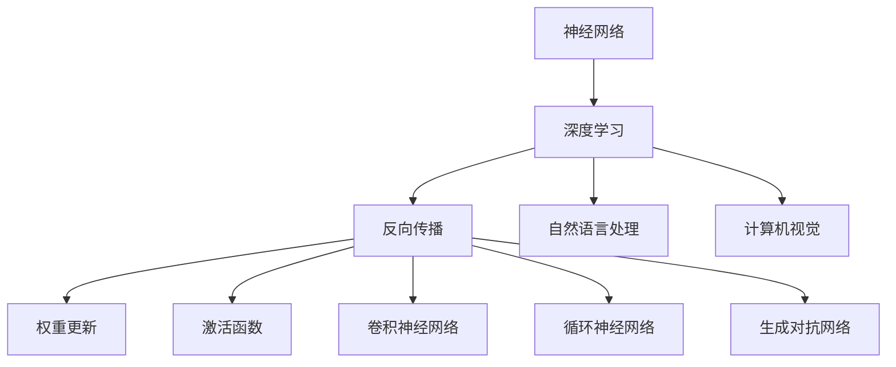

                 

# 神经网络：探索未知的领域

> 关键词：神经网络,深度学习,反向传播,权重更新,激活函数,卷积神经网络(CNN),循环神经网络(RNN),生成对抗网络(GAN),自然语言处理(NLP),计算机视觉(CV)

## 1. 背景介绍

### 1.1 问题由来

自20世纪80年代以来，人工智能(AI)的研究一直是计算机科学领域的焦点之一。特别是在深度学习(DL)领域，经过几十年的发展，研究人员已经成功构建了复杂的神经网络模型，能够处理诸如图像识别、语音识别、自然语言处理、推荐系统等各种复杂的任务。

当前，神经网络技术已经成为各种应用程序中不可或缺的组件。然而，尽管神经网络在实际应用中取得了巨大的成功，但它们的工作原理和核心机制仍然是一个谜。理解神经网络是如何进行学习、推理和决策的过程，对未来的AI研究具有重要意义。

### 1.2 问题核心关键点

神经网络的核心机制是通过反向传播(Backpropagation)算法，利用链式法则和梯度下降法，不断调整网络参数，以最小化损失函数(Loss Function)。神经网络的学习过程可以看作是对输入数据进行前向传播(Forward Propagation)，得到输出结果，然后计算输出与真实标签之间的误差，反向传播误差，更新网络权重(Weight)和偏置(Bias)的过程。

神经网络的训练过程包括两个主要阶段：前向传播和反向传播。前向传播是从输入层到输出层的计算过程，反向传播是从输出层到输入层的参数更新过程。这一过程通过不断迭代，优化网络权重和偏置，使得神经网络在训练数据集上达到最小化损失函数的目标。

## 2. 核心概念与联系

### 2.1 核心概念概述

为了更好地理解神经网络的工作原理，本节将介绍几个关键概念：

- **神经网络**：由多个神经元层(即网络层)组成的计算模型，用于处理输入数据，并产生输出结果。
- **深度学习**：一种基于神经网络的机器学习范式，通过多层次的非线性变换，捕捉数据中的复杂特征和关系。
- **反向传播**：通过链式法则和梯度下降法，反向传播误差，更新神经网络参数，以最小化损失函数。
- **权重更新**：调整神经元之间的连接强度，使得网络能够更好地处理输入数据。
- **激活函数**：将神经元的输出映射到一定范围内的非线性函数，增强网络模型的表达能力。
- **卷积神经网络(CNN)**：一种特殊类型的神经网络，用于处理图像、视频等数据。
- **循环神经网络(RNN)**：一种具有记忆功能的网络，用于处理序列数据。
- **生成对抗网络(GAN)**：一种由生成器和判别器两部分组成的网络，用于生成逼真的图像、音频等数据。
- **自然语言处理(NLP)**：涉及将计算机与人类语言相互理解的技术。
- **计算机视觉(CV)**：涉及将计算机与视觉信息相互理解的技术。

这些核心概念之间的逻辑关系可以通过以下Mermaid流程图来展示：



这个流程图展示了大语言模型的核心概念及其之间的关系：

1. 神经网络是深度学习的基础。
2. 深度学习通过反向传播和权重更新实现模型训练。
3. 激活函数增强模型的表达能力。
4. CNN、RNN、GAN等都是神经网络的具体形式。
5. NLP、CV等是神经网络在不同领域的应用。

这些核心概念共同构成了神经网络的学习框架，使其能够在各种场景下发挥强大的计算和推理能力。通过理解这些核心概念，我们可以更好地把握神经网络的工作原理和优化方向。

## 3. 核心算法原理 & 具体操作步骤
### 3.1 算法原理概述

神经网络的核心算法是反向传播算法，通过链式法则和梯度下降法，不断调整网络参数，以最小化损失函数。其核心思想是将神经网络模型视为一个可导的函数，通过将输出误差逐层反向传播回网络内部，更新每个神经元的权重和偏置，使模型能够更好地拟合输入数据。

形式化地，设神经网络模型为 $M(x; \theta)$，其中 $x$ 为输入数据，$\theta$ 为网络参数。假设目标任务为分类任务，则损失函数 $\mathcal{L}$ 定义为：

$$
\mathcal{L}(x, y; \theta) = \frac{1}{N} \sum_{i=1}^N \ell(M(x_i; \theta), y_i)
$$

其中 $\ell$ 为目标任务的损失函数，$y$ 为真实标签。在训练过程中，通过反向传播算法不断更新网络参数 $\theta$，使得损失函数 $\mathcal{L}$ 最小化。

### 3.2 算法步骤详解

神经网络的训练过程通常包括以下几个关键步骤：

**Step 1: 准备数据集**
- 收集训练数据集 $D=\{(x_i, y_i)\}_{i=1}^N$，其中 $x_i$ 为输入数据，$y_i$ 为真实标签。
- 将数据集划分为训练集、验证集和测试集。

**Step 2: 初始化网络参数**
- 随机初始化神经网络的权重和偏置。

**Step 3: 前向传播**
- 对输入数据 $x$ 进行前向传播，得到输出结果 $y' = M(x; \theta)$。

**Step 4: 计算损失**
- 计算输出结果 $y'$ 与真实标签 $y$ 之间的误差，即损失函数 $\mathcal{L}(x, y; \theta)$。

**Step 5: 反向传播**
- 通过链式法则，反向传播误差，更新网络参数 $\theta$。

**Step 6: 更新参数**
- 使用梯度下降法，更新网络参数 $\theta$，使其能够更好地拟合输入数据。

**Step 7: 验证和测试**
- 在验证集和测试集上评估模型的性能，评估指标包括准确率、召回率、F1分数等。
- 根据验证集和测试集的性能，调整超参数，继续训练模型。

**Step 8: 应用**
- 将训练好的模型应用于新的输入数据，得到输出结果。

以上是神经网络训练的一般流程。在实际应用中，还需要针对具体任务的特点，对训练过程的各个环节进行优化设计，如改进损失函数、引入正则化技术、应用优化算法等，以进一步提升模型性能。

### 3.3 算法优缺点

神经网络作为一种强大的机器学习模型，具有以下优点：
1. 自动特征提取：神经网络能够自动学习输入数据的特征表示，无需手动提取特征。
2. 处理非线性关系：通过多层非线性变换，神经网络能够捕捉输入数据中的复杂关系。
3. 广泛应用：神经网络在图像识别、语音识别、自然语言处理等领域得到了广泛应用。
4. 可扩展性：神经网络可以通过增加层数和神经元数量来扩展模型的复杂度，适应更加复杂的任务。

同时，神经网络也存在一些缺点：
1. 数据依赖：神经网络的性能依赖于大量标注数据的支持，标注数据的获取成本较高。
2. 过拟合风险：在训练数据量不足的情况下，神经网络容易出现过拟合现象。
3. 计算资源需求高：神经网络的训练和推理需要大量的计算资源，对硬件要求较高。
4. 模型复杂度高：神经网络的模型参数和计算复杂度较高，模型解释性不足。

尽管存在这些局限性，但神经网络仍然是当前最强大、最有效的机器学习模型之一。未来相关研究的方向包括提高模型效率、降低计算资源需求、增强模型解释性等方面。

### 3.4 算法应用领域

神经网络已经在各种领域得到了广泛应用，包括但不限于：

- **计算机视觉(CV)**：用于图像识别、物体检测、人脸识别等任务。
- **自然语言处理(NLP)**：用于机器翻译、情感分析、问答系统等任务。
- **语音识别**：用于语音转文本、语音命令识别等任务。
- **推荐系统**：用于个性化推荐、广告推荐等任务。
- **金融领域**：用于风险评估、信用评分等任务。
- **医疗领域**：用于疾病预测、医学影像分析等任务。
- **游戏**：用于生成逼真的游戏场景、角色控制等任务。

此外，神经网络还在自动驾驶、智能制造、智慧城市等多个领域得到了应用，为各行各业带来了变革性影响。

## 4. 数学模型和公式 & 详细讲解  
### 4.1 数学模型构建

本节将使用数学语言对神经网络的学习过程进行更加严格的刻画。

设神经网络模型为 $M(x; \theta) = f(\mathbf{W}_l x_{l-1} + b_l)$，其中 $x$ 为输入数据，$\theta$ 为网络参数，$l$ 为网络层数，$\mathbf{W}_l$ 和 $b_l$ 分别为第 $l$ 层的权重和偏置。假设目标任务为分类任务，则损失函数 $\mathcal{L}$ 定义为：

$$
\mathcal{L}(x, y; \theta) = -\frac{1}{N} \sum_{i=1}^N \sum_{k=1}^C y_{ik} \log \sigma(\mathbf{W}_k x + b_k)
$$

其中 $y$ 为真实标签，$C$ 为类别数，$\sigma$ 为激活函数，如 Sigmoid 或 Softmax。

神经网络的训练过程是通过反向传播算法实现的。具体而言，假设当前训练样本为 $(x_i, y_i)$，则前向传播过程如下：

$$
\begin{aligned}
&z^{[l]} = \mathbf{W}_l x_{l-1} + b_l \\
&h^{[l]} = \sigma(z^{[l]})
\end{aligned}
$$

其中 $z^{[l]}$ 为输入到第 $l$ 层的加权和，$h^{[l]}$ 为输出，$\sigma$ 为激活函数。

计算输出 $y'$ 与真实标签 $y$ 之间的误差 $e$：

$$
e = y - y'
$$

其中 $y'$ 为模型预测输出，$y$ 为真实标签。

反向传播误差 $\nabla_{z^{[l]}} \mathcal{L}$ 如下：

$$
\nabla_{z^{[l]}} \mathcal{L} = \nabla_{z^{[l]}} e \cdot \nabla_{h^{[l]}} \mathcal{L}
$$

其中 $\nabla_{h^{[l]}} \mathcal{L}$ 为输出层误差。

将误差 $\nabla_{z^{[l]}} \mathcal{L}$ 反向传播到第 $l-1$ 层，计算权重和偏置的梯度：

$$
\begin{aligned}
&\nabla_{\mathbf{W}_l} \mathcal{L} = \nabla_{z^{[l]}} \mathcal{L} \cdot \nabla_{h^{[l]}} \sigma(z^{[l]}) \cdot \nabla_{z^{[l-1]}} h^{[l]} \cdot \nabla_{z^{[l-1]}} \mathcal{L} \\
&\nabla_{b_l} \mathcal{L} = \nabla_{z^{[l]}} \mathcal{L} \cdot \nabla_{h^{[l]}} \sigma(z^{[l]})
\end{aligned}
$$

其中 $\nabla_{z^{[l-1]}} h^{[l]}$ 为前一层的激活函数导数。

通过上述过程，可以得到权重和偏置的更新规则：

$$
\begin{aligned}
&\mathbf{W}_l = \mathbf{W}_l - \eta \nabla_{\mathbf{W}_l} \mathcal{L} \\
&b_l = b_l - \eta \nabla_{b_l} \mathcal{L}
\end{aligned}
$$

其中 $\eta$ 为学习率。

通过不断迭代上述过程，神经网络能够逐步优化参数，使得模型能够在训练数据集上最小化损失函数，并泛化到新的数据上。

### 4.2 公式推导过程

以下我们以二分类任务为例，推导 sigmoid 激活函数的反向传播公式。

设神经网络模型为 $M(x; \theta) = f(\mathbf{W}_k x + b_k)$，其中 $x$ 为输入数据，$\theta$ 为网络参数。假设目标任务为分类任务，则损失函数 $\mathcal{L}$ 定义为：

$$
\mathcal{L}(x, y; \theta) = -\frac{1}{N} \sum_{i=1}^N [y_i \log \sigma(\mathbf{W}_k x_i + b_k) + (1 - y_i) \log (1 - \sigma(\mathbf{W}_k x_i + b_k))]
$$

其中 $y$ 为真实标签，$\sigma$ 为 sigmoid 激活函数。

假设当前训练样本为 $(x_i, y_i)$，则前向传播过程如下：

$$
\begin{aligned}
&z^{[l]} = \mathbf{W}_l x_{l-1} + b_l \\
&h^{[l]} = \sigma(z^{[l]})
\end{aligned}
$$

其中 $z^{[l]}$ 为输入到第 $l$ 层的加权和，$h^{[l]}$ 为输出，$\sigma$ 为 sigmoid 激活函数。

计算输出 $y'$ 与真实标签 $y$ 之间的误差 $e$：

$$
e = y - y'
$$

其中 $y'$ 为模型预测输出，$y$ 为真实标签。

反向传播误差 $\nabla_{z^{[l]}} \mathcal{L}$ 如下：

$$
\nabla_{z^{[l]}} \mathcal{L} = \nabla_{z^{[l]}} e \cdot \nabla_{h^{[l]}} \mathcal{L}
$$

其中 $\nabla_{h^{[l]}} \mathcal{L}$ 为输出层误差。

将误差 $\nabla_{z^{[l]}} \mathcal{L}$ 反向传播到第 $l-1$ 层，计算权重和偏置的梯度：

$$
\begin{aligned}
&\nabla_{\mathbf{W}_l} \mathcal{L} = \nabla_{z^{[l]}} \mathcal{L} \cdot \nabla_{h^{[l]}} \sigma(z^{[l]}) \cdot \nabla_{z^{[l-1]}} h^{[l]} \cdot \nabla_{z^{[l-1]}} \mathcal{L} \\
&\nabla_{b_l} \mathcal{L} = \nabla_{z^{[l]}} \mathcal{L} \cdot \nabla_{h^{[l]}} \sigma(z^{[l]})
\end{aligned}
$$

其中 $\nabla_{h^{[l]}} \sigma(z^{[l]})$ 为 sigmoid 激活函数的导数。

通过上述过程，可以得到权重和偏置的更新规则：

$$
\begin{aligned}
&\mathbf{W}_l = \mathbf{W}_l - \eta \nabla_{\mathbf{W}_l} \mathcal{L} \\
&b_l = b_l - \eta \nabla_{b_l} \mathcal{L}
\end{aligned}
$$

其中 $\eta$ 为学习率。

通过不断迭代上述过程，神经网络能够逐步优化参数，使得模型能够在训练数据集上最小化损失函数，并泛化到新的数据上。

## 5. 项目实践：代码实例和详细解释说明
### 5.1 开发环境搭建

在进行神经网络实践前，我们需要准备好开发环境。以下是使用Python进行PyTorch开发的环境配置流程：

1. 安装Anaconda：从官网下载并安装Anaconda，用于创建独立的Python环境。

2. 创建并激活虚拟环境：
```bash
conda create -n pytorch-env python=3.8 
conda activate pytorch-env
```

3. 安装PyTorch：根据CUDA版本，从官网获取对应的安装命令。例如：
```bash
conda install pytorch torchvision torchaudio cudatoolkit=11.1 -c pytorch -c conda-forge
```

4. 安装Transformers库：
```bash
pip install transformers
```

5. 安装各类工具包：
```bash
pip install numpy pandas scikit-learn matplotlib tqdm jupyter notebook ipython
```

完成上述步骤后，即可在`pytorch-env`环境中开始神经网络实践。

### 5.2 源代码详细实现

下面我们以二分类任务为例，给出使用Transformers库对BERT模型进行微调的PyTorch代码实现。

首先，定义二分类任务的训练函数：

```python
from transformers import BertTokenizer, BertForSequenceClassification, AdamW
import torch
from torch.utils.data import DataLoader
from sklearn.metrics import accuracy_score

class TrainModel:
    def __init__(self, model_name, train_data, valid_data, test_data, batch_size):
        self.tokenizer = BertTokenizer.from_pretrained(model_name)
        self.model = BertForSequenceClassification.from_pretrained(model_name, num_labels=2)
        self.train_data = train_data
        self.valid_data = valid_data
        self.test_data = test_data
        self.batch_size = batch_size
        self.device = torch.device('cuda' if torch.cuda.is_available() else 'cpu')
    
    def train(self, num_epochs=3):
        optimizer = AdamW(self.model.parameters(), lr=2e-5)
        self.model.to(self.device)
        train_loader = DataLoader(self.train_data, batch_size=self.batch_size, shuffle=True)
        valid_loader = DataLoader(self.valid_data, batch_size=self.batch_size)
        test_loader = DataLoader(self.test_data, batch_size=self.batch_size)
        
        for epoch in range(num_epochs):
            self.model.train()
            train_loss = 0.0
            train_correct = 0
            for batch in train_loader:
                input_ids = batch['input_ids'].to(self.device)
                attention_mask = batch['attention_mask'].to(self.device)
                labels = batch['labels'].to(self.device)
                self.model.zero_grad()
                outputs = self.model(input_ids, attention_mask=attention_mask, labels=labels)
                loss = outputs.loss
                train_loss += loss.item()
                acc = accuracy_score(labels, outputs.predictions.argmax(dim=1))
                train_correct += acc
                loss.backward()
                optimizer.step()
            
            train_loss = train_loss / len(train_loader)
            train_acc = train_correct / len(train_loader.dataset)
            self.model.eval()
            valid_loss = 0.0
            valid_correct = 0
            for batch in valid_loader:
                input_ids = batch['input_ids'].to(self.device)
                attention_mask = batch['attention_mask'].to(self.device)
                labels = batch['labels'].to(self.device)
                outputs = self.model(input_ids, attention_mask=attention_mask, labels=labels)
                loss = outputs.loss
                valid_loss += loss.item()
                acc = accuracy_score(labels, outputs.predictions.argmax(dim=1))
                valid_correct += acc
                
            valid_loss = valid_loss / len(valid_loader)
            valid_acc = valid_correct / len(valid_loader.dataset)
            test_loss = 0.0
            test_correct = 0
            for batch in test_loader:
                input_ids = batch['input_ids'].to(self.device)
                attention_mask = batch['attention_mask'].to(self.device)
                labels = batch['labels'].to(self.device)
                outputs = self.model(input_ids, attention_mask=attention_mask, labels=labels)
                loss = outputs.loss
                test_loss += loss.item()
                acc = accuracy_score(labels, outputs.predictions.argmax(dim=1))
                test_correct += acc
                
            test_loss = test_loss / len(test_loader)
            test_acc = test_correct / len(test_loader.dataset)
            print(f'Epoch {epoch+1}, Train Loss: {train_loss:.4f}, Train Acc: {train_acc:.4f}, Valid Loss: {valid_loss:.4f}, Valid Acc: {valid_acc:.4f}, Test Loss: {test_loss:.4f}, Test Acc: {test_acc:.4f}')
```

然后，定义数据预处理函数：

```python
def preprocess_data(data, tokenizer, max_len=128):
    encoded_data = tokenizer(data, truncation=True, padding='max_length', max_length=max_len)
    input_ids = encoded_data['input_ids']
    attention_mask = encoded_data['attention_mask']
    labels = torch.tensor(encoded_data['labels'])
    return input_ids, attention_mask, labels
```

最后，启动训练流程：

```python
# 准备数据集
train_dataset = ...
valid_dataset = ...
test_dataset = ...

# 训练模型
model = TrainModel('bert-base-uncased', train_dataset, valid_dataset, test_dataset, batch_size=16)
model.train(num_epochs=3)
```

以上就是使用PyTorch对BERT模型进行二分类任务微调的完整代码实现。可以看到，得益于Transformers库的强大封装，我们可以用相对简洁的代码完成BERT模型的加载和微调。

### 5.3 代码解读与分析

让我们再详细解读一下关键代码的实现细节：

**TrainModel类**：
- `__init__`方法：初始化神经网络模型、分词器、训练数据集等关键组件。
- `train`方法：定义训练过程，包括前向传播、计算损失、反向传播、优化参数等。

**preprocess_data函数**：
- 定义数据预处理函数，用于将原始文本数据转换为模型所需的输入格式。

**训练流程**：
- 定义训练数据集、验证数据集和测试数据集。
- 创建TrainModel实例，并在其上调用`train`方法。
- 在`train`方法中，使用数据加载器对数据进行批处理，并在每个批次上前向传播、计算损失、反向传播、优化参数等。
- 在每个epoch结束后，计算训练集、验证集和测试集上的性能指标，并在控制台上输出。

可以看到，PyTorch配合Transformers库使得神经网络微调的代码实现变得简洁高效。开发者可以将更多精力放在数据处理、模型改进等高层逻辑上，而不必过多关注底层的实现细节。

当然，工业级的系统实现还需考虑更多因素，如模型的保存和部署、超参数的自动搜索、更灵活的任务适配层等。但核心的微调范式基本与此类似。

## 6. 实际应用场景
### 6.1 智能推荐系统

神经网络在推荐系统中的应用，可以实现个性化推荐、广告推荐等任务。推荐系统通过分析用户的历史行为数据，构建用户画像，并利用神经网络模型预测用户对不同物品的兴趣，从而实现智能推荐。

具体而言，可以收集用户浏览、点击、购买等行为数据，提取和用户交互的物品标题、描述、标签等文本内容。将文本内容作为模型输入，用户的后续行为（如是否点击、购买等）作为监督信号，在此基础上微调预训练语言模型。微调后的模型能够从文本内容中准确把握用户的兴趣点。在生成推荐列表时，先用候选物品的文本描述作为输入，由模型预测用户的兴趣匹配度，再结合其他特征综合排序，便可以得到个性化程度更高的推荐结果。

### 6.2 医疗诊断系统

神经网络在医疗领域的应用，可以实现疾病预测、医学影像分析等任务。医疗诊断系统通过分析病人的症状、实验室检查结果等数据，构建疾病的预测模型，并利用神经网络模型进行诊断。

具体而言，可以收集病人的症状、病史、实验室检查结果等数据，提取文本特征作为模型输入。将病人的实际诊断结果作为监督信号，在此基础上微调预训练语言模型。微调后的模型能够从文本数据中提取疾病特征，并结合其他医疗数据，预测病人的疾病类型和病情。

### 6.3 自动驾驶系统

神经网络在自动驾驶系统中的应用，可以实现目标检测、路径规划等任务。自动驾驶系统通过分析车辆周围的环境数据，构建车辆行驶的预测模型，并利用神经网络模型进行决策。

具体而言，可以收集车辆周围的环境数据，包括摄像头、雷达、激光雷达等传感器的数据。将传感器数据作为模型输入，车辆的实际行驶路径作为监督信号，在此基础上微调预训练神经网络模型。微调后的模型能够从传感器数据中提取道路特征、障碍物信息等，并结合历史行驶数据，预测车辆的行驶路径和行为。

### 6.4 未来应用展望

随着神经网络技术的不断进步，其在各个领域的应用将更加广泛和深入。

在智慧医疗领域，基于神经网络的医疗诊断系统将提升医疗服务的智能化水平，辅助医生进行疾病预测和诊断。

在智能推荐领域，神经网络将实现更加精准、个性化的推荐，提升用户的满意度和粘性。

在自动驾驶领域，神经网络将实现更加安全、智能的自动驾驶功能，减少交通事故，提高交通效率。

此外，在金融、教育、工业制造、智慧城市等多个领域，神经网络也将得到广泛应用，为各行各业带来新的发展机遇。

## 7. 工具和资源推荐
### 7.1 学习资源推荐

为了帮助开发者系统掌握神经网络的学习理论和实践技巧，这里推荐一些优质的学习资源：

1. 《深度学习》系列书籍：由著名学者 Ian Goodfellow、Yoshua Bengio、Aaron Courville 合著，系统介绍了深度学习的理论和实践。

2. CS231n《卷积神经网络》课程：斯坦福大学开设的计算机视觉课程，涵盖卷积神经网络的基本原理和经典模型。

3. CS224n《序列建模与表示学习》课程：斯坦福大学开设的自然语言处理课程，深入介绍了序列建模的基本原理和经典模型。

4. Google Deep Learning AI Specialization：由 Andrew Ng 主持的深度学习课程，系统介绍了深度学习的理论和实践。

5. TensorFlow官方文档：TensorFlow框架的官方文档，提供了丰富的神经网络模型和代码样例，是学习深度学习的必备资料。

6. PyTorch官方文档：PyTorch框架的官方文档，提供了丰富的神经网络模型和代码样例，是学习深度学习的必备资料。

通过对这些资源的学习实践，相信你一定能够快速掌握神经网络的核心原理和实践技巧，并用于解决实际的机器学习问题。
###  7.2 开发工具推荐

高效的开发离不开优秀的工具支持。以下是几款用于神经网络开发的常用工具：

1. PyTorch：基于Python的开源深度学习框架，灵活动态的计算图，适合快速迭代研究。大部分神经网络模型都有PyTorch版本的实现。

2. TensorFlow：由Google主导开发的开源深度学习框架，生产部署方便，适合大规模工程应用。同样有丰富的神经网络模型资源。

3. Keras：高层次的神经网络API，易于上手，适合初学者。支持多种深度学习框架。

4. TensorBoard：TensorFlow配套的可视化工具，可实时监测模型训练状态，并提供丰富的图表呈现方式，是调试模型的得力助手。

5. Weights & Biases：模型训练的实验跟踪工具，可以记录和可视化模型训练过程中的各项指标，方便对比和调优。与主流深度学习框架无缝集成。

6. Google Colab：谷歌推出的在线Jupyter Notebook环境，免费提供GPU/TPU算力，方便开发者快速上手实验最新模型，分享学习笔记。

合理利用这些工具，可以显著提升神经网络微调的开发效率，加快创新迭代的步伐。

### 7.3 相关论文推荐

神经网络作为一种强大的机器学习模型，其研究源于学界的持续探索。以下是几篇奠基性的相关论文，推荐阅读：

1. Learning Deep Architectures for AI (Hinton, 2006)：提出深度学习的基本框架，奠定了深度学习的理论基础。

2. AlexNet: ImageNet Classification with Deep Convolutional Neural Networks (Krizhevsky et al., 2012)：提出卷积神经网络，用于图像识别任务，刷新了图像分类领域的SOTA。

3. LeNet-5: Convolutional Neural Networks for Handwritten Digit Recognition (LeCun et al., 1998)：提出卷积神经网络，用于手写数字识别任务。

4. RNN: Learning Phrase Representations using RNN Encoder Decoder for Statistical Machine Translation (Sutskever et al., 2014)：提出循环神经网络，用于序列数据处理任务，刷新了机器翻译领域的SOTA。

5. Attention is All You Need (Vaswani et al., 2017)：提出Transformer模型，用于自然语言处理任务，刷新了机器翻译和语言建模领域的SOTA。

这些论文代表了大语言模型微调技术的发展脉络。通过学习这些前沿成果，可以帮助研究者把握学科前进方向，激发更多的创新灵感。

## 8. 总结：未来发展趋势与挑战

### 8.1 总结

本文对神经网络的学习过程进行了全面系统的介绍。首先阐述了神经网络的核心算法——反向传播算法的原理和步骤，明确了神经网络如何通过反向传播算法，不断调整网络参数，最小化损失函数。其次，从原理到实践，详细讲解了神经网络的数学模型和公式推导，给出了神经网络微调的完整代码实现。同时，本文还广泛探讨了神经网络在智能推荐、医疗诊断、自动驾驶等多个领域的应用前景，展示了神经网络在各行各业中的广泛应用。

通过本文的系统梳理，可以看到，神经网络作为一种强大的机器学习模型，已经在各个领域得到了广泛应用，极大地拓展了机器学习技术的应用边界。未来，伴随神经网络技术的持续演进，其在更多领域的应用将更加深入和广泛。

### 8.2 未来发展趋势

展望未来，神经网络技术将呈现以下几个发展趋势：

1. 模型规模持续增大。随着算力成本的下降和数据规模的扩张，神经网络的参数量还将持续增长。超大参数量的神经网络，能够捕捉更复杂的数据关系，提升模型的泛化能力。

2. 深度学习范式不断演进。除了传统的深度学习范式，未来还会出现更多新的学习范式，如自监督学习、生成对抗网络等，进一步提升神经网络的表达能力和学习效率。

3. 跨模态学习发展迅速。未来的神经网络将融合多种模态数据，如文本、图像、音频等，实现更加全面、综合的特征表示和建模。

4. 迁移学习和转移学习成为常态。通过迁移学习和转移学习，神经网络能够在新的任务上进行快速适应的能力，提升模型的通用性和鲁棒性。

5. 自适应学习范式不断出现。未来的神经网络将具备更加灵活的自适应学习能力，能够根据环境变化和任务需求，自动调整网络结构和参数。

6. 模型解释性和可控性增强。未来的神经网络将更加注重模型的解释性和可控性，确保模型的决策过程透明、可解释，能够接受人工干预和监督。

以上趋势凸显了神经网络技术的广阔前景。这些方向的探索发展，必将进一步提升神经网络模型的性能和应用范围，为机器学习技术带来新的突破。

### 8.3 面临的挑战

尽管神经网络技术已经取得了巨大的成功，但在迈向更加智能化、普适化应用的过程中，它仍面临诸多挑战：

1. 数据依赖。神经网络的性能依赖于大量标注数据的支持，标注数据的获取成本较高，且标注质量对模型性能有很大影响。如何提高数据标注的效率和质量，是一个重要的研究方向。

2. 计算资源需求高。神经网络的训练和推理需要大量的计算资源，对硬件要求较高。如何降低计算资源需求，提升模型的实时性，是一个重要的研究方向。

3. 模型复杂度高。神经网络的模型参数和计算复杂度较高，模型解释性不足。如何降低模型复杂度，增强模型的可解释性，是一个重要的研究方向。

4. 模型鲁棒性不足。当前神经网络模型面对噪声、对抗样本等扰动时，泛化性能往往大打折扣。如何提高模型的鲁棒性，是一个重要的研究方向。

5. 模型偏见。神经网络模型容易学习到有偏见的数据分布，导致输出结果具有偏见。如何减少模型的偏见，是一个重要的研究方向。

6. 模型伦理安全性。神经网络模型的决策过程往往缺乏可解释性，难以进行人工干预和监督。如何提高模型的可解释性和可控性，确保模型的决策过程符合伦理道德，是一个重要的研究方向。

7. 模型实时性不足。当前神经网络模型的推理速度较慢，难以满足实时性要求。如何提升模型的推理速度，是一个重要的研究方向。

这些挑战凸显了神经网络技术在实际应用中的复杂性和局限性。未来，伴随相关研究的不断深入，这些问题有望逐步得到解决，神经网络技术将迎来新的发展机遇。

### 8.4 研究展望

面对神经网络技术面临的诸多挑战，未来的研究需要在以下几个方面寻求新的突破：

1. 无监督和半监督学习。摆脱对大规模标注数据的依赖，利用自监督学习、半监督学习等无监督学习范式，最大限度利用非结构化数据，实现更加灵活高效的神经网络模型。

2. 多模态学习。将不同模态的数据融合到神经网络中，实现跨模态数据的协同建模，提升模型的表达能力和泛化能力。

3. 自适应学习。引入自适应学习范式，使神经网络能够根据环境变化和任务需求，自动调整网络结构和参数，提升模型的灵活性和泛化能力。

4. 生成对抗网络。利用生成对抗网络，生成逼真的数据样本，提升神经网络模型的鲁棒性和泛化能力。

5. 知识图谱与神经网络融合。将知识图谱与神经网络进行深度融合，提升模型的逻辑推理能力和常识推理能力。

6. 模型解释性增强。引入可解释性范式，使神经网络模型的决策过程透明、可解释，能够接受人工干预和监督。

7. 模型伦理安全性。引入伦理安全性范式，确保神经网络模型的决策过程符合伦理道德，能够接受人工干预和监督。

8. 模型实时性优化。引入实时性优化范式，提升神经网络模型的推理速度，满足实时性要求。

这些研究方向将引领神经网络技术迈向更高的台阶，为构建安全、可靠、可解释、可控的智能系统铺平道路。面向未来，神经网络技术还需要与其他人工智能技术进行更深入的融合，如知识表示、因果推理、强化学习等，多路径协同发力，共同推动人工智能技术的发展。

## 9. 附录：常见问题与解答

**Q1：神经网络如何实现特征提取？**

A: 神经网络通过多层非线性变换，实现对输入数据的特征提取。每一层都引入新的特征，并通过激活函数增强表达能力。

**Q2：神经网络如何避免过拟合？**

A: 神经网络可以通过以下方法避免过拟合：
1. 数据增强：通过数据扩充、回译等技术，扩充训练集。
2. 正则化：使用L2正则、Dropout等技术，减少过拟合风险。
3. 提前停止：在验证集上监测模型性能，一旦出现性能下降，立即停止训练。

**Q3：神经网络如何处理长序列数据？**

A: 神经网络可以采用循环神经网络(RNN)或卷积神经网络(CNN)来处理长序列数据。RNN能够捕捉序列数据的时序关系，而CNN能够捕捉局部关系。

**Q4：神经网络如何提升模型泛化能力？**

A: 神经网络可以通过以下方法提升模型泛化能力：
1. 数据扩充：通过数据增强、数据扩充等技术，增加训练数据的多样性。
2. 正则化：使用L2正则、Dropout等技术，减少过拟合风险。
3. 迁移学习：通过在其他领域进行预训练，再迁移到新的任务上，提升模型的泛化能力。
4. 模型集成：通过集成多个模型，提升模型的泛化能力和鲁棒性。

**Q5：神经网络如何实现自适应学习？**

A: 神经网络可以通过引入自适应学习范式，使模型能够根据环境变化和任务需求，自动调整网络结构和参数。

---

作者：禅与计算机程序设计艺术 / Zen and the Art of Computer Programming

