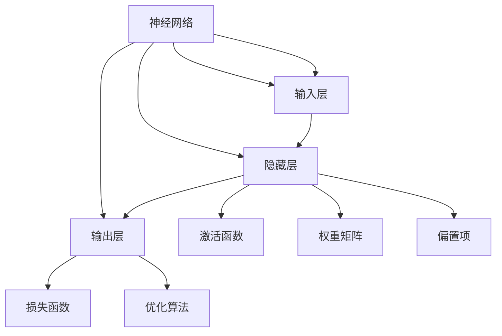

                 

# 神经网络：机器学习的新范式

> 关键词：神经网络, 机器学习, 深度学习, 反向传播, 模型训练, 模型优化

## 1. 背景介绍

### 1.1 问题由来

神经网络作为一种强大的机器学习模型，自20世纪80年代被提出以来，在图像识别、语音识别、自然语言处理等众多领域取得了显著成就。近年来，随着深度学习技术的迅猛发展，尤其是大规模深度神经网络的兴起，神经网络已经逐渐成为机器学习领域的主流范式。

神经网络之所以能够取得如此显著的效果，主要得益于以下几个关键因素：

- **大数据时代**：神经网络依赖于大量的训练数据，大数据的积累使得深度学习模型能够充分学习数据的复杂规律。
- **高性能计算**：近年来GPU、TPU等高性能计算设备的普及，使得神经网络能够高效地进行大规模模型训练。
- **丰富的先验知识**：神经网络通过大量标注数据的训练，能够自动学习到复杂的数据分布和特征关系。
- **强大的泛化能力**：神经网络在处理未知数据时，表现出良好的泛化性能，能够应对复杂多变的实际应用场景。

然而，神经网络也存在一些不容忽视的问题：

- **模型复杂性**：神经网络的参数量通常非常大，模型的训练和推理需要消耗大量计算资源，训练过程容易过拟合。
- **可解释性不足**：神经网络通常被视为"黑盒"模型，难以解释其内部工作机制和决策逻辑，缺乏透明度。
- **训练过程脆弱**：神经网络对初始化参数非常敏感，不同的初始化方式和训练策略可能会产生完全不同的结果。
- **资源消耗巨大**：神经网络通常需要耗费大量的计算资源进行训练和推理，对于资源有限的场景并不适用。

在面对这些挑战的同时，神经网络仍然展现出强大的应用潜力，成为了机器学习领域的新范式。本文将从核心概念、算法原理、实际应用等方面，全面系统地介绍神经网络及其在机器学习中的应用，帮助读者深入理解这一前沿技术。

## 2. 核心概念与联系

### 2.1 核心概念概述

神经网络是一种由大量神经元（Neuron）构成的复杂模型，每个神经元接收多个输入，并通过一系列非线性变换产生一个输出。神经网络通过多层次的神经元组合，可以逐步抽象出数据的多层次特征表示，从而实现对复杂数据的处理和分类。

神经网络的核心概念包括：

- **神经元**：神经网络的基本组成单元，接收输入、计算输出，并通过权重参数进行信息传递。
- **激活函数**：用于引入非线性变换，增强模型的表达能力，常用的激活函数包括Sigmoid、ReLU等。
- **权重矩阵**：神经元之间的连接参数，用于学习输入和输出之间的映射关系。
- **偏置项**：神经元计算输出的常数项，用于调整输出值的基准位置。
- **损失函数**：用于衡量模型输出与真实标签之间的差异，常用的损失函数包括均方误差、交叉熵等。
- **优化算法**：用于更新模型参数，使损失函数最小化，常用的优化算法包括梯度下降、Adam等。

### 2.2 核心概念原理和架构的 Mermaid 流程图



这个流程图展示了神经网络的基本架构，包括输入层、隐藏层和输出层。输入层接收原始数据，隐藏层进行特征抽取和信息传递，输出层产生最终的预测结果。激活函数、权重矩阵和偏置项用于计算每个神经元的输出，损失函数和优化算法用于调整模型参数，最小化预测误差。

## 3. 核心算法原理 & 具体操作步骤

### 3.1 算法原理概述

神经网络的核心算法原理是反向传播（Backpropagation），它是一种用于训练神经网络的高效优化方法。反向传播算法通过计算损失函数对每个参数的偏导数，自动更新模型参数，以最小化预测误差。

反向传播的原理可以简单概括为：

1. 前向传播：将输入数据送入神经网络，逐层计算每个神经元的输出，最终得到预测结果。
2. 计算损失：将预测结果与真实标签进行比较，计算损失函数。
3. 反向传播：根据损失函数的梯度，逐层计算每个参数的偏导数，更新模型参数。
4. 重复步骤1-3，直至模型收敛。

### 3.2 算法步骤详解

神经网络的训练过程可以分为以下几个步骤：

**Step 1: 初始化模型参数**

首先，需要初始化神经网络的参数，包括权重矩阵、偏置项等。常见的初始化方法包括随机初始化、Xavier初始化、He初始化等。

**Step 2: 前向传播计算预测结果**

输入数据进入神经网络，经过逐层的前向传播计算，得到最终的预测结果。在每一层中，每个神经元的输出由其输入、权重矩阵、激活函数和偏置项共同决定。

**Step 3: 计算损失函数**

将预测结果与真实标签进行比较，计算损失函数。常用的损失函数包括均方误差（MSE）、交叉熵（Cross-Entropy）等。

**Step 4: 反向传播更新参数**

根据损失函数对每个参数的偏导数，使用优化算法（如梯度下降、Adam等）更新模型参数。这一步骤通过反向传播算法实现，自动计算每个参数的梯度，并更新其值。

**Step 5: 重复训练直至收敛**

重复执行步骤2-4，直至模型的预测结果与真实标签的误差达到预设阈值或训练轮数达到最大。

### 3.3 算法优缺点

神经网络的优点包括：

1. **强大的泛化能力**：神经网络能够自动学习数据中的复杂关系，具有较强的泛化能力。
2. **可处理复杂问题**：神经网络能够处理非线性关系，适用于复杂多变的实际应用场景。
3. **自动特征提取**：神经网络通过多层次的特征表示，能够自动学习数据的特征表示。

神经网络的缺点包括：

1. **参数量大**：神经网络的参数量通常非常大，训练和推理需要消耗大量计算资源。
2. **训练过程复杂**：神经网络的训练过程容易过拟合，需要大量的标注数据和适当的正则化技术。
3. **可解释性不足**：神经网络通常被视为"黑盒"模型，难以解释其内部工作机制和决策逻辑。
4. **资源消耗巨大**：神经网络通常需要耗费大量的计算资源进行训练和推理。

### 3.4 算法应用领域

神经网络已经被广泛应用于各个领域，包括但不限于以下几个方面：

1. **计算机视觉**：神经网络在图像识别、物体检测、人脸识别等领域取得了显著的成就。
2. **自然语言处理**：神经网络在语言模型、机器翻译、情感分析、问答系统等领域表现出色。
3. **语音识别**：神经网络在语音识别、语音合成、语音情感识别等领域取得了重要进展。
4. **推荐系统**：神经网络在推荐系统、广告推荐等领域表现优异，能够精准预测用户行为。
5. **金融分析**：神经网络在股票预测、风险评估、信用评分等领域发挥了重要作用。
6. **医疗诊断**：神经网络在医学影像分析、疾病预测、基因分析等领域表现出色。

## 4. 数学模型和公式 & 详细讲解 & 举例说明

### 4.1 数学模型构建

神经网络的基本数学模型可以表示为：

$$
y = \sigma(z) = \sigma(Wx + b)
$$

其中，$x$ 表示输入向量，$W$ 表示权重矩阵，$b$ 表示偏置项，$z = Wx + b$ 表示线性变换，$\sigma$ 表示激活函数。

对于多层的神经网络，可以通过组合多个线性变换和激活函数来计算输出结果。例如，对于一个两层的神经网络，其输出结果可以表示为：

$$
y = \sigma_2(\sigma_1(W_1x + b_1)W_2x + b_2)
$$

其中，$\sigma_1$ 和 $\sigma_2$ 表示两个隐层的激活函数，$W_1$ 和 $W_2$ 表示两个隐层的权重矩阵，$b_1$ 和 $b_2$ 表示两个隐层的偏置项。

### 4.2 公式推导过程

以单层神经网络为例，推导其前向传播和反向传播的公式：

**前向传播公式**：

$$
y = \sigma(z) = \sigma(Wx + b)
$$

其中，$\sigma$ 表示激活函数，$W$ 表示权重矩阵，$x$ 表示输入向量，$b$ 表示偏置项。

**反向传播公式**：

$$
\frac{\partial L}{\partial w} = \frac{\partial L}{\partial z} \frac{\partial z}{\partial w} = \frac{\partial L}{\partial z} \frac{\partial \sigma(z)}{\partial w}
$$

其中，$L$ 表示损失函数，$z$ 表示线性变换的结果，$w$ 表示权重矩阵。

**误差梯度公式**：

$$
\frac{\partial L}{\partial x} = \frac{\partial L}{\partial z} \frac{\partial z}{\partial x} = \frac{\partial L}{\partial z} \frac{\partial \sigma(z)}{\partial x}
$$

其中，$x$ 表示输入向量，$z$ 表示线性变换的结果，$L$ 表示损失函数。

### 4.3 案例分析与讲解

以一个简单的二分类问题为例，假设输入向量为 $x$，输出向量为 $y$，神经网络包含一个隐藏层，权重矩阵为 $W$，激活函数为 Sigmoid，偏置项为 $b$，损失函数为二元交叉熵，优化算法为梯度下降。

1. **前向传播**：计算隐藏层的输出结果：

$$
z_1 = Wx + b
$$

$$
y = \sigma(z_1)
$$

2. **计算损失**：计算二元交叉熵损失：

$$
L = -\frac{1}{N}\sum_{i=1}^N(y_i\log y_i + (1-y_i)\log(1-y_i))
$$

3. **反向传播**：计算权重矩阵 $W$ 和偏置项 $b$ 的梯度：

$$
\frac{\partial L}{\partial W} = \frac{\partial L}{\partial z_1} \frac{\partial z_1}{\partial W} = y(\sigma(z_1) - y) x^T
$$

$$
\frac{\partial L}{\partial b} = \frac{\partial L}{\partial z_1} \frac{\partial z_1}{\partial b} = \frac{\partial L}{\partial z_1}
$$

其中，$N$ 表示样本数量，$x$ 表示输入向量，$y$ 表示输出向量，$z_1$ 表示隐藏层的输出结果，$W$ 表示权重矩阵，$b$ 表示偏置项。

通过以上推导，我们可以看到，反向传播算法通过逐层计算误差梯度，自动更新模型参数，实现神经网络的训练过程。

## 5. 项目实践：代码实例和详细解释说明

### 5.1 开发环境搭建

在进行神经网络项目开发前，我们需要准备好开发环境。以下是使用Python进行TensorFlow开发的环境配置流程：

1. 安装Anaconda：从官网下载并安装Anaconda，用于创建独立的Python环境。

2. 创建并激活虚拟环境：
```bash
conda create -n tensorflow-env python=3.8 
conda activate tensorflow-env
```

3. 安装TensorFlow：根据CUDA版本，从官网获取对应的安装命令。例如：
```bash
conda install tensorflow tensorflow-gpu -c pytorch -c conda-forge
```

4. 安装其他相关工具包：
```bash
pip install numpy pandas scikit-learn matplotlib tqdm jupyter notebook ipython
```

完成上述步骤后，即可在`tensorflow-env`环境中开始神经网络项目开发。

### 5.2 源代码详细实现

下面我们以多层感知器（Multilayer Perceptron, MLP）为例，给出使用TensorFlow进行神经网络开发的Python代码实现。

```python
import tensorflow as tf
from tensorflow.keras.datasets import mnist
from tensorflow.keras.utils import to_categorical

# 加载MNIST数据集
(x_train, y_train), (x_test, y_test) = mnist.load_data()

# 数据预处理
x_train = x_train.reshape(-1, 28*28) / 255.0
x_test = x_test.reshape(-1, 28*28) / 255.0
y_train = to_categorical(y_train, num_classes=10)
y_test = to_categorical(y_test, num_classes=10)

# 定义神经网络模型
model = tf.keras.models.Sequential([
    tf.keras.layers.Dense(64, activation='relu', input_shape=(784,)),
    tf.keras.layers.Dense(64, activation='relu'),
    tf.keras.layers.Dense(10, activation='softmax')
])

# 定义损失函数和优化器
loss_fn = tf.keras.losses.CategoricalCrossentropy()
optimizer = tf.keras.optimizers.Adam()

# 编译模型
model.compile(optimizer=optimizer, loss=loss_fn, metrics=['accuracy'])

# 训练模型
model.fit(x_train, y_train, epochs=10, batch_size=32, validation_data=(x_test, y_test))

# 评估模型
model.evaluate(x_test, y_test)
```

在这个代码示例中，我们使用了TensorFlow的高级API，定义了一个包含两个隐藏层的多层感知器模型，并使用Adam优化器和Categorical Cross-Entropy损失函数进行训练和评估。代码简单易懂，非常适合初学者入门。

### 5.3 代码解读与分析

让我们再详细解读一下关键代码的实现细节：

**数据预处理**：
```python
x_train = x_train.reshape(-1, 28*28) / 255.0
x_test = x_test.reshape(-1, 28*28) / 255.0
y_train = to_categorical(y_train, num_classes=10)
y_test = to_categorical(y_test, num_classes=10)
```

在加载MNIST数据集后，我们需要将28*28的图像数据展开为一维向量，并将像素值归一化到0到1之间。同时，将标签转换为one-hot编码形式，方便模型训练。

**定义神经网络模型**：
```python
model = tf.keras.models.Sequential([
    tf.keras.layers.Dense(64, activation='relu', input_shape=(784,)),
    tf.keras.layers.Dense(64, activation='relu'),
    tf.keras.layers.Dense(10, activation='softmax')
])
```

使用`Sequential`模型定义了一个包含两个隐藏层的多层感知器，其中隐藏层的激活函数为ReLU，输出层的激活函数为Softmax。输入层接收28*28的图像数据，输出层输出10个类别的概率分布。

**定义损失函数和优化器**：
```python
loss_fn = tf.keras.losses.CategoricalCrossentropy()
optimizer = tf.keras.optimizers.Adam()
```

定义了交叉熵损失函数和Adam优化器，用于模型训练。

**编译模型**：
```python
model.compile(optimizer=optimizer, loss=loss_fn, metrics=['accuracy'])
```

使用`compile`方法将损失函数和优化器绑定到模型上，并设置评估指标为准确率。

**训练模型**：
```python
model.fit(x_train, y_train, epochs=10, batch_size=32, validation_data=(x_test, y_test))
```

使用`fit`方法进行模型训练，指定训练轮数、批次大小和验证集。

**评估模型**：
```python
model.evaluate(x_test, y_test)
```

使用`evaluate`方法对模型进行评估，返回测试集上的准确率和损失值。

通过以上代码，我们可以看到，使用TensorFlow进行神经网络开发非常简单，只需要几个关键步骤即可完成模型的定义、编译、训练和评估。TensorFlow提供了丰富的API和工具，方便开发者进行神经网络的开发和调试。

## 6. 实际应用场景

### 6.1 计算机视觉

神经网络在计算机视觉领域表现出色，广泛应用于图像识别、物体检测、人脸识别等任务。例如，使用神经网络进行图像分类，可以将大量图像数据输入到模型中，训练得到一个高效的图像分类器。神经网络通过多层特征表示，能够自动学习图像中的复杂特征，从而实现对图像的精准分类。

### 6.2 自然语言处理

神经网络在自然语言处理领域也取得了重要进展，广泛应用于语言模型、机器翻译、情感分析、问答系统等任务。例如，使用神经网络进行语言模型训练，可以基于大量文本数据，学习到文本的统计分布规律。神经网络通过多层次的特征表示，能够自动学习文本中的语法、语义和上下文信息，从而实现对文本的精准建模。

### 6.3 语音识别

神经网络在语音识别领域表现优异，广泛应用于语音识别、语音合成、语音情感识别等任务。例如，使用神经网络进行语音识别，可以将语音信号输入到模型中，训练得到一个高效的语音识别器。神经网络通过多层特征表示，能够自动学习语音信号中的声学特征和语言特征，从而实现对语音的精准识别。

### 6.4 金融分析

神经网络在金融分析领域也有广泛应用，如股票预测、风险评估、信用评分等任务。例如，使用神经网络进行股票预测，可以将历史股票价格数据输入到模型中，训练得到一个高效的股票预测器。神经网络通过多层特征表示，能够自动学习股票价格中的时间序列特征和市场信息，从而实现对股票价格的精准预测。

### 6.5 医疗诊断

神经网络在医疗诊断领域表现出色，广泛应用于医学影像分析、疾病预测、基因分析等任务。例如，使用神经网络进行医学影像分析，可以将医学影像数据输入到模型中，训练得到一个高效的医学影像分类器。神经网络通过多层特征表示，能够自动学习医学影像中的复杂特征，从而实现对医学影像的精准分类。

## 7. 工具和资源推荐

### 7.1 学习资源推荐

为了帮助开发者系统掌握神经网络的理论基础和实践技巧，这里推荐一些优质的学习资源：

1. 《深度学习》（Deep Learning）：Ian Goodfellow等人著，全面介绍了深度学习的基本概念和应用。
2. 《神经网络与深度学习》（Neural Networks and Deep Learning）：Michael Nielsen著，深入浅出地讲解了神经网络和深度学习的原理。
3. 《TensorFlow官方文档》：TensorFlow官方提供的详细文档，包括API、教程、案例等，适合初学者和专家使用。
4. 《Keras官方文档》：Keras官方提供的详细文档，包括API、教程、案例等，适合初学者和专家使用。
5. Coursera《深度学习专项课程》：Andrew Ng教授开设的深度学习专项课程，涵盖了深度学习的基本概念和应用。
6. edX《深度学习基础》：MIT OpenCourseWare提供的深度学习基础课程，包括视频、讲义、作业等。

通过对这些资源的学习实践，相信你一定能够快速掌握神经网络的核心思想和应用技巧，并用于解决实际的机器学习问题。

### 7.2 开发工具推荐

高效的开发离不开优秀的工具支持。以下是几款用于神经网络开发的常用工具：

1. TensorFlow：由Google主导开发的开源深度学习框架，支持分布式训练和推理，适合大规模工程应用。
2. PyTorch：由Facebook主导开发的开源深度学习框架，支持动态计算图和自动微分，适合快速迭代研究。
3. Keras：基于TensorFlow和Theano等后端实现的高级API，提供了简单易用的神经网络API，适合快速开发原型。
4. Jupyter Notebook：基于IPython的交互式笔记本，支持Python代码的开发、调试和展示。
5. Anaconda：开源的Python发行版，包含大量的科学计算和机器学习库，方便开发者快速搭建开发环境。

合理利用这些工具，可以显著提升神经网络的开发效率，加快创新迭代的步伐。

### 7.3 相关论文推荐

神经网络及其在机器学习中的应用已经被广泛研究，以下是几篇奠基性的相关论文，推荐阅读：

1. A Modern Introduction to Neural Networks and Deep Learning：Ian Goodfellow著，介绍了神经网络和深度学习的基本概念和应用。
2. ImageNet Classification with Deep Convolutional Neural Networks：Alex Krizhevsky等人著，提出了卷积神经网络（CNN），实现了图像分类的突破。
3. Convolutional Neural Networks for Natural Language Processing：Yoon Kim著，提出了卷积神经网络在自然语言处理中的应用。
4. Attention Is All You Need：Ashish Vaswani等人著，提出了Transformer结构，开创了自注意力机制在神经网络中的应用。
5. Deep Residual Learning for Image Recognition：Kaiming He等人著，提出了残差网络（ResNet），实现了深度神经网络训练的突破。

这些论文代表了大神经网络及其在机器学习中的应用的发展脉络。通过学习这些前沿成果，可以帮助研究者把握学科前进方向，激发更多的创新灵感。

## 8. 总结：未来发展趋势与挑战

### 8.1 总结

本文对神经网络及其在机器学习中的应用进行了全面系统的介绍。首先阐述了神经网络的发展背景和核心概念，明确了神经网络在机器学习中的重要地位。其次，从原理到实践，详细讲解了神经网络的数学模型和训练过程，给出了神经网络开发的完整代码实例。同时，本文还广泛探讨了神经网络在计算机视觉、自然语言处理、语音识别、金融分析、医疗诊断等诸多领域的应用前景，展示了神经网络技术的强大潜力。此外，本文精选了神经网络的各类学习资源，力求为读者提供全方位的技术指引。

通过本文的系统梳理，我们可以看到，神经网络作为机器学习的主流范式，在各个领域都取得了显著的成就。得益于其强大的泛化能力和自动特征表示能力，神经网络在未来将继续发挥重要作用。

### 8.2 未来发展趋势

展望未来，神经网络的发展趋势包括以下几个方面：

1. **深度增强**：神经网络的深度将进一步增强，通过增加网络层数和节点数，提升模型的表达能力和泛化能力。
2. **混合网络**：结合不同网络结构，如卷积神经网络、循环神经网络等，实现多模态数据的联合建模。
3. **模型压缩**：采用模型压缩和剪枝技术，减小模型的参数量和计算资源消耗，提升模型的推理速度和可部署性。
4. **联邦学习**：通过分布式训练，在多个设备上联合优化模型，提高模型在资源受限场景下的性能。
5. **自适应学习**：引入自适应学习算法，如在线学习、增量学习等，实现模型在动态环境中的持续优化。
6. **模型融合**：结合多种模型，如集成学习、模型融合等，提升模型的鲁棒性和泛化能力。

这些趋势凸显了神经网络的强大应用潜力，将引领深度学习技术的进一步发展。未来，随着神经网络的不断优化和创新，深度学习技术将在更多领域带来变革性影响。

### 8.3 面临的挑战

尽管神经网络已经取得了显著的成就，但在迈向更加智能化、普适化应用的过程中，它仍面临着诸多挑战：

1. **计算资源瓶颈**：神经网络通常需要耗费大量的计算资源进行训练和推理，对于资源有限的场景并不适用。
2. **模型可解释性不足**：神经网络通常被视为"黑盒"模型，难以解释其内部工作机制和决策逻辑。
3. **训练过程脆弱**：神经网络的训练过程容易过拟合，需要大量的标注数据和适当的正则化技术。
4. **数据分布差异**：神经网络在训练时依赖于大规模的标注数据，当目标任务与训练数据的分布差异较大时，微调的性能提升有限。
5. **安全性问题**：神经网络可能会学习到有偏见、有害的信息，通过微调传递到下游任务，产生误导性、歧视性的输出，给实际应用带来安全隐患。
6. **伦理道德问题**：神经网络的应用需要考虑伦理道德问题，如公平性、隐私保护等，避免算法歧视和数据滥用。

正视神经网络面临的这些挑战，积极应对并寻求突破，将是大神经网络技术走向成熟的必由之路。相信随着学界和产业界的共同努力，这些挑战终将一一被克服，神经网络技术必将带来更加广泛的应用和深远的影响。

### 8.4 研究展望

面对神经网络所面临的挑战，未来的研究需要在以下几个方面寻求新的突破：

1. **低资源环境下的优化**：研究如何在大规模数据和计算资源受限的情况下，提升神经网络的性能和可部署性。
2. **可解释性增强**：研究如何增强神经网络的可解释性，使其更加透明和可理解。
3. **自适应学习算法**：研究如何通过在线学习、增量学习等自适应学习算法，实现模型在动态环境中的持续优化。
4. **多模态融合**：研究如何实现多模态数据的联合建模，提升神经网络在多模态场景下的性能。
5. **公平性和隐私保护**：研究如何避免算法歧视和数据滥用，保障神经网络应用的公平性和隐私保护。
6. **高效模型压缩**：研究如何通过模型压缩和剪枝技术，减小神经网络的参数量和计算资源消耗。

这些研究方向将引领神经网络技术的不断创新和发展，为构建安全、可靠、可解释、可控的智能系统铺平道路。面向未来，神经网络技术还需要与其他人工智能技术进行更深入的融合，如知识表示、因果推理、强化学习等，多路径协同发力，共同推动深度学习技术的进步。

## 9. 附录：常见问题与解答

**Q1：神经网络为什么需要大量训练数据？**

A: 神经网络通常需要大量的训练数据，因为它们依赖于数据中的统计规律和模式。训练数据越多，神经网络能够学习到的模式越丰富，泛化能力越强。大量训练数据可以降低过拟合的风险，提高模型的泛化性能。

**Q2：神经网络为什么容易出现过拟合？**

A: 神经网络容易出现过拟合，主要原因是模型的复杂度过高，参数量非常大，容易在训练数据上学习到噪声和细节。为了避免过拟合，通常采用正则化技术，如L2正则、Dropout等，同时使用更多的训练数据和合适的正则化参数。

**Q3：神经网络为什么难以解释？**

A: 神经网络通常被视为"黑盒"模型，难以解释其内部工作机制和决策逻辑。这是因为神经网络的结构和参数非常复杂，难以手动调试和理解。为了提高神经网络的可解释性，通常采用可视化技术，如特征重要性可视化、模型可视化等，帮助理解模型的内部工作机制。

**Q4：神经网络为什么需要高性能计算资源？**

A: 神经网络的计算复杂度非常高，需要进行大量的矩阵运算和反向传播。随着网络深度的增加和参数量的增加，计算资源的需求急剧上升。为了提高训练和推理效率，通常需要使用GPU、TPU等高性能计算设备。

**Q5：神经网络为什么需要高效的模型压缩技术？**

A: 神经网络的参数量通常非常大，对于计算资源有限的场景并不适用。高效的模型压缩技术如剪枝、量化等，可以减小模型的参数量和计算资源消耗，提升模型的推理速度和可部署性。

通过以上对神经网络及其在机器学习中的应用进行全面系统的介绍，相信读者已经对神经网络有了深入的理解。神经网络作为机器学习的主流范式，已经在众多领域展现了强大的应用潜力。未来，随着神经网络技术的不断发展和创新，深度学习技术必将带来更多的变革和突破，推动人工智能技术的进一步发展。

