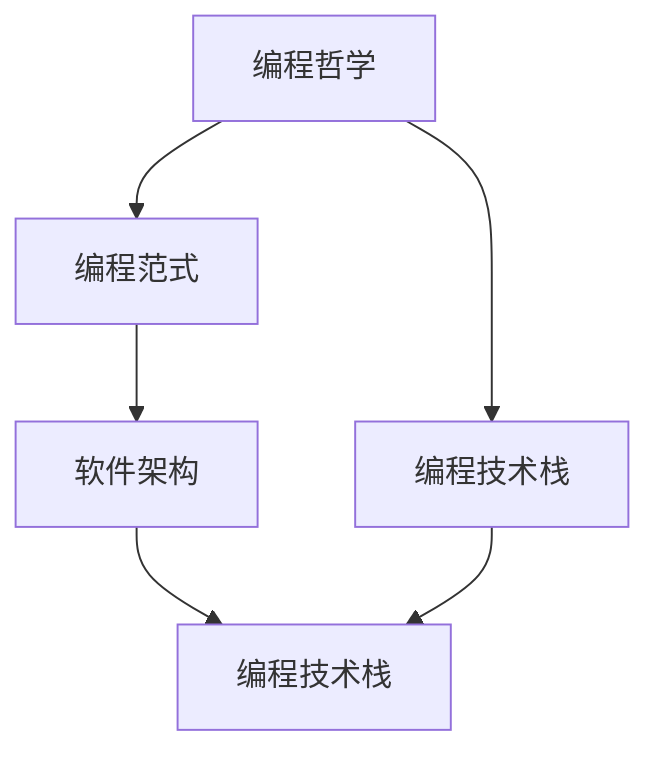

                 

# 禅与计算机程序设计艺术

> 关键词：禅, 计算机, 程序设计艺术, 编程, 编码, 软件开发, 编程哲学, 软件架构, 技术栈, 软件工程, 人工智能, 深度学习, 计算机科学

## 1. 背景介绍

### 1.1 问题的由来

计算机编程是一项既充满挑战又富有创造性的工作。从早期的机械语言到现代的软件工程，编程的方式和工具都发生了巨大的变化。然而，编程的核心问题—如何通过计算机语言实现思维和逻辑的表达—始终不变。在探索这个问题的过程中，无数编程先驱提出并实践了不同的编程哲学和方法论。这些理论和方法不仅影响了计算机科学的发展，也塑造了软件开发的实践。

### 1.2 问题的核心关键点

现代编程的核心问题可以归结为两个主要方面：

1. **表达与理解**：如何通过代码准确地表达人类的思维和逻辑，使机器能够理解并执行？
2. **抽象与实现**：如何将抽象的数学模型和算法，转化为具体的计算机实现？

这两个问题的答案构成了编程艺术的精髓。通过深入研究，我们可以理解代码是如何被编写、解释和执行的，从而在编程中达到“禅”的境界：深邃的洞察力、简洁的表达方式、以及高效解决问题的能力。

## 2. 核心概念与联系

### 2.1 核心概念概述

为更好地理解编程艺术，我们首先介绍几个关键概念及其联系：

- **编程哲学**：编程哲学是关于编程的基本理念和方法，它指导着软件开发的每一个环节。如结构化编程、面向对象编程、函数式编程等。
- **编程范式**：编程范式是编程的特定模式，如过程式、函数式、面向对象、事件驱动等。不同的范式提供不同的解决问题方式。
- **软件架构**：软件架构是软件系统的组织和设计方式，包括组件划分、交互模式、数据流动等。良好的架构设计可以提升系统的可扩展性、可维护性和可复用性。
- **编程技术栈**：编程技术栈是开发特定应用程序所需的所有技术和工具的集合，包括语言、框架、库、版本控制等。

这些概念通过以下几个联系相互连接：

1. 编程哲学指导着编程范式和软件架构的设计。
2. 编程范式提供编程技术栈的构建方式。
3. 软件架构的实现依赖于编程技术栈中的工具和语言。

这种联系形成了一个相互依存的整体，为编程艺术的发展提供了基础。

### 2.2 核心概念原理和架构的 Mermaid 流程图



## 3. 核心算法原理 & 具体操作步骤

### 3.1 算法原理概述

编程艺术的精髓在于如何通过抽象和实现的桥梁，将复杂的现实问题转化为计算机可执行的代码。这个过程中，算法原理是不可或缺的指导。

算法是解决特定问题的一系列步骤，通常以代码形式实现。良好的算法设计应当具备以下特点：

- **简洁性**：算法应尽可能简洁，避免过度复杂。
- **可读性**：算法应易于理解，便于维护和修改。
- **高效性**：算法应高效执行，避免不必要的时间和空间开销。

### 3.2 算法步骤详解

一个典型的算法步骤包括：

1. **问题定义**：明确问题的本质和要求。
2. **数据结构选择**：选择或设计适合问题的数据结构，如数组、链表、树、图等。
3. **算法设计**：设计算法的详细步骤和逻辑。
4. **算法实现**：将算法步骤转换为具体的代码实现。
5. **性能优化**：对算法进行优化，提高执行效率。

### 3.3 算法优缺点

- **优点**：
  - 提升问题解决的效率和准确性。
  - 提供通用的问题解决方法，具有广泛的应用性。
  - 促进对问题的深刻理解。

- **缺点**：
  - 算法设计复杂，需要较高的抽象和推理能力。
  - 算法的实现可能涉及大量细节，容易出错。
  - 对于特定问题，可能需要特殊设计，无法通用。

### 3.4 算法应用领域

算法在计算机科学和软件开发中有着广泛的应用，包括但不限于以下几个领域：

1. **数据处理**：如排序、搜索、过滤、统计等。
2. **图形处理**：如路径查找、拓扑排序、最小生成树等。
3. **数学计算**：如微积分、线性代数、离散数学等。
4. **人工智能**：如机器学习、深度学习、自然语言处理等。
5. **系统设计**：如操作系统调度、数据库索引、缓存策略等。

## 4. 数学模型和公式 & 详细讲解 & 举例说明

### 4.1 数学模型构建

数学模型是问题抽象的数学表示，它将现实问题转化为数学表达式，便于算法设计。常见的数学模型包括：

- **线性模型**：如线性回归、线性规划等。
- **非线性模型**：如多项式回归、神经网络等。
- **概率模型**：如贝叶斯网络、隐马尔可夫模型等。

### 4.2 公式推导过程

以线性回归为例，推导公式过程如下：

1. **假设模型**：假设模型为 $y = wx + b$，其中 $w$ 为权重向量，$b$ 为偏置项。
2. **误差函数**：定义误差函数 $E(w) = \frac{1}{2N}\sum_{i=1}^N(y_i - wx_i - b)^2$。
3. **最小二乘法**：通过求解误差函数的最小值，得到最优权重和偏置。

### 4.3 案例分析与讲解

假设有一个销售数据集，包含销售量和广告费用。目标是预测销售量与广告费用之间的关系。

1. **数据准备**：收集销售数据，分为训练集和测试集。
2. **模型构建**：使用线性回归模型 $y = wx + b$，其中 $x$ 为广告费用，$y$ 为销售量。
3. **参数优化**：通过最小二乘法，优化 $w$ 和 $b$ 以最小化误差。
4. **结果验证**：在测试集上评估模型预测精度。

## 5. 项目实践：代码实例和详细解释说明

### 5.1 开发环境搭建

- **安装Python**：从官网下载并安装Python 3.x版本。
- **安装PyTorch**：使用pip安装PyTorch库。
- **安装NumPy和Matplotlib**：使用pip安装NumPy和Matplotlib库。
- **安装Jupyter Notebook**：使用pip安装Jupyter Notebook库。

### 5.2 源代码详细实现

以下是一个简单的线性回归代码实现：

```python
import numpy as np
import matplotlib.pyplot as plt

# 生成随机数据
np.random.seed(0)
x = np.random.randn(100)
y = 2*x + 1 + np.random.randn(100)

# 线性回归模型
def linear_regression(X, y):
    X = np.vstack([np.ones(len(X)), X]).T
    w, b = np.linalg.inv(X.T.dot(X)).dot(X.T).dot(y)
    return w, b

# 训练和预测
w, b = linear_regression(x, y)
y_pred = w[0]*x + b[0]
plt.scatter(x, y)
plt.plot(x, y_pred, 'r--')
plt.show()

# 计算误差
error = np.mean((y - y_pred)**2)
print("Error: {:.3f}".format(error))
```

### 5.3 代码解读与分析

- **数据生成**：使用NumPy生成100个随机数据点。
- **线性回归模型**：定义线性回归函数，求解线性回归模型参数。
- **训练和预测**：使用训练数据拟合线性回归模型，并使用预测数据验证模型。
- **误差计算**：计算模型预测误差。

### 5.4 运行结果展示

```python
import numpy as np
import matplotlib.pyplot as plt

# 生成随机数据
np.random.seed(0)
x = np.random.randn(100)
y = 2*x + 1 + np.random.randn(100)

# 线性回归模型
def linear_regression(X, y):
    X = np.vstack([np.ones(len(X)), X]).T
    w, b = np.linalg.inv(X.T.dot(X)).dot(X.T).dot(y)
    return w, b

# 训练和预测
w, b = linear_regression(x, y)
y_pred = w[0]*x + b[0]
plt.scatter(x, y)
plt.plot(x, y_pred, 'r--')
plt.show()

# 计算误差
error = np.mean((y - y_pred)**2)
print("Error: {:.3f}".format(error))
```

## 6. 实际应用场景

### 6.1 智能推荐系统

智能推荐系统利用机器学习算法，根据用户的历史行为和偏好，推荐相关的物品。其核心算法包括协同过滤、内容推荐等。

### 6.2 数据挖掘

数据挖掘是从大量数据中提取有用信息的过程。常见的算法包括分类、聚类、关联规则挖掘等。数据挖掘广泛应用于市场分析、金融风险预测等领域。

### 6.3 图像处理

图像处理涉及对数字图像的获取、处理和分析。常见的算法包括图像分割、特征提取、对象识别等。图像处理在医学影像分析、工业检测等场景中具有重要应用。

### 6.4 未来应用展望

未来的编程艺术将结合更多的技术创新，如人工智能、大数据、区块链等。这将带来更多的应用场景和问题挑战，推动编程艺术的不断进步。

## 7. 工具和资源推荐

### 7.1 学习资源推荐

- **《计算机程序设计艺术》系列书籍**：深入讲解编程艺术的各个方面，包括语言、算法、数据结构等。
- **Coursera和edX**：提供大量的在线课程，涵盖编程、数据科学、人工智能等领域的知识。
- **GitHub**：提供海量的开源代码和项目，便于学习和参考。

### 7.2 开发工具推荐

- **PyTorch**：深度学习框架，支持动态图和静态图。
- **TensorFlow**：另一个流行的深度学习框架，支持多种编程语言和平台。
- **Visual Studio Code**：轻量级、功能强大的代码编辑器。

### 7.3 相关论文推荐

- **《编程珠玑》**：介绍编程中常见问题的解决方案，提供丰富的案例和代码。
- **《计算机程序的构造与解释》**：深入讲解编程语言的语法和语义，是学习编程语言的重要参考资料。
- **《深度学习》**：全面介绍深度学习算法和应用，是深度学习领域的重要参考书。

## 8. 总结：未来发展趋势与挑战

### 8.1 研究成果总结

本文从编程艺术的哲学、范式、架构等方面，深入探讨了编程艺术的核心问题和方法。通过案例分析和代码实践，展示了编程艺术的具体实现。

### 8.2 未来发展趋势

未来的编程艺术将更加注重以下趋势：

- **自动化编程**：自动化生成代码、测试、部署等，提升开发效率。
- **人工智能编程**：结合人工智能技术，如自然语言处理、机器学习等，提升编程的智能化和自动化水平。
- **跨学科融合**：与其他领域（如生物信息学、金融工程等）的融合，拓宽编程艺术的应用场景。

### 8.3 面临的挑战

编程艺术的发展也面临着一些挑战：

- **技术更新迅速**：新的编程语言和工具不断出现，开发者需要不断学习更新。
- **跨平台兼容性**：不同平台和语言之间的兼容性问题，需要开发者灵活应对。
- **可维护性和可扩展性**：大型项目的维护和扩展，需要系统化的管理和设计。

### 8.4 研究展望

未来的研究应集中在以下方向：

- **编程教育**：提升编程教学质量，培养新一代的编程人才。
- **编程工具**：开发更加智能化、易用的编程工具，提升编程体验。
- **编程哲学**：深入探索编程艺术的哲学和美学，提升编程的艺术性和创造性。

## 9. 附录：常见问题与解答

**Q1: 编程语言选择的重要性是什么？**

A: 编程语言的选择直接影响开发效率、代码可读性和维护成本。应根据项目需求、团队技能和社区资源等因素，综合考虑选择适合的语言。

**Q2: 如何评估算法的性能？**

A: 算法的性能评估通常从时间复杂度、空间复杂度、精度和鲁棒性等方面考虑。应根据具体问题选择合适的评估指标。

**Q3: 如何进行算法优化？**

A: 算法优化包括代码优化、数据结构优化和算法优化。应从代码实现细节、数据组织方式和算法逻辑优化等多个角度入手。

**Q4: 如何学习编程艺术？**

A: 学习编程艺术需要系统的理论学习、实践经验和经验分享。可以参考相关的书籍、在线课程和社区资源，不断实践和反思，提升编程技能和艺术素养。

**Q5: 编程艺术的本质是什么？**

A: 编程艺术的本质是如何在编程中平衡简洁性、可读性和高效性，以及如何在解决问题中体现创造力和思考深度。

---

作者：禅与计算机程序设计艺术 / Zen and the Art of Computer Programming

