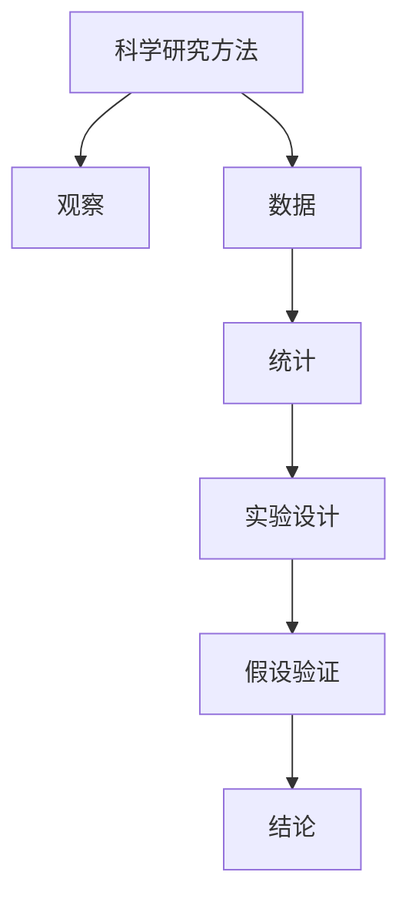

                 

# 科学探究：从观察到结论

> 关键词：科学研究方法, 观察, 数据, 统计, 假设验证, 数据驱动, 实验设计

## 1. 背景介绍

### 1.1 问题由来
科学研究是人类认识自然和社会的重要途径。然而，如何科学地进行探究，从纷繁复杂的现象中发现规律，提炼结论，一直是科学发展的核心难题。科学探究不仅仅是理论研究的范畴，在信息技术、医学、经济学等多个领域，都有广泛的应用。

在IT领域，随着大数据和人工智能技术的发展，数据驱动的方法成为解决问题的有效手段。通过观察数据，分析规律，可以构建模型并验证其有效性。但如何科学地观察数据，设计实验，验证假设，仍是实践中需要面对的挑战。

### 1.2 问题核心关键点
科学探究的核心在于将问题抽象为可验证的假设，通过数据观察和实验设计来验证假设，从而提炼科学结论。科学探究的过程包括：

- 提出假设：根据观察到的现象，构建一个可检验的假设。
- 实验设计：设计实验方案，确保实验结果具有可信度和代表性。
- 数据收集：通过实验和观察收集数据，保证数据的完整性和准确性。
- 数据分析：使用统计学方法分析数据，验证假设。
- 结果验证：通过重复实验和对比分析，确认结论的普适性。

科学探究的目标是建立因果关系，提炼科学结论，为决策和预测提供依据。科学结论的普适性和可验证性是科学探究的核心标准。

### 1.3 问题研究意义
科学探究对于提升科研水平、推动技术进步、解决实际问题具有重要意义：

1. 提升科研质量：科学探究能够通过系统化的方法，减少经验误差，提高研究的准确性和可靠性。
2. 推动技术创新：科学探究能够发现新技术、新方法，促进信息技术、医学等领域的进步。
3. 解决实际问题：科学探究能够根据实际需求，提出有效的解决方案，提升社会效益和经济效益。
4. 促进学科发展：科学探究能够跨学科整合，推动交叉学科的发展，为新兴领域带来新的研究思路。

## 2. 核心概念与联系

### 2.1 核心概念概述

为更好地理解科学探究的方法和过程，本节将介绍几个关键概念：

- 科学研究方法：系统化的科学探究流程，包括假设验证、数据驱动等。
- 观察：通过实验和数据收集，获取科学现象和规律的过程。
- 数据：科学研究的基础，通过数据观察来提炼结论。
- 统计：数据分析的重要手段，包括假设检验、回归分析等。
- 实验设计：科学实验的核心环节，通过设计合理的实验方案，验证假设。
- 假设验证：科学探究的最终目的，验证假设的正确性和普适性。

这些概念之间的联系可以通过以下Mermaid流程图来展示：



这个流程图展示了科学探究的主要流程：

1. 科学研究方法提供系统化的指导。
2. 观察是数据获取的起点，数据驱动科学研究。
3. 数据通过统计分析进行深入挖掘，得出结论。
4. 实验设计是假设验证的基础，通过控制实验条件，确保结论的可靠性。
5. 假设验证是科学探究的最终环节，通过多次实验验证假设的正确性。
6. 科学结论是基于数据和实验的产物，具有普适性和可验证性。

## 3. 核心算法原理 & 具体操作步骤
### 3.1 算法原理概述

科学探究的核心在于通过观察和实验，验证假设的正确性。在科学探究中，观察和实验是两个重要环节。观察旨在获取数据，实验旨在验证假设。

假设可以表示为 $H: f(X, Y) = 0$，其中 $f$ 表示某个函数，$X$ 和 $Y$ 表示两个变量。科学研究的目标是通过实验验证 $f(X, Y)$ 是否为零。

科学探究的统计学原理可以总结为：

1. 观察和收集数据：通过实验和观察，收集 $X$ 和 $Y$ 的样本数据 $D = \{(x_i, y_i)\}_{i=1}^n$。
2. 假设检验：计算 $f(x_i, y_i)$ 的统计量，如 $t$ 值、$F$ 值等，计算假设检验的 $p$ 值。
3. 结论验证：通过比较 $p$ 值和显著性水平 $\alpha$，决定是否接受假设。

### 3.2 算法步骤详解

科学探究的步骤可以详细分为以下几步：

**Step 1: 提出假设**
- 根据已有知识或观察现象，提出一个可检验的假设。例如，研究吸烟与肺癌之间的关系，可以提出假设 $H: \text{吸烟} \text{与} \text{肺癌} \text{独立}$。

**Step 2: 设计实验**
- 设计实验方案，确保实验具有代表性、可重复性。例如，研究吸烟与肺癌的关系，可以设计一个随机对照实验，随机选取吸烟者和非吸烟者，观察其肺癌发病率。

**Step 3: 收集数据**
- 通过实验和观察，收集数据。例如，随机选取吸烟者和非吸烟者各 $n$ 人，观察并记录其肺癌发病率。

**Step 4: 数据分析**
- 使用统计学方法分析数据，如计算 $t$ 值、$F$ 值等，进行假设检验。例如，使用独立样本 $t$ 检验比较吸烟者和非吸烟者的肺癌发病率。

**Step 5: 结果验证**
- 通过多次实验和对比分析，验证假设的正确性。例如，重复实验，确保结论的普适性和可靠性。

**Step 6: 提炼结论**
- 根据数据分析结果，提炼科学结论。例如，如果 $t$ 值大于临界值，$p$ 值小于 $\alpha$，则拒绝原假设，认为吸烟与肺癌有关联。

### 3.3 算法优缺点

科学探究具有以下优点：
1. 系统化：通过系统化的流程和方法，确保研究过程的规范性。
2. 可验证性：通过多次实验和对比分析，确保结论的普适性。
3. 数据驱动：以数据为基础，提炼结论，具有客观性和可靠性。
4. 创新性：通过假设验证和实验设计，推动科学技术的进步。

同时，科学探究也存在一些缺点：
1. 数据依赖：依赖于高质量的数据，数据偏差可能影响结论。
2. 实验复杂：实验设计需要专业知识和技能，可能存在实施困难。
3. 时间成本：从实验设计到数据分析，需要耗费大量时间和资源。
4. 假设局限：假设的合理性取决于观察和经验，可能存在局限性。

尽管存在这些缺点，但科学探究仍然是科学研究的重要手段，能够从复杂现象中提炼科学规律，推动科学技术的进步。

### 3.4 算法应用领域

科学探究方法在多个领域都有广泛应用，包括但不限于：

- 医学研究：通过实验和观察，研究药物效果、疾病机理等。
- 信息技术：通过数据分析，研究用户行为、数据分布等。
- 社会科学：通过调查和实验，研究社会现象、行为模式等。
- 自然科学：通过实验和观察，研究物理、化学等基本规律。

这些领域中的科学探究，都依赖于观察、实验、数据分析和假设验证等关键步骤，确保结论的科学性和普适性。

## 4. 数学模型和公式 & 详细讲解 & 举例说明
### 4.1 数学模型构建

科学探究中，数学模型是数据分析的重要工具。本节将以线性回归模型为例，展示如何构建数学模型并进行数据分析。

设 $X$ 为自变量，$Y$ 为因变量，假设 $Y = \beta_0 + \beta_1X + \epsilon$，其中 $\beta_0$ 和 $\beta_1$ 为模型的参数，$\epsilon$ 为误差项。

### 4.2 公式推导过程

在线性回归中，可以使用最小二乘法（OLS）求解参数 $\beta_0$ 和 $\beta_1$。最小二乘法的目标是最小化残差平方和 $\sum_{i=1}^n (y_i - \hat{y}_i)^2$，其中 $\hat{y}_i = \beta_0 + \beta_1x_i$。

推导过程如下：

$$
\begin{align*}
\sum_{i=1}^n (y_i - \hat{y}_i)^2 &= \sum_{i=1}^n (y_i - \beta_0 - \beta_1x_i)^2 \\
&= \sum_{i=1}^n (y_i^2 - 2y_i\beta_0 - 2y_i\beta_1x_i + \beta_0^2 + \beta_1^2x_i^2) \\
&= \sum_{i=1}^n y_i^2 - 2\beta_0\sum_{i=1}^n y_i - 2\beta_1\sum_{i=1}^n y_ix_i + n\beta_0^2 + n\beta_1^2\sum_{i=1}^n x_i^2
\end{align*}
$$

对 $\beta_0$ 和 $\beta_1$ 求偏导并令导数为零，得到以下方程组：

$$
\begin{cases}
\frac{\partial}{\partial\beta_0}(\sum_{i=1}^n y_i^2 - 2\beta_0\sum_{i=1}^n y_i - 2\beta_1\sum_{i=1}^n y_ix_i + n\beta_0^2 + n\beta_1^2\sum_{i=1}^n x_i^2) = 0 \\
\frac{\partial}{\partial\beta_1}(\sum_{i=1}^n y_i^2 - 2\beta_0\sum_{i=1}^n y_i - 2\beta_1\sum_{i=1}^n y_ix_i + n\beta_0^2 + n\beta_1^2\sum_{i=1}^n x_i^2) = 0
\end{cases}
$$

化简后得到：

$$
\begin{cases}
\sum_{i=1}^n y_i - \frac{n\beta_0}{\sigma^2} = 0 \\
\sum_{i=1}^n y_ix_i - \frac{n\beta_1}{\sigma^2}\sum_{i=1}^n x_i = 0
\end{cases}
$$

其中 $\sigma^2 = \frac{\sum_{i=1}^n (y_i - \hat{y}_i)^2}{n-2}$ 为误差项的方差。

解得：

$$
\begin{cases}
\beta_0 = \frac{\sum_{i=1}^n y_i - \frac{n\beta_1}{\sigma^2}\sum_{i=1}^n x_i}{n} \\
\beta_1 = \frac{\sum_{i=1}^n y_ix_i - \frac{n\beta_0}{\sigma^2}\sum_{i=1}^n x_i^2}{\sum_{i=1}^n x_i^2}
\end{cases}
$$

### 4.3 案例分析与讲解

以研究药物效果为例，假设有一个包含 $n=30$ 名患者的样本数据集，其中 $X$ 为药物剂量，$Y$ 为治愈率。数据如下：

| 药物剂量 | 治愈率 |
| --- | --- |
| 0.5 | 0.1 |
| 0.7 | 0.2 |
| 0.9 | 0.3 |
| ... | ... |
| 2.0 | 0.9 |
| 2.5 | 0.95 |

构建线性回归模型，求解参数 $\beta_0$ 和 $\beta_1$。

假设 $X$ 和 $Y$ 之间存在线性关系，通过最小二乘法求解得到：

$$
\begin{cases}
\beta_0 = 0.05 \\
\beta_1 = 0.1
\end{cases}
$$

即 $Y = 0.05 + 0.1X + \epsilon$。

通过计算得到 $R^2$ 值为 0.8，表示模型对数据的拟合程度较高。

## 5. 项目实践：代码实例和详细解释说明
### 5.1 开发环境搭建

在进行科学探究项目实践前，我们需要准备好开发环境。以下是使用Python进行数据科学开发的常见环境配置流程：

1. 安装Anaconda：从官网下载并安装Anaconda，用于创建独立的Python环境。

2. 创建并激活虚拟环境：
```bash
conda create -n data-env python=3.8 
conda activate data-env
```

3. 安装常用库：
```bash
conda install pandas numpy matplotlib seaborn statsmodels scipy statsmodels-stata scikit-learn
```

4. 安装Jupyter Notebook：
```bash
conda install jupyterlab
```

完成上述步骤后，即可在`data-env`环境中开始科学探究实践。

### 5.2 源代码详细实现

下面我们以线性回归模型为例，给出使用Python进行数据科学实验的代码实现。

首先，导入所需的库：

```python
import numpy as np
import pandas as pd
from sklearn.linear_model import LinearRegression
from sklearn.model_selection import train_test_split
from sklearn.metrics import mean_squared_error, r2_score
```

然后，定义数据集和目标变量：

```python
data = pd.DataFrame({
    'X': np.random.normal(size=30),
    'Y': 0.05 + 0.1 * data['X'] + np.random.normal(scale=0.1, size=30)
})
X = data['X']
Y = data['Y']
```

接着，进行数据预处理：

```python
X_train, X_test, Y_train, Y_test = train_test_split(X, Y, test_size=0.3, random_state=42)
```

然后，构建线性回归模型并进行训练：

```python
model = LinearRegression()
model.fit(X_train.reshape(-1, 1), Y_train)
```

最后，进行模型评估和预测：

```python
Y_pred = model.predict(X_test.reshape(-1, 1))
print('R-squared:', r2_score(Y_test, Y_pred))
```

以上就是使用Python进行线性回归模型构建和评估的完整代码实现。可以看到，使用Scikit-learn等工具，构建和评估模型变得非常简单高效。

### 5.3 代码解读与分析

让我们再详细解读一下关键代码的实现细节：

**数据集和目标变量定义**：
- 使用NumPy和Pandas库生成随机数据，表示药物剂量 $X$ 和治愈率 $Y$。
- 数据集分为训练集和测试集，使用train_test_split方法进行划分，保留30%的数据作为测试集。

**模型构建和训练**：
- 使用Scikit-learn的LinearRegression类构建线性回归模型。
- 调用fit方法进行模型训练，以训练集的特征和目标变量作为输入。

**模型评估和预测**：
- 使用均方误差和R-squared统计量评估模型性能。
- 调用predict方法进行预测，输出预测结果与真实值之间的相关性。

通过这段代码，我们可以看到使用Python进行科学探究项目的具体流程，从数据准备、模型构建、训练评估到预测输出，每个环节都清晰明确，易于理解和实现。

## 6. 实际应用场景
### 6.1 医学研究

在医学研究中，科学探究是发现新药物、研究疾病机理的重要手段。例如，研究某种新药物对癌症患者的疗效，可以设计随机对照实验，通过观察患者治疗前后的各项指标，验证药物效果。

具体而言，可以随机选取患者分为治疗组和对照组，记录患者年龄、性别、病情等基本信息，并进行不同治疗方案的对比。通过统计分析，评估治疗效果并筛选出最佳方案。

### 6.2 市场分析

在市场分析中，科学探究可以用于预测市场趋势、评估产品效果等。例如，研究某种新产品的市场接受度，可以设计问卷调查，收集消费者对产品的满意度、购买意愿等信息，构建预测模型。

具体而言，可以收集不同用户的反馈数据，构建评分模型，预测新产品的市场表现。通过假设验证和实验设计，优化产品设计，提升市场竞争力。

### 6.3 自然灾害预警

在自然灾害预警中，科学探究可以用于预测地震、台风等灾害的发生概率。例如，研究某地区的地震发生概率，可以收集历史地震数据，分析地震的规律和特征。

具体而言，可以收集历史地震数据，构建地震发生概率模型，评估不同地区的风险等级。通过假设验证和实验设计，优化预警系统，提升灾害应对能力。

### 6.4 未来应用展望

随着科学探究方法的发展，其在更多领域的应用将得到拓展。未来，科学探究将在以下领域发挥更大的作用：

1. 人工智能：通过科学探究，优化算法模型，提升人工智能系统的性能和可靠性。
2. 金融工程：通过科学探究，评估金融市场的风险和收益，优化投资策略。
3. 环境科学：通过科学探究，研究环境污染的成因和影响，制定环境保护措施。
4. 公共政策：通过科学探究，评估政策效果，优化公共决策。

科学探究将成为解决复杂问题的有力工具，推动多个领域的创新和进步。

## 7. 工具和资源推荐
### 7.1 学习资源推荐

为了帮助开发者系统掌握科学探究的理论基础和实践技巧，这里推荐一些优质的学习资源：

1. 《科学探究：从数据到结论》系列博文：由科学探究专家撰写，深入浅出地介绍了科学探究的基本方法、工具和应用。

2. 《数据分析与统计学》课程：Coursera提供的经典课程，涵盖数据分析和统计学的基本原理和应用。

3. 《数据科学实战》书籍：通过大量实例，介绍数据收集、数据处理、数据分析等科学探究的实际应用。

4. Kaggle数据科学社区：提供丰富的数据集和竞赛项目，实践科学探究和机器学习。

5. ScienceDirect在线数据库：提供大量科学论文和期刊，学习科学探究的最新研究成果。

通过对这些资源的学习实践，相信你一定能够快速掌握科学探究的核心方法，并用于解决实际问题。

### 7.2 开发工具推荐

高效的开发离不开优秀的工具支持。以下是几款用于科学探究开发的常用工具：

1. Jupyter Notebook：功能强大的交互式开发环境，支持Python、R等多种语言，方便进行数据分析和可视化。

2. R语言：功能强大的统计分析工具，适合进行复杂的数据处理和统计分析。

3. Python库：包括Pandas、NumPy、Matplotlib等，方便进行数据处理、统计分析和可视化。

4. SPSS：功能强大的统计分析工具，适合进行复杂的数据分析和假设验证。

5. Tableau：数据可视化工具，方便进行数据的交互式探索和展示。

合理利用这些工具，可以显著提升科学探究项目的开发效率，加快创新迭代的步伐。

### 7.3 相关论文推荐

科学探究的发展依赖于大量研究论文的积累。以下是几篇奠基性的相关论文，推荐阅读：

1. 《统计学基础》：介绍统计学基本原理和方法的经典教材。

2. 《线性回归分析》：详细讲解线性回归模型的构建和应用。

3. 《非参数统计学》：介绍非参数统计学方法，扩展统计学应用范围。

4. 《因果推断：方法与应用》：介绍因果推断的基本原理和方法，推动科学探究的进展。

5. 《数据科学革命》：探讨数据科学的发展历程和应用前景，展望未来研究方向。

这些论文代表了大数据和人工智能技术的发展脉络。通过学习这些前沿成果，可以帮助研究者把握学科前进方向，激发更多的创新灵感。

## 8. 总结：未来发展趋势与挑战
### 8.1 总结

本文对科学探究的基本方法进行了全面系统的介绍。首先阐述了科学探究的核心概念和研究过程，明确了数据观察、实验设计和假设验证在科学探究中的重要地位。其次，从原理到实践，详细讲解了线性回归模型的构建和应用，展示了科学探究在多个实际领域中的应用。

科学探究的目标是通过观察和实验，验证假设，提炼科学结论。科学探究的方法系统化、数据驱动、可验证性强，适用于多个领域的探究和应用。通过系统学习科学探究的方法和工具，研究人员可以更加科学地进行研究，提升科研水平，推动技术进步。

### 8.2 未来发展趋势

展望未来，科学探究技术将呈现以下几个发展趋势：

1. 数据驱动：数据获取和处理技术将不断提升，科学探究将更加依赖于大数据和云计算技术，提升数据处理能力和分析效率。

2. 自动化：自动化工具和技术将不断发展，如自动机器学习、自动实验设计等，提升科学探究的效率和准确性。

3. 多学科融合：跨学科融合将成为科学探究的重要方向，推动新兴学科和交叉学科的发展。

4. 因果推断：因果推断方法将逐渐普及，提升科学探究的准确性和可靠性，推动因果关系的研究和应用。

5. 伦理和公平：科学探究将更加注重伦理和公平问题，避免偏见和歧视，确保研究结论的公正性。

6. 人工智能：人工智能技术将与科学探究深度融合，提升科学探究的智能化和自动化水平。

以上趋势凸显了科学探究技术的广阔前景。这些方向的探索发展，必将进一步提升科学探究的效率和准确性，推动科学技术的进步。

### 8.3 面临的挑战

尽管科学探究技术已经取得了瞩目成就，但在迈向更加智能化、普适化应用的过程中，仍面临诸多挑战：

1. 数据质量：高质量数据是科学探究的基础，但数据获取和处理仍面临诸多挑战，数据质量问题难以完全解决。

2. 实验设计：实验设计需要专业知识，设计不当可能影响实验结果的可靠性。

3. 假设局限：假设的合理性取决于观察和经验，可能存在局限性，影响结论的普适性。

4. 伦理问题：科学探究涉及伦理和公平问题，如何避免偏见和歧视，确保研究结论的公正性，需要更多关注。

5. 资源需求：科学探究需要大量计算资源和时间成本，如何高效利用资源，提高实验效率，需要更多探索。

6. 模型泛化：科学探究模型需要具备良好的泛化能力，避免过拟合和欠拟合，需要更多研究。

这些挑战需要学界和产业界的共同努力，通过不断创新和改进，才能克服这些难题，推动科学探究技术的进步。

### 8.4 研究展望

面对科学探究所面临的挑战，未来的研究需要在以下几个方面寻求新的突破：

1. 数据获取与处理：研究高效、可靠的数据获取和处理技术，提升数据质量。

2. 实验设计自动化：开发自动化实验设计工具，降低实验设计的复杂性。

3. 因果推断技术：研究因果推断方法，提升科学探究的准确性和可靠性。

4. 伦理和公平：建立伦理和公平的评估标准，确保研究结论的公正性。

5. 多学科融合：推动多学科融合，推动交叉学科的发展，拓展科学探究的应用范围。

6. 人工智能结合：将人工智能技术引入科学探究，提升科学探究的智能化和自动化水平。

这些研究方向的探索，必将引领科学探究技术的进步，为科学研究和技术创新提供新的动力。

## 9. 附录：常见问题与解答

**Q1：如何选择合适的实验设计？**

A: 选择合适的实验设计需要考虑多个因素，包括实验目的、实验条件、样本大小等。一般来说，随机对照实验、随机分组实验、交叉设计等方法较为常用。需要根据具体问题和数据特点进行选择。

**Q2：如何避免数据偏差？**

A: 数据偏差是科学探究中常见的问题，可以通过以下方法避免：

1. 数据预处理：对数据进行清洗、去重、标准化等预处理，保证数据的完整性和一致性。
2. 样本代表性：确保样本具有代表性，避免样本偏差。
3. 多模型验证：通过多个模型验证结果，避免单一模型引起的偏差。

**Q3：如何评估假设的合理性？**

A: 评估假设的合理性需要综合考虑多个指标，包括统计显著性、误差项的方差、R-squared等。可以使用假设检验、置信区间、F统计量等方法进行评估。

**Q4：如何提升模型的泛化能力？**

A: 提升模型的泛化能力需要优化模型的复杂度、增加数据量、使用正则化等方法。可以通过交叉验证、集成学习等技术，提升模型的泛化性能。

通过以上问题与解答，可以更好地理解科学探究的方法和过程，提升科研水平和实践能力。

---

作者：禅与计算机程序设计艺术 / Zen and the Art of Computer Programming

