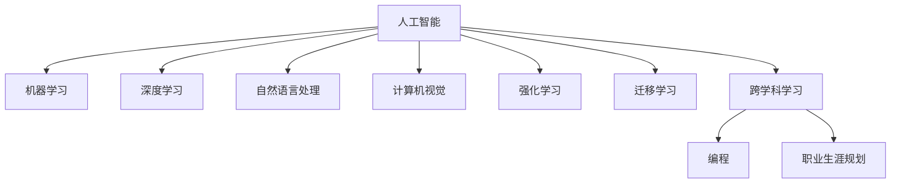

                 

# 程序员如何应对人工智能时代的职业转型

## 1. 背景介绍

### 1.1 问题由来

随着人工智能(AI)技术的飞速发展，全球劳动力市场正在经历前所未有的变革。一方面，自动化和智能化的浪潮正在改变传统的工作方式和商业模式，对传统岗位造成了巨大冲击。另一方面，AI技术的发展也创造了新的职业机会，对具备AI技术能力的人才需求不断增加。

对传统程序员来说，如何在新旧交替的变革中保持竞争力，实现职业生涯的顺利转型，成为迫在眉睫的课题。AI时代的到来，要求程序员不仅掌握传统的编程技能，还需要掌握AI相关的知识和技能，如机器学习、深度学习、自然语言处理等，以便更好地适应未来的工作环境。

### 1.2 问题核心关键点

为了适应AI时代的职业转型，程序员需要了解以下核心关键点：

1. **AI与机器学习的概述**：理解AI的基本概念和应用场景，掌握机器学习的基本原理和技术。
2. **编程与AI的结合**：学会将AI技术融入传统编程中，提升程序性能和自动化能力。
3. **跨领域学习与实践**：拓展知识面，学习与AI相关的数学、统计学和工程学等跨学科知识。
4. **持续学习与技术更新**：紧跟AI领域的最新进展，保持技术更新和知识储备。
5. **职业生涯规划**：制定明确的职业发展目标，适应AI技术带来的岗位变化和职业转型。

## 2. 核心概念与联系

### 2.1 核心概念概述

为更好地理解AI时代的职业转型，本节将介绍几个密切相关的核心概念：

- **人工智能(Artificial Intelligence, AI)**：指通过计算机程序模仿人类智能行为，实现信息处理、决策制定、自然语言理解等任务。
- **机器学习(Machine Learning, ML)**：指通过数据驱动的方法，使计算机系统能够自动学习和改进。
- **深度学习(Deep Learning, DL)**：指使用多层神经网络进行复杂特征提取和模式识别，是机器学习的一个重要分支。
- **自然语言处理(Natural Language Processing, NLP)**：指让计算机理解和处理人类自然语言的技术。
- **计算机视觉(Computer Vision, CV)**：指让计算机理解和处理图像和视频数据的技术。
- **强化学习(Reinforcement Learning, RL)**：指通过奖励和惩罚机制，使计算机系统能够在交互中学习和优化行为策略。
- **迁移学习(Transfer Learning)**：指将一个领域学到的知识迁移到另一个领域，以提高新任务的性能。
- **跨学科学习(Cross-disciplinary Learning)**：指结合不同领域的知识和方法，形成更综合的能力。

这些核心概念之间的逻辑关系可以通过以下Mermaid流程图来展示：



这个流程图展示了一些核心概念之间的相互联系和扩展关系：

1. **基础概念**：AI、ML、DL等基础概念构成了AI技术的基本框架。
2. **应用领域**：NLP、CV、RL等应用领域体现了AI技术的具体应用。
3. **进阶技术**：迁移学习和跨学科学习拓展了AI技术的应用边界和深度。
4. **实践应用**：将AI技术融入编程，实现自动化和智能化的应用。
5. **职业发展**：通过跨学科学习和持续学习，程序员可以顺利实现职业转型。

这些核心概念共同构成了AI时代的职业转型框架，帮助程序员在技术变革中更好地定位和提升自我。

## 3. 核心算法原理 & 具体操作步骤
### 3.1 算法原理概述

AI时代的职业转型，本质上是程序员通过学习新技能和工具，掌握AI技术并将其应用于实际开发中的过程。这一过程包括以下几个关键步骤：

1. **基础学习**：掌握AI和ML的基本概念和原理。
2. **进阶学习**：深入学习DL、NLP、CV等AI应用领域的技术。
3. **实践应用**：将AI技术融入传统编程中，提升开发效率和程序性能。
4. **跨学科学习**：结合数学、统计学等跨学科知识，形成更综合的能力。
5. **持续学习**：紧跟AI领域的最新进展，不断更新知识储备。
6. **职业转型**：通过AI技术和跨学科知识，实现职业生涯的顺利转型。

### 3.2 算法步骤详解

以下是程序员应对AI时代职业转型的具体操作步骤：

**Step 1: 基础学习**
- 系统学习AI和ML的基本概念、算法和应用场景。
- 掌握Python、R等主流AI编程语言，熟悉常用的AI框架和库，如TensorFlow、PyTorch等。

**Step 2: 进阶学习**
- 深入学习DL、NLP、CV等AI应用领域的技术，如卷积神经网络、循环神经网络、Transformer模型等。
- 学习NLP相关的任务处理，如文本分类、情感分析、机器翻译等。
- 学习CV相关的图像处理和识别技术，如图像分类、目标检测、人脸识别等。
- 学习RL相关的强化学习算法，如Q-learning、策略梯度等。

**Step 3: 实践应用**
- 将AI技术融入传统编程中，提升程序性能和自动化能力。
- 使用AI工具和库进行数据预处理、特征工程、模型训练和评估等操作。
- 构建基于AI技术的解决方案，解决实际业务问题。

**Step 4: 跨学科学习**
- 拓展知识面，学习与AI相关的数学、统计学和工程学等跨学科知识。
- 参与跨学科项目，与其他领域的专业人士合作，提升跨领域协作能力。

**Step 5: 持续学习**
- 紧跟AI领域的最新进展，参加相关会议、培训和课程，保持技术更新。
- 加入AI社区，关注最新研究成果和技术动态。
- 建立自己的学习体系，定期回顾和更新知识储备。

**Step 6: 职业转型**
- 根据个人兴趣和职业目标，制定明确的职业发展计划。
- 参与相关领域的实际项目，积累实战经验。
- 拓展人脉，寻找职业转型机会，进入AI相关的领域或岗位。

### 3.3 算法优缺点

AI时代的职业转型，具有以下优点：
1. **广阔的职业前景**：AI技术的应用前景广阔，程序员可以通过转型进入高薪、高需求的新兴领域。
2. **技能提升**：通过学习AI技术，程序员可以提升自身技术水平和竞争力，开拓新的职业道路。
3. **创新机会**：AI技术的应用为程序员提供了更多创新和创业的机会，推动职业发展。

同时，也存在一些缺点：
1. **学习成本高**：学习AI技术需要时间和精力投入，需要克服较大的学习曲线。
2. **技术更新快**：AI领域技术更新迅速，需要不断学习和适应新的技术变化。
3. **岗位竞争激烈**：AI技术人才需求量大，但竞争也相当激烈，需要具备较强的学习能力和适应能力。

尽管存在这些缺点，但AI时代的职业转型仍是大势所趋，程序员需要积极面对并克服这些挑战。

### 3.4 算法应用领域

AI技术的广泛应用，为程序员提供了广阔的职业转型空间。以下是一些主要的应用领域：

1. **机器学习工程师**：负责构建和优化机器学习模型，解决实际业务问题。
2. **深度学习工程师**：专注于深度学习算法的开发和应用，如计算机视觉、自然语言处理等。
3. **数据科学家**：利用数据挖掘、统计分析等技术，提取有价值的信息，辅助决策。
4. **AI产品经理**：负责AI产品的规划和项目管理，推动AI技术的商业化应用。
5. **AI架构师**：设计AI系统的架构和技术栈，解决复杂的技术问题。
6. **跨学科工程师**：结合多个学科的知识，构建具有创新性的AI解决方案。

## 4. 数学模型和公式 & 详细讲解 & 举例说明
### 4.1 数学模型构建

AI技术的学习和应用，离不开数学模型和公式的支撑。以下是一些常用的数学模型和公式，用于解释AI技术的原理和应用。

**线性回归模型**：用于预测连续数值型数据的模型，公式为：

$$y = \beta_0 + \beta_1 x_1 + \beta_2 x_2 + \cdots + \beta_n x_n + \epsilon$$

其中，$y$ 为预测结果，$x_i$ 为输入特征，$\beta_i$ 为回归系数，$\epsilon$ 为误差项。

**逻辑回归模型**：用于分类任务的模型，公式为：

$$P(y=1|x) = \frac{1}{1+e^{-z}}$$

其中，$z = \beta_0 + \beta_1 x_1 + \beta_2 x_2 + \cdots + \beta_n x_n$，$y$ 为分类结果，$x_i$ 为输入特征，$\beta_i$ 为回归系数。

**卷积神经网络(CNN)**：用于图像处理的深度学习模型，公式为：

$$y=f(W*x+b)$$

其中，$f$ 为激活函数，$W$ 为权重矩阵，$x$ 为输入图像，$b$ 为偏置项。

**Transformer模型**：用于自然语言处理的模型，公式为：

$$y=softmax(W_2[W_1 e^{W_3x}] + b)$$

其中，$W_1, W_2, W_3$ 为权重矩阵，$x$ 为输入序列，$y$ 为输出序列。

**强化学习算法**：用于智能体在环境中学习和决策的算法，公式为：

$$Q(s,a)=r+\gamma \max_{a'} Q(s',a')$$

其中，$Q(s,a)$ 为状态-动作的Q值，$r$ 为即时奖励，$s'$ 为下一状态，$\gamma$ 为折扣因子。

### 4.2 公式推导过程

以下是一些常用数学模型的推导过程，帮助程序员理解其原理和应用。

**线性回归模型推导**：

假设已知样本数据 $(x_i, y_i), i=1,2,\cdots,n$，线性回归模型的目标是最小化预测值与真实值之间的均方误差：

$$\min_{\beta_0, \beta_1, \cdots, \beta_n} \sum_{i=1}^n (y_i - (\beta_0 + \beta_1 x_1 + \beta_2 x_2 + \cdots + \beta_n x_n))^2$$

通过求导并令导数为0，得到回归系数 $\beta_i$ 的计算公式：

$$\beta_i = \frac{\sum_{i=1}^n (x_i-\bar{x})(y_i-\bar{y})}{\sum_{i=1}^n (x_i-\bar{x})^2}$$

其中，$\bar{x}$ 和 $\bar{y}$ 分别为样本数据的均值。

**逻辑回归模型推导**：

逻辑回归模型的目标是最大化似然函数，即：

$$\max_{\beta_0, \beta_1, \cdots, \beta_n} \prod_{i=1}^n P(y_i|x_i)$$

其中，$P(y_i|x_i)$ 为给定输入 $x_i$ 时，输出为 $y_i$ 的概率。

通过求导并令导数为0，得到回归系数 $\beta_i$ 的计算公式：

$$\beta_i = \frac{\sum_{i=1}^n (x_i-\bar{x})(y_i-\bar{y})}{\sum_{i=1}^n (x_i-\bar{x})^2}$$

其中，$\bar{x}$ 和 $\bar{y}$ 分别为样本数据的均值。

**卷积神经网络推导**：

卷积神经网络的目标是通过卷积和池化操作，提取输入图像的特征，公式为：

$$y=f(W*x+b)$$

其中，$f$ 为激活函数，$W$ 为权重矩阵，$x$ 为输入图像，$b$ 为偏置项。

通过反向传播算法，计算卷积层的梯度和权重更新公式：

$$\Delta W = \frac{\partial L}{\partial W} = \nabla \sum_{i=1}^n [y_i - f(W*x_i + b)]^2$$

**Transformer模型推导**：

Transformer模型的目标是通过自注意力机制，学习输入序列的依赖关系，公式为：

$$y=softmax(W_2[W_1 e^{W_3x}] + b)$$

其中，$W_1, W_2, W_3$ 为权重矩阵，$x$ 为输入序列，$y$ 为输出序列。

通过反向传播算法，计算Transformer的梯度和权重更新公式：

$$\Delta W = \frac{\partial L}{\partial W} = \nabla \sum_{i=1}^n [y_i - softmax(W_2[W_1 e^{W_3x}] + b)]^2$$

**强化学习算法推导**：

强化学习算法的目标是通过不断与环境互动，学习最优策略，公式为：

$$Q(s,a)=r+\gamma \max_{a'} Q(s',a')$$

其中，$Q(s,a)$ 为状态-动作的Q值，$r$ 为即时奖励，$s'$ 为下一状态，$\gamma$ 为折扣因子。

通过迭代优化算法，计算强化学习算法的梯度和权重更新公式：

$$\Delta Q = \alpha (r+\gamma \max_{a'} Q(s',a')-Q(s,a))$$

其中，$\alpha$ 为学习率，$Q(s,a)$ 为目标状态-动作的Q值。

### 4.3 案例分析与讲解

以下是几个AI技术应用的案例分析，帮助程序员更好地理解其应用场景和原理。

**案例1: 图像分类**
- **任务**：识别输入图像中的物体类别，如猫、狗、汽车等。
- **算法**：使用卷积神经网络(CNN)，通过多层卷积和池化操作提取图像特征，利用softmax函数进行分类。
- **公式**：
  - 卷积层：$y=f(W*x+b)$
  - 池化层：$y=\max_{i,j}(W*x+b)$
  - 分类层：$y=softmax(W_2[W_1 e^{W_3x}] + b)$

**案例2: 文本分类**
- **任务**：将输入文本分类为不同类别，如情感分类、主题分类等。
- **算法**：使用Transformer模型，通过自注意力机制学习输入序列的依赖关系，利用softmax函数进行分类。
- **公式**：
  - 自注意力机制：$y=softmax(W_2[W_1 e^{W_3x}] + b)$
  - 分类层：$y=softmax(W_2[W_1 e^{W_3x}] + b)$

**案例3: 强化学习游戏**
- **任务**：训练智能体在指定游戏中做出最优决策，如打砖块游戏、迷宫游戏等。
- **算法**：使用Q-learning算法，通过迭代优化更新Q值，使智能体在每个状态下选择最优动作。
- **公式**：
  - Q值更新：$Q(s,a)=r+\gamma \max_{a'} Q(s',a')$
  - 状态-动作选择：$a=\arg\max_a Q(s,a)$

## 5. 项目实践：代码实例和详细解释说明
### 5.1 开发环境搭建

在进行AI项目开发前，首先需要准备好开发环境。以下是使用Python进行TensorFlow开发的环境配置流程：

1. 安装Anaconda：从官网下载并安装Anaconda，用于创建独立的Python环境。

2. 创建并激活虚拟环境：
```bash
conda create -n tf-env python=3.8 
conda activate tf-env
```

3. 安装TensorFlow：从官网获取对应版本的安装命令。例如：
```bash
pip install tensorflow-gpu==2.6
```

4. 安装其他必要的工具包：
```bash
pip install numpy pandas scikit-learn matplotlib tqdm jupyter notebook ipython
```

完成上述步骤后，即可在`tf-env`环境中开始AI项目开发。

### 5.2 源代码详细实现

以下是使用TensorFlow实现图像分类任务的代码实现：

```python
import tensorflow as tf
from tensorflow.keras import layers

# 加载数据集
(x_train, y_train), (x_test, y_test) = tf.keras.datasets.cifar10.load_data()

# 数据预处理
x_train = x_train / 255.0
x_test = x_test / 255.0

# 构建模型
model = tf.keras.Sequential([
    layers.Conv2D(32, (3, 3), activation='relu', input_shape=(32, 32, 3)),
    layers.MaxPooling2D((2, 2)),
    layers.Conv2D(64, (3, 3), activation='relu'),
    layers.MaxPooling2D((2, 2)),
    layers.Flatten(),
    layers.Dense(64, activation='relu'),
    layers.Dense(10)
])

# 编译模型
model.compile(optimizer=tf.keras.optimizers.Adam(learning_rate=0.001),
              loss=tf.keras.losses.SparseCategoricalCrossentropy(from_logits=True),
              metrics=['accuracy'])

# 训练模型
model.fit(x_train, y_train, epochs=10, validation_data=(x_test, y_test))

# 评估模型
model.evaluate(x_test, y_test)
```

### 5.3 代码解读与分析

让我们再详细解读一下关键代码的实现细节：

**数据加载**：
- 使用TensorFlow内置的CIFAR-10数据集，包含60000个32x32x3的彩色图像，标签为10个类别。
- 通过`tf.keras.datasets.cifar10.load_data()`函数加载数据集，并分为训练集和测试集。

**数据预处理**：
- 将图像像素值归一化到0-1之间，以提高模型的收敛速度。
- 数据预处理模块是TensorFlow模型的重要组成部分，直接影响模型的性能。

**模型构建**：
- 使用`tf.keras.Sequential()`函数定义模型结构，包括卷积层、池化层、全连接层等。
- 卷积层使用`layers.Conv2D()`函数，指定卷积核大小、通道数和激活函数。
- 池化层使用`layers.MaxPooling2D()`函数，指定池化大小。
- 全连接层使用`layers.Dense()`函数，指定神经元个数和激活函数。

**模型编译**：
- 使用`model.compile()`函数编译模型，指定优化器、损失函数和评估指标。
- 优化器使用Adam算法，学习率为0.001。
- 损失函数使用稀疏分类交叉熵损失函数，适用于多分类任务。
- 评估指标使用准确率。

**模型训练**：
- 使用`model.fit()`函数训练模型，指定训练数据、训练轮数和验证数据。
- 训练轮数为10轮，验证集用于监控模型性能。

**模型评估**：
- 使用`model.evaluate()`函数评估模型性能，输出测试集上的准确率。

可以看到，TensorFlow提供了便捷的API和丰富的组件，使得AI项目的开发变得简便高效。通过以上代码，程序员可以轻松构建并训练一个图像分类模型，实现基本的AI应用。

## 6. 实际应用场景
### 6.1 智能客服系统

基于AI技术的智能客服系统，可以广泛应用于各行业。传统客服模式存在响应时间长、服务质量不稳定等问题，而智能客服系统能够7x24小时不间断服务，快速响应客户咨询，提高客户满意度。

在实际应用中，可以通过训练自然语言处理模型，对客户咨询进行文本分类、实体识别、情感分析等处理，自动匹配最佳答复模板，生成自然流畅的回复。同时，系统还可以接入实时客服数据，动态优化回复内容，提升客户体验。

### 6.2 金融舆情监测

金融机构需要实时监测市场舆情，及时应对负面信息传播，规避金融风险。AI技术可以用于实时抓取网络舆情数据，并进行文本分类、情感分析等处理，自动生成舆情报告，辅助决策。

具体而言，可以使用NLP模型对舆情数据进行情感倾向分析，识别负面舆情并及时预警。同时，结合机器学习算法进行舆情趋势预测，提供更加精准的风险评估和投资建议。

### 6.3 个性化推荐系统

当前的推荐系统往往只依赖用户的历史行为数据进行物品推荐，无法深入理解用户的真实兴趣偏好。AI技术可以通过训练推荐模型，结合用户浏览、点击、评论等数据，提取和用户交互的物品特征，进行个性化推荐。

具体而言，可以使用协同过滤、基于内容的推荐等算法，结合AI技术，构建更加精准的推荐系统。通过不断优化模型参数，提升推荐效果，满足用户的多样化需求。

### 6.4 未来应用展望

随着AI技术的不断进步，未来将会有更多创新应用出现，为各行各业带来变革性影响。

1. **医疗领域**：AI技术可以用于医疗影像诊断、病历分析、药物研发等，辅助医生诊断和治疗，加速新药开发进程。
2. **教育领域**：AI技术可以用于智能教育系统、作业批改、学情分析等，因材施教，提高教学质量。
3. **智慧城市**：AI技术可以用于城市事件监测、舆情分析、应急指挥等，提高城市管理的自动化和智能化水平。
4. **工业制造**：AI技术可以用于智能制造、质量检测、设备维护等，提升生产效率和产品质量。
5. **金融领域**：AI技术可以用于风险评估、投资决策、智能投顾等，提高金融服务的智能化水平。

这些应用场景展示了AI技术的广阔前景和潜力，未来将会有更多的AI技术应用到各行各业，推动社会的智能化进程。

## 7. 工具和资源推荐
### 7.1 学习资源推荐

为了帮助程序员系统掌握AI技术，以下是一些优质的学习资源：

1. 《机器学习实战》（Python版）：一本详细介绍机器学习算法的书籍，通过Python实现，适合初学者。
2. 《深度学习》（Ian Goodfellow）：一本全面介绍深度学习原理和应用的经典书籍，涵盖多种深度学习算法和模型。
3. 《自然语言处理综论》（Daniel Jurafsky & James H. Martin）：一本介绍自然语言处理技术和应用的综合书籍，适合深度学习和NLP的结合。
4. 《计算机视觉：模型、学习和推理》（Simon J.D. Prince & James H. Hacker）：一本介绍计算机视觉技术和应用的书籍，涵盖图像处理、目标检测、图像分割等。
5. 《强化学习》（Richard S. Sutton & Andrew G. Barto）：一本详细介绍强化学习算法和应用的经典书籍，适合深度学习和RL的结合。
6. 《TensorFlow实战》（Ganesh Kathiresan & Swapnil Asrani）：一本介绍TensorFlow编程和实际应用的书籍，适合TensorFlow初学者。

这些书籍和资源可以帮助程序员系统掌握AI技术，并应用于实际项目中。

### 7.2 开发工具推荐

高效的AI项目开发离不开优秀的工具支持。以下是几款用于AI项目开发的常用工具：

1. TensorFlow：由Google主导开发的深度学习框架，支持多种语言和平台，适合大规模工程应用。
2. PyTorch：Facebook开发的深度学习框架，灵活高效，适合研究与开发。
3. Jupyter Notebook：开源的交互式笔记本工具，支持Python、R等多种语言，适合数据科学和AI开发。
4. Keras：基于TensorFlow和Theano的高级API，适合快速原型设计和模型训练。
5. Scikit-learn：Python机器学习库，提供丰富的算法和工具，适合数据预处理和模型评估。
6. OpenCV：开源的计算机视觉库，提供图像处理、目标检测等算法，适合图像处理任务。

这些工具为AI项目提供了强大的支持，帮助程序员提高开发效率和效果。

### 7.3 相关论文推荐

AI技术的发展离不开学界的持续研究。以下是几篇奠基性的相关论文，推荐阅读：

1. AlexNet（ImageNet比赛冠军）：由Alex Krizhevsky等人提出，开启深度学习在计算机视觉领域的成功应用。
2. GoogLeNet（Inception模型）：由Google提出，通过卷积核的重用和分组，提升模型效率和性能。
3. RNN（循环神经网络）：由Hochreiter等人提出，广泛应用于文本处理和语音识别等任务。
4. Transformer（自注意力机制）：由Vaswani等人提出，显著提升NLP任务的性能。
5. ResNet（残差网络）：由He等人提出，通过残差连接解决深度网络训练中的梯度消失问题。
6. AlphaGo（强化学习）：由DeepMind提出，通过深度学习和强化学习技术，击败世界围棋冠军。

这些论文代表了大规模AI技术的发展脉络，通过学习这些前沿成果，可以帮助研究者把握学科前进方向，激发更多的创新灵感。

## 8. 总结：未来发展趋势与挑战
### 8.1 研究成果总结

AI时代的职业转型，为程序员提供了广阔的发展空间。通过系统学习AI和ML的基本概念和原理，深入掌握DL、NLP、CV等技术，将AI技术融入传统编程中，实现跨学科学习与实践应用，程序员可以在AI时代中发挥更大的价值。

### 8.2 未来发展趋势

AI技术的未来发展趋势包括：

1. **模型规模增大**：随着算力成本的下降和数据规模的扩张，预训练语言模型和深度学习模型的参数量还将持续增长，提升模型的性能和泛化能力。
2. **技术融合深入**：AI技术与其他技术（如物联网、区块链、大数据等）的深度融合，将推动更多创新应用的出现。
3. **人机协同加强**：AI技术与人类协作的加强，将使机器能够更好地理解人类需求，提供更加个性化的服务。
4. **伦理道德重视**：AI技术的广泛应用，要求在设计和开发过程中重视伦理道德，保障数据隐私和安全。
5. **开源社区活跃**：开源社区的活跃，将推动AI技术的普及和应用，降低企业技术门槛。

### 8.3 面临的挑战

尽管AI技术带来了诸多机遇，但也面临着诸多挑战：

1. **技术更新快**：AI技术更新迅速，要求程序员持续学习新技术，保持技术更新和知识储备。
2. **模型泛化差**：AI模型在不同数据分布下的泛化性能有限，需要进一步提升模型的鲁棒性和泛化能力。
3. **数据隐私保护**：AI技术的应用需要大量数据，如何保护用户隐私，是AI技术应用的重要问题。
4. **伦理道德问题**：AI技术的应用可能涉及伦理道德问题，如偏见、歧视等，需要重视和解决。
5. **社会适应性**：AI技术的应用需要与人类社会更好地适应和融合，解决社会接受度等问题。

### 8.4 研究展望

未来的AI技术研究需要从多个方向进行探索：

1. **跨领域融合**：AI技术与其他领域的深度融合，将带来更多创新应用，推动技术进步。
2. **模型鲁棒性提升**：提升模型的泛化能力和鲁棒性，使AI技术在更多场景下发挥作用。
3. **隐私保护技术**：开发更好的隐私保护技术，保障数据安全和用户隐私。
4. **伦理道德规范**：建立AI技术的伦理道德规范，引导AI技术健康发展。
5. **社会适应性研究**：研究AI技术与社会适应性的关系，推动AI技术的普及和应用。

通过这些方向的研究，AI技术将更好地服务于社会，推动技术进步和人类福祉的提升。

## 9. 附录：常见问题与解答

**Q1：如何学习AI和ML的基础概念？**

A: 可以通过以下步骤学习AI和ML的基础概念：

1. 阅读相关书籍：如《机器学习实战》、《深度学习》等书籍，系统学习AI和ML的基本原理和技术。
2. 参加在线课程：如Coursera、edX等平台上的相关课程，系统学习AI和ML的知识。
3. 参与社区讨论：加入AI相关的论坛和社区，如Stack Overflow、GitHub等，与他人交流和分享经验。
4. 实践项目开发：通过实践项目，巩固所学知识，提升实际应用能力。

**Q2：如何使用TensorFlow进行模型开发？**

A: 可以通过以下步骤使用TensorFlow进行模型开发：

1. 安装TensorFlow：从官网下载并安装TensorFlow。
2. 导入TensorFlow库：在Python脚本中导入TensorFlow库，如`import tensorflow as tf`。
3. 构建模型结构：使用TensorFlow提供的API，定义模型结构，如`tf.keras.Sequential()`、`tf.keras.layers`等。
4. 编译模型：使用`model.compile()`函数，指定优化器、损失函数和评估指标。
5. 训练模型：使用`model.fit()`函数，训练模型并监控训练过程。
6. 评估模型：使用`model.evaluate()`函数，评估模型性能。

**Q3：如何提升模型的泛化能力？**

A: 提升模型的泛化能力，可以从以下几个方面入手：

1. 数据增强：通过数据增强技术，扩充训练集，提高模型的泛化能力。
2. 正则化：使用L2正则、Dropout等正则化技术，避免过拟合。
3. 迁移学习：将预训练模型的知识迁移到新任务中，提升模型的泛化能力。
4. 对抗训练：引入对抗样本，提高模型的鲁棒性，提升泛化能力。
5. 模型集成：将多个模型集成起来，提升整体的泛化能力。

通过以上方法，可以显著提升模型的泛化能力，使其在更多场景下发挥作用。

**Q4：如何处理数据隐私问题？**

A: 处理数据隐私问题，可以从以下几个方面入手：

1. 数据匿名化：通过数据匿名化技术，保护用户隐私。
2. 数据加密：对数据进行加密处理，防止数据泄露。
3. 联邦学习：通过联邦学习技术，在保护数据隐私的前提下，训练模型。
4. 差分隐私：使用差分隐私技术，保护个体数据的隐私。

通过以上方法，可以有效保护数据隐私，保障用户的安全。

---

作者：禅与计算机程序设计艺术 / Zen and the Art of Computer Programming

