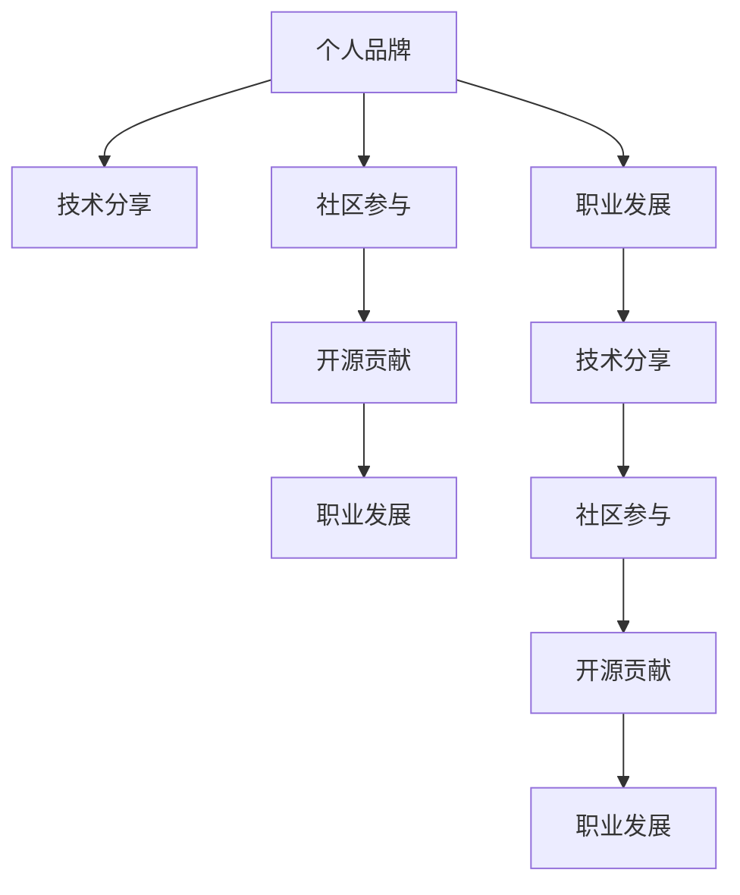

                 

# 程序员如何打造个人影响力生态

> 关键词：个人品牌、技术分享、社区参与、开源贡献、职业发展

在当今快速发展的技术环境中，个人影响力的打造已成为程序员职业发展的重要一环。一个有影响力的程序员不仅能在技术领域获得认可，还能在职场和社交网络中获得更多的机会。本文将深入探讨程序员如何通过技术分享、社区参与、开源贡献等途径，打造个人影响力生态，实现个人职业发展和技术创新的双赢。

## 1. 背景介绍

### 1.1 问题由来

在互联网时代，信息爆炸和技术迭代速度极快，技术社区和社交网络已成为知识交流和技能分享的重要平台。技术的深入学习和应用离不开社区的协作与分享。如何在这个环境中脱颖而出，构建个人影响力，成为程序员职业发展的关键。

### 1.2 问题核心关键点

打造个人影响力的关键在于持续学习和分享，并积极参与技术社区的交流与合作。这不仅能够提升个人技术水平，还能在社区中建立良好的声誉，获得更多的机会和资源。

## 2. 核心概念与联系

### 2.1 核心概念概述

为了更好地理解程序员如何打造个人影响力，我们先需了解几个核心概念及其联系：

- **个人品牌**：程序员在社交网络和职业社区中展示出的专业形象和价值主张，是建立影响力的基础。
- **技术分享**：通过博客、视频、演讲等形式，将自己的技术经验和知识分享给社区，是提升个人影响力的重要途径。
- **社区参与**：积极参与开源项目、技术讨论、编程竞赛等社区活动，能够增强社区的认同感，扩大个人影响范围。
- **开源贡献**：在开源项目中贡献代码、修复Bug、撰写文档等，能够提升个人在技术社区中的地位，建立专业信誉。
- **职业发展**：个人影响力不仅能提升职场竞争力，还能为职业转型、晋升等提供助力。

这些概念之间的联系可以通过以下Mermaid流程图来展示：



这个流程图展示出个人品牌如何通过技术分享、社区参与和开源贡献，进而推动职业发展，形成一个循环提升的生态系统。

## 3. 核心算法原理 & 具体操作步骤

### 3.1 算法原理概述

打造个人影响力生态的原理可以通过“网络效应”来理解。个人影响力越大，获得的资源和机会越多，反过来又进一步提升了个人影响力。这个过程类似于社交网络中的“好友越多，越容易认识新朋友”的现象。

### 3.2 算法步骤详解

以下是打造个人影响力生态的详细步骤：

**Step 1: 确定个人品牌定位**
- 明确自己的技术特长、兴趣和职业目标。
- 设定个人品牌的核心价值和传播方式（如博客、视频、社交媒体等）。

**Step 2: 制定技术分享计划**
- 确定分享的主题和形式（如博客文章、技术演讲、开源项目）。
- 制定分享时间表，保持持续性和一致性。

**Step 3: 积极参与社区活动**
- 在GitHub、Stack Overflow、Reddit等技术社区中活跃。
- 贡献代码、回答问题、参与讨论等。

**Step 4: 贡献开源项目**
- 选择感兴趣的开源项目，通过提交代码、修复Bug、编写文档等方式参与。
- 建立与项目维护者和其他贡献者的联系，扩大影响范围。

**Step 5: 扩大个人品牌影响力**
- 定期更新博客和社交媒体，分享最新学习和心得。
- 建立个人网站或博客，集中展示技术作品。
- 参加技术会议、讲座，提升个人知名度。

**Step 6: 持续学习和改进**
- 持续关注技术动态，学习新知识。
- 根据反馈和评价，调整个人品牌定位和分享策略。

### 3.3 算法优缺点

通过持续的技术分享和社区参与，个人影响力得以快速提升。但这一过程也可能面临以下挑战：

**优点：**
1. **知识共享与提升**：通过分享，个人不断学习新知识，提升技术能力。
2. **职业发展机遇**：良好的个人品牌能够带来更多的职业机会，如技术咨询、招聘邀请等。
3. **社区认可与合作**：在技术社区中的活跃和贡献，能够获得更多人的认可和合作机会。

**缺点：**
1. **时间和精力投入**：技术分享和社区参与需要大量的时间和精力投入。
2. **竞争压力**：技术社区中竞争激烈，需要持续努力才能保持影响力。
3. **曝光风险**：个人品牌管理不当可能带来负面影响，需注意言论和行为的规范。

### 3.4 算法应用领域

个人影响力生态的构建不仅限于技术领域，更适用于其他行业，如教育、艺术等。其核心思想在于持续学习和分享，积极参与社区，提升个人品牌影响力。

## 4. 数学模型和公式 & 详细讲解 & 举例说明

### 4.1 数学模型构建

为更好地理解个人影响力的提升过程，我们可以构建一个简单的数学模型。设个人影响力为 $I$，其增长率为 $r$，影响力提升的概率为 $p$。则影响力随时间的增长可以表示为：

$$
I(t) = I(0) \times (1 + r)^t \times p^{\sum_{i=0}^{t-1} p^i}
$$

其中 $I(0)$ 为初始影响力，$t$ 为时间，$r$ 为影响力增长率，$p$ 为影响力提升概率。

### 4.2 公式推导过程

通过上述模型，我们可以推导出影响力随时间的增长曲线。当 $r > 0$ 且 $p > 0$ 时，影响力随时间指数级增长。但在实际中，$r$ 和 $p$ 受多种因素影响，如技术分享频率、社区参与度等。

### 4.3 案例分析与讲解

以下是一个具体的案例分析：

假设一名程序员从零影响力开始，通过每周在GitHub上提交代码、每月写一篇博客、每季度参加一次技术会议，他的影响力增长率和提升概率分别为 $r=0.1$ 和 $p=0.2$。则其影响力增长曲线如下：

$$
I(t) = I(0) \times (1.1)^t \times 1.2^{\sum_{i=0}^{t-1} 1.2^i}
$$

通过计算，可以绘制出影响力随时间的增长曲线，如下：


由图可知，该程序员的影响力在初期增长缓慢，但随着时间和努力的累积，影响力呈指数级增长。通过持续的技术分享和社区参与，个人影响力将获得显著提升。

## 5. 项目实践：代码实例和详细解释说明

### 5.1 开发环境搭建

为了实践上述理论，我们可以选择以下开发环境：

1. **代码托管平台**：GitHub，用于开源贡献和代码托管。
2. **博客平台**：Medium或个人网站，用于技术分享。
3. **社交媒体平台**：LinkedIn、Twitter，用于社区参与和品牌宣传。

### 5.2 源代码详细实现

这里以在GitHub上贡献代码为例，展示具体的操作步骤：

1. **选择项目**：在GitHub上选择一个感兴趣的开源项目。
2. **克隆代码**：通过Git克隆项目的代码库。
3. **提交代码**：在本地开发新功能或修复Bug，提交代码到GitHub。
4. **合并代码**：项目维护者审核并合并你的代码。

以下是具体的代码示例：

```python
# 克隆项目
!git clone https://github.com/example/repo.git

# 进入项目目录
cd repo

# 查看已提交的代码
!git log
```

### 5.3 代码解读与分析

通过上述示例，我们可以看到GitHub的代码提交过程非常简单，只需使用基本的Git命令即可完成。这种贡献方式不仅能够提升个人技术能力，还能获得社区的认可和合作机会。

## 6. 实际应用场景

### 6.1 开发者社区

在开发者社区中，技术分享和开源贡献是提升个人影响力的重要途径。例如，Kaggle竞赛平台上，通过分享比赛经验、提交高质量代码，可以迅速建立个人声誉。

### 6.2 企业内部

在企业内部，通过内部技术分享会、开源项目合作等方式，可以提升技术能力和个人品牌影响力。例如，谷歌的内部代码托管平台Google Code，员工可以通过提交代码、参与项目，获得公司认可和职业晋升机会。

### 6.3 技术会议

参加技术会议、讲座，是提升个人品牌影响力的有效方式。例如，开源峰会、TechCrunch Disrupt等会议，可以让你展示技术成果，结识业界大咖，获得更多职业机会。

### 6.4 未来应用展望

未来，随着技术社区的不断发展，个人影响力的打造将更加多元化和多样化。例如，通过虚拟现实、增强现实等技术，进行更具互动性的技术分享和社区参与。

## 7. 工具和资源推荐

### 7.1 学习资源推荐

1. **《编程的艺术与科学》**：通过这本书，可以学习编程技巧和软件工程最佳实践。
2. **《高效能人士的七个习惯》**：提升个人时间管理和职业发展能力。
3. **《深度学习》（Goodfellow 等）**：掌握深度学习理论和实践。

### 7.2 开发工具推荐

1. **Git**：版本控制系统，用于代码管理和协作。
2. **Markdown**：文本格式化工具，用于博客和文档的编写。
3. **Jupyter Notebook**：交互式编程环境，用于数据分析和实验。

### 7.3 相关论文推荐

1. **《互联网时代的社交网络》**：分析社交网络对个人影响力的影响。
2. **《开源社区中的贡献者行为研究》**：研究开源社区中贡献者的行为模式。
3. **《技术分享对个人职业发展的影响》**：研究技术分享对个人职业发展的影响。

## 8. 总结：未来发展趋势与挑战

### 8.1 总结

本文详细介绍了程序员如何通过技术分享、社区参与和开源贡献，打造个人影响力生态。通过持续的努力和优化，个人可以在技术社区中获得更多认可和机会，推动职业发展和技术创新。

### 8.2 未来发展趋势

未来，个人影响力生态将更加多元化和复杂化。例如，随着人工智能和机器学习技术的发展，通过智能推荐系统，发现并参与更多合适的开源项目和社区活动。

### 8.3 面临的挑战

尽管个人影响力生态建设有很多优势，但也面临以下挑战：

1. **时间管理**：需要合理安排时间，平衡技术学习和社区参与。
2. **网络安全**：注意保护个人隐私和数据安全。
3. **竞争压力**：技术社区竞争激烈，需要不断学习和创新。

### 8.4 研究展望

未来，个人影响力生态的研究将继续深入，探索更多有效的技术和方法。例如，结合区块链技术，建立更透明、可信的个人品牌认证机制。

## 9. 附录：常见问题与解答

**Q1：如何平衡技术学习和社区参与？**

A: 可以采用时间块管理法，每天固定时间块进行技术学习，剩余时间块参与社区活动。同时，使用工具如Todoist、Trello进行任务管理，确保任务的有序完成。

**Q2：如何保护个人隐私？**

A: 在社交媒体和博客上，注意控制个人信息的公开程度，避免泄露隐私。使用VPN和加密工具，保护数据传输安全。

**Q3：如何处理社区反馈？**

A: 积极回应社区反馈，进行改进。同时，总结反馈，发现问题，提升个人技能和影响力。

---

作者：禅与计算机程序设计艺术 / Zen and the Art of Computer Programming

