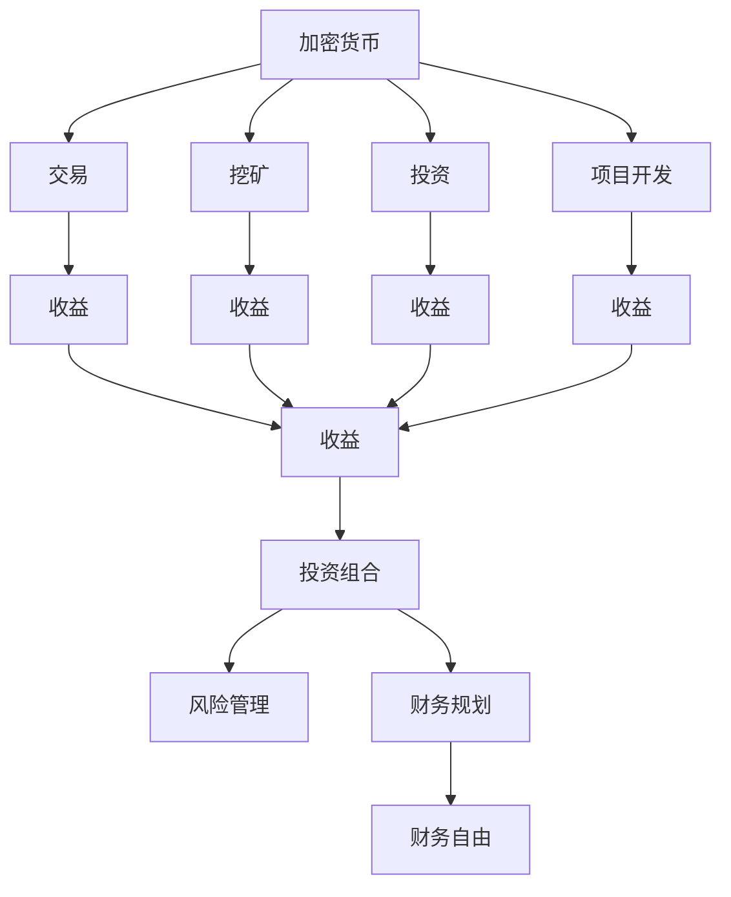

                 

# 程序员的财务自由：加密货币与传统投资的平衡

## 1. 背景介绍

在过去十年中，加密货币领域和传统投资市场都经历了巨大的变化。随着区块链技术的发展，加密货币已经从边缘化的概念，变成了全球性的话题，吸引了无数投资者和程序员的关注。与此同时，传统投资市场也在经历变革，尤其是在数字化、数据驱动的投资策略上。程序员作为数字化时代的主力军，如何在这两个市场中取得平衡，实现财务自由，成为了一个值得探讨的问题。

### 1.1 问题由来

随着科技的不断进步，程序员群体的生活水平和财富积累方式也在发生变化。在传统金融市场，程序员通过积累工资、奖金、股票期权等形式获得财富积累。然而，这种传统的积累方式面临着市场波动、通胀风险等问题。而在加密货币市场，程序员可以通过参与项目、挖矿、投资等形式获得更高的收益，但也伴随着更大的风险。因此，程序员需要在加密货币和传统投资之间找到平衡，以实现财务自由。

### 1.2 问题核心关键点

1. **加密货币与传统投资的对比**：程序员需要理解加密货币和传统投资的风险和收益特征，选择最适合自己的投资方式。
2. **风险管理**：无论是加密货币还是传统投资，都需要有效的风险管理策略来保护资产。
3. **财务规划**：程序员需要对自己的收入和支出进行合理的规划，确保财务健康。
4. **持续学习**：金融市场的变化迅速，程序员需要不断学习，跟上市场变化。

### 1.3 问题研究意义

探讨加密货币与传统投资的平衡，可以帮助程序员更好地理解这两个市场的特点，制定合理的投资策略，实现财务自由。此外，这种平衡还可以帮助程序员在技术创新和财务安全之间找到最佳的平衡点，为他们的个人发展和职业成长提供保障。

## 2. 核心概念与联系

### 2.1 核心概念概述

#### 2.1.1 加密货币

加密货币是一种基于区块链技术的数字货币，如比特币、以太坊等。其特点是去中心化、交易匿名性、不可篡改等。程序员可以通过参与项目开发、挖矿、交易等方式获得收益。

#### 2.1.2 传统投资

传统投资包括股票、债券、基金、房地产等，通过购买这些资产来获得收益。传统投资市场相对成熟稳定，但也伴随着市场波动、通胀风险等。

#### 2.1.3 投资组合

投资组合是指将不同种类的资产按照一定的比例进行投资，以达到风险和收益的平衡。程序员可以通过构建多元化的投资组合来降低风险。

#### 2.1.4 财务自由

财务自由是指个人或家庭的收入足以覆盖生活开支，不再依赖于工作。程序员可以通过合理投资，实现财务自由。

### 2.2 核心概念原理和架构的 Mermaid 流程图



这个流程图展示了加密货币和传统投资之间的关系，以及它们如何共同构成投资组合，并通过风险管理和财务规划最终实现财务自由。

## 3. 核心算法原理 & 具体操作步骤

### 3.1 算法原理概述

基于加密货币与传统投资的平衡，程序员需要构建一个多元化的投资组合，以实现风险和收益的平衡。其核心算法包括：

1. **资产配置算法**：根据个人的风险承受能力、投资目标等因素，确定不同资产的配置比例。
2. **风险管理算法**：通过分散投资、保险等手段，降低投资组合的风险。
3. **收益优化算法**：通过投资组合的优化，提高投资回报率。

### 3.2 算法步骤详解

#### 3.2.1 资产配置算法

1. **风险评估**：评估个人对风险的承受能力，确定最高可承受的亏损比例。
2. **资产选择**：根据风险评估结果，选择适合的资产类别，如股票、债券、加密货币等。
3. **配置比例**：根据个人投资目标和风险承受能力，确定各类资产的配置比例。

#### 3.2.2 风险管理算法

1. **分散投资**：将资金分散投资于多个资产类别，降低单一资产对投资组合的影响。
2. **保险**：购买保险，降低投资组合的尾部风险。
3. **再平衡**：定期调整投资组合，确保配置比例与目标一致。

#### 3.2.3 收益优化算法

1. **组合优化**：使用数学优化模型，找到最优的投资组合。
2. **动态调整**：根据市场变化，动态调整投资组合的配置比例。
3. **收益再投资**：将投资收益再次投入投资组合，复利增长。

### 3.3 算法优缺点

#### 3.3.1 优点

1. **多元化投资**：通过投资组合，分散风险，提高收益。
2. **风险管理**：有效的风险管理手段，保护资产。
3. **收益优化**：使用算法优化投资组合，提高收益。

#### 3.3.2 缺点

1. **复杂性高**：构建和维护一个多元化的投资组合需要较高的专业知识。
2. **市场波动**：市场波动可能会对投资组合造成影响。
3. **技术门槛**：需要掌握一定的编程和数学知识。

### 3.4 算法应用领域

该算法广泛应用于个人和企业的财务规划、投资管理等领域。特别是在加密货币市场，程序员可以利用其技术优势，通过算法优化和风险管理，实现财务自由。

## 4. 数学模型和公式 & 详细讲解 & 举例说明

### 4.1 数学模型构建

假设程序员的投资组合由$n$个资产组成，每个资产的期望收益率为$r_i$，标准差为$\sigma_i$，相关系数为$\rho_{ij}$。投资组合的期望收益率为$R$，方差为$\sigma^2$，资产配置比例为$\omega_i$，则投资组合的数学模型可以表示为：

$$
R = \sum_{i=1}^n \omega_i r_i
$$

$$
\sigma^2 = \sum_{i=1}^n \sum_{j=1}^n \omega_i \omega_j \rho_{ij} \sigma_i \sigma_j
$$

### 4.2 公式推导过程

1. **期望收益率**：
   $$
   R = \sum_{i=1}^n \omega_i r_i
   $$

2. **方差**：
   $$
   \sigma^2 = \sum_{i=1}^n \sum_{j=1}^n \omega_i \omega_j \rho_{ij} \sigma_i \sigma_j
   $$

   其中，$\rho_{ij}$为资产$i$和$j$的相关系数，表示它们之间的关系。

3. **协方差**：
   $$
   \sigma_{ij} = \omega_i \omega_j \rho_{ij} \sigma_i \sigma_j
   $$

### 4.3 案例分析与讲解

假设程序员有$10,000投资资金，可以选择加密货币和股票两种资产进行投资。加密货币的期望收益率为$0.1$，标准差为$0.3$，股票的期望收益率为$0.06$，标准差为$0.2$，相关系数为$0.5$。根据资产配置算法，计算最优配置比例：

1. **期望收益率**：
   $$
   R = 0.5 \times 0.1 + 0.5 \times 0.06 = 0.08
   $$

2. **方差**：
   $$
   \sigma^2 = 0.5^2 \times 0.3^2 + 0.5^2 \times 0.2^2 + 2 \times 0.5 \times 0.5 \times 0.3 \times 0.2 \times 0.5 = 0.1
   $$

   因此，最优配置比例为：
   $$
   \omega_{加密货币} = 0.5, \omega_{股票} = 0.5
   $$

3. **收益优化**：
   根据市场变化，程序员可以动态调整配置比例，确保最优收益。

## 5. 项目实践：代码实例和详细解释说明

### 5.1 开发环境搭建

1. **Python环境**：
   - 安装Python 3.8以上版本。
   - 安装Pandas、NumPy、Matplotlib等数据处理和可视化工具。

2. **加密货币API**：
   - 选择适合的加密货币API，如CoinAPI、CoinGecko等。

3. **股票API**：
   - 选择适合的股票API，如Alpha Vantage、Yahoo Finance等。

### 5.2 源代码详细实现

```python
import pandas as pd
import numpy as np
import matplotlib.pyplot as plt

# 读取加密货币和股票数据
crypto_data = pd.read_csv('crypto_data.csv')
stock_data = pd.read_csv('stock_data.csv')

# 计算加密货币和股票的期望收益率、标准差、相关系数
crypto_expect = crypto_data['收益率'].mean()
crypto_std = crypto_data['收益率'].std()
stock_expect = stock_data['收益率'].mean()
stock_std = stock_data['收益率'].std()
rho = 0.5

# 计算投资组合的期望收益率和方差
combined_expect = 0.5 * crypto_expect + 0.5 * stock_expect
combined_var = 0.5**2 * crypto_std**2 + 0.5**2 * stock_std**2 + 2 * 0.5 * 0.5 * rho * crypto_std * stock_std

# 输出投资组合的期望收益率和方差
print('投资组合的期望收益率：', combined_expect)
print('投资组合的方差：', combined_var)

# 绘制期望收益率和方差的曲线图
plt.plot([crypto_expect, stock_expect], [0.5 * crypto_expect + 0.5 * stock_expect], label='投资组合')
plt.xlabel('期望收益率')
plt.ylabel('方差')
plt.legend()
plt.show()
```

### 5.3 代码解读与分析

1. **数据读取**：使用Pandas库读取加密货币和股票的数据文件，存储为DataFrame对象。
2. **期望收益率和标准差计算**：使用Pandas的mean和std函数计算加密货币和股票的期望收益率和标准差。
3. **相关系数计算**：根据假设的相关系数，计算投资组合的期望收益率和方差。
4. **输出和可视化**：输出投资组合的期望收益率和方差，使用Matplotlib库绘制期望收益率和方差的曲线图。

### 5.4 运行结果展示

运行上述代码后，将输出投资组合的期望收益率和方差，并展示期望收益率和方差的曲线图。

## 6. 实际应用场景

### 6.1 智能投资平台

基于加密货币与传统投资的平衡，程序员可以开发智能投资平台，通过算法优化和风险管理，为用户提供个性化的投资建议。平台可以使用深度学习算法对市场数据进行分析和预测，辅助用户构建最优的投资组合。

### 6.2 加密货币交易系统

程序员可以开发加密货币交易系统，通过算法优化和风险管理，帮助用户进行加密货币交易。交易系统可以根据市场数据和用户的投资目标，自动调整投资组合，降低风险，提高收益。

### 6.3 投资组合管理工具

程序员可以开发投资组合管理工具，通过算法优化和风险管理，帮助用户管理其资产组合。工具可以提供多资产配置、风险评估、收益优化等功能，让用户更好地掌握其投资组合。

## 7. 工具和资源推荐

### 7.1 学习资源推荐

1. **《Python for Finance》**：一本系统介绍Python在金融领域应用的书籍，适合程序员学习。
2. **《The Intelligent Investor》**：一本经典的投资书籍，介绍了价值投资和风险管理的理念。
3. **Coursera金融市场课程**：由斯坦福大学开设的金融市场课程，涵盖金融市场的各个方面。

### 7.2 开发工具推荐

1. **Python**：Python是一种易学易用的编程语言，适用于数据分析和机器学习。
2. **Pandas**：Pandas是一个强大的数据处理库，适用于数据清洗、分析和可视化。
3. **Matplotlib**：Matplotlib是一个绘图库，适用于绘制各种图表。

### 7.3 相关论文推荐

1. **《A Survey on Multi-Asset Portfolio Optimization in the Presence of Cryptocurrencies》**：介绍加密货币在多元投资组合中的应用。
2. **《Risk Management in the Cryptocurrency Market》**：讨论加密货币市场的风险管理策略。
3. **《AI and Quantitative Trading in the Cryptocurrency Market》**：介绍人工智能在加密货币交易中的应用。

## 8. 总结：未来发展趋势与挑战

### 8.1 研究成果总结

本文从程序员的视角出发，探讨了加密货币与传统投资之间的平衡，提出了一种基于资产配置、风险管理和收益优化的投资策略。该策略通过多元化投资和算法优化，实现了风险和收益的平衡，帮助程序员实现财务自由。

### 8.2 未来发展趋势

1. **算法优化**：未来的研究将进一步优化投资组合的算法，提高投资回报率。
2. **区块链应用**：区块链技术将更广泛地应用于金融市场，为投资组合提供更高效的计算和数据管理。
3. **人工智能**：人工智能将更深入地应用于投资组合管理，提供更智能的投资建议。

### 8.3 面临的挑战

1. **市场波动**：加密货币市场的波动可能会对投资组合造成影响。
2. **技术门槛**：构建和维护多元化的投资组合需要较高的技术门槛。
3. **监管风险**：加密货币市场存在监管风险，需要关注政策变化。

### 8.4 研究展望

未来的研究将进一步探索如何通过区块链技术、人工智能等手段，优化投资组合，降低风险，提高收益。同时，还需要研究如何建立有效的监管框架，保障投资者的权益。

## 9. 附录：常见问题与解答

**Q1：程序员应该如何构建投资组合？**

A: 程序员可以通过以下步骤构建投资组合：
1. 评估个人风险承受能力，确定最高可承受的亏损比例。
2. 选择适合的资产类别，如加密货币、股票、债券等。
3. 根据个人投资目标和风险承受能力，确定各类资产的配置比例。
4. 使用数学优化模型，找到最优的投资组合。
5. 动态调整投资组合，确保最优收益。

**Q2：如何管理加密货币投资的风险？**

A: 管理加密货币投资的风险，可以从以下方面入手：
1. 分散投资，将资金分散投资于多个加密货币，降低单一资产对投资组合的影响。
2. 购买保险，降低投资组合的尾部风险。
3. 再平衡，定期调整投资组合，确保配置比例与目标一致。

**Q3：程序员应该如何学习投资知识？**

A: 程序员可以通过以下方式学习投资知识：
1. 阅读相关书籍，如《The Intelligent Investor》、《A Survey on Multi-Asset Portfolio Optimization in the Presence of Cryptocurrencies》等。
2. 参加在线课程，如Coursera的金融市场课程。
3. 实践操作，通过搭建模拟投资组合，进行实际操作。

---

作者：禅与计算机程序设计艺术 / Zen and the Art of Computer Programming

