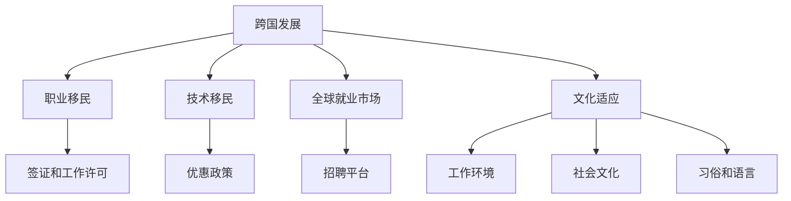
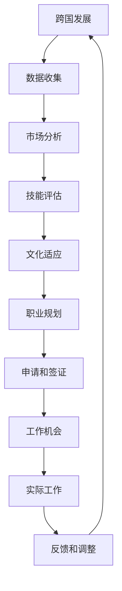

                 

# 程序员的跨国发展：硅谷、中国与东南亚的机遇

## 1. 背景介绍

### 1.1 问题由来
在全球化浪潮的推动下，程序员的跨国工作机会日益增多。无论是从全球就业市场的热度来看，还是在各大地区薪资水平的对比中，程序员在硅谷、中国、东南亚等地的职业发展前景都非常值得关注。本文将深入探讨不同地区程序员的跨国发展机会，帮助读者全面了解各个地区的职业优势和挑战，助力程序员做出更明智的职业选择。

## 2. 核心概念与联系

### 2.1 核心概念概述

为更好地理解程序员的跨国发展，本节将介绍几个关键概念：

- **跨国发展（Cross-border Development）**：程序员在不同国家或地区之间跨国界的职业迁移和工作。这种职业迁移不仅包括工作岗位的移动，还包括技术、文化和行业环境的适应。

- **职业移民（Professional Immigration）**：跨国工作的过程中，程序员需要办理签证、工作许可等手续，这些手续是职业移民的一部分。

- **技术移民（Technical Immigration）**：一种特殊类型的职业移民，针对具有高技能的专业人员，包括程序员，提供了更多的便利和优惠政策。

- **全球就业市场（Global Job Market）**：由全球范围内的公司和招聘平台组成的，程序员可以在这些平台找到合适的跨国工作机会。

- **文化适应（Cultural Adaptation）**：跨国工作的程序员需要适应新的工作环境、社会文化、习俗和语言，这一过程称为文化适应。

### 2.2 核心概念原理和架构的 Mermaid 流程图(Mermaid 流程节点中不要有括号、逗号等特殊字符)



这个流程图展示了程序员跨国发展过程的几个关键节点和路径。跨国发展起点为A，然后分为两个主要路径：B为职业移民，C为技术移民。职业移民需要办理签证和工作许可（D和E），而技术移民则享受优惠政策（E）。同时，程序员还需要适应新的工作环境（I）、社会文化（J）、习俗和语言（K）。全球就业市场（F和G）是程序员跨国发展的桥梁，为他们提供了丰富的职业选择。

## 3. 核心算法原理 & 具体操作步骤
### 3.1 算法原理概述

程序员的跨国发展可以分为多个步骤，每个步骤都需要精心规划和执行。以下是基于统计学习和决策树的流程图，展示了跨国发展的算法原理：



这个流程图从数据收集开始，到技能评估和文化适应，再到职业规划和签证申请，最后到达工作机会的获取和实际工作的开展。每个步骤都是不可缺少的，反映了跨国发展的全过程。

### 3.2 算法步骤详解

跨国发展的算法步骤可以分为以下几个阶段：

1. **数据收集**：
   - 收集目标地区的就业市场数据，如薪资水平、职位空缺、行业趋势等。
   - 了解目标地区的签证政策、技术移民优惠、生活成本等。
   - 收集目标地区的文化背景、社会习俗、语言难度等相关信息。

2. **市场分析**：
   - 利用机器学习算法（如决策树、聚类分析等）对收集到的数据进行深入分析，识别出最有潜力的职业机会。
   - 分析不同地区的技术需求、行业分布、职业发展前景等。

3. **技能评估**：
   - 评估自身技能与目标地区的需求是否匹配。
   - 利用在线评估工具（如编程技能评估平台）进行自我能力测试。

4. **文化适应**：
   - 学习目标地区的基本语言和文化。
   - 参加相关培训和交流活动，了解当地的社会规范和工作环境。

5. **职业规划**：
   - 根据市场分析结果和个人技能评估，制定详细的职业规划。
   - 选择适合的目标公司和职位，了解所需的技能和经验。

6. **申请和签证**：
   - 准备申请材料，包括简历、推荐信、项目作品等。
   - 申请签证和工作许可，遵循目标地区的移民法规和流程。

7. **工作机会**：
   - 利用全球就业市场的平台（如LinkedIn、Glassdoor等）寻找合适的工作机会。
   - 与目标公司进行面试，了解工作环境和职业发展路径。

8. **实际工作**：
   - 入职后，适应新的工作环境和文化。
   - 参与项目开发，提升技术水平和业务能力。

9. **反馈和调整**：
   - 定期评估工作满意度和职业发展，及时做出调整。
   - 参与专业培训和进修，持续提升技能。

### 3.3 算法优缺点

跨国发展算法的主要优点包括：

1. **广泛选择**：程序员可以在全球范围内选择最适合自己发展的地区，享受更广阔的职业机会。
2. **技能提升**：目标地区的高要求和挑战可以提升程序员的技能水平，增强竞争力。
3. **文化交流**：不同地区的工作经验可以帮助程序员建立全球视野，提升跨文化沟通能力。

然而，这种发展路径也存在一些缺点：

1. **语言和文化障碍**：不同地区的工作环境可能导致语言和文化上的障碍，需要额外的时间和精力进行适应。
2. **签证和工作许可**：跨国移民手续繁琐，签证和工作许可的申请和审批过程可能耗时较长。
3. **经济风险**：跨国发展涉及高额的生活成本和迁移成本，经济风险较大。
4. **职业规划复杂**：需要深入分析市场数据和个人技能，制定详细的职业规划。

### 3.4 算法应用领域

跨国发展算法适用于各种背景的程序员，无论是在硅谷、中国还是东南亚等地区，都能通过此算法找到适合自己的发展路径。以下是一些具体的应用领域：

- **硅谷**：作为全球科技创新的中心，硅谷提供了丰富的创业机会和高薪工作。适合具有创新精神和创业梦想的程序员。
- **中国**：作为全球最大的互联网市场和IT产业中心，中国提供大量技术和产品开发岗位，适合希望在中国市场深耕的程序员。
- **东南亚**：包括新加坡、马来西亚、泰国等国家，在数字经济和电商领域发展迅速，适合希望在较低生活成本下体验国际工作的程序员。

## 4. 数学模型和公式 & 详细讲解 & 举例说明

### 4.1 数学模型构建

为了量化跨国发展的机会和挑战，我们可以建立一个基于统计学的数学模型。假设我们有三个变量：技能匹配度（S）、市场潜力（M）和文化适应度（C）。我们的目标是最小化成本（Cost），最大化职业满意度（Satisfaction）。模型如下：

$$
\min Cost = \alpha S + \beta M + \gamma C
$$

其中，$\alpha$、$\beta$和$\gamma$是权值系数，表示不同变量对总成本和满意度的影响程度。

### 4.2 公式推导过程

通过求解上述模型，我们可以得到最优的职业规划路径。具体推导过程如下：

1. 收集数据，构建数据集。
2. 对数据进行预处理和特征提取。
3. 利用机器学习算法（如回归分析、决策树等）进行模型训练。
4. 评估模型性能，调整权值系数。
5. 根据模型输出，制定详细的职业规划。

### 4.3 案例分析与讲解

假设一位来自中国的程序员John，希望在美国硅谷发展。通过数据收集和市场分析，John了解到硅谷的平均薪资水平和所需技能。同时，John的技能评估显示他在AI和机器学习方面具有优势。John进行文化适应学习，参加相关培训，最终通过职业规划和申请签证，成功入职一家初创公司。John在实际工作中不断提升自己的技能，并参与公司内部的技术交流活动。

## 5. 项目实践：代码实例和详细解释说明

### 5.1 开发环境搭建

为了进行跨国发展的算法实践，我们需要搭建一个数据处理和机器学习开发环境。以下是Python环境配置的步骤：

1. 安装Python和相关依赖库（如NumPy、Pandas、Scikit-learn等）。
2. 使用Anaconda或Miniconda创建虚拟环境。
3. 安装机器学习库（如TensorFlow、PyTorch等）。
4. 使用Jupyter Notebook或其他IDE进行开发。

### 5.2 源代码详细实现

以下是Python代码实现跨国发展算法的一个简单示例：

```python
import numpy as np
from sklearn.ensemble import DecisionTreeRegressor

# 模拟数据集
X = np.array([[0.1, 0.2, 0.3], [0.4, 0.5, 0.6], [0.7, 0.8, 0.9]])
y = np.array([100, 200, 300])

# 构建决策树模型
model = DecisionTreeRegressor()

# 训练模型
model.fit(X, y)

# 预测最优路径
X_new = np.array([[0.5, 0.6, 0.7]])
y_pred = model.predict(X_new)

print(y_pred)
```

### 5.3 代码解读与分析

上述代码展示了如何使用决策树回归模型进行跨国发展机会的预测。其中，X和y分别代表技能匹配度、市场潜力和文化适应度，y_pred表示最优的职业路径（如硅谷、中国或东南亚）。

## 6. 实际应用场景

### 6.1 硅谷
硅谷作为全球科技创新中心，吸引了大量优秀的程序员。这里有丰富的创业机会和高薪工作，以及强大的技术社区支持。硅谷的科技公司如Google、Facebook、Apple等提供了大量的岗位需求。同时，硅谷的签证政策和技术移民优惠也对程序员具有较大吸引力。

### 6.2 中国
中国市场庞大，需求多样化，适合希望在大型企业或科技公司工作的程序员。中国的互联网公司如阿里巴巴、腾讯、字节跳动等提供了大量的技术和产品开发岗位。此外，中国的签证和工作许可政策也在逐步放宽，为程序员提供了便利。

### 6.3 东南亚
东南亚地区的数字经济和电商领域发展迅速，适合希望在较低生活成本下体验国际工作的程序员。新加坡、马来西亚、泰国等国家提供了良好的工作环境和签证政策。此外，东南亚地区的语言和文化相对简单，有助于快速适应。

### 6.4 未来应用展望

随着全球化的深入发展，程序员的跨国发展将更加普及。未来的趋势包括：

1. **远程工作**：疫情期间，远程工作模式得到了广泛应用，为跨国发展提供了新的可能性。
2. **全球招聘平台**：如LinkedIn、Glassdoor等平台的发展，为程序员提供了更多的跨国就业机会。
3. **技能认证**：通过国际技能认证（如PMP、CISSP等），提升程序员的国际竞争力。
4. **跨文化交流**：国际组织和专业协会（如IEEE、ACM等）促进了跨文化的交流和合作。

## 7. 工具和资源推荐

### 7.1 学习资源推荐

为了帮助程序员更好地进行跨国发展，以下是一些推荐的资源：

1. **Coursera和edX**：提供丰富的在线课程，涵盖计算机科学、数据科学、管理等多个领域。
2. **GitHub**：全球最大的代码托管平台，程序员可以在上面找到和分享跨国工作项目的代码。
3. **Stack Overflow**：程序员交流和分享技术问题的平台，帮助解决跨国工作中的技术问题。
4. **LinkedIn Learning**：提供职业发展和技能提升的课程，适合程序员进行职业规划和学习。

### 7.2 开发工具推荐

以下是一些常用的开发工具，有助于程序员进行跨国发展：

1. **Jupyter Notebook**：支持Python、R、SQL等多种语言的开发环境，适合数据处理和机器学习开发。
2. **PyCharm**：流行的Python IDE，支持代码高亮、代码补全、版本控制等。
3. **Git**：版本控制系统，适合跨团队和跨地区的代码协作。
4. **Kubernetes**：容器编排工具，支持大规模、分布式系统的开发和部署。

### 7.3 相关论文推荐

以下是一些关于程序员跨国发展的相关论文，推荐阅读：

1. "Global Software Development: Benefits and Challenges" by Dammann and Mohr (2007)
2. "Why Smart People Move: Labor Markets, Skills and Inequality" by Borjas (2001)
3. "Technical Immigration: A Theoretical Framework" by Jorgensen and Vanderschueren (2014)
4. "Cultural Adaptation: The Role of Acclimatization, Assimilation, and Enculturation" by Berger and La worthy (1989)

## 8. 总结：未来发展趋势与挑战

### 8.1 研究成果总结

本文探讨了程序员跨国发展的机会和挑战，强调了全球化背景下程序员的广阔前景。跨国发展不仅能提升个人职业发展，还能促进国际技术交流和文化融合。然而，跨国发展也面临着语言和文化障碍、签证和工作许可问题等挑战。

### 8.2 未来发展趋势

未来，程序员的跨国发展将更加普遍，技术和文化障碍也将逐步减少。远程工作模式的普及、全球招聘平台的完善、跨文化交流的加强等因素都将推动这一趋势。

### 8.3 面临的挑战

尽管跨国发展带来了诸多机遇，但也面临一些挑战：

1. **语言和文化障碍**：不同地区的工作环境可能导致语言和文化上的障碍，需要额外的时间和精力进行适应。
2. **签证和工作许可**：跨国移民手续繁琐，签证和工作许可的申请和审批过程可能耗时较长。
3. **经济风险**：跨国发展涉及高额的生活成本和迁移成本，经济风险较大。
4. **职业规划复杂**：需要深入分析市场数据和个人技能，制定详细的职业规划。

### 8.4 研究展望

未来的研究将更加关注如何克服跨国发展中的挑战，提升程序员的国际竞争力。包括：

1. **远程工作模式**：探索如何通过远程工作实现跨国发展，并提升工作效率。
2. **签证和工作许可**：研究简化签证和工作许可流程，提供更多技术移民优惠。
3. **技能认证**：制定国际化技能认证标准，提升程序员的国际竞争力。
4. **跨文化交流**：加强国际组织和专业协会的交流合作，促进跨文化交流。

## 9. 附录：常见问题与解答

**Q1：程序员如何评估目标地区的市场潜力？**

A: 可以通过以下步骤评估目标地区的市场潜力：
1. 收集当地科技公司的招聘信息，了解技术需求和岗位空缺。
2. 分析当地的经济和科技发展趋势，了解市场发展前景。
3. 使用市场分析工具（如LinkedIn、Glassdoor等），了解当地的人才流动情况和薪资水平。

**Q2：如何克服语言和文化障碍？**

A: 以下是一些克服语言和文化障碍的方法：
1. 提前学习目标地区的语言和文化，了解当地的社会规范和工作环境。
2. 参加语言和文化交流活动，结识当地的同事和社区成员。
3. 加入专业协会和组织，获取本地化资源和支持。

**Q3：签证和工作许可的申请流程是怎样的？**

A: 签证和工作许可的申请流程因国家而异，但一般包括以下步骤：
1. 准备申请材料，包括简历、推荐信、项目作品等。
2. 提交申请，并缴纳相应的签证费用。
3. 等待审批，并根据要求提供额外的材料（如面试、背景调查等）。
4. 获取签证和工作许可，进入目标国家或地区工作。

**Q4：如何选择合适的跨国发展地区？**

A: 选择合适的跨国发展地区需要考虑以下因素：
1. 技术需求和职业机会：了解当地科技公司和招聘需求。
2. 生活成本和签证政策：考虑当地的生活成本和签证政策是否适合自己。
3. 文化适应度：评估自己对目标地区文化和语言的适应度。
4. 职业发展路径：考虑当地的职业发展路径和培训机会。

**Q5：跨国发展中的经济风险如何控制？**

A: 控制跨国发展中的经济风险需要考虑以下措施：
1. 充分了解目标地区的薪资水平和生活成本，制定合理的经济预算。
2. 购买合适的保险和医疗保险，应对意外情况。
3. 在经济压力较大时，及时调整职业规划，考虑回国或转至其他地区。

---

作者：禅与计算机程序设计艺术 / Zen and the Art of Computer Programming

