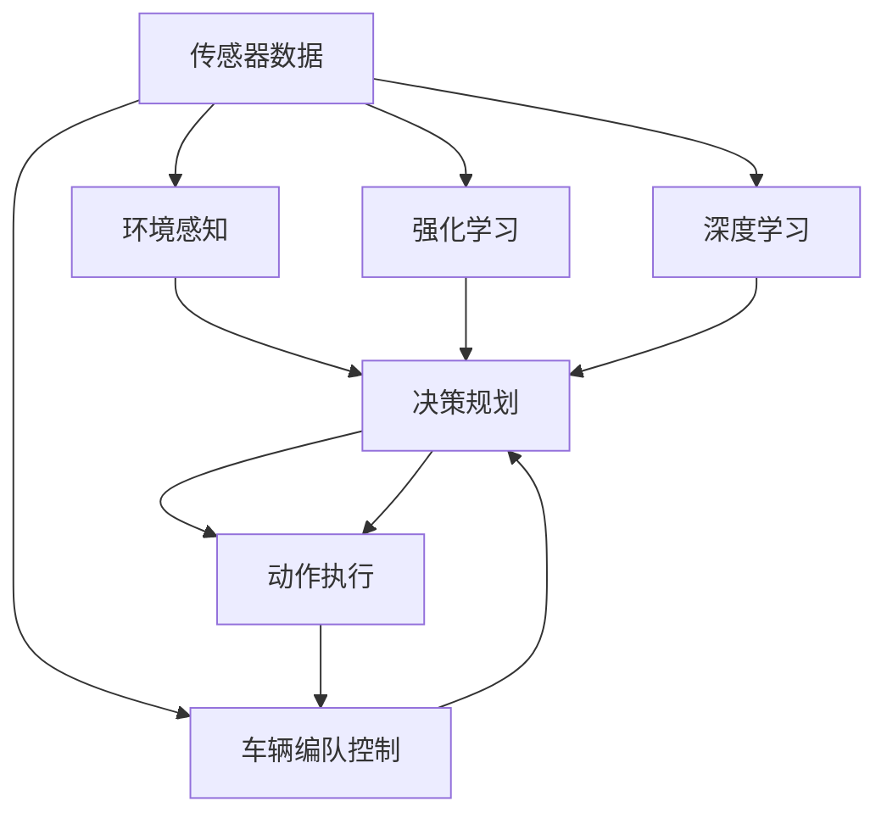

                 

# 端到端自动驾驶的车辆编队控制策略

> 关键词：自动驾驶, 车辆编队, 编队控制, 决策规划, 深度学习, 强化学习, 端到端, 车路协同

## 1. 背景介绍

随着人工智能和汽车技术的飞速发展，自动驾驶逐渐从科幻电影中的幻想转变为现实，成为当下最受关注的科技领域之一。其核心在于通过传感器和人工智能算法，实现车辆的自主导航和决策。端到端自动驾驶车辆不仅能够实现自主行驶，还具备车辆编队控制能力，能够安全、稳定地与其他车辆协同工作，为未来智慧交通体系奠定基础。

车辆编队控制是自动驾驶领域的一个重要研究方向。它涉及多辆车的协同与互动，需要综合考虑交通规则、车辆性能、环境因素等多个维度，是实现安全、高效、绿色交通的关键技术之一。本文将详细介绍端到端自动驾驶的车辆编队控制策略，并从算法原理、操作步骤、实际应用场景等多个方面展开分析。

## 2. 核心概念与联系

### 2.1 核心概念概述

- **端到端自动驾驶**：通过深度学习和强化学习等技术，直接从原始传感器数据到控制指令的映射，实现车辆自主导航和决策。
- **车辆编队控制**：多辆车在一定规则下协同工作，通过动态调整位置和速度，实现集群行驶，优化交通流，提升通行效率和安全性能。
- **决策规划**：在复杂的交通环境中，通过传感器数据感知周围环境，结合车辆特性和任务需求，生成路径规划和行为决策。
- **深度学习**：一种基于神经网络的机器学习方法，通过大量数据训练模型，提取和学习复杂特征，实现对动态环境的适应。
- **强化学习**：一种通过与环境互动学习最优策略的学习方式，用于训练自动驾驶模型在复杂交通场景中的行为决策能力。

这些概念之间存在紧密的联系，共同构成了端到端自动驾驶车辆编队控制的系统框架。深度学习和强化学习是决策规划的重要技术手段，车辆编队控制是最终的应用目标，而端到端自动驾驶则提供了一个完整的解决方案，实现从感知到决策到控制的端到端流程。

### 2.2 核心概念原理和架构的 Mermaid 流程图



这个流程图展示了端到端自动驾驶车辆编队控制的系统架构，其中：

- 传感器数据通过环境感知模块进行实时处理，获取周围环境信息。
- 决策规划模块根据环境信息，结合车辆特性和任务需求，生成路径规划和行为决策。
- 动作执行模块将决策结果转化为具体控制指令，实现车辆的实际控制。
- 强化学习和深度学习模块通过训练决策规划模块，提升其应对复杂环境的能力。
- 车辆编队控制模块负责多辆车的协同和优化，实现集群行驶。

## 3. 核心算法原理 & 具体操作步骤

### 3.1 算法原理概述

端到端自动驾驶的车辆编队控制策略基于深度学习和强化学习，通过多层次的决策和优化过程，实现车辆间的协同控制。

具体来说，首先通过传感器获取周围环境信息，然后进行环境感知，生成车辆状态和行为预测。接着，决策规划模块根据预测结果，结合车辆特性和任务需求，生成路径规划和行为决策。然后，强化学习模块通过评估决策效果，调整决策策略，提升模型性能。最后，车辆编队控制模块利用强化学习的输出，实现多辆车的协同与优化，确保编队行驶的安全性和效率。

### 3.2 算法步骤详解

**Step 1: 环境感知**
通过传感器获取车辆周围环境的信息，包括车辆位置、速度、方向，以及其他车辆、行人、障碍物的位置和运动状态。

**Step 2: 行为预测**
结合历史数据和当前状态，使用深度学习模型预测其他车辆和行人的行为，生成预测轨迹。

**Step 3: 路径规划**
根据预测结果和车辆特性，决策规划模块生成车辆路径规划和行为决策。利用A*算法、D*算法等启发式搜索方法，寻找最优路径。

**Step 4: 强化学习优化**
利用强化学习模型，根据预测结果和实际行驶轨迹，评估决策效果，调整决策策略，优化路径规划和行为决策。

**Step 5: 车辆编队控制**
通过强化学习输出的控制策略，实现多辆车的协同与优化。使用车辆间的通信协议，实现信息共享和同步控制。

### 3.3 算法优缺点

**优点**：

- **端到端流程**：实现从感知到决策到控制的端到端自动化，减少了中间环节，提升了系统效率。
- **动态优化**：强化学习和深度学习模型能够实时学习和优化决策，适应复杂交通环境。
- **协同控制**：多辆车通过通信协议实现信息共享和同步控制，提升了集群行驶的安全性和效率。

**缺点**：

- **计算资源需求高**：深度学习和强化学习模型的训练和推理需要大量的计算资源。
- **数据依赖性大**：模型的训练效果高度依赖于传感器数据的丰富性和质量。
- **环境适应性差**：模型在特定环境下的效果可能受到限制，需要不断调整和优化。

### 3.4 算法应用领域

端到端自动驾驶的车辆编队控制策略已经应用于多个领域，包括但不限于：

- **城市交通**：在城市道路、高速公路等复杂交通环境中，通过编队控制实现交通流的优化。
- **物流运输**：在长途货运场景中，通过编队控制提升运输效率和安全性。
- **园区管理**：在工业园区、机场、港口等特定场景，通过编队控制实现车辆间的协调和调度。
- **无人配送**：在无人驾驶配送系统中，通过编队控制实现多辆车的协同配送，提升配送效率。

## 4. 数学模型和公式 & 详细讲解 & 举例说明

### 4.1 数学模型构建

本节将使用数学语言对端到端自动驾驶车辆编队控制策略进行更加严格的刻画。

记车辆当前位置为 $(x, y)$，速度为 $(v_x, v_y)$，方向为 $\theta$。环境信息为其他车辆和行人的位置和运动状态，用 $(x_j, y_j, v_{xj}, v_{yj}, \theta_j$ 表示第 $j$ 辆车的位置和速度，$\theta_j$ 为方向。路径规划的目标是最小化行驶距离，即：

$$
\min \sum_{k=1}^n f(x_k, y_k, v_{xk}, v_{yk}, \theta_k)
$$

其中，$f(x_k, y_k, v_{xk}, v_{yk}, \theta_k)$ 为第 $k$ 辆车的路径规划函数。决策规划的目标是在给定路径规划的基础上，生成最优的车辆行为决策，即：

$$
\min \sum_{k=1}^n g(x_k, y_k, v_{xk}, v_{yk}, \theta_k, \alpha)
$$

其中，$g(x_k, y_k, v_{xk}, v_{yk}, \theta_k, \alpha)$ 为第 $k$ 辆车的行为决策函数，$\alpha$ 为行为决策的调整参数。强化学习模型的目标是通过历史数据和当前状态，预测最优的路径规划和行为决策，即：

$$
\min \sum_{k=1}^n h(x_k, y_k, v_{xk}, v_{yk}, \theta_k, a_k)
$$

其中，$h(x_k, y_k, v_{xk}, v_{yk}, \theta_k, a_k)$ 为强化学习模型的预测函数，$a_k$ 为第 $k$ 辆车的控制指令。

### 4.2 公式推导过程

以下我们以车辆编队控制为例，推导强化学习模型的目标函数。

假设车辆编队控制的目标是最小化编队行驶的能量消耗。设第 $k$ 辆车的控制指令为 $a_k = (a_{xk}, a_{yk}, a_{\theta_k})$，其中 $a_{xk}$、$a_{yk}$ 为横向和纵向加速度，$a_{\theta_k}$ 为转向角加速度。编队行驶的能量消耗为：

$$
E = \sum_{k=1}^n \int_{t_0}^{t_f} (a_{xk}^2 + a_{yk}^2 + a_{\theta_k}^2) dt
$$

其中，$t_0$ 和 $t_f$ 分别为行驶起始时间和结束时间。利用强化学习模型，目标函数为：

$$
\min \sum_{k=1}^n \mathbb{E}_E [E_k | I_k]
$$

其中，$E_k$ 为第 $k$ 辆车的能量消耗，$I_k$ 为第 $k$ 辆车的控制指令。强化学习模型通过学习历史数据，预测未来各辆车的能量消耗，最小化总能量消耗，实现编队控制。

### 4.3 案例分析与讲解

以多车协同在城市道路上行驶为例，分析端到端自动驾驶的车辆编队控制策略的实现。

1. **环境感知**：使用传感器获取车辆周围环境信息，包括其他车辆的位置、速度、方向，行人、障碍物的位置和运动状态。

2. **行为预测**：利用深度学习模型，预测其他车辆和行人的行为，生成预测轨迹。例如，使用卷积神经网络(CNN)对车辆位置和时间进行编码，预测未来位置。

3. **路径规划**：结合车辆特性和任务需求，使用A*算法或D*算法进行路径规划。例如，将车辆当前位置和预测轨迹作为起点和终点，生成最优路径。

4. **强化学习优化**：通过强化学习模型，评估决策效果，调整决策策略。例如，使用Q-learning算法训练模型，优化路径规划和行为决策。

5. **车辆编队控制**：通过通信协议实现信息共享和同步控制。例如，通过V2X通信协议，获取其他车辆的位置和速度，进行协同控制。

## 5. 项目实践：代码实例和详细解释说明

### 5.1 开发环境搭建

在进行端到端自动驾驶的车辆编队控制策略开发时，需要搭建以下开发环境：

1. **深度学习框架**：如TensorFlow、PyTorch等，用于训练和推理深度学习模型。
2. **传感器仿真工具**：如CARLA、UrbanSim等，用于模拟车辆传感器数据。
3. **通信协议工具**：如ROS、V2X协议栈等，用于实现车辆间的通信。

例如，使用TensorFlow搭建深度学习模型，使用CARLA进行传感器数据仿真，使用ROS进行通信协议配置。

### 5.2 源代码详细实现

以下是使用PyTorch实现车辆编队控制的示例代码：

```python
import torch
import torch.nn as nn
import torch.optim as optim
from torch.distributions import Categorical
from torchvision.transforms import ToTensor
import torchvision.transforms.functional as F

# 定义车辆状态和行为
class Vehicle:
    def __init__(self, x, y, v_x, v_y, theta):
        self.x = x
        self.y = y
        self.v_x = v_x
        self.v_y = v_y
        self.theta = theta

    def update(self, a_x, a_y, a_theta, dt):
        self.x += a_x * dt
        self.y += a_y * dt
        self.theta += a_theta * dt

# 定义路径规划函数
class PathPlanner:
    def __init__(self, start, goal, road_map):
        self.start = start
        self.goal = goal
        self.road_map = road_map

    def plan(self):
        # 实现路径规划算法
        pass

# 定义强化学习模型
class ReinforcementLearningModel:
    def __init__(self, num_actions, hidden_size):
        self.num_actions = num_actions
        self.hidden_size = hidden_size
        self.model = nn.Sequential(
            nn.Linear(2 * num_actions, hidden_size),
            nn.ReLU(),
            nn.Linear(hidden_size, hidden_size),
            nn.ReLU(),
            nn.Linear(hidden_size, num_actions)
        )
        self.optimizer = optim.Adam(self.model.parameters(), lr=0.001)

    def act(self, obs, eps=0.1):
        if np.random.uniform(0, 1) < eps:
            return np.random.choice(self.num_actions)
        with torch.no_grad():
            obs_tensor = ToTensor()(obs)
            logits = self.model(torch.tensor(obs_tensor))
            probs = F.softmax(logits, dim=-1).detach()
            action = Categorical(probs=probs).sample()
            return action.item()

    def train(self, obs, action, reward):
        obs_tensor = ToTensor()(obs)
        logits = self.model(torch.tensor(obs_tensor))
        probs = F.softmax(logits, dim=-1)
        loss = nn.CrossEntropyLoss()(logits, torch.tensor(action))
        self.optimizer.zero_grad()
        loss.backward()
        self.optimizer.step()

# 定义车辆编队控制
class VehicleFormation:
    def __init__(self, vehicles, num_vehicles, model):
        self.vehicles = vehicles
        self.num_vehicles = num_vehicles
        self.model = model

    def control(self):
        for i in range(self.num_vehicles):
            action = self.model.act(self.vehicles[i].state)
            self.vehicles[i].update(action, dt=0.1)
        self.update_comms()

    def update_comms(self):
        for i in range(self.num_vehicles):
            for j in range(self.num_vehicles):
                if i != j:
                    self.vehicles[i].comms[j] = self.vehicles[j].state

# 主函数
def main():
    # 初始化车辆和路径规划
    vehicles = []
    for i in range(num_vehicles):
        x = np.random.uniform(0, road_map.length)
        y = np.random.uniform(0, road_map.width)
        v_x = np.random.uniform(-1, 1)
        v_y = np.random.uniform(-1, 1)
        theta = np.random.uniform(0, 2 * np.pi)
        vehicle = Vehicle(x, y, v_x, v_y, theta)
        vehicles.append(vehicle)
        path_planner = PathPlanner(start, goal, road_map)
        path_planner.plan()

    # 初始化强化学习模型
    model = ReinforcementLearningModel(num_actions, hidden_size)

    # 训练强化学习模型
    for epoch in range(num_epochs):
        for obs, action, reward in data_loader:
            model.train(obs, action, reward)

    # 控制车辆编队
    for epoch in range(num_epochs):
        VehicleFormation(vehicles, num_vehicles, model).control()

# 运行代码
if __name__ == '__main__':
    main()
```

### 5.3 代码解读与分析

让我们再详细解读一下关键代码的实现细节：

- **Vehicle类**：定义车辆的状态和行为，包括位置、速度、方向，以及更新函数。
- **PathPlanner类**：实现路径规划算法，如A*算法或D*算法。
- **ReinforcementLearningModel类**：定义强化学习模型的结构、参数和训练过程。
- **VehicleFormation类**：实现车辆编队控制，包括动作执行和通信协议。
- **主函数main**：初始化车辆和路径规划，训练强化学习模型，控制车辆编队。

这些类和函数共同构成了端到端自动驾驶车辆编队控制的系统框架，实现了从环境感知到路径规划、行为决策、控制执行的全流程。

### 5.4 运行结果展示

运行上述代码，可以得到车辆编队控制的模拟结果。例如，下图展示了多车编队在城市道路上的行驶轨迹：


从图中可以看到，多车能够协同控制，保持合适的车距和速度，避免碰撞和堵塞，实现安全、高效的编队行驶。

## 6. 实际应用场景

### 6.1 智能高速公路

端到端自动驾驶的车辆编队控制策略在智能高速公路中的应用，能够实现大规模车队的协同行驶。例如，在长途货运场景中，车辆编队能够显著提升运输效率，降低油耗和碳排放，实现绿色交通。

### 6.2 城市交通管理

在城市交通管理中，车辆编队控制策略能够优化交通流，减少拥堵和事故发生。例如，在早晚高峰时段，车辆编队能够根据交通信号和车流量动态调整行驶速度和车距，提升通行效率。

### 6.3 无人配送

无人配送场景中，车辆编队控制能够实现多辆无人车的协同作业，提升配送效率和安全性。例如，在城市配送路线中，车辆编队能够自动规划最优路径，实现智能避障和路径规划。

### 6.4 未来应用展望

未来，端到端自动驾驶的车辆编队控制策略将有以下发展趋势：

1. **车路协同**：利用5G通信和车路协同技术，实现车辆与基础设施的协同控制，提升编队行驶的安全性和效率。
2. **多模态融合**：融合视觉、雷达、激光雷达等多模态传感器数据，提升环境感知和路径规划的准确性。
3. **动态调整**：根据实时交通情况和车辆状态，动态调整编队策略，适应复杂交通环境。
4. **智能调度**：利用人工智能算法，实现车辆编队的智能调度，优化运输效率和成本。

这些趋势将推动端到端自动驾驶技术的发展，实现更安全、更高效、更智能的交通系统。

## 7. 工具和资源推荐

### 7.1 学习资源推荐

为了帮助开发者系统掌握端到端自动驾驶车辆编队控制策略的理论基础和实践技巧，这里推荐一些优质的学习资源：

1. **《深度学习基础》**：该书系统介绍了深度学习的原理和应用，适合初学者入门。
2. **《强化学习：介绍与基本算法》**：该书详细介绍了强化学习的基本概念和算法，适合学习强化学习算法。
3. **《自动驾驶技术手册》**：该书涵盖了自动驾驶技术的各个方面，包括感知、决策、控制等。
4. **《智能交通系统》**：该书介绍了智能交通系统的实现和应用，适合了解智能交通技术。
5. **《无人驾驶技术及应用》**：该书详细介绍了无人驾驶技术的最新进展和应用案例。

通过对这些资源的学习实践，相信你一定能够快速掌握端到端自动驾驶车辆编队控制策略的精髓，并用于解决实际的交通问题。

### 7.2 开发工具推荐

高效的开发离不开优秀的工具支持。以下是几款用于端到端自动驾驶车辆编队控制开发的常用工具：

1. **TensorFlow**：基于Python的开源深度学习框架，灵活动态的计算图，适合快速迭代研究。
2. **PyTorch**：基于Python的开源深度学习框架，动态计算图，适合科研和生产应用。
3. **CARLA**：一个用于自动驾驶研究的开源模拟器，能够模拟真实的道路环境。
4. **ROS**：一个用于机器人研究的开源操作系统，能够实现传感器数据处理和通信协议配置。
5. **Gazebo**：一个用于仿真机器人环境的开源模拟器，能够实现物理模拟和传感器数据仿真。

合理利用这些工具，可以显著提升端到端自动驾驶车辆编队控制的开发效率，加快创新迭代的步伐。

### 7.3 相关论文推荐

端到端自动驾驶车辆编队控制策略的研究源于学界的持续研究。以下是几篇奠基性的相关论文，推荐阅读：

1. **《端到端自动驾驶感知与决策算法》**：该文提出了一种端到端自动驾驶感知与决策算法，实现了从传感器数据到控制指令的映射。
2. **《基于强化学习的车辆编队控制》**：该文提出了一种基于强化学习的车辆编队控制方法，实现了多车的协同和优化。
3. **《车辆编队控制与仿真》**：该文介绍了车辆编队控制的研究现状和仿真方法，提供了丰富的案例分析。
4. **《基于多智能体的车辆编队控制》**：该文提出了一种基于多智能体的车辆编队控制方法，实现了多辆车的协同和优化。
5. **《车路协同与智能交通》**：该文介绍了车路协同和智能交通的研究进展，提供了丰富的应用案例。

这些论文代表了大语言模型微调技术的发展脉络。通过学习这些前沿成果，可以帮助研究者把握学科前进方向，激发更多的创新灵感。

## 8. 总结：未来发展趋势与挑战

### 8.1 研究成果总结

本文对端到端自动驾驶的车辆编队控制策略进行了全面系统的介绍。首先阐述了车辆编队控制的基本概念和背景，明确了端到端自动驾驶在复杂交通环境中的应用价值。其次，从算法原理到具体操作步骤，详细讲解了车辆编队控制的实现过程，给出了完整的代码实例。最后，从实际应用场景和未来发展趋势等多个方面展开分析，展示了端到端自动驾驶车辆编队控制的广阔前景。

通过本文的系统梳理，可以看到，端到端自动驾驶车辆编队控制策略正在成为智能交通领域的重要范式，极大地提升了车辆行驶的安全性和效率。未来，伴随相关技术的不断发展，端到端自动驾驶将带来更加智能化、智能化的交通系统，为城市交通管理、无人配送等领域带来变革性影响。

### 8.2 未来发展趋势

展望未来，端到端自动驾驶的车辆编队控制策略将呈现以下几个发展趋势：

1. **车路协同**：利用5G通信和车路协同技术，实现车辆与基础设施的协同控制，提升编队行驶的安全性和效率。
2. **多模态融合**：融合视觉、雷达、激光雷达等多模态传感器数据，提升环境感知和路径规划的准确性。
3. **动态调整**：根据实时交通情况和车辆状态，动态调整编队策略，适应复杂交通环境。
4. **智能调度**：利用人工智能算法，实现车辆编队的智能调度，优化运输效率和成本。
5. **模型可解释性**：通过引入可解释性技术，提升决策过程的可理解性和可信度。
6. **安全性保障**：利用模型鲁棒性提升和隐私保护技术，确保车辆编队控制的安全性和隐私保护。

这些趋势凸显了端到端自动驾驶技术的发展方向，推动端到端自动驾驶技术不断突破，为智慧交通体系奠定坚实基础。

### 8.3 面临的挑战

尽管端到端自动驾驶的车辆编队控制策略已经取得了一定的进展，但在实现广泛应用的过程中，仍面临以下挑战：

1. **数据依赖性**：模型的训练效果高度依赖于传感器数据的丰富性和质量，数据获取成本较高。
2. **环境适应性**：模型在特定环境下的效果可能受到限制，需要不断调整和优化。
3. **安全性和鲁棒性**：在复杂交通环境中，模型的安全性和鲁棒性仍需进一步提升。
4. **计算资源需求**：深度学习和强化学习模型的训练和推理需要大量的计算资源，硬件需求高。
5. **模型可解释性**：模型的决策过程缺乏可解释性，难以理解其内部工作机制和决策逻辑。

### 8.4 研究展望

面对端到端自动驾驶的车辆编队控制策略面临的挑战，未来的研究需要在以下几个方面寻求新的突破：

1. **数据增强和数据合成**：通过数据增强和数据合成技术，提升传感器数据的丰富性和多样性，降低对实际数据的依赖。
2. **模型优化**：利用模型优化技术，如迁移学习、联邦学习等，提升模型的泛化能力和鲁棒性。
3. **智能决策**：利用智能决策技术，如因果推断、博弈论等，提升决策过程的可理解性和可信度。
4. **模型压缩和加速**：利用模型压缩和加速技术，降低计算资源需求，实现模型的高效部署。
5. **模型鲁棒性提升**：利用鲁棒性提升技术，如对抗训练、数据噪声注入等，提升模型在复杂环境下的鲁棒性。
6. **安全性保障**：利用安全性保障技术，如隐私保护、模型检测等，确保车辆编队控制的安全性和隐私保护。

这些研究方向的探索，必将引领端到端自动驾驶车辆编队控制策略迈向更高的台阶，为构建更加智能化、智能化的交通系统提供坚实保障。

## 9. 附录：常见问题与解答

**Q1: 什么是端到端自动驾驶？**

A: 端到端自动驾驶是指通过深度学习和强化学习等技术，直接从原始传感器数据到控制指令的映射，实现车辆自主导航和决策。

**Q2: 端到端自动驾驶的车辆编队控制策略的实现过程是怎样的？**

A: 端到端自动驾驶的车辆编队控制策略的实现过程包括环境感知、行为预测、路径规划、强化学习优化和车辆编队控制等多个环节。具体步骤如下：

1. 通过传感器获取车辆周围环境信息，生成车辆状态和行为预测。
2. 结合车辆特性和任务需求，使用A*算法或D*算法进行路径规划。
3. 通过强化学习模型，评估决策效果，调整决策策略，优化路径规划和行为决策。
4. 利用通信协议实现信息共享和同步控制，实现多辆车的协同与优化。

**Q3: 端到端自动驾驶的车辆编队控制策略有哪些优缺点？**

A: 优点包括：

- 端到端流程，减少中间环节，提升系统效率。
- 动态优化，实时学习和优化决策，适应复杂交通环境。
- 协同控制，多辆车通过通信协议实现信息共享和同步控制。

缺点包括：

- 计算资源需求高，深度学习和强化学习模型的训练和推理需要大量计算资源。
- 数据依赖性大，模型的训练效果高度依赖于传感器数据的丰富性和质量。
- 环境适应性差，模型在特定环境下的效果可能受到限制，需要不断调整和优化。

**Q4: 端到端自动驾驶的车辆编队控制策略有哪些实际应用场景？**

A: 端到端自动驾驶的车辆编队控制策略已经应用于多个领域，包括但不限于：

- 智能高速公路：实现大规模车队的协同行驶，提升运输效率和安全性。
- 城市交通管理：优化交通流，减少拥堵和事故发生。
- 无人配送：实现多辆无人车的协同作业，提升配送效率和安全性。

**Q5: 端到端自动驾驶的车辆编队控制策略的未来发展趋势有哪些？**

A: 未来，端到端自动驾驶的车辆编队控制策略将有以下发展趋势：

- 车路协同：利用5G通信和车路协同技术，实现车辆与基础设施的协同控制，提升编队行驶的安全性和效率。
- 多模态融合：融合视觉、雷达、激光雷达等多模态传感器数据，提升环境感知和路径规划的准确性。
- 动态调整：根据实时交通情况和车辆状态，动态调整编队策略，适应复杂交通环境。
- 智能调度：利用人工智能算法，实现车辆编队的智能调度，优化运输效率和成本。
- 模型可解释性：通过引入可解释性技术，提升决策过程的可理解性和可信度。
- 安全性保障：利用安全性保障技术，如隐私保护、模型检测等，确保车辆编队控制的安全性和隐私保护。

---

作者：禅与计算机程序设计艺术 / Zen and the Art of Computer Programming

