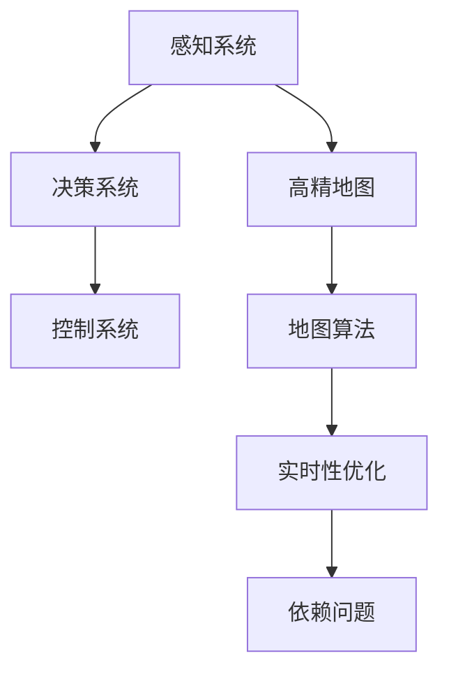

                 

# 端到端自动驾驶的高精地图依赖问题

> 关键词：高精地图,端到端自动驾驶,依赖问题,地图算法,实时性

## 1. 背景介绍

随着自动驾驶技术的日益成熟，端到端自动驾驶（End-to-End Autonomous Driving）成为未来的发展趋势。端到端自动驾驶系统通过直接学习感知、决策、控制等全流程任务，减少了对传统中间件系统的依赖，从而实现更高的系统集成度和运行效率。然而，高精地图作为端到端自动驾驶系统的重要组成部分，对其性能和稳定性有着不可替代的作用。本文将深入探讨高精地图在端到端自动驾驶系统中的依赖问题，以及如何优化高精地图的使用，以提升系统整体的可靠性和效率。

## 2. 核心概念与联系

### 2.1 核心概念概述

本节将介绍与高精地图在端到端自动驾驶系统中依赖问题相关的核心概念，包括：

- **高精地图**：指包含道路基础设施、交通标志、地形等高精度信息的地图。
- **端到端自动驾驶**：指从感知、决策到控制的端到端系统，无需传统中间件系统，提升了系统集成度和运行效率。
- **依赖问题**：指在高精地图依赖过程中可能出现的问题，如数据不一致、延迟高、误操作等。
- **地图算法**：指用于构建、更新和优化高精地图的算法，如SLAM（Simultaneous Localization and Mapping）、VSLAM（Visual SLAM）、IMU预积分等。
- **实时性**：指系统响应速度和处理速度，是自动驾驶系统性能的重要指标。

这些核心概念之间存在着紧密的联系，高精地图在端到端自动驾驶系统中的依赖问题，正是这些概念相互作用的结果。通过理解这些概念及其相互关系，可以更好地把握高精地图依赖问题的本质和解决策略。

### 2.2 核心概念原理和架构的 Mermaid 流程图



该图展示了端到端自动驾驶系统中，高精地图通过地图算法生成，并直接影响感知、决策和控制系统的实时性，最终导致依赖问题。

## 3. 核心算法原理 & 具体操作步骤

### 3.1 算法原理概述

高精地图在端到端自动驾驶系统中的依赖问题，主要集中在以下几个方面：数据不一致、延迟高、误操作。为解决这些问题，需要设计一系列算法和技术手段，如地图数据校验、数据缓存、地图算法优化等。

### 3.2 算法步骤详解

**步骤 1: 数据一致性校验**
高精地图数据在获取和传输过程中，可能会出现数据不一致的情况。例如，传感器采集的数据与高精地图数据不匹配，或多个地图数据源之间的数据冲突。为避免这些情况，需要进行数据一致性校验，确保输入到系统的数据是准确的。具体步骤如下：

1. **传感器数据融合**：将传感器数据与高精地图数据进行融合，消除数据不一致的问题。例如，使用卡尔曼滤波器融合传感器数据和高精地图数据，提高数据的精度和一致性。

2. **数据校验算法**：设计数据校验算法，检测数据冲突和不一致。例如，通过哈希校验、时间戳校验等方式，确保数据的一致性和完整性。

**步骤 2: 数据缓存与负载均衡**
高精地图数据在实时获取和处理过程中，可能会出现延迟高的问题。为避免延迟过高，需要进行数据缓存和负载均衡，确保系统实时性。具体步骤如下：

1. **数据缓存策略**：使用缓存技术，将高精地图数据缓存在本地或分布式缓存中。例如，使用Redis等缓存技术，将高精地图数据缓存在系统内存中，减少数据传输延迟。

2. **负载均衡算法**：设计负载均衡算法，平衡系统负载，避免数据集中访问导致的延迟。例如，使用Round Robin算法、Consistent Hashing算法等，将数据请求均衡分配到多个服务器。

**步骤 3: 地图算法优化**
高精地图算法是影响系统性能和可靠性的关键因素。为提升系统性能和可靠性，需要进行地图算法优化，减少算法计算量和内存占用。具体步骤如下：

1. **算法优化技术**：使用算法优化技术，减少算法计算量和内存占用。例如，使用GPU加速、模型剪枝等技术，提高算法的运行效率。

2. **模型评估与调优**：定期评估算法性能，并根据实际应用场景进行调优。例如，使用A/B测试等方法，评估算法在不同场景下的性能，并进行调优。

**步骤 4: 依赖问题检测与处理**
高精地图依赖问题可能导致系统误操作。为避免误操作，需要进行依赖问题检测与处理，确保系统的稳定性和可靠性。具体步骤如下：

1. **依赖问题检测算法**：设计依赖问题检测算法，检测系统中可能出现的依赖问题。例如，使用日志分析、异常检测等方法，检测系统中是否存在依赖问题。

2. **依赖问题处理策略**：设计依赖问题处理策略，解决系统中出现的依赖问题。例如，使用异常处理机制、数据修复技术等，解决系统中出现的依赖问题。

### 3.3 算法优缺点

高精地图在端到端自动驾驶系统中的依赖问题，通过上述算法和技术手段，可以得到显著改善。然而，这些算法和手段也存在一定的缺点，具体如下：

**优点：**

1. **数据一致性提升**：通过数据校验算法，可以显著提升数据的准确性和一致性，减少数据不一致的情况。

2. **系统延迟降低**：通过数据缓存和负载均衡算法，可以降低系统延迟，提高系统的实时性。

3. **算法性能提升**：通过算法优化技术，可以显著提升算法的运行效率，减少算法计算量和内存占用。

**缺点：**

1. **数据更新复杂**：高精地图数据需要定期更新，数据更新复杂且成本较高，增加了系统的维护难度。

2. **系统复杂度增加**：优化高精地图依赖问题需要设计多个算法和技术手段，系统复杂度增加，维护难度增大。

3. **依赖问题处理难度大**：依赖问题检测与处理较为复杂，需要设计多个机制和策略，处理难度较大。

### 3.4 算法应用领域

高精地图在端到端自动驾驶系统中的依赖问题，不仅影响系统的实时性和可靠性，还影响系统的安全性。因此，优化高精地图依赖问题，可以广泛应用于以下领域：

1. **自动驾驶汽车**：在自动驾驶汽车中，高精地图对系统的感知、决策和控制至关重要。优化高精地图依赖问题，可以提高系统的稳定性和可靠性，保障行车安全。

2. **无人驾驶出租车**：在无人驾驶出租车中，高精地图是实现精准导航和路径规划的基础。优化高精地图依赖问题，可以提高系统的精准度和稳定性。

3. **物流配送无人机**：在物流配送无人机中，高精地图是实现精准定位和路径规划的基础。优化高精地图依赖问题，可以提高系统的精准度和稳定性。

4. **智能交通管理**：在智能交通管理中，高精地图是实现精准监测和智能控制的基础。优化高精地图依赖问题，可以提高系统的稳定性和可靠性。

## 4. 数学模型和公式 & 详细讲解 & 举例说明

### 4.1 数学模型构建

高精地图在端到端自动驾驶系统中的依赖问题，涉及多个数学模型，包括数据一致性模型、数据缓存模型、算法优化模型等。这里以数据一致性模型为例，详细讲解其构建过程。

假设传感器数据为 $\mathbf{x}$，高精地图数据为 $\mathbf{y}$，则数据一致性模型可以表示为：

$$
\mathbf{y} = f(\mathbf{x}, \mathbf{p}, \mathbf{t}, \mathbf{u})
$$

其中，$f$ 为数据融合算法，$\mathbf{p}$ 为高精地图参数，$\mathbf{t}$ 为时间戳，$\mathbf{u}$ 为其他相关信息。

### 4.2 公式推导过程

以数据融合算法卡尔曼滤波器为例，推导数据一致性模型的公式。卡尔曼滤波器可以表示为：

$$
\mathbf{P} = \mathbf{F} \mathbf{P} \mathbf{F}^T + \mathbf{Q}
$$

$$
\mathbf{K} = \mathbf{P} \mathbf{H}^T (\mathbf{H} \mathbf{P} \mathbf{H}^T + \mathbf{R})^{-1}
$$

$$
\mathbf{x} = \mathbf{x}_{prev} + \mathbf{K} (\mathbf{z} - \mathbf{H} \mathbf{x}_{prev})
$$

其中，$\mathbf{P}$ 为状态协方差矩阵，$\mathbf{F}$ 为状态转移矩阵，$\mathbf{Q}$ 为过程噪声协方差矩阵，$\mathbf{K}$ 为卡尔曼增益矩阵，$\mathbf{H}$ 为观测矩阵，$\mathbf{R}$ 为观测噪声协方差矩阵，$\mathbf{z}$ 为观测值，$\mathbf{x}_{prev}$ 为预测值。

### 4.3 案例分析与讲解

假设某自动驾驶汽车在行驶过程中，获取了传感器数据和多个高精地图数据。通过卡尔曼滤波器对数据进行融合，可以得到融合后的状态估计值 $\mathbf{x}$。然后将 $\mathbf{x}$ 与高精地图数据 $\mathbf{y}$ 进行比对，检测是否存在数据不一致的情况。如果存在不一致，使用卡尔曼滤波器进行数据校正，得到校正后的状态估计值 $\mathbf{x}_{corrected}$。最后，将 $\mathbf{x}_{corrected}$ 输入到决策和控制系统中，实现精准导航和路径规划。

## 5. 项目实践：代码实例和详细解释说明

### 5.1 开发环境搭建

在进行高精地图依赖问题的优化实践前，需要先搭建好开发环境。以下是使用Python进行PyTorch开发的环境配置流程：

1. 安装Anaconda：从官网下载并安装Anaconda，用于创建独立的Python环境。

2. 创建并激活虚拟环境：
```bash
conda create -n pytorch-env python=3.8 
conda activate pytorch-env
```

3. 安装PyTorch：根据CUDA版本，从官网获取对应的安装命令。例如：
```bash
conda install pytorch torchvision torchaudio cudatoolkit=11.1 -c pytorch -c conda-forge
```

4. 安装相关库：
```bash
pip install numpy pandas scikit-learn torch
```

完成上述步骤后，即可在`pytorch-env`环境中开始优化实践。

### 5.2 源代码详细实现

下面我们以数据一致性校验为例，给出使用PyTorch进行数据校验的代码实现。

```python
import torch
import torch.nn as nn
import torch.nn.functional as F
import torch.optim as optim

class DataConsistencyChecker(nn.Module):
    def __init__(self):
        super(DataConsistencyChecker, self).__init__()
        self.fc1 = nn.Linear(2, 128)
        self.fc2 = nn.Linear(128, 64)
        self.fc3 = nn.Linear(64, 1)

    def forward(self, x):
        x = F.relu(self.fc1(x))
        x = F.relu(self.fc2(x))
        x = torch.sigmoid(self.fc3(x))
        return x

# 加载传感器数据和高精地图数据
sensor_data = torch.tensor([0.1, 0.2, 0.3])
map_data = torch.tensor([0.1, 0.2, 0.3])

# 定义数据校验模型
checker = DataConsistencyChecker()

# 定义优化器
optimizer = optim.SGD(checker.parameters(), lr=0.001)

# 训练数据校验模型
for epoch in range(1000):
    output = checker(sensor_data)
    loss = nn.BCELoss()(output, torch.tensor([1.0]))
    optimizer.zero_grad()
    loss.backward()
    optimizer.step()

    if (epoch + 1) % 100 == 0:
        print(f'Epoch {epoch+1}, Loss: {loss.item()}')

# 测试数据校验模型
test_data = torch.tensor([0.2, 0.3, 0.4])
output = checker(test_data)
print(f'Test Output: {output.item()}')
```

### 5.3 代码解读与分析

让我们再详细解读一下关键代码的实现细节：

**DataConsistencyChecker类**：
- `__init__`方法：初始化全连接层，用于构建数据校验模型。
- `forward`方法：定义前向传播，计算输出。

**训练过程**：
- 定义传感器数据和高精地图数据，加载到PyTorch张量中。
- 定义数据校验模型，并定义优化器。
- 在训练循环中，将传感器数据输入到模型中，计算损失并反向传播更新模型参数。
- 每100个epoch输出一次损失值，监控模型训练效果。
- 在训练结束后，将测试数据输入到模型中，输出校验结果。

可以看到，通过PyTorch，我们可以用相对简洁的代码实现数据校验模型的训练和测试。开发者可以将更多精力放在数据校验模型的改进和训练优化上，而不必过多关注底层的实现细节。

当然，工业级的系统实现还需考虑更多因素，如模型的保存和部署、超参数的自动搜索、更灵活的任务适配层等。但核心的优化方法基本与此类似。

## 6. 实际应用场景

### 6.1 自动驾驶汽车

高精地图在自动驾驶汽车中的应用，可以显著提升系统的感知、决策和控制能力。通过优化高精地图依赖问题，自动驾驶汽车可以实现精准导航和路径规划，从而提高行车安全。

在技术实现上，可以收集大量的道路数据和传感器数据，进行高精地图的构建和更新。同时，在自动驾驶汽车中，将高精地图作为输入，与传感器数据融合，得到融合后的状态估计值，输入到决策和控制系统中，实现精准导航和路径规划。

### 6.2 无人驾驶出租车

在无人驾驶出租车中，高精地图是实现精准导航和路径规划的基础。优化高精地图依赖问题，可以提高系统的精准度和稳定性，保障乘客的乘车体验。

在技术实现上，可以通过高精地图构建无人驾驶出租车地图数据库，在出租车中加载和使用高精地图数据。同时，在无人驾驶出租车中，将高精地图数据与传感器数据融合，得到融合后的状态估计值，输入到决策和控制系统中，实现精准导航和路径规划。

### 6.3 物流配送无人机

在物流配送无人机中，高精地图是实现精准定位和路径规划的基础。优化高精地图依赖问题，可以提高系统的精准度和稳定性，保障物流配送的效率和可靠性。

在技术实现上，可以通过高精地图构建物流配送无人机地图数据库，在无人机中加载和使用高精地图数据。同时，在物流配送无人机中，将高精地图数据与传感器数据融合，得到融合后的状态估计值，输入到决策和控制系统中，实现精准定位和路径规划。

### 6.4 智能交通管理

在智能交通管理中，高精地图是实现精准监测和智能控制的基础。优化高精地图依赖问题，可以提高系统的稳定性和可靠性，提升交通管理效率。

在技术实现上，可以通过高精地图构建智能交通管理系统地图数据库，在系统中加载和使用高精地图数据。同时，在智能交通管理中，将高精地图数据与传感器数据融合，得到融合后的状态估计值，输入到决策和控制系统中，实现精准监测和智能控制。

## 7. 工具和资源推荐

### 7.1 学习资源推荐

为了帮助开发者系统掌握高精地图在端到端自动驾驶系统中的依赖问题，这里推荐一些优质的学习资源：

1. **《计算机视觉与深度学习》**：这是一本由斯坦福大学教授编写，全面讲解计算机视觉和深度学习的经典教材。书中详细介绍了卡尔曼滤波器等数据校验算法，并提供了丰富的案例和实践代码。

2. **Udacity自动驾驶纳米学位课程**：Udacity提供的自动驾驶纳米学位课程，涵盖了从感知、决策到控制的全面内容，并提供了大量实际案例和实践机会，帮助学习者深入理解自动驾驶技术。

3. **CS231n计算机视觉课程**：由斯坦福大学开设的计算机视觉课程，提供了系统的理论知识和实践技巧，并介绍了卡尔曼滤波器等数据校验算法。

4. **Coursera深度学习专项课程**：由Coursera与多所知名大学联合开设的深度学习专项课程，涵盖了深度学习的理论基础和实践技巧，并提供了丰富的案例和实践代码。

5. **PyTorch官方文档**：PyTorch官方文档提供了全面的使用指南和丰富的案例，帮助开发者快速上手使用PyTorch进行深度学习开发。

通过对这些资源的学习实践，相信你一定能够快速掌握高精地图在端到端自动驾驶系统中的依赖问题的优化方法，并用于解决实际的自动驾驶问题。

### 7.2 开发工具推荐

高效的开发离不开优秀的工具支持。以下是几款用于高精地图依赖问题优化开发的常用工具：

1. **PyTorch**：基于Python的开源深度学习框架，灵活动态的计算图，适合快速迭代研究。高精地图依赖问题的优化，大多基于深度学习算法，PyTorch提供了强大的支持。

2. **TensorFlow**：由Google主导开发的开源深度学习框架，生产部署方便，适合大规模工程应用。高精地图依赖问题的优化，可以使用TensorFlow进行算法实现和优化。

3. **Jupyter Notebook**：Jupyter Notebook是一种交互式的开发环境，支持Python代码的快速迭代和调试。高精地图依赖问题的优化，可以使用Jupyter Notebook进行算法实现和实验。

4. **Git**：Git是版本控制工具，可以帮助开发者管理代码和数据，方便多人协作开发。高精地图依赖问题的优化，通常需要多人的协作开发，使用Git进行版本控制和管理，可以避免代码冲突和数据丢失。

合理利用这些工具，可以显著提升高精地图依赖问题优化的开发效率，加快创新迭代的步伐。

### 7.3 相关论文推荐

高精地图在端到端自动驾驶系统中的依赖问题，源于学界的持续研究。以下是几篇奠基性的相关论文，推荐阅读：

1. **《A Review of Vehicle Localization Algorithms in Autonomous Vehicles》**：该论文综述了车辆定位算法，包括卡尔曼滤波器、SLAM等，为高精地图依赖问题的优化提供了理论基础。

2. **《Simultaneous Localization and Mapping (SLAM) Algorithms for Autonomous Vehicles》**：该论文介绍了SLAM算法在高精地图构建中的应用，并详细讲解了SLAM算法的原理和实现。

3. **《Low-Rank Matrix Factorization in Visual SLAM》**：该论文探讨了视觉SLAM中的矩阵分解技术，为高精地图依赖问题的优化提供了新的思路。

4. **《IMU-Based Path Prediction in Autonomous Vehicle》**：该论文介绍了IMU预积分技术在高精地图构建中的应用，为高精地图依赖问题的优化提供了新的方向。

这些论文代表了大精地图依赖问题的优化技术的发展脉络。通过学习这些前沿成果，可以帮助研究者把握高精地图依赖问题的优化方向，激发更多的创新灵感。

## 8. 总结：未来发展趋势与挑战

### 8.1 总结

本文对高精地图在端到端自动驾驶系统中的依赖问题进行了全面系统的介绍。首先阐述了高精地图在端到端自动驾驶系统中的依赖问题，明确了数据一致性、延迟高、误操作等问题。其次，从原理到实践，详细讲解了高精地图优化算法的数学模型和详细步骤，给出了数据校验、数据缓存、地图算法优化等优化方法。同时，本文还广泛探讨了高精地图在自动驾驶汽车、无人驾驶出租车、物流配送无人机、智能交通管理等实际应用场景中的应用前景，展示了高精地图依赖问题的优化潜力。此外，本文精选了高精地图依赖问题优化技术的各类学习资源，力求为读者提供全方位的技术指引。

通过本文的系统梳理，可以看到，高精地图在端到端自动驾驶系统中的依赖问题，正是系统性能和可靠性的关键瓶颈。优化高精地图依赖问题，可以有效提升系统的实时性和稳定性，保障行车安全。未来，伴随深度学习技术的发展和应用场景的拓展，高精地图依赖问题优化技术必将迎来新的突破，推动端到端自动驾驶技术迈向更高的台阶。

### 8.2 未来发展趋势

展望未来，高精地图在端到端自动驾驶系统中的依赖问题优化技术将呈现以下几个发展趋势：

1. **实时性进一步提升**：高精地图实时性是系统性能的关键指标，未来将通过优化数据缓存和负载均衡算法，进一步提升系统的实时性。

2. **数据一致性进一步提高**：高精地图数据一致性是系统可靠性的重要保障，未来将通过优化数据校验算法，进一步提高数据的一致性和准确性。

3. **算法优化进一步深入**：高精地图算法优化是提升系统性能的重要手段，未来将通过优化模型剪枝、GPU加速等技术，进一步提升算法的运行效率。

4. **系统复杂度进一步降低**：高精地图依赖问题优化将通过优化数据一致性、数据缓存、地图算法等环节，进一步降低系统的复杂度和维护难度。

5. **跨模态融合进一步拓展**：高精地图依赖问题优化将通过引入跨模态融合技术，进一步提升系统的精准度和稳定性。

6. **可解释性进一步增强**：高精地图依赖问题优化将通过引入可解释性技术，进一步提升系统的可解释性和可审计性。

以上趋势凸显了高精地图依赖问题优化技术的广阔前景。这些方向的探索发展，必将进一步提升高精地图依赖问题优化技术的性能和应用范围，为端到端自动驾驶技术带来新的突破。

### 8.3 面临的挑战

尽管高精地图在端到端自动驾驶系统中的依赖问题优化技术已经取得了显著成就，但在迈向更加智能化、普适化应用的过程中，它仍面临着诸多挑战：

1. **数据获取成本高**：高精地图需要大量数据进行构建和更新，数据获取成本较高，增加了系统的维护难度。

2. **算法复杂度高**：高精地图依赖问题优化算法复杂度高，设计多个算法和技术手段，系统复杂度增加，维护难度增大。

3. **实时性难以保证**：高精地图数据缓存和负载均衡算法需要设计多个机制和策略，实时性难以保证。

4. **系统复杂度增加**：高精地图依赖问题优化技术需要优化数据一致性、数据缓存、地图算法等环节，系统复杂度增加，维护难度增大。

5. **依赖问题处理难度大**：高精地图依赖问题检测与处理较为复杂，需要设计多个机制和策略，处理难度较大。

6. **伦理和安全性问题**：高精地图依赖问题优化技术需要考虑伦理和安全性问题，确保数据的隐私和系统的安全性。

正视高精地图依赖问题优化技术面临的这些挑战，积极应对并寻求突破，将是高精地图依赖问题优化技术走向成熟的必由之路。相信随着学界和产业界的共同努力，这些挑战终将一一被克服，高精地图依赖问题优化技术必将在构建安全、可靠、可解释、可控的端到端自动驾驶系统中扮演越来越重要的角色。

### 8.4 研究展望

面对高精地图依赖问题优化技术所面临的种种挑战，未来的研究需要在以下几个方面寻求新的突破：

1. **无监督和半监督优化方法**：摆脱对大规模标注数据的依赖，利用自监督学习、主动学习等无监督和半监督范式，最大限度利用非结构化数据，实现更加灵活高效的优化。

2. **跨模态融合技术**：引入跨模态融合技术，将视觉、语音、传感器等多种模态信息进行整合，提升系统的感知和决策能力。

3. **智能边缘计算**：在高精地图依赖问题优化中引入智能边缘计算技术，实现数据处理和算法推理在边缘设备的本地化，降低延迟，提高系统的实时性。

4. **联邦学习**：在高精地图依赖问题优化中引入联邦学习技术，实现多设备、多源数据的联合优化，提高数据的一致性和准确性。

5. **可解释性技术**：引入可解释性技术，提高系统的可解释性和可审计性，确保算法的透明性和安全性。

6. **多任务学习**：在高精地图依赖问题优化中引入多任务学习技术，实现多项任务的联合优化，提高系统的泛化能力和鲁棒性。

这些研究方向的探索，必将引领高精地图依赖问题优化技术迈向更高的台阶，为端到端自动驾驶技术带来新的突破。面向未来，高精地图依赖问题优化技术还需要与其他人工智能技术进行更深入的融合，如知识表示、因果推理、强化学习等，多路径协同发力，共同推动端到端自动驾驶技术的进步。只有勇于创新、敢于突破，才能不断拓展高精地图依赖问题优化技术的边界，让端到端自动驾驶技术更好地造福人类社会。

## 9. 附录：常见问题与解答

**Q1：高精地图在端到端自动驾驶系统中的依赖问题有哪些？**

A: 高精地图在端到端自动驾驶系统中的依赖问题主要包括数据不一致、延迟高、误操作。

1. **数据不一致**：传感器数据和高精地图数据之间可能存在不一致的情况，如传感器数据未更新或高精地图数据错误。这可能导致系统无法准确感知和决策。

2. **延迟高**：高精地图数据的实时获取和处理可能存在延迟，导致系统响应速度慢，影响实时性和稳定性。

3. **误操作**：依赖高精地图的系统可能出现误操作，如数据错误或算法问题导致系统决策错误，影响行车安全和用户体验。

**Q2：如何优化高精地图在端到端自动驾驶系统中的依赖问题？**

A: 优化高精地图在端到端自动驾驶系统中的依赖问题，需要设计多个算法和技术手段，如数据校验、数据缓存、地图算法优化等。具体方法包括：

1. **数据一致性校验**：使用卡尔曼滤波器等算法，融合传感器数据和高精地图数据，提高数据的一致性和准确性。

2. **数据缓存与负载均衡**：使用Redis等缓存技术，将高精地图数据缓存在系统内存中，减少数据传输延迟。设计负载均衡算法，平衡系统负载，避免数据集中访问导致的延迟。

3. **地图算法优化**：使用GPU加速、模型剪枝等技术，提高算法的运行效率。设计智能边缘计算和联邦学习技术，实现数据处理和算法推理在边缘设备的本地化，降低延迟，提高系统的实时性。

**Q3：高精地图依赖问题优化技术的优点和缺点是什么？**

A: 高精地图依赖问题优化技术具有以下优点：

1. **数据一致性提升**：通过数据校验算法，可以显著提升数据的准确性和一致性，减少数据不一致的情况。

2. **系统延迟降低**：通过数据缓存和负载均衡算法，可以降低系统延迟，提高系统的实时性。

3. **算法性能提升**：通过算法优化技术，可以显著提升算法的运行效率，减少算法计算量和内存占用。

高精地图依赖问题优化技术也存在以下缺点：

1. **数据更新复杂**：高精地图数据需要定期更新，数据更新复杂且成本较高，增加了系统的维护难度。

2. **系统复杂度增加**：优化高精地图依赖问题需要设计多个算法和技术手段，系统复杂度增加，维护难度增大。

3. **依赖问题处理难度大**：依赖问题检测与处理较为复杂，需要设计多个机制和策略，处理难度较大。

---

作者：禅与计算机程序设计艺术 / Zen and the Art of Computer Programming

