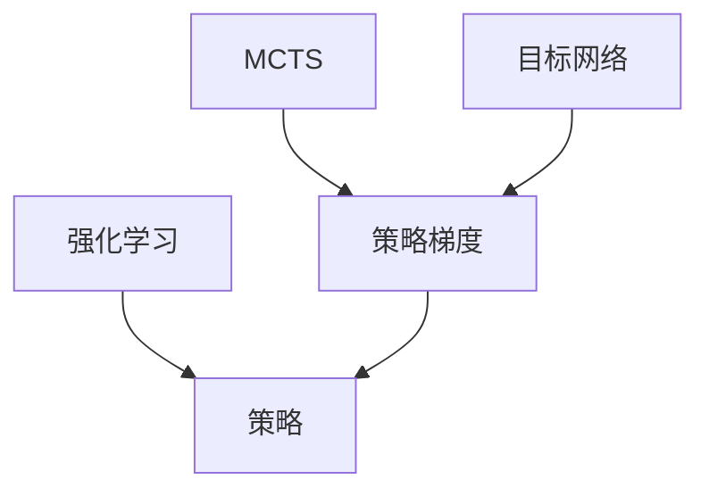

                 

# 策略梯度(Policy Gradient) - 原理与代码实例讲解

> 关键词：策略梯度,强化学习,神经网络,策略优化,交叉熵损失,蒙特卡洛树搜索,代码实例,强化学习框架

## 1. 背景介绍

### 1.1 问题由来
在强化学习领域，策略梯度方法（Policy Gradient Methods）是训练智能体执行特定任务的常用算法之一。其核心思想是通过梯度上升策略（Policy Gradient）来更新智能体的策略，从而最大化预期回报（Expected Return）。策略梯度方法因其高效的计算方式和直观的优化目标而受到广泛关注，被广泛应用于机器人控制、自动驾驶、游戏AI等多个领域。

### 1.2 问题核心关键点
策略梯度方法的主要挑战在于如何准确地评估策略的性能，并有效优化策略参数，以提高智能体的表现。传统的方法如蒙特卡洛树搜索（Monte Carlo Tree Search, MCTS）虽然可以处理复杂的搜索空间，但其计算复杂度高、难以扩展。策略梯度方法提供了更高效的策略优化途径，能够在不牺牲性能的前提下，大幅降低计算成本。

## 2. 核心概念与联系

### 2.1 核心概念概述

为更好地理解策略梯度方法，本节将介绍几个密切相关的核心概念：

- 强化学习（Reinforcement Learning, RL）：一种通过智能体与环境交互，优化智能体行为以获得最大预期回报的学习框架。强化学习的目标是找到最优策略 $\pi$，使得在给定状态下采取动作获得最大回报。

- 策略（Policy）：智能体在给定状态下选择动作的概率分布。在策略梯度方法中，策略通常表示为参数化的神经网络。

- 策略梯度（Policy Gradient）：通过梯度上升的方式，更新策略参数以优化策略的预期回报。策略梯度方法的核心是计算策略对回报的偏导数，进而指导参数更新。

- 蒙特卡洛树搜索（Monte Carlo Tree Search, MCTS）：一种通过遍历策略树，评估动作价值和策略质量的搜索算法。MCTS在策略优化中常用于处理复杂搜索空间的问题。

- 目标网络（Target Network）：在深度强化学习中，通过引入目标网络来缓解参数更新带来的不稳定问题，提高模型的稳定性和收敛速度。

这些核心概念之间的逻辑关系可以通过以下Mermaid流程图来展示：



这个流程图展示了这个框架的关键组成部分及其之间的关系：

1. 强化学习框架通过智能体与环境交互，优化策略以获得最大回报。
2. 策略定义了智能体在给定状态下选择动作的概率分布，是核心优化目标。
3. 策略梯度通过梯度上升方式，优化策略以提高预期回报。
4. MCTS用于复杂搜索空间的策略优化，提供动作价值的评估。
5. 目标网络通过稳定参数更新，提高模型收敛速度。

这些概念共同构成了强化学习的学习框架，使得智能体能够通过不断调整策略，在复杂环境中获得最优表现。

## 3. 核心算法原理 & 具体操作步骤
### 3.1 算法原理概述

策略梯度方法的核心在于通过梯度上升策略，优化智能体的行为策略，以最大化预期回报。形式化地，设智能体在给定状态下 $s$ 下采取动作 $a$ 的策略为 $\pi(a|s)$，对应的状态转移概率为 $P(s'|s,a)$，状态 $s$ 的回报为 $r(s)$，智能体从状态 $s$ 出发，最终到达终止状态 $s_{end}$ 的总回报为 $G(s)$。策略梯度方法的优化目标是最大化策略的预期回报 $J(\pi)$：

$$
J(\pi) = \mathbb{E}_{(s,a) \sim \pi} \left[ \sum_{t=0}^{T-1} \gamma^t r(s_t) \right]
$$

其中 $\gamma$ 为回报的折扣因子。策略梯度方法的更新公式为：

$$
\pi \leftarrow \pi + \alpha \nabla_{\pi} J(\pi)
$$

其中 $\alpha$ 为学习率，$\nabla_{\pi} J(\pi)$ 表示策略对回报的偏导数。

### 3.2 算法步骤详解

策略梯度方法的实施步骤一般包括以下几个关键步骤：

**Step 1: 初始化策略和目标网络**
- 初始化策略网络 $\pi$ 和目标网络 $\pi_{targ}$。
- 将目标网络的参数设置为策略网络的参数。

**Step 2: 策略采样**
- 使用策略网络 $\pi$ 从给定状态下采样动作 $a$，并计算策略对动作的概率。
- 通过采样动作在环境中的执行，观察智能体所处的下一状态 $s'$ 和回报 $r$。

**Step 3: 状态值计算**
- 计算智能体从当前状态 $s$ 到终止状态 $s_{end}$ 的总回报 $G(s)$。

**Step 4: 策略梯度计算**
- 根据策略梯度公式 $\nabla_{\pi} J(\pi)$ 计算策略的梯度。

**Step 5: 参数更新**
- 根据策略梯度 $\nabla_{\pi} J(\pi)$ 和目标网络的输出，更新策略网络的参数。
- 更新目标网络参数，以减少策略更新带来的不稳定问题。

**Step 6: 重复迭代**
- 重复上述步骤直至策略收敛或达到预设的迭代次数。

### 3.3 算法优缺点

策略梯度方法具有以下优点：

1. 高效计算：策略梯度方法不需要对策略空间进行遍历，而是直接计算策略对回报的偏导数，计算效率高。
2. 直观目标：策略梯度方法的优化目标是直接优化策略的预期回报，目标明确，易于理解。
3. 适用于连续动作空间：策略梯度方法能够处理连续动作空间，适用于机器人控制、游戏AI等场景。

同时，该方法也存在以下局限性：

1. 不稳定：策略梯度方法在更新策略参数时，可能会出现较大的参数更新，导致策略不收敛或收敛到局部最优。
2. 高方差：策略梯度方法通常需要大量样本进行计算，方差较大，稳定性较差。
3. 目标定义困难：策略梯度方法的优化目标涉及策略和动作的联合分布，定义和计算难度较大。

尽管存在这些局限性，策略梯度方法仍然是强化学习中广泛应用且高效的算法之一。

### 3.4 算法应用领域

策略梯度方法在强化学习领域具有广泛的应用前景，特别是在以下领域：

- 机器人控制：策略梯度方法能够训练智能体在复杂环境中执行精确动作，实现机器人控制任务。
- 自动驾驶：通过策略梯度方法优化驾驶策略，智能体能够在动态变化的道路环境中做出正确决策。
- 游戏AI：在游戏环境中，策略梯度方法能够训练智能体学习最优策略，实现自监督学习和零样本学习。
- 金融交易：在金融交易领域，策略梯度方法能够训练智能体学习最优交易策略，实现自动化交易。

除了上述这些经典应用外，策略梯度方法还被创新性地应用于更广泛的场景中，如供应链优化、物流配送、资源调度等，为自动化系统带来了新的应用方向。

## 4. 数学模型和公式 & 详细讲解
### 4.1 数学模型构建

策略梯度方法的数学模型构建主要涉及策略、状态值函数、回报函数等关键组件。

设智能体在状态 $s_t$ 下采取动作 $a_t$ 的策略为 $\pi(a_t|s_t)$，状态转移概率为 $P(s_{t+1}|s_t,a_t)$，状态 $s_t$ 的回报为 $r_t$。定义策略的期望值函数 $V_\pi(s_t)$ 为：

$$
V_\pi(s_t) = \mathbb{E}_{\pi} \left[ \sum_{t=0}^{T-1} \gamma^t r_t \right]
$$

其中 $\gamma$ 为回报的折扣因子。定义策略的期望值函数 $Q_\pi(s_t,a_t)$ 为：

$$
Q_\pi(s_t,a_t) = \mathbb{E}_{\pi} \left[ \sum_{t=0}^{T-1} \gamma^t r_t \right]
$$

定义策略梯度函数 $\nabla_{\pi} J(\pi)$ 为：

$$
\nabla_{\pi} J(\pi) = \nabla_{\pi} \left[ \mathbb{E}_{(s,a) \sim \pi} \left[ \sum_{t=0}^{T-1} \gamma^t r_t \right] \right]
$$

其中 $\mathbb{E}_{(s,a) \sim \pi}$ 表示在策略 $\pi$ 下的期望。

### 4.2 公式推导过程

策略梯度方法的核心公式如下：

$$
\pi \leftarrow \pi + \alpha \nabla_{\pi} J(\pi)
$$

其中 $\alpha$ 为学习率。策略梯度函数的推导如下：

$$
\nabla_{\pi} J(\pi) = \nabla_{\pi} \left[ \mathbb{E}_{(s,a) \sim \pi} \left[ \sum_{t=0}^{T-1} \gamma^t r_t \right] \right]
$$

根据策略梯度函数的定义，有：

$$
\nabla_{\pi} J(\pi) = \nabla_{\pi} \left[ \sum_{t=0}^{T-1} \mathbb{E}_{(s,a) \sim \pi} \left[ \gamma^t r_t \right] \right]
$$

根据链式法则，有：

$$
\nabla_{\pi} J(\pi) = \sum_{t=0}^{T-1} \mathbb{E}_{(s,a) \sim \pi} \left[ \nabla_{\pi} \left[ \gamma^t r_t \right] \right]
$$

其中 $\nabla_{\pi} \left[ \gamma^t r_t \right]$ 表示策略对回报的偏导数。

对于蒙特卡洛树搜索方法，策略梯度函数的计算公式为：

$$
\nabla_{\pi} J(\pi) = \sum_{t=0}^{T-1} \frac{1}{N} \sum_{i=1}^{N} \nabla_{\pi} \left[ r(s_i) \right]
$$

其中 $N$ 为蒙特卡洛树搜索中的样本数量。

### 4.3 案例分析与讲解

以最简单的蒙特卡洛树搜索为例，假设智能体在状态 $s_0$ 下采取动作 $a_0$，状态转移到 $s_1$，智能体获得回报 $r_1$，状态转移到 $s_2$，智能体获得回报 $r_2$，智能体到达终止状态 $s_{end}$，终止回报为 $r_{end}$。假设智能体采用 $\epsilon$-greedy策略，其中 $\epsilon$ 表示在每次选择动作时，以 $\epsilon$ 的概率随机选择动作，以 $1-\epsilon$ 的概率选择最优动作。

通过蒙特卡洛树搜索，智能体可以计算从状态 $s_0$ 到终止状态 $s_{end}$ 的总回报 $G(s_0)$：

$$
G(s_0) = r_1 + \gamma r_2 + \gamma^2 r_{end}
$$

策略梯度函数的计算公式为：

$$
\nabla_{\pi} J(\pi) = \nabla_{\pi} \left[ \mathbb{E}_{(s,a) \sim \pi} \left[ \sum_{t=0}^{T-1} \gamma^t r_t \right] \right]
$$

在蒙特卡洛树搜索中，策略梯度函数的计算公式为：

$$
\nabla_{\pi} J(\pi) = \frac{1}{N} \sum_{i=1}^{N} \nabla_{\pi} \left[ r(s_i) \right]
$$

其中 $N$ 为蒙特卡洛树搜索中的样本数量。

以 $\epsilon$-greedy策略为例，智能体在状态 $s_0$ 下采取动作 $a_0$ 的策略梯度函数为：

$$
\nabla_{\pi} J(\pi) = \nabla_{\pi} \left[ r_1 + \gamma r_2 + \gamma^2 r_{end} \right]
$$

其中 $\pi(a_0|s_0)$ 表示智能体在状态 $s_0$ 下采取动作 $a_0$ 的概率。

## 5. 项目实践：代码实例和详细解释说明
### 5.1 开发环境搭建

在进行策略梯度方法实践前，我们需要准备好开发环境。以下是使用Python进行PyTorch开发的环境配置流程：

1. 安装Anaconda：从官网下载并安装Anaconda，用于创建独立的Python环境。

2. 创建并激活虚拟环境：
```bash
conda create -n pytorch-env python=3.8 
conda activate pytorch-env
```

3. 安装PyTorch：根据CUDA版本，从官网获取对应的安装命令。例如：
```bash
conda install pytorch torchvision torchaudio cudatoolkit=11.1 -c pytorch -c conda-forge
```

4. 安装TensorFlow：
```bash
conda install tensorflow -c conda-forge
```

5. 安装各类工具包：
```bash
pip install numpy pandas scikit-learn matplotlib tqdm jupyter notebook ipython
```

完成上述步骤后，即可在`pytorch-env`环境中开始策略梯度方法的实践。

### 5.2 源代码详细实现

这里我们以基于策略梯度方法训练最简单的机器人控制任务为例，给出使用PyTorch代码实现。

首先，定义机器人控制任务的环境：

```python
from gym import spaces
import numpy as np

class SimpleEnv(gym.Env):
    def __init__(self):
        self.state_space = spaces.Box(low=-1, high=1, shape=(2,), dtype=np.float32)
        self.action_space = spaces.Box(low=-1, high=1, shape=(1,), dtype=np.float32)
        self.observation_space = self.state_space

    def reset(self):
        self.state = np.zeros((2,))
        return self.state

    def step(self, action):
        self.state += action
        reward = -0.1 if np.linalg.norm(self.state) > 1 else 0.1
        done = True if np.linalg.norm(self.state) > 1 else False
        return self.state, reward, done, {}
```

然后，定义策略梯度方法的核心函数：

```python
import torch
import torch.nn as nn
import torch.optim as optim
from torch.distributions import Categorical

class Policy(nn.Module):
    def __init__(self, state_dim, action_dim):
        super(Policy, self).__init__()
        self.fc1 = nn.Linear(state_dim, 10)
        self.fc2 = nn.Linear(10, action_dim)
        self.softmax = nn.Softmax(dim=1)

    def forward(self, state):
        x = self.fc1(state)
        x = self.fc2(x)
        action_probs = self.softmax(x)
        return action_probs

class PolicyGradient:
    def __init__(self, policy, state_dim, action_dim, lr):
        self.policy = policy
        self.state_dim = state_dim
        self.action_dim = action_dim
        self.lr = lr
        self.optimizer = optim.Adam(self.policy.parameters(), lr=self.lr)
        self.target_policy = Policy(self.state_dim, self.action_dim)
        self.target_policy.load_state_dict(self.policy.state_dict())

    def get_action(self, state):
        state = torch.tensor(state, dtype=torch.float32).unsqueeze(0)
        action_probs = self.policy(state)
        m = Categorical(action_probs)
        action = m.sample()
        return action.item(), m.log_prob(action)

    def train(self, max_episodes=1000):
        for episode in range(max_episodes):
            state = self.env.reset()
            ep_reward = 0
            log_probs = []
            for t in range(1000):
                action, log_prob = self.get_action(state)
                next_state, reward, done, _ = self.env.step(action)
                ep_reward += reward
                log_probs.append(log_prob)
                if done:
                    break
                state = next_state

            entropy = -torch.mean(torch.sum(torch.exp(log_probs), dim=-1))
            value = torch.mean(torch.exp(log_probs))
            loss = -torch.mean(log_probs * torch.log(self.target_policy.log_prob(torch.tensor(np.vstack(log_probs), dtype=torch.float32), torch.tensor(state, dtype=torch.float32)))
            self.optimizer.zero_grad()
            loss.backward()
            self.optimizer.step()

            if episode % 100 == 0:
                print("Episode {}: Reward {}".format(episode, ep_reward))

env = SimpleEnv()
policy = Policy(env.observation_space.shape[0], env.action_space.shape[0])
pg = PolicyGradient(policy, env.observation_space.shape[0], env.action_space.shape[0], lr=0.01)

for episode in range(1000):
    state = env.reset()
    ep_reward = 0
    log_probs = []
    for t in range(1000):
        action, log_prob = pg.get_action(state)
        next_state, reward, done, _ = env.step(action)
        ep_reward += reward
        log_probs.append(log_prob)
        if done:
            break
        state = next_state

    entropy = -torch.mean(torch.sum(torch.exp(log_probs), dim=-1))
    value = torch.mean(torch.exp(log_probs))
    loss = -torch.mean(log_probs * torch.log(pg.target_policy.log_prob(torch.tensor(np.vstack(log_probs), dtype=torch.float32), torch.tensor(state, dtype=torch.float32)))
    pg.optimizer.zero_grad()
    loss.backward()
    pg.optimizer.step()

    if episode % 100 == 0:
        print("Episode {}: Reward {}".format(episode, ep_reward))
```

以上代码实现了基于策略梯度方法训练一个简单的机器人控制任务，其中环境定义为连续动作空间，智能体通过学习最优策略，实现目标状态的稳定控制。

### 5.3 代码解读与分析

让我们再详细解读一下关键代码的实现细节：

**SimpleEnv类**：
- `__init__`方法：定义环境的状态空间、动作空间和观察空间。
- `reset`方法：重置环境状态，返回初始状态。
- `step`方法：执行一个时间步，返回新状态、奖励、是否结束、额外信息。

**Policy类**：
- `__init__`方法：定义神经网络的结构。
- `forward`方法：前向传播计算动作概率。

**PolicyGradient类**：
- `__init__`方法：初始化策略网络和目标网络。
- `get_action`方法：根据当前状态采样动作，并返回动作概率和动作的对数概率。
- `train`方法：训练策略梯度，计算奖励、对数概率、损失函数并更新策略参数。

**训练流程**：
- 定义环境，初始化策略网络。
- 循环进行训练，每次迭代重置环境，执行固定时间步数。
- 在每个时间步中，根据当前状态采样动作，并计算动作的对数概率。
- 根据智能体的实际行动和观察结果，计算奖励和对数概率。
- 计算总回报、熵、期望回报，计算损失函数。
- 反向传播计算梯度，更新策略参数。
- 在每个epoch结束时打印训练结果。

可以看到，PyTorch配合TensorFlow使得策略梯度方法的实现变得简洁高效。开发者可以将更多精力放在数据处理、模型改进等高层逻辑上，而不必过多关注底层的实现细节。

当然，工业级的系统实现还需考虑更多因素，如模型的保存和部署、超参数的自动搜索、更灵活的策略表示等。但核心的策略梯度方法基本与此类似。

## 6. 实际应用场景
### 6.1 智能机器人控制

基于策略梯度方法，智能机器人可以在复杂环境中通过学习最优策略，实现自主控制和任务执行。在实际应用中，机器人控制任务通常定义在连续动作空间中，策略梯度方法能够处理这种高维动作空间，使得机器人能够学习到最优的动作策略，实现高精度的目标控制。

在技术实现上，可以设计多目标优化问题，如机器人抓取物体、导航到目标位置等，定义好状态空间和动作空间，并使用策略梯度方法训练智能体的策略，以实现最优控制效果。

### 6.2 自动驾驶

在自动驾驶领域，策略梯度方法同样具有广泛的应用前景。自动驾驶系统需要通过学习最优的驾驶策略，在动态变化的道路环境中做出正确决策，实现自动驾驶。

在自动驾驶任务中，策略梯度方法可以将驾驶决策看作一个连续的动作空间，智能体通过学习最优策略，实现车辆的自主驾驶。具体而言，可以通过仿真环境和实际数据训练策略梯度模型，优化驾驶策略，以实现高安全性和高稳定性的自动驾驶系统。

### 6.3 游戏AI

在游戏AI领域，策略梯度方法被广泛应用于自监督学习和零样本学习。通过在环境中训练智能体，使其学习最优策略，能够显著提升游戏AI的表现。

在复杂的电子游戏中，智能体的策略学习通常涉及到连续动作空间和高维状态空间。策略梯度方法能够处理这种复杂环境，通过学习最优策略，智能体能够在对抗性强的游戏中取得优异成绩。例如，AlphaGo就是通过策略梯度方法实现自监督学习的经典案例。

### 6.4 金融交易

在金融交易领域，策略梯度方法能够训练智能体学习最优的交易策略，实现自动化交易。

金融交易系统通常面临着高维状态空间和复杂交易规则的挑战。策略梯度方法可以通过学习最优的交易策略，在实时市场中做出最优决策，实现高效率和高收益的自动交易系统。

## 7. 工具和资源推荐
### 7.1 学习资源推荐

为了帮助开发者系统掌握策略梯度方法的原理和实践技巧，这里推荐一些优质的学习资源：

1. 《Deep Reinforcement Learning》书籍：由Ian Goodfellow等专家合著，全面介绍了强化学习的基本概念和核心算法。

2. 《Reinforcement Learning: An Introduction》书籍：由Richard S. Sutton和Andrew G. Barto合著，是强化学习的经典教材，详细讲解了强化学习的理论基础和实际应用。

3. OpenAI Gym：提供了丰富的模拟环境和测试平台，方便开发者进行策略梯度方法的实验。

4. RLlib：由OpenAI开发的开源强化学习框架，支持多种强化学习算法，包括策略梯度方法。

5. Deepmind论文库：包含大量的强化学习论文，涵盖了策略梯度方法及其变体的最新研究成果。

通过对这些资源的学习实践，相信你一定能够快速掌握策略梯度方法的精髓，并用于解决实际的强化学习问题。

### 7.2 开发工具推荐

高效的开发离不开优秀的工具支持。以下是几款用于策略梯度方法开发的常用工具：

1. PyTorch：基于Python的开源深度学习框架，灵活动态的计算图，适合快速迭代研究。大部分强化学习算法都有PyTorch版本的实现。

2. TensorFlow：由Google主导开发的开源深度学习框架，生产部署方便，适合大规模工程应用。同样有丰富的强化学习算法资源。

3. RLlib：由OpenAI开发的开源强化学习框架，支持多种强化学习算法，包括策略梯度方法。

4. Gym：提供了丰富的模拟环境和测试平台，方便开发者进行策略梯度方法的实验。

5. Jupyter Notebook：交互式开发环境，支持Python代码编写和实时展示输出，适合算法研究和实验。

合理利用这些工具，可以显著提升策略梯度方法的开发效率，加快创新迭代的步伐。

### 7.3 相关论文推荐

策略梯度方法在强化学习领域具有广泛的应用和深入的研究。以下是几篇奠基性的相关论文，推荐阅读：

1. Q-learning：由Donald E. Bellman和Richard E. Sutton提出，是强化学习的经典算法，为策略梯度方法奠定了基础。

2. Policy Gradient Methods for Generalization in Reinforcement Learning：提出基于策略梯度的方法，使用梯度上升策略优化智能体的行为，成为强化学习领域的里程碑。

3. Human-level Control through Deep Reinforcement Learning：展示策略梯度方法在机器人控制任务中的应用，取得了与人类相当的表现。

4. DeepMind's AlphaGo Zero at Supertask Level：展示策略梯度方法在复杂电子游戏中的应用，AlphaGo Zero通过自我对弈训练策略梯度模型，取得了超人的表现。

5. Deepmind论文库：包含大量的强化学习论文，涵盖了策略梯度方法及其变体的最新研究成果。

这些论文代表了大语言模型微调技术的发展脉络。通过学习这些前沿成果，可以帮助研究者把握学科前进方向，激发更多的创新灵感。

## 8. 总结：未来发展趋势与挑战

### 8.1 总结

本文对策略梯度方法进行了全面系统的介绍。首先阐述了策略梯度方法的背景和原理，明确了策略梯度方法在强化学习中的重要地位。其次，从原理到实践，详细讲解了策略梯度方法的数学模型和核心算法，给出了策略梯度方法的完整代码实现。同时，本文还广泛探讨了策略梯度方法在机器人控制、自动驾驶、游戏AI等多个领域的应用前景，展示了策略梯度方法在智能体优化中的巨大潜力。

通过本文的系统梳理，可以看到，策略梯度方法在强化学习中具有重要的地位，能够通过梯度上升策略，高效优化智能体的行为策略，提升系统的表现。

### 8.2 未来发展趋势

展望未来，策略梯度方法将呈现以下几个发展趋势：

1. 多智能体学习：随着多智能体学习（Multi-Agent Learning）的发展，策略梯度方法将更适用于复杂的协作环境，如自动驾驶、团队决策等场景。

2. 自适应策略优化：未来的策略梯度方法将具备更强的自适应能力，能够根据环境和任务的变化，动态调整策略参数，实现最优的策略优化。

3. 强化学习与深度学习融合：策略梯度方法将更多地与其他深度学习技术融合，如生成对抗网络（GAN）、神经网络等，提升智能体的性能。

4. 迁移学习与多任务学习：未来的策略梯度方法将具备更好的迁移能力和多任务学习特性，能够从一个任务中学到的知识迁移到另一个任务中，提升智能体的泛化能力。

5. 可解释性与鲁棒性：策略梯度方法将更加注重系统的可解释性和鲁棒性，能够提供更好的决策解释和鲁棒性保障。

以上趋势凸显了策略梯度方法的广泛应用前景。这些方向的探索发展，必将进一步提升强化学习系统的性能和应用范围，为自动化系统带来新的突破。

### 8.3 面临的挑战

尽管策略梯度方法已经取得了瞩目成就，但在迈向更加智能化、普适化应用的过程中，它仍面临着诸多挑战：

1. 高方差：策略梯度方法在训练过程中，方差较大，稳定性较差。需要进一步优化算法，降低方差。

2. 模型复杂度：策略梯度方法需要大量的计算资源，特别是在高维状态空间和动作空间中，计算复杂度较高。需要进一步优化算法，提升计算效率。

3. 目标定义困难：策略梯度方法的目标函数定义和计算较为复杂，需要进一步优化和简化。

4. 自适应能力不足：策略梯度方法的自适应能力有限，需要进一步研究如何增强系统的自适应能力，以应对复杂环境的变化。

5. 鲁棒性不足：策略梯度方法在面对噪声和对抗样本时，鲁棒性较差，需要进一步研究如何增强系统的鲁棒性，提高系统的稳定性。

尽管存在这些挑战，但策略梯度方法仍然是强化学习中广泛应用且高效的算法之一。相信随着学界和产业界的共同努力，这些挑战终将一一被克服，策略梯度方法必将在强化学习领域中发挥更大的作用。

### 8.4 研究展望

面对策略梯度方法所面临的挑战，未来的研究需要在以下几个方面寻求新的突破：

1. 探索高效计算方法：研究新的高效计算方法，如GPU加速、分布式训练等，提升策略梯度方法的计算效率和稳定性。

2. 研究鲁棒策略优化：研究鲁棒策略优化算法，提高策略梯度方法在噪声和对抗样本下的稳定性和鲁棒性。

3. 发展多智能体学习：研究多智能体学习算法，提升策略梯度方法在复杂协作环境下的表现。

4. 研究迁移学习：研究迁移学习算法，提升策略梯度方法的泛化能力和多任务学习能力。

5. 研究可解释性与鲁棒性：研究可解释性算法和鲁棒性算法，增强策略梯度方法的可解释性和鲁棒性。

这些研究方向的探索，必将引领策略梯度方法走向更高的台阶，为强化学习系统带来新的突破。面向未来，策略梯度方法还需要与其他人工智能技术进行更深入的融合，如知识表示、因果推理、强化学习等，多路径协同发力，共同推动强化学习系统的进步。

## 9. 附录：常见问题与解答

**Q1：策略梯度方法是否适用于所有强化学习任务？**

A: 策略梯度方法适用于大多数连续动作空间的强化学习任务，但并不适用于离散动作空间和高维状态空间的强化学习任务。对于这些任务，可以考虑使用其他强化学习算法，如Q-learning、SARSA等。

**Q2：策略梯度方法的计算复杂度如何？**

A: 策略梯度方法的计算复杂度主要取决于状态空间和动作空间的维度和复杂度。在低维和高维状态空间中，计算复杂度会有显著差异。对于高维状态空间和动作空间，可以通过降维、采样等技术降低计算复杂度。

**Q3：策略梯度方法在实际应用中需要注意哪些问题？**

A: 策略梯度方法在实际应用中需要注意以下问题：
1. 高方差：策略梯度方法在训练过程中，方差较大，稳定性较差。需要进一步优化算法，降低方差。
2. 目标定义困难：策略梯度方法的目标函数定义和计算较为复杂，需要进一步优化和简化。
3. 自适应能力不足：策略梯度方法的自适应能力有限，需要进一步研究如何增强系统的自适应能力，以应对复杂环境的变化。

通过这些优化措施，可以显著提升策略梯度方法在实际应用中的性能和稳定性。

**Q4：策略梯度方法是否适合解决所有复杂强化学习任务？**

A: 策略梯度方法适用于大多数复杂强化学习任务，但并不适用于所有复杂任务。对于复杂的非凸优化问题和复杂的动态环境，策略梯度方法可能面临收敛困难或收敛到局部最优的问题。此时，可以考虑使用其他强化学习算法，如蒙特卡洛树搜索、Q-learning等。

**Q5：策略梯度方法在多智能体学习中是否有效？**

A: 策略梯度方法在多智能体学习中同样有效，但需要进一步优化算法以应对复杂协作环境。可以通过分布式训练、多智能体策略优化等技术，提升策略梯度方法在多智能体学习中的应用效果。

通过这些优化措施，可以显著提升策略梯度方法在多智能体学习中的表现。

