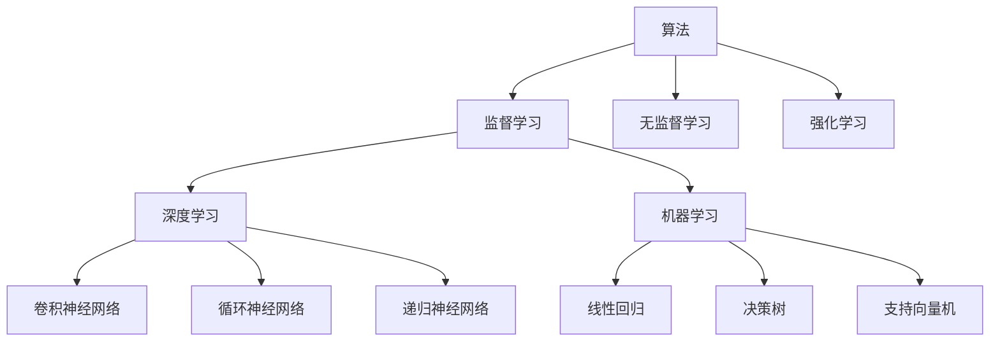

                 

# 算法：AI发展的核心驱动力

在当今飞速发展的科技世界中，人工智能（AI）正以前所未有的速度变革着社会的方方面面。无论是在自动驾驶、智能家居、医疗诊断，还是在金融分析、教育、艺术创作等广泛领域，算法都发挥着至关重要的作用。它是AI发展的核心驱动力，承载着将AI技术从理论转化为实际应用的重任。本文将深入探讨算法在AI发展中的核心作用，并结合最新研究成果，阐述算法的多种形式及其在实际应用中的优势与挑战。

## 1. 背景介绍

### 1.1 问题由来
在过去的几十年里，随着计算机科学和数据科学的飞速发展，算法在人工智能领域的应用越来越广泛。从早期的机器学习算法，如线性回归、决策树和支持向量机，到后来深度学习算法的兴起，如卷积神经网络（CNN）和循环神经网络（RNN），算法不断地推动着AI技术的进步。然而，尽管有了如此丰富的算法库，算法的选择和应用仍然是一个复杂且需要深入理解的问题。

### 1.2 问题核心关键点
选择和应用合适的算法，是AI技术落地的关键。算法的选择不仅取决于任务的复杂度，还涉及数据的特性、硬件资源、计算效率等多个方面。在实际应用中，往往需要综合考虑这些因素，才能找到最优的算法方案。

### 1.3 问题研究意义
算法的选择和应用直接影响到AI系统的性能、效率和可靠性。一个错误的算法选择可能导致系统性能低下，甚至无法达到预期效果。因此，对算法的研究和理解，对于AI技术的普及和应用至关重要。通过深入探讨算法的多样性和适用性，可以帮助开发者更好地应对各种复杂的AI应用场景，推动AI技术的发展和应用。

## 2. 核心概念与联系

### 2.1 核心概念概述

在深入讨论算法之前，我们先简要介绍一些核心概念：

- **算法（Algorithm）**：一组明确的指令，用于解决特定问题或实现特定目标。在AI领域，算法用于从数据中学习模式，并利用这些模式来做出预测、分类、聚类等决策。
- **机器学习（Machine Learning, ML）**：一种让计算机从数据中学习规律并自动改进的技术，属于AI的子集。机器学习算法包括监督学习、无监督学习和强化学习等多种形式。
- **深度学习（Deep Learning, DL）**：一种基于神经网络的机器学习方法，通过多层次的神经网络来学习数据的复杂模式。
- **监督学习（Supervised Learning）**：使用标注数据训练模型，使得模型能够从输入到输出的映射关系中学习。
- **无监督学习（Unsupervised Learning）**：使用未标注数据训练模型，模型需要自己发现数据中的结构或模式。
- **强化学习（Reinforcement Learning, RL）**：通过试错的方式，让智能体在环境中进行学习，以最大化某个奖励函数。

这些概念相互关联，共同构成了AI算法的研究基础。通过理解这些核心概念，我们可以更好地把握算法的本质和应用场景。

### 2.2 核心概念原理和架构的 Mermaid 流程图


这个流程图展示了算法与机器学习、深度学习和不同类型神经网络之间的关系。算法是AI的基础，而监督学习、无监督学习和强化学习则是机器学习的三个主要分支，各自在解决不同类型的问题时发挥着重要作用。深度学习是机器学习的一个子集，通过卷积神经网络、循环神经网络和递归神经网络等多种神经网络结构，深度学习能够处理复杂的数据模式，实现高效的特征提取和分类任务。

## 3. 核心算法原理 & 具体操作步骤
### 3.1 算法原理概述

算法在AI发展中的核心作用在于它能够处理和分析大量数据，从中发现规律和模式，并据此进行预测和决策。算法的核心原理可以归纳为以下几个方面：

- **数据处理**：算法能够高效地处理和分析大规模数据集，提取其中的有用信息。
- **模式识别**：算法通过学习数据中的模式，进行分类、聚类、预测等任务。
- **模型构建**：算法能够构建复杂的模型，模拟现实世界的行为，用于优化决策和预测。
- **优化与评估**：算法能够优化模型参数，评估模型性能，确保模型的准确性和鲁棒性。

### 3.2 算法步骤详解

以监督学习算法为例，其基本步骤包括以下几个部分：

1. **数据准备**：收集和清洗数据，将其分为训练集和测试集。
2. **模型选择**：选择合适的机器学习模型，如线性回归、决策树、支持向量机等。
3. **特征工程**：对数据进行特征提取和特征选择，提升模型的预测性能。
4. **模型训练**：使用训练集数据对模型进行训练，调整模型参数。
5. **模型评估**：在测试集上评估模型性能，检查模型的泛化能力。
6. **模型优化**：根据评估结果对模型进行优化，提高其性能。
7. **部署与应用**：将优化后的模型部署到实际应用中，用于数据预测和决策。

### 3.3 算法优缺点

监督学习算法的优点包括：

- **准确性高**：由于有标注数据的指导，监督学习算法能够获得较高的预测准确性。
- **可解释性强**：模型结构和决策过程透明，容易解释和调试。
- **适用范围广**：适用于多种任务，如分类、回归、聚类等。

然而，监督学习算法也存在一些缺点：

- **数据依赖性高**：需要大量标注数据，且标注数据的质量和数量直接影响模型性能。
- **泛化能力有限**：模型过度依赖训练数据，面对新数据泛化能力较弱。
- **特征选择困难**：需要手动选择和构造特征，可能引入主观偏见。

### 3.4 算法应用领域

监督学习算法广泛应用于以下几个领域：

- **图像识别**：如分类、目标检测、人脸识别等。使用卷积神经网络进行图像特征提取。
- **自然语言处理（NLP）**：如情感分析、机器翻译、文本分类等。使用递归神经网络和Transformer模型进行文本处理。
- **金融分析**：如股票价格预测、信用评分、风险评估等。使用线性回归、决策树和支持向量机等算法进行数据分析。
- **医疗诊断**：如疾病预测、基因分析、影像诊断等。使用支持向量机、随机森林和深度学习模型进行疾病分类和诊断。

此外，监督学习算法还应用于推荐系统、交通管理、智能制造等多个领域，展现出强大的应用潜力。

## 4. 数学模型和公式 & 详细讲解 & 举例说明
### 4.1 数学模型构建

监督学习算法的数学模型通常可以表示为：

$$
\min_{\theta} L(\theta) = \frac{1}{N} \sum_{i=1}^N \ell(\theta, x_i, y_i)
$$

其中，$\theta$ 表示模型参数，$x_i$ 表示输入样本，$y_i$ 表示对应的标签，$\ell(\theta, x_i, y_i)$ 表示损失函数，$L(\theta)$ 表示总体损失函数，$N$ 表示样本数量。

### 4.2 公式推导过程

以线性回归模型为例，其目标是最小化均方误差（MSE）损失函数：

$$
L(\theta) = \frac{1}{N} \sum_{i=1}^N (y_i - \hat{y}_i)^2
$$

其中，$\hat{y}_i$ 表示模型对输入样本 $x_i$ 的预测值。线性回归模型的参数 $\theta$ 包括截距和斜率，通过求解如下的线性方程组：

$$
\hat{y}_i = \theta_0 + \theta_1 x_i
$$

$$
\min_{\theta_0, \theta_1} L(\theta) = \frac{1}{N} \sum_{i=1}^N (y_i - \theta_0 - \theta_1 x_i)^2
$$

通过求导和求解方程，可以得到最优的参数 $\theta_0$ 和 $\theta_1$，从而构建出线性回归模型。

### 4.3 案例分析与讲解

一个简单的案例分析可以帮助我们更好地理解算法的应用：

**案例：房价预测**

给定一组房屋特征数据，如面积、地理位置、房龄等，以及对应的房价，我们的目标是构建一个模型，预测新房屋的房价。

1. **数据准备**：收集房屋特征和对应的房价数据，将其分为训练集和测试集。
2. **模型选择**：选择线性回归模型，因为它能够处理连续型数据，且计算简单。
3. **特征工程**：对数据进行特征选择和缩放，提升模型的预测性能。
4. **模型训练**：使用训练集数据对模型进行训练，求解最优的模型参数 $\theta_0$ 和 $\theta_1$。
5. **模型评估**：在测试集上评估模型的性能，检查模型的泛化能力。
6. **模型优化**：根据评估结果对模型进行优化，如增加特征、调整学习率等。
7. **部署与应用**：将优化后的模型部署到实际应用中，用于新房屋的房价预测。

这个案例展示了监督学习算法的全过程，从数据准备到模型部署，每一步都非常重要。通过不断的迭代和优化，我们可以构建出高效、准确的预测模型，推动房价预测技术的广泛应用。

## 5. 项目实践：代码实例和详细解释说明
### 5.1 开发环境搭建

在进行算法项目实践前，我们需要准备好开发环境。以下是使用Python进行TensorFlow开发的环境配置流程：

1. 安装Anaconda：从官网下载并安装Anaconda，用于创建独立的Python环境。
2. 创建并激活虚拟环境：
```bash
conda create -n tensorflow-env python=3.8 
conda activate tensorflow-env
```

3. 安装TensorFlow：根据CUDA版本，从官网获取对应的安装命令。例如：
```bash
conda install tensorflow-gpu=2.7 -c conda-forge
```

4. 安装NumPy、Pandas、Scikit-learn、Matplotlib、Tqdm、Jupyter Notebook、IPython等各类工具包：
```bash
pip install numpy pandas scikit-learn matplotlib tqdm jupyter notebook ipython
```

完成上述步骤后，即可在`tensorflow-env`环境中开始算法项目实践。

### 5.2 源代码详细实现

下面以线性回归为例，展示TensorFlow实现线性回归模型的完整代码。

首先，定义模型的输入和输出：

```python
import tensorflow as tf

# 定义输入和输出
x = tf.placeholder(tf.float32, [None, 2])
y = tf.placeholder(tf.float32, [None, 1])
```

然后，定义线性回归模型的计算图：

```python
# 定义模型参数
theta = tf.Variable(tf.random_normal([2, 1]), name='theta')

# 定义模型计算图
y_hat = tf.matmul(x, theta, name='y_hat')
loss = tf.reduce_mean(tf.square(y - y_hat))
optimizer = tf.train.GradientDescentOptimizer(learning_rate=0.01)
train_op = optimizer.minimize(loss)
```

接着，定义训练和评估函数：

```python
# 定义训练和评估函数
def train(model, X, y, batch_size):
    with tf.Session() as sess:
        sess.run(tf.global_variables_initializer())
        for epoch in range(epochs):
            for i in range(0, len(X), batch_size):
                batch_X, batch_y = X[i:i+batch_size], y[i:i+batch_size]
                sess.run(train_op, feed_dict={x: batch_X, y: batch_y})
        return sess.run(theta)

def evaluate(model, X, y):
    with tf.Session() as sess:
        return sess.run(y_hat, feed_dict={x: X, y: y})

# 训练和评估模型
theta = train(X_train, y_train, batch_size=32)
y_pred = evaluate(X_test, y_test)
```

最后，启动训练流程并在测试集上评估：

```python
X_train = # 训练集特征
y_train = # 训练集标签
X_test = # 测试集特征
y_test = # 测试集标签

epochs = 1000
batch_size = 32

# 启动训练
theta = train(X_train, y_train, batch_size=batch_size)

# 评估模型
y_pred = evaluate(X_test, y_test)
```

以上就是使用TensorFlow实现线性回归的完整代码实现。可以看到，TensorFlow提供了强大的计算图和自动微分功能，使得算法的实现变得简洁高效。

### 5.3 代码解读与分析

让我们再详细解读一下关键代码的实现细节：

**定义输入和输出**：
- `tf.placeholder`用于定义输入和输出占位符，指定数据的类型和形状。

**定义模型参数**：
- `tf.Variable`用于定义模型参数，如线性回归中的截距和斜率。

**定义模型计算图**：
- `tf.matmul`用于计算矩阵乘法，实现线性回归模型的预测值。
- `tf.reduce_mean`用于计算损失函数的平均值。
- `tf.train.GradientDescentOptimizer`用于定义优化器，如梯度下降优化器。
- `optimizer.minimize`用于最小化损失函数，训练模型参数。

**训练和评估函数**：
- `train`函数：在定义的计算图上进行训练，返回最优的模型参数。
- `evaluate`函数：在定义的计算图上进行评估，返回模型的预测值。

**启动训练和评估**：
- `train`函数用于训练模型，返回最优的模型参数。
- `evaluate`函数用于评估模型，返回预测结果。
- `theta`表示最优的模型参数，用于后续的预测。

可以看到，TensorFlow的计算图机制和自动微分功能使得算法的实现变得非常简单和直观。开发者可以将更多精力放在模型设计和数据处理上，而不必过多关注底层实现细节。

## 6. 实际应用场景

### 6.1 智能推荐系统

智能推荐系统是算法在实际应用中最为广泛的一种形式。通过分析用户的历史行为数据，智能推荐系统能够为用户推荐个性化的商品、内容、服务，提升用户的满意度和粘性。

在实现上，可以使用协同过滤、基于内容的推荐、混合推荐等算法。协同过滤算法通过分析用户和物品之间的相似度，推荐与用户历史行为相似的物品。基于内容的推荐算法通过分析物品的特征，为用户推荐相似的物品。混合推荐算法结合了以上两种算法，能够更好地覆盖不同用户的需求。

### 6.2 金融风险管理

金融领域的应用广泛且复杂，涉及市场分析、风险评估、投资决策等多个环节。通过算法在金融领域的应用，能够有效提升风险管理的准确性和效率。

在实际应用中，可以使用时间序列预测、聚类分析、异常检测等算法。时间序列预测算法通过分析历史数据，预测未来的市场走势和风险变化。聚类分析算法通过分析市场数据，将相似的金融产品或风险类别聚为一类，进行风险评估。异常检测算法通过分析市场数据，识别出异常的金融事件和风险信号，进行风险预警。

### 6.3 智能制造

智能制造是实现工业4.0的重要手段，通过算法和智能设备的结合，实现生产过程的自动化和智能化。在智能制造中，算法可以用于优化生产流程、预测设备故障、质量检测等多个环节。

在实现上，可以使用遗传算法、强化学习、优化算法等。遗传算法通过模拟自然界中的进化过程，优化生产流程中的参数设置。强化学习算法通过试错的方式，优化生产设备和机器人的控制策略。优化算法通过求解优化问题，提升生产效率和质量。

## 7. 工具和资源推荐

### 7.1 学习资源推荐

为了帮助开发者系统掌握算法的理论基础和实践技巧，这里推荐一些优质的学习资源：

1. 《机器学习》系列书籍：如《机器学习实战》、《Python机器学习》、《深度学习》等，全面介绍了机器学习的基本概念、算法和实践。
2. Coursera和edX等在线课程：提供丰富的机器学习课程，包括线性回归、决策树、支持向量机、深度学习等多个主题。
3. Kaggle竞赛平台：提供大量的数据集和算法竞赛，是提升算法实践能力的好地方。
4. GitHub算法项目：包含大量的算法实现和应用案例，是学习和借鉴算法的好资源。

通过对这些资源的学习实践，相信你一定能够快速掌握算法的精髓，并用于解决实际的AI问题。

### 7.2 开发工具推荐

高效的开发离不开优秀的工具支持。以下是几款用于算法开发的常用工具：

1. Python：Python语言简洁易学，支持丰富的机器学习库，如NumPy、Pandas、Scikit-learn等。
2. TensorFlow：Google开发的深度学习框架，支持分布式计算和GPU加速，适合大规模模型训练和推理。
3. PyTorch：Facebook开发的深度学习框架，支持动态计算图，适合快速原型开发和模型测试。
4. Scikit-learn：基于Python的机器学习库，提供简单易用的API，支持多种算法实现。
5. Jupyter Notebook：交互式编程环境，支持代码运行和结果展示，方便算法开发和调试。

合理利用这些工具，可以显著提升算法开发的效率，加快创新迭代的步伐。

### 7.3 相关论文推荐

算法的研究源于学界的持续探索。以下是几篇奠基性的相关论文，推荐阅读：

1. 《Artificial Neural Networks and Machine Learning - A Modern Approach》：Russell A. P天尼和Michael E. Keenan合著的经典书籍，全面介绍了机器学习的理论和实践。
2. 《Deep Learning》：Ian Goodfellow等人编写的深度学习经典书籍，涵盖深度学习的基本概念、算法和应用。
3. 《Machine Learning Yearning》：Andrew Ng撰写的深度学习入门书籍，深入浅出地介绍了机器学习的实践经验和技巧。
4. 《Programming Machine Learning Systems》：Ian Goodfellow等人编写的机器学习系统书籍，介绍了机器学习系统的设计和实现方法。
5. 《Learning to Program the Learning System》：Andrew Ng等人发表的论文，探讨了机器学习系统的学习算法和优化方法。

这些论文代表了大算法的研究进展，通过学习这些前沿成果，可以帮助研究者把握学科前进方向，激发更多的创新灵感。

## 8. 总结：未来发展趋势与挑战

### 8.1 总结

本文对算法在AI发展中的核心作用进行了全面系统的介绍。首先阐述了算法在AI技术中的应用和重要性，明确了算法选择和应用的关键。其次，从原理到实践，详细讲解了算法的多种形式及其在实际应用中的优势与挑战。最后，我们通过具体的算法实现和应用场景，展示了算法的广泛应用和未来发展趋势。

通过本文的系统梳理，可以看到，算法在AI技术的普及和应用中起到了至关重要的作用。算法的多样性和灵活性，使得AI技术能够在各种领域广泛落地，推动社会和经济的全面发展。未来，伴随算法的持续演进，AI技术将进一步渗透到生活的方方面面，带来更多的创新和突破。

### 8.2 未来发展趋势

展望未来，算法的研究将呈现以下几个发展趋势：

1. **算法自动化**：随着自动化技术的发展，未来算法的选择和调参将更加智能化和自动化，减少人工干预，提升开发效率。
2. **跨领域融合**：算法将与其他技术（如知识表示、自然语言处理、计算机视觉等）进行更深入的融合，实现更加复杂、高效的应用。
3. **多模态学习**：算法将突破单一模态的限制，实现跨模态数据的整合和协同建模，提升对现实世界的理解和建模能力。
4. **模型可解释性**：随着算法的复杂性增加，对算法的可解释性和可理解性将更加重视，以确保算法的公平性和透明性。
5. **分布式训练**：面对大规模数据和复杂模型，算法将更多地采用分布式训练技术，提升训练效率和模型性能。
6. **持续学习**：未来的算法将具备持续学习的能力，能够不断地从新数据中学习，保持算法的时效性和适应性。

这些趋势凸显了算法在AI发展中的重要性和前景。这些方向的探索发展，必将进一步提升AI系统的性能和应用范围，为人类社会带来更多的便利和变革。

### 8.3 面临的挑战

尽管算法的应用取得了诸多成功，但在迈向更加智能化、普适化应用的过程中，它仍面临诸多挑战：

1. **数据质量问题**：高质量、有代表性的数据是算法训练的基础，但获取和处理大规模高质量数据仍然是一个挑战。
2. **算法复杂性**：算法的复杂性和计算量越来越大，需要高效的计算资源和算法优化。
3. **模型可解释性**：复杂模型（如深度学习）的决策过程难以解释，缺乏透明性和可信度。
4. **公平性和偏见**：算法可能引入和放大偏见，影响决策的公平性和公正性。
5. **隐私和安全**：算法在处理敏感数据时，需要保障数据隐私和安全。

### 8.4 研究展望

面对算法面临的挑战，未来的研究需要在以下几个方面寻求新的突破：

1. **算法自动化**：探索自动化算法选择和调参技术，降低开发成本，提升算法效率。
2. **跨模态学习**：研究多模态数据的整合和协同建模技术，提升对现实世界的理解和建模能力。
3. **模型可解释性**：探索可解释性算法和工具，提升算法的透明性和可信度。
4. **公平性和偏见**：研究公平性算法和伦理评估方法，确保算法的公正性和公平性。
5. **隐私和安全**：研究隐私保护和数据安全技术，保障算法的隐私性和安全性。

这些研究方向的探索，必将引领算法技术迈向更高的台阶，推动AI技术的发展和应用。面向未来，算法将在构建智能人机协同的AI系统，推动社会和经济全面发展中扮演更加重要的角色。

## 9. 附录：常见问题与解答

**Q1：如何选择合适的算法？**

A: 选择合适的算法需要考虑任务类型、数据规模、计算资源等多个因素。一般而言，监督学习适用于标注数据充足的任务，无监督学习适用于标注数据不足的任务，强化学习适用于需要试错的过程。在选择算法时，需要根据具体任务特点和数据特性，进行综合评估和实验比较，最终选择最优的算法方案。

**Q2：如何优化算法性能？**

A: 算法性能的优化可以从以下几个方面入手：
1. 特征工程：选择合适的特征，并进行特征选择和特征工程，提升模型的预测能力。
2. 超参数调优：通过网格搜索、随机搜索等方法，寻找最优的超参数组合。
3. 模型集成：通过集成多个模型，提升模型的泛化能力和性能。
4. 正则化：使用L1/L2正则化等技术，防止过拟合和模型复杂化。
5. 分布式训练：使用分布式训练技术，提升训练效率和模型性能。

**Q3：如何在实际应用中保障算法隐私和安全？**

A: 保障算法隐私和安全需要考虑以下几个方面：
1. 数据脱敏：对敏感数据进行脱敏处理，防止数据泄露。
2. 访问控制：对算法访问数据进行严格的控制，防止未经授权的访问。
3. 加密技术：对数据传输和存储进行加密处理，防止数据被窃取或篡改。
4. 差分隐私：使用差分隐私技术，在保障数据隐私的同时，提升算法性能。
5. 模型审计：定期对算法进行审计和评估，发现和修复潜在的安全漏洞。

这些措施可以有效保障算法的隐私和安全，确保其在实际应用中的可靠性和可信度。

---

作者：禅与计算机程序设计艺术 / Zen and the Art of Computer Programming

