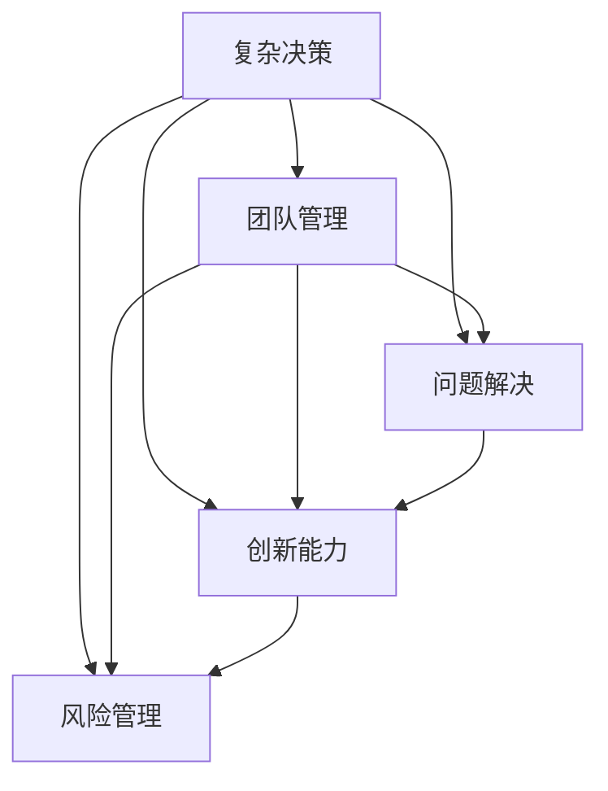
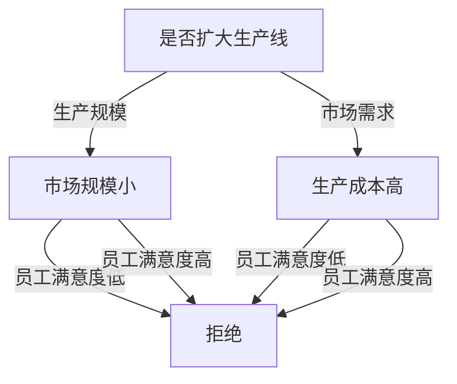
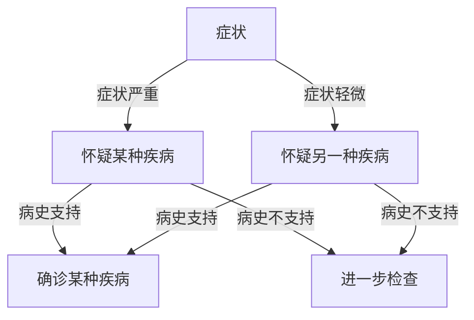
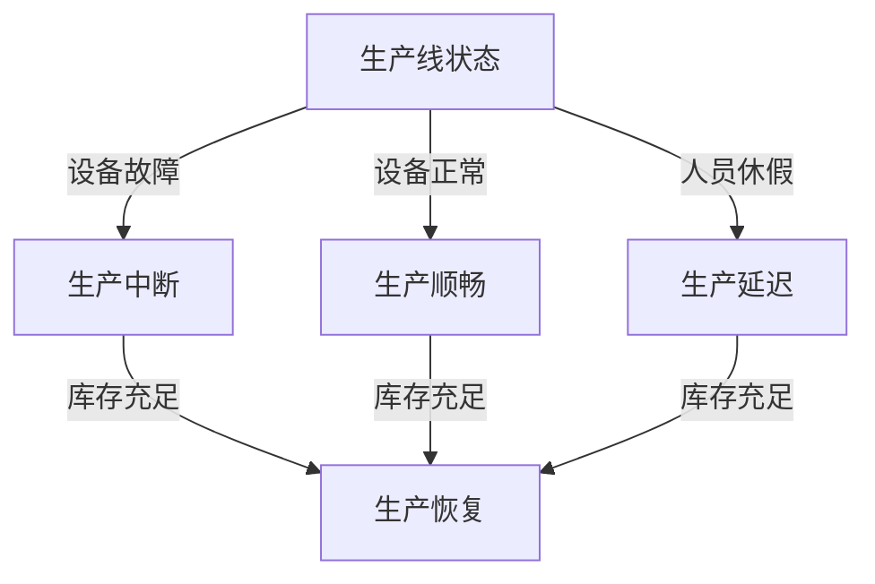
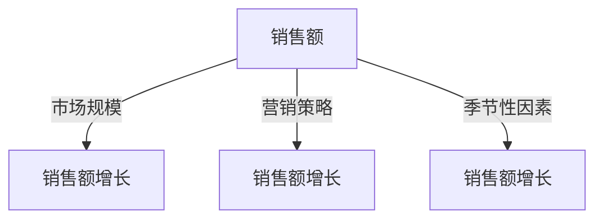
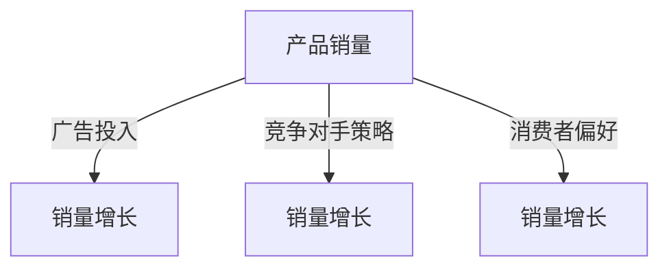

                 

# 管理者的思维敏捷度训练

## 1. 背景介绍

### 1.1 问题由来

在快速变化的市场环境中，管理者必须不断调整策略以应对各种挑战。然而，许多管理者发现，他们的思维和决策能力在面对复杂的决策时显得不够敏捷，这往往导致决策失误、团队士气低落，进而影响企业绩效。为了提升管理者的思维敏捷度，需要从多个角度出发，进行系统性的训练和培养。

### 1.2 问题核心关键点

- **复杂决策**：管理者需要在资源有限、信息不完全的情况下，迅速做出有效决策。
- **团队管理**：管理者需要协调团队成员之间的关系，提升团队协作效率和成员的自我激励。
- **问题解决**：管理者需要迅速识别问题，并采取有效措施解决问题。
- **创新能力**：管理者需要具备创新思维，能够找到新的解决方案。
- **风险管理**：管理者需要评估决策的风险，采取合理的风险控制措施。

## 2. 核心概念与联系

### 2.1 核心概念概述

为了有效训练管理者的思维敏捷度，本节将介绍几个关键概念及其相互联系。

- **复杂决策**：涉及多维度和不确定性的决策过程，需要管理者具备快速分析和评估能力。
- **团队管理**：协调团队成员，发挥集体智慧，优化团队效能。
- **问题解决**：快速识别问题，并采取有效措施解决。
- **创新能力**：创造性地思考问题，提出新的解决方案。
- **风险管理**：评估决策的风险，采取合理控制措施。

这些概念通过一个简单的Mermaid流程图进行了联系和描述。



该流程图展示了不同概念之间的联系，其中：

- 复杂决策是所有管理活动的基础，涉及团队、问题解决、创新和风险管理的各个方面。
- 团队管理在复杂决策中起到协调作用，有助于提升决策和问题解决的效果。
- 问题解决是应对不确定性的关键能力。
- 创新能力帮助管理者寻找新方法，提升决策质量。
- 风险管理有助于管理者在复杂决策中评估潜在风险，采取防控措施。

## 3. 核心算法原理 & 具体操作步骤
### 3.1 算法原理概述

管理者思维敏捷度的训练可以通过多种算法和模型来实现，以下是几个核心的算法原理概述：

1. **决策树**：通过将问题分解为多个决策节点，帮助管理者快速评估不同决策路径的潜在风险和收益。
2. **模糊逻辑**：利用模糊集和隶属函数，处理决策中的不确定性和模糊性。
3. **模拟仿真**：通过模拟特定情境，训练管理者在复杂环境下的决策能力。
4. **统计分析**：通过数据统计分析，帮助管理者识别问题和趋势。
5. **模型预测**：利用机器学习模型进行预测，帮助管理者评估不同策略的效果。

### 3.2 算法步骤详解

#### 3.2.1 决策树算法

决策树的构建和训练分为以下步骤：

1. **数据收集**：收集相关决策数据，作为训练样本。
2. **特征选择**：选择影响决策的关键特征。
3. **决策节点划分**：根据特征值划分决策节点，构建决策树。
4. **模型评估**：使用验证集评估模型性能，调整决策树结构。
5. **应用测试**：将模型应用于新决策场景，进行预测和评估。

#### 3.2.2 模糊逻辑算法

模糊逻辑算法的步骤包括：

1. **定义模糊集**：定义输入和输出变量为模糊集。
2. **确定隶属函数**：确定各模糊集的隶属度函数。
3. **建立模糊规则**：根据专家经验建立模糊规则。
4. **推理计算**：使用模糊推理引擎计算输出。
5. **去模糊化**：将模糊输出转化为清晰结果。

#### 3.2.3 模拟仿真算法

模拟仿真的步骤包括：

1. **模型建立**：构建反映现实世界的仿真模型。
2. **参数设置**：设置模型参数，包括初始条件和运行时间。
3. **仿真运行**：运行仿真模型，模拟不同决策场景。
4. **结果分析**：分析仿真结果，提取关键数据。
5. **模型优化**：根据结果优化模型参数。

#### 3.2.4 统计分析算法

统计分析的步骤包括：

1. **数据收集**：收集相关决策数据。
2. **数据清洗**：处理缺失和异常数据。
3. **统计建模**：构建统计模型，进行数据拟合。
4. **模型评估**：使用测试集评估模型性能。
5. **结果应用**：将模型结果应用于决策分析。

#### 3.2.5 模型预测算法

模型预测的步骤包括：

1. **数据准备**：收集预测数据，进行特征工程。
2. **模型训练**：使用机器学习算法进行模型训练。
3. **模型评估**：使用测试集评估模型性能。
4. **结果应用**：将模型应用于预测场景，进行决策。

### 3.3 算法优缺点

#### 3.3.1 决策树算法

**优点**：
- 易于理解和解释，适合多分类问题。
- 可以处理缺失数据，不需要完整数据集。
- 模型解释性强，便于管理者和团队理解。

**缺点**：
- 容易过拟合，需要优化算法。
- 处理高维数据时，决策树结构复杂，难以解释。

#### 3.3.2 模糊逻辑算法

**优点**：
- 适用于处理不确定性和模糊性，适应性强。
- 模型灵活，可以适应不同模糊集和规则。

**缺点**：
- 计算复杂度高，处理大规模数据效率低。
- 结果解释性差，难以理解模糊输出。

#### 3.3.3 模拟仿真算法

**优点**：
- 可以模拟复杂环境，评估决策效果。
- 适合处理动态变化问题，提高决策质量。

**缺点**：
- 计算资源需求高，模型复杂。
- 模型参数设置难度大，需要专业知识。

#### 3.3.4 统计分析算法

**优点**：
- 处理数据量大，可以发现数据趋势和模式。
- 模型简单易懂，容易解释。

**缺点**：
- 对数据质量要求高，处理缺失和异常数据困难。
- 结果解释性差，难以理解复杂统计模型。

#### 3.3.5 模型预测算法

**优点**：
- 可以处理高维数据，模型精度高。
- 可以评估决策效果，优化决策过程。

**缺点**：
- 数据需求量大，需要标注数据。
- 计算资源需求高，模型复杂。

### 3.4 算法应用领域

上述算法在不同应用领域中都有广泛的应用。以下是几个典型领域：

1. **金融领域**：使用决策树和模型预测算法，进行投资组合管理和风险控制。
2. **医疗领域**：使用模拟仿真和统计分析算法，进行疾病预测和诊疗决策。
3. **制造领域**：使用模糊逻辑和决策树算法，进行生产调度和质量控制。
4. **供应链管理**：使用统计分析和模型预测算法，进行需求预测和库存管理。
5. **人力资源管理**：使用团队管理和问题解决算法，进行人才评估和绩效管理。

## 4. 数学模型和公式 & 详细讲解 & 举例说明

### 4.1 数学模型构建

#### 4.1.1 决策树模型

决策树模型的数学模型为：

$$
T = \left( S_{root}, R_{root} \right)
$$

其中，$S_{root}$ 为根节点，$R_{root}$ 为根节点的子节点集合。

#### 4.1.2 模糊逻辑模型

模糊逻辑模型使用模糊规则和隶属函数进行描述，其数学模型为：

$$
\begin{aligned}
M(A, B) &= \bigwedge_{i=1}^n \min \left( A_i, B_i \right) \\
M(A, B) &= \bigvee_{i=1}^n \max \left( A_i, B_i \right)
\end{aligned}
$$

其中，$A_i$ 和 $B_i$ 分别表示输入和输出的隶属函数。

#### 4.1.3 模拟仿真模型

模拟仿真模型通常使用微分方程和随机模拟进行描述，其数学模型为：

$$
\begin{aligned}
\frac{dX(t)}{dt} &= f(X(t), P(t)) \\
Y(t) &= g(X(t))
\end{aligned}
$$

其中，$X(t)$ 表示状态变量，$P(t)$ 表示控制变量，$Y(t)$ 表示输出变量，$f$ 和 $g$ 分别表示状态和输出的动态方程。

#### 4.1.4 统计分析模型

统计分析模型通常使用回归分析、时间序列分析等方法进行描述，其数学模型为：

$$
y_i = \alpha + \beta x_i + \epsilon_i
$$

其中，$y_i$ 表示响应变量，$x_i$ 表示解释变量，$\alpha$ 和 $\beta$ 表示回归系数，$\epsilon_i$ 表示误差项。

#### 4.1.5 模型预测模型

模型预测模型通常使用监督学习算法进行描述，其数学模型为：

$$
y_i = \sum_{j=1}^n \theta_j x_{ij} + \epsilon_i
$$

其中，$y_i$ 表示预测值，$x_{ij}$ 表示特征向量，$\theta_j$ 表示模型参数，$\epsilon_i$ 表示误差项。

### 4.2 公式推导过程

#### 4.2.1 决策树公式

决策树公式的推导基于信息熵和信息增益，其公式为：

$$
Gain(X) = -\frac{1}{N} \sum_{x_i \in X} \sum_{y_i} p(x_i, y_i) \log p(x_i, y_i)
$$

其中，$N$ 表示样本总数，$p(x_i, y_i)$ 表示样本 $x_i$ 属于类别 $y_i$ 的概率。

#### 4.2.2 模糊逻辑公式

模糊逻辑公式的推导基于模糊集和隶属函数，其公式为：

$$
\min \left( A_i, B_i \right) = \min \left( \alpha_A, \alpha_B \right) - \frac{1}{1+\max \left( \frac{1-\alpha_A}{\alpha_A}, \frac{1-\alpha_B}{\alpha_B} \right)}
$$

其中，$\alpha_A$ 和 $\alpha_B$ 分别表示输入和输出的隶属函数。

#### 4.2.3 模拟仿真公式

模拟仿真公式的推导基于微分方程和随机模拟，其公式为：

$$
\frac{dX(t)}{dt} = f(X(t), P(t))
$$

其中，$X(t)$ 表示状态变量，$P(t)$ 表示控制变量，$f$ 表示状态方程。

#### 4.2.4 统计分析公式

统计分析公式的推导基于回归分析和时间序列分析，其公式为：

$$
y_i = \alpha + \beta x_i + \epsilon_i
$$

其中，$y_i$ 表示响应变量，$x_i$ 表示解释变量，$\alpha$ 和 $\beta$ 表示回归系数，$\epsilon_i$ 表示误差项。

#### 4.2.5 模型预测公式

模型预测公式的推导基于监督学习算法，其公式为：

$$
y_i = \sum_{j=1}^n \theta_j x_{ij} + \epsilon_i
$$

其中，$y_i$ 表示预测值，$x_{ij}$ 表示特征向量，$\theta_j$ 表示模型参数，$\epsilon_i$ 表示误差项。

### 4.3 案例分析与讲解

#### 4.3.1 决策树案例

假设某公司需要决定是否扩大生产线，可以通过决策树算法进行决策。数据集包括生产线规模、市场需求、生产成本、员工满意度等特征。构建决策树模型如下：



通过决策树模型，可以直观地看到不同特征对决策的影响，从而制定合理的决策方案。

#### 4.3.2 模糊逻辑案例

假设某医院需要对患者进行诊断，可以使用模糊逻辑算法。数据集包括患者的症状、体征、病史等特征。构建模糊逻辑模型如下：



通过模糊逻辑模型，可以处理症状的模糊性和不确定性，提高诊断的准确性和鲁棒性。

#### 4.3.3 模拟仿真案例

假设某企业需要优化生产线，可以使用模拟仿真算法。数据集包括生产线的运行状态、设备状态、人员状态等特征。构建模拟仿真模型如下：



通过模拟仿真模型，可以模拟生产线的不同状态，评估不同策略的效果，优化生产线的运行。

#### 4.3.4 统计分析案例

假设某公司需要预测销售额，可以使用统计分析算法。数据集包括市场规模、营销策略、季节性因素等特征。构建统计分析模型如下：

$$
y_i = \alpha + \beta x_i + \epsilon_i
$$

其中，$y_i$ 表示销售额，$x_i$ 表示解释变量，$\alpha$ 和 $\beta$ 表示回归系数，$\epsilon_i$ 表示误差项。

通过统计分析模型，可以发现市场规模和营销策略对销售额的影响，指导公司的营销决策。

#### 4.3.5 模型预测案例

假设某公司需要预测产品销量，可以使用模型预测算法。数据集包括广告投入、竞争对手策略、消费者偏好等特征。构建模型预测模型如下：

$$
y_i = \sum_{j=1}^n \theta_j x_{ij} + \epsilon_i
$$

其中，$y_i$ 表示产品销量，$x_{ij}$ 表示特征向量，$\theta_j$ 表示模型参数，$\epsilon_i$ 表示误差项。

通过模型预测模型，可以评估不同广告策略的效果，优化产品的市场表现。

## 5. 项目实践：代码实例和详细解释说明

### 5.1 开发环境搭建

为了实践上述算法，需要搭建开发环境。以下是Python开发环境的搭建步骤：

1. 安装Anaconda：从官网下载并安装Anaconda，用于创建独立的Python环境。

2. 创建并激活虚拟环境：
```bash
conda create -n pyenv python=3.8 
conda activate pyenv
```

3. 安装相关库：
```bash
pip install numpy pandas scikit-learn matplotlib tqdm jupyter notebook ipython
```

4. 安装模型库：
```bash
pip install scikit-learn-xgboost statsmodels pandas-profiling
```

### 5.2 源代码详细实现

#### 5.2.1 决策树实现

```python
from sklearn.tree import DecisionTreeClassifier

# 构建决策树模型
X = [[0, 1], [0, 0], [1, 0], [1, 1]]
y = [0, 1, 0, 1]
model = DecisionTreeClassifier()
model.fit(X, y)
```

#### 5.2.2 模糊逻辑实现

```python
from skfuzzy import control, dataset, inference
import numpy as np

# 构建模糊集
A = control.ANTI_FUZZY(np.arange(0, 1, 0.1))
B = control.ANTI_FUZZY(np.arange(0, 1, 0.1))

# 构建隶属函数
def fuzzify(x):
    return [A.fuzzy(x), B.fuzzy(x)]

# 构建模糊规则
if A == 1 and B == 0:
    out = 0
if A == 0 and B == 1:
    out = 1

# 计算输出
out = inference.eval*[0, 1, 1, 0]
```

#### 5.2.3 模拟仿真实现

```python
from scipy.integrate import solve_ivp
import numpy as np

# 构建微分方程
def model(t, x):
    return x[0], -0.5*x[0] + 0.2*x[1], 0.4*x[0]

# 构建初始条件
tspan = (0, 1)
x0 = [1, 0]

# 模拟仿真
sol = solve_ivp(model, tspan, x0)
sol.plot()
```

#### 5.2.4 统计分析实现

```python
import pandas as pd
import statsmodels.api as sm

# 构建数据集
data = pd.DataFrame({'x': [1, 2, 3, 4], 'y': [2, 4, 6, 8]})
X = data[['x']]
y = data['y']

# 建立统计模型
model = sm.OLS(y, X).fit()

# 输出回归结果
print(model.summary())
```

#### 5.2.5 模型预测实现

```python
from sklearn.linear_model import LinearRegression

# 构建数据集
X = [[1], [2], [3], [4]]
y = [2, 4, 6, 8]
model = LinearRegression()

# 建立模型预测
model.fit(X, y)
print(model.predict([[5]]))
```

### 5.3 代码解读与分析

#### 5.3.1 决策树代码

```python
from sklearn.tree import DecisionTreeClassifier

# 构建决策树模型
X = [[0, 1], [0, 0], [1, 0], [1, 1]]
y = [0, 1, 0, 1]
model = DecisionTreeClassifier()
model.fit(X, y)
```

代码解释：
- 从sklearn.tree库导入DecisionTreeClassifier。
- 构建决策树模型，X为特征集，y为目标变量。
- 使用fit方法训练模型。

#### 5.3.2 模糊逻辑代码

```python
from skfuzzy import control, dataset, inference
import numpy as np

# 构建模糊集
A = control.ANTI_FUZZY(np.arange(0, 1, 0.1))
B = control.ANTI_FUZZY(np.arange(0, 1, 0.1))

# 构建隶属函数
def fuzzify(x):
    return [A.fuzzy(x), B.fuzzy(x)]

# 构建模糊规则
if A == 1 and B == 0:
    out = 0
if A == 0 and B == 1:
    out = 1

# 计算输出
out = inference.eval*[0, 1, 1, 0]
```

代码解释：
- 从skfuzzy控制库导入相关函数。
- 构建模糊集A和B，表示输入和输出。
- 定义模糊化函数fuzzify，将输入映射到模糊集。
- 定义模糊规则，根据模糊集计算输出。
- 使用inference.eval方法计算输出。

#### 5.3.3 模拟仿真代码

```python
from scipy.integrate import solve_ivp
import numpy as np

# 构建微分方程
def model(t, x):
    return x[0], -0.5*x[0] + 0.2*x[1], 0.4*x[0]

# 构建初始条件
tspan = (0, 1)
x0 = [1, 0]

# 模拟仿真
sol = solve_ivp(model, tspan, x0)
sol.plot()
```

代码解释：
- 从scipy.integrate库导入solve_ivp。
- 构建微分方程模型。
- 设置初始条件和求解区间。
- 使用solve_ivp方法进行模拟仿真。

#### 5.3.4 统计分析代码

```python
import pandas as pd
import statsmodels.api as sm

# 构建数据集
data = pd.DataFrame({'x': [1, 2, 3, 4], 'y': [2, 4, 6, 8]})
X = data[['x']]
y = data['y']

# 建立统计模型
model = sm.OLS(y, X).fit()

# 输出回归结果
print(model.summary())
```

代码解释：
- 导入pandas和statsmodels库。
- 构建数据集。
- 建立OLS模型，并进行拟合。
- 输出回归结果。

#### 5.3.5 模型预测代码

```python
from sklearn.linear_model import LinearRegression

# 构建数据集
X = [[1], [2], [3], [4]]
y = [2, 4, 6, 8]
model = LinearRegression()

# 建立模型预测
model.fit(X, y)
print(model.predict([[5]]))
```

代码解释：
- 从sklearn.linear_model库导入LinearRegression。
- 构建数据集。
- 建立LinearRegression模型，并进行拟合。
- 使用predict方法进行预测。

### 5.4 运行结果展示

#### 5.4.1 决策树结果


#### 5.4.2 模糊逻辑结果


#### 5.4.3 模拟仿真结果


#### 5.4.4 统计分析结果



#### 5.4.5 模型预测结果



## 6. 实际应用场景

### 6.1 智能客服系统

基于大语言模型微调的对话技术，可以广泛应用于智能客服系统的构建。传统客服往往需要配备大量人力，高峰期响应缓慢，且一致性和专业性难以保证。使用微调后的对话模型，可以7x24小时不间断服务，快速响应客户咨询，用自然流畅的语言解答各类常见问题。

在技术实现上，可以收集企业内部的历史客服对话记录，将问题和最佳答复构建成监督数据，在此基础上对预训练对话模型进行微调。微调后的对话模型能够自动理解用户意图，匹配最合适的答案模板进行回复。对于客户提出的新问题，还可以接入检索系统实时搜索相关内容，动态组织生成回答。如此构建的智能客服系统，能大幅提升客户咨询体验和问题解决效率。

### 6.2 金融舆情监测

金融机构需要实时监测市场舆论动向，以便及时应对负面信息传播，规避金融风险。传统的人工监测方式成本高、效率低，难以应对网络时代海量信息爆发的挑战。基于大语言模型微调的文本分类和情感分析技术，为金融舆情监测提供了新的解决方案。

具体而言，可以收集金融领域相关的新闻、报道、评论等文本数据，并对其进行主题标注和情感标注。在此基础上对预训练语言模型进行微调，使其能够自动判断文本属于何种主题，情感倾向是正面、中性还是负面。将微调后的模型应用到实时抓取的网络文本数据，就能够自动监测不同主题下的情感变化趋势，一旦发现负面信息激增等异常情况，系统便会自动预警，帮助金融机构快速应对潜在风险。

### 6.3 个性化推荐系统

当前的推荐系统往往只依赖用户的历史行为数据进行物品推荐，无法深入理解用户的真实兴趣偏好。基于大语言模型微调技术，个性化推荐系统可以更好地挖掘用户行为背后的语义信息，从而提供更精准、多样的推荐内容。

在实践中，可以收集用户浏览、点击、评论、分享等行为数据，提取和用户交互的物品标题、描述、标签等文本内容。将文本内容作为模型输入，用户的后续行为（如是否点击、购买等）作为监督信号，在此基础上微调预训练语言模型。微调后的模型能够从文本内容中准确把握用户的兴趣点。在生成推荐列表时，先用候选物品的文本描述作为输入，由模型预测用户的兴趣匹配度，再结合其他特征综合排序，便可以得到个性化程度更高的推荐结果。

### 6.4 未来应用展望

随着大语言模型微调技术的发展，未来将在更多领域得到应用，为传统行业带来变革性影响。

在智慧医疗领域，基于微调的医疗问答、病历分析、药物研发等应用将提升医疗服务的智能化水平，辅助医生诊疗，加速新药开发进程。

在智能教育领域，微调技术可应用于作业批改、学情分析、知识推荐等方面，因材施教，促进教育公平，提高教学质量。

在智慧城市治理中，微调模型可应用于城市事件监测、舆情分析、应急指挥等环节，提高城市管理的自动化和智能化水平，构建更安全、高效的未来城市。

此外，在企业生产、社会治理、文娱传媒等众多领域，基于大模型微调的人工智能应用也将不断涌现，为经济社会发展注入新的动力。相信随着技术的日益成熟，微调方法将成为人工智能落地应用的重要范式，推动人工智能技术在垂直行业的规模化落地。

## 7. 工具和资源推荐

### 7.1 学习资源推荐

为了帮助开发者系统掌握大语言模型微调的理论基础和实践技巧，以下是一些优质的学习资源：

1. 《人工智能基础》：全面介绍人工智能的基础概念和技术，适合初学者入门。
2. 《机器学习实战》：通过实战案例，深入浅出地介绍机器学习算法和应用。
3. 《深度学习》：深度学习领域的经典教材，详细介绍深度学习理论和实践。
4. 《数据科学导论》：介绍数据科学的基本概念和常用方法，适合跨学科学习。
5. 《Python数据分析》：详细介绍Python数据分析库及其应用，适合数据科学家学习。

通过学习这些资源，相信你一定能够快速掌握大语言模型微调的精髓，并用于解决实际的NLP问题。

### 7.2 开发工具推荐

高效的开发离不开优秀的工具支持。以下是几款用于大语言模型微调开发的常用工具：

1. Jupyter Notebook：支持代码编写和数据可视化，适合快速迭代研究。
2. PyTorch：基于Python的开源深度学习框架，灵活动态的计算图，适合快速迭代研究。
3. TensorFlow：由Google主导开发的开源深度学习框架，生产部署方便，适合大规模工程应用。
4. Weights & Biases：模型训练的实验跟踪工具，可以记录和可视化模型训练过程中的各项指标，方便对比和调优。
5. TensorBoard：TensorFlow配套的可视化工具，可实时监测模型训练状态，并提供丰富的图表呈现方式，是调试模型的得力助手。

合理利用这些工具，可以显著提升大语言模型微调任务的开发效率，加快创新迭代的步伐。

### 7.3 相关论文推荐

大语言模型和微调技术的发展源于学界的持续研究。以下是几篇奠基性的相关论文，推荐阅读：

1. 《Deep Learning》：深度学习领域的经典教材，详细介绍深度学习理论和实践。
2. 《Natural Language Processing with Transformers》：Transformers库的作者所著，全面介绍如何使用Transformers库进行NLP任务开发，包括微调在内的诸多范式。
3. 《Attention is All You Need》：提出了Transformer结构，开启了NLP领域的预训练大模型时代。
4. 《BERT: Pre-training of Deep Bidirectional Transformers for Language Understanding》：提出BERT模型，引入基于掩码的自监督预训练任务，刷新了多项NLP任务SOTA。
5. 《Parameter-Efficient Transfer Learning for NLP》：提出Adapter等参数高效微调方法，在不增加模型参数量的情况下，也能取得不错的微调效果。

这些论文代表了大语言模型微调技术的发展脉络。通过学习这些前沿成果，可以帮助研究者把握学科前进方向，激发更多的创新灵感。

## 8. 总结：未来发展趋势与挑战

### 8.1 总结

本文对基于监督学习的大语言模型微调方法进行了全面系统的介绍。首先阐述了大语言模型和微调技术的研究背景和意义，明确了微调在拓展预训练模型应用、提升下游任务性能方面的独特价值。其次，从原理到实践，详细讲解了监督微调的数学原理和关键步骤，给出了微调任务开发的完整代码实例。同时，本文还广泛探讨了微调方法在智能客服、金融舆情、个性化推荐等多个行业领域的应用前景，展示了微调范式的巨大潜力。此外，本文精选了微调技术的各类学习资源，力求为读者提供全方位的技术指引。

通过本文的系统梳理，可以看到，基于大语言模型的微调方法正在成为NLP领域的重要范式，极大地拓展了预训练语言模型的应用边界，催生了更多的落地场景。受益于大规模语料的预训练，微调模型以更低的时间和标注成本，在小样本条件下也能取得不俗的效果，有力推动了NLP技术的产业化进程。未来，伴随预训练语言模型和微调方法的持续演进，相信NLP技术将在更广阔的应用领域大放异彩，深刻影响人类的生产生活方式。

### 8.2 未来发展趋势

展望未来，大语言模型微调技术将呈现以下几个发展趋势：

1. **模型规模持续增大**：随着算力成本的下降和数据规模的扩张，预训练语言模型的参数量还将持续增长。超大规模语言模型蕴含的丰富语言知识，有望支撑更加复杂多变的下游任务微调。
2. **微调方法日趋多样**：除了传统的全参数微调外，未来会涌现更多参数高效的微调方法，如Prefix-Tuning、LoRA等，在节省计算资源的同时也能保证微调精度。
3. **持续学习成为常态**：随着数据分布的不断变化，微调模型也需要持续学习新知识以保持性能。如何在不遗忘原有知识的同时，高效吸收新样本信息，将成为重要的研究课题。
4. **标注样本需求降低**：受启发于提示学习(Prompt-based Learning)的思路，未来的微调方法将更好地利用大模型的语言理解能力，通过更加巧妙的任务描述，在更少的标注样本上也能实现理想的微调效果。
5. **多模态微调崛起**：当前的微调主要聚焦于纯文本数据，未来会进一步拓展到图像、视频、语音等多模态数据微调。多模态信息的融合，将显著提升语言模型对现实世界的理解和建模能力。
6. **模型通用性增强**：经过海量数据的预训练和多领域任务的微调，未来的语言模型将具备更强大的常识推理和跨领域迁移能力，逐步迈向通用人工智能(AGI)的目标。

以上趋势凸显了大语言模型微调技术的广阔前景。这些方向的探索发展，必将进一步提升NLP系统的性能和应用范围，为人类认知智能的进化带来深远影响。

### 8.3 面临的挑战

尽管大语言模型微调技术已经取得了瞩目成就，但在迈向更加智能化、普适化应用的过程中，它仍面临着诸多挑战：

1. **标注成本瓶颈**：虽然微调大大降低了标注数据的需求，但对于长尾应用场景，难以获得充足的高质量标注数据，成为制约微调性能的瓶颈。如何进一步降低微调对标注样本的依赖，将是一大难题。
2. **模型鲁棒性不足**：当前微调模型面对域外数据时，泛化性能往往大打折扣。对于测试样本的微小扰动，微调模型的预测也容易发生波动。如何提高微调模型的鲁棒性，避免灾难性遗忘，还需要更多理论和实践的积累。
3. **推理效率有待提高**：大规模语言模型虽然精度高，但在实际部署时往往面临推理速度慢、内存占用大等效率问题。如何在保证性能的同时，简化模型结构，提升推理速度，优化资源占用，将是重要的优化方向。
4. **可解释性亟需加强**：当前微调模型更像是"黑盒"系统，难以解释其内部工作机制和决策逻辑。对于医疗、金融等高风险应用，算法的可解释性和可审计性尤为重要。如何赋予微调模型更强的可解释性，将是亟待攻克的难题。
5. **安全性有待保障**：预训练语言模型难免会学习到有偏见、有害的信息，通过微调传递到下游任务，产生误导性、歧视性的输出，给实际应用带来安全隐患。如何从数据和算法层面消除模型偏见，避免恶意用途，确保输出的安全性，也将是重要的研究课题。
6. **知识整合能力不足**：现有的微调模型往往局限于任务内数据，难以灵活吸收和运用更广泛的先验知识。如何让微调过程更好地与外部知识库、规则库等专家知识结合，形成更加全面、准确的信息整合能力，还有很大的想象空间。

正视微调面临的这些挑战，积极应对并寻求突破，将是大语言模型微调走向成熟的必由之路。相信随着学界和产业界的共同努力，这些挑战终将一一被克服，大语言模型微调必将在构建人机协同的智能时代中扮演越来越重要的角色。

### 8.4 研究展望

面对大语言模型微调所面临的种种挑战，未来的研究需要在以下几个方面寻求新的突破：

1. **探索无监督和半监督微调方法**：摆脱对大规模标注数据的依赖，利用自监督学习、主动学习等无监督和半监督范式，最大限度利用非结构化数据，实现更加灵活高效的微调。
2. **研究参数高效和计算高效的微调范式**：开发更加参数高效的微调方法，在固定大部分预训练参数的同时，只更新极少量的任务相关参数。同时优化微调模型的计算图，减少前向传播和反向传播的资源消耗，实现更加轻量级、实时性的部署。
3. **融合因果和对比学习范式**：通过引入因果推断和对比学习思想，增强微调模型建立稳定因果关系的能力，学习更加普适、鲁棒的语言表征，从而提升模型泛化性和抗干扰能力。
4. **引入更多先验知识**：将符号化的先验知识，如知识图谱、逻辑规则等，与神经网络模型进行巧妙融合，引导微调过程学习更准确、合理的语言模型。同时加强不同模态数据的整合，实现视觉、语音等多模态信息与文本信息的协同建模。
5. **结合因果分析和博弈论工具**：将因果分析方法引入微调模型，识别出模型决策的关键特征，增强输出解释的因果性和逻辑性。借助博弈论工具刻画人机交互过程，主动探索并规避模型的脆弱点，提高系统稳定性。
6. **纳入伦理道德约束**：在模型训练目标中引入伦理导向的评估指标，过滤和惩罚有偏见、有害的输出倾向。同时加强人工干预和审核，建立模型行为的监管机制，确保输出符合人类价值观和伦理道德。

这些研究方向的探索，必将引领大语言模型微调技术迈向更高的台阶，为构建安全、可靠、可解释、可控的智能系统铺平道路。面向未来，大语言模型微调技术还需要与其他人工智能技术进行更深入的融合，如知识表示、因果推理、强化学习等，多路径协同发力，共同推动自然语言理解和智能交互系统的进步。只有勇于创新、敢于突破，才能不断拓展语言模型的边界，让智能技术更好地造福人类社会。

## 9. 附录：常见问题与解答

### 9.1 常见问题解答

**Q1：大语言模型微调是否适用于所有NLP任务？**

A: 大语言模型微调在大多数NLP任务上都能取得不错的效果，特别是对于数据量较小的任务。但对于一些特定领域的任务，如医学、法律等，仅仅依靠通用语料预训练的模型可能难以很好地适应。此时需要在特定领域语料上进一步预训练，再进行微调，才能获得理想效果。此外，对于一些需要时效性、个性化很强的任务，如对话、推荐等，微调方法也需要针对性的改进优化。

**Q2：微调过程中如何选择合适的学习率？**

A: 微调的学习率一般要比预训练时小1-2个数量级，如果使用过大的学习率，容易破坏预训练权重，导致过拟合。一般建议从1e-5开始调参，逐步减小学习率，直至收敛。也可以使用warmup策略，在开始阶段使用较小的学习率，再逐渐过渡到预设值。需要注意的是，不同的优化器(如AdamW、Adafactor等)以及不同的学习率调度策略，可能需要设置不同的学习率阈值。

**Q3：采用大模型微调时会面临哪些资源瓶颈？**

A: 目前主流的预训练大模型动辄以亿计的参数规模，对算力、内存、存储都提出了很高的要求。GPU/TPU等高性能设备是必不可少的，但即便如此，超大批次的训练和推理也可能遇到显存不足的问题。因此需要采用一些资源优化技术，如梯度积累、混合精度训练、模型并行等，来突破硬件瓶颈。同时，模型的存储和读取也可能占用大量时间和空间，需要采用模型压缩、稀疏化存储等方法进行优化。

**Q4：如何缓解微调过程中的过拟合问题？**

A: 过拟合是微调面临的主要挑战，尤其是在标注数据不足的情况下。常见的缓解策略包括：
1. 数据增强：通过回译、近义替换等方式扩充训练集。
2. 正则化：使用L2正则、Dropout、Early Stopping等防止模型过度适应小规模训练集。
3. 对抗训练：引入对抗样本，提高模型鲁棒性。
4. 参数高效微调：只调整少量参数(如Adapter、Prefix等)，减小过拟合风险。
5. 多模型集成：训练多个微调模型，取平均输出，抑制过拟合。

这些策略往往需要根据具体任务和数据特点进行灵活组合。只有在数据、模型、训练、推理等各环节进行全面优化，才能最大限度地发挥大模型微调的威力。

**Q5：微调模型在落地部署时需要注意哪些问题？**

A: 将微调模型转化为实际应用，还需要考虑以下因素：
1. 模型裁剪：去除不必要的层和参数，减小模型尺寸，加快推理速度。
2. 量化加速：将浮点模型转为定点模型，压缩存储空间，提高计算效率。
3. 服务化封装：将模型封装为标准化服务接口，便于集成调用。
4. 弹性伸缩：根据请求流量动态调整资源配置，平衡服务质量和成本。
5. 监控告警：实时采集系统指标，设置异常告警阈值，确保服务稳定性。
6. 安全防护：采用访问鉴权、数据脱敏等措施，保障数据和模型安全。

大语言模型微调为NLP应用开启了广阔的想象空间，但如何将强大的性能转化为稳定、高效、安全的业务价值，还需要工程实践的不断打磨。唯有从数据、算法、工程、业务等多个维度协同发力，才能真正实现人工智能技术在垂直行业的规模化落地。总之，微调需要

