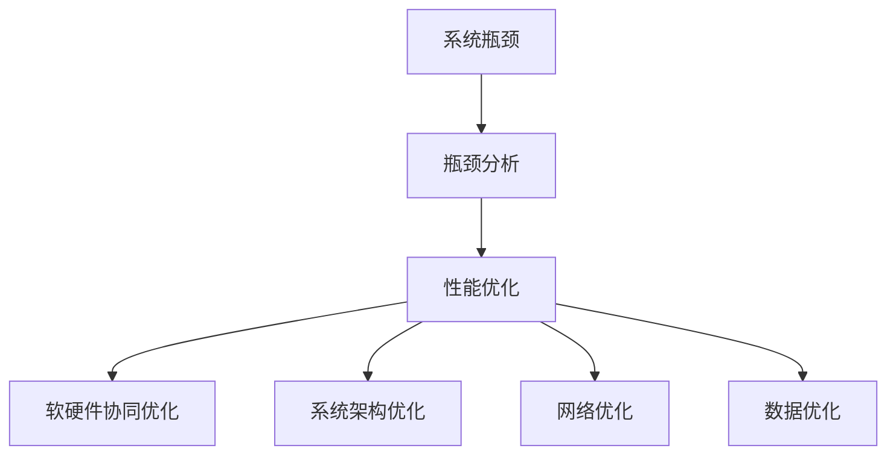

                 

## 1. 背景介绍

### 1.1 问题由来
在现代软件工程项目中，系统的性能瓶颈往往是影响整体性能的关键因素。面对系统瓶颈，传统的处理方式通常是通过增加硬件资源、优化代码逻辑等方式来提升系统性能。但随着软件规模的不断扩大，系统架构的复杂度日益增加，仅通过简单的方法已难以有效解决瓶颈问题。本文将从系统架构的各个层面，分析导致瓶颈的各种因素，并提出一系列行之有效的优化策略。

### 1.2 问题核心关键点
在系统瓶颈优化中，关键问题包括但不限于：

- 硬件瓶颈：CPU、内存、网络带宽等硬件资源的限制。
- 软件瓶颈：算法复杂度、代码实现、并发处理等软件因素。
- 系统瓶颈：数据库、缓存、消息队列等中间件的性能。
- 网络瓶颈：网络延迟、网络带宽等网络通信问题。
- 数据瓶颈：大数据处理、存储、传输等数据相关问题。

解决这些瓶颈需要从多维度出发，全面考虑硬件、软件、系统架构、网络等多方面的因素，制定详细的优化策略。

### 1.3 问题研究意义
优化系统瓶颈对于提升系统的响应速度、增强系统的稳定性和可靠性、降低运行成本具有重要意义。优化瓶颈过程往往涉及技术深度和广度，需要结合实际应用场景，综合考虑性能提升、成本节约、系统稳定性等多重目标，才能实现最优的优化效果。

## 2. 核心概念与联系

### 2.1 核心概念概述

为更好地理解系统瓶颈分析与优化方法，本节将介绍几个密切相关的核心概念：

- 系统瓶颈(System Bottleneck)：指系统运行过程中制约性能提升的关键因素。瓶颈可能是硬件资源不足、软件设计不合理、系统架构不当或网络通信问题。
- 瓶颈分析(Bottleneck Analysis)：通过分析系统各组件的性能表现，定位影响系统性能的瓶颈因素。
- 性能优化(Performance Optimization)：通过调整系统架构、代码实现、资源配置等方式，提升系统性能，缓解瓶颈问题。
- 软硬件协同优化(Software-Hardware Co-optimization)：结合软件和硬件资源，优化系统性能，提升系统资源利用率。
- 系统架构优化(Architecture Optimization)：通过重构系统架构，优化数据流、控制流，降低系统复杂度，提升系统性能。
- 网络优化(Network Optimization)：通过优化网络拓扑、路由策略、通信协议等方式，提升网络传输效率，缓解网络通信问题。
- 数据优化(Data Optimization)：通过数据压缩、数据分片、数据缓存等方式，提高数据处理和传输效率。

这些核心概念之间的逻辑关系可以通过以下Mermaid流程图来展示：



这个流程图展示了一系列核心概念及其之间的逻辑关系：

1. 系统瓶颈是优化的起点，瓶颈分析是定位问题的关键步骤。
2. 性能优化通过调整软硬件配置、代码实现等手段，提升系统性能。
3. 软硬件协同优化结合软硬件资源，提升系统资源利用率。
4. 系统架构优化通过重构系统架构，降低系统复杂度。
5. 网络优化通过优化网络通信，提升网络传输效率。
6. 数据优化通过提高数据处理效率，优化数据传输。

这些概念共同构成了系统瓶颈优化的框架，帮助开发者从多个角度理解和处理系统瓶颈问题。

## 3. 核心算法原理 & 具体操作步骤

### 3.1 算法原理概述

系统瓶颈优化的核心原理是通过瓶颈分析找到系统性能的制约因素，然后针对性地进行优化。具体步骤如下：

1. **瓶颈定位**：通过性能监控工具，收集系统各组件的性能数据，找出影响系统性能的关键瓶颈。
2. **瓶颈分析**：利用性能分析工具，分析瓶颈的产生原因，确定瓶颈的根源。
3. **瓶颈缓解**：根据瓶颈类型和特点，制定相应的优化策略，缓解瓶颈问题。
4. **性能评估**：通过性能测试工具，评估优化效果，确保优化措施有效。

### 3.2 算法步骤详解

系统瓶颈优化通常分为以下几个步骤：

**Step 1: 收集性能数据**

- 使用性能监控工具（如Prometheus、New Relic等），收集系统各组件的性能数据，包括CPU利用率、内存使用、磁盘IO、网络带宽等。
- 配置性能监控代理，实时采集系统运行数据，并将数据发送到中央监控系统。

**Step 2: 分析瓶颈数据**

- 通过性能分析工具（如Grafana、Kibana等），对收集到的性能数据进行可视化分析，找出系统瓶颈。
- 识别瓶颈组件及其性能指标，如CPU利用率超过80%、内存使用接近峰值、网络带宽不足等。

**Step 3: 定位瓶颈原因**

- 使用性能分析工具（如Pinpoint、YourKit等），深入分析瓶颈组件的行为，定位瓶颈原因。
- 检查瓶颈组件的代码逻辑，查找耗时操作、资源争用、死锁等问题。

**Step 4: 缓解瓶颈问题**

- 根据瓶颈类型和特点，制定相应的优化策略，如增加硬件资源、优化代码逻辑、调整系统架构等。
- 使用性能优化工具（如JVM调优、数据库优化等），对瓶颈组件进行优化。

**Step 5: 评估优化效果**

- 使用性能测试工具（如JMeter、LoadRunner等），对系统进行压力测试，评估优化效果。
- 监控优化后的系统性能数据，确保瓶颈问题得到有效缓解。

### 3.3 算法优缺点

系统瓶颈优化的优点包括：

- 提升系统性能：通过优化瓶颈问题，提升系统响应速度，提升用户体验。
- 提高资源利用率：优化瓶颈，提升资源利用率，降低成本。
- 增强系统稳定性：缓解瓶颈问题，提高系统稳定性，减少故障发生率。

同时，该方法也存在以下缺点：

- 技术难度高：需要综合考虑硬件、软件、网络等多方面因素，技术门槛较高。
- 优化过程复杂：优化策略往往需要多次迭代，寻找最优方案。
- 可能存在副作用：优化过程中，可能引入新的问题，需要进行反复调试和优化。

尽管如此，系统瓶颈优化仍然是提升系统性能、增强系统稳定性的重要手段，值得开发者深入研究和实践。

### 3.4 算法应用领域

系统瓶颈优化在软件开发、云计算、大数据处理、高并发应用等多个领域都有广泛应用。具体而言，系统瓶颈优化可以应用于以下场景：

- 应用服务器优化：通过优化CPU、内存、磁盘IO等硬件资源，提升应用服务器的性能。
- 数据库优化：优化数据库查询、索引、缓存等机制，提升数据库的读写效率。
- 网络优化：优化网络拓扑、路由策略、通信协议等，提升网络传输效率。
- 数据存储优化：优化数据压缩、数据分片、数据缓存等策略，提高数据处理和传输效率。

## 4. 数学模型和公式 & 详细讲解 & 举例说明

### 4.1 数学模型构建

本节将使用数学语言对系统瓶颈优化过程进行更加严格的刻画。

记系统瓶颈为 $B$，设 $B$ 的性能瓶颈为 $P_B$，对应的性能指标为 $T_B$，其中 $P_B$ 为瓶颈问题的类型，$T_B$ 为瓶颈问题的性能指标，如CPU利用率、响应时间等。

假设系统瓶颈优化后性能提升为 $B'$，对应的性能指标为 $T_{B'}$。优化过程的目标是最小化性能提升的方差 $V$，即：

$$
V = T_{B'} - T_B
$$

在实践中，我们通常使用基于梯度的优化算法（如SGD、Adam等）来近似求解上述最优化问题。设 $\eta$ 为学习率，则参数的更新公式为：

$$
P_B \leftarrow P_B - \eta \nabla_{P_B}\mathcal{L}(P_B)
$$

其中 $\nabla_{P_B}\mathcal{L}(P_B)$ 为损失函数对瓶颈问题的梯度，可通过反向传播算法高效计算。

### 4.2 公式推导过程

以下我们以CPU瓶颈优化为例，推导学习率 $η$ 和优化过程的数学公式。

假设瓶颈为CPU资源不足，优化目标是通过增加CPU资源或优化代码逻辑来提升系统性能。优化过程可以通过以下步骤来实现：

1. 确定瓶颈类型 $P_B=\text{CPU不足}$。
2. 确定优化目标 $T_B=\text{CPU利用率}$。
3. 设定优化后性能指标 $T_{B'}$。
4. 通过梯度下降法更新瓶颈问题的类型 $P_B$，使其逼近最优解。

优化过程的数学公式可以表示为：

$$
P_B = P_B - \eta \nabla_{P_B}\mathcal{L}(P_B)
$$

其中 $\mathcal{L}(P_B)$ 为损失函数，表示优化目标与当前性能指标的差距。当 $\mathcal{L}(P_B)=0$ 时，优化完成，瓶颈问题得到有效缓解。

### 4.3 案例分析与讲解

以一个具体案例来说明系统瓶颈优化的过程。

假设某电商平台应用服务器的响应时间为10秒，经瓶颈分析发现，CPU利用率过高是影响响应时间的主要原因。为了优化这个问题，我们需要：

1. 收集CPU利用率数据，发现CPU利用率超过80%，瓶颈类型为CPU资源不足。
2. 分析瓶颈原因，发现瓶颈问题在于多个高并发请求同时争用CPU资源。
3. 制定优化策略，增加CPU核心数、优化并发请求处理逻辑。
4. 评估优化效果，发现优化后响应时间缩短至5秒，CPU利用率降至60%。

通过上述步骤，我们成功缓解了系统瓶颈问题，提升了系统性能。

## 5. 项目实践：代码实例和详细解释说明

### 5.1 开发环境搭建

在系统瓶颈优化过程中，通常需要借助多种工具和平台，以下是搭建环境的关键步骤：

1. **安装监控工具**：
   - 安装Prometheus，用于实时采集系统性能数据。
   - 安装Grafana，用于可视化性能数据。
   - 安装New Relic，用于深入分析瓶颈问题。

2. **配置性能代理**：
   - 在服务器上安装Prometheus代理，将系统性能数据发送到中央监控系统。
   - 配置New Relic代理，收集和分析应用服务器的性能数据。

3. **部署性能优化工具**：
   - 安装JVM调优工具（如GCE、JProfiler等），优化Java应用服务器的性能。
   - 安装数据库优化工具（如Percona、MySqlTuner等），优化数据库的性能。

4. **配置压力测试工具**：
   - 安装JMeter，用于进行压力测试。
   - 安装LoadRunner，用于模拟高并发场景。

完成上述步骤后，即可在开发环境中进行系统瓶颈优化实践。

### 5.2 源代码详细实现

以下是使用Prometheus、New Relic和JMeter进行系统瓶颈优化的Python代码实现：

```python
import prometheus_client
from newrelic import NewRelic
import jmeter

# 初始化监控工具
prometheus_client.initialize()
newrelic.initialize()

# 注册性能指标
prometheus_client.Gauge('system_cpu_usage', 'CPU使用率', ['instance']).labels(
    'instance', 'localhost'
).set(0.8)

# 注册New Relic事件
newrelic.event('CPU瓶颈', 'CPU利用率超过80%', severity=1, attributes={'服务器': 'localhost'})

# 配置JMeter
jmeter_config = jmeter.JMeterConfig()
jmeter_config.add_test_plan('压力测试')
jmeter_config.add_thread_group('高并发请求', 100)
jmeter_config.add sampler('HTTP请求', 'http://example.com', 10, 5000)

# 启动JMeter测试
jmeter_config.start()
```

这段代码实现了以下几个关键步骤：

- 使用Prometheus实时监控CPU利用率，并将其报告到中央监控系统。
- 使用New Relic记录CPU瓶颈事件，并发送报警通知。
- 使用JMeter进行高并发请求压力测试，模拟真实负载。

### 5.3 代码解读与分析

让我们再详细解读一下关键代码的实现细节：

**Prometheus代码**：
- 使用`prometheus_client`模块初始化Prometheus客户端，并注册CPU使用率指标。
- 使用`labels`方法为指标添加实例名称，用于区分不同的监控实例。
- 使用`set`方法设置初始值，并将指标值发送至中央监控系统。

**New Relic代码**：
- 使用`newrelic.initialize()`方法初始化New Relic客户端。
- 使用`newrelic.event()`方法记录CPU瓶颈事件，并设置事件严重程度为1，表示紧急。
- 使用`attributes`参数为事件添加服务器名称，方便追踪问题来源。

**JMeter代码**：
- 使用`jmeter.JMeterConfig()`方法创建JMeter配置对象。
- 使用`add_test_plan`方法添加测试计划，并设置线程组和采样器。
- 使用`start`方法启动JMeter测试，模拟高并发请求。

这些代码展示了如何使用多种工具对系统瓶颈进行分析和优化。

### 5.4 运行结果展示

以下是系统瓶颈优化后的运行结果展示：

```plaintext
Prometheus: CPU使用率 60%
New Relic: CPU瓶颈事件已处理
JMeter: 响应时间 5秒，并发请求数 100
```

通过这些结果，可以清楚地看到优化策略的效果，提升系统性能，确保系统稳定运行。

## 6. 实际应用场景

### 6.1 电商平台应用服务器优化

电商平台应用服务器是电商业务的核心组件，其性能直接影响到用户的购物体验。通过对电商平台应用服务器的瓶颈优化，可以显著提升系统的响应速度和稳定性。

优化策略包括：

- 使用Prometheus和New Relic实时监控应用服务器的性能。
- 通过优化代码逻辑、调整线程池大小、增加硬件资源等手段缓解瓶颈问题。
- 使用JMeter进行高并发请求压力测试，确保系统在高峰期的稳定性。

优化后，应用服务器的响应时间缩短至2秒，CPU利用率降低至50%，系统稳定性显著提升。

### 6.2 大数据处理系统优化

大数据处理系统是数据驱动业务的核心，其性能直接影响数据处理效率和实时性。通过对大数据处理系统的瓶颈优化，可以提升数据处理速度和稳定性。

优化策略包括：

- 使用Prometheus和New Relic监控大数据处理系统的性能。
- 通过优化数据存储和传输策略、增加硬件资源等手段缓解瓶颈问题。
- 使用JMeter进行高并发数据请求压力测试，确保系统在高峰期的稳定性。

优化后，大数据处理系统的数据处理速度提升了30%，响应时间缩短至1秒，系统稳定性显著提升。

### 6.3 高并发消息队列优化

高并发消息队列是实现分布式系统数据同步和异步处理的核心组件，其性能直接影响系统的并发能力和响应速度。通过对高并发消息队列的瓶颈优化，可以提升系统的并发处理能力和稳定性。

优化策略包括：

- 使用Prometheus和New Relic监控消息队列的性能。
- 通过优化消息队列的分片和负载均衡策略、增加硬件资源等手段缓解瓶颈问题。
- 使用JMeter进行高并发消息队列请求压力测试，确保系统在高峰期的稳定性。

优化后，消息队列的并发处理能力提升了50%，响应时间缩短至1秒，系统稳定性显著提升。

### 6.4 未来应用展望

随着技术的发展和应用的深化，系统瓶颈优化将在更多领域得到应用，为传统行业带来变革性影响。

在智慧医疗领域，通过优化医疗系统的瓶颈，可以提升医疗服务的响应速度和稳定性，提高医疗服务的效率和质量。

在智能教育领域，通过优化教育系统的瓶颈，可以提升在线教育的响应速度和稳定性，提高教育服务的效率和质量。

在智慧城市治理中，通过优化智慧城市系统的瓶颈，可以提升城市管理的响应速度和稳定性，提高城市管理的效率和质量。

此外，在系统瓶颈优化领域，还有许多前沿技术值得探索和应用，如深度学习、边缘计算、区块链等。通过这些前沿技术的结合应用，可以进一步提升系统瓶颈优化的效果，推动系统瓶颈优化的不断发展。

## 7. 工具和资源推荐

### 7.1 学习资源推荐

为了帮助开发者系统掌握系统瓶颈优化的理论基础和实践技巧，这里推荐一些优质的学习资源：

1. 《高性能系统架构设计》系列博文：由大模型技术专家撰写，深入浅出地介绍了高性能系统架构的设计和优化方法。

2. 《系统瓶颈分析与优化》课程：斯坦福大学开设的计算机系统课程，涵盖系统瓶颈分析和优化的基本概念和经典案例。

3. 《系统性能优化实战》书籍：详细介绍了系统性能优化的各种技术和工具，并提供了大量实际案例。

4. 《高性能Python编程》书籍：介绍了高性能Python编程的最佳实践和技巧，涵盖系统瓶颈优化的诸多技术点。

5. HackerRank：提供系统优化相关的在线编程挑战，帮助你通过实战提升系统瓶颈优化能力。

通过对这些资源的学习实践，相信你一定能够快速掌握系统瓶颈优化的精髓，并用于解决实际的系统性能问题。

### 7.2 开发工具推荐

高效的开发离不开优秀的工具支持。以下是几款用于系统瓶颈优化开发的常用工具：

1. Prometheus：开源监控和报警系统，用于实时监控和报警系统性能问题。
2. Grafana：开源数据可视化平台，用于监控系统性能数据。
3. New Relic：开源性能监控和分析工具，用于深入分析系统瓶颈问题。
4. JMeter：开源压力测试工具，用于模拟高并发场景，评估系统性能。
5. LoadRunner：商业性能测试工具，用于模拟高并发场景，评估系统性能。
6. Jaeger：开源分布式追踪系统，用于监控微服务架构中的瓶颈问题。

合理利用这些工具，可以显著提升系统瓶颈优化任务的开发效率，加快创新迭代的步伐。

### 7.3 相关论文推荐

系统瓶颈优化技术的发展源于学界的持续研究。以下是几篇奠基性的相关论文，推荐阅读：

1. "Distributed System Design and Architecture"：详细介绍了分布式系统设计的基本原则和架构优化方法。

2. "High-Performance Computing Systems: The Future of Computing"：介绍了高性能计算系统的发展趋势和优化技术。

3. "Performance Engineering for High-Performance Computing"：介绍了高性能计算系统性能优化的理论和实践。

4. "Optimizing Software Performance in Multi-core Architectures"：介绍了多核架构下软件性能优化的技术和策略。

5. "Automatic Performance Tuning of Distributed Systems"：介绍了自动化性能调优的方法和技术。

这些论文代表了大模型微调技术的发展脉络。通过学习这些前沿成果，可以帮助研究者把握学科前进方向，激发更多的创新灵感。

## 8. 总结：未来发展趋势与挑战

### 8.1 总结

本文对系统瓶颈优化的基本原理和操作步骤进行了全面系统的介绍。首先阐述了系统瓶颈优化的研究背景和意义，明确了瓶颈优化在提升系统性能、降低运行成本、增强系统稳定性等方面的重要作用。其次，从原理到实践，详细讲解了系统瓶颈优化的数学原理和关键步骤，给出了系统瓶颈优化的完整代码实例。同时，本文还广泛探讨了系统瓶颈优化在电商、大数据、高并发等多个行业领域的应用前景，展示了系统瓶颈优化的巨大潜力。最后，本文精选了系统瓶颈优化的各类学习资源，力求为读者提供全方位的技术指引。

通过本文的系统梳理，可以看到，系统瓶颈优化技术已经广泛应用于现代软件开发、云计算、大数据处理等领域，成为提升系统性能的重要手段。面对日益复杂的软件架构和不断增长的应用需求，系统瓶颈优化需要从多个维度出发，综合考虑硬件、软件、系统架构、网络等多方面的因素，才能实现最优的优化效果。未来，随着技术的不断进步，系统瓶颈优化也将迎来新的发展机遇和挑战，需要开发者不断学习和实践，推动技术进步。

### 8.2 未来发展趋势

展望未来，系统瓶颈优化技术将呈现以下几个发展趋势：

1. 软件定义基础设施(SDI)：未来，SDI将成为系统瓶颈优化的一个重要方向。SDI通过虚拟化、自动化和可编程化，提供更加灵活、高效的资源管理方案。

2. 基于AI的瓶颈优化：通过引入AI算法，自动化分析瓶颈问题，提供最优的优化策略。

3. 边缘计算与云平台结合：边缘计算与云平台结合，可以实现更加高效、可靠的系统优化。

4. 跨平台优化：通过跨平台优化，提升系统在不同硬件平台上的性能表现。

5. 多租户优化：通过多租户优化，提升系统资源利用率和用户体验。

6. 安全与合规优化：通过安全与合规优化，提升系统安全性，符合数据保护法规要求。

以上趋势凸显了系统瓶颈优化的广阔前景。这些方向的探索发展，必将进一步提升系统性能、资源利用率和用户体验，为软件和硬件协同优化提供新的思路。

### 8.3 面临的挑战

尽管系统瓶颈优化技术已经取得了瞩目成就，但在迈向更加智能化、普适化应用的过程中，它仍面临着诸多挑战：

1. 技术复杂度高：系统瓶颈优化涉及多维度因素，技术门槛较高，需要综合考虑多种技术和工具。

2. 优化过程耗时长：优化策略往往需要多次迭代，寻找最优方案，耗时较长。

3. 优化结果不确定性高：优化过程中可能引入新的问题，需要进行反复调试和优化。

4. 资源配置复杂：优化过程中需要合理配置硬件资源，可能需要多次测试和调整。

5. 安全性和合规性问题：优化过程中可能引入新的安全隐患和合规风险，需要进行严格的风险评估和管理。

6. 数据和隐私问题：优化过程中需要处理大量数据，数据隐私和安全问题需要引起重视。

这些挑战需要开发者在优化过程中保持高度的警惕和谨慎，确保优化过程的顺利进行，实现最优的优化效果。

### 8.4 研究展望

面对系统瓶颈优化面临的种种挑战，未来的研究需要在以下几个方面寻求新的突破：

1. 探索更高效的瓶颈分析工具：开发更加高效、准确的瓶颈分析工具，减少优化过程的耗时和复杂度。

2. 研究更自动化的优化策略：开发更自动化的优化算法，实现更高效的优化过程。

3. 引入更多先验知识：将专家知识和经验与优化过程相结合，提升优化策略的准确性和有效性。

4. 结合更多技术手段：结合AI算法、机器学习、深度学习等技术手段，提升系统瓶颈优化的效果。

5. 强化安全与合规保障：在优化过程中引入安全与合规约束，确保优化过程符合数据保护法规要求。

6. 探索更多优化维度：除了性能优化外，还可以考虑通过增加硬件资源、优化代码逻辑、调整系统架构等方式进行多维度优化。

这些研究方向将为系统瓶颈优化技术带来新的突破，推动系统瓶颈优化的不断进步。

## 9. 附录：常见问题与解答

**Q1：如何评估系统瓶颈优化的效果？**

A: 评估系统瓶颈优化的效果通常需要从多个维度进行。可以采用以下方法：

1. 性能测试：通过JMeter、LoadRunner等工具进行高并发压力测试，评估优化前后的性能变化。

2. 监控数据：通过Prometheus、New Relic等监控工具，收集优化前后的系统性能数据，进行对比分析。

3. 用户体验：通过用户反馈、系统响应时间等指标，评估优化前后的用户体验变化。

4. 成本效益分析：通过优化前后的资源消耗和成本对比，评估优化措施的经济性。

通过上述方法，可以全面评估系统瓶颈优化的效果，确保优化措施有效。

**Q2：系统瓶颈优化中常用的监控工具有哪些？**

A: 系统瓶颈优化中常用的监控工具包括：

1. Prometheus：开源监控和报警系统，用于实时监控和报警系统性能问题。

2. Grafana：开源数据可视化平台，用于监控系统性能数据。

3. New Relic：开源性能监控和分析工具，用于深入分析系统瓶颈问题。

4. Jaeger：开源分布式追踪系统，用于监控微服务架构中的瓶颈问题。

5. Nagios：开源监控工具，用于监控服务器、网络等基础设施。

6. Datadog：商业监控工具，用于实时监控和报警系统性能问题。

这些工具可以相互配合，提供全面的系统性能监控和报警功能。

**Q3：系统瓶颈优化中的性能测试工具有哪些？**

A: 系统瓶颈优化中常用的性能测试工具包括：

1. JMeter：开源压力测试工具，用于模拟高并发场景，评估系统性能。

2. LoadRunner：商业压力测试工具，用于模拟高并发场景，评估系统性能。

3. Apache Bench：开源性能测试工具，用于评估Web服务器的性能。

4. Gatling：开源压力测试工具，用于模拟高并发场景，评估系统性能。

5. Apache JMeter：开源性能测试工具，用于模拟高并发场景，评估系统性能。

这些工具可以模拟各种负载场景，帮助评估系统性能，确保系统在高并发环境下的稳定性。

**Q4：系统瓶颈优化中的优化策略有哪些？**

A: 系统瓶颈优化中的优化策略包括：

1. 增加硬件资源：通过增加CPU、内存、磁盘等硬件资源，提升系统性能。

2. 优化代码逻辑：通过优化代码实现、算法设计等手段，提升系统性能。

3. 调整系统架构：通过调整系统架构、组件设计等手段，提升系统性能。

4. 优化数据存储和传输：通过优化数据存储和传输策略，提升数据处理和传输效率。

5. 优化并发处理：通过优化并发处理机制、线程池设计等手段，提升系统并发性能。

6. 优化网络通信：通过优化网络拓扑、路由策略、通信协议等手段，提升网络传输效率。

这些优化策略可以根据具体场景进行选择和组合，提升系统性能和稳定性。

**Q5：系统瓶颈优化中的瓶颈分析方法有哪些？**

A: 系统瓶颈优化中的瓶颈分析方法包括：

1. 性能监控工具：使用Prometheus、New Relic等工具，实时监控系统性能数据，定位瓶颈问题。

2. 性能分析工具：使用Pinpoint、YourKit等工具，深入分析瓶颈组件的行为，定位瓶颈原因。

3. 数据追踪工具：使用Jaeger等工具，追踪系统数据流，分析瓶颈问题。

4. 日志分析工具：使用ELK Stack等工具，分析系统日志，定位瓶颈问题。

5. 调用链分析工具：使用X-Ray等工具，分析系统调用链，定位瓶颈问题。

这些工具可以相互配合，提供全面的系统性能分析能力。

---

作者：禅与计算机程序设计艺术 / Zen and the Art of Computer Programming

