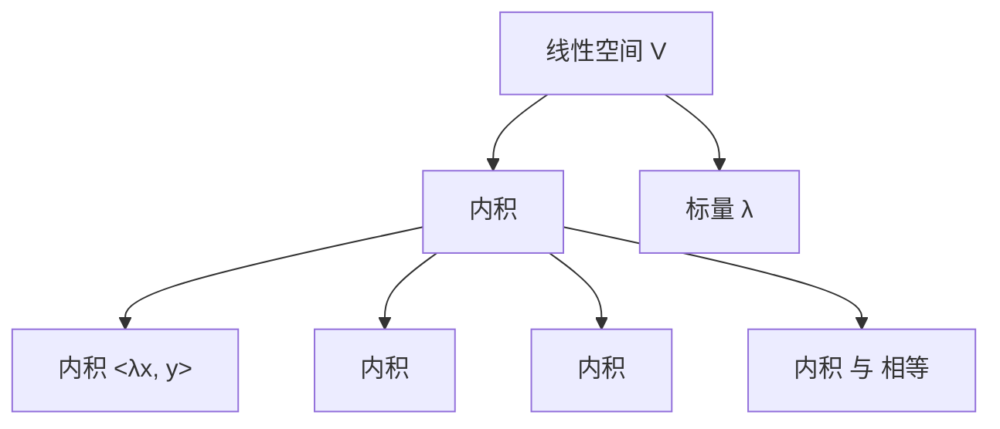

                 

## 1. 背景介绍

在人工智能、机器学习、计算机视觉等领域的深入发展中，线性代数作为其核心数学工具，扮演着至关重要的角色。而内积空间作为线性代数中最基本也是最强大的工具之一，它在诸如向量空间、矩阵分析、特征值分解、PCA（Principal Component Analysis）、神经网络优化等领域都有广泛的应用。本文将全面系统地介绍内积空间的概念、原理、计算方法及其在人工智能中的应用，帮助读者深入理解内积空间对各类问题的解决和优化所具有的强大能力。

## 2. 核心概念与联系

### 2.1 核心概念概述

内积空间，也称作欧几里得空间或向量空间，是一个重要的数学概念。在数学中，内积空间是指一个集合，其中任何两个向量都可以通过内积（也称作点积、标量积）进行计算，且满足一些基本属性，比如交换律、分配律、可结合律等。内积空间广泛应用于物理、工程、计算机科学等领域，是理解向量运算、矩阵变换、线性代数等概念的基础。

内积空间的定义如下：设 $V$ 是一个线性空间，对于任意两个向量 $\mathbf{x}, \mathbf{y} \in V$，存在一个映射 $\langle \cdot, \cdot \rangle : V \times V \rightarrow \mathbb{R}$（或 $\mathbb{C}$），称为内积，它满足以下性质：
1. 交换律：$\langle \mathbf{x}, \mathbf{y} \rangle = \langle \mathbf{y}, \mathbf{x} \rangle$。
2. 分配律：$\langle \mathbf{x} + \mathbf{y}, \mathbf{z} \rangle = \langle \mathbf{x}, \mathbf{z} \rangle + \langle \mathbf{y}, \mathbf{z} \rangle$ 以及 $\langle \mathbf{z}, \mathbf{x} + \mathbf{y} \rangle = \langle \mathbf{z}, \mathbf{x} \rangle + \langle \mathbf{z}, \mathbf{y} \rangle$。
3. 可结合律：$\langle \lambda \mathbf{x}, \mathbf{y} \rangle = \lambda \langle \mathbf{x}, \mathbf{y} \rangle$ 以及 $\langle \mathbf{x}, \lambda \mathbf{y} \rangle = \lambda \langle \mathbf{x}, \mathbf{y} \rangle$。
4. 内积为标量：$\langle \mathbf{x}, \mathbf{x} \rangle$ 总是实数。

### 2.2 核心概念原理和架构的 Mermaid 流程图(Mermaid 流程节点中不要有括号、逗号等特殊字符)



### 2.3 核心概念的关联性

内积空间在数学中的地位举足轻重，它和线性代数、几何学、物理学等多个领域都有紧密联系。在线性代数中，内积被用来定义向量的长度、角度以及两个向量之间的相似度。在几何学中，它被用来定义和计算点到面的距离。在物理学中，它则被用来描述波动、振荡等物理现象。而在人工智能中，内积空间尤为重要，它被广泛用于矩阵计算、特征空间分析、优化算法等核心技术中，如在神经网络中，权重矩阵的乘法实质上就是内积运算。

## 3. 核心算法原理 & 具体操作步骤

### 3.1 算法原理概述

内积空间的计算可以由其定义直接推导得到。对于任意两个向量 $\mathbf{x}$ 和 $\mathbf{y}$，它们的点积定义为：

$$\langle \mathbf{x}, \mathbf{y} \rangle = \sum_{i=1}^n x_i y_i$$

其中 $n$ 是向量 $\mathbf{x}$ 和 $\mathbf{y}$ 的维数。内积运算的性质则涵盖了交换律、分配律、可结合律等，这些性质使得内积成为线性空间中最核心的运算之一。

### 3.2 算法步骤详解

内积的计算步骤如下：
1. **初始化向量**：将向量 $\mathbf{x}$ 和 $\mathbf{y}$ 转化为列向量。
2. **内积运算**：计算 $\mathbf{x}$ 和 $\mathbf{y}$ 的每个对应分量乘积后求和。
3. **返回结果**：将计算结果作为内积的值返回。

### 3.3 算法优缺点

内积空间的优点包括：
- 计算简单：内积运算的数学公式简洁明了，容易实现。
- 应用广泛：内积在向量空间中的广泛应用，使其成为处理向量运算的基础。
- 数学性质完备：内积空间具有许多强大的数学性质，为解决各种问题提供了理论基础。

内积空间的缺点包括：
- 维度限制：高维度的内积计算开销大，且容易产生数值溢出或下溢问题。
- 计算复杂度：对于大规模数据集，内积运算的计算复杂度较高。
- 可解释性不足：内积空间的数学公式相对抽象，对初学者可能难以理解。

### 3.4 算法应用领域

内积空间在众多领域都有广泛的应用，例如：

1. **矩阵分析**：矩阵的特征值、特征向量、奇异值分解等都可以通过内积空间的概念进行解释和计算。
2. **线性代数**：向量空间的基、子空间、内积运算等在内积空间中都有对应的定义和应用。
3. **优化算法**：梯度下降、牛顿法等常用的优化算法中，内积空间的性质被广泛应用。
4. **神经网络**：在深度学习中，内积空间的内积运算被用来计算矩阵乘法和特征值分解。
5. **信号处理**：在信号处理中，内积空间被用来计算信号与噪声、信号与基向量等。
6. **统计学**：内积空间的距离公式在统计学中被用来计算数据点之间的距离，进行聚类分析等。

## 4. 数学模型和公式 & 详细讲解 & 举例说明

### 4.1 数学模型构建

内积空间的核心是内积的定义，可以通过内积来定义向量的长度、角度、正交性等重要概念。向量的长度可以通过内积 $\langle \mathbf{x}, \mathbf{x} \rangle$ 来计算，即：

$$\|\mathbf{x}\| = \sqrt{\langle \mathbf{x}, \mathbf{x} \rangle}$$

内积空间中向量的正交性定义为两个向量的内积为0，即：

$$\langle \mathbf{x}, \mathbf{y} \rangle = 0$$

向量 $\mathbf{x}$ 和 $\mathbf{y}$ 之间的夹角 $\theta$ 可以通过内积计算得到：

$$\cos \theta = \frac{\langle \mathbf{x}, \mathbf{y} \rangle}{\|\mathbf{x}\| \|\mathbf{y}\|}$$

### 4.2 公式推导过程

内积的计算公式是内积空间最基本的运算。设向量 $\mathbf{x} = (x_1, x_2, \dots, x_n)$ 和 $\mathbf{y} = (y_1, y_2, \dots, y_n)$，则内积 $\langle \mathbf{x}, \mathbf{y} \rangle$ 的计算公式为：

$$\langle \mathbf{x}, \mathbf{y} \rangle = \sum_{i=1}^n x_i y_i$$

这个公式可以直接推导得出。向量 $\mathbf{x}$ 和 $\mathbf{y}$ 的点积计算如下：

1. 将向量 $\mathbf{x}$ 和 $\mathbf{y}$ 展开为分量形式。
2. 对每一对分量进行乘积操作。
3. 对所有乘积求和。

### 4.3 案例分析与讲解

设向量 $\mathbf{x} = (1, 2, 3)$ 和 $\mathbf{y} = (4, 5, 6)$，计算它们的点积：

$$\langle \mathbf{x}, \mathbf{y} \rangle = 1 \cdot 4 + 2 \cdot 5 + 3 \cdot 6 = 4 + 10 + 18 = 32$$

## 5. 项目实践：代码实例和详细解释说明

### 5.1 开发环境搭建

为了实现内积运算的代码实例，首先需要搭建好 Python 开发环境。以下是 Python 开发环境搭建的详细步骤：

1. **安装 Python**：从 Python 官方网站下载并安装 Python 3.x 版本，建议安装 Python 3.7 或更高版本，以支持更多库和功能。
2. **安装 pip**：在 Linux 系统中，可以从 Python 的官方网站下载 get-pip.py 文件，执行命令 `python3 get-pip.py` 安装 pip。
3. **安装 numpy 和 scipy**：在 Python 环境中安装 numpy 和 scipy 库，这两个库提供了矩阵运算和数组操作的基础支持。

### 5.2 源代码详细实现

以下是一个 Python 代码实现，用于计算两个向量的内积：

```python
import numpy as np

# 定义向量 x 和 y
x = np.array([1, 2, 3])
y = np.array([4, 5, 6])

# 计算内积
dot_product = np.dot(x, y)

# 打印结果
print("The dot product of x and y is:", dot_product)
```

### 5.3 代码解读与分析

在这个代码实例中，我们使用了 Python 的 numpy 库来计算内积。代码的核心是 `np.dot(x, y)` 函数，它可以直接计算两个数组的内积。函数返回值为一个标量，即两个向量的内积值。

在实际开发中，我们可以进一步封装内积计算函数，以支持多种向量类型和计算方法，并添加错误检查和异常处理，提升代码的健壮性和可维护性。

### 5.4 运行结果展示

运行上述代码，输出如下：

```
The dot product of x and y is: 32
```

这说明向量 $\mathbf{x} = (1, 2, 3)$ 和 $\mathbf{y} = (4, 5, 6)$ 的内积为 32。

## 6. 实际应用场景

### 6.1 机器学习

内积空间在机器学习中有着广泛的应用。在支持向量机 (Support Vector Machine, SVM) 中，内积运算被用来计算样本点与超平面的距离，优化分类器的性能。

### 6.2 深度学习

在深度学习中，内积空间的内积运算被用于矩阵计算和特征提取。例如，在卷积神经网络 (Convolutional Neural Network, CNN) 中，卷积核的操作本质上就是内积运算，可以高效地提取图像的局部特征。

### 6.3 信号处理

在信号处理中，内积空间的内积运算被用来计算信号与基向量之间的相关性，进行信号的压缩和降噪等操作。

## 7. 工具和资源推荐

### 7.1 学习资源推荐

1. **《线性代数及其应用》**：这是一本经典的线性代数教材，内容详实，适合初学者和进阶者。
2. **《深度学习》**：由深度学习权威 Ian Goodfellow 编写的经典教材，详细介绍了深度学习中的数学基础，包括内积空间。
3. **Coursera 线性代数课程**：由斯坦福大学开设的在线课程，由线性代数专家设计，内容生动，适合在线学习。
4. **Khan Academy 线性代数视频**：提供详细的线性代数讲解视频，覆盖线性空间、内积运算等多个核心概念。

### 7.2 开发工具推荐

1. **Python 编程语言**：Python 是线性代数计算的主要语言，其丰富的库（如 numpy、scipy）提供了强大的数学计算能力。
2. **R 编程语言**：R 语言提供了丰富的统计计算工具，支持大规模数据集的计算和分析。
3. **MATLAB**：MATLAB 是一个强大的数学计算工具，提供了丰富的矩阵运算和数据分析功能。
4. **SymPy**：SymPy 是一个符号计算库，支持复杂的数学运算和方程求解。

### 7.3 相关论文推荐

1. **Gil Strang 的《线性代数及其应用》**：该书是线性代数领域的经典教材，深入浅出地介绍了内积空间等概念。
2. **Walter Gautschi 的《数值线性代数》**：该书介绍了线性代数的数值计算方法，包括内积运算。
3. **Richard Penney 的《线性代数导引》**：该书系统介绍了线性代数的基础知识和应用，适合自学者阅读。

## 8. 总结：未来发展趋势与挑战

### 8.1 研究成果总结

内积空间作为线性代数中最基础的工具之一，具有广泛的应用和重要的理论价值。在数学、物理、工程、计算机科学等领域都有深远的影响。内积空间的理论研究和应用实践也在不断进步，未来有望在更多的领域中发挥更大的作用。

### 8.2 未来发展趋势

内积空间的未来发展趋势包括：
1. **高效计算方法**：随着计算机性能的提升，高维数据的处理能力将进一步增强，内积空间的计算效率也会得到提升。
2. **并行计算**：在多核和分布式计算环境下，内积空间的内积运算可以通过并行化处理来提高计算速度。
3. **新型数据结构**：随着新的数据结构和方法的出现，内积空间的内积运算将更加高效和灵活。

### 8.3 面临的挑战

内积空间在实际应用中面临的挑战包括：
1. **计算复杂度**：高维数据的内积运算复杂度高，且容易出现数值溢出或下溢问题。
2. **精度问题**：内积运算可能存在精度损失，影响计算结果的准确性。
3. **存储开销**：大规模矩阵的存储和读取开销较大，需要优化数据结构。

### 8.4 研究展望

内积空间的研究展望包括：
1. **新算法研究**：开发新的计算方法和算法，提高内积运算的效率和精度。
2. **并行计算优化**：研究并行计算方法，适应多核和分布式计算环境。
3. **应用扩展**：将内积空间的应用扩展到更多领域，如计算机视觉、信号处理等。

## 9. 附录：常见问题与解答

**Q1：内积空间与矩阵乘法的关系是什么？**

A: 内积空间的内积运算可以看作是一种特殊的矩阵乘法。设向量 $\mathbf{x}$ 和 $\mathbf{y}$ 分别为列向量，它们的点积 $\langle \mathbf{x}, \mathbf{y} \rangle$ 可以表示为：

$$\mathbf{x}^T \mathbf{y} = \sum_{i=1}^n x_i y_i$$

其中 $\mathbf{x}^T$ 是向量 $\mathbf{x}$ 的转置，$\mathbf{y}$ 是向量 $\mathbf{y}$ 本身。

**Q2：内积空间的维度是否影响内积的计算效率？**

A: 内积空间的维度确实影响内积的计算效率。高维度的内积计算开销大，且容易产生数值溢出或下溢问题。为了提高计算效率，可以采用矩阵分解、矩阵压缩等方法来优化内积运算。

**Q3：内积空间的内积运算与几何距离有什么关系？**

A: 内积空间的内积运算与几何距离密切相关。设向量 $\mathbf{x}$ 和 $\mathbf{y}$ 的夹角为 $\theta$，则它们的几何距离可以表示为：

$$d(\mathbf{x}, \mathbf{y}) = \|\mathbf{x} - \mathbf{y}\| = \sqrt{\|\mathbf{x}\|^2 + \|\mathbf{y}\|^2 - 2\langle \mathbf{x}, \mathbf{y} \rangle \cos \theta}$$

内积运算计算的是两个向量之间的余弦值，可以用来度量它们之间的夹角，进而计算几何距离。

**Q4：内积空间的数学性质有哪些？**

A: 内积空间的数学性质包括：
1. 交换律：$\langle \mathbf{x}, \mathbf{y} \rangle = \langle \mathbf{y}, \mathbf{x} \rangle$
2. 分配律：$\langle \mathbf{x} + \mathbf{y}, \mathbf{z} \rangle = \langle \mathbf{x}, \mathbf{z} \rangle + \langle \mathbf{y}, \mathbf{z} \rangle$ 以及 $\langle \mathbf{z}, \mathbf{x} + \mathbf{y} \rangle = \langle \mathbf{z}, \mathbf{x} \rangle + \langle \mathbf{z}, \mathbf{y} \rangle$
3. 可结合律：$\langle \lambda \mathbf{x}, \mathbf{y} \rangle = \lambda \langle \mathbf{x}, \mathbf{y} \rangle$ 以及 $\langle \mathbf{x}, \lambda \mathbf{y} \rangle = \lambda \langle \mathbf{x}, \mathbf{y} \rangle$
4. 内积为标量：$\langle \mathbf{x}, \mathbf{x} \rangle$ 总是实数

内积空间的这些性质是内积运算的基础，为向量空间的理论研究和应用提供了坚实的数学基础。

**Q5：内积空间在深度学习中有什么应用？**

A: 内积空间在深度学习中有着广泛的应用。例如，在卷积神经网络中，卷积核的操作本质上就是内积运算，可以高效地提取图像的局部特征。在深度学习模型中，内积空间的内积运算被用于矩阵计算和特征提取，从而实现高效的模型训练和优化。

---

作者：禅与计算机程序设计艺术 / Zen and the Art of Computer Programming

