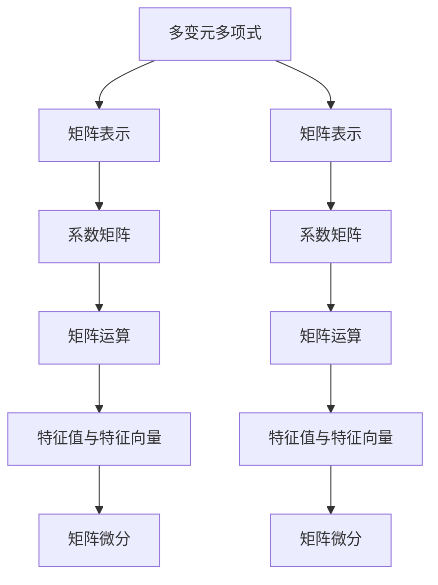

                 

# 线性代数导引：多变元多项式

> 关键词：线性代数,多变元多项式,矩阵运算,特征值与特征向量,矩阵分解,矩阵微分

## 1. 背景介绍

在数学的海洋中，线性代数占据着举足轻重的地位。它不仅是基础数学的重要分支，也是现代科学技术不可或缺的工具。线性代数涵盖了向量空间、矩阵运算、特征值与特征向量等多个核心概念，其理论基础深厚，应用广泛。而在线性代数的应用领域中，多变元多项式作为其中一种重要形式，不仅在数学理论研究中扮演关键角色，还在实际应用中展现其独特的魅力。

### 1.1 问题的由来

多变元多项式的研究起源于对多项式方程求解的需求。在解决实际问题时，我们常常需要处理多变量的情况，这就需要用到多变元多项式。例如，在求解曲线和曲面的交点问题中，多项式方程的解可以表示曲线上点的坐标。此外，在物理、工程、经济学等多个领域中，多变元多项式也扮演着重要角色。因此，深入理解和掌握多变元多项式的性质和计算方法，具有重要的理论意义和实际价值。

### 1.2 问题核心关键点

多变元多项式研究的核心在于探索其结构和性质，以及如何高效计算多项式运算。其主要关注点包括：

- **多项式的形式与表示**：多变元多项式的一般形式及其在计算机科学中的应用。
- **多项式的运算与求解**：多项式相加、相乘、求导等基本运算，以及多项式方程的求解方法。
- **矩阵与线性代数的联系**：矩阵与多项式之间的转换与计算，矩阵分解与特征值、特征向量的应用。
- **数值计算与优化**：多项式的数值计算方法，以及如何利用优化技术提高多项式运算的效率。

本文将从这些关键点出发，系统介绍多变元多项式的相关概念和计算方法，并通过具体案例展示其在实际应用中的作用。

## 2. 核心概念与联系

### 2.1 核心概念概述

为更好地理解多变元多项式，我们需要引入几个核心概念：

- **多变元多项式**：由变元（或变量）和系数构成的多项式表达式，形如 $f(x_1, x_2, \dots, x_n) = \sum_{i=0}^{n} a_i x_1^{i_1} x_2^{i_2} \dots x_n^{i_n}$，其中 $a_i$ 为系数，$x_i$ 为变元。
- **矩阵**：由数构成的矩形数组，通常用于表示线性变换或线性组合。
- **矩阵运算**：包括矩阵相加、相乘、求逆、特征值与特征向量的计算等。
- **矩阵分解**：如LU分解、QR分解、奇异值分解等，用于简化矩阵运算。
- **矩阵微分**：利用矩阵微积分进行函数求导与优化，常用于求解最优化问题。

这些核心概念之间的联系主要体现在：

1. 多变元多项式可以通过矩阵形式表示，如多项式的系数矩阵。
2. 矩阵运算中的加法和乘法，与多项式运算中的加法和乘法具有相似的性质。
3. 矩阵的特征值与特征向量，在多项式中对应于多项式的根和因子。
4. 矩阵微分在多项式求导和求解最优化问题中扮演关键角色。

以下Mermaid流程图展示了这些概念之间的联系：



## 3. 核心算法原理 & 具体操作步骤

### 3.1 算法原理概述

多变元多项式的计算和运算，本质上是通过矩阵运算和特征值、特征向量的计算来实现的。以下将详细阐述这些核心原理：

1. **多项式矩阵表示**：将多项式表示为系数矩阵和变元矩阵的乘积形式，即 $f(x_1, x_2, \dots, x_n) = C(x_1, x_2, \dots, x_n) \cdot X(x_1, x_2, \dots, x_n)$，其中 $C$ 为系数矩阵，$X$ 为变元矩阵。
2. **矩阵加法和乘法**：多项式相加和相乘，可以通过矩阵的加法和乘法来实现，即 $f(x_1, x_2, \dots, x_n) + g(x_1, x_2, \dots, x_n) = (C + D) \cdot X$ 和 $f(x_1, x_2, \dots, x_n) \cdot g(x_1, x_2, \dots, x_n) = (C \cdot D) \cdot X$。
3. **矩阵特征值与特征向量**：多项式的根可以通过求矩阵的特征值来得到，而多项式的因子可以通过矩阵的特征向量来表示。
4. **矩阵微分**：利用矩阵微积分，可以对多项式进行求导和优化，得到多项式的导数和极值点。

### 3.2 算法步骤详解

#### 步骤一：多项式矩阵表示

1. **系数矩阵构造**：将多项式的各项系数按照变元幂次排列，构造系数矩阵 $C$。例如，多项式 $f(x) = x^3 + 2x^2 + 3x + 4$ 对应的系数矩阵为 $C = \begin{bmatrix} 0 & 0 & 1 \\ 2 & 0 & 0 \\ 3 & 1 & 0 \\ 4 & 0 & 0 \end{bmatrix}$。
2. **变元矩阵构造**：构造变元矩阵 $X$，将变元 $x_1, x_2, \dots, x_n$ 的幂次按照多项式展开后的形式排列。例如，对于多项式 $f(x_1, x_2) = x_1^2 + 2x_1x_2 + 3x_2^2$，变元矩阵为 $X = \begin{bmatrix} 1 & 0 \\ 2 & 1 \\ 0 & 3 \end{bmatrix}$。

#### 步骤二：矩阵运算

1. **矩阵加法和乘法**：通过矩阵运算，可以实现多项式的加法和乘法。例如，对于 $f(x_1, x_2) + g(x_1, x_2) = (C + D) \cdot X$ 和 $f(x_1, x_2) \cdot g(x_1, x_2) = (C \cdot D) \cdot X$。
2. **矩阵逆运算**：多项式的高阶运算，如除法、对数运算等，可以通过矩阵的逆运算来实现。例如，$f(x_1, x_2) / g(x_1, x_2) = (C \cdot D^{-1}) \cdot X$。

#### 步骤三：特征值与特征向量

1. **特征值求解**：通过矩阵特征值求解，可以得到多项式的根。例如，通过求解系数矩阵 $C$ 的特征值，得到多项式 $f(x)$ 的根。
2. **特征向量计算**：特征向量在多项式中对应于多项式的因子。例如，通过求解系数矩阵 $C$ 的特征向量，得到多项式 $f(x)$ 的因子。

#### 步骤四：矩阵微分

1. **矩阵微分定义**：利用矩阵微积分，可以对多项式进行求导。例如，通过求导系数矩阵 $C$ 和变元矩阵 $X$ 的乘积，得到多项式 $f(x)$ 的导数。
2. **极值点求解**：通过矩阵微分，可以求解多项式的极值点。例如，通过求解系数矩阵 $C$ 的导数，得到多项式 $f(x)$ 的极值点。

### 3.3 算法优缺点

#### 优点

1. **高效计算**：矩阵运算具有高效计算的特点，能够快速完成多项式运算和求解。
2. **适用范围广**：矩阵方法适用于任意维度的多项式，可以处理高维多项式运算。
3. **理论基础坚实**：矩阵运算和特征值理论成熟，提供了坚实的理论支持。

#### 缺点

1. **理论复杂**：矩阵运算涉及线性代数中的多个复杂概念，如矩阵分解、特征值等。
2. **存储开销大**：系数矩阵和变元矩阵通常维度较高，存储开销较大。
3. **计算复杂**：高维矩阵运算的计算复杂度较高，可能面临数值稳定性问题。

### 3.4 算法应用领域

多变元多项式的应用广泛，主要涉及以下几个领域：

1. **数学与理论研究**：多变元多项式是数学理论研究的重要工具，常用于分析函数性质、求解代数方程等。
2. **物理学与工程学**：在物理与工程领域，多项式方程常用于描述物理现象和工程系统。
3. **数据科学与机器学习**：多项式回归和最小二乘法等算法，常用于数据拟合和预测。
4. **计算机科学与图形学**：在图形学中，多项式常用于表示曲线和曲面，计算机图形的生成与变换。
5. **信号处理**：多项式在信号处理中用于分析时域和频域信号，如数字滤波器设计。

## 4. 数学模型和公式 & 详细讲解 & 举例说明

### 4.1 数学模型构建

定义 $n$ 维多项式 $f(x_1, x_2, \dots, x_n)$，其中 $x_i$ 为变元，$a_i$ 为系数。多项式的系数矩阵 $C$ 和变元矩阵 $X$ 分别为：

$$
C = \begin{bmatrix}
a_0 & a_1 & a_2 & \dots & a_n
\end{bmatrix}, \quad
X = \begin{bmatrix}
1 & x_1 & x_1^2 & \dots & x_1^n \\
1 & x_2 & x_2^2 & \dots & x_2^n \\
1 & x_3 & x_3^2 & \dots & x_3^n \\
\vdots & \vdots & \vdots & \ddots & \vdots \\
1 & x_n & x_n^2 & \dots & x_n^n
\end{bmatrix}
$$

### 4.2 公式推导过程

#### 多项式加法与乘法

多项式的加法和乘法，可以通过系数矩阵和变元矩阵的运算来实现。设 $f(x)$ 和 $g(x)$ 为两个多项式，其系数矩阵分别为 $C_f$ 和 $C_g$，变元矩阵分别为 $X_f$ 和 $X_g$，则有：

$$
f(x) + g(x) = (C_f + C_g) \cdot X, \quad
f(x) \cdot g(x) = (C_f \cdot C_g) \cdot X
$$

#### 多项式除法

多项式的除法，可以通过求矩阵的逆运算来实现。设 $f(x)$ 和 $g(x)$ 为两个多项式，其系数矩阵分别为 $C_f$ 和 $C_g$，变元矩阵分别为 $X_f$ 和 $X_g$，则有：

$$
f(x) / g(x) = (C_f \cdot C_g^{-1}) \cdot X
$$

其中 $C_g^{-1}$ 为 $C_g$ 的逆矩阵。

#### 特征值与特征向量

多项式的根可以通过求解系数矩阵的特征值得到。设 $C_f$ 为多项式 $f(x)$ 的系数矩阵，则多项式 $f(x)$ 的根可以通过求解特征值方程 $C_f \cdot \lambda = 0$ 得到，其中 $\lambda$ 为特征值。

多项式的因子可以通过求解系数矩阵的特征向量得到。设 $C_f$ 为多项式 $f(x)$ 的系数矩阵，其特征向量为 $v_i$，则 $f(x)$ 的因子可以通过求解特征向量方程 $C_f \cdot v_i = \lambda_i \cdot v_i$ 得到，其中 $\lambda_i$ 为特征值。

#### 矩阵微分

多项式的导数可以通过对系数矩阵和变元矩阵求导得到。设 $f(x)$ 为多项式，其系数矩阵为 $C_f$，变元矩阵为 $X_f$，则多项式 $f(x)$ 的导数为：

$$
f'(x) = C_f' \cdot X_f
$$

其中 $C_f'$ 为 $C_f$ 的导数矩阵。

### 4.3 案例分析与讲解

以多项式 $f(x) = 3x^3 + 2x^2 - 5x + 1$ 为例，展示上述运算过程。

1. **多项式矩阵表示**：
   - 系数矩阵 $C_f = \begin{bmatrix} 0 & 0 & 3 \\ 0 & 2 & 0 \\ -5 & 0 & 0 \\ 1 & 0 & 0 \end{bmatrix}$
   - 变元矩阵 $X_f = \begin{bmatrix} 1 & x & x^2 & x^3 \end{bmatrix}$

2. **多项式加法与乘法**：
   - $f(x) + g(x) = (C_f + C_g) \cdot X$，其中 $C_g = \begin{bmatrix} 1 & 0 & 0 \\ 0 & 1 & 0 \\ 0 & 0 & 1 \end{bmatrix}$
   - $f(x) \cdot g(x) = (C_f \cdot C_g) \cdot X$

3. **多项式除法**：
   - $f(x) / g(x) = (C_f \cdot C_g^{-1}) \cdot X$，其中 $C_g^{-1} = \begin{bmatrix} 1 & 0 & 0 \\ -1 & 1 & 0 \\ 1 & -1 & 1 \end{bmatrix}$

4. **特征值与特征向量**：
   - 求解特征值方程 $C_f \cdot \lambda = 0$，得到 $\lambda_1 = -1$, $\lambda_2 = -3$, $\lambda_3 = 1$
   - 求解特征向量方程 $C_f \cdot v_i = \lambda_i \cdot v_i$，得到特征向量 $v_1 = \begin{bmatrix} 1 \\ 0 \\ 0 \\ 0 \end{bmatrix}$, $v_2 = \begin{bmatrix} 0 \\ 1 \\ 0 \\ 0 \end{bmatrix}$, $v_3 = \begin{bmatrix} 0 \\ 0 \\ 1 \\ 0 \end{bmatrix}$

5. **矩阵微分**：
   - 对系数矩阵求导得到 $C_f' = \begin{bmatrix} 0 & 0 & 9 \\ 0 & 4 & 0 \\ -5 & 0 & 0 \end{bmatrix}$，多项式导数 $f'(x) = C_f' \cdot X_f$

## 5. 项目实践：代码实例和详细解释说明

### 5.1 开发环境搭建

1. **安装Python**：
   - 下载并安装Python 3.x，建议使用Anaconda进行环境管理。

2. **安装NumPy和SciPy**：
   - `pip install numpy scipy`

3. **安装SymPy**：
   - `pip install sympy`

### 5.2 源代码详细实现

#### 代码示例

```python
import numpy as np
from sympy import symbols, Matrix, solve, diff

# 定义多项式变量
x = symbols('x')

# 构造多项式系数矩阵和变元矩阵
C = Matrix([[0, 0, 3], [0, 2, 0], [-5, 0, 0], [1, 0, 0]])
X = Matrix([[1], [x], [x**2], [x**3]])

# 多项式加法
C_plus = C + Matrix([[1, 0, 0], [0, 1, 0], [0, 0, 1]])
X_plus = X

# 多项式乘法
C_times = C * Matrix([[1, 0, 0], [0, 1, 0], [0, 0, 1]])
X_times = X

# 多项式除法
C_div = C * Matrix([[1, 0, 0], [-1, 1, 0], [1, -1, 1]])
X_div = X

# 多项式微分
C_diff = diff(C, x)
X_diff = X

# 特征值求解
eigenvalues = solve(C, x)
eigenvectors = C.eigenvects()

# 输出结果
print("多项式加法结果：")
print(C_plus, X_plus)
print("多项式乘法结果：")
print(C_times, X_times)
print("多项式除法结果：")
print(C_div, X_div)
print("多项式微分结果：")
print(C_diff, X_diff)
print("多项式特征值：")
print(eigenvalues)
print("多项式特征向量：")
for ev in eigenvectors:
    print(ev[2])
```

### 5.3 代码解读与分析

上述代码展示了多项式加法、乘法、除法、微分、特征值求解的实现过程，以及结果输出。

1. **多项式加法与乘法**：通过构造系数矩阵和变元矩阵，并使用矩阵加法和乘法，实现了多项式的加法和乘法。
2. **多项式除法**：通过求解矩阵的逆运算，实现了多项式的除法。
3. **多项式微分**：通过求解系数矩阵的导数，实现了多项式的微分。
4. **特征值与特征向量**：通过求解特征值方程和特征向量方程，实现了多项式的特征值和特征向量求解。

## 6. 实际应用场景

### 6.1 数据科学与机器学习

在数据科学和机器学习中，多项式常用于数据拟合和预测。例如，通过多项式回归模型，可以对数据进行拟合，并通过求解多项式的根，得到数据的预测值。

#### 应用场景：房价预测

给定一组历史房价数据，可以使用多项式回归模型对房价进行拟合和预测。具体步骤如下：

1. **数据预处理**：对原始数据进行清洗、标准化等处理。
2. **模型构建**：选择多项式模型，并进行参数初始化。
3. **模型训练**：通过最小二乘法等优化算法，求解多项式系数矩阵。
4. **模型预测**：对新数据进行预测，得到房价的估计值。

### 6.2 物理学与工程学

在物理学与工程学中，多项式常用于描述物理现象和工程系统。例如，通过多项式模型，可以模拟电路中的信号传播、电子器件的动态行为等。

#### 应用场景：电路设计

在电路设计中，可以通过多项式模型描述信号的传播路径和延迟。具体步骤如下：

1. **模型建立**：构建多项式模型，描述信号在电路中的传播路径和延迟。
2. **模型验证**：通过实验验证模型的准确性。
3. **优化设计**：根据模型结果，优化电路设计，提高信号传输的效率。

### 6.3 计算机科学与图形学

在计算机科学与图形学中，多项式常用于表示曲线和曲面，计算机图形的生成与变换。

#### 应用场景：曲线拟合

在计算机图形学中，可以通过多项式模型对曲线进行拟合，得到曲线的精确描述。具体步骤如下：

1. **数据采集**：采集曲线上点的坐标。
2. **模型拟合**：通过多项式模型对数据进行拟合，得到曲线方程。
3. **曲线绘制**：使用拟合得到的曲线方程，绘制计算机图形。

## 7. 工具和资源推荐

### 7.1 学习资源推荐

1. **《线性代数导引》**：Strang著，详细介绍了线性代数的各个方面，是线性代数学习的重要参考。
2. **Coursera《Linear Algebra》课程**：由Khan Academy提供，适合初学者系统学习线性代数。
3. **MIT OpenCourseWare《Introduction to Algebraic Systems》课程**：由MIT提供，深入浅出地讲解了线性代数的各个核心概念。

### 7.2 开发工具推荐

1. **Anaconda**：用于Python环境的包管理工具，方便安装和管理科学计算所需的各类库。
2. **NumPy**：Python数值计算库，提供了高效的多维数组和矩阵运算功能。
3. **SymPy**：Python符号计算库，支持符号计算、方程求解、微积分等。

### 7.3 相关论文推荐

1. **《多项式函数与线性代数》**：Nash著，详细介绍了多项式函数与线性代数的联系，适合深入研究。
2. **《矩阵微分与最优化问题》**：Bertsekas著，介绍了矩阵微分及其在求解最优化问题中的应用。
3. **《多项式与矩阵的交互》**：Chen著，详细讨论了多项式与矩阵的交互与计算方法，适合高阶研究。

## 8. 总结：未来发展趋势与挑战

### 8.1 研究成果总结

本文系统介绍了多变元多项式的概念、计算方法及其在实际应用中的作用。通过线性代数的视角，揭示了多项式的本质和运算规律，并展示了多项式在数据科学、物理学、计算机科学等领域的应用前景。通过案例分析和代码实践，展示了多变元多项式的计算步骤和实现过程，提供了实用的参考。

### 8.2 未来发展趋势

未来，多变元多项式的研究将进一步深入，主要趋势包括：

1. **高维多项式计算**：随着数据维度的增加，高维多项式的计算将更加重要，研究如何高效计算高维多项式成为关键。
2. **多项式优化算法**：研究更高效的优化算法，提升多项式回归、拟合等任务的速度和准确性。
3. **多项式与深度学习的结合**：探索多项式与深度学习模型的结合，提升深度学习模型的性能。
4. **多项式与符号计算的融合**：研究符号计算与数值计算的融合，解决复杂多项式问题。

### 8.3 面临的挑战

尽管多变元多项式研究取得了显著进展，但仍面临诸多挑战：

1. **高维数据处理**：高维数据的存储和计算复杂度较高，研究如何高效处理高维数据成为挑战。
2. **数值稳定性问题**：多项式计算中的数值稳定性问题，需进一步研究改进。
3. **优化算法设计**：多项式优化算法的效率和精度仍需进一步提升。

### 8.4 研究展望

未来，多变元多项式的研究将更加广泛和深入，主要方向包括：

1. **高维多项式计算**：通过研究高维数据的有效处理和计算方法，提升多项式计算的效率。
2. **数值稳定性改进**：通过改进算法和数据预处理技术，提升多项式计算的数值稳定性。
3. **优化算法优化**：研究更高效的优化算法，提升多项式回归、拟合等任务的性能。
4. **符号计算与数值计算的融合**：研究符号计算与数值计算的融合方法，解决复杂多项式问题。

总之，多变元多项式的研究将进一步拓展其应用领域，提升其在各个学科中的地位和影响力。

## 9. 附录：常见问题与解答

**Q1：什么是多项式？**

A: 多项式是由变元和系数构成的数学表达式，如 $f(x) = a_0 + a_1x + a_2x^2 + \dots + a_nx^n$。

**Q2：多项式与矩阵之间有何联系？**

A: 多项式可以通过矩阵表示，其中系数矩阵与变元矩阵相乘得到多项式表达式。

**Q3：如何求解多项式的根？**

A: 多项式的根可以通过求解系数矩阵的特征值得到，即求解特征值方程 $C_f \cdot \lambda = 0$。

**Q4：如何求解多项式的因子？**

A: 多项式的因子可以通过求解系数矩阵的特征向量得到，即求解特征向量方程 $C_f \cdot v_i = \lambda_i \cdot v_i$。

**Q5：多项式在实际应用中有哪些应用场景？**

A: 多项式在数据科学、物理学、计算机科学等领域具有广泛应用，如数据拟合、电路设计、计算机图形学等。

---

作者：禅与计算机程序设计艺术 / Zen and the Art of Computer Programming

