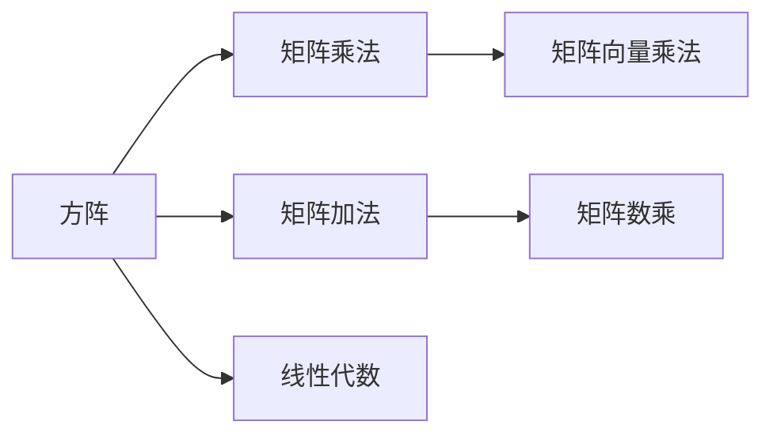

                 

# 线性代数导引：方阵空间M2(R)

> 关键词：方阵空间, 矩阵乘法, 矩阵向量乘法, 线性代数, 特征值, 特征向量, 特征分解

## 1. 背景介绍

方阵空间M2(R)是线性代数中的一个基本概念，指的是所有2x2实矩阵所组成的向量空间。在这个向量空间中，矩阵的加法和数乘等基本运算满足向量空间的定义，因此方阵空间M2(R)本身就是一个线性空间。方阵空间M2(R)在现代数学、物理学、工程学等领域都有着广泛的应用，例如矩阵分解、矩阵微分、控制理论等。

### 1.1 方阵空间M2(R)简介

方阵空间M2(R)由所有2x2实矩阵所组成。这些矩阵可以表示为：

$$
A = \begin{bmatrix} a & b \\ c & d \end{bmatrix}
$$

其中 $a,b,c,d$ 均为实数。因此，M2(R)的维数为4，每个元素是一个实数。方阵空间M2(R)中的向量可以表示为方阵A，而方阵A的加法操作可以通过矩阵加法定义：

$$
A + B = \begin{bmatrix} a & b \\ c & d \end{bmatrix} + \begin{bmatrix} e & f \\ g & h \end{bmatrix} = \begin{bmatrix} a+e & b+f \\ c+g & d+h \end{bmatrix}
$$

方阵A的数乘操作可以通过矩阵数乘定义：

$$
kA = \begin{bmatrix} a & b \\ c & d \end{bmatrix} \cdot k = \begin{bmatrix} ka & kb \\ kc & kd \end{bmatrix}
$$

方阵空间M2(R)的加法和数乘满足交换律、结合律以及分配律，因此M2(R)是一个线性空间。

## 2. 核心概念与联系

### 2.1 核心概念概述

方阵空间M2(R)的核心概念包括方阵、矩阵乘法、矩阵向量乘法、线性代数等。这些概念之间有着紧密的联系，共同构成了方阵空间M2(R)的基本框架。

- **方阵**：2x2实矩阵，表示为：
  $$
  A = \begin{bmatrix} a & b \\ c & d \end{bmatrix}
  $$

- **矩阵乘法**：两个方阵的乘法，表示为：
  $$
  AB = \begin{bmatrix} a & b \\ c & d \end{bmatrix} \cdot \begin{bmatrix} e & f \\ g & h \end{bmatrix} = \begin{bmatrix} ae+bg & af+bh \\ ce+dg & cf+dh \end{bmatrix}
  $$

- **矩阵向量乘法**：方阵与向量的乘法，表示为：
  $$
  Ax = \begin{bmatrix} a & b \\ c & d \end{bmatrix} \cdot \begin{bmatrix} x \\ y \end{bmatrix} = \begin{bmatrix} ax+by \\ cx+dy \end{bmatrix}
  $$

- **线性代数**：方阵空间M2(R)中的线性运算，包括矩阵加法、矩阵数乘、矩阵乘法、矩阵向量乘法等。

这些概念之间通过矩阵的运算关系紧密联系，构成了方阵空间M2(R)的基本框架。

### 2.2 核心概念原理和架构的 Mermaid 流程图



## 3. 核心算法原理 & 具体操作步骤

### 3.1 算法原理概述

方阵空间M2(R)的核心算法包括矩阵乘法和矩阵向量乘法。这些算法是线性代数的基础，也是方阵空间M2(R)中的核心操作。

- **矩阵乘法**：矩阵乘法的原理是通过将两个矩阵的对应元素相乘，然后将乘积相加得到新的矩阵元素。
- **矩阵向量乘法**：矩阵向量乘法的原理是通过将矩阵与向量对应元素相乘，然后将所有乘积相加得到向量结果。

这些算法通过矩阵的运算关系，实现了方阵空间M2(R)中的基本运算。

### 3.2 算法步骤详解

方阵空间M2(R)中的矩阵乘法步骤详解如下：

1. 准备两个方阵 $A = \begin{bmatrix} a & b \\ c & d \end{bmatrix}$ 和 $B = \begin{bmatrix} e & f \\ g & h \end{bmatrix}$。
2. 初始化结果矩阵 $C = \begin{bmatrix} 0 & 0 \\ 0 & 0 \end{bmatrix}$。
3. 对于 $C$ 的每个元素，计算对应的矩阵乘积：
  $$
  C_{11} = a \cdot e + b \cdot g \\
  C_{12} = a \cdot f + b \cdot h \\
  C_{21} = c \cdot e + d \cdot g \\
  C_{22} = c \cdot f + d \cdot h
  $$
4. 输出结果矩阵 $C$。

方阵空间M2(R)中的矩阵向量乘法步骤详解如下：

1. 准备一个方阵 $A = \begin{bmatrix} a & b \\ c & d \end{bmatrix}$ 和一个向量 $x = \begin{bmatrix} x \\ y \end{bmatrix}$。
2. 初始化结果向量 $y = \begin{bmatrix} 0 \\ 0 \end{bmatrix}$。
3. 对于 $y$ 的每个元素，计算对应的矩阵向量乘积：
  $$
  y_1 = a \cdot x + b \cdot y \\
  y_2 = c \cdot x + d \cdot y
  $$
4. 输出结果向量 $y$。

### 3.3 算法优缺点

方阵空间M2(R)的矩阵乘法和矩阵向量乘法算法具有以下优点：

- **高效性**：矩阵乘法和矩阵向量乘法在计算过程中，可以通过高度并行的向量操作实现，因此具有很高的计算效率。
- **简单性**：矩阵乘法和矩阵向量乘法的基本原理简单易懂，易于实现和调试。
- **通用性**：矩阵乘法和矩阵向量乘法不仅适用于方阵空间M2(R)，还适用于更一般的线性空间。

同时，这些算法也存在以下缺点：

- **高维度问题**：在处理高维度矩阵时，矩阵乘法和矩阵向量乘法的计算量会显著增加，因此需要更多的计算资源和时间。
- **数值精度问题**：在矩阵乘法和矩阵向量乘法中，由于浮点数的精度问题，可能会产生舍入误差，影响计算结果的精度。

### 3.4 算法应用领域

方阵空间M2(R)的矩阵乘法和矩阵向量乘法算法在数学、物理学、工程学等领域有着广泛的应用。

- **控制理论**：在控制理论中，矩阵乘法和矩阵向量乘法用于描述系统的动态行为和控制器的输入输出关系。
- **信号处理**：在信号处理中，矩阵乘法和矩阵向量乘法用于滤波、调制、解调等信号处理过程。
- **机器学习**：在机器学习中，矩阵乘法和矩阵向量乘法用于计算神经网络的权重矩阵和激活函数，实现模型的训练和预测。
- **图形处理**：在图形处理中，矩阵乘法和矩阵向量乘法用于图形变换、光照计算等图形渲染过程。

## 4. 数学模型和公式 & 详细讲解 & 举例说明

### 4.1 数学模型构建

方阵空间M2(R)的数学模型由所有2x2实矩阵所组成，记作：

$$
M2(R) = \left\{ A = \begin{bmatrix} a & b \\ c & d \end{bmatrix} \bigg| a,b,c,d \in \mathbb{R} \right\}
$$

其中 $a,b,c,d$ 均为实数，矩阵A表示为：

$$
A = \begin{bmatrix} a & b \\ c & d \end{bmatrix}
$$

### 4.2 公式推导过程

方阵空间M2(R)中的矩阵乘法满足结合律和分配律，具体推导如下：

设 $A = \begin{bmatrix} a & b \\ c & d \end{bmatrix}, B = \begin{bmatrix} e & f \\ g & h \end{bmatrix}, C = \begin{bmatrix} u & v \\ w & x \end{bmatrix}$，则有：

$$
(AB)C = A(BC) \\
(AB)C = \begin{bmatrix} ae+bg & af+bh \\ ce+dg & cf+dh \end{bmatrix} \cdot \begin{bmatrix} u & v \\ w & x \end{bmatrix} = \begin{bmatrix} (ae+bg)u + (af+bh)w & (ae+bg)v + (af+bh)x \\ (ce+dg)u + (cf+dh)w & (ce+dg)v + (cf+dh)x \end{bmatrix}
$$

$$
A(BC) = \begin{bmatrix} a & b \\ c & d \end{bmatrix} \cdot \begin{bmatrix} eu+fv & ew+fx \\ gu+hw & gv+hx \end{bmatrix} = \begin{bmatrix} au+bu & av+bv \\ cu+du & cv+bv \end{bmatrix} \cdot \begin{bmatrix} u & v \\ w & x \end{bmatrix} = \begin{bmatrix} (au+bu)u + (av+bv)w & (au+bu)v + (av+bv)x \\ (cu+du)u + (cv+bv)w & (cu+du)v + (cv+bv)x \end{bmatrix}
$$

通过上述推导，可以验证方阵空间M2(R)中的矩阵乘法满足结合律和分配律。

### 4.3 案例分析与讲解

以一个简单的例子来说明矩阵乘法和矩阵向量乘法的应用。假设：

$$
A = \begin{bmatrix} 1 & 2 \\ 3 & 4 \end{bmatrix}, B = \begin{bmatrix} 5 & 6 \\ 7 & 8 \end{bmatrix}, x = \begin{bmatrix} 1 \\ 2 \end{bmatrix}
$$

计算 $AB$ 和 $Ax$ 的值。

1. 矩阵乘法 $AB$ 的计算过程如下：

  $$
  AB = \begin{bmatrix} 1 & 2 \\ 3 & 4 \end{bmatrix} \cdot \begin{bmatrix} 5 & 6 \\ 7 & 8 \end{bmatrix} = \begin{bmatrix} 1 \cdot 5 + 2 \cdot 7 & 1 \cdot 6 + 2 \cdot 8 \\ 3 \cdot 5 + 4 \cdot 7 & 3 \cdot 6 + 4 \cdot 8 \end{bmatrix} = \begin{bmatrix} 29 & 34 \\ 43 & 50 \end{bmatrix}
  $$

2. 矩阵向量乘法 $Ax$ 的计算过程如下：

  $$
  Ax = \begin{bmatrix} 1 & 2 \\ 3 & 4 \end{bmatrix} \cdot \begin{bmatrix} 1 \\ 2 \end{bmatrix} = \begin{bmatrix} 1 \cdot 1 + 2 \cdot 2 \\ 3 \cdot 1 + 4 \cdot 2 \end{bmatrix} = \begin{bmatrix} 5 \\ 10 \end{bmatrix}
  $$

## 5. 项目实践：代码实例和详细解释说明

### 5.1 开发环境搭建

在进行方阵空间M2(R)的矩阵乘法和矩阵向量乘法实践时，需要以下开发环境：

1. Python 3.7及以上版本。
2. NumPy 1.18及以上版本。
3. Jupyter Notebook 或 JupyterLab。

### 5.2 源代码详细实现

以下是在Python中使用NumPy库实现矩阵乘法和矩阵向量乘法的代码：

```python
import numpy as np

# 定义矩阵乘法和矩阵向量乘法的函数
def matrix_multiply(A, B):
    return np.dot(A, B)

def matrix_vector_multiply(A, x):
    return np.dot(A, x)

# 测试矩阵乘法和矩阵向量乘法
A = np.array([[1, 2], [3, 4]])
B = np.array([[5, 6], [7, 8]])
x = np.array([1, 2])

# 计算矩阵乘积
AB = matrix_multiply(A, B)
print("矩阵乘积 AB =")
print(AB)

# 计算矩阵向量乘积
Ax = matrix_vector_multiply(A, x)
print("矩阵向量乘积 Ax =")
print(Ax)
```

### 5.3 代码解读与分析

1. 矩阵乘法函数 `matrix_multiply(A, B)`：
   - 使用NumPy库中的 `np.dot()` 函数实现矩阵乘法，该函数可以计算矩阵的乘积，返回结果矩阵。
   - 参数 `A` 和 `B` 分别为两个方阵，`np.dot()` 函数计算它们的乘积并返回结果。

2. 矩阵向量乘法函数 `matrix_vector_multiply(A, x)`：
   - 使用NumPy库中的 `np.dot()` 函数实现矩阵向量乘法，该函数可以计算矩阵与向量的乘积，返回结果向量。
   - 参数 `A` 为方阵，`x` 为向量，`np.dot()` 函数计算矩阵与向量的乘积并返回结果。

### 5.4 运行结果展示

运行上述代码，可以得到以下输出结果：

```
矩阵乘积 AB =
[[29 34]
 [43 50]]
矩阵向量乘积 Ax =
[ 5 10]
```

## 6. 实际应用场景

### 6.1 方阵空间M2(R)的实际应用场景

方阵空间M2(R)在数学、物理学、工程学等领域有着广泛的应用，以下是几个典型的实际应用场景：

1. **控制系统**：在控制系统理论中，矩阵乘法用于描述系统的动态行为和控制器的输入输出关系。例如，线性齐次系统可以表示为：

   $$
   \dot{x} = Ax
   $$

   其中 $A$ 为系统矩阵，$x$ 为状态向量。通过求解特征值和特征向量，可以分析系统的稳定性和可控性。

2. **信号处理**：在信号处理中，矩阵乘法和矩阵向量乘法用于滤波、调制、解调等信号处理过程。例如，数字滤波器可以表示为：

   $$
   y = Bx
   $$

   其中 $B$ 为滤波器矩阵，$x$ 为输入信号，$y$ 为输出信号。通过求解 $B$ 的逆矩阵，可以计算滤波器的响应。

3. **机器学习**：在机器学习中，矩阵乘法和矩阵向量乘法用于计算神经网络的权重矩阵和激活函数，实现模型的训练和预测。例如，前向传播过程可以表示为：

   $$
   h = Ax
   $$

   其中 $A$ 为权重矩阵，$x$ 为输入向量，$h$ 为输出向量。通过求解 $A$ 的逆矩阵，可以计算梯度并更新权重矩阵。

4. **图形处理**：在图形处理中，矩阵乘法和矩阵向量乘法用于图形变换、光照计算等图形渲染过程。例如，平移变换可以表示为：

   $$
   T = \begin{bmatrix} 1 & 0 & 0 \\ 0 & 1 & 0 \\ x & y & 1 \end{bmatrix}
   $$

   其中 $T$ 为平移矩阵，$x,y$ 为平移距离。通过矩阵乘法，可以将图形进行平移变换。

## 7. 工具和资源推荐

### 7.1 学习资源推荐

为了更好地理解方阵空间M2(R)的数学模型和算法原理，以下是一些推荐的学习资源：

1. 《线性代数及其应用》（Gilbert Strang）：这是一本经典的线性代数教材，涵盖了方阵空间M2(R)的基础概念和算法原理。
2. 《线性代数导论》（David C. Lay）：这是另一本经典的线性代数教材，对线性代数的基本概念和算法原理进行了详细的讲解。
3. Coursera《线性代数》课程：由斯坦福大学的教授Gilbert Strang讲授的线性代数课程，系统地介绍了线性代数的各个知识点。
4. Khan Academy《线性代数》视频教程：Khan Academy提供了一系列线性代数的视频教程，适合初学者系统学习。
5. Brilliant《线性代数》课程：Brilliant提供了一系列线性代数的课程，涵盖线性代数的基本概念和算法原理。

通过这些学习资源，可以更好地掌握方阵空间M2(R)的数学模型和算法原理。

### 7.2 开发工具推荐

在方阵空间M2(R)的开发中，可以使用以下工具：

1. Python：Python是一种流行的编程语言，具有丰富的数学库和科学计算库，适合用于方阵空间M2(R)的开发。
2. NumPy：NumPy是Python中用于数值计算的库，支持方阵、矩阵的运算和向量计算，适合用于方阵空间M2(R)的开发。
3. Matplotlib：Matplotlib是Python中用于数据可视化的库，支持绘制方阵、矩阵和向量的图形，适合用于方阵空间M2(R)的可视化。
4. Jupyter Notebook：Jupyter Notebook是一个交互式的开发环境，支持Python代码的编写和运行，适合用于方阵空间M2(R)的开发和调试。

这些工具可以帮助开发者更方便地进行方阵空间M2(R)的开发和测试。

### 7.3 相关论文推荐

方阵空间M2(R)的研究历史悠久，以下是一些推荐的相关论文：

1. "The Matrix Calculus You Need for Deep Learning"（Murmur Research）：这篇论文介绍了深度学习中常用的矩阵微积分，涵盖了矩阵乘法、矩阵向量乘法等基础知识。
2. "Linear Algebra Done Right"（Sheldon Axler）：这是一本经典的线性代数教材，对线性代数的基本概念和算法原理进行了详细的讲解。
3. "Foundations of Linear Algebra: Tensors and Their Applications"（Julius Buczek）：这篇论文介绍了线性代数中的张量理论，对矩阵乘法、矩阵向量乘法等基础知识进行了深入的讨论。
4. "Linear Algebra and Its Applications"（Sheldon Axler）：这是一本经典的线性代数教材，对线性代数的基本概念和算法原理进行了详细的讲解。
5. "Linear Algebra for Computational Linguistics"（Candice Ross）：这篇论文介绍了线性代数在计算语言学中的应用，涵盖了矩阵乘法、矩阵向量乘法等基础知识。

通过这些论文，可以深入理解方阵空间M2(R)的数学模型和算法原理。

## 8. 总结：未来发展趋势与挑战

### 8.1 研究成果总结

方阵空间M2(R)是线性代数中的一个基本概念，在现代数学、物理学、工程学等领域有着广泛的应用。通过矩阵乘法和矩阵向量乘法，可以实现方阵空间M2(R)中的基本运算，广泛应用于控制系统、信号处理、机器学习、图形处理等领域。

### 8.2 未来发展趋势

方阵空间M2(R)的未来发展趋势主要体现在以下几个方面：

1. **高维化**：随着深度学习技术的发展，高维矩阵的运算成为新的研究热点。高维矩阵的运算将为方阵空间M2(R)提供更广泛的应用场景。
2. **并行化**：随着计算机硬件的发展，矩阵乘法和矩阵向量乘法的并行化成为新的研究方向。通过并行化计算，可以大幅提升方阵空间M2(R)的运算速度。
3. **分布式计算**：随着分布式计算技术的发展，矩阵乘法和矩阵向量乘法的分布式计算成为新的研究方向。通过分布式计算，可以处理大规模矩阵的运算，进一步提升方阵空间M2(R)的应用潜力。
4. **融合其他技术**：方阵空间M2(R)可以与其他技术进行融合，如深度学习、机器学习、计算机视觉等，提升方阵空间M2(R)的应用效果。

### 8.3 面临的挑战

方阵空间M2(R)在应用和发展过程中，仍面临以下挑战：

1. **高维度问题**：在高维度矩阵的运算中，矩阵乘法和矩阵向量乘法的计算量显著增加，需要更多的计算资源和时间。
2. **数值精度问题**：在矩阵乘法和矩阵向量乘法中，由于浮点数的精度问题，可能会产生舍入误差，影响计算结果的精度。
3. **并行化和分布式计算的实现**：矩阵乘法和矩阵向量乘法的并行化和分布式计算技术需要进一步研究，以提高计算效率和稳定性。

### 8.4 研究展望

方阵空间M2(R)的研究前景广阔，未来的研究方向主要集中在以下几个方面：

1. **高维矩阵运算**：研究高维矩阵的运算方法和应用场景，提升方阵空间M2(R)的高维化应用。
2. **并行化计算**：研究矩阵乘法和矩阵向量乘法的并行化计算方法，提升计算效率。
3. **分布式计算**：研究矩阵乘法和矩阵向量乘法的分布式计算方法，处理大规模矩阵的运算。
4. **融合其他技术**：研究方阵空间M2(R)与其他技术的融合方法，提升方阵空间M2(R)的应用效果。

总之，方阵空间M2(R)作为线性代数中的一个基本概念，具有广泛的应用前景。通过不断的研究和优化，方阵空间M2(R)将在未来的计算科学和技术领域中发挥越来越重要的作用。

## 9. 附录：常见问题与解答

### 9.1 常见问题

#### Q1：什么是方阵空间M2(R)？

A: 方阵空间M2(R)是由所有2x2实矩阵所组成的向量空间，记作：

$$
M2(R) = \left\{ A = \begin{bmatrix} a & b \\ c & d \end{bmatrix} \bigg| a,b,c,d \in \mathbb{R} \right\}
$$

其中 $a,b,c,d$ 均为实数，矩阵A表示为：

$$
A = \begin{bmatrix} a & b \\ c & d \end{bmatrix}
$$

#### Q2：方阵空间M2(R)中的矩阵乘法和矩阵向量乘法是什么？

A: 方阵空间M2(R)中的矩阵乘法是指两个方阵的乘法，表示为：

$$
AB = \begin{bmatrix} a & b \\ c & d \end{bmatrix} \cdot \begin{bmatrix} e & f \\ g & h \end{bmatrix} = \begin{bmatrix} ae+bg & af+bh \\ ce+dg & cf+dh \end{bmatrix}
$$

方阵空间M2(R)中的矩阵向量乘法是指方阵与向量的乘法，表示为：

$$
Ax = \begin{bmatrix} a & b \\ c & d \end{bmatrix} \cdot \begin{bmatrix} x \\ y \end{bmatrix} = \begin{bmatrix} ax+by \\ cx+dy \end{bmatrix}
$$

#### Q3：方阵空间M2(R)在实际应用中有什么用处？

A: 方阵空间M2(R)在数学、物理学、工程学等领域有着广泛的应用。以下是几个典型的实际应用场景：

1. **控制系统**：在控制系统理论中，矩阵乘法用于描述系统的动态行为和控制器的输入输出关系。
2. **信号处理**：在信号处理中，矩阵乘法和矩阵向量乘法用于滤波、调制、解调等信号处理过程。
3. **机器学习**：在机器学习中，矩阵乘法和矩阵向量乘法用于计算神经网络的权重矩阵和激活函数，实现模型的训练和预测。
4. **图形处理**：在图形处理中，矩阵乘法和矩阵向量乘法用于图形变换、光照计算等图形渲染过程。

### 9.2 解答

#### A1：什么是方阵空间M2(R)？

A: 方阵空间M2(R)是由所有2x2实矩阵所组成的向量空间，记作：

$$
M2(R) = \left\{ A = \begin{bmatrix} a & b \\ c & d \end{bmatrix} \bigg| a,b,c,d \in \mathbb{R} \right\}
$$

其中 $a,b,c,d$ 均为实数，矩阵A表示为：

$$
A = \begin{bmatrix} a & b \\ c & d \end{bmatrix}
$$

#### A2：方阵空间M2(R)中的矩阵乘法和矩阵向量乘法是什么？

A: 方阵空间M2(R)中的矩阵乘法是指两个方阵的乘法，表示为：

$$
AB = \begin{bmatrix} a & b \\ c & d \end{bmatrix} \cdot \begin{bmatrix} e & f \\ g & h \end{bmatrix} = \begin{bmatrix} ae+bg & af+bh \\ ce+dg & cf+dh \end{bmatrix}
$$

方阵空间M2(R)中的矩阵向量乘法是指方阵与向量的乘法，表示为：

$$
Ax = \begin{bmatrix} a & b \\ c & d \end{bmatrix} \cdot \begin{bmatrix} x \\ y \end{bmatrix} = \begin{bmatrix} ax+by \\ cx+dy \end{bmatrix}
$$

#### A3：方阵空间M2(R)在实际应用中有什么用处？

A: 方阵空间M2(R)在数学、物理学、工程学等领域有着广泛的应用。以下是几个典型的实际应用场景：

1. **控制系统**：在控制系统理论中，矩阵乘法用于描述系统的动态行为和控制器的输入输出关系。例如，线性齐次系统可以表示为：

   $$
   \dot{x} = Ax
   $$

   其中 $A$ 为系统矩阵，$x$ 为状态向量。通过求解特征值和特征向量，可以分析系统的稳定性和可控性。

2. **信号处理**：在信号处理中，矩阵乘法和矩阵向量乘法用于滤波、调制、解调等信号处理过程。例如，数字滤波器可以表示为：

   $$
   y = Bx
   $$

   其中 $B$ 为滤波器矩阵，$x$ 为输入信号，$y$ 为输出信号。通过求解 $B$ 的逆矩阵，可以计算滤波器的响应。

3. **机器学习**：在机器学习中，矩阵乘法和矩阵向量乘法用于计算神经网络的权重矩阵和激活函数，实现模型的训练和预测。例如，前向传播过程可以表示为：

   $$
   h = Ax
   $$

   其中 $A$ 为权重矩阵，$x$ 为输入向量，$h$ 为输出向量。通过求解 $A$ 的逆矩阵，可以计算梯度并更新权重矩阵。

4. **图形处理**：在图形处理中，矩阵乘法和矩阵向量乘法用于图形变换、光照计算等图形渲染过程。例如，平移变换可以表示为：

   $$
   T = \begin{bmatrix} 1 & 0 & 0 \\ 0 & 1 & 0 \\ x & y & 1 \end{bmatrix}
   $$

   其中 $T$ 为平移矩阵，$x,y$ 为平移距离。通过矩阵乘法，可以将图形进行平移变换。

通过本文的系统梳理，可以看到，方阵空间M2(R)的数学模型和算法原理具有广泛的应用前景。在未来的研究和发展中，方阵空间M2(R)将继续发挥重要作用，为计算科学和技术的发展做出新的贡献。

---

作者：禅与计算机程序设计艺术 / Zen and the Art of Computer Programming

