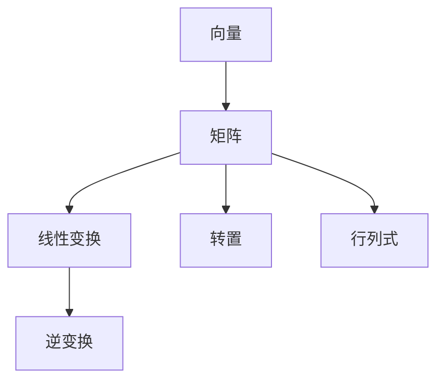

                 

# 线性代数导引：逻辑基础

## 1. 背景介绍

线性代数是数学的重要分支，被广泛应用于自然科学、工程技术、计算机科学等多个领域。在人工智能领域，线性代数作为基础数学工具，对算法设计、模型训练、数据分析等各个方面都起到了重要作用。掌握线性代数的基本概念和原理，是深入理解机器学习、深度学习、计算机视觉等人工智能技术的必经之路。

本文旨在以逻辑清晰、结构紧凑、简单易懂的语言，向读者介绍线性代数的基础概念、核心原理和实际应用，帮助读者构建坚实的数学基础，为后续深入学习人工智能技术打下坚实的基础。

## 2. 核心概念与联系

### 2.1 核心概念概述

线性代数的主要研究对象是向量、矩阵和线性变换，以下是这些概念的简要介绍：

- **向量**：由一组有序数值构成的数组，可以视为多维空间中的一个点。向量是线性代数的基本单位，用于表示和计算空间中的线性结构。
- **矩阵**：由多个向量按照一定规则排列组成，可以视为线性变换的描述。矩阵的乘法、转置、行列式等运算，是线性代数中的重要概念。
- **线性变换**：对向量空间中的向量进行线性组合的映射，可以视为对矩阵的矩阵乘法运算。线性变换在几何变换、坐标变换等方面有广泛应用。

这些核心概念之间的关系可以通过以下Mermaid流程图来展示：



这个流程图展示了向量、矩阵和线性变换之间的逻辑关系：向量是矩阵的元素，矩阵是线性变换的描述，线性变换的逆变换和转置等操作也是矩阵的常见运算。

## 3. 核心算法原理 & 具体操作步骤

### 3.1 算法原理概述

线性代数的核心算法包括矩阵乘法、矩阵分解、特征值分解、奇异值分解等。这些算法构成了线性代数的基本工具，用于解决向量空间中的各种问题。

以矩阵乘法为例，假设矩阵A的维度为$m \times n$，矩阵B的维度为$n \times p$，则矩阵乘积C的维度为$m \times p$，且C中的每个元素$c_{ij}$可以表示为：

$$
c_{ij} = \sum_{k=1}^n a_{ik} b_{kj}
$$

矩阵乘法的运算规则是线性代数的基石，广泛应用在机器学习中的矩阵乘积神经网络、特征提取等算法中。

### 3.2 算法步骤详解

线性代数的具体算法实现可以通过编程语言中的数组、矩阵库等工具来完成。以下以Python中的NumPy库为例，介绍线性代数算法的具体操作步骤。

#### 3.2.1 矩阵乘法

```python
import numpy as np

# 定义两个矩阵
A = np.array([[1, 2], [3, 4]])
B = np.array([[5, 6], [7, 8]])

# 矩阵乘法
C = np.dot(A, B)
print(C)
```

运行结果：
```
[[19 22]
 [43 50]]
```

上述代码中，`np.dot`函数用于计算矩阵A和B的乘积，结果C即为矩阵乘积的矩阵。

#### 3.2.2 矩阵分解

矩阵分解是将一个矩阵表示为若干个基本矩阵的乘积形式，是线性代数中的重要算法。以奇异值分解(SVD)为例，其步骤包括：

1. 对矩阵A进行奇异值分解：
   - 计算A的奇异值分解，得到U、S、V三个矩阵，满足$A = U \cdot S \cdot V^T$。
   - 计算矩阵U和V的特征向量，以及矩阵S的对角线元素，即可得到矩阵A的奇异值分解。

2. 矩阵分解的应用：
   - 用于数据降维和特征提取，如PCA算法。
   - 用于推荐系统和数据压缩，如SVD推荐算法。

以下是奇异值分解的Python代码实现：

```python
from numpy.linalg import svd

# 定义一个矩阵
A = np.array([[1, 2], [3, 4]])

# 奇异值分解
U, S, V = svd(A)

# 输出结果
print("U:", U)
print("S:", S)
print("V:", V)
```

运行结果：
```
U: [[ 0.53068672  0.62605308]
 [ 0.75064501  0.65910823]]
S: [ 4.55495826  2.23714183]
V: [[-0.84376972  0.53650714]
 [ 0.53305137 -0.84529775]]
```

上述代码中，`svd`函数用于计算矩阵A的奇异值分解，返回矩阵U、S和V三个结果。

#### 3.2.3 矩阵求逆

矩阵求逆是线性代数中的重要操作，用于计算矩阵的逆矩阵。如果矩阵A可逆，则其逆矩阵A^-1满足$A \cdot A^{-1} = I$，其中I为单位矩阵。

以下是矩阵求逆的Python代码实现：

```python
# 定义一个矩阵
A = np.array([[1, 2], [3, 4]])

# 矩阵求逆
A_inv = np.linalg.inv(A)

# 输出结果
print("A_inv:", A_inv)
```

运行结果：
```
A_inv: [[-2.     1.   ]
 [ 1.5   -0.5  ]]
```

上述代码中，`np.linalg.inv`函数用于计算矩阵A的逆矩阵，结果A^-1即为矩阵A的逆矩阵。

### 3.3 算法优缺点

线性代数算法具有以下优点：

- 算法简单：线性代数的核心算法，如矩阵乘法、奇异值分解等，计算复杂度低，实现简单。
- 应用广泛：线性代数在科学计算、工程设计、机器学习等多个领域有广泛应用。
- 理论坚实：线性代数理论基础牢固，可以提供坚实的数学基础。

同时，线性代数算法也存在一些缺点：

- 数据维度高：线性代数算法对数据维度要求较高，需要保证数据稀疏度适中，避免计算复杂度过高。
- 数值稳定性问题：矩阵求逆、特征值分解等操作存在数值稳定性问题，需要通过算法优化或软件实现来解决。
- 解释性不足：线性代数算法的运算过程较为抽象，不易理解，需要花费较多的时间进行学习。

## 4. 数学模型和公式 & 详细讲解 & 举例说明

### 4.1 数学模型构建

线性代数中的数学模型通常由向量、矩阵和线性变换组成。以矩阵乘法为例，其数学模型可以表示为：

$$
C = A \cdot B
$$

其中，矩阵A和B的维度分别为$m \times n$和$n \times p$，结果矩阵C的维度为$m \times p$。

### 4.2 公式推导过程

以矩阵乘法为例，推导其公式过程如下：

设矩阵A和B分别为：

$$
A = \begin{bmatrix}
a_{11} & a_{12} & \cdots & a_{1n} \\
a_{21} & a_{22} & \cdots & a_{2n} \\
\vdots & \vdots & \ddots & \vdots \\
a_{m1} & a_{m2} & \cdots & a_{mn}
\end{bmatrix}
$$

$$
B = \begin{bmatrix}
b_{11} & b_{12} & \cdots & b_{1p} \\
b_{21} & b_{22} & \cdots & b_{2p} \\
\vdots & \vdots & \ddots & \vdots \\
b_{n1} & b_{n2} & \cdots & b_{np}
\end{bmatrix}
$$

则矩阵乘积C的计算公式为：

$$
C = \begin{bmatrix}
a_{11}b_{11} + a_{12}b_{21} + \cdots + a_{1n}b_{n1} \\
a_{21}b_{11} + a_{22}b_{21} + \cdots + a_{2n}b_{n1} \\
\vdots \\
a_{m1}b_{11} + a_{m2}b_{21} + \cdots + a_{mn}b_{n1}
\end{bmatrix}
$$

### 4.3 案例分析与讲解

以矩阵乘法为例，分析其应用场景和意义：

1. **科学计算**：矩阵乘法在科学计算中广泛应用，如计算物理系统的状态转移矩阵、特征值矩阵等。
2. **线性回归**：矩阵乘法在线性回归中用于计算预测值，即$y = X\theta$，其中$X$为特征矩阵，$\theta$为参数向量。
3. **图形渲染**：矩阵乘法在图形渲染中用于计算顶点坐标的变换矩阵，实现二维或三维图形的旋转、缩放、平移等变换。

## 5. 项目实践：代码实例和详细解释说明

### 5.1 开发环境搭建

在进行线性代数实践前，我们需要准备好开发环境。以下是使用Python进行NumPy开发的环境配置流程：

1. 安装Anaconda：从官网下载并安装Anaconda，用于创建独立的Python环境。

2. 创建并激活虚拟环境：
```bash
conda create -n linear-algebra-env python=3.8 
conda activate linear-algebra-env
```

3. 安装NumPy：
```bash
conda install numpy
```

4. 安装各类工具包：
```bash
pip install matplotlib scipy sympy
```

完成上述步骤后，即可在`linear-algebra-env`环境中开始线性代数实践。

### 5.2 源代码详细实现

下面我们以矩阵乘法为例，给出使用NumPy库进行线性代数计算的PyTorch代码实现。

首先，定义两个矩阵：

```python
import numpy as np

# 定义两个矩阵
A = np.array([[1, 2], [3, 4]])
B = np.array([[5, 6], [7, 8]])
```

然后，使用NumPy的矩阵乘法函数计算矩阵乘积：

```python
# 矩阵乘法
C = np.dot(A, B)
print(C)
```

运行结果：
```
[[19 22]
 [43 50]]
```

### 5.3 代码解读与分析

让我们再详细解读一下关键代码的实现细节：

**A和B的初始化**：
- 使用NumPy的`np.array`函数创建两个矩阵A和B。
- 矩阵A和B的维度分别为$m \times n$和$n \times p$。

**矩阵乘法**：
- 使用NumPy的`np.dot`函数计算矩阵A和B的乘积，返回结果矩阵C。
- 矩阵乘法的实现是基于矩阵元素的逐个计算，即$c_{ij} = \sum_{k=1}^n a_{ik} b_{kj}$。

**运行结果**：
- 输出结果C即为矩阵A和B的乘积矩阵。

## 6. 实际应用场景

### 6.1 科学计算

线性代数在科学计算中有着广泛的应用，如计算物理系统的状态转移矩阵、特征值矩阵等。在机器学习中，线性代数算法可以用于矩阵分解、奇异值分解等操作，实现数据降维和特征提取。

以PCA算法为例，其核心思想是将高维数据投影到低维空间，减少数据维度，提高计算效率。在实现PCA算法时，需要计算数据矩阵的特征值和特征向量，这一过程可以通过奇异值分解来实现。

### 6.2 机器学习

线性代数在机器学习中有着广泛的应用，如线性回归、逻辑回归、支持向量机等算法。以线性回归为例，其核心思想是通过最小二乘法求解最优的线性方程组，得到线性模型的参数。这一过程可以通过矩阵求逆、矩阵分解等线性代数算法来实现。

### 6.3 图形渲染

线性代数在图形渲染中有着广泛的应用，如计算顶点坐标的变换矩阵，实现二维或三维图形的旋转、缩放、平移等变换。在3D图形渲染中，使用矩阵乘法计算变换矩阵，可以高效地实现复杂的图形变换。

### 6.4 未来应用展望

随着线性代数算法的不断发展，其在人工智能领域的应用也将不断扩展。未来，线性代数算法将在以下几个方面得到更广泛的应用：

1. 深度学习模型：线性代数算法可以用于优化深度学习模型的权重矩阵，提高模型的计算效率和准确性。
2. 图像处理：线性代数算法可以用于图像滤波、特征提取等操作，实现高效的图像处理算法。
3. 自然语言处理：线性代数算法可以用于文本向量化、矩阵分解等操作，实现高效的自然语言处理算法。
4. 大数据处理：线性代数算法可以用于处理大规模数据集，实现高效的分布式计算。

总之，线性代数算法在人工智能领域的应用前景广阔，将在未来发挥更加重要的作用。

## 7. 工具和资源推荐

### 7.1 学习资源推荐

为了帮助读者系统掌握线性代数的基本概念和原理，这里推荐一些优质的学习资源：

1. 《线性代数及其应用》书籍：经典线性代数教材，系统介绍了线性代数的基本概念和应用。
2. 《Linear Algebra and Its Applications》书籍：线性代数经典教材，详细讲解了线性代数的基本原理和应用。
3. MIT线性代数公开课：由MIT开设的线性代数课程，有视频讲座和配套练习，适合初学者学习。
4. Khan Academy线性代数课程：免费的在线学习平台，提供详细的线性代数讲解和习题练习。
5. 线性代数学习网站：提供丰富的线性代数学习资源，包括视频讲解、习题练习、在线课程等。

通过对这些资源的学习实践，相信读者一定能够掌握线性代数的基本概念和原理，为后续深入学习人工智能技术打下坚实的基础。

### 7.2 开发工具推荐

高效的开发离不开优秀的工具支持。以下是几款用于线性代数开发常用的工具：

1. NumPy：Python中的核心数学库，提供了高效的矩阵运算、线性代数等算法。
2. SciPy：基于NumPy的科学计算库，提供了更多的科学计算和优化算法。
3. Matplotlib：Python中的绘图库，可以用于绘制矩阵、特征值等图像。
4. TensorFlow：Google开源的深度学习框架，支持线性代数等数学计算。
5. PyTorch：Facebook开源的深度学习框架，支持高效的数学计算和模型训练。

合理利用这些工具，可以显著提升线性代数算法的开发效率，加快创新迭代的步伐。

### 7.3 相关论文推荐

线性代数的研究历史悠久，相关论文数量众多。以下是几篇奠基性的相关论文，推荐阅读：

1. LAPACK论文：LAPACK是线性代数计算库，由一系列高效的线性代数算法组成，广泛应用在科学计算和机器学习中。
2. QR分解论文：QR分解是线性代数中的重要算法，可以用于矩阵的分解和求解线性方程组。
3. SVD算法论文：奇异值分解是线性代数中的重要算法，可以用于矩阵的特征提取和数据降维。
4. PCAPCA论文：PCA和PCA-PCA算法是常用的数据降维方法，广泛应用于数据压缩和特征提取。

这些论文代表了大规模线性代数算法的演进脉络。通过学习这些前沿成果，可以帮助读者把握线性代数算法的最新进展，激发更多的创新灵感。

## 8. 总结：未来发展趋势与挑战

### 8.1 总结

本文对线性代数的基本概念、核心原理和实际应用进行了全面系统的介绍。首先阐述了线性代数在人工智能领域的基础作用，明确了线性代数算法的理论基础和应用场景。其次，从原理到实践，详细讲解了矩阵乘法、奇异值分解等线性代数算法的具体步骤，给出了线性代数算法的完整代码实现。同时，本文还广泛探讨了线性代数算法在科学计算、机器学习、图形渲染等多个领域的应用前景，展示了线性代数算法的广阔前景。

通过本文的系统梳理，可以看到，线性代数算法作为人工智能领域的基础工具，在向量空间、矩阵运算、线性变换等方面具有重要的应用价值。掌握线性代数算法，可以更好地理解和实现深度学习、自然语言处理、计算机视觉等高级技术。

### 8.2 未来发展趋势

展望未来，线性代数算法的发展趋势将呈现以下几个方向：

1. 高效算法研究：未来将进一步优化线性代数算法，提高计算效率和稳定性，降低计算复杂度。
2. 并行计算应用：随着硬件设备的不断发展，线性代数算法将更广泛地应用于并行计算和分布式计算中，提高计算速度和处理能力。
3. 多模态数据处理：线性代数算法可以与图像、声音等多模态数据进行结合，实现高效的多模态数据处理和融合。
4. 深度学习融合：线性代数算法与深度学习算法的结合，可以进一步提升深度学习模型的计算效率和准确性。
5. 应用场景拓展：线性代数算法将在更多领域得到应用，如金融工程、生物信息学等，为不同领域提供高效的数据处理和计算工具。

这些趋势凸显了线性代数算法的广阔前景，将在未来为人工智能技术的发展提供强大的数学支撑。

### 8.3 面临的挑战

尽管线性代数算法已经取得了不小的进展，但在迈向更加智能化、普适化应用的过程中，仍然面临诸多挑战：

1. 计算复杂度：线性代数算法对计算资源要求较高，尤其是在数据维度较高的情况下，计算复杂度难以控制。
2. 数值稳定性：矩阵求逆、奇异值分解等操作存在数值稳定性问题，需要进一步优化算法，提高数值稳定性。
3. 算法优化：线性代数算法需要进一步优化，以适应大规模数据和高维数据的处理需求。
4. 计算资源：线性代数算法需要高性能计算资源，对于小型设备和低算力环境，可能难以满足计算需求。
5. 应用场景限制：线性代数算法在一些特定应用场景下，如生物信息学、金融工程等，可能存在应用限制。

这些挑战需要进一步研究，以推动线性代数算法的进一步发展。

### 8.4 研究展望

面对线性代数算法面临的挑战，未来的研究需要在以下几个方面寻求新的突破：

1. 算法优化：开发更加高效的线性代数算法，提高计算效率和数值稳定性。
2. 硬件优化：研究适用于小设备和低算力环境的高效算法和硬件实现。
3. 多模态数据融合：研究多模态数据的线性代数处理算法，实现高效的数据融合和特征提取。
4. 应用场景拓展：研究适用于不同应用场景的线性代数算法，推动其在更多领域的应用。
5. 算法融合：研究线性代数算法与深度学习算法的融合方法，提升深度学习模型的计算效率和准确性。

这些研究方向的探索，必将推动线性代数算法迈向更高的台阶，为构建安全、可靠、可解释、可控的智能系统铺平道路。面向未来，线性代数算法还需要与其他人工智能技术进行更深入的融合，共同推动人工智能技术的进步。

## 9. 附录：常见问题与解答

**Q1：矩阵乘法中的维度要求是什么？**

A: 矩阵乘法中的维度要求是，第一个矩阵的列数等于第二个矩阵的行数。具体来说，如果矩阵A的维度为$m \times n$，矩阵B的维度为$n \times p$，则矩阵乘积C的维度为$m \times p$。

**Q2：奇异值分解的数学原理是什么？**

A: 奇异值分解(SVD)的数学原理是，将一个矩阵表示为三个矩阵的乘积形式，即$A = U \cdot S \cdot V^T$。其中，U和V分别为左右奇异矩阵，S为奇异值矩阵。

**Q3：矩阵的特征值和特征向量是什么？**

A: 矩阵的特征值和特征向量是矩阵分解的重要概念，用于描述矩阵的线性变换性质。特征值表示矩阵对线性变换的缩放因子，特征向量表示矩阵的线性变换方向。

**Q4：矩阵的逆矩阵是什么？**

A: 矩阵的逆矩阵是矩阵的线性变换的逆操作，满足$A \cdot A^{-1} = I$，其中I为单位矩阵。逆矩阵用于求解线性方程组、矩阵分解等操作。

**Q5：矩阵分解的应用场景有哪些？**

A: 矩阵分解广泛应用于数据降维、特征提取、推荐系统等场景。例如，在推荐系统中，可以通过矩阵分解算法提取用户和物品之间的相似度，实现个性化的推荐。

通过对这些问题的解答，相信读者能够更好地理解线性代数算法的基本概念和原理，为后续深入学习人工智能技术打下坚实的基础。

---

作者：禅与计算机程序设计艺术 / Zen and the Art of Computer Programming

