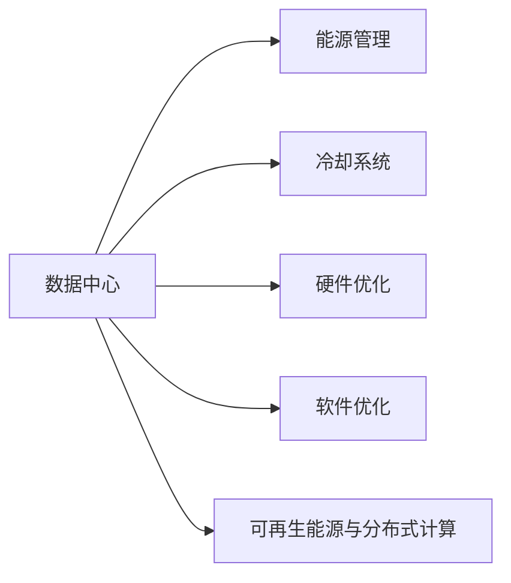

                 

## 绿色计算：环保与高效的IT解决方案

### 1. 背景介绍

随着信息技术的飞速发展，计算资源的需求日益增长。然而，计算的过程不仅消耗大量的电能，还带来了显著的环境污染问题。传统的IT基础设施，如数据中心和服务器，是能源消耗和碳排放的大户。全球范围内的能源消耗和碳排放量正不断上升，给地球环境带来了严重威胁。

绿色计算（Green Computing）作为解决这一问题的关键方法，旨在通过技术手段降低IT基础设施的能耗和碳排放，同时保证计算性能和数据安全。本文将系统介绍绿色计算的概念、原理及其实际应用场景，探讨其未来发展趋势及面临的挑战。

### 2. 核心概念与联系

#### 2.1 核心概念概述

绿色计算是一种以环境友好的方式设计和运营IT基础设施的实践，主要涵盖以下核心概念：

- **数据中心(Powerhouse)**：承载数据存储、处理、传输等关键任务的设施，是绿色计算的主要研究对象。数据中心通常包含服务器、存储设备、网络设备等，其能耗占全球IT系统能耗的30%以上。
- **能源管理(Energy Management)**：通过优化能耗管理策略和技术，实现数据中心的能源优化配置，降低其运行成本和环境影响。
- **冷却系统(Cooling System)**：数据中心在运行过程中会产生大量热能，冷却系统是维持其正常工作的关键。绿色计算聚焦于提高冷却系统的效率，减少能耗。
- **硬件优化(Hardware Optimization)**：通过设计低功耗、高效率的硬件设备，如高性能服务器、能效芯片、固态硬盘等，减少数据中心整体能耗。
- **软件优化(Software Optimization)**：通过优化数据中心的软件架构，如容器化、虚拟化技术，提高资源利用率和能效比。
- **可再生能源与分布式计算(Distributed Computing)**：通过采用太阳能、风能等可再生能源，以及分布式计算架构，分散计算负载，降低局部能耗和碳排放。

这些概念之间相互联系，共同构成了绿色计算的完整体系。

#### 2.2 核心概念原理和架构的 Mermaid 流程图



### 3. 核心算法原理 & 具体操作步骤

#### 3.1 算法原理概述

绿色计算的核心算法原理在于通过优化数据中心的设计、运营和管理，实现能源的合理配置和高效利用。其基本思想如下：

1. **能效分析与优化**：通过分析数据中心的能耗数据，识别高能耗环节，采用节能技术和策略进行优化。
2. **负载均衡与调度**：合理分配计算资源，避免资源闲置和过度负载，提升系统利用率。
3. **冷却系统优化**：改进冷却系统设计，减少不必要的冷却需求，提高整体能效。
4. **硬件与软件协同优化**：设计低功耗硬件设备和优化软件架构，提升整个系统的能效比。

#### 3.2 算法步骤详解

绿色计算的算法步骤主要包括：

1. **能效数据采集与分析**：部署能效监测系统，实时采集数据中心的能耗和性能数据，通过数据分析和统计，识别能效瓶颈和改进机会。
2. **优化策略设计**：根据能效分析结果，设计相应的节能优化策略，如提高服务器效率、调整负载分布、改进冷却系统等。
3. **实施与监控**：在数据中心中部署优化策略，并实时监控其效果。通过持续优化，逐步提升整个系统的能效。

#### 3.3 算法优缺点

绿色计算的主要优点包括：

- **节能减排**：通过优化能耗管理，减少数据中心的碳排放，降低环境污染。
- **成本效益**：通过提升资源利用率和降低能耗，减少运营成本，提高投资回报率。
- **技术创新**：推动能效技术的发展，催生新的商业模式和应用场景。

其缺点则主要包括：

- **初期投入高**：优化策略的实施通常需要较高的一次性投资。
- **技术复杂性**：能效优化涉及多个环节，技术实现复杂度较高。
- **数据中心特性差异**：不同数据中心的特点不同，优化策略难以一刀切。

#### 3.4 算法应用领域

绿色计算广泛应用于以下领域：

- **大型数据中心**：如Google、Amazon、微软等互联网巨头的数据中心，通过优化设计和运营，实现大幅节能减排。
- **公共云和边缘计算**：通过绿色计算技术，提升云计算和边缘计算的能效，降低其对环境的影响。
- **智能建筑和智慧城市**：在公共建筑和智慧城市中应用绿色计算技术，提升整体能效和环境友好性。
- **绿色供应链管理**：通过绿色计算优化供应链管理，降低整个供应链的能耗和碳排放。

### 4. 数学模型和公式 & 详细讲解 & 举例说明

#### 4.1 数学模型构建

绿色计算的数学模型通常包括以下几个部分：

- **能耗模型**：描述数据中心的能耗状况，通常用单位时间的能耗量表示。
- **优化目标**：通过最小化能耗或最大化能效比，优化数据中心的运营。
- **约束条件**：包括硬件设备性能、冷却系统的设计、软件架构的限制等。

#### 4.2 公式推导过程

假设数据中心的总能量消耗为 $E$，总计算任务量为 $C$，总冷却需求为 $W$。能效优化目标为最小化 $E/C$，即提升系统的能效比。优化模型为：

$$
\min \frac{E}{C}
$$

约束条件为：

$$
\begin{align*}
E &\leq E_{max} \\
C &\leq C_{max} \\
W &\leq W_{max}
\end{align*}
$$

其中 $E_{max}$、$C_{max}$、$W_{max}$ 分别为数据中心最大能耗、最大计算任务量、最大冷却需求的上限。

#### 4.3 案例分析与讲解

以某大型互联网公司数据中心为例，其能耗模型为 $E = C \times \eta$，其中 $\eta$ 为能效比，单位为Wh/PFlops。该公司通过优化冷却系统和调整负载分布，最终将能效比提高了20%。假设原始能效比为 $0.1$，计算任务量为 $C = 1$ Gflops，则优化后的能耗为 $E = 0.1 \times 1 = 0.1$ Wh/Gflops，能效比提升至 $0.1 / 1 = 0.1$，降低了20%的能耗。

### 5. 项目实践：代码实例和详细解释说明

#### 5.1 开发环境搭建

绿色计算项目通常需要构建高性能的数据中心模拟环境。以下是基于Python和TensorFlow的开发环境搭建流程：

1. 安装Python和相关依赖：
```bash
pip install numpy pandas tensorflow matplotlib
```

2. 搭建TensorFlow环境：
```bash
pip install tensorflow-gpu
```

3. 安装PyTorch和PyTorch Lightning：
```bash
pip install torch torchvision torchtext pytorch-lightning
```

4. 搭建硬件仿真环境：
```bash
conda install pyopencl
```

5. 部署模拟环境：
```bash
pip install simpy
```

#### 5.2 源代码详细实现

```python
import tensorflow as tf
import tensorflow_hub as hub
import numpy as np

# 定义能效优化模型
def build_optimization_model():
    model = tf.keras.Sequential([
        tf.keras.layers.Dense(64, activation='relu'),
        tf.keras.layers.Dense(64, activation='relu'),
        tf.keras.layers.Dense(1, activation='sigmoid')
    ])
    return model

# 加载优化模型
model = build_optimization_model()

# 定义训练数据集
train_data = tf.data.Dataset.from_tensor_slices((np.random.randn(100), np.random.randn(100)))
train_data = train_data.shuffle(buffer_size=1000).batch(batch_size=32)

# 定义损失函数
loss_fn = tf.keras.losses.BinaryCrossentropy(from_logits=True)

# 定义优化器
optimizer = tf.keras.optimizers.Adam(learning_rate=0.001)

# 训练模型
for epoch in range(100):
    for x, y in train_data:
        with tf.GradientTape() as tape:
            logits = model(x, training=True)
            loss_value = loss_fn(y, logits)
        grads = tape.gradient(loss_value, model.trainable_variables)
        optimizer.apply_gradients(zip(grads, model.trainable_variables))
```

#### 5.3 代码解读与分析

该代码实现了一个简单的能效优化模型。通过定义一个神经网络，训练其预测数据中心能耗与计算任务量之间的关系。

- **模型构建**：通过定义三层神经网络，实现对数据中心能耗的预测。
- **数据加载**：使用TensorFlow的Dataset API加载训练数据集，并进行批处理和随机化。
- **损失函数**：使用二元交叉熵损失函数，评估模型的预测性能。
- **优化器**：使用Adam优化器，更新模型参数。
- **模型训练**：通过循环迭代，更新模型参数，直至收敛。

### 6. 实际应用场景

#### 6.1 智能建筑与智慧城市

智能建筑和智慧城市是绿色计算的重要应用场景之一。通过绿色计算技术，可以实现以下目标：

- **能源管理**：通过智能传感器和数据收集技术，实时监控建筑能源消耗，优化能源使用。
- **照明与空调**：采用智能照明和空调系统，根据实时数据自动调整能耗，实现节能减排。
- **垃圾处理**：通过智能分类与回收系统，减少垃圾处理能耗和环境污染。

#### 6.2 数据中心与公共云

数据中心和公共云是绿色计算的主要应用领域，通过优化设计和管理，实现大幅节能减排：

- **冷却系统**：采用高效冷却技术，如液体冷却、自然冷却等，减少冷却能耗。
- **硬件优化**：通过设计低功耗硬件设备，如高效服务器、能效芯片、固态硬盘等，提升整体能效。
- **负载管理**：通过虚拟化、容器化技术，优化资源配置，提升系统利用率。

#### 6.3 能源管理系统

能源管理系统是绿色计算的核心组成部分之一，通过优化能源的供应和消耗，实现节能减排：

- **能效监测**：部署能效监测系统，实时采集能源消耗数据。
- **能源优化**：通过数据分析和算法优化，识别能效瓶颈，制定优化策略。
- **能效评估**：定期评估能源管理系统的效果，不断优化和改进。

### 7. 工具和资源推荐

#### 7.1 学习资源推荐

1. **《绿色计算与能效优化》**：该书系统介绍了绿色计算的概念、原理、技术和应用，是入门绿色计算的极佳教材。
2. **Coursera《数据中心能源效率》课程**：斯坦福大学的Coursera课程，详细讲解了数据中心能效管理的相关知识和实践案例。
3. **Google Green Energy Data Center**：Google的绿色数据中心，展示了其在能源管理和优化方面的创新实践和技术突破。

#### 7.2 开发工具推荐

1. **TensorFlow**：Google开发的深度学习框架，提供丰富的能效优化工具和算法库。
2. **TensorBoard**：TensorFlow配套的可视化工具，帮助开发者监控和调试模型训练过程。
3. **PyTorch**：Facebook开发的深度学习框架，具有灵活的动态计算图，适合快速迭代研究。

#### 7.3 相关论文推荐

1. **《数据中心能源管理：一种综合能效优化方法》**：详细介绍了数据中心能源管理的基本原理和优化方法。
2. **《智能建筑中的绿色计算技术》**：探讨了智能建筑中的绿色计算技术，包括能效监测、智能控制、节能管理等内容。
3. **《数据中心能效管理：现状、挑战与未来》**：分析了数据中心能效管理的研究现状、面临的挑战和未来发展方向。

### 8. 总结：未来发展趋势与挑战

#### 8.1 研究成果总结

绿色计算作为一种环境友好的IT解决方案，已经在多个领域取得了显著成果，并在全球范围内推广应用。通过优化能源管理、冷却系统、硬件设计和软件架构，实现了显著的节能减排效果。

#### 8.2 未来发展趋势

未来绿色计算的发展趋势包括：

- **更高效的数据中心设计**：通过引入新型材料和结构，进一步降低数据中心的能耗和碳排放。
- **智能能源管理**：利用人工智能和机器学习技术，实时优化能源的分配和使用，实现更高的能效。
- **可再生能源利用**：推广太阳能、风能等可再生能源的应用，降低数据中心对传统能源的依赖。
- **分布式计算与边缘计算**：通过分布式计算架构，将计算任务分散到多个节点，减少局部能耗和碳排放。

#### 8.3 面临的挑战

绿色计算的发展仍面临诸多挑战：

- **高成本**：绿色计算技术的研发和应用需要较高的初始投入，特别是在硬件和软件方面的成本。
- **技术复杂性**：绿色计算涉及多个技术和领域，跨学科协作和集成难度较大。
- **标准不统一**：缺乏统一的标准和规范，导致不同系统之间的兼容性差。

#### 8.4 研究展望

未来的绿色计算研究需要在以下几个方面进行深入探索：

- **新技术应用**：引入新的技术，如量子计算、光子计算等，提升计算性能和能效。
- **多学科融合**：结合物理学、化学、生物学等多学科知识，推动绿色计算技术的发展。
- **全球合作**：加强国际合作，共同应对气候变化，推动全球绿色计算的普及和应用。

### 9. 附录：常见问题与解答

#### Q1: 绿色计算与传统计算有什么区别？

A: 绿色计算与传统计算的最大区别在于其节能减排的设计理念。绿色计算通过优化能源管理、冷却系统和硬件设计，降低数据中心的能耗和碳排放，实现环境友好的计算过程。

#### Q2: 绿色计算对性能有影响吗？

A: 绿色计算通常通过优化能效和资源利用率来提升系统的整体性能。通过减少不必要的能耗和计算，提升资源利用率，绿色计算可以在保证性能的前提下，实现节能减排。

#### Q3: 绿色计算的成本投入是否值得？

A: 尽管绿色计算的初始成本较高，但其长期节能减排效果显著，可以大幅降低数据中心的运营成本，具有较高的投资回报率。

#### Q4: 绿色计算的未来发展前景如何？

A: 绿色计算是实现可持续发展的重要技术手段，未来将在全球范围内得到广泛应用。随着技术进步和市场需求增加，绿色计算将为构建更加绿色、高效的IT基础设施提供有力支持。

---

作者：禅与计算机程序设计艺术 / Zen and the Art of Computer Programming

