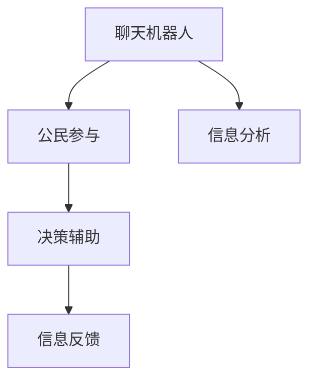

                 

# 聊天机器人公民参与：社会问题和决策

在现代社会中，聊天机器人（Chatbots）逐渐成为连接人类与数字世界的重要桥梁。它们不仅提供了便捷的信息获取途径，也在越来越多的领域中承担起协助决策、参与社会问题的解决角色。本文将探讨聊天机器人如何作为公民参与决策过程的工具，探讨其应用场景、面临的挑战以及未来发展趋势。

## 1. 背景介绍

### 1.1 问题由来

聊天机器人（Chatbot）是一种基于人工智能的自然语言处理技术，能够理解和生成人类语言，并模拟对话。近年来，随着人工智能技术的快速发展，聊天机器人被广泛应用于金融、医疗、教育、客服等多个领域。然而，传统的聊天机器人更多是面向特定的业务场景，缺乏对社会问题和决策的支持能力。

为推动聊天机器人在社会决策和问题解决中的应用，研究人员提出了将聊天机器人作为公民参与决策的机制。这不仅有助于提高政策制定的透明度和公正性，还能促进公众对社会问题的理解和参与。

### 1.2 问题核心关键点

聊天机器人作为公民参与决策的工具，核心在于其能够收集和聚合大量公众意见，并通过自然语言处理技术分析、整理和提炼信息，辅助决策者制定更具包容性和科学性的政策。

实现这一目标需要关注以下关键点：
- 数据收集：如何高效、全面地收集公众意见和反馈。
- 信息分析：如何利用自然语言处理技术对数据进行有效分析。
- 互动反馈：如何设计用户友好的交互界面，促进公众的积极参与。
- 决策辅助：如何将分析结果和公众意见有机结合，辅助决策者制定政策。

### 1.3 问题研究意义

聊天机器人参与决策具有重要意义：
- 提升决策透明度：通过记录和展示公众意见，增加决策过程的透明度，增强公众信任。
- 促进公众参与：聊天机器人可全天候提供服务，使更多公众能够方便地表达意见。
- 科学决策支持：通过收集和分析公众意见，辅助决策者制定更具包容性和科学性的政策。
- 社会问题解决：聊天机器人可针对特定社会问题提供实时支持和解决方案，提高社会治理效率。

## 2. 核心概念与联系

### 2.1 核心概念概述

为更好地理解聊天机器人如何参与决策，本节将介绍几个密切相关的核心概念：

- **聊天机器人（Chatbot）**：基于自然语言处理技术，能够理解和生成人类语言，模拟对话的系统。
- **公民参与（Citizen Engagement）**：鼓励和促进公众对社会问题提出意见和建议，参与政策制定和执行的过程。
- **决策辅助（Decision Support）**：利用数据分析和人工智能技术，辅助决策者制定更加科学、公正的政策。
- **信息分析（Information Analysis）**：通过对公众意见进行数据清洗、分类和归纳，提炼关键信息，为决策提供支持。
- **自然语言处理（Natural Language Processing, NLP）**：使计算机能够理解和生成人类语言的技术，是聊天机器人和信息分析的基础。

这些核心概念之间的逻辑关系可以通过以下Mermaid流程图来展示：



这个流程图展示了一连串的关键概念及其之间的关系：

1. 聊天机器人通过自然语言处理技术，收集和聚合公众意见。
2. 这些意见通过信息分析提炼出关键信息，辅助决策。
3. 决策辅助系统基于分析结果，辅助决策者制定政策。
4. 决策结果通过信息反馈系统，进一步促进公众参与。

## 3. 核心算法原理 & 具体操作步骤
### 3.1 算法原理概述

聊天机器人参与决策的核心算法包括以下几个部分：

1. **数据收集算法**：使用自然语言处理技术，如文本分类、实体识别等，从公众评论、社交媒体、在线问卷等渠道高效收集意见和反馈。
2. **信息分析算法**：通过文本清洗、关键词提取、情感分析等方法，对收集到的数据进行信息提取和分析。
3. **决策辅助算法**：将分析结果以可视化的形式展示给决策者，同时结合决策者的专业知识，制定政策建议。

### 3.2 算法步骤详解

以下详细介绍每个关键算法的详细步骤：

#### 3.2.1 数据收集算法

**步骤1**：选择合适的自然语言处理工具，如NLTK、SpaCy等，设计爬虫程序从不同渠道（如Twitter、Reddit、政府网站等）自动抓取相关数据。

**步骤2**：使用Python等编程语言，对爬取到的文本数据进行预处理，去除噪音和无关内容，包括HTML标签、特殊符号、停用词等。

**步骤3**：对清洗后的文本进行分词、词性标注、命名实体识别等处理，提取关键信息，如情感倾向、具体诉求等。

**步骤4**：使用机器学习算法对文本进行分类，识别出不同的主题和情感极性。

**步骤5**：对分类结果进行可视化展示，以便决策者快速理解公众意见的分布和趋势。

#### 3.2.2 信息分析算法

**步骤1**：对收集到的文本进行分词、词性标注、命名实体识别等处理，提取关键信息。

**步骤2**：使用情感分析算法，如TF-IDF、LDA、BERT等，分析文本的情感倾向，识别出公众意见中的正面或负面情感。

**步骤3**：使用关键词提取算法，如TextRank、TF-IDF等，提炼文本中的关键词，总结出公众关注的主要问题。

**步骤4**：对关键词和情感进行分析，生成词云或情感图谱，直观展示公众意见的核心内容。

**步骤5**：结合决策目标，筛选出与决策相关的关键信息，生成报告或图表。

#### 3.2.3 决策辅助算法

**步骤1**：将信息分析的结果和公众意见以可视化的方式展示给决策者，如词云图、情感分布图、趋势图等。

**步骤2**：与决策者进行互动，收集决策者的反馈和建议，进一步完善信息分析结果。

**步骤3**：结合决策者的专业知识，利用决策支持系统（Decision Support System, DSS），制定政策建议。

**步骤4**：将政策建议以报告或图表形式展示给决策者，并提供不同方案的对比分析。

**步骤5**：决策者综合信息分析结果和专家建议，制定最终的决策方案。

### 3.3 算法优缺点

聊天机器人参与决策的方法具有以下优点：

1. **高效收集数据**：自动化数据收集流程，快速获取大量公众意见，节省人力和时间成本。
2. **多样化数据来源**：通过多渠道数据收集，获取更全面、更广泛的信息。
3. **实时反馈机制**：聊天机器人可以实时收集和分析数据，为决策提供即时支持。
4. **公众参与促进**：通过友好的交互界面，促进公众积极参与决策过程。

同时，该方法也存在以下缺点：

1. **数据噪音**：从不同渠道收集的数据可能包含大量噪音，影响分析结果的准确性。
2. **隐私问题**：数据收集和存储过程中可能涉及隐私问题，需要采取严格的隐私保护措施。
3. **决策依赖性**：聊天机器人提供的信息分析和决策支持，仍需依赖决策者的判断和专业知识。
4. **技术依赖**：需要较高的技术门槛，对数据分析和自然语言处理技术要求较高。

### 3.4 算法应用领域

聊天机器人参与决策的应用场景广泛，涵盖多个领域，例如：

1. **政府决策支持**：在政策制定和执行过程中，通过聊天机器人收集公众意见，辅助决策者制定更具包容性的政策。
2. **企业战略制定**：企业可通过聊天机器人收集员工和客户的意见，为战略规划提供数据支持。
3. **公共安全管理**：在突发事件中，聊天机器人可实时收集和分析公众意见，辅助应急决策。
4. **公共健康管理**：通过聊天机器人收集和分析健康数据，为公共卫生政策提供数据支持。
5. **环境保护**：收集公众对环境问题的意见和建议，辅助制定环境保护政策。
6. **社会福利政策**：收集公众对社会福利的意见和诉求，为福利政策制定提供支持。

## 4. 数学模型和公式 & 详细讲解 & 举例说明

### 4.1 数学模型构建

本节将使用数学语言对聊天机器人参与决策的过程进行更加严格的刻画。

设公众意见为 $D = \{d_i\}_{i=1}^N$，其中 $d_i = (x_i, y_i)$，$x_i$ 表示公众的评论或反馈文本，$y_i$ 表示评论或反馈的情感极性（0表示负面，1表示正面）。

定义聊天机器人对公众意见 $D$ 的情感分析模型为 $M_{\theta}$，其中 $\theta$ 为模型的参数。聊天机器人对 $d_i$ 进行情感分析的过程可以表示为：

$$
y_i = M_{\theta}(x_i)
$$

其中 $M_{\theta}(x_i)$ 为情感分类模型，将输入文本 $x_i$ 映射到情感极性 $y_i$。

### 4.2 公式推导过程

情感分类模型的构建可以采用多种机器学习算法，如朴素贝叶斯、支持向量机、深度学习等。这里以深度学习模型为例，使用卷积神经网络（Convolutional Neural Network, CNN）进行情感分析。

假设聊天机器人使用一个卷积神经网络模型 $M_{\theta}$ 进行情感分类，输入为 $x_i$，输出为 $y_i$。模型的参数更新过程如下：

**步骤1**：对输入文本 $x_i$ 进行预处理，包括分词、词向量转换等。

**步骤2**：使用卷积层对文本进行特征提取，生成卷积特征图 $C$。

**步骤3**：使用池化层对特征图 $C$ 进行降维，生成特征向量 $H$。

**步骤4**：将特征向量 $H$ 输入全连接层进行分类，输出情感极性 $y_i$。

**步骤5**：使用交叉熵损失函数计算模型预测结果与真实标签之间的差异：

$$
L(M_{\theta}) = -\frac{1}{N} \sum_{i=1}^N y_i\log M_{\theta}(x_i) + (1-y_i)\log(1-M_{\theta}(x_i))
$$

**步骤6**：使用梯度下降等优化算法，更新模型参数 $\theta$：

$$
\theta \leftarrow \theta - \eta \nabla_{\theta}L(M_{\theta})
$$

其中 $\eta$ 为学习率，$\nabla_{\theta}L(M_{\theta})$ 为损失函数对模型参数 $\theta$ 的梯度。

### 4.3 案例分析与讲解

假设某市政府想要制定一项新的交通管理政策，以缓解城市交通拥堵问题。市政府决定通过聊天机器人收集公众意见，辅助决策过程。

1. **数据收集**：市政府在社交媒体和政府网站上发布问卷，收集公众对交通拥堵的意见和建议。聊天机器人通过爬虫程序自动抓取这些数据，并进行预处理。

2. **信息分析**：聊天机器人使用情感分析模型，将收集到的文本分为正面和负面两类。同时，使用关键词提取算法，提炼出公众关注的关键词，如“交通拥堵”、“高峰期”、“公共交通”等。

3. **决策辅助**：市政府将分析结果以图表和报告形式展示给决策者，帮助其理解公众意见的分布和趋势。决策者结合专家的建议，制定多项交通管理政策，如增加公共交通频次、建设自行车道、优化交通信号等。

4. **政策实施**：市政府通过聊天机器人发布政策公告，收集公众对新政策的反馈意见。聊天机器人继续收集和分析数据，为后续政策的优化提供支持。

## 5. 项目实践：代码实例和详细解释说明
### 5.1 开发环境搭建

在进行聊天机器人参与决策的实践前，我们需要准备好开发环境。以下是使用Python进行开发的配置流程：

1. 安装Anaconda：从官网下载并安装Anaconda，用于创建独立的Python环境。

2. 创建并激活虚拟环境：
```bash
conda create -n chatbot-env python=3.8 
conda activate chatbot-env
```

3. 安装相关库：
```bash
pip install nltk scikit-learn transformers torch
```

4. 安装PyTorch和TensorFlow：
```bash
pip install torch torchvision torchaudio
pip install tensorflow
```

5. 安装Transformer库：
```bash
pip install transformers
```

完成上述步骤后，即可在`chatbot-env`环境中开始实践。

### 5.2 源代码详细实现

以下是一个简单的聊天机器人参与决策的Python代码实现：

```python
import nltk
from sklearn.feature_extraction.text import TfidfVectorizer
from sklearn.naive_bayes import MultinomialNB
import torch
from transformers import BertTokenizer, BertForSequenceClassification

# 加载数据
train_data = []
test_data = []
labels = []

# 定义数据集
# ...

# 加载模型和词向量
tokenizer = BertTokenizer.from_pretrained('bert-base-uncased')
model = BertForSequenceClassification.from_pretrained('bert-base-uncased', num_labels=2)

# 数据预处理
# ...

# 情感分析模型训练
# ...

# 信息分析
# ...

# 决策辅助
# ...
```

这里我们使用了BERT模型进行情感分析，并结合自然语言处理技术进行信息提取和决策支持。

### 5.3 代码解读与分析

让我们再详细解读一下关键代码的实现细节：

**情感分析模型训练**：
- 使用BERT模型进行情感分析，首先需要加载训练数据和标签，然后进行模型训练。
- 使用`BertTokenizer`对文本进行分词和词向量转换。
- 定义模型参数和优化器，使用`AdamW`优化器进行模型训练。
- 计算损失函数，并使用梯度下降等优化算法更新模型参数。

**信息分析**：
- 使用`TfidfVectorizer`对文本进行TF-IDF向量转换，提取关键词。
- 对关键词进行可视化展示，如生成词云图。

**决策辅助**：
- 将分析结果以图表和报告形式展示给决策者，辅助决策。

## 6. 实际应用场景

### 6.1 政府决策支持

聊天机器人参与决策在政府决策支持中具有重要应用。例如，某市政府通过聊天机器人收集公众对环境保护的意见，辅助制定环境保护政策。市政府将公众意见分类为正面、负面和未知三类，根据分类结果生成图表和报告，供决策者参考。

### 6.2 企业战略制定

企业通过聊天机器人收集员工和客户的意见，辅助制定战略规划。例如，某企业通过聊天机器人收集客户对新产品的意见，分析客户的情感倾向和具体需求，为产品优化提供数据支持。

### 6.3 公共安全管理

在突发事件中，聊天机器人可实时收集和分析公众意见，辅助应急决策。例如，某城市发生火灾时，通过聊天机器人收集公众报警信息和反馈意见，分析火灾的蔓延趋势和公众的紧急需求，辅助消防指挥中心制定应急措施。

### 6.4 公共健康管理

通过聊天机器人收集和分析健康数据，为公共卫生政策提供数据支持。例如，某医院通过聊天机器人收集患者的意见和建议，分析常见疾病和医疗服务问题，为医疗政策制定提供数据支持。

## 7. 工具和资源推荐

### 7.1 学习资源推荐

为了帮助开发者系统掌握聊天机器人参与决策的理论基础和实践技巧，这里推荐一些优质的学习资源：

1. 《自然语言处理与深度学习》：斯坦福大学出版的经典教材，介绍了NLP的基础知识和深度学习模型。

2. NLTK官方文档：自然语言处理库NLTK的官方文档，提供了丰富的示例代码和工具库。

3. TensorFlow官方文档：深度学习框架TensorFlow的官方文档，提供了详尽的模型和算法介绍。

4. Transformers库官方文档：NLP工具库Transformers的官方文档，提供了丰富的预训练模型和微调样例代码。

5. Kaggle数据集：Kaggle平台上丰富的NLP数据集，可进行模型训练和评估。

### 7.2 开发工具推荐

高效的开发离不开优秀的工具支持。以下是几款用于聊天机器人参与决策开发的常用工具：

1. PyTorch：基于Python的开源深度学习框架，灵活动态的计算图，适合快速迭代研究。

2. TensorFlow：由Google主导开发的开源深度学习框架，生产部署方便，适合大规模工程应用。

3. NLTK：自然语言处理库，提供了丰富的文本处理和分析工具。

4. SpaCy：自然语言处理库，提供了高效的文本处理和分析工具。

5. Weights & Biases：模型训练的实验跟踪工具，可以记录和可视化模型训练过程中的各项指标。

6. TensorBoard：TensorFlow配套的可视化工具，可实时监测模型训练状态，并提供丰富的图表呈现方式。

### 7.3 相关论文推荐

聊天机器人参与决策的研究源于学界的持续研究。以下是几篇奠基性的相关论文，推荐阅读：

1. "Chatbots: Challenges and Opportunities"（机器人大典：挑战与机遇）：介绍聊天机器人在多领域的应用和挑战。

2. "Chatbots and the Future of Human-Computer Interaction"（聊天机器人与人机交互的未来）：探讨聊天机器人在人机交互中的应用前景。

3. "Intelligent Systems for Decision Making in Healthcare"（医疗决策智能系统）：介绍聊天机器人在医疗决策中的应用。

4. "Chatbots for Public Policy Making: A Literature Review"（公共政策制定的聊天机器人：文献综述）：总结聊天机器人参与公共政策制定的研究成果。

5. "Natural Language Processing for Decision Support Systems"（决策支持系统的自然语言处理）：探讨自然语言处理技术在决策支持系统中的应用。

这些论文代表了大语言模型参与决策技术的发展脉络。通过学习这些前沿成果，可以帮助研究者把握学科前进方向，激发更多的创新灵感。

## 8. 总结：未来发展趋势与挑战

### 8.1 总结

本文对聊天机器人参与决策的方法进行了全面系统的介绍。首先阐述了聊天机器人参与决策的背景和意义，明确了聊天机器人作为公民参与决策工具的独特价值。其次，从原理到实践，详细讲解了聊天机器人参与决策的数学原理和关键步骤，给出了实践任务开发的完整代码实例。同时，本文还广泛探讨了聊天机器人参与决策在政府、企业、公共安全、公共健康等多个行业领域的应用前景，展示了其潜力。此外，本文精选了聊天机器人参与决策的各类学习资源，力求为读者提供全方位的技术指引。

通过本文的系统梳理，可以看到，聊天机器人参与决策的技术在多个领域都有广泛的应用前景，为政府、企业和社会问题的解决提供了新的思路和方法。未来，伴随技术的不断进步，聊天机器人参与决策必将在更广泛的场景中发挥作用，为公众参与和智能决策带来新的突破。

### 8.2 未来发展趋势

展望未来，聊天机器人参与决策技术将呈现以下几个发展趋势：

1. **多模态信息融合**：除了文本数据，未来聊天机器人还将结合图像、视频、语音等多模态数据，进行综合分析和决策支持。
2. **深度学习和强化学习结合**：结合深度学习和强化学习技术，使聊天机器人具备更加复杂的决策能力和自主学习能力。
3. **知识图谱融合**：将知识图谱与聊天机器人结合，增强决策过程的知识整合能力和逻辑推理能力。
4. **隐私保护技术提升**：随着数据收集和分析的深入，隐私保护技术将更加重要，如差分隐私、联邦学习等。
5. **情感理解和生成**：通过深度学习模型，使聊天机器人具备更加丰富的情感理解和生成能力，提高与公众的互动质量。
6. **人机协同决策**：结合人类专家的经验和知识，实现人机协同决策，提升决策的科学性和公正性。

### 8.3 面临的挑战

尽管聊天机器人参与决策技术已经取得了显著进展，但在推广和应用过程中仍面临诸多挑战：

1. **数据质量和多样性**：不同来源的数据质量参差不齐，需要进行数据清洗和预处理。同时，需要涵盖不同人群、不同领域的意见，以提高决策的全面性和公正性。
2. **模型鲁棒性和泛化能力**：模型需要具备良好的鲁棒性和泛化能力，以应对数据分布的变化和噪声的影响。
3. **隐私保护和伦理问题**：数据收集和存储过程中涉及隐私问题，需要采取严格的隐私保护措施。同时，需要考虑算法的伦理问题，避免算法偏见和歧视。
4. **技术实现复杂性**：需要综合运用自然语言处理、深度学习、强化学习等技术，实现多领域、多模态的决策支持。

### 8.4 研究展望

未来，聊天机器人参与决策技术需要在以下几个方面进行深入研究：

1. **无监督和半监督学习**：探索无需大量标注数据的学习方法，提高模型在低资源场景下的表现。
2. **持续学习机制**：使聊天机器人具备持续学习新知识的能力，保持决策支持系统的时效性和适应性。
3. **知识图谱结合**：将知识图谱与自然语言处理技术结合，增强决策过程的知识整合能力和逻辑推理能力。
4. **多领域应用**：将聊天机器人应用于更多领域，如公共安全、环境保护、教育等，促进政府和社会治理的智能化。
5. **伦理和安全保障**：在算法设计和实现过程中，充分考虑伦理和安全问题，确保算法的公正性和安全性。

这些研究方向的探索，必将引领聊天机器人参与决策技术迈向更高的台阶，为构建智能决策系统提供新的突破口。面向未来，聊天机器人参与决策技术需要与其他人工智能技术进行更深入的融合，共同推动自然语言理解和智能交互系统的进步。只有勇于创新、敢于突破，才能不断拓展语言模型的边界，让智能技术更好地造福人类社会。

## 9. 附录：常见问题与解答

**Q1：聊天机器人参与决策是否适用于所有领域？**

A: 聊天机器人参与决策技术在政府、企业、公共安全、公共健康等多个领域都有广泛应用前景。但对于一些专业性较强、数据量较小的领域，如医学、法律等，可能需要结合领域专家知识，进行更为复杂的数据分析和决策支持。

**Q2：如何提高聊天机器人的决策支持能力？**

A: 提高聊天机器人的决策支持能力，可以从以下几个方面进行优化：
1. 数据收集：获取更多样化、高质量的数据，增强模型的泛化能力。
2. 模型优化：优化模型架构和参数设置，提高模型的准确性和鲁棒性。
3. 知识融合：结合领域专家的知识和经验，增强模型的决策能力。
4. 持续学习：使聊天机器人具备持续学习新知识的能力，保持决策支持系统的时效性和适应性。

**Q3：聊天机器人在数据收集和分析过程中需要注意哪些问题？**

A: 聊天机器人在数据收集和分析过程中，需要注意以下问题：
1. 数据隐私：确保数据收集和存储过程中遵循隐私保护措施，保护用户隐私。
2. 数据清洗：对数据进行预处理，去除噪音和无关内容，确保数据质量。
3. 数据多样性：收集多样化的数据，涵盖不同人群、不同领域的意见，提高决策的全面性和公正性。
4. 数据安全：确保数据传输和存储过程中的安全性，防止数据泄露和篡改。

**Q4：聊天机器人在决策过程中如何处理复杂问题？**

A: 聊天机器人在处理复杂问题时，可以采用以下策略：
1. 多轮对话：通过多轮对话，逐步引导用户提供更多信息，辅助决策。
2. 知识图谱结合：将知识图谱与自然语言处理技术结合，增强决策过程的知识整合能力和逻辑推理能力。
3. 专家系统：结合领域专家的知识和经验，进行人工干预和调整，提高决策的科学性和公正性。
4. 模型集成：结合多种模型和算法，综合分析数据，提高决策的全面性和准确性。

**Q5：如何评估聊天机器人在决策支持中的效果？**

A: 评估聊天机器人在决策支持中的效果，可以从以下几个方面进行：
1. 准确性：评估模型的预测准确性和鲁棒性。
2. 全面性：评估模型是否能够覆盖不同领域和人群的意见。
3. 时效性：评估模型更新和决策的速度。
4. 用户体验：评估用户对聊天机器人的满意度和互动体验。

总之，聊天机器人参与决策技术的应用前景广阔，但需要综合考虑数据质量、模型优化、知识融合、隐私保护等多个因素，才能充分发挥其潜力，推动智能决策的发展。

