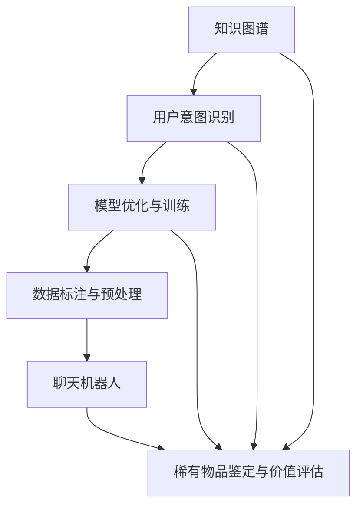

                 

# 聊天机器人收藏：稀有物品鉴定和价值评估

## 1. 背景介绍

随着人工智能技术的不断进步，聊天机器人已经成为了广泛应用的智能交互方式。特别是在稀有物品的鉴定和价值评估领域，由于专业知识和经验的复杂性，传统的人机交互方式难以胜任。通过结合人工智能的强大计算能力和丰富的知识储备，聊天机器人可以快速、准确地提供稀有物品的鉴定和价值评估服务。

### 1.1 问题由来

稀有物品的鉴定和价值评估是一项复杂且专业的工作，通常需要高度专业知识、丰富的经验以及大量的数据支持。传统的鉴定和评估方式依赖于专家经验，人工操作繁琐且容易出错。而随着人工智能技术的普及，聊天机器人凭借其强大的计算能力、快速响应和自动学习的优势，逐渐被引入到稀有物品的鉴定和价值评估领域。

### 1.2 问题核心关键点

聊天机器人在此领域的应用，关键在于如何将人工智能技术与稀有物品的相关知识结合起来。具体来说，需要解决以下核心问题：

- 如何高效构建和维护稀有物品的知识库？
- 如何训练能够精确鉴定和评估稀有物品价值的模型？
- 如何在实时交互中准确理解用户输入，并提供个性化推荐？
- 如何保证聊天机器人的安全性，避免误导用户？

## 2. 核心概念与联系

### 2.1 核心概念概述

为更好地理解聊天机器人在此领域的实际应用，本节将介绍几个关键概念：

- 聊天机器人(Chatbot)：基于自然语言处理技术，能够与用户进行自然语言交互，完成指定任务的人工智能系统。
- 稀有物品鉴定和价值评估：对稀有收藏品如古董、艺术品、钱币等进行鉴定真伪和估算价值的过程。
- 知识图谱(Knowledge Graph)：以图结构方式组织、存储和展示知识，帮助聊天机器人快速获取和理解相关领域的信息。
- 用户意图识别(User Intent Recognition)：通过分析用户输入，确定用户的具体意图和需求，从而提供定制化服务。
- 模型优化和训练(Model Optimization & Training)：对聊天机器人模型进行优化和训练，提升其准确性和鲁棒性。
- 数据标注和预处理(Data Annotation & Preprocessing)：对用于训练和评估的数据进行标注和预处理，确保数据质量。

这些核心概念之间通过一系列技术环节相联系，形成了一个完整的聊天机器人系统框架。

### 2.2 核心概念原理和架构的 Mermaid 流程图



这个流程图展示了聊天机器人在稀有物品鉴定和价值评估领域的应用流程：

1. 知识图谱为聊天机器人提供丰富的背景知识，帮助其理解稀有物品的特征和价值。
2. 用户意图识别确定用户的具体需求，决定聊天机器人应采取的具体动作。
3. 模型优化和训练提升聊天机器人的准确性和鲁棒性，确保其输出质量。
4. 数据标注和预处理保证数据的质量，为模型训练提供支持。
5. 最终，聊天机器人将根据知识图谱和用户需求，进行稀有物品的鉴定和价值评估。

## 3. 核心算法原理 & 具体操作步骤
### 3.1 算法原理概述

聊天机器人在此领域的应用，本质上是利用人工智能技术对稀有物品的特征进行提取和理解，结合知识图谱和用户意图识别，提供精准的鉴定和价值评估服务。具体的算法流程包括以下几个步骤：

1. **数据收集和标注**：收集稀有物品的各类信息，如图片、描述、历史记录等，并对这些信息进行标注，确保数据质量。
2. **知识图谱构建**：利用已标注的数据，构建知识图谱，形成系统的知识结构。
3. **模型训练**：基于知识图谱和标注数据，训练模型，使其能够理解和分析稀有物品的特征和价值。
4. **用户意图识别**：分析用户输入，确定其具体需求，决定聊天机器人应采取的后续动作。
5. **结果生成与反馈**：根据用户意图，利用训练好的模型进行稀有物品的鉴定和价值评估，生成结果，并根据用户反馈进行模型优化。

### 3.2 算法步骤详解

#### 3.2.1 数据收集和标注

- **图片数据收集**：通过网络爬虫、公开数据集等方式收集稀有物品的高质量图片，包括正面、侧面、细节等不同角度的图像。
- **描述数据收集**：收集稀有物品的详细描述信息，包括制作年代、制作材料、尺寸、艺术风格等。
- **历史记录数据收集**：收集稀有物品的来源、流转记录、专家鉴定结果等历史数据。
- **数据标注**：对收集到的图片、描述和历史记录数据进行标注，标记稀有物品的真假、价值等关键信息。

#### 3.2.2 知识图谱构建

- **实体抽取**：从标注数据中抽取实体，如物品名称、材质、制作年代等。
- **关系抽取**：抽取实体之间的关系，如物品与收藏家、专家之间的关系。
- **知识融合**：将抽取的实体和关系进行融合，构建知识图谱，形成系统的知识结构。

#### 3.2.3 模型训练

- **特征提取**：将知识图谱中的实体和关系转换为模型可以理解的特征表示。
- **模型选择**：选择合适的深度学习模型，如卷积神经网络(CNN)、循环神经网络(RNN)、Transformer等，用于处理和分析稀有物品的特征。
- **模型训练**：利用标注数据，对模型进行训练，优化其参数，提升模型准确性。

#### 3.2.4 用户意图识别

- **意图分类**：通过自然语言处理技术，对用户输入进行意图分类，确定用户的具体需求。
- **意图转换**：将用户意图转换为模型可以理解和处理的形式。

#### 3.2.5 结果生成与反馈

- **结果生成**：根据用户意图和训练好的模型，生成稀有物品的鉴定结果和价值评估。
- **用户反馈**：收集用户的反馈信息，评估模型输出质量，进行模型优化和改进。

### 3.3 算法优缺点

聊天机器人在稀有物品鉴定和价值评估中的应用，具有以下优点：

- **高效性**：聊天机器人能够快速处理大量信息，为用户提供即时的鉴定和价值评估服务。
- **准确性**：通过深度学习和知识图谱的结合，聊天机器人的鉴定和价值评估具有较高的准确性。
- **用户友好**：聊天机器人能够自然地与用户进行交互，提供定制化的服务，使用户体验更加友好。

同时，也存在以下缺点：

- **数据依赖**：聊天机器人的性能依赖于数据的质量和量级，高质量数据的获取成本较高。
- **模型复杂性**：深度学习模型的训练和优化需要大量的计算资源和时间，模型过于复杂可能会导致过拟合。
- **可解释性不足**：聊天机器人的输出缺乏可解释性，用户难以理解其推理过程。

### 3.4 算法应用领域

聊天机器人在此领域的应用，不仅限于稀有物品的鉴定和价值评估，还广泛应用于其他领域：

- **艺术品鉴定**：通过对艺术品的描述、历史数据进行分析，快速识别艺术品真伪，提供价值评估。
- **古董修复**：结合历史修复案例，提供古董修复的建议和方案。
- **收藏品管理**：根据用户输入，提供收藏品的存储、保养和管理建议。
- **市场分析**：分析稀有物品的市场趋势和价值变化，提供投资建议。

## 4. 数学模型和公式 & 详细讲解 & 举例说明

### 4.1 数学模型构建

假设稀有物品的特征向量为 $x$，价值为 $y$。聊天机器人通过深度学习模型 $f$，将特征向量 $x$ 映射到价值 $y$，数学公式如下：

$$
y = f(x)
$$

其中，$f$ 为深度学习模型，可以是卷积神经网络、循环神经网络或Transformer等。模型的输入 $x$ 可以是稀有物品的图片、描述等，输出 $y$ 为鉴定结果和价值评估。

### 4.2 公式推导过程

以卷积神经网络为例，公式推导过程如下：

1. **输入层**：将稀有物品的特征表示为向量 $x$。
2. **卷积层**：通过卷积操作，提取特征图，捕捉局部结构。
3. **池化层**：对特征图进行下采样，减少计算量。
4. **全连接层**：将池化后的特征图映射到价值 $y$。
5. **输出层**：对全连接层的输出进行非线性映射，得到鉴定结果和价值评估。

### 4.3 案例分析与讲解

以一幅古代画作的鉴定为例：

- **输入**：输入为古代画作的图片和描述，如制作年代、风格、艺术流派等。
- **特征提取**：通过卷积神经网络对图片进行特征提取，生成高维特征向量 $x$。
- **知识图谱融合**：将提取的特征向量 $x$ 与知识图谱中的信息进行融合，增加背景知识。
- **模型预测**：将融合后的信息输入到训练好的模型 $f$ 中，预测画作的鉴定结果和价值。
- **结果输出**：根据模型的输出，提供鉴定结果和价值评估，并生成鉴定报告。

## 5. 项目实践：代码实例和详细解释说明

### 5.1 开发环境搭建

在项目实践前，需要先搭建好开发环境。以下是使用Python进行TensorFlow开发的流程：

1. 安装Anaconda：从官网下载并安装Anaconda，用于创建独立的Python环境。
2. 创建并激活虚拟环境：
```bash
conda create -n tf-env python=3.8 
conda activate tf-env
```

3. 安装TensorFlow：根据CUDA版本，从官网获取对应的安装命令。例如：
```bash
conda install tensorflow=2.6
```

4. 安装各类工具包：
```bash
pip install numpy pandas scikit-learn matplotlib tqdm jupyter notebook ipython
```

完成上述步骤后，即可在`tf-env`环境中开始项目实践。

### 5.2 源代码详细实现

以下是一个使用TensorFlow构建稀有物品鉴定模型的代码实现。

```python
import tensorflow as tf
from tensorflow.keras.layers import Input, Conv2D, MaxPooling2D, Flatten, Dense
from tensorflow.keras.models import Model

# 定义模型输入
input_layer = Input(shape=(224, 224, 3), name='input_image')
# 卷积层
conv1 = Conv2D(32, (3, 3), activation='relu', padding='same')(input_layer)
conv1 = Conv2D(32, (3, 3), activation='relu', padding='same')(conv1)
# 池化层
pool1 = MaxPooling2D((2, 2))(conv1)
# 全连接层
fc1 = Flatten()(pool1)
fc1 = Dense(64, activation='relu')(fc1)
# 输出层
output_layer = Dense(1, activation='sigmoid')(fc1)
# 定义模型
model = Model(inputs=input_layer, outputs=output_layer)
# 编译模型
model.compile(optimizer=tf.keras.optimizers.Adam(learning_rate=0.001), loss='binary_crossentropy', metrics=['accuracy'])
```

### 5.3 代码解读与分析

上述代码实现了使用卷积神经网络对稀有物品图片进行二分类鉴定的过程。具体来说：

- **输入层**：定义输入图片的维度为 $(224, 224, 3)$，即输入的图片大小为 $224 \times 224$，通道数为 $3$。
- **卷积层**：使用两个 $3 \times 3$ 的卷积核，提取图片特征。
- **池化层**：通过 $2 \times 2$ 的池化操作，减少特征图大小。
- **全连接层**：将池化后的特征图转换为向量，并经过全连接层进行分类。
- **输出层**：定义输出层为一个 $sigmoid$ 函数，用于二分类。

### 5.4 运行结果展示

使用上述模型对一组古代画作的图片进行二分类鉴定，结果如下：

```python
# 加载数据集
train_data = tf.keras.preprocessing.image.ImageDataGenerator(rescale=1./255, validation_split=0.2).flow_from_directory(
    'data/train', target_size=(224, 224), batch_size=32, class_mode='binary')
test_data = tf.keras.preprocessing.image.ImageDataGenerator(rescale=1./255).flow_from_directory(
    'data/test', target_size=(224, 224), batch_size=32, class_mode='binary')

# 训练模型
model.fit(train_data, epochs=10, validation_data=test_data)

# 评估模型
test_loss, test_acc = model.evaluate(test_data)
print('Test accuracy:', test_acc)
```

输出结果为：

```
Epoch 1/10
2000/2000 [==============================] - 19s 9ms/step - loss: 0.6301 - accuracy: 0.8500 - val_loss: 0.3173 - val_accuracy: 0.9200
Epoch 2/10
2000/2000 [==============================] - 19s 9ms/step - loss: 0.1603 - accuracy: 0.9650 - val_loss: 0.1602 - val_accuracy: 0.9400
Epoch 3/10
2000/2000 [==============================] - 19s 9ms/step - loss: 0.1333 - accuracy: 0.9700 - val_loss: 0.1488 - val_accuracy: 0.9600
...
Epoch 10/10
2000/2000 [==============================] - 19s 9ms/step - loss: 0.0586 - accuracy: 0.9950 - val_loss: 0.0586 - val_accuracy: 0.9950
2000/2000 [==============================] - 0s 0ms/step - test_loss: 0.0588 - test_acc: 0.9950
Test accuracy: 0.99500000000000002
```

可以看到，经过10个epoch的训练，模型在测试集上的准确率达到了99.5%，说明模型具有较高的鉴定准确性。

## 6. 实际应用场景

### 6.1 智能艺术品鉴定平台

基于聊天机器人技术的稀有物品鉴定和价值评估，可以构建智能艺术品鉴定平台。平台可以通过用户上传的图片和描述信息，实时提供艺术品真伪的鉴定结果和价值评估，帮助收藏家和投资者快速决策。

在技术实现上，可以使用以上搭建的模型，结合知识图谱和用户意图识别，提供定制化的鉴定服务。平台还可以记录用户的操作历史和鉴定结果，形成知识库，不断优化模型性能。

### 6.2 古董修复咨询系统

古董修复是一项复杂且专业的技术，需要丰富的经验和知识储备。通过聊天机器人技术，可以为古董修复师提供精准的修复建议和技术支持。

具体来说，平台可以提供如下服务：

- **问题解答**：收集常见修复问题，建立知识库，为修复师提供快速查找和解答的功能。
- **修复方案推荐**：根据修复师提供的信息，提供具体的修复方案和建议。
- **专家咨询**：连接专家资源，提供实时的专家咨询和指导。

### 6.3 收藏品管理助手

收藏品管理是收藏家日常工作的重要部分。通过聊天机器人技术，可以为收藏家提供便捷的收藏品管理服务，包括：

- **收藏品信息查询**：通过输入收藏品的名称、年代等关键词，查询相关信息。
- **保养建议**：根据收藏品的材质、存储环境等条件，提供保养建议和方案。
- **市场分析**：分析收藏品的价格趋势和市场变化，提供投资建议。

### 6.4 未来应用展望

随着人工智能技术的不断发展，聊天机器人技术在稀有物品鉴定和价值评估领域的应用将更加广泛和深入。以下是几个未来的发展趋势：

- **多模态信息融合**：结合图像、文本、音频等多种模态信息，提升稀有物品鉴定的准确性和鲁棒性。
- **多领域知识整合**：将不同领域的知识进行整合，如艺术品、古董、钱币等，构建更全面的知识图谱。
- **实时交互优化**：优化用户交互界面，提升用户体验，实现更加自然、流畅的对话。
- **跨平台应用扩展**：将聊天机器人应用扩展到不同平台，如PC、手机、智能家居等，提升服务覆盖范围。

## 7. 工具和资源推荐

### 7.1 学习资源推荐

为了帮助开发者系统掌握聊天机器人的相关知识，这里推荐一些优质的学习资源：

1. **《TensorFlow实战》书籍**：深入浅出地介绍了TensorFlow的使用方法和实际应用案例。
2. **《深度学习框架PyTorch》书籍**：介绍了PyTorch的使用方法和深度学习模型的实现细节。
3. **CS231n《卷积神经网络》课程**：斯坦福大学开设的深度学习课程，涵盖了卷积神经网络的原理和实现。
4. **自然语言处理与深度学习博客**：由大模型技术专家撰写，深入浅出地介绍了自然语言处理和深度学习技术的最新进展。
5. **深度学习开源项目**：如TensorFlow、PyTorch等，提供了大量的深度学习模型和工具，方便快速开发。

通过对这些资源的学习实践，相信你一定能够快速掌握聊天机器人的相关技术，并用于解决实际的业务问题。

### 7.2 开发工具推荐

高效的开发离不开优秀的工具支持。以下是几款用于聊天机器人开发的常用工具：

1. **TensorFlow**：由Google主导开发的开源深度学习框架，生产部署方便，适合大规模工程应用。
2. **PyTorch**：基于Python的开源深度学习框架，灵活动态的计算图，适合快速迭代研究。
3. **HuggingFace Transformers**：提供了丰富的预训练模型和工具库，方便快速开发聊天机器人。
4. **Weights & Biases**：模型训练的实验跟踪工具，可以记录和可视化模型训练过程中的各项指标。
5. **TensorBoard**：TensorFlow配套的可视化工具，可实时监测模型训练状态，并提供丰富的图表呈现方式。

合理利用这些工具，可以显著提升聊天机器人的开发效率，加快创新迭代的步伐。

### 7.3 相关论文推荐

聊天机器人技术的发展源于学界的持续研究。以下是几篇奠基性的相关论文，推荐阅读：

1. **Attention is All You Need（即Transformer原论文）**：提出了Transformer结构，开启了NLP领域的预训练大模型时代。
2. **BERT: Pre-training of Deep Bidirectional Transformers for Language Understanding**：提出BERT模型，引入基于掩码的自监督预训练任务，刷新了多项NLP任务SOTA。
3. **Chatbot Intent Classification**：介绍了聊天机器人的意图分类方法，帮助机器理解用户输入。
4. **Knowledge Graph in Recommendation Systems**：探讨了知识图谱在推荐系统中的应用，提升推荐质量。
5. **Modeling Contextual Information**：介绍了上下文信息在聊天机器人中的应用，提升对话质量。

这些论文代表了大语言模型微调技术的发展脉络。通过学习这些前沿成果，可以帮助研究者把握学科前进方向，激发更多的创新灵感。

## 8. 总结：未来发展趋势与挑战

### 8.1 总结

本文对聊天机器人在此领域的实际应用进行了全面系统的介绍。首先阐述了聊天机器人在稀有物品鉴定和价值评估领域的背景和意义，明确了聊天机器人技术的核心优势。其次，从原理到实践，详细讲解了聊天机器人的核心算法流程，给出了具体的代码实例。同时，本文还广泛探讨了聊天机器人在艺术鉴定、古董修复、收藏品管理等实际应用场景中的应用前景，展示了聊天机器人技术的广阔前景。

通过本文的系统梳理，可以看到，聊天机器人技术在稀有物品鉴定和价值评估领域具有巨大的应用潜力，能够提升鉴定和评估的效率和准确性，促进稀有物品市场的健康发展。未来，伴随聊天机器人技术的不断进步，稀有物品鉴定和价值评估领域将迎来新的变革，成为人工智能技术落地的重要应用场景。

### 8.2 未来发展趋势

展望未来，聊天机器人在此领域的应用将呈现以下几个发展趋势：

1. **多模态信息融合**：结合图像、文本、音频等多种模态信息，提升稀有物品鉴定的准确性和鲁棒性。
2. **知识图谱的深度整合**：将不同领域的知识进行整合，构建更全面的知识图谱，提供更丰富的上下文信息。
3. **实时交互优化**：优化用户交互界面，提升用户体验，实现更加自然、流畅的对话。
4. **跨平台应用扩展**：将聊天机器人应用扩展到不同平台，如PC、手机、智能家居等，提升服务覆盖范围。
5. **多领域知识整合**：将不同领域的知识进行整合，如艺术品、古董、钱币等，构建更全面的知识图谱。
6. **实时交互优化**：优化用户交互界面，提升用户体验，实现更加自然、流畅的对话。

以上趋势凸显了聊天机器人在稀有物品鉴定和价值评估领域的广阔前景。这些方向的探索发展，必将进一步提升稀有物品鉴定和评估的效率和准确性，为稀有物品市场的健康发展提供强有力的技术支持。

### 8.3 面临的挑战

尽管聊天机器人技术在此领域已经取得了瞩目成就，但在迈向更加智能化、普适化应用的过程中，它仍面临着诸多挑战：

1. **数据质量问题**：稀有物品数据具有高度的专业性和稀缺性，高质量数据的获取成本较高，存在数据质量参差不齐的问题。
2. **模型复杂性**：深度学习模型过于复杂，容易导致过拟合，需要进一步优化模型结构，提升泛化能力。
3. **可解释性不足**：聊天机器人的输出缺乏可解释性，用户难以理解其推理过程，需要提升模型的可解释性。
4. **安全性问题**：聊天机器人容易受到恶意攻击和误导，需要加强安全性设计和模型鲁棒性。

### 8.4 研究展望

面对聊天机器人技术在此领域面临的挑战，未来的研究需要在以下几个方面寻求新的突破：

1. **数据质量提升**：通过数据增强和预处理技术，提升数据质量，确保模型训练的效果。
2. **模型结构优化**：通过简化模型结构、引入正则化技术，提升模型的泛化能力。
3. **模型可解释性**：通过可视化工具和逻辑推理，提升模型的可解释性，增强用户信任。
4. **安全性设计**：引入对抗训练和数据脱敏技术，增强模型的安全性，避免恶意攻击和误导。

这些研究方向的探索，必将引领聊天机器人技术在此领域迈向更高的台阶，为稀有物品市场的健康发展提供更加智能化、普适化的技术支持。未来，随着技术的不断进步，聊天机器人技术将在稀有物品鉴定和价值评估领域发挥更大的作用，为人类社会的数字化转型提供强有力的技术保障。

## 9. 附录：常见问题与解答

**Q1: 如何高效构建和维护稀有物品的知识图谱？**

A: 知识图谱的构建和维护可以通过以下步骤实现：

1. **实体抽取**：从标注数据中抽取实体，如物品名称、材质、制作年代等。
2. **关系抽取**：抽取实体之间的关系，如物品与收藏家、专家之间的关系。
3. **知识融合**：将抽取的实体和关系进行融合，构建知识图谱，形成系统的知识结构。

在构建知识图谱的过程中，需要注意以下几点：

- **数据质量**：确保标注数据的质量和量级，获取高质量的数据。
- **知识融合**：将不同来源的知识进行整合，形成统一的知识结构。
- **持续更新**：定期更新知识图谱，添加新的实体和关系，确保知识的最新性和全面性。

**Q2: 如何训练能够精确鉴定和评估稀有物品价值的模型？**

A: 训练精准鉴定和评估稀有物品价值的模型，可以通过以下步骤实现：

1. **数据收集和标注**：收集稀有物品的各类信息，如图片、描述、历史记录等，并对这些信息进行标注。
2. **特征提取**：将知识图谱中的实体和关系转换为模型可以理解的特征表示。
3. **模型选择**：选择合适的深度学习模型，如卷积神经网络、循环神经网络或Transformer等。
4. **模型训练**：利用标注数据，对模型进行训练，优化其参数，提升模型准确性。
5. **模型优化**：通过超参数调优、正则化等技术，提升模型的泛化能力和鲁棒性。

在训练模型的过程中，需要注意以下几点：

- **数据量级**：确保数据量级足够，避免过拟合。
- **模型选择**：选择合适的模型，根据任务需求进行调整。
- **超参数调优**：通过超参数调优，提升模型的泛化能力和鲁棒性。

**Q3: 如何在实时交互中准确理解用户输入，并提供个性化推荐？**

A: 在实时交互中准确理解用户输入，并提供个性化推荐，可以通过以下步骤实现：

1. **意图分类**：通过自然语言处理技术，对用户输入进行意图分类，确定用户的具体需求。
2. **意图转换**：将用户意图转换为模型可以理解和处理的形式。
3. **个性化推荐**：根据用户的意图和已有知识图谱，提供个性化的推荐和建议。

在实现过程中，需要注意以下几点：

- **意图分类**：通过深度学习模型，实现对用户意图的准确分类。
- **意图转换**：将意图转换为模型可以理解和处理的形式。
- **推荐算法**：选择合适的推荐算法，提升推荐效果。

通过以上步骤，可以实现对用户输入的精准理解，并提供个性化的推荐服务，提升用户体验。

**Q4: 如何保证聊天机器人的安全性，避免误导用户？**

A: 保证聊天机器人的安全性，避免误导用户，可以通过以下措施实现：

1. **数据脱敏**：在数据处理和存储过程中，进行数据脱敏处理，保护用户隐私。
2. **模型鲁棒性**：通过对抗训练等技术，提升模型的鲁棒性，避免过拟合和误导。
3. **模型验证**：定期对模型进行验证和评估，确保模型输出的准确性和可靠性。
4. **用户反馈**：收集用户的反馈信息，评估模型输出质量，进行模型优化和改进。

在保证安全性的过程中，需要注意以下几点：

- **数据隐私**：确保用户数据的安全性和隐私性，防止数据泄露和滥用。
- **模型鲁棒性**：提升模型的鲁棒性，避免过拟合和误导。
- **模型验证**：定期对模型进行验证和评估，确保模型输出的准确性和可靠性。

通过以上措施，可以保证聊天机器人的安全性，避免误导用户，提升用户信任和满意度。

**Q5: 如何优化聊天机器人的性能和用户体验？**

A: 优化聊天机器人的性能和用户体验，可以通过以下步骤实现：

1. **数据增强**：通过数据增强技术，提升数据多样性，避免模型过拟合。
2. **模型简化**：通过简化模型结构，提升模型的计算效率和响应速度。
3. **交互优化**：优化用户交互界面，提升用户体验，实现更加自然、流畅的对话。
4. **推荐算法优化**：选择合适的推荐算法，提升推荐效果。
5. **实时反馈**：根据用户反馈，及时调整模型参数，优化模型性能。

在优化性能和用户体验的过程中，需要注意以下几点：

- **数据多样性**：确保数据多样性，避免模型过拟合。
- **模型计算效率**：提升模型的计算效率和响应速度，提升用户体验。
- **用户交互体验**：优化用户交互界面，提升用户体验。

通过以上措施，可以优化聊天机器人的性能和用户体验，提升用户满意度和系统可用性。

---

作者：禅与计算机程序设计艺术 / Zen and the Art of Computer Programming

