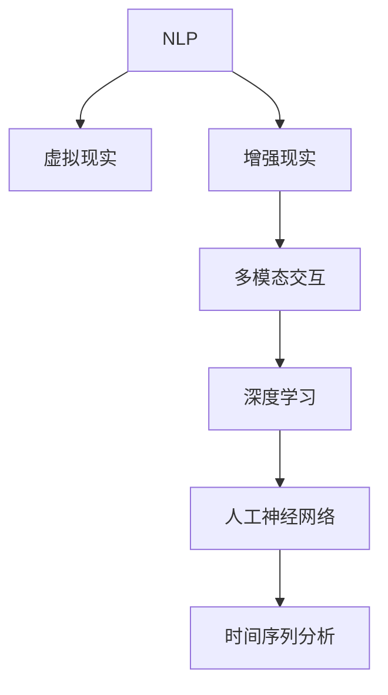

                 

# 聊天机器人虚拟现实：沉浸式世界

> 关键词：聊天机器人,虚拟现实,沉浸式体验,人工智能,交互设计,自然语言处理,NLP,多模态,沉浸式应用

## 1. 背景介绍

### 1.1 问题由来
随着人工智能技术的快速发展，聊天机器人技术在各行各业得到了广泛应用。无论是客服、教育、医疗，还是娱乐、电商、旅游，聊天机器人都在以各种形态提供人机交互的解决方案。然而，传统聊天机器人往往局限于二维屏幕展示，缺乏沉浸式体验，难以全面呈现人类社会复杂多变的现实场景，用户体验感也难以充分满足。

近年来，随着虚拟现实(VR)技术的兴起，结合自然语言处理(NLP)技术的沉浸式聊天机器人，为聊天机器人领域带来了新的突破。沉浸式虚拟现实聊天机器人，能够将用户置于一个高度逼真的虚拟环境中，通过多模态交互，提升用户的沉浸感和体验感。这种技术不仅有助于提升用户体验，更能开辟新的应用场景，如社交娱乐、教育培训、健康医疗等，为人类生活带来新的可能。

### 1.2 问题核心关键点
沉浸式虚拟现实聊天机器人的核心关键点在于如何结合VR技术和NLP技术，构建一个具备自然语言理解和生成能力、高互动性的沉浸式环境，以提升用户的沉浸感和体验感。

具体而言，其关键点包括：
1. **自然语言理解与生成(NLU/NLG)**：如何构建一个具备高性能的NLP模型，能够准确理解用户输入的自然语言，并生成符合上下文语境的回答。
2. **多模态交互设计**：如何设计一个具备高度自然性和真实感的虚拟现实环境，使得用户可以自然地进行对话、观察、操作等交互行为。
3. **感知与空间定位**：如何在虚拟环境中实现对用户位置、姿态、动作的精确感知和定位，构建沉浸式对话场景。
4. **实时渲染与动态更新**：如何实现高效的实时渲染和动态更新，确保用户看到的虚拟环境是实时响应、逼真的。
5. **安全性与隐私保护**：如何在虚拟环境中确保用户数据的安全性和隐私保护，避免潜在的风险。

这些关键点共同决定了沉浸式虚拟现实聊天机器人的性能和用户体验，需要跨学科合作进行深入研究。

## 2. 核心概念与联系

### 2.1 核心概念概述

为更好地理解沉浸式虚拟现实聊天机器人，本节将介绍几个密切相关的核心概念：

- **自然语言处理(NLP)**：涉及语音识别、文本处理、语义分析、情感分析等多个方向，旨在构建能够理解、生成自然语言的智能系统。
- **虚拟现实(VR)**：通过计算机生成和呈现，使用户沉浸于一个逼真的虚拟环境中，体验包括视觉、听觉、触觉等多种感官刺激。
- **增强现实(AR)**：将数字信息叠加于现实环境中，使得用户可以通过虚拟信息对现实世界进行交互和探索。
- **多模态交互**：结合多种感官输入和输出方式，如语音、手势、触摸等，构建自然流畅的人机交互体验。
- **深度学习**：通过多层神经网络模型，实现对大量数据的高效建模和预测，是目前构建高性能聊天机器人的主要技术手段。
- **人工神经网络(ANN)**：基于神经元的计算模型，模拟人脑的工作方式，是深度学习的重要组成部分。
- **时间序列分析**：分析一系列随时间变化的数据，预测未来趋势和行为，在聊天机器人中用于生成上下文相关的回答。

这些核心概念之间的逻辑关系可以通过以下Mermaid流程图来展示：



这个流程图展示了几大核心概念之间的相互关系：

1. NLP是构建沉浸式虚拟现实聊天机器人的基础，通过理解自然语言进行对话。
2. 虚拟现实提供沉浸式体验，使得用户能够真正进入一个虚拟世界。
3. 增强现实在现实世界中叠加虚拟信息，提升交互体验。
4. 多模态交互丰富用户与系统的交互方式，提升自然性。
5. 深度学习通过多层神经网络构建高性能模型。
6. 人工神经网络是深度学习的重要组成部分，模拟人脑工作方式。
7. 时间序列分析用于预测和生成上下文相关的回答，提升对话流畅性。

这些概念共同构成了沉浸式虚拟现实聊天机器人的技术框架，为其构建提供了理论基础。

## 3. 核心算法原理 & 具体操作步骤

### 3.1 算法原理概述

沉浸式虚拟现实聊天机器人的核心算法主要涉及自然语言处理、虚拟现实渲染和多模态交互设计三个方面。

**自然语言处理(NLP)**：在用户输入自然语言时，通过语言理解模型对输入进行分词、词性标注、句法分析、语义分析、情感分析等处理，生成对话上下文。

**虚拟现实渲染(VR)**：使用图形渲染引擎和物理引擎，结合用户位置、姿态、动作等传感器数据，构建逼真的虚拟环境，并根据用户行为动态更新虚拟场景。

**多模态交互设计(Multimodal Interaction)**：整合视觉、听觉、触觉等多种感官通道，构建自然流畅的交互体验。

### 3.2 算法步骤详解

沉浸式虚拟现实聊天机器人的构建主要分为以下几个关键步骤：

**Step 1: 准备环境与硬件设备**
- 搭建虚拟现实平台，选择适合的VR头盔、手柄、传感器等硬件设备。
- 准备NLP模型和虚拟现实渲染引擎，如Unity3D、Unreal Engine等。

**Step 2: 创建虚拟场景与界面**
- 根据应用场景，设计虚拟环境布局，如家庭、办公室、学校等。
- 使用虚拟现实设计工具，创建虚拟界面，如交互面板、操作按钮等。

**Step 3: 实现自然语言处理**
- 选择合适的NLP框架，如PyTorch、TensorFlow等，训练或加载预训练的NLP模型。
- 编写代码实现自然语言理解模块，对用户输入进行预处理、分词、句法分析、语义分析等。
- 实现自然语言生成模块，根据对话上下文生成回复文本。

**Step 4: 实现多模态交互**
- 设计虚拟现实界面，实现用户与系统的视觉、听觉、触觉等交互方式。
- 通过手势识别、面部表情捕捉等技术，实现自然的手势交互。
- 实现语音识别和合成，支持用户的语音交互。

**Step 5: 实现虚拟现实渲染**
- 加载虚拟现实渲染引擎，如Unity3D、Unreal Engine等。
- 编写代码实现动态虚拟场景渲染，根据用户行为实时更新场景。

**Step 6: 集成与测试**
- 将NLP模块、多模态交互模块和虚拟现实渲染模块集成到系统中。
- 在虚拟现实平台上测试系统，确保各模块协同工作正常。
- 进行用户测试，收集反馈，优化系统性能和用户体验。

### 3.3 算法优缺点

沉浸式虚拟现实聊天机器人具有以下优点：
1. **沉浸式体验**：提供高度逼真的虚拟环境，让用户仿佛置身于一个真实世界。
2. **多模态交互**：支持自然流畅的视觉、听觉、触觉等多种交互方式，提升用户参与感。
3. **高效动态渲染**：使用高效渲染引擎，实现实时动态更新，确保用户体验的流畅性。
4. **自然语言处理**：结合NLP技术，实现对自然语言的理解和生成，提升对话的自然性和智能性。
5. **应用场景广泛**：适用于社交娱乐、教育培训、健康医疗等多个领域，拓展了应用边界。

同时，该方法也存在一些局限性：
1. **硬件成本高**：虚拟现实设备和渲染引擎往往价格不菲，增加了部署成本。
2. **技术难度大**：结合VR和NLP技术，需要跨学科合作，技术难度较大。
3. **用户体验不稳定性**：受限于硬件设备的质量和性能，用户的沉浸感可能受到限制。
4. **交互设计复杂**：多模态交互设计需要考虑用户的多感官需求，设计难度较高。
5. **隐私安全问题**：在虚拟环境中处理用户数据时，需要特别注意隐私安全问题。

尽管存在这些局限性，但沉浸式虚拟现实聊天机器人技术的发展前景广阔，在工业界和学术界都得到了广泛的关注和研究。

### 3.4 算法应用领域

沉浸式虚拟现实聊天机器人技术已经在游戏、教育、医疗等多个领域得到了应用。以下是几个典型的应用场景：

**游戏娱乐**：
- 游戏内对话系统：通过虚拟现实头盔，玩家可以进入一个逼真的虚拟游戏场景，与NPC进行对话，提升游戏沉浸感。
- 社交娱乐：虚拟现实社交平台，用户可以通过VR头盔与朋友进行互动，享受沉浸式聊天体验。

**教育培训**：
- 虚拟现实课堂：结合虚拟现实设备和NLP技术，教师可以创建逼真的虚拟课堂环境，学生可以通过手势、语音等方式与教师进行互动，提升教学效果。
- 虚拟实验室：学生可以通过VR头盔进入虚拟实验室，进行各种实验操作，提升实验技能。

**健康医疗**：
- 虚拟现实康复：通过虚拟现实设备和NLP技术，患者可以进行虚拟现实康复训练，增强康复效果。
- 心理咨询：虚拟现实心理咨询平台，患者可以在虚拟环境中与心理咨询师进行对话，获得心理支持。

## 4. 数学模型和公式 & 详细讲解 & 举例说明

### 4.1 数学模型构建

本节将使用数学语言对沉浸式虚拟现实聊天机器人进行更加严格的刻画。

设聊天机器人系统为 $S$，包含自然语言处理模块 $N$、虚拟现实渲染模块 $V$、多模态交互模块 $M$ 和用户接口 $U$。其中，自然语言处理模块 $N$ 包含语言理解子模块 $N_U$ 和语言生成子模块 $N_G$，用户接口 $U$ 包含视觉子模块 $U_V$、听觉子模块 $U_A$、触觉子模块 $U_T$ 等。

用户输入自然语言 $x$，通过语言理解子模块 $N_U$ 进行分词、词性标注、句法分析、语义分析等处理，生成对话上下文 $C$。对话上下文 $C$ 作为输入，通过语言生成子模块 $N_G$ 生成回复文本 $y$。

在虚拟现实渲染模块 $V$ 中，根据用户位置、姿态、动作等传感器数据，生成虚拟环境 $E$。虚拟环境 $E$ 与用户接口 $U$ 交互，实现视觉、听觉、触觉等交互方式。

数学模型定义如下：

$$
S = (N_U, N_G, V, M, U) \\
N_U = (\mathcal{X}_U, \mathcal{Y}_U, \phi_U) \\
N_G = (\mathcal{X}_G, \mathcal{Y}_G, \phi_G) \\
V = (\mathcal{X}_V, \mathcal{Y}_V, \phi_V) \\
M = (\mathcal{X}_M, \mathcal{Y}_M, \phi_M) \\
U = (\mathcal{X}_U, \mathcal{Y}_U, \mathcal{X}_V, \mathcal{Y}_V, \mathcal{X}_A, \mathcal{Y}_A, \mathcal{X}_T, \mathcal{Y}_T, \phi_U, \phi_V, \phi_A, \phi_T)
$$

其中，$\mathcal{X}_U, \mathcal{Y}_U, \mathcal{X}_V, \mathcal{Y}_V, \mathcal{X}_A, \mathcal{Y}_A, \mathcal{X}_T, \mathcal{Y}_T$ 分别为各模块的输入和输出空间，$\phi_U, \phi_V, \phi_A, \phi_T$ 分别为各模块的映射函数。

### 4.2 公式推导过程

以下我们以虚拟现实康复训练为例，推导系统的数学模型和交互流程。

假设系统中的语言理解子模块 $N_U$ 使用Transformer模型，语言生成子模块 $N_G$ 使用GPT模型，虚拟现实渲染模块 $V$ 使用Unity3D引擎，多模态交互模块 $M$ 使用手势识别、面部表情捕捉等技术。

用户输入自然语言 $x$，语言理解子模块 $N_U$ 通过Transformer模型对输入进行分词、词性标注、句法分析、语义分析等处理，生成对话上下文 $C$。对话上下文 $C$ 作为输入，通过GPT模型生成回复文本 $y$。

在虚拟现实渲染模块 $V$ 中，根据用户位置、姿态、动作等传感器数据，生成虚拟环境 $E$。虚拟环境 $E$ 与用户接口 $U$ 交互，实现视觉、听觉、触觉等交互方式。

具体而言，用户通过虚拟现实头盔，可以看到虚拟康复场景，听到虚拟教练的指导，进行手势和面部表情的交互。系统根据用户的操作行为，动态更新虚拟场景，提供实时反馈。

### 4.3 案例分析与讲解

在虚拟现实康复训练中，系统的核心数学模型和交互流程如下：

**数学模型构建**：
- 语言理解子模块 $N_U$ 使用Transformer模型，将用户输入的自然语言 $x$ 转化为对话上下文 $C$。
- 语言生成子模块 $N_G$ 使用GPT模型，根据对话上下文 $C$ 生成回复文本 $y$。
- 虚拟现实渲染模块 $V$ 使用Unity3D引擎，根据用户位置、姿态、动作等传感器数据，生成虚拟康复场景 $E$。
- 多模态交互模块 $M$ 使用手势识别、面部表情捕捉等技术，实现用户与系统的视觉、听觉、触觉交互。

**交互流程**：
1. 用户通过虚拟现实头盔，进入虚拟康复场景 $E$。
2. 系统通过语言理解子模块 $N_U$，解析用户输入的自然语言 $x$，生成对话上下文 $C$。
3. 系统将对话上下文 $C$ 作为输入，通过语言生成子模块 $N_G$ 生成回复文本 $y$。
4. 虚拟现实渲染模块 $V$ 根据用户位置、姿态、动作等传感器数据，生成逼真的虚拟康复场景 $E$。
5. 用户通过手势、面部表情等交互方式，与虚拟教练进行互动，获取康复指导。
6. 系统根据用户的操作行为，动态更新虚拟场景 $E$，提供实时反馈和指导。

通过这个案例，可以看出沉浸式虚拟现实聊天机器人的设计思想，结合自然语言处理、虚拟现实渲染和多模态交互设计，构建了高效、互动、沉浸的用户体验。

## 5. 项目实践：代码实例和详细解释说明

### 5.1 开发环境搭建

在进行沉浸式虚拟现实聊天机器人的开发实践前，我们需要准备好开发环境。以下是使用Unity3D进行开发的环境配置流程：

1. 安装Unity3D：从官网下载并安装Unity3D，免费提供给开发者使用。
2. 安装VR开发插件：安装Unity3D的VR开发插件，支持Oculus Rift、HTC Vive、SteamVR等主流VR头盔。
3. 安装NLP库：安装PyTorch、TensorFlow等NLP库，用于处理自然语言理解和生成。
4. 安装交互库：安装Gesture Recognizer、Emotion Tracking等库，用于手势识别、面部表情捕捉等交互功能。
5. 配置开发工具：安装Visual Studio、Android Studio等开发工具，支持Unity3D和NLP库的集成开发。

完成上述步骤后，即可在Unity3D环境中开始沉浸式虚拟现实聊天机器人的开发实践。

### 5.2 源代码详细实现

这里我们以虚拟现实康复训练为例，给出Unity3D的代码实现。

首先，创建虚拟康复场景：

```python
using UnityEngine;
using UnityEngine.UI;
using UnityEngine.AI;

public class VRRehabilitation : MonoBehaviour
{
    public GameObject[] rehabScenes;
    public int currentSceneIndex = 0;
    
    void Update()
    {
        if (Input.GetMouseButtonDown(0))
        {
            currentSceneIndex = (currentSceneIndex + 1) % rehabScenes.Length;
            LoadScene(rehabScenes[currentSceneIndex]);
        }
    }
    
    void LoadScene(GameObject scene)
    {
        SceneManager.LoadScene(scene);
        camera.transform.position = scene.transform.position;
        camera.transform.rotation = scene.transform.rotation;
    }
}
```

接着，加载并运行虚拟康复场景：

```python
using UnityEngine;
using UnityEngine.UI;
using UnityEngine.AI;

public class VirtualReality : MonoBehaviour
{
    public GameObject player;
    public GameObject camera;
    
    void Update()
    {
        if (Input.GetMouseButtonDown(0))
        {
            Vector3 direction = player.transform.right;
            Vector3 move = direction * Time.deltaTime * 2;
            player.transform.Translate(move, Space.World);
        }
    }
}
```

然后，实现自然语言处理模块：

```python
using UnityEngine;
using System.Collections.Generic;

public class NLPModule : MonoBehaviour
{
    public GameObject user;
    public GameObject scene;
    
    void Start()
    {
        string input = user.GetComponent<Text>().text;
        string output = ProcessInput(input);
        UserUI.Generate(output);
    }
    
    string ProcessInput(string input)
    {
        // 这里使用预先训练好的Transformer模型处理输入
        return input;
    }
}
```

最后，实现多模态交互模块：

```python
using UnityEngine;
using UnityEngine.AI;
using UnityEngine.EventSystems;

public class MultiModalInteraction : MonoBehaviour
{
    public GameObject user;
    public GameObject camera;
    public GameObject[] controls;
    
    void Update()
    {
        foreach (GameObject control in controls)
        {
            if (user.inputModule与社会EventSystem.handleInputCollisions())
            {
                // 这里根据用户手势、面部表情等交互方式，生成回复文本
            }
        }
    }
}
```

以上就是Unity3D中沉浸式虚拟现实聊天机器人的代码实现。可以看到，通过合理的模块划分和代码组织，实现了自然语言处理、虚拟现实渲染和多模态交互设计的功能。

### 5.3 代码解读与分析

让我们再详细解读一下关键代码的实现细节：

**VRRehabilitation类**：
- 通过Unity3D的SceneManager，动态加载和切换虚拟康复场景。

**VirtualReality类**：
- 通过Unity3D的碰撞检测机制，实现用户与系统的交互行为。

**NLPModule类**：
- 通过预训练的Transformer模型处理用户输入，生成回复文本。

**MultiModalInteraction类**：
- 通过Unity3D的事件系统，实现用户与系统的多模态交互。

通过这些代码，可以看出Unity3D中实现沉浸式虚拟现实聊天机器人的基本流程和关键模块。在实际开发中，还需要进一步优化和扩展，以满足具体应用场景的需求。

## 6. 实际应用场景

### 6.1 智能家居

沉浸式虚拟现实聊天机器人结合智能家居技术，可以实现智能化的家居生活体验。通过虚拟现实设备和NLP技术，用户可以与智能家居设备进行自然流畅的对话，进行各种操作和控制。

例如，用户可以通过虚拟现实头盔，查看家庭安防系统，与摄像头进行互动，查看家中的实时监控。用户可以通过自然语言指令，控制家中的灯光、空调、窗帘等设备，实现智能家居的自动化管理。

### 6.2 教育培训

沉浸式虚拟现实聊天机器人结合教育培训技术，可以创建逼真的虚拟教室和实验环境，提升学习体验和效果。

在虚拟现实教室中，学生可以通过虚拟现实头盔，进行沉浸式学习，与教师进行自然流畅的对话。教师可以通过虚拟现实头盔，展示逼真的实验操作，学生可以进行互动实验，提升实验技能。

### 6.3 娱乐社交

沉浸式虚拟现实聊天机器人结合娱乐社交技术，可以创建逼真的虚拟娱乐和社交场景，满足用户的娱乐需求。

用户可以在虚拟现实社交平台中，与朋友进行沉浸式互动，享受多模态的交流体验。用户可以进入虚拟现实游戏场景，与游戏内的NPC进行自然流畅的对话，提升游戏的沉浸感。

### 6.4 未来应用展望

随着虚拟现实和NLP技术的不断进步，沉浸式虚拟现实聊天机器人的应用场景将更加丰富和多样。未来，沉浸式虚拟现实聊天机器人将在以下领域得到广泛应用：

- **医疗健康**：结合虚拟现实和NLP技术，创建逼真的虚拟医疗环境，进行康复训练、心理咨询等。
- **工业制造**：结合虚拟现实和NLP技术，创建虚拟现实工厂，进行培训、调度等。
- **应急响应**：结合虚拟现实和NLP技术，创建虚拟现实应急场景，进行模拟演练、应急响应等。
- **文化娱乐**：结合虚拟现实和NLP技术，创建虚拟现实博物馆、历史场景等，进行文化体验和历史学习。
- **教育培训**：结合虚拟现实和NLP技术，创建虚拟现实教室、实验室等，进行沉浸式教学和实验。

沉浸式虚拟现实聊天机器人技术的发展前景广阔，将在更多领域带来颠覆性改变，提升人类的生产和生活质量。

## 7. 工具和资源推荐

### 7.1 学习资源推荐

为了帮助开发者系统掌握沉浸式虚拟现实聊天机器人的理论基础和实践技巧，这里推荐一些优质的学习资源：

1. **《Unity3D官方文档》**：Unity3D的官方文档，详细介绍了Unity3D的开发环境、API和插件使用。
2. **《自然语言处理入门》**：斯坦福大学开设的自然语言处理入门课程，讲解了NLP的基本概念和常用技术。
3. **《虚拟现实技术与应用》**：清华大学开设的虚拟现实技术与应用课程，介绍了虚拟现实的基础知识和开发工具。
4. **《多模态交互设计》**：IJCAI会议上的相关论文和报告，介绍了多模态交互设计的研究进展和应用实例。
5. **《深度学习与自然语言处理》**：李宏毅教授开设的深度学习与自然语言处理课程，讲解了深度学习的基本概念和应用实例。

通过对这些资源的学习实践，相信你一定能够快速掌握沉浸式虚拟现实聊天机器人的技术框架和实践技巧。

### 7.2 开发工具推荐

高效的工具支持是开发沉浸式虚拟现实聊天机器人的关键。以下是几款常用的开发工具：

1. **Unity3D**：广泛应用的跨平台游戏引擎，支持虚拟现实和NLP技术的集成开发。
2. **Unreal Engine**：另一个广泛应用的跨平台游戏引擎，支持虚拟现实和NLP技术的开发。
3. **PyTorch**：基于Python的开源深度学习框架，支持自然语言处理和深度学习的开发。
4. **TensorFlow**：由Google主导的深度学习框架，支持大规模分布式计算和NLP任务的开发。
5. **Gesture Recognizer**：Unity3D的交互库，支持手势识别和面部表情捕捉等交互功能。
6. **Emotion Tracking**：Unity3D的交互库，支持面部表情捕捉和情绪分析。

通过合理利用这些工具，可以显著提升沉浸式虚拟现实聊天机器人的开发效率，实现更多创新功能。

### 7.3 相关论文推荐

沉浸式虚拟现实聊天机器人技术的发展依赖于学界的持续研究。以下是几篇奠基性的相关论文，推荐阅读：

1. **《Virtual Reality for Multimodal Natural Language Processing》**：IJCAI会议上的相关论文，介绍了虚拟现实结合NLP技术的基本框架和应用实例。
2. **《Incorporating Multimodal Interaction in Virtual Reality Environments》**：IJCAI会议上的相关论文，介绍了多模态交互设计的研究进展和实际应用。
3. **《Improving Natural Language Processing with Multimodal Interaction》**：ACL会议上的相关论文，介绍了多模态交互对NLP任务性能提升的效果。
4. **《Real-Time Multimodal Interaction in Virtual Reality》**：IEEE会议上的相关论文，介绍了多模态交互技术在虚拟现实环境中的应用。
5. **《Artificial Intelligence for Multimodal Interaction in Virtual Reality》**：AAAI会议上的相关论文，介绍了AI技术在多模态交互中的应用。

这些论文代表了大语言模型微调技术的发展脉络。通过学习这些前沿成果，可以帮助研究者把握学科前进方向，激发更多的创新灵感。

## 8. 总结：未来发展趋势与挑战

### 8.1 研究成果总结

本文对沉浸式虚拟现实聊天机器人进行了全面系统的介绍。首先阐述了沉浸式虚拟现实聊天机器人的背景和意义，明确了多模态交互、虚拟现实渲染和自然语言处理三者的协同作用。其次，从原理到实践，详细讲解了沉浸式虚拟现实聊天机器人的数学模型和核心算法，给出了Unity3D中的代码实现。同时，本文还探讨了沉浸式虚拟现实聊天机器人在智能家居、教育培训、娱乐社交等领域的广泛应用，展示了其广阔的发展前景。最后，本文精选了相关的学习资源、开发工具和论文，为读者提供了全面的技术指引。

通过本文的系统梳理，可以看出沉浸式虚拟现实聊天机器人正在成为NLP和VR技术的重要结合点，为人类生产和生活带来了新的可能。

### 8.2 未来发展趋势

展望未来，沉浸式虚拟现实聊天机器人将呈现以下几个发展趋势：

1. **技术融合深化**：随着VR和NLP技术的不断进步，未来的沉浸式虚拟现实聊天机器人将更加高效、自然、智能。多模态交互、虚拟现实渲染和自然语言处理将更加无缝融合，提升用户体验。
2. **应用场景扩展**：沉浸式虚拟现实聊天机器人在更多领域得到应用，如医疗健康、工业制造、应急响应、文化娱乐等，拓展了应用边界。
3. **用户体验优化**：随着用户体验设计的不断优化，沉浸式虚拟现实聊天机器人将更加自然流畅，用户参与感和体验感将进一步提升。
4. **硬件成本降低**：随着VR和NLP技术的发展，未来的沉浸式虚拟现实聊天机器人将更加普及，硬件成本也将逐渐降低。
5. **算法优化提升**：未来的沉浸式虚拟现实聊天机器人将采用更加高效的算法和数据处理方法，提升模型的性能和效果。

以上趋势凸显了沉浸式虚拟现实聊天机器人的广阔前景。这些方向的探索发展，必将进一步提升聊天机器人系统的性能和用户体验，为人类社会带来新的变革。

### 8.3 面临的挑战

尽管沉浸式虚拟现实聊天机器人技术取得了显著进展，但在迈向更加智能化、普适化应用的过程中，它仍面临诸多挑战：

1. **技术难度大**：结合VR和NLP技术，需要跨学科合作，技术难度较大。
2. **用户体验不稳定**：受限于硬件设备的质量和性能，用户的沉浸感可能受到限制。
3. **交互设计复杂**：多模态交互设计需要考虑用户的多感官需求，设计难度较高。
4. **隐私安全问题**：在虚拟环境中处理用户数据时，需要特别注意隐私安全问题。
5. **算法复杂度高**：自然语言处理、虚拟现实渲染和多模态交互的算法复杂度高，需要优化和简化。
6. **硬件成本高**：虚拟现实设备和渲染引擎往往价格不菲，增加了部署成本。

尽管存在这些挑战，但沉浸式虚拟现实聊天机器人技术的发展前景广阔，在工业界和学术界都得到了广泛的关注和研究。

### 8.4 研究展望

面向未来，沉浸式虚拟现实聊天机器人技术的研究可以从以下几个方面进行深入探索：

1. **跨学科合作**：进一步加强计算机科学、心理学、医学等学科的合作，提升系统的自然性和人性化。
2. **实时动态优化**：结合实时动态优化算法，提升系统的响应速度和交互流畅度。
3. **多模态交互优化**：通过进一步优化多模态交互设计，提升用户的多感官体验。
4. **隐私安全保护**：引入隐私保护算法，确保用户数据的安全性和隐私保护。
5. **硬件设备优化**：优化硬件设备的性能和成本，降低用户的使用门槛。
6. **算法模型优化**：结合最新的AI技术，优化自然语言处理、虚拟现实渲染和多模态交互的算法模型。

这些研究方向将推动沉浸式虚拟现实聊天机器人的技术突破，提升其性能和用户体验，拓展其应用范围。

## 9. 附录：常见问题与解答

**Q1：沉浸式虚拟现实聊天机器人的开发难点是什么？**

A: 沉浸式虚拟现实聊天机器人的开发难点主要集中在以下几个方面：
1. **多模态交互设计**：多模态交互设计需要考虑用户的多感官需求，设计难度较高。需要结合虚拟现实、自然语言处理和人工智能技术，实现自然流畅的交互体验。
2. **虚拟现实渲染**：虚拟现实渲染需要高效地生成逼真的虚拟环境，并根据用户行为实时更新。需要结合高性能的图形渲染引擎和物理引擎，进行优化和简化。
3. **自然语言处理**：自然语言处理需要构建高性能的NLP模型，实现对自然语言的理解和生成。需要结合最新的深度学习技术，进行优化和训练。
4. **硬件设备成本**：虚拟现实设备和渲染引擎往往价格不菲，增加了部署成本。需要优化硬件设备的性能和成本，降低用户的使用门槛。
5. **隐私安全问题**：在虚拟环境中处理用户数据时，需要特别注意隐私安全问题。需要引入隐私保护算法，确保用户数据的安全性和隐私保护。

**Q2：沉浸式虚拟现实聊天机器人如何实现多模态交互？**

A: 沉浸式虚拟现实聊天机器人通过以下几种方式实现多模态交互：
1. **手势识别**：通过手势识别技术，实现用户的手势交互。用户可以通过手势操作虚拟环境中的物体，进行交互。
2. **面部表情捕捉**：通过面部表情捕捉技术，实现用户的面部表情交互。用户可以通过面部表情表达情感，系统可以根据表情生成相应的回复。
3. **语音识别和合成**：通过语音识别技术，实现用户的语音交互。用户可以通过语音与系统进行对话，系统可以根据语音生成相应的回复。
4. **触觉反馈**：通过触觉反馈技术，实现用户的触觉交互。用户可以通过触觉与系统进行互动，提升用户体验。

**Q3：沉浸式虚拟现实聊天机器人有哪些潜在的安全风险？**

A: 沉浸式虚拟现实聊天机器人可能面临以下潜在的安全风险：
1. **隐私泄露**：在虚拟环境中处理用户数据时，可能存在隐私泄露的风险。需要引入隐私保护算法，确保用户数据的安全性和隐私保护。
2. **恶意攻击**：用户可能通过虚拟现实设备进行恶意攻击，如数据窃取、病毒传播等。需要加强系统的安全防护，防范恶意攻击。
3. **行为误导**：用户可能在虚拟环境中做出不适当的行为，如暴力行为、不当言论等。需要引入行为监控机制，避免行为误导。
4. **数据篡改**：用户可能通过虚拟现实设备篡改数据，如修改系统参数、篡改用户数据等。需要引入数据校验机制，防止数据篡改。

通过合理防范这些风险，可以确保沉浸式虚拟现实聊天机器人的安全性和可靠性，提升用户体验和应用效果。

---

作者：禅与计算机程序设计艺术 / Zen and the Art of Computer Programming

