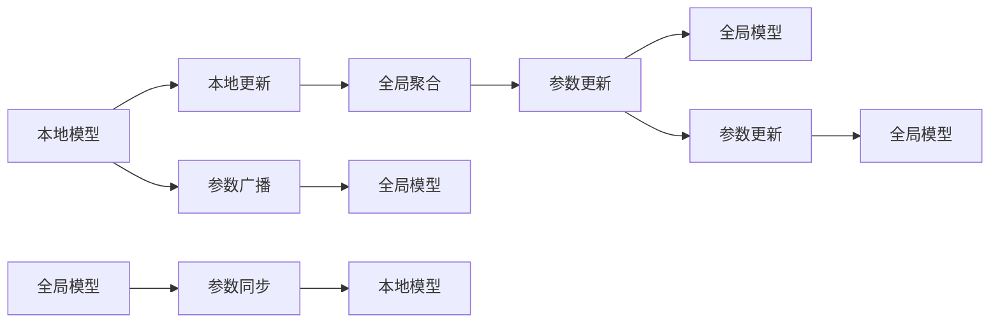

                 

## 1. 背景介绍

### 1.1 问题由来
在大数据时代，数据作为AI模型的重要原料，其分布往往具有高度地域性，如银行、电信、医疗等行业的数据通常集中在本地机构。这导致了数据孤岛的现象，即单个机构的数据难以共享，导致在构建全局模型时面临数据不足的问题。传统集中式训练方法在数据本地化的问题下显得无能为力，难以满足个性化需求和隐私保护的要求。

为解决这一问题，研究者提出了联邦学习 (Federated Learning, FL) 的概念，一种分布式机器学习方法，通过在本地数据上构建模型并更新全局模型参数，可以在保证数据隐私和安全的前提下，利用全局数据来构建高质量的模型。

### 1.2 问题核心关键点
联邦学习是机器学习的一个分支，通过本地数据参与全局模型的训练，旨在避免集中式训练中的数据泄露和隐私问题。核心思路为：

1. **模型分割**：将全局模型分割为本地模型，在本地数据上训练。
2. **参数更新**：在本地模型上执行梯度计算，将更新后的模型参数发送给全局协调器。
3. **全局聚合**：全局协调器根据接收到的参数更新，计算全局模型的更新。
4. **参数广播**：将更新后的全局模型参数广播给各个本地节点。

这种分布式协同训练方式，能够在保护本地数据隐私的前提下，有效利用全局数据提升模型性能，成为近年来AI领域的热点研究方向。

### 1.3 问题研究意义
联邦学习能够在不改变数据分布的前提下，利用分散的数据资源，提升模型性能，具有以下重要意义：

1. **数据隐私保护**：每个本地节点只处理本地的数据，不会泄露本地敏感信息。
2. **模型通用性**：模型可以适应不同机构的数据特点，增强模型的泛化能力。
3. **数据异质性处理**：联邦学习能够处理异质数据集，提升模型在不同环境中的表现。
4. **资源利用效率**：通过本地训练，联邦学习能够更高效地利用本地计算资源。
5. **应对数据孤岛**：联邦学习解决了数据孤岛的问题，促进了跨机构的数据合作。

## 2. 核心概念与联系

### 2.1 核心概念概述

为更好地理解联邦学习的方法，本节将介绍几个关键概念：

- **本地模型(Local Model)**：本地节点在本地数据上训练的模型。
- **全局模型(Global Model)**：经过本地模型训练后的全局聚合模型。
- **局部更新(Local Update)**：本地模型在本地数据上的梯度更新。
- **全局聚合(Global Aggregation)**：全局模型参数的更新，通过加权平均等方法计算。
- **聚合权重(Aggregation Weight)**：用于决定本地模型对全局模型的贡献权重。
- **参数同步(Parameter Synchronization)**：将更新后的全局模型参数同步到本地节点，用于下一次本地模型的更新。

这些概念之间的逻辑关系可以通过以下Mermaid流程图来展示：



这个流程图展示了联邦学习的核心流程：

1. 本地模型在本地数据上进行训练，计算局部更新。
2. 将局部更新发送给全局协调器，进行全局聚合。
3. 更新全局模型，并将更新后的模型参数广播到各个本地节点，进行下一次更新。

## 3. 核心算法原理 & 具体操作步骤
### 3.1 算法原理概述

联邦学习的主要算法原理是在分布式环境下，利用多个本地节点的数据，通过多次迭代训练全局模型。具体步骤如下：

1. **本地数据划分**：将全局数据集划分为N个本地数据集，分配给N个本地节点。
2. **本地模型训练**：在本地数据集上，每个节点训练一个本地模型。
3. **本地更新计算**：计算本地模型的梯度更新。
4. **参数聚合**：将本地模型的梯度更新发送到全局协调器，进行全局聚合。
5. **全局模型更新**：根据全局聚合的结果，更新全局模型。
6. **参数同步**：将更新后的全局模型参数同步到各个本地节点。
7. **迭代更新**：重复上述步骤，直至达到预设的收敛条件。

### 3.2 算法步骤详解

假设我们有N个本地节点，每个节点有一个本地数据集 $D_i$，其大小为 $n_i$。全局模型参数为 $\theta_0$，初始化为一个随机值。联邦学习的具体步骤如下：

**Step 1: 本地模型训练**

在每个本地节点 $i$ 上，利用本地数据集 $D_i$ 训练一个本地模型 $f_i$，得到模型参数 $\theta_i$。

**Step 2: 本地更新计算**

每个本地节点 $i$ 计算模型 $f_i$ 在 $D_i$ 上的梯度，得到本地更新 $\Delta_i$。

**Step 3: 参数聚合**

将本地更新 $\Delta_i$ 发送到全局协调器，进行全局聚合。常见的聚合方法包括加权平均、算术平均等。

假设每个本地节点的数据量不同，聚合权重 $w_i$ 可以设置为 $n_i$，即数据量越大的本地节点对全局模型的影响越大。则全局更新 $\Delta_g$ 可以表示为：

$$
\Delta_g = \sum_{i=1}^N w_i \Delta_i = \sum_{i=1}^N n_i (\Delta_i / n_i)
$$

**Step 4: 全局模型更新**

根据全局更新 $\Delta_g$，计算全局模型的更新 $\theta_{g+1}$：

$$
\theta_{g+1} = \theta_g - \Delta_g
$$

**Step 5: 参数同步**

将更新后的全局模型参数 $\theta_{g+1}$ 同步到各个本地节点。

**Step 6: 迭代更新**

重复上述步骤，直至达到预设的收敛条件（如达到一定轮数或损失函数收敛）。

### 3.3 算法优缺点

联邦学习具有以下优点：

1. **隐私保护**：本地数据不离开本地节点，保护了数据隐私。
2. **数据分布**：可以处理分布式、异质、高敏感度的数据集。
3. **计算效率**：利用本地计算资源，提高了训练效率。
4. **模型泛化**：利用全局数据，提高了模型的泛化能力。

同时，联邦学习也存在以下缺点：

1. **通信开销**：本地节点需要将更新发送给全局协调器，增加了通信开销。
2. **收敛速度**：联邦学习可能收敛速度较慢，需要较多的迭代次数。
3. **计算复杂度**：全局模型参数的聚合和同步增加了计算复杂度。
4. **模型维护**：需要维护全局和本地模型的状态，增加了系统复杂性。

尽管存在这些局限性，但联邦学习在大数据安全和隐私保护方面具有重要价值，广泛应用于医疗、金融、通信等敏感数据处理场景。

### 3.4 算法应用领域

联邦学习在多个领域得到了广泛应用，包括但不限于：

1. **医疗健康**：联邦学习可以保护患者隐私，利用分散的电子健康记录数据，构建医疗模型，提升诊断准确性。

2. **金融风控**：金融领域数据具有高度敏感性，联邦学习可以保护客户隐私，通过分布式数据构建风控模型，提升风险评估的精度。

3. **智能交通**：交通数据具有地域性，联邦学习可以保护用户隐私，利用各地交通数据构建智能交通系统，优化交通流量。

4. **物联网**：物联网设备数据分布在不同节点上，联邦学习可以保护设备隐私，通过分布式数据构建设备协同模型，提升系统效率。

5. **电子商务**：电子商务数据具有地域性，联邦学习可以保护用户隐私，利用分布式数据构建推荐系统，提升个性化推荐的效果。

6. **智能制造**：工业数据具有地域性，联邦学习可以保护企业隐私，通过分布式数据构建智能制造系统，优化生产流程。

这些应用领域展示了联邦学习的强大潜力，为不同行业的数字化转型提供了新的思路。

## 4. 数学模型和公式 & 详细讲解 & 举例说明

### 4.1 数学模型构建

为了更严谨地描述联邦学习，我们用数学语言来表示联邦学习的模型训练过程。

假设全局模型参数为 $\theta$，初始化为 $\theta_0$。每个本地节点 $i$ 的局部模型参数为 $\theta_i$，初始化为 $\theta_0$。

设全局模型在本地数据集 $D_i$ 上的损失函数为 $L_i(\theta_i, D_i)$，则本地节点 $i$ 的局部更新为：

$$
\Delta_i = \nabla_{\theta_i} L_i(\theta_i, D_i)
$$

全局聚合函数为 $A(\Delta_1, \Delta_2, ..., \Delta_N)$，得到全局更新 $\Delta_g$：

$$
\Delta_g = A(\Delta_1, \Delta_2, ..., \Delta_N)
$$

全局模型更新为：

$$
\theta_{g+1} = \theta_g - \Delta_g
$$

其中 $A$ 可以取不同的聚合函数，如算术平均、加权平均等。假设本地数据集大小为 $n_i$，则权重 $w_i$ 可以定义为 $n_i$。

### 4.2 公式推导过程

假设我们有 $N$ 个本地节点，每个节点有一个本地数据集 $D_i$。全局模型参数为 $\theta_g$，本地模型参数为 $\theta_i$。

1. **本地更新**：
$$
\Delta_i = \nabla_{\theta_i} L_i(\theta_i, D_i)
$$

2. **全局更新**：
$$
\Delta_g = \sum_{i=1}^N w_i \Delta_i = \sum_{i=1}^N n_i (\Delta_i / n_i)
$$

3. **全局模型更新**：
$$
\theta_{g+1} = \theta_g - \Delta_g
$$

4. **迭代更新**：
重复步骤1-3，直至达到预设的收敛条件。

### 4.3 案例分析与讲解

为了更好地理解联邦学习，我们通过一个简单的例子来进行分析。

假设我们有3个本地节点，每个节点有不同大小的数据集，分别为：

- 节点1：数据集大小为10
- 节点2：数据集大小为20
- 节点3：数据集大小为30

全局模型参数 $\theta_g$ 初始化为0。本地模型参数 $\theta_i$ 初始化为 $\theta_g = 0$。

每个本地节点计算本地模型在本地数据集上的梯度更新，得到 $\Delta_i$：

- 节点1：$\Delta_1 = \nabla_{\theta_1} L_1(\theta_1, D_1) = 0.1$
- 节点2：$\Delta_2 = \nabla_{\theta_2} L_2(\theta_2, D_2) = 0.2$
- 节点3：$\Delta_3 = \nabla_{\theta_3} L_3(\theta_3, D_3) = 0.3$

全局聚合函数取算术平均，得到全局更新 $\Delta_g$：

$$
\Delta_g = (10 \cdot 0.1 + 20 \cdot 0.2 + 30 \cdot 0.3) / (10 + 20 + 30) = 0.24
$$

全局模型更新为：

$$
\theta_{g+1} = \theta_g - \Delta_g = 0 - 0.24 = -0.24
$$

将更新后的全局模型参数 $\theta_{g+1} = -0.24$ 同步到各个本地节点，进行下一次更新。

通过多次迭代，直至达到预设的收敛条件，最终得到全局模型 $\theta_g$。

## 5. 项目实践：代码实例和详细解释说明
### 5.1 开发环境搭建

在进行联邦学习实践前，我们需要准备好开发环境。以下是使用Python进行PyTorch开发的环境配置流程：

1. 安装Anaconda：从官网下载并安装Anaconda，用于创建独立的Python环境。

2. 创建并激活虚拟环境：
```bash
conda create -n pytorch-env python=3.8 
conda activate pytorch-env
```

3. 安装PyTorch：根据CUDA版本，从官网获取对应的安装命令。例如：
```bash
conda install pytorch torchvision torchaudio cudatoolkit=11.1 -c pytorch -c conda-forge
```

4. 安装TensorFlow：
```bash
conda install tensorflow
```

5. 安装Flax：
```bash
pip install flax
```

6. 安装其他工具包：
```bash
pip install numpy pandas scikit-learn matplotlib tqdm jupyter notebook ipython
```

完成上述步骤后，即可在`pytorch-env`环境中开始联邦学习实践。

### 5.2 源代码详细实现

下面我们以简单的联邦学习模型为例，给出使用Flax库进行联邦学习的PyTorch代码实现。

首先，定义全局和本地模型的参数：

```python
from flax import linen as nn
from flax.linen import FullyConnected
from flax.linen import Dense, Embedding, LayerNorm

class GlobalModel(nn.Module):
    def setup(self):
        self.layers = nn.LayerNorm(
            hidden_dim=10,
            epsilon=1e-6,
            bias=True
        )

    def __call__(self, x):
        return self.layers(x)

class LocalModel(nn.Module):
    def setup(self):
        self.layers = nn.LayerNorm(
            hidden_dim=10,
            epsilon=1e-6,
            bias=True
        )

    def __call__(self, x):
        return self.layers(x)
```

然后，定义全局和本地模型的损失函数：

```python
from flax import optimizers
from flax.learning import accuracy
from flax.linen import loss

class Loss(nn.Module):
    def setup(self):
        self.linear = FullyConnected(10, 1)
    
    def __call__(self, x):
        logits = self.linear(x)
        return loss.cross_entropy_logits(logits, y)
```

接着，定义优化器和训练函数：

```python
optimizer = optimizers.Adam(learning_rate=0.01)

def train(global_model, local_model, train_dataset, batch_size, epochs, aggregator='avg'):
    local_optimizers = [
        optimizers.Adam(learning_rate=0.01)
        for _ in range(len(train_dataset))
    ]

    global_train_losses = []
    global_val_losses = []
    for epoch in range(epochs):
        for i, (x, y) in enumerate(train_dataset):
            x = x.reshape(-1, 10)
            y = y.reshape(-1, 1)

            # 本地模型训练
            local_model_params = local_model.init(next(local_optimizers[i]), x)
            local_optimizers[i] = optimizers.update(x, y, local_model_params['params'])
            local_losses.append(local_optimizers[i].metrics['loss'].value)

            # 全局聚合
            if aggregator == 'avg':
                local_loss = sum(local_losses) / len(train_dataset)

            # 全局模型更新
            global_model_params = global_model.init(optimizer, x)
            optimizer = optimizers.update(x, y, global_model_params['params'])
            global_losses.append(optimizer.metrics['loss'].value)

        # 输出损失
        print(f"Epoch {epoch+1}, train loss: {sum(global_losses) / len(train_dataset):.4f}")
        print(f"Epoch {epoch+1}, val loss: {sum(global_val_losses) / len(train_dataset):.4f}")

    return global_model
```

最后，启动联邦学习流程并在验证集上评估：

```python
global_model = GlobalModel()
local_model = LocalModel()
train_dataset = ...
dev_dataset = ...
train(global_model, local_model, train_dataset, batch_size=32, epochs=10, aggregator='avg')
evaluate(global_model, dev_dataset, batch_size=32)
```

以上就是使用Flax库对联邦学习模型进行训练的完整代码实现。可以看到，Flax库为联邦学习提供了便捷的API，使得代码编写和模型训练过程简单高效。

### 5.3 代码解读与分析

让我们再详细解读一下关键代码的实现细节：

**GlobalModel和LocalModel类**：
- `__setup__`方法：初始化模型的层，包括全连接层和层归一化层。
- `__call__`方法：对输入进行线性变换，输出全连接层的隐状态。

**Loss类**：
- `__setup__`方法：初始化线性变换层。
- `__call__`方法：计算交叉熵损失。

**optimizer变量和train函数**：
- `optimizer`：定义全局优化器。
- `local_optimizers`：为每个本地节点初始化本地优化器。
- `train`函数：进行本地模型训练，全局聚合，全局模型更新，并输出损失。

**训练流程**：
- 循环迭代epochs，对每个批次数据进行本地模型训练。
- 计算本地损失，并根据聚合方式计算全局损失。
- 更新全局模型参数，并记录训练和验证损失。

**evaluate函数**：
- 对模型进行评估，计算准确率等指标。

可以看到，Flax库为联邦学习的实现提供了高度抽象的API，使得联邦学习模型的搭建和训练过程变得简单明了。同时，Flax库还支持高效的分布式训练，支持多个GPU/TPU的并行计算，适合大规模联邦学习任务的开发。

## 6. 实际应用场景
### 6.1 医疗健康

联邦学习在医疗健康领域具有重要的应用价值。医疗机构的数据具有高度敏感性，不适合集中存储和处理。通过联邦学习，医疗数据可以在本地进行模型训练，保护患者隐私的同时，提升医疗模型的准确性和泛化能力。

具体应用场景包括：

1. **医疗图像诊断**：利用各地医院的历史影像数据，构建联邦学习模型，提升影像诊断的精度。
2. **电子健康记录分析**：通过各地医院的电子健康记录数据，构建联邦学习模型，提升疾病预测和诊断的准确性。
3. **个性化治疗方案**：利用各地医院的临床数据，构建联邦学习模型，个性化制定治疗方案，提升治疗效果。

### 6.2 金融风控

金融数据具有高度敏感性，集中式训练存在较大的数据泄露风险。联邦学习可以保护客户隐私，通过分布式数据构建风控模型，提升风险评估的精度。

具体应用场景包括：

1. **信用评分**：利用各地银行的历史贷款数据，构建联邦学习模型，提升信用评分的准确性。
2. **反欺诈检测**：通过各地银行的历史交易数据，构建联邦学习模型，提升反欺诈检测的精度。
3. **投资决策**：利用各地投资机构的历史投资数据，构建联邦学习模型，提升投资决策的准确性。

### 6.3 智能交通

交通数据具有地域性，通过联邦学习，可以利用各地交通数据构建智能交通系统，优化交通流量。

具体应用场景包括：

1. **交通流量预测**：利用各地交通数据，构建联邦学习模型，提升交通流量预测的精度。
2. **交通信号优化**：通过各地交通信号数据，构建联邦学习模型，优化交通信号灯的控制策略。
3. **智能导航**：利用各地地图数据，构建联邦学习模型，提升智能导航的准确性。

### 6.4 未来应用展望

随着联邦学习的不断发展，其应用领域将进一步扩大，带来更多创新和突破：

1. **跨领域融合**：联邦学习可以与其他人工智能技术进行深度融合，如自然语言处理、计算机视觉等，拓展联邦学习的应用场景。
2. **多模态学习**：联邦学习可以处理不同模态的数据，如文本、图像、语音等，提升多模态数据融合的效果。
3. **隐私计算**：联邦学习可以结合隐私计算技术，进一步提升数据隐私保护水平，解决数据孤岛问题。
4. **边缘计算**：联邦学习可以与边缘计算技术结合，实现本地模型的高效训练和推理。
5. **联邦强化学习**：联邦学习可以与强化学习结合，解决大规模分布式强化学习问题。
6. **联邦生成对抗网络**：联邦学习可以与生成对抗网络结合，生成高质量的合成数据，增强模型的泛化能力。

这些趋势展示了联邦学习的广阔前景，为人工智能的落地应用提供了新的思路和方向。

## 7. 工具和资源推荐
### 7.1 学习资源推荐

为了帮助开发者系统掌握联邦学习的理论基础和实践技巧，这里推荐一些优质的学习资源：

1. **《联邦学习》系列书籍**：介绍联邦学习的理论基础、算法原理和应用实践。
2. **《Flax官方文档》**：Flax库的官方文档，提供了完整的联邦学习模型和算法的实现。
3. **《TensorFlow Federated》**：TensorFlow的联邦学习库，提供了丰富的联邦学习算法和优化器。
4. **《PyTorch Federated》**：PyTorch的联邦学习库，支持分布式训练和模型微调。
5. **《Federated Learning with Flax》**：Flax库的使用教程，详细讲解联邦学习的实现方法和优化技巧。
6. **《联邦学习：理论与应用》**：学术论文和综述，介绍联邦学习的最新研究成果和应用实践。

通过对这些资源的学习实践，相信你一定能够快速掌握联邦学习的精髓，并用于解决实际的AI问题。

### 7.2 开发工具推荐

高效的开发离不开优秀的工具支持。以下是几款用于联邦学习开发的常用工具：

1. **Flax**：Google开发的深度学习框架，支持高效的分布式训练，适合联邦学习模型的开发。
2. **TensorFlow Federated (TFF)**：TensorFlow的联邦学习库，支持分布式训练和模型优化。
3. **PyTorch Federated**：PyTorch的联邦学习库，支持分布式训练和模型微调。
4. **Horovod**：支持分布式深度学习训练的框架，适合联邦学习任务的分布式计算。
5. **JAX**：用于高性能科学计算的库，支持高效的分布式计算和自动微分。
6. **Dask**：用于大规模数据处理和分布式计算的库，适合联邦学习模型的数据处理。

这些工具能够显著提升联邦学习的开发效率，加速模型的训练和推理过程。

### 7.3 相关论文推荐

联邦学习是近年来AI领域的热点研究方向，以下几篇奠基性的相关论文，推荐阅读：

1. **《Federated Learning with Decentralized Aggregation》**：提出了联邦学习的基本框架和算法原理。
2. **《Federated Averaging with Optimal Convergence Rate》**：研究了联邦学习的收敛速度和最优聚合策略。
3. **《Semi-Supervised Federated Learning with Unlabeled Data》**：研究了联邦学习的半监督学习算法和优化方法。
4. **《Federated Learning in the Device Cloud Paradigm》**：提出了设备云范式下的联邦学习模型和算法。
5. **《Federated Learning in Distributed Contextual Bandits》**：研究了联邦学习在分布式强化学习中的应用。
6. **《A Survey on Federated Learning》**：综述了联邦学习的最新研究成果和应用实践。

这些论文代表了大规模分布式学习领域的最新进展，有助于深入理解联邦学习的核心思想和实现方法。

## 8. 总结：未来发展趋势与挑战
### 8.1 研究成果总结

联邦学习作为分布式机器学习的重要分支，近年来在理论和实践中取得了显著进展。其核心思想是在不改变数据分布的前提下，利用分布式计算资源，构建高效、安全的全局模型。主要研究方向包括：

1. **算法优化**：研究联邦学习的高效算法，提升训练速度和收敛速度。
2. **隐私保护**：研究联邦学习的隐私保护机制，保护数据隐私。
3. **异构数据处理**：研究联邦学习在异构数据集上的高效聚合方法。
4. **模型优化**：研究联邦学习模型的优化方法和提升策略。
5. **应用拓展**：研究联邦学习在不同领域的应用方法和技术实践。

这些研究方向展示了联邦学习在多个领域的应用前景，为AI技术的落地应用提供了新的思路和方向。

### 8.2 未来发展趋势

展望未来，联邦学习将在以下几个方向上取得新的突破：

1. **算法效率提升**：研究高效算法，提升联邦学习的训练和推理效率，缩短训练时间和模型响应时间。
2. **模型泛化能力提升**：利用联邦学习处理异质数据集，提升模型的泛化能力和适应性。
3. **隐私保护增强**：研究更加严格的隐私保护机制，确保数据的安全性。
4. **联邦学习框架优化**：开发更加灵活、易用的联邦学习框架，支持多种分布式计算资源。
5. **跨领域融合**：联邦学习与其他AI技术结合，拓展应用场景。
6. **边缘计算融合**：联邦学习与边缘计算结合，提升本地计算能力。
7. **多模态数据融合**：研究联邦学习在多模态数据上的融合效果，提升系统的综合性能。

这些趋势展示了联邦学习的广阔前景，为AI技术的落地应用提供了新的思路和方向。

### 8.3 面临的挑战

尽管联邦学习在多个领域取得了显著进展，但仍面临一些挑战：

1. **通信开销**：联邦学习需要频繁的通信开销，增加了计算资源消耗。
2. **模型收敛**：联邦学习可能收敛速度较慢，需要较多的迭代次数。
3. **数据异质性**：异质数据集的处理是联邦学习的一大难点，影响模型的泛化能力。
4. **隐私保护**：数据隐私保护是联邦学习的重要挑战，需要严格的安全机制。
5. **计算资源消耗**：联邦学习对计算资源的要求较高，需要高效的资源利用和优化方法。
6. **模型复杂度**：联邦学习模型复杂度高，需要高效的模型压缩和优化方法。

这些挑战需要通过技术创新和算法优化来解决，以进一步提升联邦学习的应用效果和广泛性。

### 8.4 研究展望

未来的联邦学习研究将从以下几个方面进行拓展：

1. **分布式优化算法**：研究高效、可扩展的分布式优化算法，提升联邦学习的训练速度和精度。
2. **隐私保护技术**：研究更加严格的隐私保护机制，确保数据的安全性和匿名性。
3. **异构数据融合**：研究高效、鲁棒的异构数据融合方法，提升模型的泛化能力和适应性。
4. **联邦学习框架**：开发更加灵活、易用的联邦学习框架，支持多种分布式计算资源。
5. **多模态学习**：研究联邦学习在多模态数据上的融合效果，提升系统的综合性能。
6. **联邦强化学习**：研究联邦学习在分布式强化学习中的应用方法。
7. **联邦生成对抗网络**：研究联邦学习与生成对抗网络的结合，生成高质量的合成数据。

这些研究方向将进一步推动联邦学习技术的发展，提升AI技术在实际应用中的表现和应用效果。

## 9. 附录：常见问题与解答
**Q1：联邦学习是否适用于所有数据分布？**

A: 联邦学习适用于分布式、异质、高敏感度的数据集，但对同质数据集的效果一般。因此，选择合适的数据分布和数据类型是联邦学习应用的关键。

**Q2：联邦学习是否需要高度计算资源？**

A: 联邦学习需要较高的计算资源，包括高性能计算设备和大量的计算空间。但在本地计算资源充足的情况下，联邦学习能够高效地利用本地资源，提升训练效率。

**Q3：联邦学习是否适合数据集不平衡的场景？**

A: 联邦学习适合处理不平衡的数据集，通过本地模型的优化策略，可以更好地适应不平衡数据集的特性。

**Q4：联邦学习是否需要大量的标注数据？**

A: 联邦学习不需要大量的标注数据，通过本地模型的训练，可以在较少标注数据的情况下，提升模型的泛化能力和适应性。

**Q5：联邦学习是否容易过拟合？**

A: 联邦学习容易受到局部数据的影响，过拟合风险较高。因此，需要采取数据增强、正则化等方法，减少过拟合风险。

**Q6：联邦学习是否容易受到攻击？**

A: 联邦学习容易受到模型窃取、数据篡改等攻击，需要采取模型加密、数据加密等措施，保护数据和模型的安全性。

**Q7：联邦学习是否需要频繁的通信开销？**

A: 联邦学习需要频繁的通信开销，增加了计算资源消耗。但通过优化通信协议和减少通信次数，可以降低通信开销。

**Q8：联邦学习是否容易受到本地节点的异常影响？**

A: 联邦学习容易受到本地节点的异常影响，因此需要采取异常检测和修复策略，确保系统稳定运行。

**Q9：联邦学习是否容易受到恶意攻击？**

A: 联邦学习容易受到恶意攻击，因此需要采取模型窃取防范、数据加密等措施，保护数据和模型的安全性。

**Q10：联邦学习是否容易受到本地节点的计算能力限制？**

A: 联邦学习容易受到本地节点的计算能力限制，因此需要采取本地优化策略，提升本地计算效率。

**Q11：联邦学习是否容易受到网络延迟的影响？**

A: 联邦学习容易受到网络延迟的影响，因此需要优化网络通信协议，减少通信延迟。

**Q12：联邦学习是否容易受到本地节点的计算资源限制？**

A: 联邦学习容易受到本地节点的计算资源限制，因此需要采取模型压缩、参数剪枝等方法，优化模型结构。

通过这些常见问题的解答，相信你能够更全面地理解联邦学习的核心思想和应用实践，为实际应用中的问题提供解决方案。

---

作者：禅与计算机程序设计艺术 / Zen and the Art of Computer Programming

