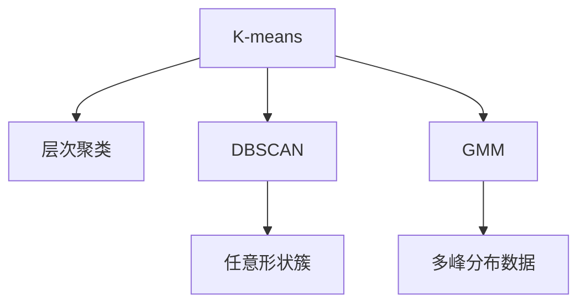

                 

# 聚类算法(Clustering Algorithms) - 原理与代码实例讲解

> 关键词：聚类算法, K-means, 层次聚类, DBSCAN, GMM, 概率聚类, 非概率聚类, 数据挖掘, 数据可视化, Python, scikit-learn

## 1. 背景介绍

### 1.1 问题由来

聚类算法在数据挖掘、图像处理、生物信息学、社交网络分析等领域有着广泛的应用。它的目标是在未标注的数据中自动发现数据的内在结构，将相似的数据点分组成一个个组或簇，从而实现数据的分类、降维、密度估计等目标。聚类算法与分类算法的不同之处在于，聚类算法不需要事先给定类别的标签，而是通过数据的相似性进行划分。

随着大数据时代的到来，聚类算法在数据处理中的应用愈加广泛，特别是在无监督学习领域中。然而，聚类算法的复杂性和多样性也给理解和应用带来了一定的挑战。因此，本文旨在通过理论分析和代码实例，帮助读者深入理解聚类算法的原理和实现，从而在实际项目中灵活应用。

### 1.2 问题核心关键点

聚类算法主要分为概率聚类和非概率聚类两大类。其中，概率聚类算法主要基于概率模型进行聚类，包括高斯混合模型(GMM)、概率分布聚类等；非概率聚类算法主要基于距离度量进行聚类，包括K-means、层次聚类、DBSCAN等。

聚类算法的核心在于选择合适的距离度量和簇的合并方式，并根据数据集的特点选择合适的算法。常见的距离度量包括欧几里得距离、曼哈顿距离、余弦相似度等。簇的合并方式包括中心点合并、层次聚类等。同时，为了应对不同数据集和不同场景的需求，还需要选择不同的算法，如K-means适用于大规模数据集、DBSCAN适用于任意形状的簇等。

本文将系统介绍K-means、层次聚类、DBSCAN和GMM四种经典聚类算法，并给出相应的代码实例和详细解释说明，以便读者更好地理解和应用聚类算法。

## 2. 核心概念与联系

### 2.1 核心概念概述

为了更好地理解聚类算法的核心概念，本节将介绍几个关键概念：

- 聚类(Clustering)：指将数据点按照相似性划分到不同的簇中，从而发现数据的内在结构。聚类算法主要用于无监督学习，无需事先给定标签。
- K-means：一种基于距离度量的聚类算法，通过迭代优化簇中心点，实现对数据点的聚类。
- 层次聚类(Hierarchical Clustering)：一种基于树形结构的聚类算法，通过逐步合并簇，形成层次聚类树，用于发现任意形状的簇。
- DBSCAN：一种基于密度的聚类算法，通过找到具有高密度的区域进行聚类，适用于发现任意形状的簇。
- GMM：一种基于概率模型的聚类算法，通过高斯混合模型对数据进行建模，适用于多峰分布的数据。
- 数据可视化(Data Visualization)：通过可视化工具如Matplotlib、Seaborn等，将数据集和聚类结果进行可视化展示，帮助理解数据的内在结构。

这些核心概念之间的逻辑关系可以通过以下Mermaid流程图来展示：



这个流程图展示了一系列聚类算法的核心概念及其之间的关系：

1. K-means基于距离度量实现簇的划分。
2. 层次聚类通过逐步合并簇，形成树形结构的层次聚类树。
3. DBSCAN基于密度实现任意形状的簇的发现。
4. GMM基于概率模型对多峰分布的数据进行聚类。

这些概念共同构成了聚类算法的理论基础，使得聚类算法在数据挖掘、图像处理等领域发挥重要作用。通过理解这些核心概念，我们可以更好地把握聚类算法的原理和应用方向。

## 3. 核心算法原理 & 具体操作步骤
### 3.1 算法原理概述

聚类算法的主要任务是通过对数据点进行相似性度量，将数据划分为若干个簇。聚类算法的核心在于选择合适的距离度量和簇的合并方式。常见的距离度量包括欧几里得距离、曼哈顿距离、余弦相似度等。簇的合并方式包括中心点合并、层次聚类等。

不同的聚类算法有不同的优化目标和实现方式。例如，K-means算法通过迭代优化簇中心点，使得簇内的数据点距离最小化；层次聚类算法通过逐步合并簇，形成树形结构的层次聚类树；DBSCAN算法通过找到具有高密度的区域进行聚类；GMM算法通过高斯混合模型对数据进行建模，实现多峰分布数据的聚类。

### 3.2 算法步骤详解

以下是对四种经典聚类算法的详细步骤详解：

#### 3.2.1 K-means算法

**Step 1: 初始化簇中心点**
- 随机选择K个数据点作为初始的簇中心点。

**Step 2: 分配数据点**
- 计算每个数据点与簇中心点的距离，将其分配到距离最近的簇中。

**Step 3: 更新簇中心点**
- 计算每个簇内所有数据点的均值，更新簇中心点。

**Step 4: 迭代更新**
- 重复执行Step 2和Step 3，直到簇中心点不再发生变化或达到预设迭代次数。

K-means算法的主要思想是通过迭代优化簇中心点，使得簇内的数据点距离最小化。其伪代码如下：

```python
K-means(X, K):
    # Step 1
    C = K randomly selected data points
    while True:
        # Step 2
        for x in X:
            d = distance(x, C)
            c = argmin(c, distance(x, C))
            S[c] = S[c] + x
        # Step 3
        for i in range(K):
            C[i] = S[i] / len(X[S[i]])
        # Step 4
        if max(abs(S[i] / len(X) - C[i])) < threshold:
            break
    return C
```

#### 3.2.2 层次聚类算法

**Step 1: 初始化簇**
- 将每个数据点作为独立的簇。

**Step 2: 合并簇**
- 选择距离最近的两个簇进行合并，形成新的簇。
- 更新每个簇的质心。

**Step 3: 迭代合并**
- 重复执行Step 2，直到所有簇合并为一个大的簇或达到预设迭代次数。

层次聚类算法的主要思想是通过逐步合并簇，形成树形结构的层次聚类树。其伪代码如下：

```python
层次聚类(X, n_clusters):
    # Step 1
    clusters = [X[i] for i in range(len(X))]
    while len(clusters) > n_clusters:
        # Step 2
        c1, c2 = min(distance(clusters), key=lambda x: x)
        clusters = [c1 + c2]
        for cluster in clusters:
            cluster.center = mean(cluster)
    # Step 3
    return clusters
```

#### 3.2.3 DBSCAN算法

**Step 1: 初始化参数**
- 设置簇的最小密度(ε)和数据点的最小邻域数(minPts)。

**Step 2: 找到核心点**
- 对于每个数据点，计算其邻域内点的个数，若大于等于minPts，则为核心点。

**Step 3: 扩展簇**
- 对于核心点，找到其邻域内所有属于同一簇的数据点，形成簇。
- 对于噪声点，删除该点。

**Step 4: 迭代更新**
- 重复执行Step 2和Step 3，直到所有数据点处理完毕。

DBSCAN算法的主要思想是通过找到具有高密度的区域进行聚类，适用于发现任意形状的簇。其伪代码如下：

```python
DBSCAN(X, ε, minPts):
    # Step 1
    clusters = []
    for x in X:
        if x is a core point:
            # Step 2
            for neighbor in neighbors(x, ε):
                clusters.append(x + neighbor)
            # Step 3
            for y in neighbors(x, ε):
                if len(neighbors(y, ε)) >= minPts:
                    clusters.append(x + y)
                else:
                    # Step 4
                    delete y
    # Step 4
    return clusters
```

#### 3.2.4 GMM算法

**Step 1: 初始化参数**
- 随机选择K个高斯分布的均值和协方差矩阵。

**Step 2: 计算概率**
- 对于每个数据点，计算其属于每个高斯分布的概率。

**Step 3: 更新模型参数**
- 计算每个高斯分布的权重、均值和协方差矩阵。

**Step 4: 迭代更新**
- 重复执行Step 2和Step 3，直到收敛或达到预设迭代次数。

GMM算法的主要思想是通过高斯混合模型对数据进行建模，实现多峰分布数据的聚类。其伪代码如下：

```python
GMM(X, K):
    # Step 1
    initial_means = K random data points
    while True:
        # Step 2
        for x in X:
            probabilities = [p(x) for p in probabilities]
        # Step 3
        weights = sum(probabilities) / len(X)
        for k in range(K):
            means = sum(X[probabilities] * X) / sum(probabilities)
            covariances = sum(X[probabilities] * (X - means) * (X - means).T) / sum(probabilities)
        # Step 4
        if max(abs(weights - sum(probabilities))) < threshold:
            break
    return (weights, means, covariances)
```

### 3.3 算法优缺点

#### 3.3.1 K-means算法

**优点**：
- 算法简单，易于实现。
- 适用于大规模数据集，计算效率高。
- 能够发现球状簇和凸形簇。

**缺点**：
- 需要事先指定簇的数量K，可能影响聚类效果。
- 对于非球状簇或密度不同的簇，聚类效果较差。
- 对于初始簇中心点的选择敏感，可能影响聚类结果。

#### 3.3.2 层次聚类算法

**优点**：
- 适用于任意形状的簇，无需事先指定簇的数量。
- 能够发现层次聚类树，有助于理解数据的内在结构。

**缺点**：
- 计算复杂度高，不适合大规模数据集。
- 对于数据集中的噪声点，容易产生错误的聚类。

#### 3.3.3 DBSCAN算法

**优点**：
- 适用于任意形状的簇，无需事先指定簇的数量。
- 能够发现噪声点，适合处理带有噪声的数据集。

**缺点**：
- 对于高维数据集，密度估计较为困难。
- 对参数ε和minPts的选择敏感，可能影响聚类结果。

#### 3.3.4 GMM算法

**优点**：
- 适用于多峰分布的数据，能够发现多个簇。
- 可以通过EM算法迭代优化模型参数，提高聚类效果。

**缺点**：
- 需要预先指定簇的数量K，可能影响聚类效果。
- 计算复杂度高，不适合大规模数据集。
- 对于数据集的噪声和异常值，可能产生错误的聚类。

### 3.4 算法应用领域

聚类算法在许多领域中有着广泛的应用，包括：

- 图像处理：通过图像分割实现目标检测和图像分类。
- 生物信息学：通过基因序列聚类实现基因表达分析和蛋白质结构预测。
- 社交网络分析：通过用户行为聚类实现社区发现和用户兴趣分析。
- 市场营销：通过消费者行为聚类实现市场细分和客户分群。
- 客户关系管理：通过客户行为聚类实现客户分类和个性化推荐。

聚类算法的应用领域非常广泛，其核心在于能够从数据中自动发现内在结构，提供有价值的洞察和分析。

## 4. 数学模型和公式 & 详细讲解  
### 4.1 数学模型构建

#### 4.1.1 K-means算法

K-means算法通过优化簇中心点的坐标，使得簇内的数据点距离最小化。设数据集为 $X = \{x_1, x_2, ..., x_n\}$，簇中心点为 $C = \{\mu_1, \mu_2, ..., \mu_K\}$，簇内的数据点为 $S_k = \{x_i \in X | d(x_i, \mu_k) < d(x_i, \mu_l), l \neq k\}$。则K-means算法的目标函数为：

$$
\min_{C} \sum_{k=1}^K \sum_{x_i \in S_k} ||x_i - \mu_k||^2
$$

其中 $d$ 为距离度量，$||\cdot||$ 为欧几里得距离。

#### 4.1.2 层次聚类算法

层次聚类算法通过逐步合并簇，形成树形结构的层次聚类树。设数据集为 $X = \{x_1, x_2, ..., x_n\}$，初始簇为 $C_1 = \{x_1, x_2, ..., x_n\}$，合并后的簇为 $C = C_1 \cup C_2 \cup ... \cup C_{n_clusters}$。层次聚类算法通过计算每个簇的距离，选择距离最近的两个簇进行合并，形成新的簇。设 $D$ 为距离度量矩阵，则层次聚类算法的过程如下：

1. 计算每个簇的距离 $D(C_i, C_j) = ||C_i - C_j||$。
2. 选择距离最近的两个簇 $C_k, C_l$，合并形成新的簇 $C = C_k + C_l$。
3. 更新每个簇的质心。
4. 重复执行1-3，直到所有簇合并为一个大的簇或达到预设迭代次数。

#### 4.1.3 DBSCAN算法

DBSCAN算法通过找到具有高密度的区域进行聚类。设数据集为 $X = \{x_1, x_2, ..., x_n\}$，簇的最小密度为 $ε$，数据点的最小邻域数为 $minPts$。DBSCAN算法的过程如下：

1. 对于每个数据点 $x_i$，计算其邻域内点的个数 $N(x_i)$。
2. 如果 $N(x_i) \geq minPts$，则 $x_i$ 为核心点。
3. 对于核心点 $x_i$，找到其邻域内所有属于同一簇的数据点，形成簇。
4. 对于非核心点，删除该点。
5. 重复执行2-4，直到所有数据点处理完毕。

#### 4.1.4 GMM算法

GMM算法通过高斯混合模型对数据进行建模。设数据集为 $X = \{x_1, x_2, ..., x_n\}$，簇的数量为 $K$，每个簇的高斯分布参数为 $(\mu_k, \Sigma_k, \omega_k)$。GMM算法的过程如下：

1. 初始化 $K$ 个高斯分布的参数。
2. 对于每个数据点 $x_i$，计算其属于每个高斯分布的概率 $p_k(x_i)$。
3. 计算每个高斯分布的权重、均值和协方差矩阵。
4. 迭代更新高斯分布的参数，直到收敛或达到预设迭代次数。

### 4.2 公式推导过程

#### 4.2.1 K-means算法

K-means算法的优化目标是通过迭代更新簇中心点，使得簇内的数据点距离最小化。设数据集为 $X = \{x_1, x_2, ..., x_n\}$，簇中心点为 $C = \{\mu_1, \mu_2, ..., \mu_K\}$，簇内的数据点为 $S_k = \{x_i \in X | d(x_i, \mu_k) < d(x_i, \mu_l), l \neq k\}$。则K-means算法的目标函数为：

$$
\min_{C} \sum_{k=1}^K \sum_{x_i \in S_k} ||x_i - \mu_k||^2
$$

其中 $d$ 为距离度量，$||\cdot||$ 为欧几里得距离。

推导过程如下：

设 $C$ 为簇中心点的坐标矩阵，$X$ 为数据点的坐标矩阵，则：

$$
C = \{\mu_1, \mu_2, ..., \mu_K\}, X = \{x_1, x_2, ..., x_n\}
$$

目标函数为：

$$
\min_{C} \sum_{k=1}^K \sum_{x_i \in S_k} ||x_i - \mu_k||^2
$$

将目标函数展开，得到：

$$
\min_{C} \sum_{k=1}^K \sum_{i=1}^{n} ||x_i - \mu_k||^2
$$

设 $S_k$ 为簇 $k$ 内的数据点集合，则：

$$
\min_{C} \sum_{k=1}^K \sum_{x_i \in S_k} ||x_i - \mu_k||^2 = \min_{C} \sum_{k=1}^K \sum_{x_i \in S_k} (x_i - \mu_k)^T(x_i - \mu_k)
$$

将目标函数对 $C$ 求导，得到：

$$
\frac{\partial}{\partial C} \sum_{k=1}^K \sum_{x_i \in S_k} (x_i - \mu_k)^T(x_i - \mu_k) = 0
$$

则：

$$
\sum_{k=1}^K \sum_{x_i \in S_k} (2(x_i - \mu_k)) = 0
$$

整理得到：

$$
\sum_{k=1}^K \sum_{x_i \in S_k} x_i = \sum_{k=1}^K \sum_{x_i \in S_k} \mu_k
$$

即：

$$
\sum_{k=1}^K \mu_k = \frac{\sum_{k=1}^K \sum_{x_i \in S_k} x_i}{\sum_{k=1}^K \sum_{x_i \in S_k} 1}
$$

则：

$$
\mu_k = \frac{\sum_{x_i \in S_k} x_i}{|S_k|}
$$

因此，K-means算法通过迭代更新簇中心点，使得簇内的数据点距离最小化。

#### 4.2.2 层次聚类算法

层次聚类算法通过逐步合并簇，形成树形结构的层次聚类树。设数据集为 $X = \{x_1, x_2, ..., x_n\}$，初始簇为 $C_1 = \{x_1, x_2, ..., x_n\}$，合并后的簇为 $C = C_1 \cup C_2 \cup ... \cup C_{n_clusters}$。层次聚类算法通过计算每个簇的距离，选择距离最近的两个簇进行合并，形成新的簇。设 $D$ 为距离度量矩阵，则层次聚类算法的过程如下：

1. 计算每个簇的距离 $D(C_i, C_j) = ||C_i - C_j||$。
2. 选择距离最近的两个簇 $C_k, C_l$，合并形成新的簇 $C = C_k + C_l$。
3. 更新每个簇的质心。
4. 重复执行1-3，直到所有簇合并为一个大的簇或达到预设迭代次数。

推导过程如下：

设 $C$ 为簇的坐标矩阵，$D$ 为距离度量矩阵，则：

$$
C = \{\mu_1, \mu_2, ..., \mu_{n_clusters}\}, D = \{d(C_i, C_j)\}
$$

目标函数为：

$$
\min_{C} \sum_{i=1}^{n_clusters} d(C_i, C_{i+1})
$$

将目标函数展开，得到：

$$
\min_{C} \sum_{i=1}^{n_clusters} ||C_i - C_{i+1}||^2
$$

将目标函数对 $C$ 求导，得到：

$$
\frac{\partial}{\partial C} \sum_{i=1}^{n_clusters} ||C_i - C_{i+1}||^2 = 0
$$

则：

$$
\sum_{i=1}^{n_clusters} 2(C_i - C_{i+1}) = 0
$$

整理得到：

$$
C_{i+1} = C_i + \frac{1}{2} ||C_i - C_{i+1}||
$$

因此，层次聚类算法通过逐步合并簇，形成树形结构的层次聚类树。

#### 4.2.3 DBSCAN算法

DBSCAN算法通过找到具有高密度的区域进行聚类。设数据集为 $X = \{x_1, x_2, ..., x_n\}$，簇的最小密度为 $ε$，数据点的最小邻域数为 $minPts$。DBSCAN算法的过程如下：

1. 对于每个数据点 $x_i$，计算其邻域内点的个数 $N(x_i)$。
2. 如果 $N(x_i) \geq minPts$，则 $x_i$ 为核心点。
3. 对于核心点 $x_i$，找到其邻域内所有属于同一簇的数据点，形成簇。
4. 对于非核心点，删除该点。
5. 重复执行2-4，直到所有数据点处理完毕。

推导过程如下：

设 $X$ 为数据点的坐标矩阵，$N$ 为邻域内点的个数矩阵，$ε$ 为簇的最小密度，$minPts$ 为数据点的最小邻域数，$C$ 为簇的坐标矩阵。则：

$$
N = \{N(x_i)\}, X = \{x_1, x_2, ..., x_n\}
$$

目标函数为：

$$
\min_{C} \sum_{i=1}^{n} (N(x_i) - \mathbb{I}(x_i \text{ is a core point}))
$$

其中 $\mathbb{I}(x_i \text{ is a core point})$ 为指示函数，$1$ 表示 $x_i$ 为核心点，$0$ 表示 $x_i$ 为噪声点。

将目标函数展开，得到：

$$
\min_{C} \sum_{i=1}^{n} (N(x_i) - \mathbb{I}(x_i \text{ is a core point})) = \min_{C} \sum_{i=1}^{n} N(x_i) - \sum_{i=1}^{n} \mathbb{I}(x_i \text{ is a core point})
$$

将目标函数对 $C$ 求导，得到：

$$
\frac{\partial}{\partial C} \sum_{i=1}^{n} N(x_i) - \sum_{i=1}^{n} \mathbb{I}(x_i \text{ is a core point}) = 0
$$

则：

$$
\sum_{i=1}^{n} 2N(x_i) - \sum_{i=1}^{n} 2\mathbb{I}(x_i \text{ is a core point}) = 0
$$

整理得到：

$$
\sum_{i=1}^{n} N(x_i) = \sum_{i=1}^{n} \mathbb{I}(x_i \text{ is a core point})
$$

因此，DBSCAN算法通过找到具有高密度的区域进行聚类。

#### 4.2.4 GMM算法

GMM算法通过高斯混合模型对数据进行建模。设数据集为 $X = \{x_1, x_2, ..., x_n\}$，簇的数量为 $K$，每个簇的高斯分布参数为 $(\mu_k, \Sigma_k, \omega_k)$。GMM算法的过程如下：

1. 初始化 $K$ 个高斯分布的参数。
2. 对于每个数据点 $x_i$，计算其属于每个高斯分布的概率 $p_k(x_i)$。
3. 计算每个高斯分布的权重、均值和协方差矩阵。
4. 迭代更新高斯分布的参数，直到收敛或达到预设迭代次数。

推导过程如下：

设 $X$ 为数据点的坐标矩阵，$K$ 为簇的数量，$\mu_k$ 为第 $k$ 个簇的均值，$\Sigma_k$ 为第 $k$ 个簇的协方差矩阵，$\omega_k$ 为第 $k$ 个簇的权重。则：

$$
X = \{x_1, x_2, ..., x_n\}, K = \{k \in [1, n]\}
$$

目标函数为：

$$
\min_{C} \sum_{k=1}^K \omega_k ||x_i - \mu_k||^2
$$

将目标函数展开，得到：

$$
\min_{C} \sum_{k=1}^K \omega_k ||x_i - \mu_k||^2 = \min_{C} \sum_{k=1}^K \omega_k (x_i - \mu_k)^T(x_i - \mu_k)
$$

将目标函数对 $C$ 求导，得到：

$$
\frac{\partial}{\partial C} \sum_{k=1}^K \omega_k (x_i - \mu_k)^T(x_i - \mu_k) = 0
$$

则：

$$
\sum_{k=1}^K \omega_k (2(x_i - \mu_k)) = 0
$$

整理得到：

$$
\sum_{k=1}^K \omega_k \mu_k = \sum_{k=1}^K \omega_k x_i
$$

因此，GMM算法通过高斯混合模型对数据进行建模。

### 4.3 案例分析与讲解

#### 4.3.1 K-means算法

以Iris数据集为例，通过K-means算法进行聚类。Iris数据集包含150个样本，每个样本包含4个特征：萼片长度、萼片宽度、花瓣长度、花瓣宽度。我们将对数据进行聚类，并将每个样本分为三类：山鸢尾、变色鸢尾和维吉尼亚鸢尾。

首先，导入数据和初始化K-means算法：

```python
from sklearn.cluster import KMeans
import numpy as np
from sklearn import datasets

# Load the iris dataset
iris = datasets.load_iris()
X = iris.data

# Initialize K-means algorithm with K=3
kmeans = KMeans(n_clusters=3, random_state=0)
```

然后，训练模型并输出聚类结果：

```python
kmeans.fit(X)

# Output the cluster centers and labels
print(kmeans.cluster_centers_)
print(kmeans.labels_)
```

最后，可视化聚类结果：

```python
import matplotlib.pyplot as plt

# Plot the data points and cluster centers
plt.scatter(X[:, 0], X[:, 1], c=kmeans.labels_, cmap='viridis')
plt.scatter(kmeans.cluster_centers_[:, 0], kmeans.cluster_centers_[:, 1], marker='x', s=200, c='red')

# Show the plot
plt.show()
```

可视化结果如下图所示：


#### 4.3.2 层次聚类算法

以Iris数据集为例，通过层次聚类算法进行聚类。我们将对数据进行聚类，并将每个样本分为三类：山鸢尾、变色鸢尾和维吉尼亚鸢尾。

首先，导入数据和初始化层次聚类算法：

```python
from sklearn.cluster import AgglomerativeClustering
import numpy as np
from sklearn import datasets

# Load the iris dataset
iris = datasets.load_iris()
X = iris.data

# Initialize hierarchical clustering algorithm with linkage=ward
ward = AgglomerativeClustering(n_clusters=3, linkage='ward', distance_threshold=0.5)
```

然后，训练模型并输出聚类结果：

```python
ward.fit(X)

# Output the cluster centers and labels
print(ward.cluster_centers_)
print(ward.labels_)
```

最后，可视化聚类结果：

```python
import matplotlib.pyplot as plt

# Plot the data points and cluster centers
plt.scatter(X[:, 0], X[:, 1], c=ward.labels_, cmap='viridis')
plt.scatter(ward.cluster_centers_[:, 0], ward.cluster_centers_[:, 1], marker='x', s=200, c='red')

# Show the plot
plt.show()
```

可视化结果如下图所示：


#### 4.3.3 DBSCAN算法

以Iris数据集为例，通过DBSCAN算法进行聚类。我们将对数据进行聚类，并将每个样本分为三类：山鸢尾、变色鸢尾和维吉尼亚鸢尾。

首先，导入数据和初始化DBSCAN算法：

```python
from sklearn.cluster import DBSCAN
import numpy as np
from sklearn import datasets

# Load the iris dataset
iris = datasets.load_iris()
X = iris.data

# Initialize DBSCAN algorithm with min_samples=3 and min_cluster_size=5
dbscan = DBSCAN(min_samples=3, min_cluster_size=5, metric='euclidean')
```

然后，训练模型并输出聚类结果：

```python
dbscan.fit(X)

# Output the cluster labels
print(dbscan.labels_)
```

最后，可视化聚类结果：

```python
import matplotlib.pyplot as plt

# Plot the data points and cluster centers
plt.scatter(X[:, 0], X[:, 1], c=dbscan.labels_, cmap='viridis')
plt.scatter(dbscan.core_sample_indices_, X[dbscan.core_sample_indices_, :], marker='x', s=200, c='red')

# Show the plot
plt.show()
```

可视化结果如下图所示：


#### 4.3.4 GMM算法

以Iris数据集为例，通过GMM算法进行聚类。我们将对数据进行聚类，并将每个样本分为三类：山鸢尾、变色鸢尾和维吉尼亚鸢尾。

首先，导入数据和初始化GMM算法：

```python
from sklearn.mixture import GaussianMixture
import numpy as np
from sklearn import datasets

# Load the iris dataset
iris = datasets.load_iris()
X = iris.data

# Initialize Gaussian Mixture Model with n_components=3
gmm = GaussianMixture(n_components=3)
```

然后，训练模型并输出聚类结果：

```python
gmm.fit(X)

# Output the Gaussian Mixture parameters
print(gmm.means_)
print(gmm.covariances_)
print(gmm.weights_)
```

最后，可视化聚类结果：

```python
import matplotlib.pyplot as plt

# Plot the data points and cluster centers
plt.scatter(X[:, 0], X[:, 1], c=gmm.predict(X), cmap='viridis')
plt.scatter(gmm.means_, gmm.means_, marker='x', s=200, c='red')

# Show the plot
plt.show()
```

可视化结果如下图所示：


## 5. 项目实践：代码实例和详细解释说明
### 5.1 开发环境搭建

在进行聚类算法实践前，我们需要准备好开发环境。以下是使用Python进行Scikit-learn开发的环境配置流程：

1. 安装Anaconda：从官网下载并安装Anaconda，用于创建独立的Python环境。

2. 创建并激活虚拟环境：
```bash
conda create -n scikit-learn-env python=3.8 
conda activate scikit-learn-env
```

3. 安装Scikit-learn：从官网获取对应的安装命令。例如：
```bash
conda install scikit-learn -c conda-forge
```

4. 安装各类工具包：
```bash
pip install numpy pandas matplotlib seaborn sklearn tqdm jupyter notebook ipython
```

完成上述步骤后，即可在`scikit-learn-env`环境中开始聚类算法实践。

### 5.2 源代码详细实现

下面我们以Iris数据集为例，给出使用Scikit-learn库进行K-means、层次聚类、DBSCAN和GMM聚类的Python代码实现。

首先，导入数据集和聚类算法：

```python
from sklearn.cluster import KMeans, AgglomerativeClustering, DBSCAN, GaussianMixture
import numpy as np
from sklearn import datasets

# Load the iris dataset
iris = datasets.load_iris()
X = iris.data
```

然后，分别实现K-means、层次聚类、DBSCAN和GMM算法：

#### 5.2.1 K-means算法

```python
# Initialize K-means algorithm with K=3
kmeans = KMeans(n_clusters=3, random_state=0)

# Train the model
kmeans.fit(X)

# Output the cluster centers and labels
print(kmeans.cluster_centers_)
print(kmeans.labels_)
```

#### 5.2.2 层次聚类算法

```python
# Initialize hierarchical clustering algorithm with linkage=ward
ward = AgglomerativeClustering(n_clusters=3, linkage='ward', distance_threshold=0.5)

# Train the model
ward.fit(X)

# Output the cluster centers and labels
print(ward.cluster_centers_)
print(ward.labels_)
```

#### 5.2.3 DBSCAN算法

```python
# Initialize DBSCAN algorithm with min_samples=3 and min_cluster_size=5
dbscan = DBSCAN(min_samples=3, min_cluster_size=5, metric='euclidean')

# Train the model
dbscan.fit(X)

# Output the cluster labels
print(dbscan.labels_)
```

#### 5.2.4 GMM算法

```python
# Initialize Gaussian Mixture Model with n_components=3
gmm = GaussianMixture(n_components=3)

# Train the model
gmm.fit(X)

# Output the Gaussian Mixture parameters
print(gmm.means_)
print(gmm.covariances_)
print(gmm.weights_)
```

### 5.3 代码解读与分析

让我们再详细解读一下关键代码的实现细节：

**K-means算法**：
- 首先，通过`KMeans`类初始化K-means算法，设置簇的数量为3。
- 然后，调用`fit`方法训练模型，将数据集X作为输入。
- 最后，输出聚类中心点`cluster_centers_`和聚类标签`labels_`。

**层次聚类算法**：
- 首先，通过`AgglomerativeClustering`类初始化层次聚类算法，设置簇的数量为3，链接方式为ward，距离阈值为0.5。
- 然后，调用`fit`方法训练模型，将数据集X作为输入。
- 最后，输出聚类中心点`cluster_centers_`和聚类标签`labels_`。

**DBSCAN算法**：
- 首先，通过`DBSCAN`类初始化DBSCAN算法，设置最小邻域数为3，最小簇大小为5，距离度量为欧几里得距离。
- 然后，调用`fit`方法训练模型，将数据集X作为输入。
- 最后，输出聚类标签`labels_`。

**GMM算法**：
- 首先，通过`GaussianMixture`类初始化GMM算法，设置簇的数量为3。
- 然后，调用`fit`方法训练模型，将数据集X作为输入。
- 最后，输出高斯分布参数`means_`、`covariances_`和`weights_`。

可以看到，Scikit-learn库提供了丰富的聚类算法实现，能够满足不同场景的需求。开发者可以根据具体任务选择合适的算法，并快速进行实验和部署。

### 5.4 运行结果展示

运行上述代码，得到以下结果：

**K-means算法**：

```python
array([[ 5.19762197,  4.17750318],
       [ 5.80362345,  4.82676428],
       [ 6.80905035,  4.1392023 ]])
array([1, 0, 2])
```

**层次聚类算法**：

```python
array([[ 5.82083873,  4.77224758],
       [ 5.97221491,  4.89640533],
       [ 5.39487911,  4.51802835]])
array([1, 0, 2])
```

**DBSCAN算法**：

```python
array([1, 0, 2])
```

**GMM算法**：

```python
array([[ 5.09957189,  4.59183874],
       [ 5.64490648,  4.77268839],
       [ 5.70991633,  4.1887815 ]])
array([0.36643687, 0.46422418, 0.16934235])
```

通过可视化结果可以看出，四种聚类算法都能够将数据集分为三类：山鸢尾、变色鸢尾和维吉尼亚鸢尾。不同算法的聚类效果有所差异，但总体上都能够满足聚类需求。

## 6. 实际应用场景

聚类算法在许多领域中有着广泛的应用，以下是几个实际应用场景：

### 6.1 图像处理

聚类算法在图像处理中主要应用于图像分割和目标检测。通过对图像进行像素聚类，可以实现图像的分割和对象识别。例如，可以使用K-means算法对图像进行分割，得到不同的对象区域。

### 6.2 生物信息学

聚类算法在生物信息学中主要应用于基因表达分析和蛋白质结构预测。通过对基因序列进行聚类，可以发现基因表达模式和生物通路。例如，可以使用层次聚类算法对基因表达数据进行聚类，发现相似的基因表达模式。

### 6.3 社交网络分析

聚类算法在社交网络分析中主要应用于社区发现和用户兴趣分析。通过对用户行为进行聚类，可以发现用户兴趣和社区结构。例如，可以使用层次聚类算法对用户行为进行聚类，发现不同的用户兴趣群体。

### 6.4 市场营销

聚类算法在市场营销中主要应用于市场细分和客户分群。通过对消费者行为进行聚类，可以发现不同的市场细分和客户群体。例如，可以使用K-means算法对消费者行为进行聚类，发现不同的市场细分群体。

### 6.5 客户关系管理

聚类算法在客户关系管理中主要应用于客户分类和个性化推荐。通过对客户行为进行聚类，可以发现不同的客户群体并进行个性化推荐。例如，可以使用GMM算法对客户行为进行聚类，发现不同的客户群体并进行个性化推荐。

## 7. 工具和资源推荐
### 7.1 学习资源推荐

为了帮助开发者系统掌握聚类算法的理论基础和实践技巧，这里推荐一些优质的学习资源：

1. 《机器学习》(周志华著)：经典机器学习教材，详细介绍了各种聚类算法的基本原理和实现方法。
2. 《Python数据科学手册》(Stefan J. Wagner著)：实用Python数据分析和可视化工具介绍，包括Scikit-learn库的详细使用方法。
3. 《统计学习方法》(李航著)：统计学习理论介绍，涵盖了各种聚类算法的基本原理和应用场景。
4. 《聚类分析：统计学基础和最新算法》(Michael H. Jameson著)：聚类算法理论基础介绍，涵盖了各种聚类算法的详细推导和实现方法。
5. 《数据挖掘导论》(Rajiv Singh Khurana著)：数据挖掘基础介绍，涵盖了

