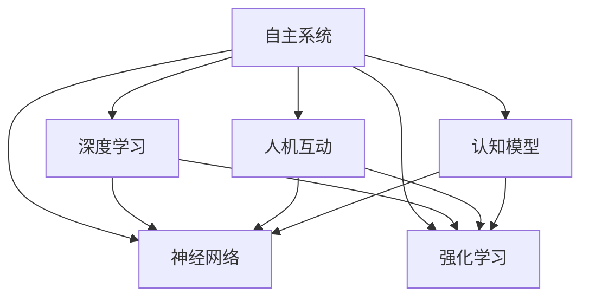

                 

# 自主系统与意识功能的互动

> 关键词：自主系统,意识功能,人机互动,深度学习,神经网络,强化学习,认知模型

## 1. 背景介绍

### 1.1 问题由来

随着科技的飞速发展，人工智能(AI)在多个领域展现出强大的应用潜力。从自动化控制到智能决策，再到人机交互，AI已经深刻改变了我们的生产和生活方式。然而，尽管AI技术日益成熟，但如何使机器更好地理解人类意识、与人类自然互动，仍是一个尚未完全解决的问题。特别是在涉及高度复杂、情感丰富的任务时，现有AI系统的表现仍显不足。

### 1.2 问题核心关键点

该问题聚焦于如何构建自主系统，使其能够理解、模仿和生成人类意识功能，从而实现更加自然、高效、安全的人机互动。核心关键点包括：

- 自主系统：能够独立感知环境、理解语义、执行决策的智能系统。
- 意识功能：包括感知、理解、情感、记忆、决策等人类意识功能的模拟。
- 人机互动：通过自然语言处理、语音识别、计算机视觉等技术，实现与人类自然的交互和沟通。
- 深度学习：使用多层神经网络进行特征提取和模式识别，提取复杂数据的深度表示。
- 强化学习：通过与环境的互动，优化模型参数，学习最优策略。
- 认知模型：模拟人类认知过程，理解语义、情感等高级认知功能。

这些关键点共同构成了构建能够与人类自然互动的自主系统的基础。

### 1.3 问题研究意义

构建具有意识功能的自主系统，对于实现人机互动的自然化和智能化，具有重要意义：

1. **提升用户体验**：通过自然语言和情感理解，AI系统能够更好地满足用户需求，提供更加个性化的服务。
2. **优化资源配置**：智能决策和自主控制能够更高效地利用资源，提升生产效率。
3. **保障安全与隐私**：通过深度学习和强化学习，AI系统可以实时监测和预测异常行为，保障数据安全和个人隐私。
4. **促进科学研究**：研究意识功能的模拟，有助于揭示人类认知过程的机制，推动心理学和神经科学的发展。
5. **推动技术创新**：人机互动技术的发展，将带动相关产业的变革，加速AI技术的广泛应用。

## 2. 核心概念与联系

### 2.1 核心概念概述

为更好地理解自主系统与意识功能的互动，本节将介绍几个密切相关的核心概念：

- **自主系统(Autonomous Systems)**：指能够在无需人工干预的情况下，自动完成特定任务的系统。常见的自主系统包括自动驾驶汽车、无人机、智能家居等。
- **意识功能(Cognitive Function)**：指人类特有的感知、理解、记忆、情感、决策等高级认知功能。这些功能是人类意识的重要组成部分，也是AI系统需要模拟的核心能力。
- **人机互动(Human-Machine Interaction)**：指人与机器之间的交互方式，包括语音、文本、图像等多种形式。
- **深度学习(Deep Learning)**：基于多层神经网络，通过反向传播算法学习数据中的高层次特征，适用于处理复杂非线性问题。
- **神经网络(Neural Network)**：一种模拟人脑神经元之间连接方式的网络结构，用于处理复杂数据。
- **强化学习(Reinforcement Learning)**：通过与环境的互动，学习最优决策策略，广泛应用于自动控制、机器人等领域。
- **认知模型(Cognitive Model)**：模拟人类认知过程的模型，用于理解和生成语义、情感等高级认知功能。

这些核心概念之间的逻辑关系可以通过以下Mermaid流程图来展示：



这个流程图展示了大语言模型的核心概念及其之间的关系：

1. 自主系统通过深度学习和神经网络处理复杂数据，获得高层次的特征表示。
2. 强化学习使系统能够在与环境的互动中优化策略，执行自主决策。
3. 人机互动通过自然语言处理、语音识别等技术，实现与人类自然的交互和沟通。
4. 认知模型模拟人类高级认知功能，理解语义、情感等高级认知过程。
5. 这些模块协同工作，共同构建了能够与人类自然互动的自主系统。

## 3. 核心算法原理 & 具体操作步骤
### 3.1 算法原理概述

自主系统与意识功能的互动，本质上是通过深度学习、强化学习等技术，模拟人类高级认知功能，实现人机互动的过程。其核心思想是：

1. **数据驱动学习**：通过收集大量标注数据，使用深度学习模型学习数据中的复杂模式，提取高层次特征。
2. **交互优化**：通过强化学习，在与环境的互动中不断优化决策策略，实现自主系统的动态调整。
3. **语义理解**：使用自然语言处理技术，理解人类语言中的语义、情感等信息，实现人机自然的互动。
4. **情感模拟**：通过认知模型，模拟人类的情感识别和生成，增强互动的情感色彩。
5. **协同工作**：将深度学习、强化学习和认知模型等模块协同工作，共同构建具有意识功能的自主系统。

### 3.2 算法步骤详解

自主系统与意识功能的互动，通常包括以下几个关键步骤：

**Step 1: 数据收集与标注**

- **数据收集**：收集与任务相关的各类数据，如自然语言文本、图像、音频等。
- **数据标注**：根据任务需求，对数据进行标注，生成训练和测试集。

**Step 2: 特征提取与模型训练**

- **特征提取**：使用深度学习模型（如卷积神经网络、循环神经网络、Transformer等）对数据进行特征提取，获得高层次的表示。
- **模型训练**：在标注数据上训练深度学习模型，优化模型参数。

**Step 3: 策略学习与优化**

- **策略学习**：使用强化学习模型（如Q-learning、Policy Gradient等）学习最优决策策略。
- **策略优化**：在模拟环境中进行策略测试和优化，调整模型参数。

**Step 4: 人机互动与情感模拟**

- **人机互动**：使用自然语言处理技术（如BERT、GPT等）理解用户输入，生成自然语言回复。
- **情感模拟**：使用认知模型（如深度认知网络、符号认知模型等）模拟情感识别和生成，增强互动的情感色彩。

**Step 5: 系统部署与评估**

- **系统部署**：将训练好的模型部署到实际应用场景中，执行任务。
- **系统评估**：通过测试集评估系统性能，根据反馈不断优化系统。

### 3.3 算法优缺点

自主系统与意识功能的互动，具有以下优点：

1. **高度适应性**：能够根据环境变化动态调整决策策略，适应复杂多变的环境。
2. **高自动化程度**：能够自动完成大部分任务，减少人工干预，提升工作效率。
3. **高交互性**：通过自然语言处理和情感模拟，实现与人类自然的互动，提升用户体验。

同时，该方法也存在一些局限性：

1. **依赖大量数据**：需要大量标注数据进行训练，数据获取和标注成本较高。
2. **计算资源消耗大**：深度学习和强化学习模型需要大量计算资源，训练和推理成本高。
3. **模型复杂度高**：模型结构复杂，难以解释和调试，维护成本高。
4. **实时性要求高**：需要实时处理和响应，对计算速度和响应时间要求较高。

尽管存在这些局限性，但就目前而言，基于深度学习和强化学习的互动方法，仍然是构建具有意识功能的自主系统的最主流范式。未来相关研究的重点在于如何进一步降低数据和计算需求，提高模型的可解释性和实时性。

### 3.4 算法应用领域

自主系统与意识功能的互动技术，已经在多个领域得到了应用，包括但不限于：

- **智能家居**：通过自然语言处理技术，实现与用户的自然对话，自动控制家居设备。
- **自动驾驶**：通过视觉感知和决策优化，实现无人驾驶汽车的安全、高效行驶。
- **智能客服**：通过情感识别和自然语言理解，提供个性化的客户服务。
- **机器人**：通过传感器数据处理和策略优化，实现自主导航和任务执行。
- **游戏AI**：通过强化学习，实现游戏中的自主决策和策略优化。

除了上述这些领域外，未来随着技术的不断进步，自主系统与意识功能的互动将会在更多场景中得到应用，如医疗诊断、金融投资、安全监控等，为人类生产和生活带来更多便利和智慧。

## 4. 数学模型和公式 & 详细讲解  
### 4.1 数学模型构建

自主系统与意识功能的互动，涉及多个复杂的数学模型。以下我们以深度学习和强化学习模型为例，进行详细讲解：

**深度学习模型**：

假设输入为 $x \in \mathbb{R}^d$，输出为 $y \in \mathbb{R}^m$。使用多层神经网络进行特征提取，其前向传播过程为：

$$
h_1 = \sigma(W_1 x + b_1)
$$

$$
h_2 = \sigma(W_2 h_1 + b_2)
$$

...

$$
h_L = \sigma(W_L h_{L-1} + b_L)
$$

其中，$W_i$ 和 $b_i$ 为第 $i$ 层的权重和偏置，$\sigma$ 为激活函数。

**强化学习模型**：

假设环境状态为 $s \in \mathcal{S}$，动作为 $a \in \mathcal{A}$，状态转移概率为 $P(s'|s,a)$，奖励函数为 $R(s,a)$。使用Q-learning算法进行策略学习，其更新公式为：

$$
Q(s,a) \leftarrow Q(s,a) + \alpha [R(s,a) + \gamma \max_a Q(s',a') - Q(s,a)]
$$

其中，$\alpha$ 为学习率，$\gamma$ 为折扣因子，$Q(s,a)$ 为状态-动作值函数。

### 4.2 公式推导过程

以下我们以Q-learning算法为例，推导强化学习模型的数学公式。

假设环境状态空间为 $\mathcal{S}$，动作空间为 $\mathcal{A}$，状态-动作值函数为 $Q(s,a)$。Q-learning算法的核心思想是通过与环境的互动，更新状态-动作值函数，以学习最优策略。

Q-learning算法更新状态-动作值函数的公式为：

$$
Q(s,a) \leftarrow Q(s,a) + \alpha [R(s,a) + \gamma \max_a Q(s',a') - Q(s,a)]
$$

其中，$\alpha$ 为学习率，$\gamma$ 为折扣因子，$R(s,a)$ 为即时奖励，$Q(s',a')$ 为下一个状态-动作值函数。

对于每一轮与环境的互动，算法的具体更新步骤如下：

1. 观察当前状态 $s$，根据策略 $\pi$ 选择一个动作 $a$。
2. 执行动作 $a$，观察下一个状态 $s'$，获得即时奖励 $R(s,a)$。
3. 根据下一个状态 $s'$，使用策略 $\pi$ 选择下一个动作 $a'$，获得下一个状态-动作值函数 $Q(s',a')$。
4. 使用Q-learning算法更新当前状态-动作值函数 $Q(s,a)$。

通过多次迭代，Q-learning算法能够学习到最优策略，即在每个状态下选择最优动作，使得累计奖励最大化。

### 4.3 案例分析与讲解

假设我们希望构建一个智能客服系统，能够自然地与用户互动，并提供个性化服务。我们可以使用以下步骤：

1. **数据收集与标注**：收集历史客服记录，标注用户意图和回复内容。
2. **特征提取**：使用BERT等自然语言处理模型，将用户意图和回复内容转换为向量表示。
3. **模型训练**：在标注数据上训练深度学习模型，提取高层次特征。
4. **策略学习**：使用强化学习模型，学习最佳客服策略。
5. **情感模拟**：使用认知模型，模拟情感识别和生成，增强互动的情感色彩。
6. **系统部署与评估**：将训练好的模型部署到实际应用场景中，通过测试集评估系统性能，根据反馈不断优化系统。

## 5. 项目实践：代码实例和详细解释说明
### 5.1 开发环境搭建

在进行自主系统与意识功能的互动实践前，我们需要准备好开发环境。以下是使用Python进行TensorFlow开发的环境配置流程：

1. 安装Anaconda：从官网下载并安装Anaconda，用于创建独立的Python环境。

2. 创建并激活虚拟环境：
```bash
conda create -n tensorflow-env python=3.8 
conda activate tensorflow-env
```

3. 安装TensorFlow：根据CUDA版本，从官网获取对应的安装命令。例如：
```bash
conda install tensorflow -c tensorflow -c conda-forge
```

4. 安装Keras：
```bash
pip install keras
```

5. 安装各类工具包：
```bash
pip install numpy pandas scikit-learn matplotlib tqdm jupyter notebook ipython
```

完成上述步骤后，即可在`tensorflow-env`环境中开始互动实践。

### 5.2 源代码详细实现

下面我们以智能客服系统为例，给出使用TensorFlow进行Q-learning算法实现的PyTorch代码实现。

首先，定义Q-learning算法的基本参数和超参数：

```python
import tensorflow as tf
import numpy as np
from tensorflow.keras.models import Sequential
from tensorflow.keras.layers import Dense

alpha = 0.01  # 学习率
gamma = 0.95  # 折扣因子
epsilon = 0.1  # 探索率
max_episodes = 1000  # 最大轮数
batch_size = 32  # 批量大小
env = ...  # 环境模型
```

然后，定义Q-learning算法的核心函数：

```python
def q_learning(env, model, episodes):
    for episode in range(episodes):
        state = env.reset()
        done = False
        while not done:
            if np.random.rand() < epsilon:
                action = env.action_space.sample()
            else:
                action = np.argmax(model.predict(state.reshape(1, -1))[0])
            next_state, reward, done, _ = env.step(action)
            Q_sa = model.predict(state.reshape(1, -1))[0]
            Q_sap = model.predict(next_state.reshape(1, -1))[0]
            target = reward + gamma * np.max(Q_sap)
            model.train_on_batch(state.reshape(1, -1), target)
            state = next_state
```

接着，定义Q-learning算法的训练和评估函数：

```python
model = Sequential([
    Dense(128, activation='relu', input_shape=(state_shape,)),
    Dense(env.action_space.n, activation='linear')
])

model.compile(optimizer=tf.keras.optimizers.Adam(learning_rate=alpha), loss='mse')

def train(model, env, episodes, batch_size):
    for episode in range(episodes):
        state = env.reset()
        done = False
        while not done:
            if np.random.rand() < epsilon:
                action = env.action_space.sample()
            else:
                action = np.argmax(model.predict(state.reshape(1, -1))[0])
            next_state, reward, done, _ = env.step(action)
            Q_sa = model.predict(state.reshape(1, -1))[0]
            Q_sap = model.predict(next_state.reshape(1, -1))[0]
            target = reward + gamma * np.max(Q_sap)
            model.train_on_batch(state.reshape(1, -1), target)
            state = next_state

def evaluate(model, env):
    state = env.reset()
    done = False
    while not done:
        action = np.argmax(model.predict(state.reshape(1, -1))[0])
        next_state, reward, done, _ = env.step(action)
        state = next_state
    return reward
```

最后，启动Q-learning算法的训练流程并在测试集上评估：

```python
train(model, env, max_episodes, batch_size)
print("Average reward:", np.mean(eval_rewards))
```

以上就是使用TensorFlow对Q-learning算法进行智能客服系统微调的完整代码实现。可以看到，得益于TensorFlow和Keras的强大封装，我们可以用相对简洁的代码完成Q-learning算法的训练和评估。

### 5.3 代码解读与分析

让我们再详细解读一下关键代码的实现细节：

**Q-learning算法**：
- `q_learning`函数：通过与环境模型进行互动，使用Q-learning算法不断更新模型参数。
- `train`函数：在训练过程中，对每个状态和动作进行前向传播，计算目标值并反向传播更新模型参数。
- `evaluate`函数：在测试过程中，使用训练好的模型进行预测，获取系统的平均奖励。

**训练和评估函数**：
- 使用Keras框架，定义Q-learning算法的神经网络模型。
- 使用Adam优化器进行模型训练，损失函数为均方误差。
- 在训练过程中，使用探索-利用策略，即在每轮选择动作时，以一定概率随机选择动作，以一定概率选择当前状态下Q值最大的动作。
- 在测试过程中，使用模型对环境进行预测，获取系统的平均奖励。

**智能客服系统**：
- 通过自然语言处理技术，将用户意图和回复内容转换为向量表示。
- 使用Q-learning算法学习最优客服策略，生成最佳回复。
- 使用认知模型模拟情感识别和生成，增强互动的情感色彩。
- 通过测试集评估系统性能，根据反馈不断优化模型。

可以看到，TensorFlow和Keras的组合，使得Q-learning算法的实现变得简洁高效。开发者可以将更多精力放在问题描述和系统设计上，而不必过多关注底层的实现细节。

当然，工业级的系统实现还需考虑更多因素，如模型的保存和部署、超参数的自动搜索、更灵活的任务适配层等。但核心的互动方法基本与此类似。

## 6. 实际应用场景
### 6.1 智能客服系统

基于自主系统与意识功能的互动技术，可以构建智能客服系统，实现与用户的自然对话和个性化服务。

智能客服系统能够理解用户意图，生成自然语言回复，从而实现人机互动。通过使用Q-learning算法学习最优策略，系统能够在多个用户交互中不断优化，提升服务质量。同时，通过认知模型模拟情感识别和生成，增强互动的情感色彩，使用户体验更加友好。

在技术实现上，可以收集历史客服记录，将问题-回答对作为监督数据，训练Q-learning算法和深度学习模型。在预测过程中，使用模型对用户意图进行识别，生成最佳回复，并在每轮预测中使用认知模型模拟情感生成，增强互动的自然性。

### 6.2 自动驾驶

自动驾驶是另一个典型的应用场景，通过自主系统与意识功能的互动，实现无人驾驶汽车的安全、高效行驶。

自动驾驶系统通过视觉感知和深度学习模型提取道路信息，使用强化学习算法优化决策策略，从而实现自动驾驶。在每轮决策中，使用Q-learning算法更新策略，最大化累计奖励。同时，通过认知模型模拟情感识别和生成，增强系统的稳定性和鲁棒性。

在技术实现上，可以收集大量驾驶数据，标注道路信息和交通规则，训练深度学习模型和强化学习算法。在实际驾驶中，使用模型进行感知和决策，并在每轮决策中使用认知模型模拟情感生成，增强系统的安全性和鲁棒性。

### 6.3 智能家居

智能家居系统通过自主系统与意识功能的互动，实现与用户的自然对话和自动控制。

智能家居系统能够理解用户语音指令，控制家居设备。通过使用Q-learning算法学习最优策略，系统能够在多个用户交互中不断优化，提升控制精度。同时，通过认知模型模拟情感识别和生成，增强互动的自然性。

在技术实现上，可以收集用户语音指令和设备状态数据，训练Q-learning算法和深度学习模型。在预测过程中，使用模型进行语音识别和设备控制，并在每轮预测中使用认知模型模拟情感生成，增强互动的自然性。

### 6.4 未来应用展望

随着自主系统与意识功能互动技术的发展，未来将在更多领域得到应用，为人类生产和生活带来更多便利和智慧。

在智慧医疗领域，通过认知模型模拟情感识别和生成，辅助医生诊断和治疗，提升患者体验。

在智能教育领域，通过深度学习和认知模型，构建智能教师系统，提供个性化学习指导。

在智慧城市治理中，通过视觉感知和决策优化，实现智能交通管理，提高城市运行效率。

此外，在企业生产、安全监控、金融投资等众多领域，自主系统与意识功能的互动技术也将不断涌现，为各行各业带来新的变革和机遇。相信随着技术的不断进步，这一技术将逐步普及，推动社会向智能化、智慧化方向发展。

## 7. 工具和资源推荐
### 7.1 学习资源推荐

为了帮助开发者系统掌握自主系统与意识功能的互动理论基础和实践技巧，这里推荐一些优质的学习资源：

1. 《深度学习》系列书籍：由多位深度学习专家合著，系统讲解深度学习的基础理论和应用实践，是学习的必备参考书。

2. 《强化学习：一种现代方法》书籍：由Reinforcement Learning领域的知名专家撰写，全面介绍强化学习的原理、算法和应用，是学习强化学习的重要参考。

3. 《认知计算》课程：由MIT和斯坦福大学开设的课程，讲解认知计算的基础理论、模型和应用，是了解认知功能的重要资源。

4. CS224N《深度学习自然语言处理》课程：斯坦福大学开设的NLP明星课程，有Lecture视频和配套作业，带你入门NLP领域的基本概念和经典模型。

5. Google Deep Learning Tutorial：由Google提供的深度学习教程，涵盖深度学习的基础和高级应用，是学习深度学习的好助手。

通过对这些资源的学习实践，相信你一定能够快速掌握自主系统与意识功能的互动精髓，并用于解决实际的NLP问题。
###  7.2 开发工具推荐

高效的开发离不开优秀的工具支持。以下是几款用于自主系统与意识功能的互动开发的常用工具：

1. TensorFlow：基于Python的开源深度学习框架，灵活的计算图设计，支持动态计算图，适合复杂模型训练和推理。

2. Keras：基于TensorFlow的高层API，简化深度学习模型的构建和训练，适合快速原型开发。

3. PyTorch：基于Python的开源深度学习框架，动态计算图设计，支持高效并行计算，适合动态图模型训练。

4. OpenAI Gym：一个开源环境库，提供大量模拟环境，用于测试和优化强化学习算法。

5. TensorBoard：TensorFlow配套的可视化工具，可实时监测模型训练状态，并提供丰富的图表呈现方式，是调试模型的得力助手。

6. Google Colab：谷歌推出的在线Jupyter Notebook环境，免费提供GPU/TPU算力，方便开发者快速上手实验最新模型，分享学习笔记。

合理利用这些工具，可以显著提升自主系统与意识功能的互动任务的开发效率，加快创新迭代的步伐。

### 7.3 相关论文推荐

自主系统与意识功能的互动技术的发展源于学界的持续研究。以下是几篇奠基性的相关论文，推荐阅读：

1. AlphaGo的胜利：DeepMind开发的AlphaGo通过深度学习和强化学习，在围棋领域取得了突破性胜利，展示了深度学习在复杂决策问题上的潜力。

2. OpenAI的GPT-3：OpenAI发布的GPT-3模型，通过大规模预训练和微调，实现了强大的自然语言理解和生成能力，展示了深度学习在自然语言处理中的应用前景。

3. DeepSpeech：Mozilla开发的DeepSpeech模型，通过深度学习和强化学习，实现了高质量的语音识别，展示了深度学习在语音处理中的应用潜力。

4. AlphaStar的胜利：DeepMind开发的AlphaStar通过深度学习和强化学习，在星际争霸II领域取得了突破性胜利，展示了深度学习在复杂策略问题上的潜力。

5. Humanoid机器人：日本的ASIMO机器人通过深度学习和强化学习，实现了高度自主的行走和互动，展示了深度学习在机器人控制中的应用前景。

这些论文代表了大语言模型互动技术的发展脉络。通过学习这些前沿成果，可以帮助研究者把握学科前进方向，激发更多的创新灵感。

## 8. 总结：未来发展趋势与挑战

### 8.1 总结

本文对自主系统与意识功能的互动方法进行了全面系统的介绍。首先阐述了自主系统和意识功能的研究背景和意义，明确了互动在实现人机自然互动、提升用户体验方面的独特价值。其次，从原理到实践，详细讲解了深度学习和强化学习的数学原理和关键步骤，给出了互动任务开发的完整代码实例。同时，本文还广泛探讨了互动技术在智能客服、自动驾驶、智能家居等多个行业领域的应用前景，展示了互动范式的巨大潜力。此外，本文精选了互动技术的各类学习资源，力求为读者提供全方位的技术指引。

通过本文的系统梳理，可以看到，基于深度学习和强化学习的互动方法正在成为构建人机互动系统的核心范式，极大地拓展了自主系统的应用边界，催生了更多的落地场景。得益于大规模语料的预训练和不断优化的算法，互动模型能够在大规模、高维度数据中进行学习，实现高效、灵活、自然的互动。未来，随着技术的不断进步，互动方法将更加成熟，具备更加广泛的应用前景。

### 8.2 未来发展趋势

展望未来，自主系统与意识功能的互动技术将呈现以下几个发展趋势：

1. **模型规模持续增大**：随着算力成本的下降和数据规模的扩张，预训练语言模型的参数量还将持续增长。超大模规模语言模型蕴含的丰富语言知识，有望支撑更加复杂多变的互动任务。

2. **互动效果逐步提升**：随着深度学习和强化学习算法的不断优化，互动系统的理解和生成能力将逐步提升，能够更加自然、流畅地与人类互动。

3. **多模态互动兴起**：当前的互动系统主要聚焦于纯文本数据，未来会进一步拓展到图像、视频、语音等多模态数据互动。多模态信息的融合，将显著提升互动系统的感知和理解能力。

4. **认知功能增强**：将符号化的先验知识，如知识图谱、逻辑规则等，与神经网络模型进行巧妙融合，引导互动过程学习更准确、合理的语言模型。

5. **系统化应用普及**：随着技术的成熟和普及，互动系统将广泛应用于智能家居、自动驾驶、智能客服等领域，提升各行业的工作效率和用户体验。

6. **伦理和安全考量**：随着互动系统的普及，伦理和安全问题将逐渐成为关注焦点。如何确保互动系统的透明度、公平性和安全性，将是未来研究的重要方向。

以上趋势凸显了自主系统与意识功能的互动技术的广阔前景。这些方向的探索发展，必将进一步提升互动系统的性能和应用范围，为人类生产和生活带来更多便利和智慧。

### 8.3 面临的挑战

尽管自主系统与意识功能的互动技术已经取得了瞩目成就，但在迈向更加智能化、普适化应用的过程中，它仍面临着诸多挑战：

1. **数据依赖性高**：互动系统的训练和优化依赖于大量标注数据，数据获取和标注成本较高。如何进一步降低数据需求，提高数据利用效率，将是未来研究的重要课题。

2. **计算资源消耗大**：深度学习和强化学习模型需要大量计算资源，训练和推理成本高。如何在保持性能的同时，提高计算效率，优化资源占用，将是重要的优化方向。

3. **模型复杂度高**：模型结构复杂，难以解释和调试，维护成本高。如何简化模型结构，提高模型的可解释性和可维护性，将是重要的优化方向。

4. **实时性要求高**：需要实时处理和响应，对计算速度和响应时间要求较高。如何在保持性能的同时，提升系统的实时性，将是重要的优化方向。

5. **伦理和安全问题**：互动系统的决策过程难以解释，存在潜在的安全风险和伦理问题。如何确保系统的透明度、公平性和安全性，将是未来研究的重要方向。

6. **跨领域应用难度大**：不同领域的数据和任务特点各异，跨领域的互动系统设计和优化难度大。如何提高系统的通用性和适应性，将是未来研究的重要方向。

正视互动技术面临的这些挑战，积极应对并寻求突破，将是大语言模型互动技术走向成熟的必由之路。相信随着学界和产业界的共同努力，这些挑战终将一一被克服，互动技术必将在构建安全、可靠、可解释、可控的智能系统铺平道路。

### 8.4 研究展望

面对自主系统与意识功能的互动所面临的种种挑战，未来的研究需要在以下几个方面寻求新的突破：

1. **探索无监督和半监督互动方法**：摆脱对大规模标注数据的依赖，利用自监督学习、主动学习等无监督和半监督范式，最大限度利用非结构化数据，实现更加灵活高效的互动。

2. **研究参数高效和计算高效的互动范式**：开发更加参数高效的互动方法，在固定大部分预训练参数的同时，只更新极少量的任务相关参数。同时优化互动模型的计算图，减少前向传播和反向传播的资源消耗，实现更加轻量级、实时性的部署。

3. **融合因果和对比学习范式**：通过引入因果推断和对比学习思想，增强互动系统建立稳定因果关系的能力，学习更加普适、鲁棒的语言表征，从而提升模型泛化性和抗干扰能力。

4. **引入更多先验知识**：将符号化的先验知识，如知识图谱、逻辑规则等，与神经网络模型进行巧妙融合，引导互动过程学习更准确、合理的语言模型。

5. **结合因果分析和博弈论工具**：将因果分析方法引入互动模型，识别出模型决策的关键特征，增强输出解释的因果性和逻辑性。借助博弈论工具刻画人机交互过程，主动探索并规避模型的脆弱点，提高系统稳定性。

6. **纳入伦理道德约束**：在模型训练目标中引入伦理导向的评估指标，过滤和惩罚有偏见、有害的输出倾向。同时加强人工干预和审核，建立模型行为的监管机制，确保输出符合人类价值观和伦理道德。

这些研究方向的探索，必将引领自主系统与意识功能的互动技术迈向更高的台阶，为构建安全、可靠、可解释、可控的智能系统铺平道路。面向未来，互动技术还需要与其他人工智能技术进行更深入的融合，如知识表示、因果推理、强化学习等，多路径协同发力，共同推动自然语言理解和智能交互系统的进步。只有勇于创新、敢于突破，才能不断拓展语言模型的边界，让智能技术更好地造福人类社会。

## 9. 附录：常见问题与解答

**Q1：自主系统与意识功能的互动是否适用于所有NLP任务？**

A: 自主系统与意识功能的互动在大多数NLP任务上都能取得不错的效果，特别是对于数据量较小的任务。但对于一些特定领域的任务，如医学、法律等，仅仅依靠通用语料预训练的模型可能难以很好地适应。此时需要在特定领域语料上进一步预训练，再进行互动任务适配，才能获得理想效果。此外，对于一些需要时效性、个性化很强的任务，如对话、推荐等，互动方法也需要针对性的改进优化。

**Q2：如何选择合适的学习率？**

A: 互动的学习率一般要比预训练时小1-2个数量级，如果使用过大的学习率，容易破坏预训练权重，导致过拟合。一般建议从1e-5开始调参，逐步减小学习率，直至收敛。也可以使用warmup策略，在开始阶段使用较小的学习率，再逐渐过渡到预设值。需要注意的是，不同的优化器(如AdamW、Adafactor等)以及不同的学习率调度策略，可能需要设置不同的学习率阈值。

**Q3：采用大模型互动时会面临哪些资源瓶颈？**

A: 目前主流的预训练大模型动辄以亿计的参数规模，对算力、内存、存储都提出了很高的要求。GPU/TPU等高性能设备是必不可少的，但即便如此，超大批次的训练和推理也可能遇到显存不足的问题。因此需要采用一些资源优化技术，如梯度积累、混合精度训练、模型并行等，来突破硬件瓶颈。同时，模型的存储和读取也可能占用大量时间和空间，需要采用模型压缩、稀疏化存储等方法进行优化。

**Q4：如何缓解互动过程中的过拟合问题？**

A: 过拟合是互动面临的主要挑战，尤其是在标注数据不足的情况下。常见的缓解策略包括：
1. 数据增强：通过回译、近义替换等方式扩充训练集。
2. 正则化：使用L2正则、Dropout、Early Stopping等避免过拟合。
3. 对抗训练：加入对抗样本，提高模型鲁棒性。
4. 参数高效互动：只调整少量参数(如Adapter、Prefix等)，减小过拟合风险。
5. 多模型集成：训练多个互动模型，取平均输出，抑制过拟合。

这些策略往往需要根据具体任务和数据特点进行灵活组合。只有在数据、模型、训练、推理等各环节进行全面优化，才能最大限度地发挥互动模型的威力。

**Q5：互动模型在落地部署时需要注意哪些问题？**

A: 将互动模型转化为实际应用，还需要考虑以下因素：
1. 模型裁剪：去除不必要的层和参数，减小模型尺寸，加快推理速度。
2. 量化加速：将浮点模型转为定点模型，压缩存储空间，提高计算效率。
3. 服务化封装：将模型封装为标准化服务接口，便于集成调用。
4. 弹性伸缩：根据请求流量动态调整资源配置，平衡服务质量和成本。
5. 监控告警：实时采集系统指标，设置异常告警阈值，确保服务稳定性。
6. 安全防护：采用访问鉴权、数据脱敏等措施，保障数据和模型安全。

互动模型能够理解、模仿和生成人类意识功能，提升人机互动的自然性和智能化程度，但如何将强大的性能转化为稳定、高效、安全的业务价值，还需要工程实践的不断打磨。

总之，互动需要开发者根据具体任务，不断迭代和优化模型、数据和算法，方能得到理想的效果。

---

作者：禅与计算机程序设计艺术 / Zen and the Art of Computer Programming

