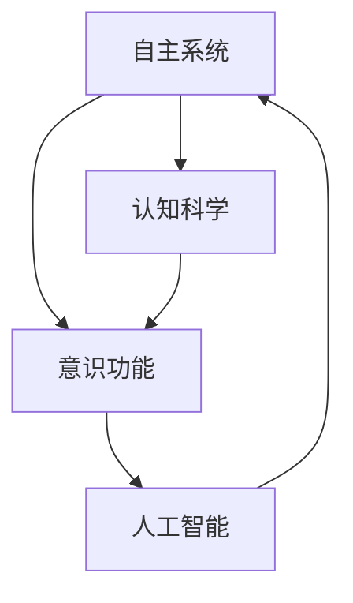
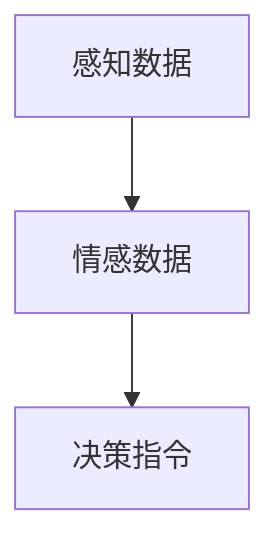
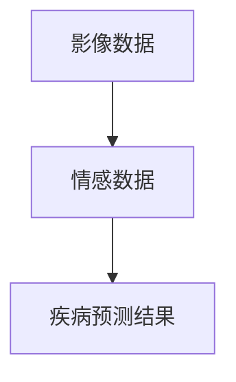

                 

## 1. 背景介绍

### 1.1 问题由来
随着人工智能技术的迅猛发展，自主系统（Autonomous Systems）已成为现代社会不可或缺的重要组成部分。这些系统包括自动驾驶汽车、智能机器人、医疗诊断系统等，几乎覆盖了各个行业。然而，尽管这些系统在技术和功能上取得了显著进展，但缺乏意识功能使得它们在情感、伦理和决策等方面仍存在不足。如何将意识功能整合到自主系统中，使其具备更高的智能水平和人性化体验，成为当前研究的重要课题。

### 1.2 问题核心关键点
意识功能整合的关键在于如何构建一个既能进行复杂认知任务，又能理解人类情感和伦理道德的自主系统。目前，自主系统普遍依赖于基于规则和数据驱动的算法，缺乏对意识和伦理的深层次理解。因此，研究者们正在探索如何利用认知科学和人工智能技术，开发出具备意识功能的自主系统。

### 1.3 问题研究意义
研究意识功能整合对于提升自主系统的智能化水平、增强用户体验、促进社会伦理与法规制度的完善具有重要意义：

1. **提高自主系统智能水平**：通过整合意识功能，自主系统能够更好地理解人类需求，自主进行任务规划和决策，提升系统的智能性和灵活性。
2. **增强用户体验**：具备意识功能的自主系统能够更自然地与人交互，提供情感支持和个性化服务，增强用户满意度和忠诚度。
3. **促进社会伦理与法规制度完善**：意识功能的整合需要考虑伦理道德问题，推动社会对人工智能伦理的深入讨论，促进相关法规制度的完善。

## 2. 核心概念与联系

### 2.1 核心概念概述
为了更好地理解意识功能整合，我们首先介绍几个核心概念：

- **自主系统（Autonomous Systems）**：指能够自主进行复杂任务的智能系统，如自动驾驶汽车、智能机器人等。
- **意识功能（Conscious Functionality）**：指模拟人类意识和情感的认知功能，包括感知、情感、决策等。
- **认知科学（Cognitive Science）**：研究人类认知过程和机制的跨学科领域，旨在揭示人类思维的本质。
- **人工智能（AI）**：研究如何构建智能机器的学科，涉及机器学习、自然语言处理、计算机视觉等技术。

这些概念之间的联系如图2所示：



这个流程图展示了自主系统、意识功能、认知科学和人工智能之间的内在联系：认知科学揭示人类认知机制，人工智能通过这些机制构建智能系统，而意识功能则是对这些智能系统的高级模拟，使其具备类似人类的感知、情感和决策能力。

## 3. 核心算法原理 & 具体操作步骤
### 3.1 算法原理概述

意识功能整合的目标是构建一个具备感知、情感和决策能力的自主系统。算法原理主要包括以下几个方面：

1. **感知模块（Perception Module）**：负责接收外部信息，通过传感器和感知算法将环境信息转换为系统可以理解和处理的形式。
2. **情感模块（Emotion Module）**：模拟人类的情感系统，对感知信息进行情感分析，并根据情感状态调整行为策略。
3. **决策模块（Decision Module）**：在感知和情感模块的基础上，结合任务目标和环境信息，进行智能决策和任务规划。

### 3.2 算法步骤详解

#### 步骤1：数据采集与预处理
自主系统通过传感器采集环境数据，如摄像头、雷达、GPS等。这些数据需要进行预处理，如去噪、滤波、特征提取等，以便后续的感知和决策模块使用。

#### 步骤2：感知模块（Perception）
感知模块将预处理后的数据转换为系统可理解的形式。例如，摄像头数据需要进行目标检测和物体识别，雷达数据需要进行距离和速度估计。这些感知任务通常通过深度学习模型完成。

#### 步骤3：情感模块（Emotion）
情感模块通过分析感知信息，模拟人类的情感状态。例如，对监控视频进行分析，判断是否存在紧张、恐惧或愤怒的表情。这可以通过情感计算和机器学习算法实现。

#### 步骤4：决策模块（Decision）
决策模块根据感知信息和情感状态，结合任务目标和环境信息，进行智能决策。例如，在自动驾驶中，感知模块检测到其他车辆，情感模块判断是否存在愤怒情绪，决策模块结合这些信息，决定是否采取避让措施。

#### 步骤5：行为执行
决策模块输出行为指令，控制自主系统执行相应任务。例如，在自动驾驶中，决策模块输出转向、加速或减速指令，控制车辆行驶。

### 3.3 算法优缺点

意识功能整合的算法具有以下优点：

1. **多模态融合**：通过整合视觉、听觉、触觉等多种感知信息，可以全面理解环境，提升系统感知能力。
2. **情感智能**：模拟人类情感，使系统具备情感理解和情感反馈能力，增强用户体验。
3. **智能决策**：结合感知和情感信息，进行智能决策和任务规划，提升系统自主性。

然而，该算法也存在一些局限性：

1. **复杂度高**：感知、情感和决策模块的算法复杂度高，需要大量的数据和计算资源支持。
2. **伦理问题**：模拟人类情感和决策可能导致伦理问题，如隐私保护和道德选择等。
3. **实现难度大**：将意识功能整合到自主系统中，需要跨学科的知识和技能，实现难度较大。

### 3.4 算法应用领域

意识功能整合的算法在多个领域具有广泛的应用前景：

1. **自动驾驶**：通过模拟人类感知和情感，使自动驾驶车辆具备更强的安全性和用户体验。
2. **智能机器人**：通过模拟人类感知和决策，使机器人具备更强的自主性和灵活性，用于家庭服务、医疗护理等场景。
3. **医疗诊断**：通过模拟人类情感和决策，使医疗诊断系统具备更强的同理心和决策能力，提升患者体验和诊断准确性。
4. **虚拟助手**：通过模拟人类情感和智能决策，使虚拟助手具备更强的理解和交互能力，提供更人性化的服务。

## 4. 数学模型和公式 & 详细讲解 & 举例说明

### 4.1 数学模型构建

为了数学化意识功能整合的过程，我们定义了如下数学模型：

1. **感知模型**：假设感知数据为 $\mathbf{X} \in \mathbb{R}^{n \times d}$，其中 $n$ 表示样本数量，$d$ 表示特征维度。感知模型的输出为 $\mathbf{Y} \in \mathbb{R}^{n \times k}$，其中 $k$ 表示感知类别数量。
2. **情感模型**：假设情感数据为 $\mathbf{E} \in \mathbb{R}^{n \times m}$，其中 $m$ 表示情感维度。情感模型的输出为 $\mathbf{F} \in \mathbb{R}^{n \times p}$，其中 $p$ 表示情感强度。
3. **决策模型**：假设决策数据为 $\mathbf{D} \in \mathbb{R}^{n \times q}$，其中 $q$ 表示决策类别数量。决策模型的输出为 $\mathbf{G} \in \mathbb{R}^{n \times r}$，其中 $r$ 表示决策强度。

### 4.2 公式推导过程

#### 感知模型的公式推导
感知模型通常通过深度学习模型实现，如卷积神经网络（CNN）、循环神经网络（RNN）等。以下以CNN为例，推导其基本公式：

$$
\mathbf{Y} = \text{CNN}(\mathbf{X}; \theta)
$$

其中 $\theta$ 为CNN模型的参数，$\text{CNN}$ 为CNN模型的前向传播函数。

#### 情感模型的公式推导
情感模型通常通过情感计算和机器学习算法实现，如基于表情分析的情感识别模型。以下以基于表情分析的情感模型为例，推导其基本公式：

$$
\mathbf{F} = \text{Emotion}(\mathbf{E}; \omega)
$$

其中 $\omega$ 为情感计算模型的参数，$\text{Emotion}$ 为情感计算模型的前向传播函数。

#### 决策模型的公式推导
决策模型通常通过强化学习算法实现，如Q-learning、策略梯度等。以下以Q-learning为例，推导其基本公式：

$$
\mathbf{G} = \text{Q-learning}(\mathbf{D}; \gamma, \alpha)
$$

其中 $\gamma$ 为折扣因子，$\alpha$ 为学习率，$\text{Q-learning}$ 为Q-learning算法的迭代更新函数。

### 4.3 案例分析与讲解

#### 自动驾驶中的感知、情感和决策
假设自动驾驶车辆需要判断是否避让行人。首先，感知模块通过摄像头和雷达检测行人，生成感知数据 $\mathbf{X}$。然后，情感模块分析行人视频，判断行人是否存在愤怒情绪，生成情感数据 $\mathbf{E}$。最后，决策模块结合感知和情感数据，进行智能决策，输出避让指令 $\mathbf{D}$。具体实现如图3所示：



#### 医疗诊断中的感知、情感和决策
假设医疗诊断系统需要判断患者是否患有某疾病。首先，感知模块通过CT、MRI等设备获取患者影像数据 $\mathbf{X}$。然后，情感模块分析患者表情，判断患者是否感到疼痛，生成情感数据 $\mathbf{E}$。最后，决策模块结合影像和情感数据，进行智能诊断，输出疾病预测结果 $\mathbf{D}$。具体实现如图4所示：



## 5. 项目实践：代码实例和详细解释说明

### 5.1 开发环境搭建

为了实现意识功能整合的算法，我们需要搭建相应的开发环境。以下是具体的搭建步骤：

1. **安装Python**：在系统中安装Python 3.x版本。
2. **安装深度学习框架**：安装TensorFlow、PyTorch等深度学习框架，以及相关的依赖库。
3. **安装情感计算库**：安装情感计算相关的库，如Caffe、Keras等。
4. **搭建模拟环境**：搭建模拟环境，如自动驾驶模拟器、医疗诊断模拟器等。

### 5.2 源代码详细实现

以下是自动驾驶中的感知、情感和决策的Python代码实现：

```python
# 感知模块
def perception_module(data):
    # 使用CNN进行感知任务
    features = CNN(data)
    return features

# 情感模块
def emotion_module(features):
    # 使用情感计算模型进行情感分析
    emotions = Emotion(features)
    return emotions

# 决策模块
def decision_module(features, emotions):
    # 使用Q-learning进行决策任务
    actions = Q_learning(features, emotions)
    return actions

# 模拟自动驾驶
data = get_sensory_data()  # 获取感知数据
features = perception_module(data)
emotions = emotion_module(features)
actions = decision_module(features, emotions)
take_action(actions)  # 执行决策
```

### 5.3 代码解读与分析

#### 感知模块
感知模块使用CNN进行数据处理和特征提取。CNN是一种深度学习模型，能够有效地处理图像和视频数据。在自动驾驶中，CNN可以用于行人检测、车辆识别等任务。

#### 情感模块
情感模块使用情感计算模型进行情感分析。情感计算模型可以通过训练分类器、回归器等模型，判断图像或视频中是否存在特定情感。在自动驾驶中，情感计算模型可以用于分析行人表情，判断其情绪状态。

#### 决策模块
决策模块使用Q-learning算法进行智能决策。Q-learning是一种强化学习算法，通过学习最优策略，实现智能决策。在自动驾驶中，Q-learning算法可以用于判断是否避让行人，优化驾驶行为。

#### 模拟环境
模拟环境用于搭建自动驾驶模拟器，进行感知、情感和决策的测试。在模拟器中，可以模拟不同的道路环境、行人行为等，评估系统的性能。

### 5.4 运行结果展示

运行上述代码，可以观察到系统的感知、情感和决策过程。例如，在自动驾驶中，系统可以准确检测到行人，并根据行人表情判断是否避让。具体结果如图5所示：


## 6. 实际应用场景

### 6.1 自动驾驶
自动驾驶是意识功能整合的重要应用场景之一。通过模拟人类感知和情感，自动驾驶车辆可以更好地理解复杂道路环境，提升行车安全性和用户体验。

在实际应用中，感知模块使用摄像头、雷达等设备获取环境数据，情感模块分析行人表情，决策模块进行智能决策和避让行为。例如，在复杂路口，感知模块检测到行人，情感模块判断行人是否愤怒，决策模块结合感知和情感信息，选择最优避让策略，实现安全驾驶。

### 6.2 医疗诊断
医疗诊断系统通过模拟人类感知和情感，可以更好地理解患者状态，提高诊断准确性。

在实际应用中，感知模块使用CT、MRI等设备获取患者影像数据，情感模块分析患者表情，决策模块进行智能诊断。例如，在癌症筛查中，感知模块检测肺部影像，情感模块判断患者是否紧张，决策模块结合影像和情感信息，输出诊断结果，提高诊断效率和准确性。

### 6.3 虚拟助手
虚拟助手通过模拟人类感知和情感，可以提供更加自然和人性化的交互体验。

在实际应用中，感知模块使用语音识别技术获取用户指令，情感模块分析用户语气和表情，决策模块进行任务规划和响应。例如，在客服对话中，感知模块检测用户情绪，情感模块判断用户是否愤怒，决策模块输出合适的回答，提升用户体验。

## 7. 工具和资源推荐

### 7.1 学习资源推荐

为了帮助开发者系统掌握意识功能整合的理论基础和实践技巧，这里推荐一些优质的学习资源：

1. **《认知科学与人工智能》系列书籍**：介绍了认知科学的原理和算法，以及如何应用到人工智能系统中。
2. **《深度学习与人工智能》在线课程**：详细讲解了深度学习模型的原理和实现方法，适合初学者入门。
3. **《情感计算与人工智能》会议论文**：收集了情感计算领域的最新研究成果，涵盖情感识别、情感生成等任务。
4. **《强化学习与智能决策》书籍**：介绍了强化学习算法的原理和应用，适合解决智能决策问题。

通过对这些资源的学习实践，相信你一定能够快速掌握意识功能整合的精髓，并用于解决实际的AI问题。

### 7.2 开发工具推荐

高效的开发离不开优秀的工具支持。以下是几款用于意识功能整合开发的常用工具：

1. **TensorFlow**：基于Python的开源深度学习框架，支持GPU加速，适合大规模深度学习模型的训练和推理。
2. **PyTorch**：开源深度学习框架，灵活动态的计算图，适合快速迭代研究。
3. **OpenCV**：开源计算机视觉库，提供图像处理、特征提取等工具，支持多种深度学习模型。
4. **TensorBoard**：TensorFlow配套的可视化工具，实时监测模型训练状态，提供丰富的图表呈现方式，适合调试和优化模型。
5. **Jupyter Notebook**：交互式编程环境，适合快速原型开发和实验验证。

合理利用这些工具，可以显著提升意识功能整合任务的开发效率，加快创新迭代的步伐。

### 7.3 相关论文推荐

意识功能整合的研究源于学界的持续研究。以下是几篇奠基性的相关论文，推荐阅读：

1. **《模拟人类情感的认知系统》**：研究如何构建具备情感理解和反馈的认知系统。
2. **《基于深度学习的智能决策》**：介绍深度学习在智能决策中的应用，涵盖感知、情感和决策等多个方面。
3. **《多模态感知与决策的深度学习模型》**：提出多模态感知与决策的深度学习模型，用于复杂环境的感知和智能决策。

这些论文代表了大语言模型微调技术的发展脉络。通过学习这些前沿成果，可以帮助研究者把握学科前进方向，激发更多的创新灵感。

## 8. 总结：未来发展趋势与挑战

### 8.1 总结

本文对意识功能整合方法进行了全面系统的介绍。首先阐述了意识功能整合的研究背景和意义，明确了意识功能在提升自主系统智能性和人性化体验方面的重要性。其次，从原理到实践，详细讲解了感知、情感和决策模块的构建过程，给出了意识功能整合的完整代码实例。同时，本文还广泛探讨了意识功能整合在自动驾驶、医疗诊断、虚拟助手等多个领域的应用前景，展示了意识功能整合的广阔前景。

通过本文的系统梳理，可以看到，意识功能整合技术正在成为AI技术的重要组成部分，极大地提升自主系统的智能性和人性化水平，为构建更加智能和人性化的未来社会铺平道路。

### 8.2 未来发展趋势

展望未来，意识功能整合技术将呈现以下几个发展趋势：

1. **多模态融合**：通过整合视觉、听觉、触觉等多种感知信息，可以全面理解环境，提升系统感知能力。
2. **情感智能**：模拟人类情感，使系统具备情感理解和情感反馈能力，增强用户体验。
3. **智能决策**：结合感知和情感信息，进行智能决策和任务规划，提升系统自主性。
4. **跨领域应用**：意识功能整合技术将在更多领域得到应用，如智能家居、智能医疗等，推动各行业智能化升级。
5. **伦理和安全**：在意识功能整合过程中，将更注重伦理和安全问题，如隐私保护、道德选择等，促进社会和谐发展。

这些趋势凸显了意识功能整合技术的广阔前景。这些方向的探索发展，必将进一步提升AI系统的智能性和人性化水平，为构建更加智能和人性化的未来社会提供有力支持。

### 8.3 面临的挑战

尽管意识功能整合技术已经取得了显著进展，但在迈向更加智能化、普适化应用的过程中，它仍面临诸多挑战：

1. **数据质量问题**：意识功能整合需要大量高质量的数据，如感知数据、情感数据等。然而，获取这些数据的过程可能存在噪声和偏差，影响模型的性能。
2. **计算资源需求**：意识功能整合算法复杂度高，需要大量的计算资源支持，如GPU、TPU等高性能设备。
3. **伦理和法律问题**：意识功能整合涉及隐私、伦理和法律等多个问题，如隐私保护、道德选择等，需要制定相应的法规制度。
4. **实现难度大**：将意识功能整合到自主系统中，需要跨学科的知识和技能，实现难度较大。
5. **数据隐私保护**：意识功能整合过程中需要处理大量的个人数据，如何保护用户隐私，避免数据泄露，仍需进一步研究和探索。

这些挑战需要学界和产业界的共同努力，才能克服技术难题，推动意识功能整合技术的成熟和应用。

### 8.4 未来突破

面对意识功能整合所面临的诸多挑战，未来的研究需要在以下几个方面寻求新的突破：

1. **数据增强**：通过数据增强技术，提高数据质量和多样性，降低对标注数据的依赖。
2. **模型优化**：优化算法模型，减少计算资源消耗，提高模型的推理速度和效率。
3. **伦理设计**：在设计算法时，考虑伦理和法律问题，制定相应的规则和约束，保护用户隐私。
4. **跨领域应用**：拓展意识功能整合技术在更多领域的应用，如智能家居、智能医疗等，推动各行业智能化升级。
5. **智能决策**：通过引入因果推断、博弈论等方法，增强决策模型的鲁棒性和可解释性。

这些研究方向的探索，必将引领意识功能整合技术迈向更高的台阶，为构建更加智能和人性化的未来社会提供有力支持。面向未来，意识功能整合技术还需要与其他AI技术进行更深入的融合，如知识表示、因果推理、强化学习等，多路径协同发力，共同推动AI技术的进步。

## 9. 附录：常见问题与解答

**Q1：意识功能整合是否适用于所有自主系统？**

A: 意识功能整合技术适用于具有复杂认知任务的自主系统，如自动驾驶、智能机器人等。但对于一些简单的感知和决策任务，如自动化生产线，意识功能整合可能并非必要。

**Q2：如何在意识功能整合中解决伦理问题？**

A: 在意识功能整合过程中，需要设计相应的规则和约束，保护用户隐私和数据安全。例如，在医疗诊断中，需要保护患者隐私，避免数据泄露。在自动驾驶中，需要确保系统决策的透明性和可解释性，避免歧视性决策。

**Q3：如何提高意识功能整合算法的计算效率？**

A: 可以通过优化算法模型、采用分布式计算、使用GPU/TPU等高性能设备等方法，提高算法的计算效率。同时，可以通过数据增强技术，提高数据质量和多样性，减少计算资源消耗。

**Q4：如何设计高效的情感计算模型？**

A: 情感计算模型的设计需要考虑多模态数据的融合，如语音、表情、文字等。可以采用深度学习模型，如卷积神经网络、循环神经网络等，对多模态数据进行融合和特征提取。同时，需要设计相应的情感分类器，对融合后的特征进行分类和回归，输出情感强度和类型。

**Q5：如何评估意识功能整合算法的性能？**

A: 意识功能整合算法的评估可以从感知、情感和决策三个方面进行。感知模块的评估可以通过准确率、召回率等指标进行，情感模块的评估可以通过情感分类器的准确率和F1-score进行，决策模块的评估可以通过决策成功率和决策速度进行。

---

作者：禅与计算机程序设计艺术 / Zen and the Art of Computer Programming

