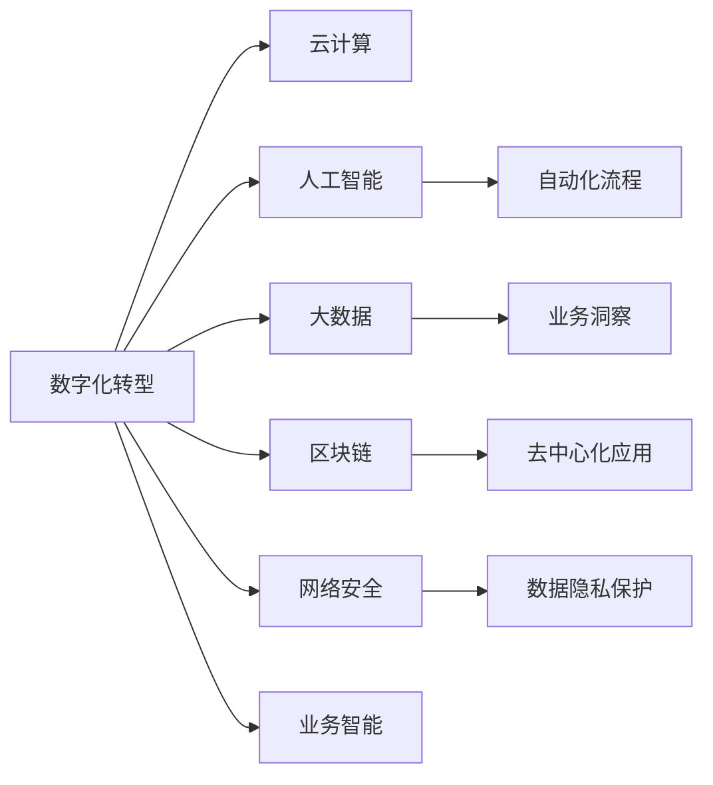

                 

# 自动化创业中的数字化转型策略

> 关键词：数字化转型, 自动化创业, 云计算, 人工智能, 大数据, 区块链, 网络安全

## 1. 背景介绍

随着数字经济的迅猛发展，自动化创业成为了新一轮产业革命的重要驱动力。自动化技术通过提高生产效率、降低运营成本、提升用户体验，为企业和创业者提供了巨大的商业机会。但与此同时，如何利用数字化技术实现自动化创业的成功转型，成为了所有企业和创业者共同面临的挑战。本文将详细阐述自动化创业中的数字化转型策略，为您的创业之路提供有益的参考。

## 2. 核心概念与联系

### 2.1 核心概念概述

为深入理解自动化创业中的数字化转型策略，我们首先需要明确几个核心概念：

- **数字化转型**：指企业利用数字技术，如云计算、大数据、人工智能等，重塑业务模式，提升运营效率，创造新的价值的过程。

- **自动化创业**：指利用自动化技术，如机器人流程自动化(RPA)、人工智能(AI)、区块链等，实现业务流程的自动化，降低人力成本，提升业务效率的创业活动。

- **云计算**：指通过互联网提供计算资源和存储资源的服务模式，支持企业按需扩展，降低基础设施成本。

- **人工智能**：指通过机器学习、深度学习等技术，使机器具备自主学习、推理、决策的能力，帮助企业自动化复杂任务。

- **大数据**：指通过数据挖掘和分析，发现潜在的商业价值，指导决策，提升业务洞察力。

- **区块链**：指分布式账本技术，通过去中心化、不可篡改等特性，保障数据的透明和安全。

这些核心概念之间的联系可以通过以下Mermaid流程图来展示：



该流程图展示了数字化转型的主要技术手段和目标，包括云计算、人工智能、大数据、区块链等，以及如何通过这些技术手段实现自动化创业和提升业务智能。

### 2.2 核心概念原理和架构

#### 云计算

云计算提供了弹性的计算和存储资源，支持企业根据需求动态扩展。其架构通常包括云基础设施层、云平台层、云应用层。

##### 云基础设施层
- **计算资源**：CPU、GPU、FPGA等计算硬件。
- **存储资源**：S3、HDFS等分布式存储系统。
- **网络资源**：公有云、私有云、混合云等网络环境。

##### 云平台层
- **容器化技术**：Docker、Kubernetes等容器化技术，支持容器编排和管理。
- **弹性计算**：Auto Scaling等弹性计算服务，根据负载自动扩展资源。

##### 云应用层
- **PaaS服务**：如AWS Lambda、Azure Functions等，支持应用快速部署和扩展。
- **SaaS服务**：如Salesforce、Slack等，提供即用型的云应用。

#### 人工智能

人工智能通过机器学习、深度学习等技术，使机器具备自主学习和决策能力。其架构通常包括数据层、模型层、应用层。

##### 数据层
- **数据收集**：ETL技术，从不同数据源收集数据。
- **数据存储**：Hadoop、Spark等大数据平台，支持海量数据存储和管理。

##### 模型层
- **特征工程**：数据预处理、特征提取等技术，准备训练数据。
- **模型训练**：TensorFlow、PyTorch等深度学习框架，训练机器学习模型。

##### 应用层
- **预测分析**：通过模型预测未来趋势，支持决策。
- **推荐系统**：如电商推荐、内容推荐等，提升用户体验。

#### 大数据

大数据通过数据挖掘和分析，发现潜在的商业价值，指导决策。其架构通常包括数据层、分析层、应用层。

##### 数据层
- **数据收集**：从各种来源收集数据，如传感器、社交媒体、交易记录等。
- **数据存储**：Hadoop、Spark等大数据平台，支持海量数据存储和管理。

##### 分析层
- **数据清洗**：数据预处理、缺失值处理等技术，保证数据质量。
- **数据挖掘**：MapReduce、Spark等分布式计算框架，进行数据挖掘分析。

##### 应用层
- **业务洞察**：通过数据挖掘和分析，发现商业价值，指导决策。
- **用户画像**：如客户细分、个性化推荐等，提升用户体验。

#### 区块链

区块链通过去中心化、不可篡改等特性，保障数据的透明和安全。其架构通常包括数据层、共识层、应用层。

##### 数据层
- **交易记录**：区块链上存储的交易记录，支持去中心化存储。
- **智能合约**：支持自动化执行的交易逻辑。

##### 共识层
- **分布式账本**：区块链的核心技术，保证数据的透明和不可篡改。
- **共识算法**：如PoW、PoS等，保证网络安全性。

##### 应用层
- **去中心化应用**：如DeFi、NFT等，支持去中心化金融、数字资产等领域。
- **供应链管理**：如溯源、防伪等，提升供应链透明度和安全性。

## 3. 核心算法原理 & 具体操作步骤

### 3.1 算法原理概述

自动化创业中的数字化转型，涉及云计算、人工智能、大数据、区块链等多项技术的集成应用。其核心算法原理主要包括以下几个方面：

- **云计算**：通过弹性计算和容器化技术，支持业务的动态扩展和弹性管理。
- **人工智能**：通过机器学习和深度学习，实现自动化流程和智能决策。
- **大数据**：通过数据挖掘和分析，支持业务洞察和决策支持。
- **区块链**：通过去中心化、不可篡改特性，保障数据的透明和安全。

### 3.2 算法步骤详解

#### 1. 需求分析和设计

首先，需要对自动化创业的目标和需求进行详细分析和设计。明确业务流程、数据来源、技术需求等关键要素。

##### 1.1 业务流程分析
- **流程描述**：详细描述业务流程中的各个环节和关键步骤。
- **瓶颈识别**：识别出业务流程中的瓶颈和改进点。

##### 1.2 数据来源分析
- **数据类型**：明确业务流程所需的数据类型，如结构化数据、非结构化数据等。
- **数据来源**：确定数据来源，如内部系统、外部接口等。

##### 1.3 技术需求分析
- **技术栈选择**：选择合适的技术栈，如云计算平台、数据处理框架、开发语言等。
- **系统架构设计**：设计系统架构，包括各模块的功能和交互关系。

#### 2. 数据采集和清洗

数据采集和清洗是数字化转型的基础，确保数据的准确性和完整性。

##### 2.1 数据采集
- **数据源收集**：从各种来源收集数据，如传感器、社交媒体、交易记录等。
- **数据同步**：确保数据及时同步到集中存储平台。

##### 2.2 数据清洗
- **数据预处理**：进行数据格式转换、缺失值处理等操作。
- **数据校验**：检查数据一致性和准确性，发现并修正错误。

#### 3. 数据存储和分析

数据存储和分析是数字化转型的核心，支持数据的集中管理和深度挖掘。

##### 3.1 数据存储
- **数据集中存储**：将数据集中存储到云平台，如AWS S3、Azure Blob等。
- **数据备份和恢复**：实现数据的备份和快速恢复，保障数据安全。

##### 3.2 数据分析
- **数据挖掘**：使用MapReduce、Spark等分布式计算框架，进行数据挖掘分析。
- **机器学习模型训练**：使用TensorFlow、PyTorch等深度学习框架，训练机器学习模型。

#### 4. 自动化流程和决策支持

自动化流程和决策支持是数字化转型的关键，通过自动化流程和智能决策提升业务效率。

##### 4.1 自动化流程
- **流程自动化**：使用RPA、Python脚本等工具，实现流程自动化。
- **任务调度**：使用Kubernetes等容器化技术，实现任务调度和管理。

##### 4.2 智能决策
- **预测分析**：使用机器学习模型，预测未来趋势，支持决策。
- **推荐系统**：如电商推荐、内容推荐等，提升用户体验。

#### 5. 去中心化应用和网络安全

去中心化应用和网络安全是数字化转型的保障，确保数据的透明和安全。

##### 5.1 去中心化应用
- **去中心化存储**：使用区块链技术，实现去中心化存储。
- **智能合约**：使用区块链智能合约，实现自动化执行。

##### 5.2 网络安全
- **加密技术**：使用AES、RSA等加密技术，保障数据安全。
- **网络隔离**：使用防火墙、VPN等技术，实现网络隔离。

### 3.3 算法优缺点

#### 优点

1. **弹性扩展**：通过云计算，支持业务动态扩展和弹性管理，提升系统性能。
2. **智能决策**：通过人工智能，实现自动化流程和智能决策，提升业务效率。
3. **数据安全**：通过区块链，实现数据透明和安全，保障数据隐私。
4. **业务洞察**：通过大数据，支持业务洞察和决策支持，提升决策质量。

#### 缺点

1. **技术复杂度**：涉及多技术集成应用，技术复杂度较高。
2. **成本较高**：初始投入和运维成本较高，需要企业具备较强的资金和技术实力。
3. **数据隐私**：数据存储在云端，存在隐私泄露的风险。
4. **技术门槛**：需要企业具备较强的技术能力和人才培养体系。

### 3.4 算法应用领域

#### 1. 电商行业

在电商行业中，自动化创业通过云计算、人工智能、大数据等技术，实现库存管理、推荐系统、客户服务自动化等功能，提升用户体验和运营效率。

##### 库存管理
- **需求预测**：使用机器学习模型，预测销售需求，优化库存管理。
- **智能补货**：根据需求预测结果，智能调整补货策略，降低库存成本。

##### 推荐系统
- **商品推荐**：使用协同过滤、内容推荐等算法，推荐相关商品，提升用户购买率。
- **个性化推荐**：根据用户行为数据，进行个性化推荐，提升用户满意度。

##### 客户服务
- **自动客服**：使用RPA技术，实现自动客服，快速响应用户咨询。
- **智能工单**：使用自然语言处理技术，实现智能工单处理，提升服务效率。

#### 2. 金融行业

在金融行业中，自动化创业通过区块链、人工智能、大数据等技术，实现去中心化金融、风险管理、智能投顾等功能，提升金融安全性和效率。

##### 去中心化金融
- **去中心化交易**：使用区块链技术，实现去中心化交易，降低交易成本。
- **智能合约**：使用智能合约，实现自动化执行，提升交易效率。

##### 风险管理
- **信用评分**：使用机器学习模型，分析用户信用数据，进行信用评分。
- **欺诈检测**：使用深度学习模型，检测异常交易，降低欺诈风险。

##### 智能投顾
- **投资组合管理**：使用机器学习模型，进行投资组合优化，提升投资收益。
- **市场分析**：使用大数据分析，进行市场预测和风险评估，支持投资决策。

#### 3. 医疗行业

在医疗行业中，自动化创业通过人工智能、大数据、区块链等技术，实现患者管理、医疗影像分析、电子病历等功能，提升医疗服务效率和质量。

##### 患者管理
- **电子病历**：使用电子病历系统，实现患者信息集中管理和查询。
- **智能诊疗**：使用自然语言处理技术，实现智能诊疗，提升诊疗效率。

##### 医疗影像分析
- **医学影像识别**：使用深度学习模型，进行医学影像分析，辅助医生诊断。
- **病理分析**：使用机器学习模型，进行病理分析，提升诊断准确性。

##### 电子病历
- **病历查询**：使用区块链技术，实现电子病历的去中心化存储，保障数据安全。
- **数据共享**：实现跨医院的数据共享，提升医疗服务质量。

## 4. 数学模型和公式 & 详细讲解 & 举例说明

### 4.1 数学模型构建

假设自动化创业中的某个任务为$a$，其中包含数据采集$D$、数据存储$S$、数据分析$A$、自动化流程$F$、决策支持$D$、去中心化应用$B$和网络安全$N$等多个子任务。我们定义任务目标函数为$G(a)$，包括各个子任务的目标函数，如$G(D)$、$G(S)$、$G(A)$、$G(F)$、$G(D)$、$G(B)$、$G(N)$等。

$$
G(a) = \alpha G(D) + \beta G(S) + \gamma G(A) + \delta G(F) + \epsilon G(D) + \zeta G(B) + \eta G(N)
$$

其中，$\alpha$、$\beta$、$\gamma$、$\delta$、$\epsilon$、$\zeta$、$\eta$为各子任务的权重系数。

### 4.2 公式推导过程

以电商行业中的推荐系统为例，进行详细推导。

#### 推荐系统公式推导

假设推荐系统中有$m$个用户，$n$个商品，$u$为用户的评分矩阵，$i$为商品的评分矩阵，$P$为推荐结果的预测矩阵。

假设用户$i$对商品$j$的评分概率为$P(i,j)$，可以使用矩阵分解模型进行预测，公式如下：

$$
P(i,j) = \hat{u}_i W V_j
$$

其中，$\hat{u}_i$为用户$i$的隐向量，$W$为权重矩阵，$V_j$为商品$j$的隐向量。

根据最大似然估计，我们可以得到$\hat{u}_i$和$V_j$的优化目标函数为：

$$
\min_{\hat{u}_i, V_j} \sum_{i,j} L(u_{ij}, \hat{u}_i W V_j)
$$

其中，$L$为损失函数，通常使用均方误差损失。

### 4.3 案例分析与讲解

以智能客服为例，进行详细分析。

#### 智能客服系统

智能客服系统通过自然语言处理技术，实现自动解答用户咨询，提升服务效率。系统包含多个组件，如语音识别、自然语言理解、对话管理、情感分析等。

##### 语音识别
- **模型选择**：选择适合的语音识别模型，如HMM、DNN、CNN等。
- **训练数据**：收集大量语音数据，进行模型训练。

##### 自然语言理解
- **分词和词性标注**：使用NLTK、StanfordNLP等工具，进行分词和词性标注。
- **命名实体识别**：使用深度学习模型，进行命名实体识别。

##### 对话管理
- **意图识别**：使用分类模型，识别用户意图。
- **对话生成**：使用序列生成模型，生成对话内容。

##### 情感分析
- **情感分类**：使用情感分类模型，判断用户情感。
- **情感反馈**：根据用户情感，进行情感反馈，优化对话策略。

## 5. 项目实践：代码实例和详细解释说明

### 5.1 开发环境搭建

#### 5.1.1 云平台选择

选择适合云平台，如AWS、Azure、Google Cloud等。以AWS为例，创建云账户并进行资源部署。

##### 步骤1：创建云账户
- 访问AWS官方网站，创建云账户，并进行身份验证。

##### 步骤2：部署云资源
- 在AWS控制台中，选择VPC、EC2、S3等云资源进行部署。

#### 5.1.2 环境配置

配置开发环境，安装所需软件和工具。

##### 步骤1：安装Python
- 在云实例中，安装Python 3.x版本，并设置路径。

##### 步骤2：安装相关库
- 安装Pandas、NumPy、TensorFlow等库。

### 5.2 源代码详细实现

#### 5.2.1 数据采集

使用Python脚本，从各种来源收集数据。

```python
import requests
import json

# 从API获取数据
response = requests.get('https://api.example.com/data')
data = json.loads(response.text)

# 数据清洗
data = clean_data(data)
```

#### 5.2.2 数据存储

使用云存储服务，存储和备份数据。

```python
import boto3

# 连接S3存储
s3 = boto3.client('s3')
s3.put_object(Bucket='my-bucket', Key='data.csv', Body=data)

# 数据备份
s3.copy_object(Bucket='my-backup-bucket', CopySource={'Bucket': 'my-bucket', 'Key': 'data.csv'})
```

#### 5.2.3 数据分析

使用Python脚本，进行数据挖掘和分析。

```python
import pandas as pd
import numpy as np

# 数据加载
df = pd.read_csv('data.csv')

# 数据挖掘
mean = df['value'].mean()
median = df['value'].median()

# 数据可视化
import matplotlib.pyplot as plt
plt.plot(df['time'], df['value'])
plt.show()
```

### 5.3 代码解读与分析

#### 5.3.1 数据采集

使用Python脚本，从API获取数据，并进行数据清洗。

##### 数据采集
- **API获取数据**：使用requests库，从API获取数据。
- **数据清洗**：使用Pandas库，对数据进行清洗和预处理。

##### 代码实现
- **代码1**：获取数据
- **代码2**：数据清洗

#### 5.3.2 数据存储

使用云存储服务，存储和备份数据。

##### 数据存储
- **S3存储**：使用Boto3库，连接AWS S3存储。
- **数据备份**：使用S3复制功能，实现数据备份。

##### 代码实现
- **代码1**：数据存储
- **代码2**：数据备份

#### 5.3.3 数据分析

使用Python脚本，进行数据挖掘和分析。

##### 数据分析
- **数据加载**：使用Pandas库，加载数据集。
- **数据挖掘**：使用Numpy库，进行数据统计。
- **数据可视化**：使用Matplotlib库，绘制数据图表。

##### 代码实现
- **代码1**：数据加载
- **代码2**：数据挖掘
- **代码3**：数据可视化

### 5.4 运行结果展示

#### 5.4.1 数据采集

使用Python脚本，从API获取数据，并进行数据清洗。

```python
import requests
import json

# 从API获取数据
response = requests.get('https://api.example.com/data')
data = json.loads(response.text)

# 数据清洗
data = clean_data(data)
```

#### 5.4.2 数据存储

使用云存储服务，存储和备份数据。

```python
import boto3

# 连接S3存储
s3 = boto3.client('s3')
s3.put_object(Bucket='my-bucket', Key='data.csv', Body=data)

# 数据备份
s3.copy_object(Bucket='my-backup-bucket', CopySource={'Bucket': 'my-bucket', 'Key': 'data.csv'})
```

#### 5.4.3 数据分析

使用Python脚本，进行数据挖掘和分析。

```python
import pandas as pd
import numpy as np

# 数据加载
df = pd.read_csv('data.csv')

# 数据挖掘
mean = df['value'].mean()
median = df['value'].median()

# 数据可视化
import matplotlib.pyplot as plt
plt.plot(df['time'], df['value'])
plt.show()
```

## 6. 实际应用场景

### 6.1 电商行业

在电商行业中，自动化创业通过云计算、人工智能、大数据等技术，实现库存管理、推荐系统、客户服务自动化等功能，提升用户体验和运营效率。

#### 1. 库存管理

- **需求预测**：使用机器学习模型，预测销售需求，优化库存管理。
- **智能补货**：根据需求预测结果，智能调整补货策略，降低库存成本。

#### 2. 推荐系统

- **商品推荐**：使用协同过滤、内容推荐等算法，推荐相关商品，提升用户购买率。
- **个性化推荐**：根据用户行为数据，进行个性化推荐，提升用户满意度。

#### 3. 客户服务

- **自动客服**：使用RPA技术，实现自动客服，快速响应用户咨询。
- **智能工单**：使用自然语言处理技术，实现智能工单处理，提升服务效率。

### 6.2 金融行业

在金融行业中，自动化创业通过区块链、人工智能、大数据等技术，实现去中心化金融、风险管理、智能投顾等功能，提升金融安全性和效率。

#### 1. 去中心化金融

- **去中心化交易**：使用区块链技术，实现去中心化交易，降低交易成本。
- **智能合约**：使用智能合约，实现自动化执行，提升交易效率。

#### 2. 风险管理

- **信用评分**：使用机器学习模型，分析用户信用数据，进行信用评分。
- **欺诈检测**：使用深度学习模型，检测异常交易，降低欺诈风险。

#### 3. 智能投顾

- **投资组合管理**：使用机器学习模型，进行投资组合优化，提升投资收益。
- **市场分析**：使用大数据分析，进行市场预测和风险评估，支持投资决策。

### 6.3 医疗行业

在医疗行业中，自动化创业通过人工智能、大数据、区块链等技术，实现患者管理、医疗影像分析、电子病历等功能，提升医疗服务效率和质量。

#### 1. 患者管理

- **电子病历**：使用电子病历系统，实现患者信息集中管理和查询。
- **智能诊疗**：使用自然语言处理技术，实现智能诊疗，提升诊疗效率。

#### 2. 医疗影像分析

- **医学影像识别**：使用深度学习模型，进行医学影像分析，辅助医生诊断。
- **病理分析**：使用机器学习模型，进行病理分析，提升诊断准确性。

#### 3. 电子病历

- **病历查询**：使用区块链技术，实现电子病历的去中心化存储，保障数据安全。
- **数据共享**：实现跨医院的数据共享，提升医疗服务质量。

## 7. 工具和资源推荐

### 7.1 学习资源推荐

为了帮助开发者系统掌握自动化创业中的数字化转型策略，这里推荐一些优质的学习资源：

1. 《云计算基础》课程：由国内知名云服务提供商提供的免费课程，系统介绍云计算技术及其应用。
2. 《机器学习实战》书籍：介绍机器学习和深度学习的实战案例，适合初学者入门。
3. 《大数据技术与应用》课程：由知名大学提供的免费课程，深入讲解大数据技术及其应用。
4. 《区块链技术与应用》书籍：介绍区块链技术的原理、应用和开发，适合区块链爱好者学习。
5. 《网络安全基础》课程：由网络安全专家提供的免费课程，讲解网络安全的基本原理和实践方法。

通过这些资源的学习实践，相信你一定能够快速掌握自动化创业中的数字化转型策略，并用于解决实际的业务问题。

### 7.2 开发工具推荐

高效的开发离不开优秀的工具支持。以下是几款用于自动化创业中数字化转型的常用工具：

1. AWS CloudFormation：基于模板的云资源部署工具，支持自动化和弹性管理。
2. Apache Kafka：高性能的消息队列系统，支持数据实时处理和分布式计算。
3. Kubernetes：容器编排系统，支持容器化应用和服务化部署。
4. TensorFlow：深度学习框架，支持模型训练和预测分析。
5. Tableau：数据可视化工具，支持数据探索和商业智能。

合理利用这些工具，可以显著提升自动化创业中数字化转型的开发效率，加快创新迭代的步伐。

### 7.3 相关论文推荐

自动化创业中的数字化转型技术涉及云计算、人工智能、大数据、区块链等多个领域，以下几篇前沿论文，值得深入阅读：

1. "Deep Learning for Inventory Management"：介绍如何使用深度学习模型进行库存需求预测和智能补货。
2. "Blockchain-Based Supply Chain Management"：探讨如何使用区块链技术实现供应链的去中心化管理和数据溯源。
3. "Machine Learning for Risk Management in Finance"：介绍如何使用机器学习模型进行金融风险管理。
4. "AI for Personalized Recommendation Systems"：介绍如何使用人工智能技术进行个性化推荐系统。
5. "Blockchain and Smart Contracts for E-commerce"：探讨如何使用区块链和智能合约技术实现去中心化交易和智能合约。

这些论文代表了大数据、人工智能、区块链等技术的最新进展，通过学习这些前沿成果，可以帮助研究者把握学科前进方向，激发更多的创新灵感。

## 8. 总结：未来发展趋势与挑战

### 8.1 研究成果总结

自动化创业中的数字化转型策略，通过云计算、人工智能、大数据、区块链等多项技术的集成应用，提升了自动化创业的效率和质量。通过需求分析和设计、数据采集和清洗、数据存储和分析、自动化流程和决策支持、去中心化应用和网络安全等多个步骤，实现了自动化创业的数字化转型。

### 8.2 未来发展趋势

展望未来，自动化创业中的数字化转型将呈现以下几个发展趋势：

1. **技术融合**：云计算、人工智能、大数据、区块链等技术将深度融合，形成一体化的数字化平台。
2. **边缘计算**：物联网和5G技术的普及，推动边缘计算的应用，提升数据处理效率。
3. **自动化平台**：通过统一的自动化平台，实现多应用场景的自动化管理。
4. **去中心化**：区块链技术将进一步普及，推动去中心化的数据管理和交易。
5. **人工智能嵌入**：人工智能技术将深度嵌入各个环节，提升自动化创业的智能化水平。

### 8.3 面临的挑战

尽管自动化创业中的数字化转型取得了不少进展，但依然面临诸多挑战：

1. **技术复杂度**：涉及多技术集成应用，技术复杂度较高。
2. **数据隐私**：数据存储在云端，存在隐私泄露的风险。
3. **成本较高**：初始投入和运维成本较高，需要企业具备较强的资金和技术实力。
4. **技术门槛**：需要企业具备较强的技术能力和人才培养体系。

### 8.4 研究展望

未来的研究需要在以下几个方面寻求新的突破：

1. **技术自动化**：进一步提高技术自动化程度，减少人工干预和操作。
2. **数据共享**：实现跨系统、跨机构的数据共享和协同，提升数据利用效率。
3. **平台化**：建设统一的自动化平台，实现多应用场景的自动化管理。
4. **模型优化**：优化机器学习模型，提升预测精度和效率。
5. **安全防护**：提升系统安全防护能力，保障数据和模型安全。

## 9. 附录：常见问题与解答

**Q1：什么是自动化创业？**

A: 自动化创业是指利用自动化技术，如机器人流程自动化(RPA)、人工智能(AI)、区块链等，实现业务流程的自动化，降低人力成本，提升业务效率的创业活动。

**Q2：自动化创业中需要哪些技术？**

A: 自动化创业中需要涉及云计算、人工智能、大数据、区块链等多项技术。云计算提供弹性计算和容器化管理；人工智能支持自动化流程和智能决策；大数据支持业务洞察和决策支持；区块链保障数据透明和安全。

**Q3：自动化创业中的数据隐私如何保障？**

A: 自动化创业中的数据隐私保障需要综合采用多种技术手段。如数据加密、网络隔离、访问控制等，同时也要严格遵守相关法律法规，确保数据使用合规。

**Q4：自动化创业中的技术复杂度如何应对？**

A: 自动化创业中的技术复杂度可以通过技术自动化、平台化、模型优化等方式进行应对。技术自动化减少人工干预，平台化实现多应用场景的统一管理，模型优化提升模型预测精度和效率。

**Q5：自动化创业中的成本较高如何应对？**

A: 自动化创业中的成本较高可以通过云计算的按需扩展和成本控制机制进行应对。云计算的按需扩展支持资源的动态调整，成本控制机制可以合理控制资源的消耗和成本。

---

作者：禅与计算机程序设计艺术 / Zen and the Art of Computer Programming

