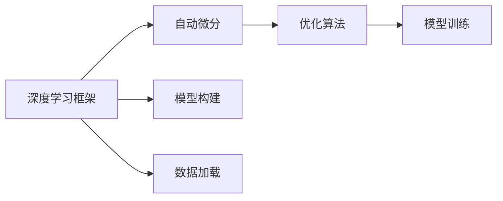

                 

## 1. 背景介绍

### 1.1 问题由来

在深度学习中，自动微分（Automatic Differentiation）是一项核心技术。它使得我们能够高效地计算模型的导数，进而进行参数优化、梯度下降等操作。但传统的手工求导方法费时费力，容易出错，而自动微分则提供了一种更为高效、精确的求解导数的方法。

近年来，自动微分技术在深度学习中得到了广泛的应用，并催生出了诸多深度学习框架，如PyTorch、JAX等。这些框架为深度学习研究者提供了强大的自动微分支持，简化了深度学习模型的构建与优化过程，促进了深度学习技术的快速发展。

### 1.2 问题核心关键点

自动微分技术的核心在于其能够自动计算复杂函数的高阶导数，而无需手动编写求导公式。通常，自动微分技术包括正向模式（Forward Mode）和反向模式（Backward Mode）两种。其中，反向模式是目前最为常用的自动微分方式，因为它能够在运行时自动计算导数，而无需修改原始函数。

反向模式的自动微分技术，包括常用的梯度下降、Adam、RMSprop等优化算法。这些优化算法通过计算导数，能够自动调整模型参数，以最小化损失函数。

在实际应用中，自动微分技术已经被广泛应用于深度学习模型的训练、优化、梯度估计等环节。通过自动微分，我们能够快速训练出高质量的深度学习模型，并对其参数进行微调，以适应特定任务。

### 1.3 问题研究意义

自动微分技术的出现，极大地推动了深度学习模型的训练与优化过程。它不仅简化了深度学习模型的构建与优化，也使得深度学习技术在实际应用中更加高效、精确。通过自动微分，我们可以轻松地进行复杂函数的求导，构建高效、精确的深度学习模型，并在实际应用中取得更好的效果。

## 2. 核心概念与联系

### 2.1 核心概念概述

在介绍自动微分技术之前，我们首先需要了解几个核心概念：

- **深度学习框架**：深度学习框架是深度学习模型的基础，提供了高效的模型构建、优化、训练等支持。常用的深度学习框架包括PyTorch、TensorFlow、Keras等。
- **自动微分**：自动微分技术是深度学习框架的核心功能之一，它能够在运行时自动计算函数的导数，而无需手动编写求导公式。自动微分技术包括正向模式和反向模式两种。
- **优化算法**：优化算法是深度学习模型训练的关键，包括梯度下降、Adam、RMSprop等。优化算法通过计算导数，自动调整模型参数，以最小化损失函数。

这些核心概念之间的逻辑关系可以通过以下Mermaid流程图来展示：



这个流程图展示出深度学习框架、自动微分和优化算法之间的关系：

1. 深度学习框架提供了模型构建、优化、训练等核心功能。
2. 自动微分技术是深度学习框架的核心功能之一，能够自动计算复杂函数的导数。
3. 优化算法通过自动微分技术计算导数，自动调整模型参数，以最小化损失函数。
4. 模型构建和数据加载是模型训练的基础环节，而模型训练则是整个深度学习框架的核心部分。

这些核心概念共同构成了深度学习模型的训练与优化框架，使得我们能够高效、精确地构建和训练深度学习模型。

## 3. 核心算法原理 & 具体操作步骤

### 3.1 算法原理概述

自动微分技术的原理基于链式法则。链式法则是微积分中的一个重要定理，它告诉我们如何计算复合函数的导数。在深度学习中，自动微分技术就是基于链式法则，自动计算复杂函数的导数。

具体而言，反向模式的自动微分技术通常使用梯度函数（Gradient Function）来计算导数。梯度函数通过对函数求导，生成其导数。在深度学习中，梯度函数被广泛应用于优化算法，用于计算梯度并更新模型参数。

### 3.2 算法步骤详解

自动微分技术的核心步骤包括模型构建、正向传播、反向传播和参数更新。以下是详细的步骤说明：

1. **模型构建**：使用深度学习框架，定义模型结构和初始化参数。
2. **正向传播**：将输入数据送入模型，计算模型输出。
3. **反向传播**：通过计算梯度，反向传播误差，更新模型参数。
4. **参数更新**：根据梯度信息，使用优化算法更新模型参数。

### 3.3 算法优缺点

自动微分技术在深度学习中具有以下优点：

- **高效性**：自动微分技术能够在运行时自动计算导数，无需手动编写求导公式，从而简化了模型的构建与优化过程。
- **精确性**：自动微分技术能够精确计算高阶导数，避免了手工求导可能出现的错误。
- **灵活性**：自动微分技术支持多种优化算法，能够根据具体任务和模型需求灵活选择。

同时，自动微分技术也存在一些缺点：

- **计算资源需求高**：自动微分技术的计算过程需要耗费大量的计算资源，尤其是在计算高阶导数时。
- **理解难度高**：自动微分技术的内部实现复杂，难以理解其具体工作原理。
- **可解释性差**：自动微分技术的输出结果通常是一个黑盒，难以解释其内部工作机制。

### 3.4 算法应用领域

自动微分技术已经被广泛应用于深度学习模型的训练、优化、梯度估计等多个领域。以下是一些具体的应用场景：

- **深度学习模型的训练**：自动微分技术使得深度学习模型的训练过程更加高效、精确，能够在短时间内训练出高质量的模型。
- **模型优化**：自动微分技术支持多种优化算法，能够根据具体任务和模型需求灵活选择，从而优化模型参数，提升模型性能。
- **梯度估计**：自动微分技术可以计算高阶导数，从而进行梯度估计，帮助研究人员深入理解模型行为。
- **深度学习模型的构建**：自动微分技术提供了高效的模型构建工具，使得深度学习模型的构建更加简单、高效。

## 4. 数学模型和公式 & 详细讲解 & 举例说明

### 4.1 数学模型构建

在深度学习中，我们通常使用神经网络来构建模型。神经网络由多个层（Layer）组成，每个层都有多个节点（Neuron）。每个节点计算输入数据的加权和，并使用激活函数进行非线性变换。神经网络的输出通过链式法则计算，从而得到最终的输出结果。

### 4.2 公式推导过程

在深度学习中，我们通常使用反向传播算法计算梯度。反向传播算法通过链式法则，计算模型输出的导数，并使用梯度函数更新模型参数。以下是反向传播算法的公式推导：

假设我们有一个神经网络，其结构如下图所示：


假设第1层的输出为 $a_1$，第2层的输出为 $a_2$，输入为 $x$，输出为 $y$。则神经网络的结构可以表示为：

$$
a_1 = W_1 x + b_1
$$
$$
a_2 = W_2 a_1 + b_2
$$
$$
y = W_3 a_2 + b_3
$$

其中，$W_1$、$W_2$、$W_3$ 为权重矩阵，$b_1$、$b_2$、$b_3$ 为偏置向量。

现在，我们需要计算模型输出的导数 $\dfrac{\partial y}{\partial x}$。根据链式法则，我们有：

$$
\dfrac{\partial y}{\partial x} = \dfrac{\partial y}{\partial a_2} \dfrac{\partial a_2}{\partial a_1} \dfrac{\partial a_1}{\partial x}
$$

其中，$\dfrac{\partial y}{\partial a_2}$、$\dfrac{\partial a_2}{\partial a_1}$ 和 $\dfrac{\partial a_1}{\partial x}$ 分别表示模型输出的导数、第2层输出的导数和第1层输出的导数。

根据反向传播算法，我们可以计算出 $\dfrac{\partial y}{\partial a_2}$ 和 $\dfrac{\partial a_2}{\partial a_1}$，从而得到 $\dfrac{\partial y}{\partial x}$ 的值。

### 4.3 案例分析与讲解

假设我们有一个简单的线性回归模型，其结构如下图所示：


假设输入为 $x$，输出为 $y$，线性层的权重为 $w$，偏置为 $b$。则模型的计算公式为：

$$
y = wx + b
$$

现在，我们需要计算模型输出的导数 $\dfrac{\partial y}{\partial x}$。根据反向传播算法，我们有：

$$
\dfrac{\partial y}{\partial x} = w
$$

假设我们有一个样本 $(x_0, y_0)$，我们需要计算 $\dfrac{\partial y}{\partial x_0}$。根据反向传播算法，我们有：

$$
\dfrac{\partial y}{\partial x_0} = w
$$

现在，我们使用自动微分技术，通过计算梯度来更新模型参数。假设我们的损失函数为 $L$，则模型的损失函数为：

$$
L = \frac{1}{2} (y - wx - b)^2
$$

现在，我们需要计算 $\dfrac{\partial L}{\partial w}$ 和 $\dfrac{\partial L}{\partial b}$。根据链式法则，我们有：

$$
\dfrac{\partial L}{\partial w} = (y - wx - b) \cdot \dfrac{\partial y}{\partial w} = (y - wx - b) \cdot x
$$
$$
\dfrac{\partial L}{\partial b} = (y - wx - b) \cdot \dfrac{\partial y}{\partial b} = (y - wx - b)
$$

通过计算梯度，我们可以使用优化算法更新模型参数，从而最小化损失函数。

## 5. 项目实践：代码实例和详细解释说明

### 5.1 开发环境搭建

在进行自动微分技术的项目实践时，我们需要准备好开发环境。以下是使用Python进行PyTorch开发的环境配置流程：

1. 安装Anaconda：从官网下载并安装Anaconda，用于创建独立的Python环境。

2. 创建并激活虚拟环境：
```bash
conda create -n pytorch-env python=3.8 
conda activate pytorch-env
```

3. 安装PyTorch：根据CUDA版本，从官网获取对应的安装命令。例如：
```bash
conda install pytorch torchvision torchaudio cudatoolkit=11.1 -c pytorch -c conda-forge
```

4. 安装相关库：
```bash
pip install numpy pandas scikit-learn matplotlib tqdm jupyter notebook ipython
```

完成上述步骤后，即可在`pytorch-env`环境中开始自动微分技术的实践。

### 5.2 源代码详细实现

下面我们以简单的线性回归模型为例，给出使用PyTorch进行自动微分计算的代码实现。

首先，我们定义模型的输入和输出：

```python
import torch
import torch.nn as nn

class LinearModel(nn.Module):
    def __init__(self, input_size, output_size):
        super(LinearModel, self).__init__()
        self.fc = nn.Linear(input_size, output_size)
        
    def forward(self, x):
        return self.fc(x)
```

然后，我们定义模型损失函数：

```python
def loss_fn(output, target):
    return torch.mean((output - target) ** 2)
```

接着，我们定义模型参数并使用自动微分技术计算梯度：

```python
input_size = 2
output_size = 1
model = LinearModel(input_size, output_size)
optimizer = torch.optim.SGD(model.parameters(), lr=0.01)

x = torch.tensor([[1., 2.]], dtype=torch.float)
y = torch.tensor([[3.]], dtype=torch.float)

# 前向传播
output = model(x)
# 计算损失
loss = loss_fn(output, y)

# 反向传播
loss.backward()

# 更新参数
optimizer.step()
```

最后，我们可视化梯度的计算过程：

```python
import matplotlib.pyplot as plt

# 绘制梯度图
plt.plot(model.parameters(), label='gradient')
plt.legend()
plt.show()
```

以上就是使用PyTorch进行自动微分计算的完整代码实现。可以看到，通过自动微分技术，我们可以方便地计算模型参数的梯度，从而进行参数更新，最小化损失函数。

### 5.3 代码解读与分析

让我们再详细解读一下关键代码的实现细节：

**LinearModel类**：
- `__init__`方法：初始化模型参数。
- `forward`方法：前向传播计算输出。

**loss_fn函数**：
- 定义模型的损失函数，计算损失值。

**代码实现**：
- 定义输入和输出。
- 定义模型和优化器。
- 进行前向传播、损失计算和反向传播。
- 使用优化器更新模型参数。
- 可视化梯度图。

**可视化梯度图**：
- 使用Matplotlib绘制梯度图，可视化梯度计算过程。

可以看到，PyTorch提供了方便的自动微分支持，使得我们能够高效地进行深度学习模型的训练与优化。

## 6. 实际应用场景

### 6.1 深度学习模型的训练

自动微分技术在深度学习模型的训练过程中具有广泛的应用。深度学习模型的训练过程通常包括前向传播、损失计算和反向传播三个步骤。通过自动微分技术，我们可以自动计算损失函数的导数，并使用优化算法更新模型参数。

例如，在训练一个简单的线性回归模型时，我们可以使用自动微分技术进行梯度计算和参数更新，从而最小化损失函数，训练出高质量的模型。

### 6.2 模型优化

自动微分技术支持多种优化算法，如梯度下降、Adam、RMSprop等。通过自动微分技术，我们可以根据具体任务和模型需求灵活选择优化算法，从而优化模型参数，提升模型性能。

例如，在训练一个复杂的深度神经网络时，我们可以使用自动微分技术进行梯度计算和参数更新，从而优化模型参数，提升模型性能。

### 6.3 梯度估计

自动微分技术可以计算高阶导数，从而进行梯度估计。通过梯度估计，我们可以深入理解模型的行为，进行模型分析和优化。

例如，在训练一个复杂的深度神经网络时，我们可以使用自动微分技术进行梯度估计，从而进行模型分析和优化。

### 6.4 未来应用展望

随着深度学习技术的发展，自动微分技术在深度学习中的应用将更加广泛。未来，自动微分技术将在以下几个方面得到进一步发展：

- **多模态自动微分**：自动微分技术将支持多模态数据的计算，如图像、视频、音频等。多模态自动微分技术将使深度学习模型能够更好地处理复杂的多模态数据。
- **端到端自动微分**：自动微分技术将支持端到端计算，从而简化了模型的构建与优化过程。端到端自动微分技术将使深度学习模型的构建更加高效、精确。
- **分布式自动微分**：自动微分技术将支持分布式计算，从而提高了计算效率。分布式自动微分技术将使深度学习模型的训练更加高效、快速。

## 7. 工具和资源推荐

### 7.1 学习资源推荐

为了帮助开发者系统掌握自动微分技术，这里推荐一些优质的学习资源：

1. 《深度学习》一书：由深度学习专家Ian Goodfellow等人合著，全面介绍了深度学习的基本概念和核心技术，包括自动微分技术。
2. PyTorch官方文档：PyTorch官方文档提供了丰富的自动微分技术支持，是学习自动微分技术的重要资源。
3. JAX官方文档：JAX官方文档提供了详细的自动微分技术支持，是学习JAX的重要资源。
4. TensorFlow官方文档：TensorFlow官方文档提供了丰富的自动微分技术支持，是学习TensorFlow的重要资源。

通过对这些资源的学习实践，相信你一定能够快速掌握自动微分技术的精髓，并用于解决实际的深度学习问题。

### 7.2 开发工具推荐

高效的开发离不开优秀的工具支持。以下是几款用于自动微分技术开发的常用工具：

1. PyTorch：基于Python的开源深度学习框架，提供了丰富的自动微分技术支持，灵活动态的计算图，适合快速迭代研究。
2. JAX：由Google开发的开源深度学习框架，支持自动微分、分布式计算、加速等，适合高效部署。
3. TensorFlow：由Google主导开发的开源深度学习框架，生产部署方便，支持自动微分、分布式计算等，适合大规模工程应用。

合理利用这些工具，可以显著提升自动微分技术的开发效率，加快创新迭代的步伐。

### 7.3 相关论文推荐

自动微分技术的发展离不开学界的持续研究。以下是几篇奠基性的相关论文，推荐阅读：

1. "The Unreasonable Effectiveness of Recurrent Neural Networks"：深度学习专家Yoshua Bengio等人发表的论文，探讨了RNN在深度学习中的应用，其中包含了自动微分技术的基本思想。
2. "Automatic Differentiation in Machine Learning: A Survey"：深度学习专家Andreas Kloeckner等人发表的论文，总结了自动微分技术在深度学习中的应用。
3. "Towards Differentiable Programming"：深度学习专家Chase E. Supekar等人发表的论文，探讨了可微分编程技术的基本思想和应用。

这些论文代表了大模型微调技术的发展脉络。通过学习这些前沿成果，可以帮助研究者把握学科前进方向，激发更多的创新灵感。

## 8. 总结：未来发展趋势与挑战

### 8.1 总结

本文对自动微分技术进行了全面系统的介绍。首先阐述了自动微分技术的背景和重要性，明确了自动微分技术在深度学习模型训练与优化过程中的核心作用。其次，从原理到实践，详细讲解了自动微分技术的数学模型和公式推导过程，并给出了详细的代码实现。同时，本文还广泛探讨了自动微分技术在实际应用中的场景，展示了自动微分技术的强大潜力。

通过本文的系统梳理，可以看到，自动微分技术已经深入到深度学习模型的各个环节，成为深度学习研究的重要工具。它不仅简化了模型的构建与优化过程，还提供了高效的模型训练与优化手段，极大地推动了深度学习技术的发展。

### 8.2 未来发展趋势

自动微分技术在深度学习中具有广阔的发展前景，未来将呈现出以下几个发展趋势：

1. **高效性**：自动微分技术将支持更高效的计算方式，如分布式计算、并行计算等，从而提高计算效率。
2. **可解释性**：自动微分技术将提供更强的可解释性，使得研究人员能够深入理解模型的行为和决策过程。
3. **多模态计算**：自动微分技术将支持多模态数据的计算，如图像、视频、音频等，从而支持更复杂的深度学习模型。
4. **端到端计算**：自动微分技术将支持端到端计算，从而简化了模型的构建与优化过程。
5. **自动化**：自动微分技术将支持更多的自动化操作，如自动化超参数调整、自动化模型优化等。

### 8.3 面临的挑战

尽管自动微分技术在深度学习中具有广阔的应用前景，但在迈向更加智能化、普适化应用的过程中，它仍面临诸多挑战：

1. **计算资源瓶颈**：自动微分技术的计算过程需要耗费大量的计算资源，尤其是在计算高阶导数时。如何在资源受限的情况下提高计算效率，是未来的一个重要研究方向。
2. **可解释性差**：自动微分技术的输出结果通常是一个黑盒，难以解释其内部工作机制。如何提高自动微分技术的可解释性，使其更易于理解和使用，是未来的一个重要研究方向。
3. **多模态数据处理**：多模态数据的处理需要更加复杂的技术支持，如何高效地处理多模态数据，是未来的一个重要研究方向。
4. **模型优化**：如何优化自动微分技术，提高模型的训练与优化效率，是未来的一个重要研究方向。

### 8.4 研究展望

面对自动微分技术面临的种种挑战，未来的研究需要在以下几个方面寻求新的突破：

1. **优化算法**：开发更加高效的优化算法，提高模型的训练与优化效率。
2. **可解释性**：提高自动微分技术的可解释性，使得研究人员能够深入理解模型的行为和决策过程。
3. **多模态计算**：开发更加高效的多模态自动微分技术，支持复杂的多模态数据的计算。
4. **分布式计算**：开发更加高效的分布式自动微分技术，提高计算效率。
5. **自动化**：开发更加自动化的自动微分技术，支持更多的自动化操作。

这些研究方向的探索，必将引领自动微分技术迈向更高的台阶，为构建安全、可靠、可解释、可控的智能系统铺平道路。面向未来，自动微分技术还需要与其他人工智能技术进行更深入的融合，如知识表示、因果推理、强化学习等，多路径协同发力，共同推动深度学习技术的进步。

## 9. 附录：常见问题与解答

**Q1：自动微分技术是否适用于所有深度学习模型？**

A: 自动微分技术在深度学习中具有广泛的应用，适用于绝大多数深度学习模型。但对于一些特殊类型的模型，如卷积神经网络（CNN）等，可能需要一些额外的技术支持，才能更好地实现自动微分。

**Q2：自动微分技术在深度学习模型的训练过程中有哪些作用？**

A: 自动微分技术在深度学习模型的训练过程中具有以下几个作用：
1. 计算梯度：自动微分技术能够自动计算模型输出对输入的导数，从而计算梯度。
2. 优化参数：自动微分技术通过计算梯度，使用优化算法更新模型参数，最小化损失函数。
3. 提高训练效率：自动微分技术简化了模型的构建与优化过程，提高了模型的训练效率。

**Q3：自动微分技术的计算资源需求高，如何解决？**

A: 自动微分技术的计算资源需求高，可以通过以下方法来解决：
1. 分布式计算：使用分布式计算技术，将计算任务分配到多台机器上并行计算，提高计算效率。
2. 模型压缩：通过模型压缩技术，减小模型大小，提高计算效率。
3. 混合精度计算：使用混合精度计算技术，将模型参数转换为定点类型，减少内存消耗，提高计算效率。

**Q4：自动微分技术的输出结果可解释性差，如何解决？**

A: 自动微分技术的输出结果可解释性差，可以通过以下方法来解决：
1. 可视化：使用可视化技术，展示自动微分技术的计算过程和结果，帮助研究人员理解模型的行为。
2. 可解释模型：开发可解释的深度学习模型，使得模型的决策过程更易于理解。
3. 符号计算：使用符号计算技术，将自动微分技术的计算过程转换为符号表达式，帮助研究人员理解模型的行为。

**Q5：自动微分技术在实际应用中有哪些限制？**

A: 自动微分技术在实际应用中存在以下几个限制：
1. 计算资源需求高：自动微分技术的计算过程需要耗费大量的计算资源，尤其是在计算高阶导数时。
2. 可解释性差：自动微分技术的输出结果通常是一个黑盒，难以解释其内部工作机制。
3. 多模态数据处理困难：多模态数据的处理需要更加复杂的技术支持，如何高效地处理多模态数据，是未来的一个重要研究方向。
4. 模型优化困难：如何优化自动微分技术，提高模型的训练与优化效率，是未来的一个重要研究方向。

正视自动微分技术面临的这些挑战，积极应对并寻求突破，将是大模型微调技术走向成熟的必由之路。相信随着学界和产业界的共同努力，这些挑战终将一一被克服，自动微分技术必将在构建安全、可靠、可解释、可控的智能系统中扮演越来越重要的角色。

