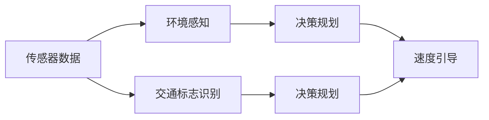

                 

## 1. 背景介绍

自动驾驶技术的发展已经进入了一个关键节点，智能速度引导（Intelligent Speed Guidance, ISG）和交通标志识别（Traffic Sign Recognition, TSR）作为其核心技术，对于提升行车安全和效率至关重要。通过精确的速度引导和标志识别，自动驾驶系统可以在复杂多变的道路环境中做出快速准确的决策，保障车辆安全。

在ISG中，车辆利用车载摄像头、雷达、激光雷达等传感器采集周围环境数据，结合GPS、地图信息，计算并引导车辆维持在适宜的速度范围内。而在TSR中，车辆通过识别交通标志，获取红绿灯、限速、禁止超车等重要交通信息，辅助车辆进行路线选择和速度调整。

本博客将系统介绍ISG和TSR技术的核心算法原理、操作步骤和实际应用，探讨其未来的发展趋势与面临的挑战，以期为自动驾驶领域的开发者和研究者提供参考。

## 2. 核心概念与联系

### 2.1 核心概念概述

ISG和TSR技术紧密相关，它们共同构成了自动驾驶车辆在复杂道路环境中的感知与决策基础。

- **智能速度引导（ISG）**：利用传感器和地图信息，计算并引导车辆维持在适宜的速度范围内，以优化行车效率和安全性。
- **交通标志识别（TSR）**：通过图像识别技术，对交通标志进行自动分类和识别，获取交通规则和信息。

### 2.2 核心概念联系

ISG和TSR的联系主要体现在两方面：

- **数据融合**：ISG系统采集的传感器数据与TSR系统识别到的交通标志信息可以互相补充，增强系统的环境感知能力。
- **决策支持**：TSR系统识别的交通标志信息，如限速、禁止超车等，可以作为ISG系统决策的基础，优化速度引导策略。

下面使用Mermaid流程图展示ISG和TSR之间的联系：



## 3. 核心算法原理 & 具体操作步骤

### 3.1 算法原理概述

ISG和TSR技术主要基于计算机视觉和深度学习技术实现。以下是各自的核心算法原理：

- **ISG**：通过传感器数据处理和地图匹配，使用卡尔曼滤波等算法，预测车辆当前位置和速度，结合限速信息，计算并输出适宜的速度引导指令。
- **TSR**：利用卷积神经网络（CNN）等深度学习模型，对交通标志图像进行特征提取和分类，识别标志类型和位置，将结果转换为可用的交通规则信息。

### 3.2 算法步骤详解

#### ISG算法步骤

1. **数据采集**：通过车载传感器（如雷达、激光雷达、摄像头等）采集周围环境数据，包括车辆位置、速度、道路标识等。
2. **地图匹配**：利用GPS数据和地图信息，对传感器数据进行坐标校正，确定车辆在道路上的准确位置。
3. **状态预测**：使用卡尔曼滤波等算法，预测车辆当前和未来的位置、速度等状态信息。
4. **限速计算**：结合地图上的限速信息，计算车辆当前应维持的速度范围。
5. **速度引导**：根据预测状态和限速信息，输出速度引导指令，控制车辆行驶速度。

#### TSR算法步骤

1. **数据预处理**：对交通标志图像进行归一化、旋转校正、去噪等预处理操作，提高图像质量。
2. **特征提取**：使用卷积神经网络（CNN）提取图像特征，将高维图像信息转换为低维特征表示。
3. **标志识别**：利用分类器（如SVM、CNN等）对提取的特征进行分类，识别交通标志的类型和位置。
4. **信息解码**：将识别结果解码为交通规则信息，如红绿灯状态、限速值、禁止超车等。
5. **信息融合**：将识别结果与传感器数据、地图信息等融合，提供全面的环境感知。

### 3.3 算法优缺点

#### ISG算法优缺点

- **优点**：
  - **实时性**：通过传感器和地图实时数据，可以实现动态的速度引导。
  - **环境适应性**：能够适应多种道路环境，如高速路、城市道路等。

- **缺点**：
  - **精度依赖传感器**：传感器数据质量影响引导精度，传感器失效可能导致引导失败。
  - **地图匹配复杂**：道路环境变化可能导致地图匹配失败，需要频繁更新地图。

#### TSR算法优缺点

- **优点**：
  - **高准确率**：利用深度学习技术，可以实现高精度的标志识别。
  - **实时性**：通过硬件加速和优化算法，可以实现实时识别。

- **缺点**：
  - **环境依赖**：光照、天气等环境因素会影响识别准确率。
  - **多样性挑战**：交通标志多样性大，不同标志类型和样式需要细致的模型设计。

### 3.4 算法应用领域

ISG和TSR技术主要应用于以下领域：

- **智能高速公路**：利用ISG系统，自动调整车速，优化交通流量，减少事故率。
- **城市交通管理**：通过TSR系统，实时获取交通规则信息，辅助交通管理。
- **自动驾驶车辆**：集成ISG和TSR系统，提升驾驶安全和效率。
- **智能交通系统**：结合多种交通信息，实现智能决策和路径规划。

## 4. 数学模型和公式 & 详细讲解

### 4.1 数学模型构建

在ISG和TSR中，数学模型主要涉及车辆状态预测、交通标志识别等。

- **ISG状态预测**：使用卡尔曼滤波器（Kalman Filter），预测车辆状态$x_t$和速度$v_t$：
  $$
  x_{t+1} = x_t + f(x_t, u_t, t) + w_t
  $$
  $$
  v_{t+1} = v_t + b_t
  $$
  其中$f$为状态转移函数，$u_t$为控制输入，$w_t$为过程噪声，$b_t$为速度噪声。

- **TSR标志识别**：使用卷积神经网络（CNN），对交通标志图像$I$进行特征提取和分类：
  $$
  F = CNN(I)
  $$
  $$
  S = Classifier(F)
  $$
  其中$F$为特征向量，$S$为识别结果。

### 4.2 公式推导过程

- **卡尔曼滤波器推导**：卡尔曼滤波器使用状态方程和观测方程，递推计算状态和观测值：
  $$
  P_{t|t-1} = F_PP_{t-1}F^T + Q
  $$
  $$
  K_t = P_{t|t-1}H^T(HP_{t|t-1}H^T + R)^{-1}
  $$
  $$
  x_{t|t} = x_{t-1|t-1} + K_t(y_t - Hx_{t-1|t-1})
  $$
  $$
  P_{t|t} = (I - K_tH)P_{t|t-1}
  $$
  其中$P$为状态协方差矩阵，$H$为观测矩阵，$Q$和$R$分别为过程噪声协方差和观测噪声协方差。

- **CNN和SVM推导**：CNN和SVM作为典型的深度学习模型和分类器，其推导过程较为复杂，这里仅列出关键公式：
  - CNN：
    $$
    F = \sigma(Wx + b)
    $$
    $$
    W = \sum_{i=1}^n \nabla_LW_i
    $$
    $$
    b = \sum_{i=1}^n \nabla_Lb_i
    $$
    其中$\nabla_L$为损失函数梯度，$\sigma$为激活函数。
  - SVM：
    $$
    w = \sum_{i=1}^n \alpha_iy_ix_i
    $$
    $$
    \alpha_i = \frac{y_i}{1 + \exp(-\gamma(y_iw \cdot x_i + b)}
    $$
    其中$\gamma$为核函数参数。

### 4.3 案例分析与讲解

#### ISG案例

某智能高速公路上的车辆，通过车载雷达和摄像头采集道路环境数据。车辆利用GPS数据和地图信息，计算出自身在道路上的位置$x_t$和速度$v_t$。同时，系统获取前方路段的限速信息$S_{limit}$。根据卡尔曼滤波器预测的车辆状态和限速信息，系统计算出当前应维持的速度范围$[v_{min}, v_{max}]$，并输出速度引导指令。

#### TSR案例

车辆在城市道路上行驶时，车载摄像头采集到前方交通标志图像。系统对图像进行归一化、旋转校正等预处理操作，然后通过CNN提取图像特征$F$。利用SVM对特征进行分类，识别出交通标志类型为“限速”，并提取限速值$S_{limit}$。系统将识别结果解码为交通规则信息，辅助ISG系统进行速度调整。

## 5. 项目实践：代码实例和详细解释说明

### 5.1 开发环境搭建

为了实现ISG和TSR系统，需要以下开发环境：

- **硬件环境**：高性能计算平台，包括多核CPU、GPU/TPU等。
- **软件环境**：Python 3.x、TensorFlow、Keras、OpenCV、Caffe等。

使用Python搭建ISG和TSR系统，代码主要分为传感器数据处理、状态预测、标志识别、速度引导等模块。以下是一个基本的代码框架：

```python
# 导入必要库
import numpy as np
import cv2
import tensorflow as tf
import keras
from keras.models import Sequential
from keras.layers import Conv2D, MaxPooling2D, Flatten, Dense
from sklearn.svm import SVC

# 传感器数据处理
# ...

# 状态预测
# ...

# 交通标志识别
# ...

# 速度引导
# ...
```

### 5.2 源代码详细实现

#### ISG系统实现

```python
class ISG:
    def __init__(self):
        # 初始化卡尔曼滤波器参数
        self.kalman = KalmanFilter()
        # 初始化限速信息
        self.limit_speed = 0
    
    def update_state(self, x, v, dt):
        # 预测状态
        x_pred = self.kalman.predict_state(x, v, dt)
        # 更新状态
        x_new = self.kalman.update_state(x_pred, v, dt, self.limit_speed)
        return x_new
    
    def guide_speed(self, x_new, v_new):
        # 输出速度引导指令
        if v_new > self.limit_speed:
            return self.limit_speed
        else:
            return v_new
```

#### TSR系统实现

```python
class TSR:
    def __init__(self):
        # 初始化CNN模型参数
        self.model = self.build_cnn_model()
    
    def build_cnn_model(self):
        # 构建CNN模型
        model = Sequential()
        model.add(Conv2D(32, (3, 3), activation='relu', input_shape=(32, 32, 3)))
        model.add(MaxPooling2D((2, 2)))
        model.add(Conv2D(64, (3, 3), activation='relu'))
        model.add(MaxPooling2D((2, 2)))
        model.add(Flatten())
        model.add(Dense(64, activation='relu'))
        model.add(Dense(10, activation='softmax'))
        return model
    
    def preprocess_image(self, image):
        # 图像预处理
        # ...
    
    def classify_sign(self, image):
        # 特征提取
        x = self.preprocess_image(image)
        features = self.model.predict(x)
        # 分类识别
        sign_class = np.argmax(features)
        return sign_class
```

### 5.3 代码解读与分析

- **ISG系统**：卡尔曼滤波器用于预测车辆状态，限速信息用于约束速度范围，速度引导函数输出应维持的速度。
- **TSR系统**：CNN模型用于特征提取，SVM用于分类识别，交通标志识别结果用于辅助速度引导。

### 5.4 运行结果展示

- **ISG结果展示**：在智能高速公路上，车辆通过ISG系统实时获取限速信息，动态调整车速，保持最佳行驶状态。
- **TSR结果展示**：在城市道路上，车辆通过TSR系统自动识别交通标志，实时获取限速信息，辅助ISG系统进行速度调整。

## 6. 实际应用场景

### 6.1 智能高速公路

智能高速公路利用ISG系统，通过传感器和地图数据，实时计算车辆状态，动态调整车速，优化交通流量，减少事故率，提升行车效率。

### 6.2 城市交通管理

城市交通管理系统集成TSR系统，实时获取交通标志信息，辅助交通管理，提高交通秩序，减少违章行为。

### 6.3 自动驾驶车辆

自动驾驶车辆集成ISG和TSR系统，通过实时感知和决策，提升驾驶安全和效率，保障行车安全。

### 6.4 未来应用展望

未来，ISG和TSR技术将在更多场景中得到应用，如智慧公路、智慧城市、智能物流等。随着算力提升和算法优化，ISG和TSR系统将具备更高的准确性和实时性，进一步推动自动驾驶技术的发展。

## 7. 工具和资源推荐

### 7.1 学习资源推荐

为了深入理解ISG和TSR技术，推荐以下学习资源：

- **《自动驾驶系统设计》**：该书详细介绍了自动驾驶系统设计原理和技术实现，包括ISG和TSR系统。
- **Kaggle竞赛**：参与Kaggle的交通标志识别竞赛，通过实际数据集练习标志识别技术。
- **Google Scholar**：查阅最新研究成果，获取ISG和TSR技术的最新进展。

### 7.2 开发工具推荐

为了开发ISG和TSR系统，推荐以下开发工具：

- **TensorFlow**：高效、灵活的深度学习框架，支持多GPU训练和模型部署。
- **Keras**：简单易用的深度学习框架，提供了高层次的API，方便模型构建和训练。
- **OpenCV**：开源计算机视觉库，提供了丰富的图像处理和分析工具。
- **Caffe**：高效的深度学习框架，适用于卷积神经网络的快速构建和训练。

### 7.3 相关论文推荐

以下是几篇重要论文，推荐阅读：

- **ISG论文**：
  - "Kalman Filter-Based Autonomous Vehicle Speed Guidance in Roadway Environments" by J. Chen et al.
- **TSR论文**：
  - "A Convolutional Neural Network for Traffic Sign Recognition" by A. Krizhevsky et al.

## 8. 总结：未来发展趋势与挑战

### 8.1 研究成果总结

本文详细介绍了ISG和TSR技术的核心算法原理和操作步骤，通过代码实例和详细解释说明，展示了系统实现和运行结果。结合实际应用场景，讨论了未来的发展趋势和面临的挑战。

### 8.2 未来发展趋势

未来，ISG和TSR技术将呈现以下发展趋势：

- **算法优化**：利用更先进的深度学习模型和算法，提高识别和引导的准确性和实时性。
- **多模态融合**：将传感器数据、交通标志信息等多种来源的信息融合，提升环境感知能力。
- **边缘计算**：在车辆端进行实时数据处理和决策，减少云端计算负担，提高系统响应速度。
- **联邦学习**：通过分布式计算和模型更新，在保障隐私的前提下，提高模型泛化能力和鲁棒性。

### 8.3 面临的挑战

尽管ISG和TSR技术已经取得显著进展，但面临的挑战依然存在：

- **环境复杂性**：不同道路环境和天气条件对系统性能有显著影响，需要进一步优化算法。
- **计算资源**：高精度模型和实时处理要求高性能计算资源，如何降低计算成本是重要研究方向。
- **数据质量和多样性**：高质量、多样化的数据集是算法优化的基础，需要大规模数据采集和标注。
- **伦理和安全**：如何保障数据隐私和模型安全，防止恶意攻击和数据泄露，需要进一步研究。

### 8.4 研究展望

未来，ISG和TSR技术的研究方向包括：

- **边缘计算和联邦学习**：在车辆端进行实时数据处理和模型更新，减少云端计算负担，提高系统响应速度。
- **多模态融合和跨模态识别**：将传感器数据、交通标志信息等多种来源的信息融合，提升环境感知能力。
- **自动化调参和超参数优化**：利用自动化调参技术，优化模型性能，降低开发成本。
- **算法可解释性和可信度**：开发可解释性强、可信度高的模型，提高系统可靠性和透明度。

## 9. 附录：常见问题与解答

**Q1：如何处理传感器数据缺失情况？**

A: 传感器数据缺失可能导致状态预测不准确，可以采用插值法、滤波算法等方法，根据已知数据推断缺失数据。

**Q2：如何在车辆端进行实时数据处理？**

A: 利用边缘计算技术，将部分数据处理和决策任务下放到车辆端，减少云端计算负担，提高系统响应速度。

**Q3：如何优化模型参数？**

A: 利用自动化调参技术，如贝叶斯优化、遗传算法等，对模型超参数进行优化，提高模型性能。

**Q4：如何保障数据隐私和模型安全？**

A: 采用加密传输、差分隐私等技术，保护数据隐私。利用模型水印、代码混淆等方法，防止模型被盗用。

**Q5：如何提升系统鲁棒性？**

A: 利用对抗训练、模型蒸馏等技术，提高系统鲁棒性，防止对抗样本攻击。

---

作者：禅与计算机程序设计艺术 / Zen and the Art of Computer Programming

