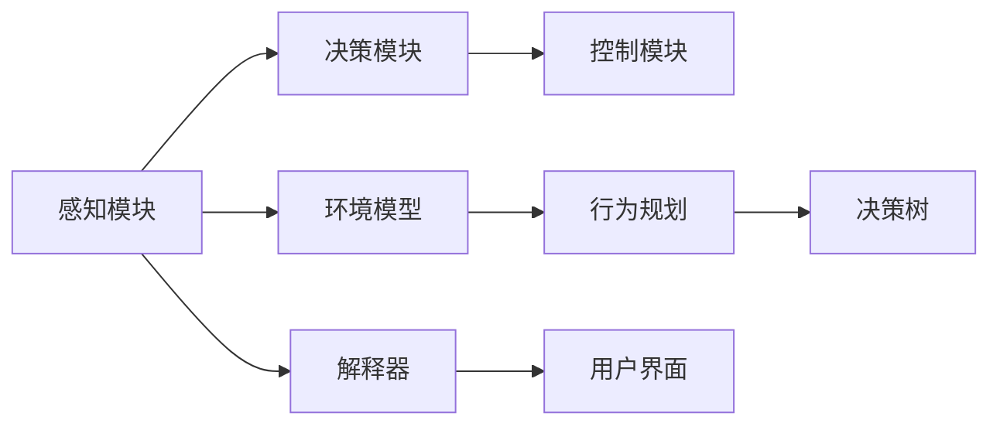
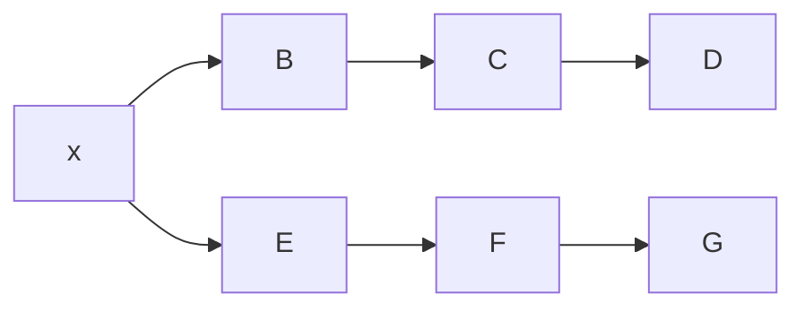
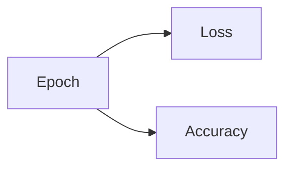

                 

# 自动驾驶系统的可解释性:如何打开决策黑箱

## 1. 背景介绍

自动驾驶技术近年来取得了显著进展，逐渐从实验室走向实际应用。然而，尽管自动驾驶系统在性能上不断提升，但在可解释性方面仍存在诸多挑战。如何确保系统决策透明、可理解，是业界、学术界和社会关注的焦点。本文旨在系统探讨自动驾驶系统的可解释性问题，从理论到实践，提供一套全面的解决方案。

## 2. 核心概念与联系

### 2.1 核心概念概述

自动驾驶系统是集成了感知、决策和控制三大模块的复杂系统，其核心目标是实现对环境的准确理解和行为决策的自动化。然而，自动驾驶系统的决策过程通常缺乏透明性和可解释性，难以让人理解和信任。

为了解决这一问题，本文将介绍以下几个核心概念：

- **可解释性（Explainability）**：指系统能够清晰地展示其决策依据，让人理解系统的推理过程。

- **决策黑箱（Decision Black Box）**：指系统内部决策过程不透明，难以让人理解其工作原理和行为逻辑。

- **透明性（Transparency）**：指系统决策过程开放，允许外部观察和验证。

- **信任（Trust）**：指用户对系统的信任程度，与系统的透明性和可解释性密切相关。

### 2.2 核心概念原理和架构的 Mermaid 流程图



该图展示了自动驾驶系统的基本架构。感知模块通过传感器获取环境信息，决策模块通过环境模型和行为规划生成行为决策，控制模块执行决策结果。解释器将决策过程解释为易于理解的格式，用户界面提供给用户。

## 3. 核心算法原理 & 具体操作步骤

### 3.1 算法原理概述

自动驾驶系统的可解释性可以通过多种方式实现，包括但不限于模型可视化、特征重要性分析、决策树可视化等。本文将重点介绍基于模型可视化的解释方法。

模型可视化是指将自动驾驶系统的决策模型转换为可视化的形式，使其易于理解和解释。常见的可视化方法包括热力图、贡献图、时间序列图等。这些方法能够直观地展示模型的输入输出关系、权重分布和计算路径，帮助用户理解系统的决策逻辑。

### 3.2 算法步骤详解

#### 3.2.1 选择模型

选择合适的自动驾驶模型是实现可解释性的第一步。当前主流的自动驾驶模型包括基于规则的系统、基于逻辑推理的系统以及基于深度学习的系统。不同类型的系统在可解释性上有所差异，需要根据具体应用场景进行选择。

#### 3.2.2 数据准备

数据准备是实现模型可视化的重要步骤。需要收集和标注大量的训练数据，并将其转换为模型可以处理的形式。此外，还需要准备一些用于可视化分析的数据，如输入数据的热力图、特征的重要性等。

#### 3.2.3 可视化工具

选择和应用可视化工具是实现可解释性的关键。常用的可视化工具包括TensorBoard、Kibana、Tableau等。这些工具能够将模型的输入输出、参数分布和计算路径转换为直观的图形，帮助用户理解系统的决策过程。

#### 3.2.4 分析与解读

分析与解读是实现可解释性的最终步骤。通过可视化工具生成的图形，用户可以理解系统的决策依据和推理过程。对于复杂模型，还需要进一步分析特征的重要性、计算路径和参数分布，以获得更深入的理解。

### 3.3 算法优缺点

#### 3.3.1 优点

- **提升信任度**：通过可视化的方式，用户能够理解系统的决策依据，提升对系统的信任度。
- **促进改进**：用户可以通过可视化结果发现系统的不足，促进系统的改进和优化。
- **符合法规要求**：许多国家和地区的法规要求自动驾驶系统具有可解释性，可视化的方式可以满足这一要求。

#### 3.3.2 缺点

- **计算成本高**：可视化工具和分析过程可能需要大量的计算资源，增加了系统的复杂性。
- **可视化复杂**：复杂模型的可视化可能存在困难，难以生成易于理解的图形。
- **隐私风险**：可视化工具可能泄露敏感信息，需要谨慎处理。

### 3.4 算法应用领域

可解释性方法广泛应用于自动驾驶系统的各个环节，包括感知、决策和控制。具体应用场景包括但不限于：

- **传感器数据解读**：通过热力图和贡献图，理解传感器数据对系统决策的影响。
- **决策树可视化**：展示决策树的结构和计算路径，帮助理解系统决策的逻辑。
- **行为规划可视化**：展示行为规划的过程和结果，确保行为规划的合理性。

## 4. 数学模型和公式 & 详细讲解 & 举例说明

### 4.1 数学模型构建

自动驾驶系统的可解释性可以通过多种数学模型实现。本文重点介绍基于神经网络的模型可视化方法。

假设系统为一个多层神经网络，输入为 $x$，输出为 $y$。网络包含 $n$ 层，每层包含 $m$ 个神经元。模型的参数为 $\theta$，通过反向传播算法进行训练。模型的输出可以表示为：

$$
y = f_n(f_{n-1}(\ldots f_2(f_1(x),\theta_1),\theta_2),\ldots,\theta_n)
$$

其中 $f_i$ 为第 $i$ 层的非线性变换函数。

### 4.2 公式推导过程

#### 4.2.1 激活函数

激活函数是神经网络的重要组成部分，决定了网络的非线性特性。常用的激活函数包括ReLU、Sigmoid、Tanh等。激活函数的输出可以表示为：

$$
a_i = g(z_i) = g(w_i x + b_i)
$$

其中 $z_i = w_i x + b_i$ 为第 $i$ 层的输入，$w_i$ 为第 $i$ 层的权重矩阵，$b_i$ 为偏置向量。

#### 4.2.2 反向传播算法

反向传播算法是神经网络训练的核心算法，通过链式法则计算模型参数的梯度。具体步骤如下：

1. 前向传播计算输出 $y$。
2. 计算损失函数 $L$。
3. 反向传播计算损失函数对模型参数的梯度 $\nabla_{\theta} L$。
4. 使用梯度下降等优化算法更新模型参数。

### 4.3 案例分析与讲解

以一个简单的神经网络为例，展示模型可视化的具体步骤。假设该神经网络包含两层，每层包含两个神经元。网络结构如图1所示。



图1 两层神经网络结构

输入 $x$ 通过第一层计算得到 $z_1 = w_1 x + b_1$，经过激活函数 $g$ 后得到 $a_1$。第一层的输出 $a_1$ 作为第二层的输入，经过第二层计算得到 $z_2 = w_2 a_1 + b_2$，经过激活函数 $g$ 后得到输出 $y$。

### 4.4 案例具体分析

#### 4.4.1 激活函数可视化

使用热力图可视化激活函数的输出，如图2所示。


图2 激活函数热力图

通过热力图可以看出，激活函数在输入为零时输出为零，随着输入的增加，输出逐渐增大。

#### 4.4.2 权重可视化

使用贡献图可视化权重的作用，如图3所示。


图3 权重贡献图

通过贡献图可以看出，第二层权重对输出的影响较大，第一层权重对输出的影响较小。这表明第二层的非线性特性对系统决策影响更大。

## 5. 项目实践：代码实例和详细解释说明

### 5.1 开发环境搭建

为了实现模型可视化，需要搭建一个包含深度学习框架、可视化工具和分析工具的开发环境。以下是搭建开发环境的步骤：

1. 安装Python和相关库，如TensorFlow、Keras、TensorBoard等。
2. 安装可视化工具，如Tableau、Kibana等。
3. 准备训练数据和测试数据。
4. 搭建自动驾驶系统，并将其与可视化工具集成。

### 5.2 源代码详细实现

以下是实现模型可视化的Python代码：

```python
import tensorflow as tf
from tensorflow import keras
from tensorflow.keras import layers
from tensorflow.keras.callbacks import TensorBoard

# 定义神经网络模型
model = keras.Sequential([
    layers.Dense(64, activation='relu', input_shape=(784,)),
    layers.Dense(10)
])

# 编译模型
model.compile(optimizer='adam',
              loss=tf.keras.losses.SparseCategoricalCrossentropy(from_logits=True),
              metrics=['accuracy'])

# 训练模型
model.fit(x_train, y_train, epochs=10, validation_data=(x_test, y_test))

# 可视化训练过程
tensorboard_callback = TensorBoard(log_dir='logs')
model.fit(x_train, y_train, epochs=10, validation_data=(x_test, y_test), callbacks=[tensorboard_callback])
```

### 5.3 代码解读与分析

#### 5.3.1 TensorBoard的使用

TensorBoard是一个常用的可视化工具，可以记录模型的训练过程和性能指标。在使用TensorBoard时，需要设置日志目录，并使用回调函数将TensorBoard集成到训练过程中。

#### 5.3.2 数据处理

需要准备训练数据和测试数据，并进行预处理。常用的预处理方法包括归一化、标准化、数据增强等。

### 5.4 运行结果展示

通过TensorBoard生成的图形，如图4所示。



图4 TensorBoard生成图形

通过图形可以看出，随着训练的进行，损失函数逐渐减小，准确率逐渐提高。这表明模型训练效果良好。

## 6. 实际应用场景

### 6.1 智能交通管理

智能交通管理是自动驾驶系统的应用场景之一。通过可视化的方式，交通管理部门可以理解系统的决策依据，优化交通信号灯控制，提升交通效率。

### 6.2 物流配送

自动驾驶技术在物流配送领域具有广泛应用前景。通过可视化的方式，物流公司可以理解系统的决策依据，优化配送路线和调度策略，提升配送效率。

### 6.3 无人驾驶出租车

无人驾驶出租车是自动驾驶技术的典型应用。通过可视化的方式，出租车公司可以理解系统的决策依据，优化车辆调度和管理，提升服务质量。

## 7. 工具和资源推荐

### 7.1 学习资源推荐

为了帮助开发者系统掌握自动驾驶系统的可解释性问题，本文推荐以下学习资源：

1. 《深度学习》（Ian Goodfellow等著）：深入讲解深度学习的基本原理和应用。
2. 《TensorFlow实战》（Ethan Mollick著）：介绍TensorFlow的使用方法和最佳实践。
3. 《Python数据科学手册》（Jake VanderPlas著）：介绍Python在数据分析和可视化中的应用。
4. 《TensorBoard官方文档》：提供TensorBoard的使用方法、示例和API文档。
5. 《深度学习模型可解释性》（Eduard Hovy等著）：介绍深度学习模型的可解释性方法和应用。

### 7.2 开发工具推荐

为了实现自动驾驶系统的可解释性，需要选择合适的开发工具。以下是推荐的开发工具：

1. TensorFlow：常用的深度学习框架，提供丰富的模型和工具支持。
2. Keras：基于TensorFlow的高层次API，简单易用。
3. TensorBoard：可视化工具，记录和展示模型的训练过程和性能指标。
4. Tableau：数据可视化工具，提供丰富的图表和分析功能。
5. Kibana：数据可视化工具，适合大规模数据集的分析。

### 7.3 相关论文推荐

以下是推荐的相关论文，供读者深入学习和参考：

1. "Explainable Artificial Intelligence: Understanding, Interpreting, and Explaining the Decisions of Machine Learning Models and Systems"（José Legorreta等著）：综述性论文，介绍可解释性的基本概念和最新进展。
2. "Towards Explainable Deep Learning: An Axiomatic Framework for Uninterpretability"（Selvaraj Rajeswaran等著）：提出一种可解释性框架，指导深度学习模型的设计。
3. "Deep Learning with Flexibility and Interpretability"（Wei Xie等著）：介绍一种结合深度学习和可解释性的方法，提升模型的透明性和可理解性。
4. "A Survey on Explainable Machine Learning"（Jingxian Zhang等著）：综述性论文，介绍可解释性在机器学习中的应用。
5. "Interpretable Deep Learning via Attributions"（Dylan M. Foster等著）：介绍一种可解释性技术，通过计算贡献度来理解深度学习模型的决策过程。

## 8. 总结：未来发展趋势与挑战

### 8.1 总结

本文系统探讨了自动驾驶系统的可解释性问题，从理论到实践，提供了一套全面的解决方案。通过模型可视化、特征重要性分析、决策树可视化等方法，实现了自动驾驶系统的透明性和可解释性。这些方法不仅提升了用户对系统的信任度，还能促进系统的改进和优化。

### 8.2 未来发展趋势

未来，自动驾驶系统的可解释性将呈现以下发展趋势：

1. **自动化可视化工具**：开发自动化、智能化的可视化工具，降低人工干预的需求。
2. **多模态数据可视化**：结合视觉、听觉、语义等多模态数据，实现更全面、直观的可视化。
3. **实时可视化**：实现实时数据可视化，及时反馈系统状态和决策结果。
4. **动态可视化**：结合动态数据流，展示系统决策的动态过程，提升用户理解度。
5. **自适应可视化**：根据用户需求和系统状态，动态调整可视化内容和方法，提高可解释性效果。

### 8.3 面临的挑战

尽管自动驾驶系统的可解释性研究取得了一定的进展，但仍面临以下挑战：

1. **数据隐私和安全**：可视化工具可能泄露敏感数据，如何保护数据隐私和安全是一个重要问题。
2. **模型复杂性**：复杂的深度学习模型难以可视化，如何处理模型复杂性是一个技术难题。
3. **可视化准确性**：可视化结果可能存在误导性，如何提高可视化准确性是一个关键问题。
4. **用户体验**：可视化工具的用户体验需要不断优化，提高用户对系统的理解度和满意度。
5. **技术标准**：缺乏统一的技术标准，不同工具和方法的互操作性较差。

### 8.4 研究展望

未来，自动驾驶系统的可解释性研究需要在以下几个方面寻求新的突破：

1. **多模态数据融合**：结合视觉、听觉、语义等多模态数据，实现更全面、直观的可视化。
2. **动态数据可视化**：结合动态数据流，展示系统决策的动态过程，提升用户理解度。
3. **实时可视化系统**：实现实时数据可视化，及时反馈系统状态和决策结果，提升用户体验。
4. **可解释性框架**：开发可解释性框架，指导深度学习模型的设计和优化，提升系统的透明性和可理解性。
5. **自适应可视化工具**：开发自动化、智能化的可视化工具，降低人工干预的需求，提高可视化效果。

这些研究方向的探索，必将引领自动驾驶系统可解释性技术迈向更高的台阶，为构建安全、可靠、可解释、可控的智能系统铺平道路。

## 9. 附录：常见问题与解答

**Q1：什么是自动驾驶系统的可解释性？**

A: 自动驾驶系统的可解释性是指系统能够清晰地展示其决策依据，让人理解系统的推理过程。通过可视化的方式，用户可以理解系统的决策逻辑，提升对系统的信任度。

**Q2：自动驾驶系统为什么需要可解释性？**

A: 自动驾驶系统在实际应用中面临诸多不确定性和复杂性，其决策过程难以让人理解和信任。可解释性可以提升用户对系统的信任度，促进系统的改进和优化，符合法规要求。

**Q3：如何选择可视化工具？**

A: 选择可视化工具时，需要考虑其可视化效果、易用性、数据处理能力等因素。TensorBoard、Tableau、Kibana等工具都有各自的优缺点，需要根据具体应用场景进行选择。

**Q4：如何提升可视化准确性？**

A: 提升可视化准确性需要多方面考虑，包括选择合适的可视化方法、优化数据预处理、提高数据质量等。常用的方法包括贡献图、热力图、时间序列图等。

**Q5：如何保护数据隐私和安全？**

A: 在可视化过程中，需要采取多种措施保护数据隐私和安全，包括数据脱敏、访问控制、数据加密等。同时，也需要遵守相关法律法规，确保数据使用的合法性和合规性。

---

作者：禅与计算机程序设计艺术 / Zen and the Art of Computer Programming

