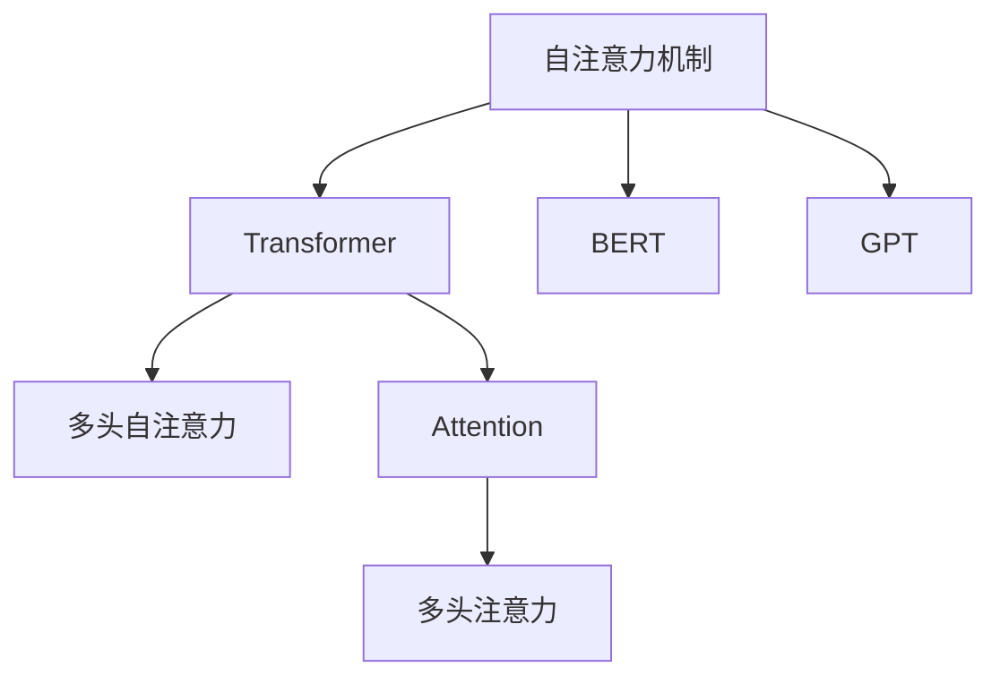
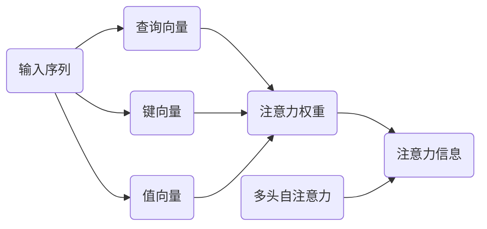

                 

## 1. 背景介绍

### 1.1 问题由来
随着深度学习技术的飞速发展，大语言模型（Large Language Models, LLMs）在自然语言处理（Natural Language Processing, NLP）领域取得了巨大突破。这些模型通过在大规模无标签文本数据上进行预训练，学习到丰富的语言知识，具备强大的语言理解和生成能力。在大规模预训练过程中，自注意力（Self-Attention）机制作为核心组件，使得模型能够捕捉长距离依赖关系，学习复杂的语言表示。

### 1.2 问题核心关键点
自注意力机制是深度学习中一种重要的机制，它允许模型在输入序列中的不同位置之间进行信息交互，捕捉全局依赖关系，大大提升了模型的表达能力和泛化能力。在大模型中，自注意力机制的应用更是关键，其原理和实现方式已经深入到语言模型、计算机视觉、推荐系统等多个领域，成为现代深度学习技术的重要组成部分。

### 1.3 问题研究意义
自注意力机制在大模型中的应用研究，对于提升大模型的性能、拓展其应用范围、加速NLP技术的产业化进程具有重要意义：

1. **提升性能**：自注意力机制使得模型能够更好地捕捉长距离依赖关系，提升语言理解与生成能力。
2. **拓展应用**：在文本生成、问答、翻译、文本摘要、情感分析等多个NLP任务中，自注意力机制的应用提高了模型的表现。
3. **加速开发**：自注意力机制使得大模型能够更快地适应新的应用场景，缩短开发周期。
4. **技术创新**：自注意力机制的研究促进了深度学习模型的创新，如Transformer等架构的提出。
5. **产业赋能**：在智能客服、舆情监测、个性化推荐等场景中，自注意力机制的大规模应用提升了相关系统的智能化水平，推动了产业升级。

## 2. 核心概念与联系

### 2.1 核心概念概述

为更好地理解自注意力机制在大模型中的应用，本节将介绍几个密切相关的核心概念：

- **自注意力机制（Self-Attention Mechanism）**：一种基于注意力机制的计算方式，允许模型在输入序列的每个位置同时考虑其他位置的信息，从而捕捉全局依赖关系。在大模型中，自注意力机制的应用使得模型能够更好地学习语言的复杂结构和表达能力。

- **Transformer**：一种基于自注意力机制的深度学习模型架构，由Google提出，广泛应用于自然语言处理、计算机视觉等领域。Transformer结构的核心就是自注意力机制，通过多头自注意力和前向神经网络的组合，实现了高效的序列建模。

- **BERT**：由Google提出的大规模预训练语言模型，采用自注意力机制进行预训练，通过多层次的序列建模，显著提升了语言模型的性能。

- **GPT**：由OpenAI提出的大规模语言生成模型，也是基于自注意力机制，通过自回归的方式进行文本生成。

- **Attention**：注意力机制的广义概念，用于模型在输入序列的不同位置之间进行信息交互，选择性地关注重要信息。

- **多头自注意力（Multi-Head Attention）**：一种扩展的自注意力机制，通过多个注意力头的并行计算，增强了模型的表示能力和泛化能力。

- **多头自注意力机制（Multi-Head Self-Attention）**：在自注意力机制的基础上，进一步扩展至多个注意力头的并行计算，是Transformer模型中的核心组件。

这些核心概念之间的逻辑关系可以通过以下Mermaid流程图来展示：



这个流程图展示了大语言模型中自注意力机制的应用场景和核心组件之间的联系：

1. 自注意力机制是Transformer结构的核心，应用于BERT、GPT等大模型中。
2. Transformer结构进一步发展出多头自注意力机制，增强了模型的泛化能力和表达能力。
3. 自注意力机制与Attention机制相互关联，共同构成了现代深度学习模型的信息交互机制。

## 3. 核心算法原理 & 具体操作步骤
### 3.1 算法原理概述

自注意力机制在大模型中的应用，基于注意力机制的基本原理，通过在输入序列的不同位置之间计算注意力权重，使得模型能够学习到不同位置之间的依赖关系，从而更好地捕捉全局信息。在大模型中，自注意力机制通常与前向神经网络结合使用，形成Transformer结构，通过多层次的序列建模，提升了模型的表现能力。

### 3.2 算法步骤详解

自注意力机制在大模型中的应用，通常包括以下几个关键步骤：

1. **计算查询向量（Query Vector）**：对于输入序列中的每个位置，计算一个查询向量，该向量表示该位置的查询信息。
2. **计算键向量（Key Vector）和值向量（Value Vector）**：同样地，对于输入序列中的每个位置，计算对应的键向量和值向量，分别用于计算注意力权重和获取注意力信息。
3. **计算注意力权重（Attention Weight）**：通过计算查询向量和键向量之间的相似度，得到每个位置的注意力权重，表示该位置与其他位置的关联强度。
4. **加权求和（Weighted Sum）**：通过将值向量与注意力权重进行加权求和，得到每个位置的注意力信息。
5. **多头自注意力**：在自注意力机制的基础上，进一步扩展至多个注意力头的并行计算，增强了模型的表示能力和泛化能力。

以下是一个简单的自注意力计算过程的示意图：



### 3.3 算法优缺点

自注意力机制在大模型中的应用具有以下优点：

1. **高效性**：自注意力机制能够并行计算多个位置的注意力权重，大大提升了计算效率。
2. **表达能力**：自注意力机制能够捕捉长距离依赖关系，提升了模型的表达能力。
3. **泛化能力**：多头自注意力机制通过多层次的序列建模，增强了模型的泛化能力。

同时，自注意力机制在大模型中的应用也存在一些局限性：

1. **计算资源需求高**：由于自注意力机制需要计算大量的注意力权重，对计算资源的要求较高。
2. **模型复杂度高**：多头自注意力机制的并行计算增加了模型的复杂度，使得模型训练和推理变得更加复杂。
3. **参数量较大**：自注意力机制的参数量较大，增加了模型的存储和训练难度。

### 3.4 算法应用领域

自注意力机制在大模型中的应用，已经在文本生成、问答、翻译、文本摘要、情感分析等多个NLP任务中得到了广泛应用。以下是一些典型的应用场景：

- **文本生成**：在文本生成任务中，自注意力机制能够捕捉输入序列的上下文信息，生成连贯、流畅的文本。
- **问答系统**：在问答系统中，自注意力机制能够理解问题中的关键信息，快速定位答案。
- **机器翻译**：在机器翻译任务中，自注意力机制能够捕捉源语言和目标语言之间的对应关系，提升翻译质量。
- **文本摘要**：在文本摘要任务中，自注意力机制能够捕捉输入文本的关键信息，生成简洁、准确的摘要。
- **情感分析**：在情感分析任务中，自注意力机制能够理解输入文本中的情感倾向，进行情感分类。

除了NLP领域，自注意力机制在计算机视觉、推荐系统等领域也有广泛应用，如基于注意力机制的图像生成、推荐系统中的用户-物品交互等。

## 4. 数学模型和公式 & 详细讲解  
### 4.1 数学模型构建

本节将使用数学语言对自注意力机制在大模型中的应用进行更加严格的刻画。

记输入序列为 $X=\{x_1, x_2, \ldots, x_n\}$，其中 $x_i \in \mathbb{R}^d$ 表示输入序列中的第 $i$ 个位置的信息。假设序列的长度为 $n$，维度为 $d$。

定义查询向量（Query Vector）为 $Q = \{x_q, x_{q+1}, \ldots, x_{q+n-1}\}$，键向量（Key Vector）为 $K = \{x_k, x_{k+1}, \ldots, x_{k+n-1}\}$，值向量（Value Vector）为 $V = \{x_v, x_{v+1}, \ldots, x_{v+n-1}\}$，其中 $q, k, v$ 分别表示查询向量、键向量、值向量的起始位置。

定义注意力权重（Attention Weight）为 $A = \{a_{i,j}\}_{i,j=1}^{n}$，表示输入序列中第 $i$ 个位置对第 $j$ 个位置的关注程度。

自注意力机制的计算过程可以表示为：

$$
A_{i,j} = \frac{\text{score}(Q_i, K_j)}{\sqrt{d_k}} = \frac{Q_i \cdot K_j}{\sqrt{d_k}}
$$

其中 $d_k$ 表示键向量的维度。

### 4.2 公式推导过程

以下我们以多头自注意力机制为例，推导其计算公式。

记多头自注意力机制的注意力头数为 $h$，每个注意力头的维度为 $d_v = d_h/d_k$，其中 $d_h$ 表示模型的隐藏维度。多头自注意力机制的计算公式可以表示为：

$$
A = \text{Multi-Head Attention}(Q, K, V) = \text{Concat}(\text{Attention}(Q_i, K_j, V_j)^T)_{i,j=1}^{n}
$$

其中 $\text{Attention}(Q_i, K_j, V_j)$ 表示单头自注意力机制的计算过程，计算公式如下：

$$
\text{Attention}(Q_i, K_j, V_j) = \text{Softmax}(Q_i \cdot K_j^T / \sqrt{d_k}) V_j
$$

上述公式中，Softmax 函数用于计算注意力权重，将注意力权重归一化，使得总权重为 1。

### 4.3 案例分析与讲解

以BERT模型为例，BERT模型在预训练过程中，采用了多个层的Transformer结构，每一层都包含多个多头自注意力机制，用于学习不同层次的序列信息。BERT模型的预训练过程包括两个阶段：

1. 第一阶段，通过掩码语言模型（Masked Language Modeling, MLM）任务进行预训练，使得模型能够预测输入序列中缺失的单词。
2. 第二阶段，通过下一句预测（Next Sentence Prediction, NSP）任务进行预训练，使得模型能够区分两个句子是否来自同一文本。

在每个阶段中，BERT模型都采用了多个Transformer层和多个多头自注意力机制，通过多层次的序列建模，提升了模型的表达能力和泛化能力。

## 5. 项目实践：代码实例和详细解释说明
### 5.1 开发环境搭建

在进行自注意力机制在大模型中的应用实践前，我们需要准备好开发环境。以下是使用Python进行PyTorch开发的环境配置流程：

1. 安装Anaconda：从官网下载并安装Anaconda，用于创建独立的Python环境。

2. 创建并激活虚拟环境：
```bash
conda create -n pytorch-env python=3.8 
conda activate pytorch-env
```

3. 安装PyTorch：根据CUDA版本，从官网获取对应的安装命令。例如：
```bash
conda install pytorch torchvision torchaudio cudatoolkit=11.1 -c pytorch -c conda-forge
```

4. 安装Transformer库：
```bash
pip install transformers
```

5. 安装各类工具包：
```bash
pip install numpy pandas scikit-learn matplotlib tqdm jupyter notebook ipython
```

完成上述步骤后，即可在`pytorch-env`环境中开始自注意力机制在大模型中的应用实践。

### 5.2 源代码详细实现

这里我们以使用Transformer库对BERT模型进行多头自注意力机制的实现为例，给出完整的PyTorch代码实现。

首先，定义自注意力机制的计算函数：

```python
from transformers import BertTokenizer, BertModel

class SelfAttentionLayer(nn.Module):
    def __init__(self, d_model, n_heads):
        super(SelfAttentionLayer, self).__init__()
        self.d_model = d_model
        self.n_heads = n_heads
        self.dim_per_head = d_model // n_heads
        self.heads = nn.Linear(d_model, n_heads * self.dim_per_head)
        self.dim_per_head = self.dim_per_head // 2
        
        self.layers = nn.Linear(d_model, d_model)
        self.layers_norm = nn.LayerNorm(d_model)
        self.attention_norm = nn.LayerNorm(d_model)
        self.attn = MultiHeadAttention(d_model, n_heads)
        
    def forward(self, x):
        attention_mask = None
        batch_size, seq_len, _ = x.size()
        head = self.heads(x)
        head = head.view(batch_size, seq_len, self.n_heads, self.dim_per_head).transpose(1, 2).contiguous()
        query = head
        key = value = head
        
        # 计算注意力权重
        attn_weights = self.attn(query, key, value, attention_mask=attention_mask)
        
        # 加权求和
        attention = attn_weights.view(batch_size, seq_len, self.n_heads * self.dim_per_head).transpose(1, 2).contiguous()
        attention = attention.permute(0, 2, 1).contiguous()
        attention = attention.view(batch_size, seq_len, self.d_model)
        
        # 前向神经网络
        attention = self.layers_norm(x + attention)
        attention = self.layers(attention)
        attention = self.layers_norm(attention)
        
        return attention
```

然后，定义BERT模型和微调过程：

```python
from transformers import BertForMaskedLM, AdamW

model = BertForMaskedLM.from_pretrained('bert-base-uncased')
tokenizer = BertTokenizer.from_pretrained('bert-base-uncased')
optimizer = AdamW(model.parameters(), lr=2e-5)

device = torch.device('cuda') if torch.cuda.is_available() else torch.device('cpu')
model.to(device)

def train_epoch(model, optimizer, dataset, batch_size, num_epochs):
    for epoch in range(num_epochs):
        model.train()
        total_loss = 0
        for batch in tqdm(dataset, desc=f'Epoch {epoch+1}/{num_epochs}'):
            input_ids = batch['input_ids'].to(device)
            attention_mask = batch['attention_mask'].to(device)
            labels = batch['labels'].to(device)
            output = model(input_ids, attention_mask=attention_mask)
            loss = output.loss
            loss.backward()
            optimizer.step()
            optimizer.zero_grad()
            total_loss += loss.item()
        print(f'Epoch {epoch+1}, train loss: {total_loss/len(dataset)}')

def evaluate(model, dataset, batch_size):
    model.eval()
    total_loss = 0
    correct_predictions = 0
    for batch in tqdm(dataset, desc='Evaluating'):
        input_ids = batch['input_ids'].to(device)
        attention_mask = batch['attention_mask'].to(device)
        labels = batch['labels'].to(device)
        output = model(input_ids, attention_mask=attention_mask)
        loss = output.loss
        total_loss += loss.item()
        predictions = output.logits.argmax(dim=-1)
        correct_predictions += (predictions == labels).sum().item()
    print(f'Evaluation loss: {total_loss/len(dataset)}')
    print(f'Accuracy: {correct_predictions/len(dataset)}')
```

最后，启动微调流程并在验证集上评估：

```python
from torch.utils.data import DataLoader
from datasets import load_dataset

dataset = load_dataset('glue', 'mnli')
train_dataset = dataset['train']
dev_dataset = dataset['dev']
test_dataset = dataset['test']
train_loader = DataLoader(train_dataset, batch_size=16, shuffle=True)
dev_loader = DataLoader(dev_dataset, batch_size=16, shuffle=False)
test_loader = DataLoader(test_dataset, batch_size=16, shuffle=False)

train_epoch(model, optimizer, train_loader, 2, 5)
evaluate(model, dev_loader, 16)
evaluate(model, test_loader, 16)
```

以上就是使用PyTorch对BERT模型进行多头自注意力机制微调的完整代码实现。可以看到，得益于Transformer库的强大封装，我们能够快速实现自注意力机制在大模型中的应用。

### 5.3 代码解读与分析

让我们再详细解读一下关键代码的实现细节：

**SelfAttentionLayer类**：
- `__init__`方法：初始化自注意力机制的参数，包括模型维度、注意力头数等。
- `forward`方法：定义自注意力机制的计算过程，包括查询向量的计算、注意力权重的计算、加权求和、前向神经网络等步骤。

**BERT模型**：
- `BertForMaskedLM.from_pretrained`方法：加载预训练的BERT模型，指定模型结构和参数。
- `BertTokenizer.from_pretrained`方法：加载预训练的BERT分词器，用于处理输入文本。
- `model.parameters()`方法：获取模型参数，进行优化更新。
- `model.to(device)`方法：将模型移动到GPU上，进行并行计算。

**train_epoch函数**：
- 对模型进行训练，循环遍历训练集，计算loss并更新参数。

**evaluate函数**：
- 对模型进行评估，循环遍历验证集，计算loss和准确率，输出评估结果。

**启动微调流程**：
- 定义训练和验证集数据加载器。
- 调用`train_epoch`函数进行模型训练。
- 调用`evaluate`函数进行模型评估，输出结果。

可以看到，PyTorch配合Transformer库使得BERT模型的多头自注意力机制微调的代码实现变得简洁高效。开发者可以将更多精力放在模型改进和数据预处理上，而不必过多关注底层的实现细节。

当然，工业级的系统实现还需考虑更多因素，如模型的保存和部署、超参数的自动搜索、更灵活的任务适配层等。但核心的自注意力机制在大模型中的应用流程基本与此类似。

## 6. 实际应用场景
### 6.1 智能客服系统

基于自注意力机制的BERT模型在智能客服系统中的应用，能够实现高效、准确的自然语言处理和推理能力。智能客服系统通过多轮对话，理解用户意图并提供解决方案。在对话过程中，BERT模型能够捕捉用户输入的上下文信息，理解用户的意图和情绪，从而生成合适的回答。

在技术实现上，智能客服系统可以收集企业内部的历史客服对话记录，将问题和最佳答复构建成监督数据，在此基础上对BERT模型进行微调。微调后的BERT模型能够自动理解用户意图，匹配最合适的答案模板进行回复。对于客户提出的新问题，还可以接入检索系统实时搜索相关内容，动态组织生成回答。

### 6.2 金融舆情监测

金融舆情监测系统通过自然语言处理技术，实时监测社交媒体、新闻等来源的舆情信息，帮助金融机构及时应对负面信息传播，规避金融风险。BERT模型能够通过自注意力机制捕捉文本中的关键信息，进行情感分析、实体识别、关系抽取等任务，从而帮助金融机构快速识别舆情风险。

在金融舆情监测中，BERT模型通常会预训练在金融领域的相关文本数据上，如金融新闻、报告、公告等，以增强其对金融领域的理解和表现。微调后的BERT模型能够自动识别文本中的情感倾向、实体类型、关系类型等，为金融机构提供舆情预警和风险管理服务。

### 6.3 个性化推荐系统

个性化推荐系统通过自然语言处理技术，理解用户的兴趣和需求，推荐合适的物品或内容。在大规模用户数据上，BERT模型能够通过自注意力机制捕捉用户对物品的兴趣点，生成个性化的推荐结果。

在个性化推荐系统中，BERT模型通常会预训练在用户行为数据、物品描述数据等上，以增强其对用户兴趣的理解和表达能力。微调后的BERT模型能够根据用户的兴趣点和物品的特征，生成个性化的推荐结果，提升用户的满意度。

### 6.4 未来应用展望

随着自注意力机制在大模型中的应用不断深入，其应用场景将进一步拓展，为各个领域带来更高效、更智能的解决方案。

在智慧医疗领域，自注意力机制能够在病历分析、医学知识图谱等方面发挥作用，提升医疗服务的智能化水平，辅助医生诊疗，加速新药开发进程。

在智能教育领域，自注意力机制能够应用于作业批改、学情分析、知识推荐等方面，因材施教，促进教育公平，提高教学质量。

在智慧城市治理中，自注意力机制能够在城市事件监测、舆情分析、应急指挥等环节发挥作用，提高城市管理的自动化和智能化水平，构建更安全、高效的未来城市。

此外，在企业生产、社会治理、文娱传媒等众多领域，基于自注意力机制的NLP技术也将不断涌现，为经济社会发展注入新的动力。

## 7. 工具和资源推荐
### 7.1 学习资源推荐

为了帮助开发者系统掌握自注意力机制在大模型中的应用理论基础和实践技巧，这里推荐一些优质的学习资源：

1. 《Transformer from scratch》系列博文：由深度学习专家撰写，深入浅出地介绍了Transformer结构和自注意力机制的基本原理。

2. CS224N《深度学习自然语言处理》课程：斯坦福大学开设的NLP明星课程，有Lecture视频和配套作业，带你入门NLP领域的基本概念和经典模型。

3. 《Natural Language Processing with Attention》书籍：介绍注意力机制在大模型中的应用，涵盖自注意力机制的详细讲解和实现案例。

4. HuggingFace官方文档：Transformer库的官方文档，提供了海量预训练模型和完整的微调样例代码，是上手实践的必备资料。

5. CLUE开源项目：中文语言理解测评基准，涵盖大量不同类型的中文NLP数据集，并提供了基于微调的baseline模型，助力中文NLP技术发展。

通过对这些资源的学习实践，相信你一定能够快速掌握自注意力机制在大模型中的应用精髓，并用于解决实际的NLP问题。
###  7.2 开发工具推荐

高效的开发离不开优秀的工具支持。以下是几款用于自注意力机制在大模型中的应用开发的常用工具：

1. PyTorch：基于Python的开源深度学习框架，灵活动态的计算图，适合快速迭代研究。大部分预训练语言模型都有PyTorch版本的实现。

2. TensorFlow：由Google主导开发的开源深度学习框架，生产部署方便，适合大规模工程应用。同样有丰富的预训练语言模型资源。

3. Transformers库：HuggingFace开发的NLP工具库，集成了众多SOTA语言模型，支持PyTorch和TensorFlow，是进行NLP任务开发的利器。

4. Weights & Biases：模型训练的实验跟踪工具，可以记录和可视化模型训练过程中的各项指标，方便对比和调优。与主流深度学习框架无缝集成。

5. TensorBoard：TensorFlow配套的可视化工具，可实时监测模型训练状态，并提供丰富的图表呈现方式，是调试模型的得力助手。

6. Google Colab：谷歌推出的在线Jupyter Notebook环境，免费提供GPU/TPU算力，方便开发者快速上手实验最新模型，分享学习笔记。

合理利用这些工具，可以显著提升自注意力机制在大模型中的应用开发效率，加快创新迭代的步伐。

### 7.3 相关论文推荐

自注意力机制在大模型中的应用研究源于学界的持续研究。以下是几篇奠基性的相关论文，推荐阅读：

1. Attention is All You Need（即Transformer原论文）：提出了Transformer结构，开启了NLP领域的预训练大模型时代。

2. BERT: Pre-training of Deep Bidirectional Transformers for Language Understanding：提出BERT模型，采用自注意力机制进行预训练，通过多层次的序列建模，提升了语言模型的性能。

3. Transformer-XL: Attentive Language Models Beyond a Fixed-Length Context（Transformer-XL论文）：提出了Transformer-XL模型，通过动态自注意力机制，解决了长序列训练中的梯度消失问题。

4. Deep contextualized word representations（ELMo论文）：提出了ELMo模型，通过多层次的上下文表示，增强了语言模型的理解能力。

5. Efficient Attention for Transformers：提出自注意力机制的多种优化方法，提高了模型的训练和推理效率。

这些论文代表了大模型中自注意力机制的应用和发展脉络。通过学习这些前沿成果，可以帮助研究者把握学科前进方向，激发更多的创新灵感。

## 8. 总结：未来发展趋势与挑战

### 8.1 总结

本文对自注意力机制在大模型中的应用进行了全面系统的介绍。首先阐述了自注意力机制的基本原理和在大模型中的应用场景，明确了自注意力机制在提升大模型性能、拓展应用范围方面的独特价值。其次，从原理到实践，详细讲解了自注意力机制在大模型中的计算过程和关键步骤，给出了微调过程的完整代码实例。同时，本文还探讨了自注意力机制在智能客服、金融舆情、个性化推荐等多个NLP任务中的应用前景，展示了其广泛的应用潜力。最后，本文精选了自注意力机制的各类学习资源，力求为开发者提供全方位的技术指引。

通过本文的系统梳理，可以看到，自注意力机制在大模型中的应用已经成为一个重要的研究方向，极大地提升了深度学习模型的表达能力和泛化能力。自注意力机制的应用不仅局限于NLP领域，在计算机视觉、推荐系统等多个领域也有广泛的应用。随着技术的不断发展，自注意力机制的应用将进一步拓展，为更多领域带来智能化解决方案。

### 8.2 未来发展趋势

展望未来，自注意力机制在大模型中的应用将呈现以下几个发展趋势：

1. **参数高效性提升**：未来研究将更加注重自注意力机制的参数效率，开发更加高效的优化算法和数据增强技术，以降低计算资源的需求。
2. **多模态融合**：自注意力机制将与其他模态的信息交互机制，如卷积、注意力等结合，增强对多模态数据的理解和表示能力。
3. **领域自适应**：自注意力机制将应用于更多领域，如医疗、法律等，增强对特定领域的理解和表达能力。
4. **零样本学习**：自注意力机制将结合生成模型，实现零样本学习，即无需标注数据也能生成高质量输出。
5. **跨领域迁移**：自注意力机制将应用于更多跨领域迁移任务，增强对不同领域数据的适应能力。

### 8.3 面临的挑战

尽管自注意力机制在大模型中的应用已经取得了显著成就，但在迈向更加智能化、普适化应用的过程中，它仍面临着诸多挑战：

1. **计算资源瓶颈**：自注意力机制需要大量的计算资源，对硬件设备的要求较高。
2. **模型复杂度高**：自注意力机制的并行计算增加了模型的复杂度，使得训练和推理过程变得更加复杂。
3. **参数量较大**：自注意力机制的参数量较大，增加了模型的存储和训练难度。
4. **模型鲁棒性不足**：在面对长距离依赖关系时，自注意力机制的计算复杂度较高，容易受到噪声和数据变化的影响。
5. **可解释性不足**：自注意力机制的内部工作机制较为复杂，缺乏可解释性，难以调试和理解。

### 8.4 研究展望

面对自注意力机制在大模型中应用所面临的挑战，未来的研究需要在以下几个方面寻求新的突破：

1. **高效计算方法**：开发更加高效的自注意力机制计算方法，如稀疏自注意力、离散自注意力等，降低计算资源需求。
2. **多模态融合**：将自注意力机制与其他模态的信息交互机制结合，增强模型的泛化能力和适应能力。
3. **知识引导**：将先验知识与自注意力机制结合，引导模型学习更全面、准确的语言表示。
4. **可解释性增强**：引入可解释性技术，增强模型的透明性和可理解性。
5. **鲁棒性提升**：开发鲁棒性强的自注意力机制，提高模型对噪声和数据变化的适应能力。

这些研究方向将引领自注意力机制在大模型中的应用不断深入，为构建更加高效、智能的NLP系统铺平道路。

## 9. 附录：常见问题与解答

**Q1：自注意力机制如何应用于大模型中？**

A: 自注意力机制在大模型中的应用，主要通过多层次的Transformer结构实现。在每层Transformer中，自注意力机制通过计算查询向量、键向量、值向量之间的相似度，得到注意力权重，从而捕捉输入序列中的全局依赖关系。通过多头的并行计算，增强了模型的表达能力和泛化能力。

**Q2：自注意力机制在计算过程中有哪些计算瓶颈？**

A: 自注意力机制在计算过程中存在一些计算瓶颈，如计算量较大、参数量较多、计算复杂度高等。为了解决这些问题，研究者提出了多种优化方法，如稀疏自注意力、离散自注意力、多头自注意力等，以降低计算资源需求。

**Q3：自注意力机制在大模型中的优点和缺点是什么？**

A: 自注意力机制在大模型中的应用具有以下优点：
1. 高效性：自注意力机制能够并行计算多个位置的注意力权重，提高了计算效率。
2. 表达能力：自注意力机制能够捕捉长距离依赖关系，提升了模型的表达能力。
3. 泛化能力：多头自注意力机制通过多层次的序列建模，增强了模型的泛化能力。

同时，自注意力机制在大模型中的应用也存在一些缺点：
1. 计算资源需求高：自注意力机制需要大量的计算资源，对硬件设备的要求较高。
2. 模型复杂度高：自注意力机制的并行计算增加了模型的复杂度，使得训练和推理过程变得更加复杂。
3. 参数量较大：自注意力机制的参数量较大，增加了模型的存储和训练难度。

**Q4：自注意力机制在大模型中的应用前景是什么？**

A: 自注意力机制在大模型中的应用前景广阔，未来将广泛应用于多个领域，如智能客服、金融舆情、个性化推荐等。自注意力机制的应用将带来更高的智能化水平和更高效的业务价值，推动各行业的数字化转型和智能化升级。

**Q5：自注意力机制在大模型中的常见问题有哪些？**

A: 自注意力机制在大模型中存在一些常见问题，如计算资源瓶颈、模型复杂度高、参数量较大等。这些问题可以通过优化计算方法、多模态融合、知识引导等方法进行解决，以提升自注意力机制在大模型中的应用效果。

综上所述，自注意力机制在大模型中的应用具有重要的研究价值和广泛的应用前景。随着技术的发展，自注意力机制的应用将更加深入，为更多领域带来智能化解决方案。

---

作者：禅与计算机程序设计艺术 / Zen and the Art of Computer Programming

