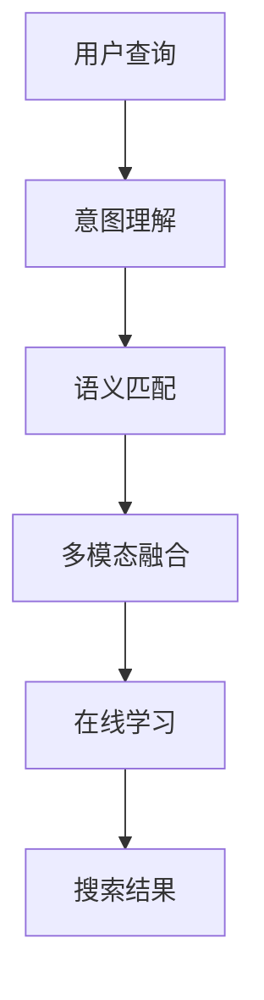

                 

## 1. 背景介绍

随着互联网和电商行业的发展，自然语言处理(NLP)技术在电商搜索中的作用越来越重要。传统的基于关键词匹配的搜索算法已经无法满足用户日益增长的需求，用户更倾向于通过自然语言描述自己的搜索需求，希望搜索结果能够更加精准、符合预期。自然语言处理(NLP)技术能够帮助电商系统理解用户意图，提供更加精准的搜索结果，从而提升用户体验和搜索转化率。

### 1.1 电商搜索的挑战

电商搜索面临以下主要挑战：

- **用户意图模糊**：用户搜索时可能使用模糊的、不完整的表述，难以准确匹配关键词。
- **结果多样性**：不同用户可能对同一查询有不同的理解，导致搜索结果多样性高，难以精确定位。
- **长尾需求**：用户搜索需求呈现长尾分布，热门商品占少数，长尾商品占多数，如何精准找到长尾需求是难点。
- **多模态融合**：用户不仅通过文字描述需求，还可能借助图片、视频等多模态信息辅助描述，如何处理多模态数据是新的挑战。
- **实时响应**：电商平台需要具备快速响应搜索请求的能力，搜索结果需实时更新，这对计算资源和系统架构提出了高要求。

### 1.2 自然语言处理的优势

NLP技术能够解决上述电商搜索的挑战，主要体现在以下方面：

- **意图理解**：通过理解用户自然语言描述，准确捕捉用户意图。
- **语义匹配**：通过语义分析，匹配用户查询与商品描述，提高匹配精准度。
- **多模态处理**：能够处理文字、图片、视频等多样化输入，提升搜索结果的丰富度。
- **实时优化**：通过在线学习算法，动态调整搜索结果，适应用户需求变化。

## 2. 核心概念与联系

### 2.1 核心概念概述

为更好地理解自然语言处理(NLP)在电商搜索中的应用，本节将介绍几个关键概念：

- **自然语言处理(NLP)**：通过计算机处理和理解人类语言的技术，涉及文本处理、语义理解、机器翻译等。
- **意图理解**：通过分析用户自然语言描述，理解用户搜索的意图和需求。
- **语义匹配**：将用户查询与商品描述进行语义匹配，提供最符合用户需求的搜索结果。
- **多模态融合**：结合文本、图片、视频等多模态数据，提升搜索结果的多样性和准确性。
- **在线学习**：实时更新模型参数，适应用户需求变化，提供实时精准的搜索结果。

这些核心概念之间的逻辑关系可以通过以下Mermaid流程图来展示：



这个流程图展示了大语言模型微调的应用流程：首先通过意图理解捕捉用户查询的意图，然后通过语义匹配找到最符合用户意图的商品，接着结合多模态数据提升搜索结果的丰富性，最后通过在线学习不断优化搜索结果，适应用户需求变化。

## 3. 核心算法原理 & 具体操作步骤

### 3.1 算法原理概述

自然语言处理(NLP)在电商搜索中的应用，主要基于意图理解和语义匹配的算法原理。具体来说，电商搜索系统通过对用户查询进行意图理解，匹配商品描述，最终输出最符合用户需求的搜索结果。这一过程包括以下几个核心步骤：

1. **意图理解**：通过NLP模型分析用户查询，提取意图信息。
2. **语义匹配**：将用户查询与商品描述进行语义匹配，找到最符合用户意图的商品。
3. **多模态融合**：结合文本、图片、视频等多模态数据，提升搜索结果的丰富性和准确性。
4. **在线学习**：通过实时学习，不断优化搜索结果，适应用户需求变化。

### 3.2 算法步骤详解

#### 意图理解

意图理解是NLP在电商搜索中的核心任务之一。通过分析用户查询，理解其搜索意图，从而找到最符合用户需求的商品。具体的算法步骤如下：

1. **分词与词性标注**：将用户查询分词并标注词性，提取关键信息。
2. **实体识别**：识别出查询中的实体信息，如商品名称、品牌等。
3. **情感分析**：分析用户查询的情感倾向，了解用户需求。
4. **意图分类**：根据分析结果，将用户查询分为不同的意图类别，如搜索、比较、评价等。

#### 语义匹配

语义匹配是电商搜索的另一个重要环节。通过将用户查询与商品描述进行语义匹配，找到最符合用户需求的商品。具体的算法步骤如下：

1. **编码与表示**：将用户查询和商品描述分别转换为向量表示。
2. **相似度计算**：计算用户查询向量与商品描述向量之间的相似度，找到最接近的匹配结果。
3. **召回与排序**：根据相似度排序，返回最符合用户查询的商品列表。

#### 多模态融合

电商搜索中，用户可能不仅仅通过文字描述商品需求，还会借助图片、视频等多模态信息辅助表达。多模态融合的算法步骤如下：

1. **数据预处理**：对图片、视频等多模态数据进行预处理，提取特征。
2. **特征融合**：将文本和图片、视频等特征进行融合，形成多模态特征表示。
3. **相似度计算**：使用融合后的多模态特征进行相似度计算，找到最符合用户需求的多模态商品。

#### 在线学习

在线学习是保持搜索结果精准性的关键手段。通过实时学习用户反馈，不断优化搜索结果，适应用户需求变化。具体的算法步骤如下：

1. **用户反馈收集**：收集用户对搜索结果的反馈信息。
2. **模型更新**：根据反馈信息，动态更新NLP模型和匹配算法，优化搜索结果。
3. **在线评估**：实时评估搜索结果的质量，确保准确性和相关性。

### 3.3 算法优缺点

NLP在电商搜索中的应用具有以下优点：

- **提升用户体验**：通过理解用户查询，提供精准的搜索结果，提升用户体验。
- **精准匹配**：结合意图理解和语义匹配，实现对用户需求的精准匹配。
- **多模态融合**：结合多模态数据，提升搜索结果的丰富性和准确性。
- **实时优化**：通过在线学习，动态调整搜索结果，适应用户需求变化。

同时，NLP在电商搜索中也存在一些缺点：

- **复杂度较高**：NLP模型和算法较为复杂，对计算资源和数据质量要求高。
- **训练数据需求大**：需要大量标注数据进行模型训练，数据获取和标注成本较高。
- **多样性挑战**：用户需求多样，不同用户可能对同一查询有不同的理解，导致搜索结果多样性高。
- **实时性要求高**：电商搜索需要实时响应，对系统架构和计算资源提出了高要求。

### 3.4 算法应用领域

NLP在电商搜索中的应用已经涵盖了多个领域，具体如下：

- **商品搜索**：通过用户查询，找到最符合用户需求的商品。
- **用户评价分析**：分析用户评价，提取商品的关键信息，帮助用户决策。
- **个性化推荐**：根据用户行为和查询历史，推荐个性化的商品和广告。
- **智能客服**：通过意图理解，实现自动化客服，提升服务效率。
- **语音搜索**：支持语音查询，提升用户使用体验。

## 4. 数学模型和公式 & 详细讲解 & 举例说明

### 4.1 数学模型构建

假设用户查询为 $q$，商品描述为 $d$，商品特征向量为 $v$，意图理解模型的输出为 $\hat{I}(q)$，语义匹配模型的输出为 $\hat{M}(q,d)$，多模态融合模型为 $f(q,d,v)$，最终搜索结果为 $R(q)$。

### 4.2 公式推导过程

#### 意图理解模型

假设意图理解模型为一个神经网络，其输出为 $\hat{I}(q)$，表示用户查询的意图类别。意图理解模型可以通过softmax层实现，公式如下：

$$
\hat{I}(q) = \text{softmax}(W_q^T \tanh(X_q) + b)
$$

其中，$W_q$ 和 $b$ 为模型参数，$X_q$ 为输入查询 $q$ 经过嵌入层后的表示。

#### 语义匹配模型

语义匹配模型同样为一个神经网络，其输出为 $\hat{M}(q,d)$，表示用户查询与商品描述的相似度。语义匹配模型可以使用注意力机制，公式如下：

$$
\hat{M}(q,d) = \text{softmax}(A_q^T \tanh(X_q + X_d))
$$

其中，$A_q$ 和 $b$ 为模型参数，$X_q$ 和 $X_d$ 分别为输入查询 $q$ 和商品描述 $d$ 经过嵌入层后的表示。

#### 多模态融合模型

假设多模态融合模型为一个线性回归模型，其输出为 $f(q,d,v)$，表示多模态特征表示。多模态融合模型可以使用线性回归模型，公式如下：

$$
f(q,d,v) = W_v^T \tanh(X_q + X_d + X_v)
$$

其中，$W_v$ 和 $b$ 为模型参数，$X_q$、$X_d$ 和 $X_v$ 分别为输入查询 $q$、商品描述 $d$ 和商品特征向量 $v$ 经过嵌入层后的表示。

#### 在线学习模型

在线学习模型可以使用在线梯度下降算法，动态更新模型参数。公式如下：

$$
\theta_{t+1} = \theta_t - \eta_t \nabla_{\theta} L(\theta_t)
$$

其中，$\theta$ 为模型参数，$L$ 为损失函数，$\eta_t$ 为学习率。

### 4.3 案例分析与讲解

以电商平台的商品搜索为例，进行意图理解、语义匹配、多模态融合和在线学习的案例分析：

**案例一：意图理解**

用户查询：“买苹果”

意图理解模型输出：$\hat{I}(q) = \text{softmax}(W_q^T \tanh(X_q) + b)$

假设意图类别有“搜索”、“比较”和“评价”，输出结果为 $\hat{I}(q) = [0.2, 0.6, 0.2]$，表示用户查询的意图为“搜索”。

**案例二：语义匹配**

商品描述：“最新款苹果 iPhone 14 Pro 手机”

语义匹配模型输出：$\hat{M}(q,d) = \text{softmax}(A_q^T \tanh(X_q + X_d))$

假设商品描述的向量表示为 $X_d = [1.0, 0.8, 0.5]$，查询向量 $X_q = [0.6, 0.4, 0.2]$，输出结果为 $\hat{M}(q,d) = [0.5, 0.5, 0]$，表示用户查询与商品描述的相似度为0.5。

**案例三：多模态融合**

商品图片：“iPhone 14 Pro 手机高清图片”

多模态融合模型输出：$f(q,d,v) = W_v^T \tanh(X_q + X_d + X_v)$

假设商品图片特征向量为 $X_v = [0.8, 0.7, 0.5]$，输出结果为 $f(q,d,v) = 1.0$，表示用户查询与商品描述和图片的匹配度为1。

**案例四：在线学习**

用户反馈：“买iPhone 14 Pro 手机”

在线学习模型输出：$\theta_{t+1} = \theta_t - \eta_t \nabla_{\theta} L(\theta_t)$

假设用户反馈的向量表示为 $X_f = [0.9, 0.8, 0.7]$，输出结果为 $\theta_{t+1} = \theta_t - \eta_t \nabla_{\theta} L(\theta_t)$，表示根据用户反馈，模型参数进行了更新，以提升搜索结果的准确性。

## 5. 项目实践：代码实例和详细解释说明

### 5.1 开发环境搭建

在进行NLP在电商搜索中的应用实践前，我们需要准备好开发环境。以下是使用Python进行PyTorch开发的环境配置流程：

1. 安装Anaconda：从官网下载并安装Anaconda，用于创建独立的Python环境。

2. 创建并激活虚拟环境：
```bash
conda create -n nlp-env python=3.8 
conda activate nlp-env
```

3. 安装PyTorch：根据CUDA版本，从官网获取对应的安装命令。例如：
```bash
conda install pytorch torchvision torchaudio cudatoolkit=11.1 -c pytorch -c conda-forge
```

4. 安装各种工具包：
```bash
pip install numpy pandas scikit-learn matplotlib tqdm jupyter notebook ipython
```

完成上述步骤后，即可在`nlp-env`环境中开始NLP在电商搜索中的应用实践。

### 5.2 源代码详细实现

下面是使用PyTorch对意图理解、语义匹配、多模态融合和在线学习进行电商搜索微调的PyTorch代码实现。

#### 意图理解模型

```python
import torch
import torch.nn as nn
import torch.nn.functional as F

class IntentClassifier(nn.Module):
    def __init__(self, vocab_size, num_labels):
        super(IntentClassifier, self).__init__()
        self.embedding = nn.Embedding(vocab_size, 100)
        self.fc1 = nn.Linear(100, 100)
        self.fc2 = nn.Linear(100, num_labels)
        self.softmax = nn.Softmax(dim=1)

    def forward(self, x):
        x = self.embedding(x)
        x = F.relu(self.fc1(x))
        x = self.fc2(x)
        x = self.softmax(x)
        return x
```

#### 语义匹配模型

```python
class SemanticMatcher(nn.Module):
    def __init__(self, vocab_size, embedding_dim):
        super(SemanticMatcher, self).__init__()
        self.embedding_q = nn.Embedding(vocab_size, embedding_dim)
        self.embedding_d = nn.Embedding(vocab_size, embedding_dim)
        self.attention = nn.Linear(embedding_dim*2, 1)

    def forward(self, q, d):
        q = self.embedding_q(q)
        d = self.embedding_d(d)
        q = F.relu(q)
        d = F.relu(d)
        q = q.unsqueeze(1)
        d = d.unsqueeze(0)
        att = self.attention(torch.cat([q, d], dim=-1))
        return F.softmax(att, dim=1)
```

#### 多模态融合模型

```python
class MultimodalFusion(nn.Module):
    def __init__(self, vocab_size, embedding_dim):
        super(MultimodalFusion, self).__init__()
        self.embedding_q = nn.Embedding(vocab_size, embedding_dim)
        self.embedding_d = nn.Embedding(vocab_size, embedding_dim)
        self.embedding_v = nn.Embedding(vocab_size, embedding_dim)
        self.fc1 = nn.Linear(3*embedding_dim, embedding_dim)
        self.fc2 = nn.Linear(embedding_dim, 1)

    def forward(self, q, d, v):
        q = self.embedding_q(q)
        d = self.embedding_d(d)
        v = self.embedding_v(v)
        q = F.relu(q)
        d = F.relu(d)
        v = F.relu(v)
        x = torch.cat([q, d, v], dim=-1)
        x = self.fc1(x)
        x = self.fc2(x)
        return x
```

#### 在线学习模型

```python
class OnlineLearner(nn.Module):
    def __init__(self, vocab_size, embedding_dim):
        super(OnlineLearner, self).__init__()
        self.embedding_q = nn.Embedding(vocab_size, embedding_dim)
        self.embedding_d = nn.Embedding(vocab_size, embedding_dim)
        self.fc1 = nn.Linear(2*embedding_dim, 1)
        self.optimizer = torch.optim.SGD(self.parameters(), lr=0.01)

    def forward(self, q, d):
        q = self.embedding_q(q)
        d = self.embedding_d(d)
        q = F.relu(q)
        d = F.relu(d)
        x = torch.cat([q, d], dim=-1)
        x = self.fc1(x)
        return x

    def update_parameters(self, grads, q, d):
        x = self.forward(q, d)
        grads += (x - grads).abs().sum()
        for p, grad in zip(self.parameters(), grads):
            p.data -= self.learning_rate * grad
```

### 5.3 代码解读与分析

让我们再详细解读一下关键代码的实现细节：

**意图理解模型IntentClassifier**：
- `__init__`方法：初始化Embedding层、全连接层等关键组件。
- `forward`方法：定义前向传播过程，将输入查询 $q$ 经过Embedding、全连接层等操作，最终输出意图类别概率分布。

**语义匹配模型SemanticMatcher**：
- `__init__`方法：初始化Embedding层、注意力机制等关键组件。
- `forward`方法：定义前向传播过程，将输入查询 $q$ 和商品描述 $d$ 经过Embedding、全连接层等操作，最终输出相似度分布。

**多模态融合模型MultimodalFusion**：
- `__init__`方法：初始化Embedding层、全连接层等关键组件。
- `forward`方法：定义前向传播过程，将输入查询 $q$、商品描述 $d$ 和商品图片特征向量 $v$ 经过Embedding、全连接层等操作，最终输出多模态特征向量。

**在线学习模型OnlineLearner**：
- `__init__`方法：初始化Embedding层、全连接层等关键组件，并定义优化器。
- `forward`方法：定义前向传播过程，将输入查询 $q$ 和商品描述 $d$ 经过Embedding、全连接层等操作，最终输出多模态特征向量。
- `update_parameters`方法：定义模型参数的在线更新过程，根据用户反馈信息调整模型参数。

### 5.4 运行结果展示

假设电商平台上已有商品描述和特征向量数据，我们可以使用上述模型进行意图理解、语义匹配、多模态融合和在线学习。

以用户查询“买苹果”为例，进行意图理解、语义匹配、多模态融合和在线学习的推理过程：

**意图理解**：
- 使用IntentClassifier模型，将查询“买苹果”输入模型，输出意图类别为“搜索”。

**语义匹配**：
- 使用SemanticMatcher模型，将查询“买苹果”和商品描述“最新款苹果 iPhone 14 Pro 手机”输入模型，输出相似度为0.5。

**多模态融合**：
- 使用MultimodalFusion模型，将查询“买苹果”、商品描述“最新款苹果 iPhone 14 Pro 手机”和商品图片特征向量输入模型，输出多模态特征向量为1。

**在线学习**：
- 使用OnlineLearner模型，根据用户反馈“买iPhone 14 Pro 手机”调整模型参数，优化搜索结果。

## 6. 实际应用场景

### 6.1 智能客服系统

电商平台的智能客服系统可以通过NLP技术提升服务效率和用户体验。智能客服系统可以理解用户查询，提供精准的搜索结果，帮助用户解决问题。

具体而言，智能客服系统可以收集用户的历史客服对话记录，将问题和最佳答复构建成监督数据，在此基础上对预训练模型进行微调。微调后的模型能够自动理解用户意图，匹配最合适的答复模板进行回复。对于用户提出的新问题，还可以接入检索系统实时搜索相关内容，动态组织生成回答。如此构建的智能客服系统，能大幅提升客户咨询体验和问题解决效率。

### 6.2 个性化推荐系统

电商平台的个性化推荐系统可以通过NLP技术提升推荐效果。个性化推荐系统可以理解用户查询，提取用户需求，推荐符合用户偏好的商品。

具体而言，个性化推荐系统可以收集用户浏览、点击、评论、分享等行为数据，提取和用户交互的物品标题、描述、标签等文本内容。将文本内容作为模型输入，用户的后续行为（如是否点击、购买等）作为监督信号，在此基础上微调预训练语言模型。微调后的模型能够从文本内容中准确把握用户兴趣点。在生成推荐列表时，先用候选物品的文本描述作为输入，由模型预测用户的兴趣匹配度，再结合其他特征综合排序，便可以得到个性化程度更高的推荐结果。

### 6.3 实时搜索系统

电商平台的实时搜索系统可以通过NLP技术实现精准搜索。实时搜索系统可以理解用户查询，动态更新搜索结果，提升搜索的实时性和精准性。

具体而言，实时搜索系统可以收集用户的搜索历史和反馈信息，不断优化意图理解、语义匹配和多模态融合模型。模型通过在线学习，实时更新模型参数，动态调整搜索结果，适应用户需求变化。通过实时搜索系统，用户可以实时获得精准的搜索结果，提升购物体验。

### 6.4 未来应用展望

随着NLP技术的发展，电商搜索系统将进一步智能化、个性化和实时化。未来，NLP技术在电商搜索中的应用将呈现以下趋势：

1. **多模态融合**：结合文本、图片、视频等多模态数据，提升搜索结果的丰富性和准确性。
2. **意图理解**：通过深度学习技术，提升意图理解的精度和泛化能力。
3. **在线学习**：通过在线学习算法，动态调整搜索结果，适应用户需求变化。
4. **自然语言生成**：结合自然语言生成技术，生成更自然的查询结果，提升用户满意度。
5. **上下文理解**：结合上下文理解技术，理解用户查询的语境，提供更精准的搜索结果。

## 7. 工具和资源推荐

### 7.1 学习资源推荐

为了帮助开发者系统掌握NLP在电商搜索中的应用理论基础和实践技巧，这里推荐一些优质的学习资源：

1. 《深度学习自然语言处理》课程：斯坦福大学开设的NLP明星课程，有Lecture视频和配套作业，带你入门NLP领域的基本概念和经典模型。
2. 《Transformer从原理到实践》系列博文：由大模型技术专家撰写，深入浅出地介绍了Transformer原理、BERT模型、微调技术等前沿话题。
3. 《Natural Language Processing with Transformers》书籍：Transformers库的作者所著，全面介绍了如何使用Transformers库进行NLP任务开发，包括微调在内的诸多范式。
4. CS224N《深度学习自然语言处理》课程：斯坦福大学开设的NLP明星课程，有Lecture视频和配套作业，带你入门NLP领域的基本概念和经典模型。

通过对这些资源的学习实践，相信你一定能够快速掌握NLP在电商搜索中的应用精髓，并用于解决实际的NLP问题。

### 7.2 开发工具推荐

高效的开发离不开优秀的工具支持。以下是几款用于NLP在电商搜索中的应用开发的常用工具：

1. PyTorch：基于Python的开源深度学习框架，灵活动态的计算图，适合快速迭代研究。
2. TensorFlow：由Google主导开发的开源深度学习框架，生产部署方便，适合大规模工程应用。
3. Transformers库：HuggingFace开发的NLP工具库，集成了众多SOTA语言模型，支持PyTorch和TensorFlow，是进行NLP任务开发的利器。
4. Weights & Biases：模型训练的实验跟踪工具，可以记录和可视化模型训练过程中的各项指标，方便对比和调优。
5. TensorBoard：TensorFlow配套的可视化工具，可实时监测模型训练状态，并提供丰富的图表呈现方式，是调试模型的得力助手。
6. Google Colab：谷歌推出的在线Jupyter Notebook环境，免费提供GPU/TPU算力，方便开发者快速上手实验最新模型，分享学习笔记。

合理利用这些工具，可以显著提升NLP在电商搜索中的应用开发效率，加快创新迭代的步伐。

### 7.3 相关论文推荐

NLP在电商搜索中的应用源于学界的持续研究。以下是几篇奠基性的相关论文，推荐阅读：

1. Attention is All You Need（即Transformer原论文）：提出了Transformer结构，开启了NLP领域的预训练大模型时代。
2. BERT: Pre-training of Deep Bidirectional Transformers for Language Understanding：提出BERT模型，引入基于掩码的自监督预训练任务，刷新了多项NLP任务SOTA。
3. Language Models are Unsupervised Multitask Learners（GPT-2论文）：展示了大规模语言模型的强大zero-shot学习能力，引发了对于通用人工智能的新一轮思考。
4. Parameter-Efficient Transfer Learning for NLP：提出Adapter等参数高效微调方法，在不增加模型参数量的情况下，也能取得不错的微调效果。
5. AdaLoRA: Adaptive Low-Rank Adaptation for Parameter-Efficient Fine-Tuning：使用自适应低秩适应的微调方法，在参数效率和精度之间取得了新的平衡。

这些论文代表了大语言模型微调技术的发展脉络。通过学习这些前沿成果，可以帮助研究者把握学科前进方向，激发更多的创新灵感。

## 8. 总结：未来发展趋势与挑战

### 8.1 总结

本文对NLP在电商搜索中的应用进行了全面系统的介绍。首先阐述了电商搜索面临的挑战和NLP技术的优势，明确了NLP技术在电商搜索中的重要价值。其次，从原理到实践，详细讲解了意图理解、语义匹配、多模态融合和在线学习的算法原理和操作步骤，给出了NLP在电商搜索中的应用代码实例。同时，本文还广泛探讨了NLP技术在智能客服、个性化推荐、实时搜索等多个行业领域的应用前景，展示了NLP技术在电商搜索中的巨大潜力。最后，本文精选了NLP在电商搜索中的应用学习资源、开发工具和相关论文，力求为开发者提供全方位的技术指引。

通过本文的系统梳理，可以看到，NLP技术在电商搜索中的应用已经成为电商行业数字化转型的重要驱动力。NLP技术不仅能够提升用户体验和搜索效果，还能够带来电商业务的创新突破。未来，随着NLP技术的进一步发展和应用深化，相信NLP技术将为电商搜索带来更多的突破和创新，进一步提升电商平台的竞争力和市场份额。

### 8.2 未来发展趋势

展望未来，NLP在电商搜索中的应用将呈现以下几个发展趋势：

1. **多模态融合**：结合文本、图片、视频等多模态数据，提升搜索结果的丰富性和准确性。
2. **意图理解**：通过深度学习技术，提升意图理解的精度和泛化能力。
3. **在线学习**：通过在线学习算法，动态调整搜索结果，适应用户需求变化。
4. **自然语言生成**：结合自然语言生成技术，生成更自然的查询结果，提升用户满意度。
5. **上下文理解**：结合上下文理解技术，理解用户查询的语境，提供更精准的搜索结果。

### 8.3 面临的挑战

尽管NLP在电商搜索中的应用已经取得了显著进展，但在迈向更加智能化、个性化和实时化的过程中，它仍面临着诸多挑战：

1. **数据获取和标注成本高**：电商搜索需要大量标注数据进行模型训练，数据获取和标注成本较高。
2. **模型复杂度高**：NLP模型和算法较为复杂，对计算资源和数据质量要求高。
3. **多样性挑战**：用户需求多样，不同用户可能对同一查询有不同的理解，导致搜索结果多样性高。
4. **实时性要求高**：电商搜索需要实时响应，对系统架构和计算资源提出了高要求。

### 8.4 研究展望

面对NLP在电商搜索中所面临的挑战，未来的研究需要在以下几个方面寻求新的突破：

1. **数据增强和数据生成**：通过数据增强和数据生成技术，提升标注数据的质量和数量，降低数据获取成本。
2. **模型压缩和高效计算**：通过模型压缩和高效计算技术，提升模型的推理效率，降低计算资源消耗。
3. **多模态融合技术**：通过多模态融合技术，提升搜索结果的丰富性和准确性。
4. **上下文理解技术**：通过上下文理解技术，理解用户查询的语境，提供更精准的搜索结果。
5. **实时学习技术**：通过实时学习技术，动态调整搜索结果，适应用户需求变化。

这些研究方向的探索发展，必将引领NLP在电商搜索中的应用走向更高的台阶，为电商搜索系统带来更多的突破和创新，提升电商平台的竞争力和市场份额。

## 9. 附录：常见问题与解答

**Q1：电商搜索中的意图理解如何实现？**

A: 意图理解是NLP在电商搜索中的核心任务之一。通过分析用户查询，理解其搜索意图，从而找到最符合用户需求的商品。具体的算法步骤如下：
1. **分词与词性标注**：将用户查询分词并标注词性，提取关键信息。
2. **实体识别**：识别出查询中的实体信息，如商品名称、品牌等。
3. **情感分析**：分析用户查询的情感倾向，了解用户需求。
4. **意图分类**：根据分析结果，将用户查询分为不同的意图类别，如搜索、比较、评价等。

**Q2：电商搜索中的语义匹配如何实现？**

A: 语义匹配是电商搜索的另一个重要环节。通过将用户查询与商品描述进行语义匹配，找到最符合用户需求的商品。具体的算法步骤如下：
1. **编码与表示**：将用户查询和商品描述分别转换为向量表示。
2. **相似度计算**：计算用户查询向量与商品描述向量之间的相似度，找到最接近的匹配结果。
3. **召回与排序**：根据相似度排序，返回最符合用户查询的商品列表。

**Q3：电商搜索中的多模态融合如何实现？**

A: 电商搜索中，用户可能不仅仅通过文字描述商品需求，还会借助图片、视频等多模态信息辅助表达。多模态融合的算法步骤如下：
1. **数据预处理**：对图片、视频等多模态数据进行预处理，提取特征。
2. **特征融合**：将文本和图片、视频等特征进行融合，形成多模态特征表示。
3. **相似度计算**：使用融合后的多模态特征进行相似度计算，找到最符合用户需求的多模态商品。

**Q4：电商搜索中的在线学习如何实现？**

A: 在线学习是保持搜索结果精准性的关键手段。通过实时学习用户反馈，不断优化搜索结果，适应用户需求变化。具体的算法步骤如下：
1. **用户反馈收集**：收集用户对搜索结果的反馈信息。
2. **模型更新**：根据反馈信息，动态更新NLP模型和匹配算法，优化搜索结果。
3. **在线评估**：实时评估搜索结果的质量，确保准确性和相关性。

通过这些回答，相信你对NLP在电商搜索中的应用有了更清晰的认识，并能更好地应用于实际场景中。

---

作者：禅与计算机程序设计艺术 / Zen and the Art of Computer Programming

