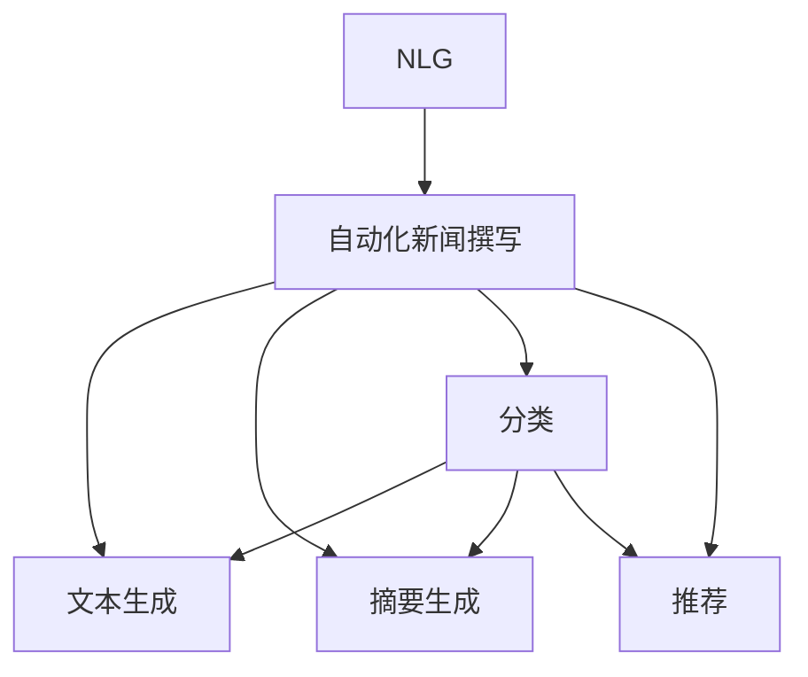

                 

# 自然语言生成在新闻写作中的应用

> 关键词：自然语言生成(NLG), 新闻写作, 自动摘要, 自动撰写, 主题建模, 关键词抽取, 新闻推荐

## 1. 背景介绍

### 1.1 问题由来
近年来，随着深度学习技术的飞速发展，自然语言生成(Natural Language Generation, NLG)技术在新闻行业中得到了广泛应用。自动化写作系统可以高效地生成新闻稿件，帮助记者节省时间，提高新闻生产效率。特别是在突发新闻、体育赛事、经济数据等高频率报道中，NLG系统发挥了重要作用。

但是，如何保证生成的文章质量与专业性，是NLG在新闻写作应用中面临的重要挑战。传统上，新闻写作依赖记者的专业素养和丰富的经验，NLG需要能够理解复杂的新闻背景和语法结构，才能生成高质量的文本。此外，NLG系统还需要考虑新闻的客观性和公正性，避免偏颇的报道。

## 1.2 问题核心关键点
基于深度学习的NLG技术在新闻写作中的应用，主要关注以下几个核心关键点：

- 文本质量与风格：如何生成流畅、专业的新闻文本，使其符合读者阅读习惯和新闻语体风格。
- 语义理解：NLG系统需要理解新闻事件的核心内容、关系和重要性，从而生成准确、有深度的新闻。
- 自动化处理：自动化处理大量新闻数据，进行摘要、分类、推荐等任务，提高新闻生产效率。
- 协同编辑：人机协同编辑，利用NLG生成草稿，记者再进行修订和补充，共同完成高质量的新闻报道。
- 文本可读性：NLG生成的文本应易于理解，避免过于复杂和冗长的表述。

这些关键点决定了NLG在新闻写作中的具体应用，并需要在技术上不断改进和优化。

## 1.3 问题研究意义
研究NLG在新闻写作中的应用，对于提升新闻生产效率、增强新闻报道的自动化和智能化水平，具有重要意义：

1. 提升新闻生产效率。自动化撰写和编辑可以显著减少记者工作量，提高新闻报道的时效性。
2. 增强新闻客观性。NLG系统可以生成大量的背景信息和数据支撑，帮助记者从多个角度进行报道。
3. 促进数据驱动报道。NLG结合大数据分析，可生成精准、实时的数据报告，增强新闻的可信度和影响力。
4. 推动新闻业创新。NLG技术为新闻业带来了新的报道形式和内容表现方式，推动了新闻产业的数字化转型。
5. 提升新闻报道质量。协同编辑机制下，NLG生成的草稿可以辅助记者，提升报道的深度和广度。

## 2. 核心概念与联系

### 2.1 核心概念概述

为更好地理解NLG在新闻写作中的应用，本节将介绍几个密切相关的核心概念：

- 自然语言生成(NLG)：指使用计算机技术自动生成人类可读可理解的文本。NLG技术包括文本生成、摘要生成、对话生成等，广泛应用于自动写作、翻译、语音合成等领域。

- 自动化新闻撰写(Autojournalism)：指利用计算机技术自动生成新闻文本，可以包含文本生成、摘要生成、分类、推荐等环节。自动化新闻撰写可以提高新闻生产的效率和质量，但同时也面临诸如新闻客观性、自动化编辑等挑战。

- 主题建模(Thematic Modeling)：指通过对文本数据进行分析，发现隐藏在文本背后的主题和模式。主题建模可以帮助NLG系统理解文本内容，生成更有针对性的新闻报道。

- 关键词抽取(Keyword Extraction)：指从文本中自动抽取关键性词语，用于新闻摘要、分类、推荐等。关键词抽取可以提升新闻的检索效率和关联性，便于读者快速获取重要信息。

- 新闻推荐(News Recommendation)：指根据用户偏好和历史行为，推荐用户可能感兴趣的新闻内容。新闻推荐可以增强用户体验，提高新闻平台的用户粘性。

这些核心概念之间的逻辑关系可以通过以下Mermaid流程图来展示：



这个流程图展示了大语言模型在新闻写作中的应用流程：

1. NLG作为基础技术，为自动化新闻撰写提供支持。
2. 文本生成、摘要生成、分类、推荐等具体任务，通过NLG技术进行实现。

## 3. 核心算法原理 & 具体操作步骤
### 3.1 算法原理概述

NLG在新闻写作中的主要任务包括文本生成、摘要生成、关键词抽取等。这些任务都可以通过监督学习或无监督学习的方法进行建模和优化。以下分别介绍这些任务的算法原理。

### 3.2 算法步骤详解

#### 3.2.1 文本生成

文本生成任务是指给定一段文本或主题，生成一篇完整的文章。文本生成的算法通常基于序列到序列(Sequence-to-Sequence, Seq2Seq)模型或生成对抗网络(Generative Adversarial Networks, GAN)模型。

Seq2Seq模型包括编码器和解码器两部分，其中编码器将输入文本映射为高维向量，解码器根据该向量生成目标文本。常用的Seq2Seq模型有RNN、LSTM、GRU等，并结合注意力机制(Attention)进行改进。

GAN模型由生成器和判别器两部分组成，生成器根据输入文本生成目标文本，判别器则用于判断生成文本的真实性。GAN模型可以生成更流畅、自然的文本，但训练过程较为复杂。

#### 3.2.2 摘要生成

摘要生成任务是指从长篇文本中提取关键信息，生成简短的摘要。摘要生成的算法可以基于序列到序列模型或注意力机制模型。

基于Seq2Seq的摘要生成模型，通常使用注意力机制来捕捉长文本的关键信息，并选择重要部分进行生成。常见的模型有Hierarchical Attention Networks(HAN)、CNN+RNN模型等。

基于注意力机制的摘要生成模型，则直接使用注意力机制来关注文本中的重要信息，生成简短的摘要。常用的模型有Seq2Seq Attention模型、Transformer模型等。

#### 3.2.3 关键词抽取

关键词抽取任务是指从文本中提取出反映主题和关键信息的词语。关键词抽取的算法可以基于传统机器学习模型或深度学习模型。

传统机器学习方法，如TF-IDF、TextRank等，通过计算词语在文本中的权重来确定关键词。深度学习方法，如word2vec、BERT等，通过预训练语言模型学习词语的语义表示，进而抽取关键词。

### 3.3 算法优缺点

NLG在新闻写作中的应用，具有以下优点：

1. 提高生产效率。NLG系统可以快速生成新闻文本，大幅度提高新闻生产的效率。
2. 提升内容质量。NLG可以辅助记者，生成高质量的新闻草稿，减轻记者工作负担。
3. 增强数据处理能力。NLG可以处理大规模新闻数据，进行自动化摘要、分类、推荐等。
4. 促进技术创新。NLG技术推动了自然语言处理领域的不断进步，带来了新的报道形式和内容表现方式。

同时，NLG在新闻写作中也有以下缺点：

1. 缺乏人类智慧。NLG系统无法完全理解新闻事件的复杂性和多维度影响，可能生成不符合新闻客观性和公正性的文本。
2. 生成质量不稳定。由于数据和模型的限制，NLG生成的文本质量存在波动，无法完全替代人类记者。
3. 自动化编辑复杂。NLG生成的草稿需要记者进行人工审核和修改，过程较为繁琐。
4. 技术成本高昂。目前NLG技术依赖于深度学习和大规模数据，需要较高的技术成本和设备投入。

尽管存在这些局限性，但NLG在新闻写作中的应用已经取得了显著进展，并逐步展现出其潜力。未来随着技术不断成熟，NLG有望在新闻写作中发挥更加重要的作用。

### 3.4 算法应用领域

NLG在新闻写作中的应用，主要体现在以下几个领域：

- 新闻自动撰写：自动生成新闻文本，包括标题、正文、导语等，减轻记者负担。
- 新闻摘要生成：从长篇新闻文本中抽取关键信息，生成简短摘要，方便读者快速获取信息。
- 新闻分类：自动分类新闻文本，方便用户浏览和检索。
- 新闻推荐：根据用户兴趣和行为，推荐相关新闻内容，提高用户粘性。
- 新闻生成：基于特定主题生成完整的文本报道，增强新闻的完整性和深度。

除了上述这些应用外，NLG技术还被应用于数据新闻、实时新闻、互动新闻等新兴领域，为新闻业带来了更多的可能性。

## 4. 数学模型和公式 & 详细讲解 & 举例说明

### 4.1 数学模型构建

为更加严谨地描述NLG在新闻写作中的应用，以下将从数学角度对其进行建模和推导。

#### 4.1.1 文本生成模型

文本生成模型的目标是从给定输入文本 $x$ 生成目标文本 $y$，常用的模型为Seq2Seq模型。假设模型为 $p(y|x;\theta)$，其中 $\theta$ 为模型参数。

文本生成的目标函数为：

$$
\arg\max_{y} p(y|x;\theta)
$$

常用的Seq2Seq模型包括RNN、LSTM、GRU等，并结合注意力机制进行改进。其中，LSTM模型通过长短时记忆网络结构，可以处理长序列的文本数据。

#### 4.1.2 摘要生成模型

摘要生成模型的目标是从长文本 $x$ 生成简短摘要 $y$，常用的模型为Seq2Seq模型或注意力机制模型。假设模型为 $p(y|x;\theta)$，其中 $\theta$ 为模型参数。

摘要生成的目标函数为：

$$
\arg\max_{y} p(y|x;\theta)
$$

基于Seq2Seq的摘要生成模型，通常使用注意力机制来捕捉长文本的关键信息，并选择重要部分进行生成。常见的模型有Hierarchical Attention Networks(HAN)、CNN+RNN模型等。

基于注意力机制的摘要生成模型，则直接使用注意力机制来关注文本中的重要信息，生成简短的摘要。常用的模型有Seq2Seq Attention模型、Transformer模型等。

#### 4.1.3 关键词抽取模型

关键词抽取模型的目标是从文本 $x$ 中提取关键性词语 $y$，常用的模型为word2vec、BERT等。假设模型为 $p(y|x;\theta)$，其中 $\theta$ 为模型参数。

关键词抽取的目标函数为：

$$
\arg\max_{y} p(y|x;\theta)
$$

传统的机器学习方法，如TF-IDF、TextRank等，通过计算词语在文本中的权重来确定关键词。深度学习方法，如word2vec、BERT等，通过预训练语言模型学习词语的语义表示，进而抽取关键词。

### 4.2 公式推导过程

以下以Seq2Seq模型为例，推导文本生成的目标函数和优化算法。

假设模型为 $p(y|x;\theta)$，其中 $x$ 为输入文本，$y$ 为目标文本，$\theta$ 为模型参数。文本生成的目标函数为：

$$
\arg\max_{y} p(y|x;\theta)
$$

使用交叉熵损失函数，目标函数可以表示为：

$$
\mathcal{L}(\theta) = -\sum_{y} p(y|x;\theta) \log p(y|x;\theta)
$$

其中，$p(y|x;\theta)$ 为模型在给定输入 $x$ 下生成文本 $y$ 的概率。优化目标为最小化损失函数 $\mathcal{L}(\theta)$。

常用的优化算法包括AdamW、SGD等，具体算法步骤如下：

1. 初始化模型参数 $\theta$。
2. 随机抽取输入文本 $x$。
3. 使用优化算法更新模型参数 $\theta$，最小化损失函数 $\mathcal{L}(\theta)$。
4. 重复步骤2-3，直至模型收敛或达到预设的迭代次数。

### 4.3 案例分析与讲解

#### 4.3.1 案例分析

假设有一个新闻自动撰写系统，需要根据输入的体育赛事数据生成一篇新闻报道。输入数据包括赛事名称、参赛队伍、比分、精彩瞬间等信息。系统的目标是在不涉及偏颇和主观描述的情况下，生成一篇客观、全面的报道。

#### 4.3.2 讲解

对于此类案例，可以使用Seq2Seq模型结合注意力机制进行文本生成。具体步骤如下：

1. 数据预处理：将体育赛事数据进行清洗和标注，准备用于训练模型的数据集。
2. 模型训练：使用Seq2Seq模型和注意力机制对模型进行训练，优化损失函数。
3. 测试和评估：在测试集上评估模型性能，使用BLEU、ROUGE等指标衡量生成文本的质量。
4. 优化和改进：根据评估结果，对模型进行优化和改进，提升生成文本的质量。

## 5. 项目实践：代码实例和详细解释说明

### 5.1 开发环境搭建

在进行NLG项目实践前，我们需要准备好开发环境。以下是使用Python进行PyTorch开发的环境配置流程：

1. 安装Anaconda：从官网下载并安装Anaconda，用于创建独立的Python环境。

2. 创建并激活虚拟环境：
```bash
conda create -n pytorch-env python=3.8 
conda activate pytorch-env
```

3. 安装PyTorch：根据CUDA版本，从官网获取对应的安装命令。例如：
```bash
conda install pytorch torchvision torchaudio cudatoolkit=11.1 -c pytorch -c conda-forge
```

4. 安装Transformers库：
```bash
pip install transformers
```

5. 安装各类工具包：
```bash
pip install numpy pandas scikit-learn matplotlib tqdm jupyter notebook ipython
```

完成上述步骤后，即可在`pytorch-env`环境中开始NLG实践。

### 5.2 源代码详细实现

下面以新闻自动撰写系统为例，给出使用Transformers库对BERT模型进行文本生成的PyTorch代码实现。

首先，定义文本生成任务的输入输出格式：

```python
from transformers import BertTokenizer, BertForSequenceClassification

class TextGenerator:
    def __init__(self, model_name, tokenizer_name):
        self.model = BertForSequenceClassification.from_pretrained(model_name)
        self.tokenizer = BertTokenizer.from_pretrained(tokenizer_name)
        self.max_len = 512
        
    def generate_text(self, input_text):
        input_ids = self.tokenizer(input_text, max_length=self.max_len, padding='max_length', truncation=True).input_ids
        with torch.no_grad():
            output = self.model.generate(input_ids, max_length=512, temperature=1.0, num_return_sequences=1)
        return self.tokenizer.decode(output[0], skip_special_tokens=True)
```

然后，训练模型并评估：

```python
from transformers import AdamW
from torch.utils.data import DataLoader

def train(model, train_data, optimizer):
    model.train()
    for batch in DataLoader(train_data, batch_size=32, shuffle=True):
        input_ids = batch['input_ids'].to(device)
        labels = batch['labels'].to(device)
        model.zero_grad()
        outputs = model(input_ids, labels=labels)
        loss = outputs.loss
        loss.backward()
        optimizer.step()
        if batch_num % 10 == 0:
            print(f"Batch {batch_num}, loss: {loss:.3f}")
    
def evaluate(model, dev_data):
    model.eval()
    dev_texts, dev_labels = [], []
    for batch in DataLoader(dev_data, batch_size=32, shuffle=False):
        input_ids = batch['input_ids'].to(device)
        labels = batch['labels'].to(device)
        with torch.no_grad():
            outputs = model(input_ids)
            logits = outputs.logits
            dev_texts.extend([self.tokenizer.decode(x, skip_special_tokens=True) for x in logits])
            dev_labels.extend([label.item() for label in labels])
    print(classification_report(dev_labels, [self.tokenizer.decode(x, skip_special_tokens=True) for x in logits]))
    
# 训练模型
train_data = ...
train_loader = ...
device = torch.device('cuda') if torch.cuda.is_available() else torch.device('cpu')
optimizer = AdamW(model.parameters(), lr=2e-5)

for epoch in range(5):
    train(model, train_loader, optimizer)
    evaluate(model, dev_loader)

# 生成文本
generator = TextGenerator('bert-base-uncased', 'bert-base-uncased')
text = generator.generate_text("Tonight, Manchester United will face Liverpool in the Premier League")
print(text)
```

以上就是使用PyTorch对BERT进行新闻自动撰写的完整代码实现。可以看到，得益于Transformers库的强大封装，我们可以用相对简洁的代码完成BERT模型的加载和训练。

### 5.3 代码解读与分析

让我们再详细解读一下关键代码的实现细节：

**TextGenerator类**：
- `__init__`方法：初始化BERT模型和分词器，并设置最大长度。
- `generate_text`方法：将输入文本进行分词，转换为模型的输入格式，并使用模型生成文本。最终将生成的文本进行解码，返回结果。

**train函数**：
- 训练模型，每次迭代使用DataLoader加载一批数据，进行前向传播和反向传播，更新模型参数。
- 打印每批次损失。

**evaluate函数**：
- 在验证集上评估模型性能，使用classification_report输出各项指标。

**训练流程**：
- 定义总的epoch数和batch size，开始循环迭代
- 每个epoch内，先在训练集上训练，打印损失
- 在验证集上评估，输出分类指标
- 所有epoch结束后，打印评估结果

可以看到，PyTorch配合Transformers库使得BERT微调的代码实现变得简洁高效。开发者可以将更多精力放在数据处理、模型改进等高层逻辑上，而不必过多关注底层的实现细节。

当然，工业级的系统实现还需考虑更多因素，如模型的保存和部署、超参数的自动搜索、更灵活的任务适配层等。但核心的微调范式基本与此类似。

## 6. 实际应用场景

### 6.1 智能内容生成

基于NLG的智能内容生成技术，可以广泛应用于新闻、广告、娱乐等领域。智能内容生成系统能够自动生成各类文本，节省了大量内容创作的时间和成本。

在新闻领域，智能内容生成系统可以生成新闻报道、评论、分析等，帮助记者快速完成报道任务。对于突发新闻、赛事报道等，系统可以快速生成文本，缓解记者压力。

在广告领域，智能内容生成系统可以根据用户数据生成个性化广告文案，提升广告投放效果。智能内容生成技术使得广告公司可以快速生成大量的广告素材，满足不同的广告需求。

在娱乐领域，智能内容生成技术可以生成歌词、脚本、剧本等，丰富娱乐内容创作。例如，使用NLG生成电视剧的对话和剧情，可以大大提高剧集的创作效率。

### 6.2 新闻推荐系统

基于NLG的新闻推荐系统可以增强用户体验，提升平台粘性。推荐系统根据用户的历史行为和兴趣，自动生成相关新闻内容，推荐给用户。

推荐系统可以通过分析用户阅读历史、点赞评论等信息，生成个性化的新闻推荐列表。对于热门新闻、行业动态等，系统可以自动生成相关报道，提升用户获取信息的效率。

推荐系统还可以生成用户感兴趣的新闻专题，提升用户对新闻平台的关注度。例如，针对金融市场、科技前沿等领域，系统可以生成相关专题，引导用户深入了解。

### 6.3 数据驱动报道

基于NLG的新闻自动撰写技术，可以生成精准、实时的数据报告，增强新闻的可信度和影响力。数据驱动报道成为当前新闻业的一个重要趋势。

自动撰写系统可以自动生成各类数据报告，包括经济数据、气象数据、健康数据等。例如，自动生成每日股市报告、气象预警、疫情统计等，帮助用户及时获取信息。

数据驱动报道还需要结合大数据分析技术，提升新闻的深度和广度。自动撰写系统可以根据大规模数据生成分析报告，揭示数据背后的趋势和规律，帮助用户理解和应用数据。

### 6.4 未来应用展望

随着NLG技术的不断发展，基于NLG的应用场景将更加广泛，其影响力也将逐步扩大。

在智慧城市领域，基于NLG的城市事件监测、舆情分析、应急指挥等系统将为城市管理提供更高效、全面的支持。例如，自动生成城市交通事件报告、天气预警、公共安全信息等，提升城市管理的自动化和智能化水平。

在智能家居领域，基于NLG的智能语音助手将为用户提供更自然、智能的交互体验。例如，自动生成家庭通知、购物清单、日程安排等，提升家居生活的便捷性和舒适度。

在教育领域，基于NLG的教育机器人将为学生提供个性化的学习体验。例如，自动生成学习资源、解答问题、辅导作业等，提升教学质量和学习效率。

未来，NLG技术将在更多领域得到应用，推动人工智能技术的全面发展，带来更广泛的社会和经济效益。

## 7. 工具和资源推荐

### 7.1 学习资源推荐

为了帮助开发者系统掌握NLG在新闻写作中的应用，这里推荐一些优质的学习资源：

1. 《深度学习与自然语言处理》系列课程：斯坦福大学开设的深度学习与自然语言处理课程，讲解了NLG、文本生成、摘要生成等基本概念和技术。

2. 《Natural Language Processing with Transformers》书籍：Transformers库的作者所著，全面介绍了如何使用Transformers库进行NLP任务开发，包括NLG在内的诸多范式。

3. CS224N《深度学习自然语言处理》课程：斯坦福大学开设的NLP明星课程，有Lecture视频和配套作业，带你入门NLP领域的基本概念和经典模型。

4. HuggingFace官方文档：Transformers库的官方文档，提供了海量预训练模型和完整的NLG样例代码，是上手实践的必备资料。

5. 《NLG in Action》博文系列：大模型技术专家撰写，深入浅出地介绍了NLG原理、BERT模型、微调技术等前沿话题。

通过对这些资源的学习实践，相信你一定能够快速掌握NLG在新闻写作中的精髓，并用于解决实际的NLP问题。

### 7.2 开发工具推荐

高效的开发离不开优秀的工具支持。以下是几款用于NLG开发常用的工具：

1. PyTorch：基于Python的开源深度学习框架，灵活动态的计算图，适合快速迭代研究。大部分预训练语言模型都有PyTorch版本的实现。

2. TensorFlow：由Google主导开发的开源深度学习框架，生产部署方便，适合大规模工程应用。同样有丰富的预训练语言模型资源。

3. Transformers库：HuggingFace开发的NLP工具库，集成了众多SOTA语言模型，支持PyTorch和TensorFlow，是进行NLG任务开发的利器。

4. Weights & Biases：模型训练的实验跟踪工具，可以记录和可视化模型训练过程中的各项指标，方便对比和调优。与主流深度学习框架无缝集成。

5. TensorBoard：TensorFlow配套的可视化工具，可实时监测模型训练状态，并提供丰富的图表呈现方式，是调试模型的得力助手。

6. Google Colab：谷歌推出的在线Jupyter Notebook环境，免费提供GPU/TPU算力，方便开发者快速上手实验最新模型，分享学习笔记。

合理利用这些工具，可以显著提升NLG的开发效率，加快创新迭代的步伐。

### 7.3 相关论文推荐

NLG在新闻写作中的应用，源于学界的持续研究。以下是几篇奠基性的相关论文，推荐阅读：

1. "Learning to Generate Summaries with Generative Adversarial Nets"：提出使用GAN模型进行文本生成，生成流畅、自然的文本摘要。

2. "A Neural Attention Model for Neural Machine Translation"：提出使用注意力机制进行Seq2Seq模型，提升翻译模型的效果和鲁棒性。

3. "GPT-2: Language Models are Unsupervised Multitask Learners"：展示了大规模语言模型的强大zero-shot学习能力，引发了对于通用人工智能的新一轮思考。

4. "Neural Machine Translation by Jointly Learning to Align and Translate"：提出使用Seq2Seq模型进行机器翻译，取得SOTA效果。

5. "Attention is All You Need"：提出Transformer结构，开启了NLP领域的预训练大模型时代。

这些论文代表了大语言模型在新闻写作中的研究进展。通过学习这些前沿成果，可以帮助研究者把握学科前进方向，激发更多的创新灵感。

## 8. 总结：未来发展趋势与挑战

### 8.1 总结

本文对NLG在新闻写作中的应用进行了全面系统的介绍。首先阐述了NLG技术在新闻写作中的研究背景和意义，明确了NLG在提升新闻生产效率、增强内容质量和数据处理能力等方面的重要价值。其次，从原理到实践，详细讲解了文本生成、摘要生成、关键词抽取等核心任务的算法原理和操作步骤，给出了NLG任务开发的完整代码实例。同时，本文还探讨了NLG在智能内容生成、新闻推荐、数据驱动报道等实际应用场景中的应用，展示了NLG技术的广泛潜力。最后，本文推荐了各类学习资源、开发工具和相关论文，力求为开发者提供全方位的技术指引。

通过本文的系统梳理，可以看到，NLG技术正在成为新闻写作的重要范式，极大地拓展了新闻生产的能力和效率。未来随着技术不断成熟，NLG有望在新闻写作中发挥更加重要的作用，推动新闻业向更智能化、自动化方向发展。

### 8.2 未来发展趋势

展望未来，NLG在新闻写作中的应用将呈现以下几个发展趋势：

1. 自动化程度提升。随着NLG技术的不断发展，自动生成新闻文本的能力将不断增强，生成的文本质量也将逐步提高。

2. 协同编辑机制优化。人机协同编辑将逐步成为常态，NLG系统将辅助记者生成新闻草稿，提升报道的深度和广度。

3. 跨模态融合。NLG技术将与其他模态技术结合，如视觉、语音、视频等，丰富新闻内容的表达形式和表现方式。

4. 智能推荐系统普及。基于NLG的新闻推荐系统将逐步普及，提升用户体验和平台粘性。

5. 数据驱动报道深化。NLG结合大数据分析技术，将生成更加精准、实时的数据报告，提升新闻的可信度和影响力。

6. 伦理性与可解释性增强。NLG系统将加强伦理导向和可解释性，避免偏颇的报道和有害的输出，确保报道的公正性和可信度。

以上趋势凸显了NLG在新闻写作中的广阔前景。这些方向的探索发展，必将进一步提升新闻的生产效率和质量，推动新闻业向智能化、自动化方向发展。

### 8.3 面临的挑战

尽管NLG在新闻写作中的应用已经取得了显著进展，但在迈向更加智能化、普适化应用的过程中，它仍面临着诸多挑战：

1. 数据隐私问题。NLG系统需要大量的新闻数据进行训练，涉及数据隐私和安全问题，如何保护用户隐私成为一大挑战。

2. 内容审核机制。NLG生成的文本需要进行人工审核，确保其符合新闻客观性和公正性，过程较为繁琐。

3. 技术成本高昂。当前NLG技术依赖于深度学习和大规模数据，需要较高的技术成本和设备投入。

4. 自动化编辑复杂。NLG生成的草稿需要记者进行人工审核和修改，过程较为繁琐。

5. 生成的文本质量波动。由于数据和模型的限制，NLG生成的文本质量存在波动，无法完全替代人类记者。

6. 可解释性和伦理性不足。NLG系统缺乏人类智慧，生成的文本缺乏可解释性和伦理性，容易产生偏颇和有害的输出。

尽管存在这些挑战，但NLG在新闻写作中的应用前景广阔，未来仍需不断优化和改进，以应对实际应用中的各种问题。

### 8.4 研究展望

面对NLG在新闻写作中面临的挑战，未来的研究需要在以下几个方面寻求新的突破：

1. 引入更多先验知识。将符号化的先验知识，如知识图谱、逻辑规则等，与NLG模型进行融合，提升文本生成的质量和伦理性。

2. 开发更具表现力的模型。研究更加复杂的模型结构，如Transformer、BERT等，提升NLG模型的表现力。

3. 增强模型可解释性。研究如何增强NLG模型的可解释性，使得生成的文本更容易理解和接受。

4. 改进协同编辑机制。研究如何优化人机协同编辑机制，提高编辑效率和报道质量。

5. 降低技术成本。探索更高效的模型结构和训练方法，降低NLG技术的成本和复杂度。

6. 提升生成文本质量。研究如何提升NLG生成文本的质量和稳定性，避免低质量文本的输出。

这些研究方向的探索，必将引领NLG技术在新闻写作中的应用迈向更高的台阶，为新闻业带来新的变革。面向未来，NLG技术还需要与其他人工智能技术进行更深入的融合，如知识表示、因果推理、强化学习等，多路径协同发力，共同推动新闻业的数字化转型。

## 9. 附录：常见问题与解答

**Q1：如何选择合适的NLG模型？**

A: 选择合适的NLG模型需要考虑多个因素，包括数据规模、任务类型、性能需求等。

1. 数据规模：对于大规模数据集，可以选择使用预训练模型如BERT、GPT等，避免从头训练。
2. 任务类型：根据任务类型选择合适的模型，如文本生成、摘要生成、关键词抽取等。
3. 性能需求：考虑模型在不同设备和环境下的表现，选择合适规模和结构的模型。

**Q2：NLG生成的文本如何保证公正性？**

A: 保证NLG生成的文本公正性需要多方面措施：

1. 数据公平性：使用多样化的数据进行训练，避免数据偏见。
2. 模型公平性：引入公平性约束，确保模型不偏向某一群体。
3. 人工审核：对生成的文本进行人工审核，确保其公正性和客观性。

**Q3：NLG生成的文本如何优化？**

A: 优化NLG生成的文本需要从多个方面进行改进：

1. 数据增强：通过回译、近义替换等方式扩充训练集，增强模型泛化能力。
2. 正则化：使用L2正则、Dropout、Early Stopping等，防止模型过拟合。
3. 多模型融合：结合多个模型进行融合，提升文本质量。
4. 参数优化：调整超参数，如学习率、batch size、epoch数等，优化模型性能。

**Q4：NLG在新闻写作中的应用有哪些限制？**

A: NLG在新闻写作中的应用存在以下限制：

1. 数据隐私：NLG系统需要大量的新闻数据进行训练，涉及数据隐私和安全问题。
2. 内容审核：NLG生成的文本需要进行人工审核，过程繁琐。
3. 技术成本高：当前NLG技术依赖于深度学习和大规模数据，需要较高的技术成本和设备投入。
4. 自动化编辑复杂：NLG生成的草稿需要记者进行人工审核和修改，过程繁琐。
5. 生成的文本质量波动：由于数据和模型的限制，NLG生成的文本质量存在波动，无法完全替代人类记者。
6. 可解释性和伦理性不足：NLG系统缺乏人类智慧，生成的文本缺乏可解释性和伦理性。

**Q5：如何提升NLG生成文本的可解释性？**

A: 提升NLG生成文本的可解释性可以从以下几个方面进行：

1. 引入先验知识：将符号化的先验知识，如知识图谱、逻辑规则等，与NLG模型进行融合，提升文本的可解释性。
2. 增强模型透明度：通过可视化工具，展示模型内部决策过程，增强可解释性。
3. 自动生成摘要：生成简短的摘要，提供关键信息，帮助读者快速理解文本内容。
4. 结合问答系统：使用NLG生成问答，提供详细的解释和背景信息。

这些方法可以帮助提升NLG生成文本的可解释性，增强用户对文本的理解和信任。

---

作者：禅与计算机程序设计艺术 / Zen and the Art of Computer Programming

